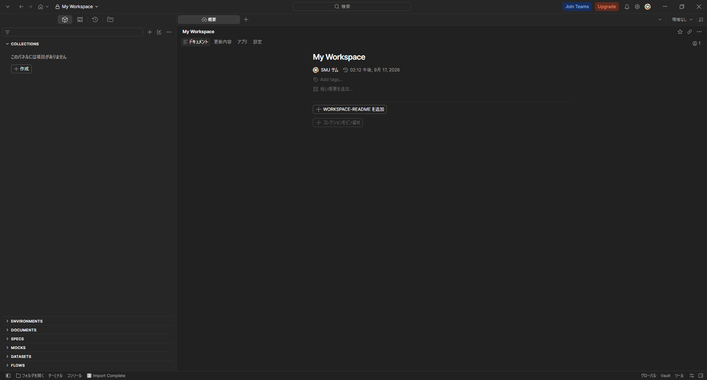
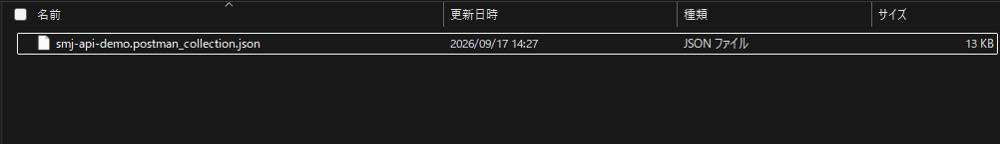
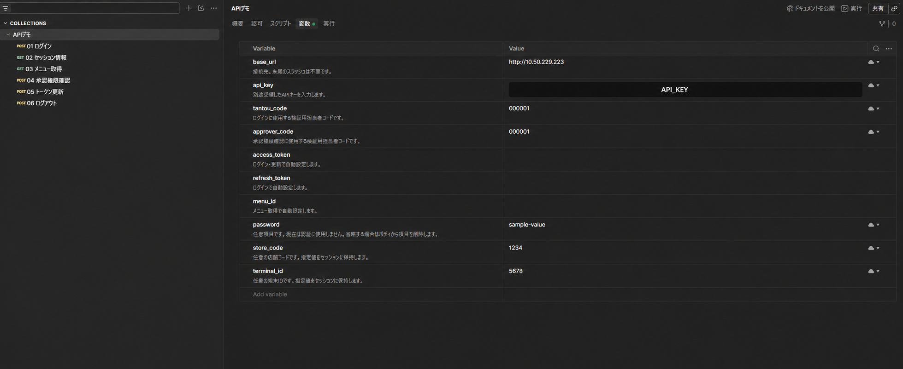
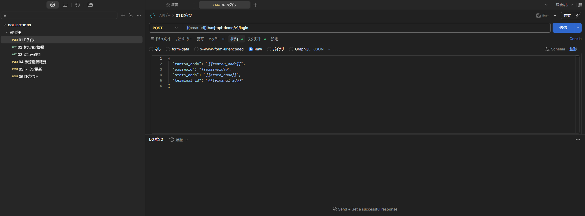
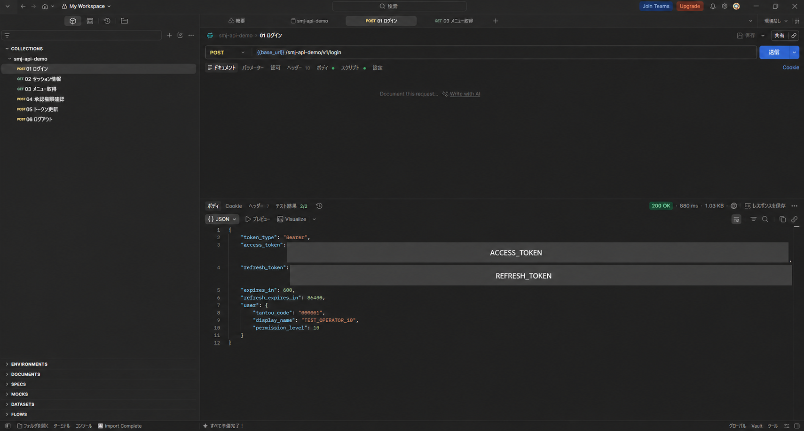
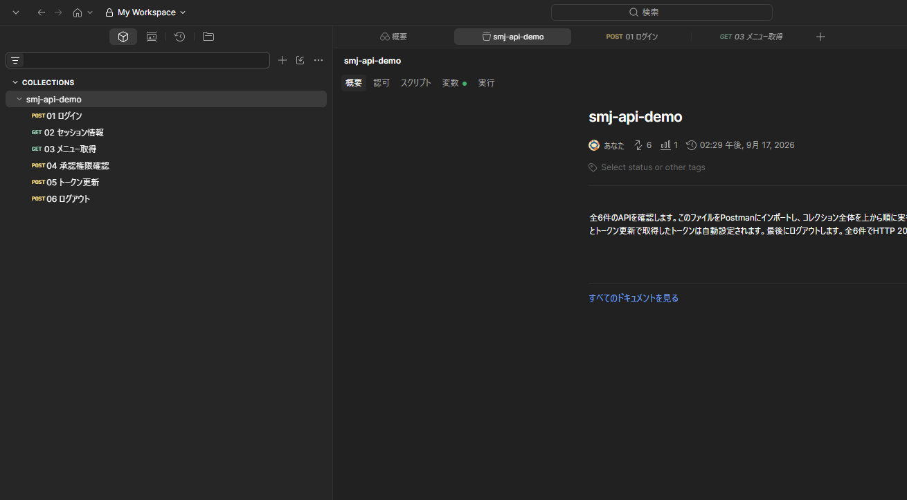

# APIデモ仕様書（案）

タブレットPOSシステム

| 項目 | 内容 |
|---|---|
| 作成者 | SMJ サム |
| 作成日 | 2026/09/17 |

## 接続仕様

| 項目 | 内容 |
|---|---|
| ベースURL | http://10.50.229.223:18080/smj-api-demo/v1 |
| 通信形式 | HTTP／JSON（UTF-8） |
| APIキー | 全APIのx-api-keyヘッダーに、別途受領したキーを指定します。 |
| 認証 | ログインで取得したトークンを使用します。指定方法は各APIのリクエスト欄を参照してください。 |
| 接続確認 | GET http://10.50.229.223:18080/health。認証不要で、正常時はHTTP 200を返します。 |

社外ネットワークから利用する場合は、AkamaiのVPNクライアントでシャープ幕張のネットワークに接続してからAPIを呼び出してください。
必須欄の○は必須、空欄は省略可能です。必須項目にnullは指定できません。子項目の○は、親オブジェクトまたは配列の各要素内での必須を示します。

## 検証手順

1. Postmanで接続先を「接続仕様」のベースURLに設定し、各APIのx-api-keyに別途受領したキーを指定します。
2. 「ログイン」のリクエスト例を送信します。passwordはデモでは認証に使用しません。
3. 取得したaccess_tokenを認証が必要なAPIのAuthorizationに指定します。アクセストークン再発行依頼では、refresh_tokenも本文に指定します。
4. セッション情報、メニュー取得、承認権限確認、アクセストークン再発行依頼、ログアウトの順に呼び出し、各シートに記載したレスポンスを確認します。

### 操作画面

以下の画像は操作箇所の参考です。画像内のURL、項目名、応答値は現在のAPIと異なるため、設定値と送受信内容は本書の各APIシートに従ってください。

初期画面と取込み用ファイル





変数とログインの入力画面





実行結果とコレクション画面





ログインとアクセストークン再発行依頼は、基本設計書_API定義書_共通_Ver.0.0.7.xlsxの項目に合わせています。他のAPIはデモ用です。

## API一覧

すべてのパスは「接続仕様」シートのベースURLに続けて指定します。全APIでx-api-keyが必要です。

| No. | 機能 | HTTPメソッド | ベースURL以降のパス | 必要なトークン | 処理結果 |
| --- | --- | --- | --- | --- | --- |
| 1 | ログイン | POST | /login | 不要 | 担当者コードを確認し、2種類のトークンを返します。 |
| 2 | アクセストークン再発行依頼 | POST | /access-token-saihakko-irai | アクセストークンとリフレッシュトークン | 有効なセッションのリフレッシュトークンから、新しいアクセストークンを発行します。 |
| 3 | ログアウト | POST | /logout | アクセストークン | 現在のセッションを失効させ、そのセッションの両トークンを無効にします。 |
| 4 | セッション情報取得 | GET | /me | アクセストークン | セッションの担当者、店舗、端末情報を返します。 |
| 5 | メニュー取得 | GET | /menus | アクセストークン | 店舗と端末でメニューを絞り込み、ページ単位で取得します。承認要否も返します。 |
| 6 | 承認権限合計の確認 | POST | /authorizations | アクセストークン | 重複しない担当者の権限を合計し、メニューの必要権限と比較します。 |

## エラー一覧

呼び出し側はtitleのエラーコードで処理を分け、利用者向けのメッセージを表示します。pointerがある場合は該当する入力項目に、ない場合は画面全体にエラーを表示します。

### エラーレスポンス形式

| 項目名 | データ型 | 必須 | 説明 |
|---|---|---|---|
| type | string | ○ | エラー種別の識別子です。通常の処理分岐にはtitleを使用します。 |
| title | string | ○ | 処理分岐に使用するエラーコードです。下表と照合します。 |
| status | integer | ○ | HTTPステータスコードです。 |
| errors | array<object> | ○ | エラー内容です。最初に検出した1件を返します。 |
| errors[].detail | string | ○ | エラーコードです。そのまま利用者向けメッセージとして表示しません。 |
| errors[].pointer | string |  | リクエスト内のエラー箇所です。ソースコードへのリンクではありません。ない場合もあります。 |

### エラーコードと対応

<table>
<tr><th>HTTPステータス</th><th>エラーコード</th><th>内容</th><th>呼び出し側の対応</th></tr>
<tr><td rowspan="18">400</td><td>invalid_json</td><td>JSONの形式が不正です。</td><td>JSONの構文を修正します。</td></tr>
<tr><td>invalid_body</td><td>本文の形式が不正です。</td><td>本文をJSONオブジェクトで送信します。</td></tr>
<tr><td>unknown_field</td><td>このAPIで受け付けない項目があります。</td><td>pointerで示された項目を削除します。</td></tr>
<tr><td>invalid_employee_code</td><td>担当者コードの形式が不正です。</td><td>5桁の数字を文字列で指定します。</td></tr>
<tr><td>invalid_password</td><td>passwordが未指定、空文字、または型が不正です。</td><td>空でない文字列を指定します。</td></tr>
<tr><td>invalid_hojin_code</td><td>法人コードの形式が不正です。</td><td>数字3桁の文字列を指定します。</td></tr>
<tr><td>invalid_mise_code</td><td>店コードの形式が不正です。</td><td>数字4桁の文字列を指定します。</td></tr>
<tr><td>invalid_tanmatsu_no</td><td>端末番号の形式が不正です。</td><td>数字2桁の文字列を指定します。</td></tr>
<tr><td>invalid_training_mode</td><td>運用モードの指定が不正です。</td><td>本番は1、トレーニングは2を文字列で指定します。</td></tr>
<tr><td>invalid_application_version</td><td>アプリバージョンが未指定、または型が不正です。</td><td>空でない文字列を指定します。</td></tr>
<tr><td>invalid_login_user_hojin_code</td><td>再発行時の法人コードが未指定、または型が不正です。</td><td>ログイン時の法人コードを指定します。</td></tr>
<tr><td>invalid_login_user_tempo_code</td><td>再発行時の店コードが未指定、または型が不正です。</td><td>ログイン時の店コードを指定します。</td></tr>
<tr><td>invalid_login_user_tanmatsu_no</td><td>再発行時の端末番号が未指定、または型が不正です。</td><td>ログイン時の端末番号を指定します。</td></tr>
<tr><td>session_context_mismatch</td><td>再発行時の情報がログイン時と一致しません。</td><td>pointerで示された項目をログイン時の値に合わせます。</td></tr>
<tr><td>invalid_menu_id</td><td>menu_idが未指定、または形式が不正です。</td><td>メニュー取得で返されたmenu_idを指定します。</td></tr>
<tr><td>invalid_pagination</td><td>取得範囲の指定が不正です。</td><td>offsetは0～1000000、limitは1～100で指定します。</td></tr>
<tr><td>invalid_approvers</td><td>承認者の指定が不正です。</td><td>approver_codesを1件以上の配列で指定します。</td></tr>
<tr><td>duplicate_approver</td><td>承認者が重複しています。</td><td>重複する担当者コードを除きます。</td></tr>
<tr><td rowspan="7">401</td><td>invalid_api_key</td><td>APIキーが未指定、または不正です。</td><td>x-api-keyの設定値を確認します。</td></tr>
<tr><td>invalid_employee</td><td>担当者が未登録、または無効です。</td><td>有効な担当者コードを入力し直します。</td></tr>
<tr><td>access_token_required</td><td>アクセストークンが未指定です。</td><td>AuthorizationにBearerとアクセストークンを指定します。</td></tr>
<tr><td>invalid_token</td><td>トークンが未指定、または無効です。</td><td>使用するトークンとヘッダーを確認し、必要なら再ログインします。</td></tr>
<tr><td>access_token_expired</td><td>アクセストークンの期限が切れています。</td><td>トークンを更新し、元のAPIを再実行します。</td></tr>
<tr><td>refresh_token_expired</td><td>リフレッシュトークンの期限が切れています。</td><td>再ログインします。</td></tr>
<tr><td>session_revoked</td><td>セッションが無効です。</td><td>再ログインします。</td></tr>
<tr><td rowspan="1">403</td><td>insufficient_permission</td><td>承認者の権限が不足しています。</td><td>必要な権限を持つ担当者を指定します。</td></tr>
<tr><td rowspan="2">404</td><td>menu_not_found</td><td>対象メニューが見つかりません。</td><td>メニューを再取得し、選び直します。</td></tr>
<tr><td>not_found</td><td>呼び出し先が見つかりません。</td><td>URLとパスを確認します。</td></tr>
<tr><td rowspan="1">405</td><td>method_not_allowed</td><td>HTTPメソッドが不正です。</td><td>API一覧のGET／POSTに合わせます。</td></tr>
<tr><td rowspan="1">413</td><td>body_too_large</td><td>本文が大きすぎます。</td><td>本文を16384バイト以内にします。</td></tr>
<tr><td rowspan="1">415</td><td>json_required</td><td>本文のデータ形式が不正です。</td><td>Content-Typeにapplication/jsonを指定します。</td></tr>
<tr><td rowspan="2">502</td><td>function_unavailable</td><td>サーバーの処理を完了できませんでした。</td><td>利用者に再試行を案内します。続く場合は管理者へ連絡します。</td></tr>
<tr><td>invalid_function_response</td><td>サーバーから正常な応答を取得できませんでした。</td><td>利用者に再試行を案内します。続く場合は管理者へ連絡します。</td></tr>
<tr><td rowspan="3">503</td><td>configuration_missing</td><td>サービスを利用できません。</td><td>管理者へ連絡します。</td></tr>
<tr><td>session_store_unavailable</td><td>セッション情報を処理できません。</td><td>時間をおいて再試行します。続く場合は管理者へ連絡します。</td></tr>
<tr><td>service_unavailable</td><td>サービスを利用できません。</td><td>時間をおいて再試行します。続く場合は管理者へ連絡します。</td></tr>
</table>

### エラーレスポンス例

次の応答では、担当者コード欄に入力形式のエラーを表示します。

```json
{
  "type": "/smj-api-demo/problems/invalid_employee_code",
  "title": "invalid_employee_code",
  "status": 400,
  "errors": [
    {
      "detail": "invalid_employee_code",
      "pointer": "#/tantosha_code"
    }
  ]
}
```

## 区分_API仕様

| 項目 | 内容 |
|---|---|
| 区分名 | API仕様 |

## ログイン

### 処理概要

`POST /smj-api-demo/v1/login`（API-SYS-001010）で担当者を確認し、トークンを返します。

### リクエスト

Content-TypeとAcceptはapplication/jsonです。x-api-keyを指定します。X-Request-Id（UUID）とX-Request-Date（HTTP日時）は指定できますが、デモでは検証しません。Authorizationは不要です。

| 項目 | 型 | 必須 | 説明 |
|---|---|---|---|
| tantosha_code | string | ○ | 担当者コード。数字5桁です。 |
| password | string | ○ | 将来用の固定文字列です。デモでは空でない文字列を受け付け、認証には使用しません。 |
| hojin_code | string | ○ | 法人コード。数字3桁です。 |
| mise_code | string | ○ | 店コード。数字4桁です。 |
| tanmatsu_no | string | ○ | 端末番号。数字2桁です。 |
| training_mode | string | ○ | 1は本番モード、2はトレーニングモードです。 |
| application_version | string | ○ | アプリのバージョンです。 |

```json
{
  "tantosha_code": "00001",
  "password": "sample-value",
  "hojin_code": "011",
  "mise_code": "1071",
  "tanmatsu_no": "02",
  "training_mode": "1",
  "application_version": "1.0.0"
}
```

### レスポンス

正常時はHTTP 200です。応答項目は次のとおりです。担当者情報はGET /meで確認します。

| 項目 | 型 | 説明 |
|---|---|---|
| kekka_code | string | デモの正常コードは00001です。 |
| access_token | string | API認証用のJWTです。 |
| refresh_token | string | アクセストークン再発行用の32文字のトークンです。 |
| token_type | string | Bearerです。 |
| yukokigen | integer | アクセストークンの有効時間（秒）です。デモでは600秒です。 |

```json
{
  "kekka_code": "00001",
  "token_type": "Bearer",
  "access_token": "ACCESS_TOKEN",
  "refresh_token": "取得した32文字のトークン",
  "yukokigen": 600
}
```

## アクセストークン再発行依頼

### 処理概要

`POST /smj-api-demo/v1/access-token-saihakko-irai`（API-SYS-001030）でアクセストークンを再発行します。

### リクエスト

ログインと同じ共通ヘッダーに加え、Authorization: Bearer ACCESS_TOKENを指定します。refresh_tokenはヘッダーではなく本文に設定します。

| 項目 | 型 | 必須 | 説明 |
|---|---|---|---|
| login_user_hojin_code | string | ○ | ログイン時の法人コードです。 |
| login_user_tempo_code | string | ○ | ログイン時の店コードです。 |
| login_user_tanmatsu_no | string | ○ | ログイン時の端末番号です。 |
| training_mode | string | ○ | ログイン時のモードです。 |
| application_version | string | ○ | ログイン時のアプリバージョンです。 |
| refresh_token | string | ○ | ログインで取得した32文字のトークンです。 |

```json
{
  "login_user_hojin_code": "011",
  "login_user_tempo_code": "1071",
  "login_user_tanmatsu_no": "02",
  "training_mode": "1",
  "application_version": "1.0.0",
  "refresh_token": "取得した32文字のトークン"
}
```

### レスポンス

ログインのレスポンスと同じ項目を返します。access_tokenを新しい値に置き換えます。デモではrefresh_tokenを再利用し、有効期間はログインから1日です。yukokigenは最大600秒で、セッションの残り時間を超えません。

### デモの適用範囲

期限切れのアクセストークンは、署名とセッションが正しく、有効なrefresh_tokenと組み合わせた場合に限り再発行で受け付けます。他のAPIでは期限切れを拒否します。この扱いとトークンの更新方式はデモの実装条件です。
共通エラーのkekka_codeとmessage_idはデモの対象外です。エラーは本書の形式で返します。HTTPSとHSTSは実行環境側の対応が必要です。

## ログアウト

### 処理概要

`POST /smj-api-demo/v1/logout` — 使用中のセッションを終了します。以後、そのセッションの両トークンは使用できません。別のセッションには影響しません。アクセストークンが期限切れの場合は、更新してから呼び出してください。

### リクエスト

| 項目名 | データ型 | 設定位置 | 必須 | 説明 | 仕様 |
| --- | --- | --- | --- | --- | --- |
| Content-Type | string | ヘッダー |  | リクエスト本文のデータ形式です。 | 本文を送信する場合はapplication/jsonを指定します。本文を省略する場合は不要です。 |
| x-api-key | string | ヘッダー | ○ | APIの認証キーです。 | 配布されたAPIキーを指定します。 |
| Authorization | string | ヘッダー | ○ | APIを呼び出すセッションの認証情報です。 | Authorization: Bearer ACCESS_TOKENを指定します。 |

本文は省略または{}を指定します。

#### リクエスト例

```json
{}
```

### レスポンス

正常時はHTTP 200を返します。

| 項目名 | データ型 | 必須 | 説明 | 仕様 |
| --- | --- | --- | --- | --- |
| logged_out | boolean | ○ | ログアウトの処理結果です。 | セッションの失効に成功した場合はtrueです。 |

#### レスポンス例

```json
{
  "logged_out": true
}
```

## セッション情報

### 処理概要

`GET /smj-api-demo/v1/me` — ログイン中の担当者、店舗、端末の情報を取得します。

### リクエスト

| 項目名 | データ型 | 設定位置 | 必須 | 説明 | 仕様 |
| --- | --- | --- | --- | --- | --- |
| x-api-key | string | ヘッダー | ○ | APIの認証キーです。 | 配布されたAPIキーを指定します。 |
| Authorization | string | ヘッダー | ○ | APIを呼び出すセッションの認証情報です。 | Authorization: Bearer ACCESS_TOKENを指定します。 |

リクエスト本文は不要です。

### レスポンス

正常時はHTTP 200を返します。

| 項目名 | データ型 | 必須 | 説明 | 仕様 |
| --- | --- | --- | --- | --- |
| user | object | ○ | ログイン担当者の情報です。 | - |
| user.tantou_code | string | ○ | 担当者コードです。 | 先頭の0を保持してください。 |
| user.display_name | string | ○ | 担当者の表示名です。 | - |
| user.permission_level | integer | ○ | 担当者の権限レベルです。 | - |
| store_code | string | ○ | セッションの対象店舗コードです。 | ログインした店舗の値です。 |
| terminal_id | string | ○ | セッションの対象端末IDです。 | ログインした端末の値です。 |

#### レスポンス例

```json
{
  "user": {
    "tantou_code": "00001",
    "display_name": "TEST_OPERATOR_10",
    "permission_level": 10
  },
  "store_code": "1071",
  "terminal_id": "02"
}
```

## メニュー取得

### 処理概要

`GET /smj-api-demo/v1/menus` — ログイン中の店舗と端末で利用するメニューを取得します。追加承認が必要なメニューはrequires_approvalで判別してください。

### リクエスト

| 項目名 | データ型 | 設定位置 | 必須 | 説明 | 仕様 |
| --- | --- | --- | --- | --- | --- |
| x-api-key | string | ヘッダー | ○ | APIの認証キーです。 | 配布されたAPIキーを指定します。 |
| Authorization | string | ヘッダー | ○ | APIを呼び出すセッションの認証情報です。 | Authorization: Bearer ACCESS_TOKENを指定します。 |
| offset | integer | クエリ |  | 取得を開始する位置です。先頭を0とします。 | 0～1000000で指定します。既定値は0です。数字のみ使用でき、負号や小数は指定できません。 |
| limit | integer | クエリ |  | 1回で取得する最大件数です。 | 1～100で指定します。既定値は20です。数字のみ使用できます。 |

リクエスト本文は不要です。クエリの例：?offset=0&limit=20。

### レスポンス

正常時はHTTP 200を返します。

| 項目名 | データ型 | 必須 | 説明 | 仕様 |
| --- | --- | --- | --- | --- |
| offset | integer | ○ | 取得を開始する位置です。先頭を0とします。 | リクエストで指定した開始位置です。省略時は0です。 |
| limit | integer | ○ | 1回で取得する最大件数です。 | リクエストで指定した最大取得件数です。省略時は20です。 |
| total | integer | ○ | 取得対象のメニュー総数です。 | 店舗と端末で絞り込んだ後、ページング前のメニュー総数です。 |
| menu_items | array | ○ | 取得したメニューの一覧です。 | 該当するメニューがない場合は空配列です。 |
| menu_items[].menu_id | string | ○ | メニューコードです。 | - |
| menu_items[].title | string | ○ | メニューの表示名です。 | - |
| menu_items[].route_name | string | ○ | メニュー選択時の遷移先ルート名です。 | - |
| menu_items[].implemented | boolean | ○ | 対応する業務画面の提供有無です。 | 本環境ではfalseです。業務画面の提供対象外です。 |
| menu_items[].required_permission_level | integer | ○ | メニューの利用に必要な権限レベルです。 | - |
| menu_items[].requires_approval | boolean | ○ | ログイン担当者に追加の承認が必要かを示します。 | ログイン担当者の権限が必要権限を下回る場合はtrueです。その場合もメニューは応答に含まれます。 |

#### レスポンス例

```json
{
  "offset": 0,
  "limit": 20,
  "total": 2,
  "menu_items": [
    {
      "menu_id": "M005",
      "title": "売上",
      "route_name": "SalesPage",
      "implemented": false,
      "required_permission_level": 0,
      "requires_approval": false
    },
    {
      "menu_id": "TEST_APPROVAL",
      "title": "TEST_APPROVAL",
      "route_name": "TestApprovalPage",
      "implemented": false,
      "required_permission_level": 10,
      "requires_approval": false
    }
  ]
}
```

## 承認権限確認

### 処理概要

`POST /smj-api-demo/v1/authorizations` — 指定した担当者の権限合計で、対象メニューの必要権限を満たすか確認します。権限不足の場合は403です。このAPIは権限の確認のみを行い、取引の実行や承認記録の保存は行いません。

### リクエスト

| 項目名 | データ型 | 設定位置 | 必須 | 説明 | 仕様 |
| --- | --- | --- | --- | --- | --- |
| Content-Type | string | ヘッダー | ○ | リクエスト本文のデータ形式です。 | application/jsonを指定します。 |
| x-api-key | string | ヘッダー | ○ | APIの認証キーです。 | 配布されたAPIキーを指定します。 |
| Authorization | string | ヘッダー | ○ | APIを呼び出すセッションの認証情報です。 | Authorization: Bearer ACCESS_TOKENを指定します。 |
| menu_id | string | 本文 | ○ | 権限確認の対象メニューコードです。 | メニュー取得APIで返されたmenu_items[].menu_idを指定します。省略、null、空文字、string以外は400を返します。 |
| approver_codes | array<string> | 本文 | ○ | 権限を合算する担当者コードの一覧です。 | 重複しない1件以上を指定します。各コードは5桁の数字の文字列で、有効な担当者に限ります。各担当者のパスワードやトークンは不要です。 |

#### リクエスト例

```json
{
  "menu_id": "TEST_APPROVAL",
  "approver_codes": [
    "00002",
    "00003",
    "00004"
  ]
}
```

### レスポンス

正常時はHTTP 200を返します。

| 項目名 | データ型 | 必須 | 説明 | 仕様 |
| --- | --- | --- | --- | --- |
| authorized | boolean | ○ | 指定した担当者の権限合計による判定結果です。 | 権限合計が必要権限以上の場合はtrueです。 |
| menu_id | string | ○ | 権限確認の対象メニューコードです。 | - |
| combined_permission_level | integer | ○ | 指定した担当者の権限レベルの合計です。 | approver_codesの権限合計です。ログイン担当者の権限は自動加算しません。 |
| required_permission_level | integer | ○ | 対象メニューの利用に必要な権限レベルです。 | 判定に使用した権限レベルです。 |

#### レスポンス例

```json
{
  "authorized": true,
  "menu_id": "TEST_APPROVAL",
  "combined_permission_level": 10,
  "required_permission_level": 10
}
```
