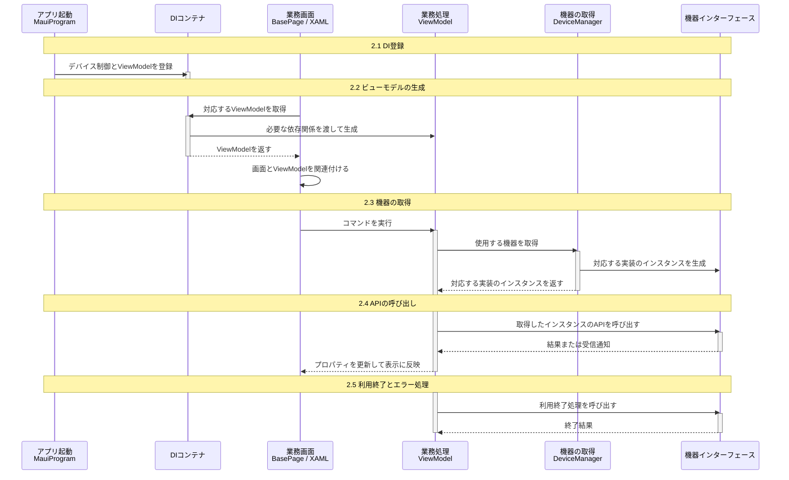

## 表紙

| 項目 | 内容 |
| --- | --- |
| PJ名 | タブレットPOS |
| システム名 | タブレットPOS |
| サブシステム名 | デバイス制御基盤 |
| 文書ID | IF-DEVICE-01 |
| 成果物名 | デバイス制御インターフェース基本設計書 |
| 版数 | 0.1.2 |
| 作成日 | 2026-09-08 |
| 作成者 | SMJサム |

本書は、業務画面の開発担当者向けに、デバイス制御層のAPI、入力情報、結果と組込み方法を定義します。デバイスコネクタを利用する機器もデバイス制御層を経由して操作するため、画面側でデバイスコネクタを直接操作する必要はありません。

## 変更履歴

| No. | 版数 | 変更日 | 区分 | 変更箇所（項番等） | 変更内容 | 担当者 |
| --- | --- | --- | --- | --- | --- | --- |
| 1 | 0.1.0 | 2026-09-08 | 新規 | 全体 | デバイス制御インターフェースを定義しました。 | SMJサム |
| 2 | 0.1.1 | 2026-09-10 | 変更 | 10.3 | request（PaymentBusinessRequest）の項目ごとに、使用するAPIと指定条件を整理しました。 | SMJサム |
| 3 | 0.1.2 | 2026/09/11 | 変更 | 全体 | システム名、資料名と参照先を統一しました。 | SMJサム |

## 目次

```text
1. 全体構成と対象範囲
2. 組込み手順

区分_デバイスインターフェース
  3. キーボード
  4. スキャナ
  5. ドロア
  6. カスタマディスプレイ
  7. レシートプリンタ
  8. ハンディターミナル
  9. 自動釣銭機
  10. 決済端末

区分_業務連携インターフェース
  11. A4帳票印刷

12. 既存機能との対応
```

## 1. 全体構成と対象範囲

### 1.1. 設計方針

本書はWindows、iOSおよびAndroidを対象とします。同じインターフェースを使用しても、利用できる機能はOS、機種および接続方式によって異なります。

CAFIS Archの決済端末制御は対象です。既存の業務APIを利用するPOSAカード取引およびQR決済の業務処理は対象外です。業務APIによる取引と、接続した機器の制御を分けて扱います。

| OS | 制御方法 | 呼び出し側の扱い |
| --- | --- | --- |
| Windows | 対応する実装から機器を直接制御するか、デバイスコネクタへ処理を依頼します。 | 設定された機器をDeviceManagerから取得します。 |
| iOS | アプリ内の対応する実装から機器を直接制御します。デバイスコネクタは使用しません。 | Windowsと同じ取得用APIを使用します。機器の実装と各操作の対応を確認して利用します。 |
| Android | アプリ内の対応する実装から機器を直接制御します。デバイスコネクタは使用しません。 | iOSと同じ制御方針です。iOSでの対応をAndroidでの対応とは扱いません。 |


### 1.2. 対象機器と利用条件

対象OSと、各機能を利用できる範囲は区別します。以下は本書のAPIに対応する実装範囲です。過去の評価結果だけで、今回の実装の動作を保証するものではありません。

| 対象 | Windows | iOS | Android | 利用条件の参照先 |
| --- | --- | --- | --- | --- |
| キーボード | Raw Inputでキー入力を通知 | 本APIの提供なし | 本APIの提供なし | 3章 |
| スキャナ | AT30Qのシリアル接続 | 内蔵カメラ、BLE接続の実装 | 読取りAPIは利用不可 | 4章 |
| ドロア | 専用インターフェースから制御 | プリンタ経由の制御は7章で扱います | 専用インターフェースの提供なし | 5章、7章 |
| カスタマディスプレイ | OPOS経由 | 表示処理の実装あり。完了待ちの制約は6.3に記載 | 表示APIは利用不可 | 6章 |
| レシートプリンタ | OPOS経由 | Epson SDK経由。APIごとの差は7.3に記載 | 印刷APIの提供なし | 7章 |
| ハンディターミナル | シリアル接続で送受信 | 実装の登録なし | 実装の登録なし | 8章 |
| 自動釣銭機 | OPOS経由。シリアル直接制御は一部操作のみ | 実装の登録なし | 実装の登録なし | 9章 |
| CAFIS Arch決済端末 | デバイスコネクタ経由 | 実装の登録なし | 実装の登録なし | 10章 |
| A4帳票印刷 | PDF印刷実装の登録が必要 | PDF印刷実装の登録が必要 | PDF印刷実装の登録が必要 | 11章 |

機種名は各機器の概要に記載します。対象OSに含まれていても、本表で提供しないAPIは呼び出しません。機種や接続方式を追加する場合は、対応する実装、設定、必要な権限および実機での動作を確認してから利用対象に加えます。プロジェクトファイルの最小OSバージョンは、動作保証済みのOS一覧とは区別します。

### 1.3. 組込みシーケンス

業務画面のViewModel、またはViewModelから利用する共通部品から機器を呼び出します。図の各段階に対応する実装方法を2.1～2.5に記載します。共通部品を介する場合も、機器を呼び出す側が同じインスタンスを保持します。



A4帳票印刷は、機器取得の代わりに対応するインターフェースをDIから受け取ります。取得方法は2.3に記載します。

### 1.4. 各層の役割

| 層 | 担当する処理 | 呼び出し先 |
| --- | --- | --- |
| 業務画面とViewModel | 操作を開始し、取得した結果を業務の入力として扱います。表示の更新、入力の妥当性確認、業務を続けるかの判断を行います。 | デバイス制御層、または画面用の共通部品 |
| 画面用の共通部品 | 複数画面で共用する入力処理や表示処理をまとめます。機器を使用する間の呼び出しと結果の受け渡しを管理します。 | デバイス制御層 |
| デバイス制御層 | 設定とOSに応じて実装を選び、機器への要求と結果を共通インターフェースで扱います。 | 直接制御のSDK、またはWindowsのデバイスコネクタ |
| デバイスコネクタ | Windowsの別プロセスで既存のOPOS、OCXおよびDLLを呼び出します。処理結果と機器からの通知をアプリへ返します。 | ドライバー、既存ライブラリ |
| SDKとドライバー | 機器固有の通信と制御を行います。 | 接続した機器 |

本表は処理の責務を示します。会社ごとの開発担当の割当ては本書では定義しません。

### 1.5. 接続と終了の扱い

Windowsでは、デバイスコネクタへの要求と応答をコマンド用の通信路、機器からの通知をイベント用の通信路で扱います。業務画面からこれらの通信路を直接操作しません。iOSとAndroidでは、対応する実装がSDKまたはOSの機能を呼び出します。

OPOSのOpen、Claim、DeviceEnabled、ReleaseおよびCloseは、デバイスコネクタ側で扱います。画面側は本書のStartとEndを使用します。ただし、Startが常にOpen、Endが常にCloseに一対一で対応するわけではありません。ドロアのように操作単位で利用権を取得して解放する実装もあります。アプリのプロセス終了と、画面での機器利用終了は区別します。

設定項目と設定値の記載方法は、2.1.2の設定資料を参照します。デバイスコネクタ内部の通信とプロセス管理は「基本設計書_端末アプリ_デバイスコネクタ.xlsx」を参照します。

## 2. 組込み手順

### 2.1. DI登録

#### 2.1.1. 登録内容

`MauiProgram.cs`でデバイス制御とViewModelを登録します。機器の登録はアプリ起動時に行い、画面ごとには行いません。`DeviceManager`と`DeviceRuntime`はアプリ内で共用し、ViewModelはDIから取得する際に生成します。

#### 2.1.2. 登録箇所

```csharp
// Pos.Applications/MauiProgram.cs

builder.Services.AddPosDeviceCtrl();
builder.Services.AddViewModels();
```

共通通信の開始と停止は`DeviceControlWindow`が行います。接続設定は「設定ファイル記載要領_端末アプリ_デバイス制御.xlsx」の3章、記載例は7章を参照します。

### 2.2. ビューモデルの生成

#### 2.2.1. 生成方法

`BasePage.OnLoaded`が対応するViewModelをDIから取得し、画面と関連付けます。ViewModelのコンストラクタには、必要な依存関係を追加します。

`AddViewModels()`の自動登録対象は、`BaseViewModel`と同じアセンブリにある非抽象の派生クラスです。画面の型名の`.Views.`を`.ViewModels.`へ置き換え、末尾に`ViewModel`を付けた型を取得します。既に画面にデータが関連付けられている場合は、ViewModelを自動取得しません。手動生成している箇所では、DIからの取得に変更します。

#### 2.2.2. 例：既存ビューモデルへの引数追加

以下は`MainPageViewModel`への追加例です。既存の引数と処理を保持し、`DeviceManager`と`DeviceRuntime`を受け取ります。

```csharp
private readonly DeviceManager _devices;
private readonly DeviceRuntime _deviceRuntime;

public MainPageViewModel(
    INavigationService navigationService,
    DeviceManager devices,
    DeviceRuntime deviceRuntime)
{
    _navigationService = navigationService;
    _devices = devices;
    _deviceRuntime = deviceRuntime;
}
```

### 2.3. インスタンスの取得

#### 2.3.1. 取得方法

ViewModelから`DeviceManager`を呼び出し、必要な機器を取得します。デバイス制御層が実装を選択してインスタンスを生成します。利用中は同じインスタンスを保持し、操作のたびに取得し直しません。

| 対象 | インターフェース | 取得方法 |
| --- | --- | --- |
| スキャナ | IBarcodeScannerStrategy | DeviceManager.GetScannerStrategyAsync() |
| レシートプリンタ | IPrinterStrategy | DeviceManager.GetPrinterStrategyAsync() |
| 決済端末 | IPaymentStrategy | DeviceManager.GetPaymentStrategyAsync() |
| 自動釣銭機 | ICashChangerStrategy | DeviceManager.GetCashChangerStrategyAsync() |
| カスタマディスプレイ | ICustomerDisplayStrategy | DeviceManager.GetCustomerDisplayStrategyAsync() |
| ドロア | IDrawerStrategy | DeviceManager.GetDrawerStrategyAsync() |
| キーボード | IKeyboardStrategy | DeviceManager.GetKeyboardStrategyAsync() |
| ハンディターミナル | IHandyTerminal | DeviceManager.GetHandyTerminalAsync() |

A4帳票印刷は、他のサービスと同様にDIに登録し、ViewModelのコンストラクタで受け取ります。`DeviceManager`による取得と`Start`／`End`は使用しません。

| 対象 | インターフェース | 取得方法 |
| --- | --- | --- |
| A4帳票印刷 | IA4ReportService | PDF印刷の実装をDIに登録し、ViewModelのコンストラクタで受け取ります。 |


#### 2.3.2. 実装例

スキャナのインスタンスを取得する例です。

```csharp
// ViewModelのフィールド

private IBarcodeScannerStrategy? _scanner;

// 利用開始時に取得

_scanner = await _devices.GetScannerStrategyAsync();
```

取得結果が`null`の場合は利用を開始しません。設定の不備や実装の生成失敗では例外が発生する場合もあります。インスタンスを取得できても、すべての操作を利用できるとは限りません。複数OSで共用する画面では、未登録のインターフェースを必須引数にせず、DIから任意取得して利用可否を確認します。

### 2.4. APIの呼び出し

#### 2.4.1. 呼び出し方法

画面にバインドしたコマンドから、取得したインスタンスのAPIを呼び出します。戻り値とエラーの扱いは2.6に従います。コールバックの実行スレッドをUIスレッドとは扱わず、画面表示の更新はMainThreadで行います。APIの完了と実機の処理完了は、各APIの結果に従って判断します。入力情報と結果の定義は各インターフェースシートを参照します。

#### 2.4.2. 例：スキャナの呼び出しと表示

次はコマンド内の処理例です。`_scanner`の取得後、デバイス制御の共通初期化が完了した場合に実行します。例外は2.5の方針で処理します。

```csharp
if (!_deviceRuntime.IsRunning || _scanner is null) return;

await _scanner.Start();
await _scanner.Scan(code =>
{
    MainThread.BeginInvokeOnMainThread(() => Result1 = code);
});
```

画面では、コマンドと結果をバインドします。以下は読取り開始のコマンド名を`BeginScanCommand`とした例です。

```xml
<Button Text="読取り開始" Command="{Binding BeginScanCommand}" />
<Label Text="{Binding Result1}" />
```

`MainThread`は`Microsoft.Maui.ApplicationModel`を使用します。各例は同じViewModelへ組み込む処理の抜粋です。

### 2.5. 利用終了とエラー処理

#### 2.5.1. 終了時とエラー時の処理

利用が終わる処理から対象APIの終了処理を呼び出し、完了を待ちます。画面の破棄だけで接続が解放されるとは扱いません。操作中と終了処理が同時に実行されないようにします。

| 状況 | 呼び出し側の処理 |
| --- | --- |
| インスタンスを取得できない | 対象機能を無効にし、設定とOS別の実装を確認します。 |
| 操作が非対応 | 対応情報が提供される場合は事前確認します。`NotSupportedException`を受けた場合も、その操作を繰り返しません。 |
| 対応情報が不明または処理が実行されない | APIの完了だけで成功と判断せず、対象実装の対応範囲と結果を確認します。 |
| 実行結果が不明 | 処理状況を確認せず同じ要求を自動再送しません。 |
| 終了処理に失敗 | 終了済みと扱わず、利用できない状態を画面へ通知します。 |

#### 2.5.2. 例：スキャナの利用終了

```csharp
if (_scanner is not null)
{
    await _scanner.End();
    _scanner = null;
}
```

共通通信の停止はアプリ側が行います。ViewModelから`DeviceRuntime`を停止する処理は追加しません。

### 2.6. 戻り値とエラーの読み方

Taskを返すAPIはawaitで完了を待ちます。Taskだけを返すAPIは、await後に結果の値を受け取りません。Task&lt;T&gt;を返すAPIは、awaitの結果としてTの値を受け取ります。コールバックを受け取るAPIの通知回数と完了条件は、各機器の説明に従います。

| 通知方法 | 意味 | 呼び出し側の処理 |
| --- | --- | --- |
| ArgumentExceptionまたはArgumentOutOfRangeException | 引数の形式や範囲が不正です。 | 引数を修正します。同じ値で繰り返し呼び出しません。 |
| NotSupportedException | 対象の実装がその操作に対応していません。 | その操作を利用不可とし、対応する機能へ切り替えます。 |
| InvalidOperationException | 開始前の操作、重複操作、接続状態または結果の不備などにより処理できません。 | 機器の状態とエラー内容を確認します。 |
| NamedPipeCommunicationException | Windowsのデバイスコネクタとの接続または応答の受信に失敗しています。 | 内部例外とログを確認します。要求後の通信切断は処理失敗の確定とは扱いません。 |
| DeviceConnectorCommandException | Windowsのデバイスコネクタから失敗応答を受け取っています。 | ResponseのResultCodeとPayloadを確認します。 |
| TimeoutException、IOException、InvalidDataException | 直接接続での時間切れ、入出力異常またはデータ不正です。 | 各機器の終了と再接続の条件に従います。 |
| 結果オブジェクトのSuccessがfalse | APIが失敗結果を返しています。 | 例外が発生しなくても正常完了として扱いません。 |

上表は通知方法の分類です。すべてのAPIが同じ例外を返すという意味ではありません。Windows固有の例外型を使う処理はWindows向けのコードに分けます。機器の結果コードと業務上の判定を混同せず、画面に表示する案内は呼び出し側で決めます。

### 2.7. 再試行と画面終了

要求後に応答がない場合、呼び出し側は同じ操作を自動で繰り返しません。入出金、印刷、決済では、機器側ですでに処理されている可能性があるためです。接続の再試行と業務操作の再実行は分けて扱います。ハンディターミナルのレコード再送は8章の規則に従います。

画面を閉じた後の通知を画面へ反映しないよう、呼び出し側で利用状態を管理します。画面用共通部品とViewModelの双方から同じ機器を開始したり、同じ結果を二重に処理したりしません。機器インターフェースには共通の取消トークン引数を設けていないため、終了方法は各機器のEndの説明に従います。

### 2.8. 公開範囲

各機能一覧は、画面または画面用共通部品から利用するAPIを示します。ドライバーの統計情報、保守診断、独自電文の直接送信およびデバイスコネクタ内部のメソッドは、画面向けの利用手順に含めません。

## 区分_デバイスインターフェース

| 項目 | 内容 |
| --- | --- |
| 区分名 | デバイスインターフェース |

## 3. キーボード

### 3.1. 概要

対象機器：キーボード。
キー入力を受信し、入力内容を通知します。

### 3.2. 機能一覧

<!-- excel-render table-grid=wide -->

| No. | API | 機能 | 説明 | 入力情報 | 結果 |
| --- | --- | --- | --- | --- | --- |
| 1 | Start（config） | 利用開始 | 選択した機器を接続および初期化し、操作を受け付ける準備をします。 | - `config`：機器設定です。設定項目はCFG-01（2.1.2に記載）を参照します。保存済み設定は更新しません。 | 操作の完了。個別の結果情報は返しません。 |
| 2 | End（引数なし） | 利用終了 | 機器の利用終了を要求します。接続と利用権の扱いは1.5に従います。 | なし | 操作の完了。個別の結果情報は返しません。 |
| 3 | Listen（onKeyReceived） | キー入力の受信 | 画面が利用できる状態になってからキー入力を受け付けます。受信したキーを業務操作へ対応付け、同じ入力を二重に処理しないようにします。 | - `onKeyReceived`：キー入力を受け取る処理を指定します。キー値と入力元などが通知されます。 | キー値、仮想キー、スキャンコード、入力元、専用機器かどうか |


### 3.3. 通知データと完了条件

Listenの引数はAction&lt;KeyboardKeyEventArgs&gt;です。ListenのTaskは受信処理の登録後に完了し、キーが入力されるたびに通知します。キー1件の受信完了を待つAPIではありません。Startの前にはListenを呼び出しません。受信中の再登録では通知先を差し替えないため、変更する場合はEndからやり直します。

| 項目 | 型 | 説明 |
| --- | --- | --- |
| KeyValue | int | 修飾キーを含めて組み立てたキー値です。 |
| VirtualKey | int | Windowsの仮想キーコードです。 |
| ScanCode | int | キーボードから受け取ったスキャンコードです。 |
| DeviceId | string | 入力元の機器識別情報です。 |
| IsDedicated | bool | 専用POSキーボードからの入力の場合はtrueです。 |

Endで受信処理と通知先を解除します。通知を受けた後のキー値と業務操作の対応付けは、呼び出し側で行います。

## 4. スキャナ

### 4.1. 概要

対象機器：スキャナ（AT30Q）、iOS端末の内蔵カメラ。
読み取ったコードを通知します。内蔵カメラを使う場合は、カメラの利用を許可します。

### 4.2. 機能一覧

<!-- excel-render table-grid=wide -->

| No. | API | 機能 | 説明 | 入力情報 | 結果 |
| --- | --- | --- | --- | --- | --- |
| 1 | Start（config） | 利用開始 | 選択した機器を接続および初期化し、操作を受け付ける準備をします。 | - `config`：機器設定です。設定項目はCFG-01（2.1.2に記載）を参照します。保存済み設定は更新しません。 | 操作の完了。個別の結果情報は返しません。 |
| 2 | End（引数なし） | 利用終了 | 機器の利用終了を要求します。接続と利用権の扱いは1.5に従います。 | なし | 操作の完了。個別の結果情報は返しません。 |
| 3 | Scan（onDataReceived） | コードの読み取り | 1回の呼び出しでコードを1件読み取り、接続またはカメラを解放してから結果を通知します。次の読み取りではStartから実行します。 | - `onDataReceived`：読み取ったコードを受け取る処理を指定します。コードは文字列で1回通知されます。コードを取得せずに終了した場合はnullです。 | 読み取ったコード。有効なコードがない場合はnull。解放が完了するまでTaskは完了しません。 |


### 4.3. 読み取り条件と入力の確認

| 方式 | 読み取り条件 | 結果 |
| --- | --- | --- |
| WindowsのAT30Q | シリアル接続を使用します。読み取るコードの種類は機器側の設定に従います。 | Action&lt;string?&gt;で読み取り文字列を通知します。 |
| iOSの内蔵カメラ | EAN-13、EAN-8、Code 128を読取り対象に設定しています。 | コードの種類を表す項目は返さず、文字列だけを通知します。 |
| iOSのBLE接続 | BS80+で始まる機器名を探す実装です。内蔵カメラと同じ読取り方式ではありません。 | BLEで受信した文字列を通知します。 |
| Android | 現在のScan実装はNotSupportedExceptionを返します。 | 読み取り結果を返す提供機能として使用しません。 |

Scanには、コードの種類、桁数、チェックデジットの条件を指定する引数はありません。業務で許容する桁数やチェックデジットの確認は、結果を受け取る画面用共通部品または呼び出し側で行います。文字列の長さだけから、読み取ったコードの種類を確定しません。

### 4.4. 受信と終了

ScanはTaskを返し、結果の通知先は必須です。1回の読み取りが終わるまで、同じインスタンスで次のScanを開始しません。重複呼び出しはInvalidOperationExceptionになります。通信や解放に失敗した場合は、読み取り成功のコールバックではなく例外として扱います。

nullは有効なコードが得られなかったことを表します。Windowsでは未接続の状態でもnullとなるため、nullだけで利用者が取り消したと判定しません。先頭のゼロを保持するため、読み取り結果を数値へ変換せず文字列として受け渡します。

## 5. ドロア

### 5.1. 概要

対象機器：ドロア（UP-J36DW3）。
ドロアの開放と開閉状態の確認を行います。

### 5.2. 機能一覧

<!-- excel-render table-grid=wide -->

| No. | API | 機能 | 説明 | 入力情報 | 結果 |
| --- | --- | --- | --- | --- | --- |
| 1 | Start（config） | 利用開始 | 選択した機器を接続および初期化し、操作を受け付ける準備をします。 | - `config`：機器設定です。設定項目はCFG-01（2.1.2に記載）を参照します。保存済み設定は更新しません。 | 操作の完了。個別の結果情報は返しません。 |
| 2 | End（引数なし） | 利用終了 | 機器の利用終了を要求します。接続と利用権の扱いは1.5に従います。 | なし | 操作の完了。個別の結果情報は返しません。 |
| 3 | CheckStatus（引数なし） | 開閉状態の確認 | ドロアが開いているかを確認します。 | なし | Windows OPOSでは、真は「開いている」、偽は「開いていない」を表します。 |
| 4 | OpenDrawer（引数なし） | ドロア開放 | 現金を出し入れできるよう、ドロアを開きます。 | なし | 成功または失敗（真は成功） |
| 5 | WaitForDrawerClose（beepTimeout、beepFrequency、beepDuration、beepDelay） | ドロアが閉じるまでの待機 | ドロアが閉じるまで待ちます。指定した時間を過ぎても閉じない場合は警告音を鳴らします。 | - `beepTimeout`：ドロアが閉じない場合に警告音を開始するまでの待ち時間です。単位は対応ドライバーの仕様に従います。<br>- `beepFrequency`：警告音の周波数です。単位と指定範囲は対応ドライバーの仕様に従います。<br>- `beepDuration`：警告音を鳴らす長さです。時間単位は対応ドライバーの仕様に従います。<br>- `beepDelay`：警告音を繰り返す間隔です。時間単位は対応ドライバーの仕様に従います。 | 機器操作の結果 |


### 5.3. 戻り値の型

StartとEndはTask、CheckStatusとOpenDrawerはTask&lt;bool&gt;を返します。OpenDrawerは正常応答の場合にtrueを返し、Windowsの機器エラーでは例外になります。falseだけを確認する実装にしません。

WaitForDrawerCloseはTask&lt;OposCommandResult&gt;を返します。Supportedは操作に対応しているか、UnsupportedCapabilityは非対応の機能名、Valueは付加情報を表します。Supportedはドロアが閉じたかを示す値ではありません。

## 6. カスタマディスプレイ

### 6.1. 概要

対象機器：カスタマディスプレイ（RZ-4DP1）。
指定した文字列を表示します。

### 6.2. 機能一覧

<!-- excel-render table-grid=wide -->

| No. | API | 機能 | 説明 | 入力情報 | 結果 |
| --- | --- | --- | --- | --- | --- |
| 1 | Start（config） | 利用開始 | 選択した機器を接続および初期化し、操作を受け付ける準備をします。 | - `config`：機器設定です。設定項目はCFG-01（2.1.2に記載）を参照します。保存済み設定は更新しません。 | 操作の完了。個別の結果情報は返しません。 |
| 2 | End（引数なし） | 利用終了 | 機器の利用終了を要求します。接続と利用権の扱いは1.5に従います。 | なし | 操作の完了。個別の結果情報は返しません。 |
| 3 | DisplayText（data、attribute） | 文字列の表示 | 指定した文字列を表示します。 | - `data`：表示する文字列です。<br>- `attribute`：文字の表示方法を指定します。対応する表示方法と指定値は対象機種の仕様に従います。 | 操作の完了。個別の結果情報は返しません。 |
| 4 | DisplayTextAt（data、row、column、attribute） | 位置を指定した表示 | 指定した行と列から文字列を表示します。 | - `data`：表示する文字列です。<br>- `row`：表示を開始する行位置です。行番号の基準と指定範囲は対象機種の仕様に従います。<br>- `column`：表示を開始する列位置です。列番号の基準と指定範囲は対象機種の仕様に従います。<br>- `attribute`：文字の表示方法を指定します。対応する表示方法と指定値は対象機種の仕様に従います。 | 操作の完了。個別の結果情報は返しません。 |
| 5 | ClearText（引数なし） | 表示の消去 | 現在表示している文字を消します。 | なし | 操作の完了。個別の結果情報は返しません。 |
| 6 | ScrollText（direction、units） | スクロール表示 | 表示内容を指定した方向へ移動します。 | - `direction`：表示内容を移動する方向を指定します。方向と指定値の対応は対象機種の仕様に従います。<br>- `units`：表示内容を移動する量です。移動量の単位は対象機種の仕様に従います。 | 操作の完了。個別の結果情報は返しません。 |
| 7 | LinDsp（command、text） | 機種固有の表示 | 指定した表示区分に従って、お客様向けの文字列を表示します。 | - `command`：文字の表示方法を選ぶ区分です。対象機器の表示区分を指定します。<br>- `text`：お客様に表示する文字列です。 | 操作の完了。個別の結果情報は返しません。 |
| 8 | LinDspTelop（command、text、speed） | 機種固有のテロップ表示 | お客様向けの案内文を、指定した速さで流して表示します。 | - `command`：文字の表示方法を選ぶ区分です。対象機器の表示区分を指定します。<br>- `text`：お客様に表示する文字列です。<br>- `speed`：テロップを流す速度です。単位と指定可能な値は対象機種の仕様に従います。 | 操作の完了。個別の結果情報は返しません。 |
| 9 | Capabilities | 対応機能の確認 | スクロールなどの表示方法を使う前に、対象機器で利用できるかを確認します。 | なし | 対応機能の一覧 |


### 6.3. 利用できる操作と完了条件

WindowsではOPOSを経由して操作します。iOSではDisplayText、DisplayTextAtおよびClearTextの処理がありますが、DisplayTextとDisplayTextAtのTask完了は表示処理の完了を保証しません。表示完了を前提に後続の業務処理を開始する用途には使用しません。ScrollTextとRefreshWindowはiOSでは非対応です。Androidの表示APIは利用できません。

### 6.4. 対応機能の情報

CapabilitiesはCustomerDisplayCapabilities型です。IsAvailableがfalseの場合、残りの値だけで機器の対応可否を判定しません。

| 項目 | 型 | 説明 |
| --- | --- | --- |
| IsAvailable | bool | 対応機能の情報が取得できていることを示します。 |
| Descriptors | bool | 記号などの表示機能への対応を示します。 |
| HorizontalMarquee | bool | 横方向のスクロールへの対応を示します。 |
| VerticalMarquee | bool | 縦方向のスクロールへの対応を示します。 |
| DeviceWindows | int | 機器が扱う表示ウィンドウ数です。 |
| Rows、Columns | int | 表示領域の行数と列数です。 |
| AdditionalWindows | bool | 情報を取得済みで、複数の表示ウィンドウに対応する場合にtrueです。 |

文字列はstring?、位置、属性、移動量、速度の引数はintです。APIには共通の桁数補正や範囲補正を設けていません。機器に表示できる範囲で指定します。

## 7. レシートプリンタ

### 7.1. 概要

対象機器：レシートプリンタ（POS内蔵、TM-m30Ⅲ-H）。
指定した内容をレシートに印刷します。状態確認、文字列の印刷、改行、用紙のカットを行います。

### 7.2. 機能一覧

<!-- excel-render table-grid=wide -->

| No. | API | 機能 | 説明 | 入力情報 | 結果 |
| --- | --- | --- | --- | --- | --- |
| 1 | Start（config） | 利用開始 | 選択した機器を接続および初期化し、操作を受け付ける準備をします。 | - `config`：機器設定です。設定項目はCFG-01（2.1.2に記載）を参照します。保存済み設定は更新しません。 | 7.4「戻り値の詳細」のPrinterResponse |
| 2 | End（引数なし） | 利用終了 | 機器の利用終了を要求します。接続と利用権の扱いは1.5に従います。 | なし | 7.4「戻り値の詳細」のPrinterResponse |
| 3 | PrintReceipt（receipt） | レシートの印刷 | 指定したレシートデータを印刷します。途中で失敗した場合は処理済み要素数を確認します。処理済み要素数と実際の印字済み行数は区別します。 | - `receipt`：レシートの明細、印刷内容、書式をまとめたデータです。金額は計算済みの値を指定します。 | 7.4「戻り値の詳細」のPrinterResponse |
| 4 | OpenDrawer（drawer、time） | ドロア開放 | Windows OPOSのプリンタ経由では非対応です。ドロアのインターフェースを使用します。 | - `drawer`：開放するドロアの番号です。番号と接続先の対応はプリンタの仕様に従います。<br>- `time`：ドロアを開くための信号を送る時間です。単位と指定範囲はプリンタの仕様に従います。 | 7.4「戻り値の詳細」のPrinterResponse |
| 5 | PrintNormal（station、data） | 文字列の印刷 | 指定した文字列を印刷します。改行は印刷する文字列に含めます。 | - `station`：印刷する用紙または印刷領域を指定します。指定値はプリンタのOPOS仕様に従います。<br>- `data`：印刷する文字列です。 | 7.4「戻り値の詳細」のPrinterResponse |
| 6 | CutPaper（percentage） | 用紙のカット | 印刷したレシートを切り離しやすくするため、指定した切り方で用紙をカットします。 | - `percentage`：用紙のカット方法を指定する値です。使用する機種で定められた値を指定します。 | 7.4「戻り値の詳細」のPrinterResponse |
| 7 | PrintBitmap（station、fileName、width、alignment） | 画像の印刷 | 指定した画像を、用紙上の指定位置と幅で印刷します。 | - `station`：印刷する用紙または印刷領域を指定します。指定値はプリンタのOPOS仕様に従います。<br>- `fileName`：印刷する画像のファイル名です。<br>- `width`：画像を印刷する幅です。単位はプリンタの設定に従います。<br>- `alignment`：用紙上の左右の配置を指定します。指定値はプリンタの仕様に従います。 | 7.4「戻り値の詳細」のPrinterResponse |
| 8 | PrintBarCode（station、data、symbology、height、width、alignment、textPosition） | バーコードの印刷 | 指定したデータをバーコードにして印刷します。コードの種類、大きさおよび文字の表示位置を指定します。 | - `station`：印刷する用紙または印刷領域を指定します。指定値はプリンタのOPOS仕様に従います。<br>- `data`：バーコードに変換する文字列です。<br>- `symbology`：印刷するバーコードの種類を指定します。対応する種類と指定値はプリンタの仕様に従います。<br>- `height`：バーコードの印刷高さです。単位はプリンタの設定に従います。<br>- `width`：バーコードの印刷幅です。単位はプリンタの設定に従います。<br>- `alignment`：用紙上の左右の配置を指定します。指定値はプリンタの仕様に従います。<br>- `textPosition`：バーコードに添える文字の表示位置を指定します。指定値はプリンタの仕様に従います。 | 7.4「戻り値の詳細」のPrinterResponse |


### 7.3. 制御方式ごとの違い

| API | Windows OPOS | iOS Epson SDK |
| --- | --- | --- |
| Start、End | デバイスコネクタを経由します。 | SDKで接続と切断を行います。 |
| PrintReceipt | レシートの要素を順番に処理します。 | SDKへ印刷データを送り、受信イベントを待ちます。 |
| PrintNormal、CutPaper、PrintBitmap、PrintBarCode | 対応するOPOSメソッドを呼び出します。 | 単独APIは非対応です。レシートデータとしてPrintReceiptへ渡します。 |
| OpenDrawer | 非対応です。5章の専用インターフェースを使用します。 | 呼出し処理はありますが、引数反映と完了通知を保証する提供機能には含めません。 |

Androidのプリンタ実装は、本書の印刷機能を提供する状態ではありません。iOSのPrintReceiptにはドロア開放信号を追加する処理があるため、ドロアを接続する構成では印刷時の開放を含めて扱います。

### 7.4. 戻り値の詳細

各APIはTask&lt;PrinterResponse&gt;を返します。

| 項目 | 型 | 説明 |
| --- | --- | --- |
| Success | bool | 対象実装が処理を成功と判定した場合にtrueです。物理的な用紙排出の証明とは区別します。 |
| ResultCode | int | Windows OPOSの結果コードです。 |
| ResultCodeExtended | int | Windows OPOSの詳細結果コードです。 |
| PrintedLineCount | int | Windows側で処理済みとされたレシート要素の数です。紙に印字した行数や出力済み枚数ではありません。 |
| ErrorMessage | string | 印刷処理に関するエラー内容です。 |
| Response | PrinterStatusInfo? | SDKからの状態情報です。Windows OPOSではnullです。 |

Windowsで失敗応答を受けた場合はDeviceConnectorCommandExceptionとなるため、戻り値だけでなく例外のResponseも確認します。iOSではSDKの受信結果と機器状態によってSuccessを判定します。応答がない場合に、呼び出し側だけで再印刷を開始しません。

### 7.5. レシートデータの指定

PrintReceiptにはReceiptを指定します。LinesはList&lt;ReceiptLine&gt;で、印刷する順に要素を並べます。行のType、Content、Style、FeedLineおよびModeで内容を表します。対応する行種別と書式は制御方式によって異なり、同じレシート定義がすべての機種で同じ外観になるとは扱いません。

ReceiptLineの項目は次のとおりです。項目が存在しても、すべての実装がその指定を反映するとは限りません。

| 項目 | 型 | 内容 |
| --- | --- | --- |
| Type | string? | 印刷要素の種類です。Windows OPOSではtext、barcodeまたはbarcode1d、qrcodeまたはqr_code、cutを扱います。 |
| Content.Text | List&lt;string&gt;? | textで印刷する文字列の一覧です。 |
| Content.Data | string? | バーコードまたは二次元コードにするデータです。Windows OPOSでは空文字を指定しません。 |
| Content.Type | string? | バーコードの種類です。Windows OPOSではJAN8、EAN8、JAN13、EAN13を扱い、省略時はJAN13です。 |
| Content.Level、Content.Symbolmodel | string? | 二次元コードの誤り訂正レベルとモデルです。Windows OPOSのレシート処理では反映しません。 |
| Content.Path | string? | 画像のパスです。Windows OPOSのPrintReceiptでは画像要素を扱わないため、画像はPrintBitmapで指定します。 |
| Style.Alignment | string? | 文字列の配置です。LEFT、CENTER、RIGHTで指定します。 |
| Style.FontStyle | FontStyle? | Bold、Underline、Italic、Reverseはboolです。Windows OPOSではItalicを反映しません。 |
| Style.FontSize | FontSize? | WidthとHeightはintで、文字の幅と高さの倍率です。利用できる倍率は機種に従います。 |
| FeedLine | int? | 文字列に続ける改行数です。Windows OPOSでは省略時に1を使用します。 |
| Mode | string? | カット方法の指定項目です。Windows OPOSのレシート処理では反映しません。 |
| Header | bool | ヘッダー用の文字配置指定です。Windows OPOSのレシート処理では反映しません。 |

単独印刷APIのstation、percentage、width、alignment、symbology、height、textPositionはint、dataとfileNameはstringです。数値は機器またはドライバーに渡す値であり、画面側で別の単位へ読み替えません。

## 8. ハンディターミナル

### 8.1. 概要

本書では配送端末をハンディターミナルとして扱います。

対象機器：ハンディターミナル（機種未決定）。

ハンディターミナルと接続し、業務データを受信または送信します。Windowsではシリアル接続を使用します。受信データの確認と保存は`acceptRecord`に指定した処理で行います。

### 8.2. 機能一覧

<!-- excel-render table-grid=wide -->

| No. | API | 機能 | 説明 | 入力情報 | 結果 |
| --- | --- | --- | --- | --- | --- |
| 1 | Start（config） | 利用開始 | 接続先を開き、送受信を開始できる状態にします。保存済みの設定は更新しません。 | - `config`：接続先のCOMポート名、通信速度、応答待ち時間です。通信速度の初期値は9600、応答待ち時間の初期値は5000ミリ秒です。通信条件はパリティなし、データ長8ビット、ストップビット1です。 | 接続完了。接続できない場合はエラーを返します。 |
| 2 | Receive（businessCode、acceptRecord） | 業務データの受信 | 業務コードを確認してデータを受信します。受け付けた件数と端末から通知された件数が一致し、終了通知を受け取ると完了します。異常終了しても保存済みデータは取り消しません。再受信時は重複を確認します。 | - `businessCode`：受信する業務を表す半角数字3桁のコードです。端末側の業務コードと一致させます。<br>- `acceptRecord`：受信した1件のデータを確認して保存する処理です。1件は128バイトです。受け付ける場合は真、再送を求める場合は偽を返します。真を返した後に端末へ受領を通知します。 | 受け付けた件数。通信異常または件数不一致の場合は正常完了を返しません。 |
| 3 | Send（businessCode、records） | 業務データの送信 | 端末からの送信要求と業務コードを確認し、データを1件ずつ送ります。件数の受領確認後、終了を通知します。端末から再送要求がある場合は最大3回再送します。応答がない場合は自動再送しません。 | - `businessCode`：送信する業務を表す半角数字3桁のコードです。<br>- `records`：送信するデータの一覧です。1件は128バイト、1回の送信は9999件までです。文字を含む項目はShift-JIS形式で指定します。 | 送信処理の完了。端末の受領確認が得られない場合はエラーを返します。 |
| 4 | End（） | 利用終了 | 進行中の送受信が完了するか通信異常になるまで待ち、接続先を閉じます。通信異常後に再開する場合は、利用開始から行います。 | なし。 | 接続の終了。 |


### 8.3. 引数とエラー

| 引数 | 型 | 指定条件 |
| --- | --- | --- |
| config | HandyConnectionOptions | PortNameを指定します。BaudRateとTimeoutMillisecondsは正の整数です。 |
| businessCode | string | 半角数字3桁です。端末が通知する業務コードと一致させます。 |
| acceptRecord | Func&lt;ReadOnlyMemory&lt;byte&gt;, ValueTask&lt;bool&gt;&gt; | 必須です。受け付けたデータの確認と保存を終えてからtrueを返します。 |
| records | IReadOnlyList&lt;byte[]&gt; | 一覧と各要素はnullにせず、各要素を128バイトにします。 |

Start、End、SendはTask、ReceiveはTask&lt;int&gt;を返します。開始前の送受信はInvalidOperationException、業務コードやレコード長の不正はArgumentException、件数不一致や制御電文の不正はInvalidDataExceptionとして扱います。

通信異常または受信処理の例外が発生すると、接続を閉じます。再開するときはStartから実行します。Endは進行中の送受信を即時に取り消す操作ではありません。すでに保存したレコードは自動で取り消さないため、再受信時の重複防止は呼び出し側で行います。

## 9. 自動釣銭機

### 9.1. 概要

対象機器：自動釣銭機（RT-300、RAD-300、WD-300）。

現金の投入を受け付け、入金額を確認して確定します。釣銭の出金、金種別在高の確認、精査および現金回収を行います。利用できる操作は機種と接続方式により異なります。

### 9.2. 機能一覧

<!-- excel-render table-grid=wide -->

| No. | API | 機能 | 説明 | 入力情報 | 結果 |
| --- | --- | --- | --- | --- | --- |
| 1 | Start（config） | 利用開始 | 選択した機器を接続および初期化し、操作を受け付ける準備をします。 | - `config`：機器設定です。設定項目はCFG-01（2.1.2に記載）を参照します。保存済み設定は更新しません。 | 操作の完了。個別の結果情報は返しません。 |
| 2 | End（引数なし） | 利用終了 | 機器の利用終了を要求します。接続と利用権の扱いは1.5に従います。 | なし | 操作の完了。個別の結果情報は返しません。 |
| 3 | BeginTransaction（引数なし） | 取引開始 | 現金の投入を受け付ける状態にします。売上登録は行いません。 | なし | 操作の完了。個別の結果情報は返しません。 |
| 4 | GetDepositAmount（引数なし） | 入金額の確認 | 投入された現金の合計額を確認します。 | なし | - WindowsのRT-300では、円単位の整数を表す文字列を返します。桁区切りと通貨記号は付きません（例：`"1500"` は1,500円）。<br>- `"0"` は取得した入金額が0円であることを表します。<br>- 応答に入金額が含まれない場合は `null` を返します。0円として扱わないでください。<br>- 機器からの失敗応答と通信エラーは例外として通知します。 |
| 5 | GetDepositCount（引数なし） | 入金枚数の取得要求 | 入金枚数の確認を機器に要求します。この操作では枚数を返しません。金種ごとの枚数はGetDepositDetailsで受け取ります。 | なし | 操作の完了。個別の結果情報は返しません。 |
| 6 | CancelTransaction（引数なし） | 取引の取消 | 取引取消のための復旧要求を送ります。返金完了を保証する操作とは扱いません。 | なし | 操作の完了。個別の結果情報は返しません。 |
| 7 | BeginDeposit（引数なし） | 入金開始 | お客様からの現金を受け付ける状態にします。 | なし | 操作の完了。個別の結果情報は返しません。 |
| 8 | FixDeposit（引数なし） | 入金の確定 | 受け付けた入金を確定します。売上登録は行いません。 | なし | 操作の完了。個別の結果情報は返しません。 |
| 9 | EndDeposit（引数なし） | 入金終了 | 入金の受け付けを終了します。 | なし | 操作の完了。個別の結果情報は返しません。 |
| 10 | PauseDeposit（引数なし） | 入金の一時停止 | 入金の受け付けを一時的に止めます。 | なし | 操作の完了。個別の結果情報は返しません。 |
| 11 | DepositData（引数なし） | 入金データの取得 | 機器が受け付けた入金の情報を受け取ります。 | なし | 文字列の結果（値がない場合があります） |
| 12 | ReadCashCounts（引数なし） | 金種別在高の取得要求 | 在高の取得要求を送ります。値を受け取る場合は在高取得の操作を使用します。 | なし | 操作の完了。個別の結果情報は返しません。 |
| 13 | Collect（引数なし） | 現金回収 | 機器内の現金を回収する操作を実行します。回収範囲は機種の指定に従います。 | なし | 操作の完了。個別の結果情報は返しません。 |
| 14 | OpenDrawer（引数なし） | ドロア開放 | 現金を出し入れできるよう、ドロアを開きます。 | なし | 操作の完了。個別の結果情報は返しません。 |
| 15 | DispenseChange（amount） | 金額指定の払い出し | 指定した金額を機器から払い出します。 | - `amount`：払い出す金額です。通貨単位と文字列の形式は対象機種の仕様に従います。 | 操作の完了。個別の結果情報は返しません。 |
| 16 | Seisa（引数なし） | 精査 | 機器内の現金を数え直し、在高を確認するための精査を行います。 | なし | 操作の完了。個別の結果情報は返しません。 |
| 17 | GetDepositDetails（引数なし） | 入金額、内訳の取得 | 投入された合計額と金種ごとの枚数を受け取ります。 | なし | 入金額と金種別内訳 |
| 18 | FixDepositDetails（引数なし） | 入金確定、内訳の取得 | 入金を確定し、確定した合計額と金種ごとの枚数を受け取ります。 | なし | 入金額と金種別内訳 |
| 19 | EndDeposit（success） | 入金終了 | 入金の受け付けを終了します。 | - `success`：入金終了時の処理を指定する設定値です。成功を表す真偽値ではありません。指定値の意味は対象機種の仕様に従います。 | 操作の完了。個別の結果情報は返しません。 |
| 20 | PauseDeposit（control） | 入金の一時停止 | 入金の受け付けを一時的に止めます。 | - `control`：入金を一時停止する際の動作を指定する設定値です。指定値の意味は対象機種の仕様に従います。 | 操作の完了。個別の結果情報は返しません。 |
| 21 | GetCashCounts（引数なし） | 金種別在高の取得 | 機器に保管されている現金の枚数を金種ごとに確認します。 | なし | 金種別在高と不一致の有無 |
| 22 | Collect（command） | 現金回収 | 機器内の現金を回収する操作を実行します。回収範囲は機種の指定に従います。 | - `command`：機種固有の処理を指定します。命令の意味と指定値は対象機種の仕様に従います。 | 操作の完了。個別の結果情報は返しません。 |
| 23 | DispenseChange（currentExit、amount） | 金額指定の払い出し | 指定した金額を機器から払い出します。 | - `currentExit`：現金を払い出す出金口を指定します。番号と出金口の対応は対象機種の仕様に従います。<br>- `amount`：払い出す金額です。通貨単位と文字列の形式は対象機種の仕様に従います。 | 操作の完了。個別の結果情報は返しません。 |
| 24 | DispenseCash（currentExit、cashCounts） | 金種別枚数指定の払い出し | 金種ごとに指定した枚数の現金を払い出します。 | - `currentExit`：現金を払い出す出金口を指定します。番号と出金口の対応は対象機種の仕様に従います。<br>- `cashCounts`：金種ごとの枚数を指定する文字列です。金種の並びと区切り方は対象機種の仕様に従います。 | 操作の完了。個別の結果情報は返しません。 |
| 25 | GetCoinStatusData（引数なし） | 硬貨状態の取得 | 硬貨側の状態を受け取り、現金の取り扱いを継続できるか確認するために使用します。 | なし | 文字列の結果（値がない場合があります） |
| 26 | GetBillStatus（引数なし） | 紙幣状態の取得 | 紙幣側の状態を受け取り、現金の取り扱いを継続できるか確認するために使用します。 | なし | 文字列の結果（値がない場合があります） |
| 27 | GetSeisaData（引数なし） | 精査結果の取得 | 精査後に機器から結果を受け取ります。結果の項目は機種ごとに異なります。 | なし | 文字列の結果（値がない場合があります） |
| 28 | GetFullStatus（writeLog） | 機器全体の状態確認 | 入出金を始める前や異常発生時に、機器全体の状態を確認します。 | - `writeLog`：状態確認時にログを記録するかを指定します。省略時は記録します。 | 状態値 |
| 29 | AdjustCashCounts（cashCounts） | 金種別在高の補正 | 確認した金種ごとの枚数を機器に設定し、管理している在高を補正します。現金の入出金は行いません。 | - `cashCounts`：金種ごとの枚数を指定する文字列です。金種の並びと区切り方は対象機種の仕様に従います。 | 機器操作の結果 |


### 9.3. 入金情報と在高の違い

| API | 戻り値の型 | 対象となる金額と枚数 |
| --- | --- | --- |
| GetDepositAmount | Task&lt;string?&gt; | 入金額だけを文字列で返します。意味とnullの扱いは9.2に記載します。 |
| GetDepositDetails | Task&lt;CashChangerDepositResult&gt; | 入金中の合計額と金種別枚数です。 |
| FixDepositDetails | Task&lt;CashChangerDepositResult&gt; | 確定した入金の合計額と金種別枚数です。 |
| GetCashCounts | Task&lt;CashChangerCashCountsResult&gt; | 機器内の在高と不一致情報です。今回の入金だけを示す値ではありません。 |

| 型の項目 | 型 | 説明 |
| --- | --- | --- |
| CashChangerDepositResult.Amount | int | 入金合計額です。円単位です。 |
| CashChangerDepositResult.Counts | string | 入金の金種別枚数です。 |
| CashChangerCashCountsResult.Counts | string | 機器内在高の金種別枚数です。 |
| CashChangerCashCountsResult.Discrepancy | bool | 在高の不一致情報です。データ取得の成功を示す値ではありません。 |

これらの構造化した結果では、応答項目が欠けた場合に数値が0、文字列が空文字、真偽値がfalseとなります。既定値だけで正常な0円や在高なしと判定しません。空のCountsを、すべての金種が0枚であるという根拠にしません。

### 9.4. 金種別枚数の形式

WindowsのRT-300向けOPOS処理では、Countsをドライバーから受け取った文字列のまま返します。金種別枚数の形式は次のとおりです。この形式を他の制御方式へ無条件に適用しません。

| 区切り | 意味 |
| --- | --- |
| コロン「:」 | 左が金種の額面（円）、右が枚数です。 |
| カンマ「,」 | 同じ区分内の金種を区切ります。 |
| セミコロン「;」 | 左が硬貨、右が紙幣です。紙幣だけの場合は先頭に付きます。 |

例：`100:2;1000:1`は100円硬貨2枚と1,000円紙幣1枚、合計1,200円です。硬貨は1、5、10、50、100、500円、紙幣は1,000、2,000、5,000、10,000円を額面で識別します。並び順ではなく額面で対応付けます。正常な内訳で省略された金種と、内訳そのものを取得できなかった場合は区別します。

### 9.5. 制御方式と入力値

9.3の構造化した結果はWindowsのOPOS実装で提供します。シリアル直接制御は、OPOSと同じ機能一式を提供していません。BeginTransaction、GetDepositAmount、GetDepositCount、CancelTransactionなどはNotImplementedExceptionとなるため、OPOSの代替としてそのまま使用しません。

success、control、currentExit、int型のamountは整数値です。successはboolではありません。引数なしのEndDepositはsuccessに1、PauseDepositはcontrolに11を指定する実装です。これらの値を他機種の区分へ読み替えません。DispenseChangeのamountにはstring?を受け取る形式とintを受け取る形式があるため、使用するオーバーロードを区別します。

## 10. 決済端末

### 10.1. 概要

対象機器：決済端末（CAFIS Arch Saturn）。
決済要求を端末へ渡し、処理結果を返します。

### 10.2. 機能一覧

利用するインターフェースは`IPaymentStrategy`です。

<!-- excel-render table-grid=wide -->

| No. | API | 機能 | 説明 | 入力情報 | 結果 |
| --- | --- | --- | --- | --- | --- |
| 1 | Start（config） | 利用開始 | 決済端末を利用できる状態にします。 | - `config`：機器設定です。設定項目はCFG-01（2.1.2に記載）を参照します。 | 接続処理の完了。 |
| 2 | Sale（request、timeoutMilliseconds） | 売上 | 指定した支払方法で売上を要求します。 | - `request`：10.3「引数の詳細」のrequest（PaymentBusinessRequest）を参照します。<br>- `timeoutMilliseconds`：応答待ち時間（※1）です。 | 10.4「戻り値の詳細」を参照します。 |
| 3 | CompleteSale（request、timeoutMilliseconds） | 承認後売上 | 取得済みの承認番号を指定してクレジットの売上を要求します。 | - `request`：10.3「引数の詳細」のrequest（PaymentBusinessRequest）を参照します。<br>- `timeoutMilliseconds`：応答待ち時間（※1）です。 | 10.4「戻り値の詳細」を参照します。 |
| 4 | VoidSale（request、timeoutMilliseconds） | 取消返品 | 対象の取引を特定し、取消または返品を要求します。 | - `request`：10.3「引数の詳細」のrequest（PaymentBusinessRequest）を参照します。<br>- `timeoutMilliseconds`：応答待ち時間（※1）です。 | 10.4「戻り値の詳細」を参照します。 |
| 5 | CheckCard（request、timeoutMilliseconds） | 無効カードチェック | クレジットカードの確認を要求します。売上は登録しません。 | - `request`：10.3「引数の詳細」のrequest（PaymentBusinessRequest）を参照します。<br>- `timeoutMilliseconds`：応答待ち時間（※1）です。 | 10.4「戻り値の詳細」を参照します。 |
| 6 | BalanceInquiry（request、timeoutMilliseconds） | 残高照会 | 電子マネーの残高照会を要求します。 | - `request`：10.3「引数の詳細」のrequest（PaymentBusinessRequest）を参照します。<br>- `timeoutMilliseconds`：応答待ち時間（※1）です。 | 10.4「戻り値の詳細」を参照します。 |
| 7 | RePrint（request、timeoutMilliseconds） | 再印字 | 支払方法と再印字の区分を指定して、端末へ再印字を要求します。 | - `request`：10.3「引数の詳細」のrequest（PaymentBusinessRequest）を参照します。<br>- `timeoutMilliseconds`：応答待ち時間（※1）です。 | 10.4「戻り値の詳細」を参照します。 |
| 8 | DailyLog（request、timeoutMilliseconds） | 日計 | 支払方法と日計の種類を指定して日計処理を要求します。 | - `request`：10.3「引数の詳細」のrequest（PaymentBusinessRequest）を参照します。<br>- `timeoutMilliseconds`：応答待ち時間（※1）です。 | 10.4「戻り値の詳細」を参照します。 |
| 9 | DailyLogAll（request、timeoutMilliseconds） | 全日計 | 端末へ全日計を要求します。 | - `request`：10.3「引数の詳細」のrequest（PaymentBusinessRequest）を参照します。<br>- `timeoutMilliseconds`：応答待ち時間（※1）です。 | 10.4「戻り値の詳細」を参照します。 |
| 10 | HealthCheck（） | 接続確認 | 端末との通信を確認します。 | なし。 | 接続確認の処理結果。 |
| 11 | End（） | 利用終了 | 端末の接続と利用権を解放します。成立済み取引の取消には使用しません。 | なし。 | 終了処理の完了。 |

※1：`timeoutMilliseconds`はミリ秒単位の正の整数です。省略時は300000ミリ秒（5分）です。

### 10.3. 引数の詳細

**request（PaymentBusinessRequest）**

呼び出すAPIに応じて、requestの各項目を設定します。使用するAPIと指定条件を以下に示します。

| 項目 | 型 | 説明 | 使用するAPI | 指定条件（共通条件：※2） |
| --- | --- | --- | --- | --- |
| Medium | PaymentMedium | 支払方法 | Sale、CompleteSale、VoidSale、CheckCard、BalanceInquiry、RePrint、DailyLog | CompleteSaleとCheckCardはクレジットを指定します。<br>BalanceInquiryはEdy、交通系電子マネー、WAON、nanacoを指定します。<br>VoidSaleではデビット、Edy、nanacoは使用できません。<br>DailyLogAllでは指定不要です。 |
| SequenceNumber | int | 要求を識別する番号 | Sale、CompleteSale、VoidSale、CheckCard、BalanceInquiry、DailyLog | 要求ごとに0以上の整数を指定します。 |
| Amount | decimal | 取引金額（円） | Sale、CompleteSale、VoidSale | 0以上の値を指定します。VoidSaleでは取消または返品の対象金額を指定します。 |
| TaxOther | decimal | 税その他の金額（円） | Sale、CompleteSale、VoidSale | クレジット、NFC、iDで使用します。0以上の値を指定します。その他の支払方法では端末へ0を渡します。 |
| Training | bool | 練習モードの利用 | Sale、CompleteSale、VoidSale、CheckCard、BalanceInquiry、RePrint | 練習時はtrue、本番時はfalseを指定します。DailyLogとDailyLogAllは、この値にかかわらず本番として実行します。 |
| PrintMode | string | 決済端末での印字方法 | requestを受け取るすべてのAPI | 必須です。空欄は指定できません。（※3） |
| Goods | string | 商品区分 | Sale、CompleteSale、VoidSale | Saleはクレジット、NFC、デビット、iD、PiTaPaで使用します。<br>CompleteSaleはクレジットで使用します。<br>VoidSaleはクレジット、NFC、iD、PiTaPaで使用します。（※3） |
| ApprovalNumber | string | 承認番号 | CompleteSale、VoidSale | CompleteSaleでは必須です。<br>VoidSaleでは銀聯、NFCの元取引の承認番号を指定します。 |
| SlipNumber | string | 元取引の伝票番号 | VoidSale | クレジット、NFC、銀聯、iD、WAON、QUICPayで使用します。 |
| OriginalTradeBusiness | string | 元取引の業務区分 | VoidSale | クレジット、NFC、銀聯で使用します。（※3） |
| PayMethod | string | 元取引の支払方法 | VoidSale | クレジット、NFCで使用します。（※3） |
| CancelDivision | string | 取消区分 | VoidSale | クレジット、NFC、銀聯、iDで使用します。（※3） |
| InstallmentTimes | string | 元取引の分割回数 | VoidSale | クレジット、NFCで使用します。0または00は空欄として送信します。 |
| UnionPayNumber | string | 元取引の銀聯番号 | VoidSale | 銀聯、NFCで使用します。 |
| UnionPaySendTime | string | 元取引の銀聯送信日時 | VoidSale | 銀聯、NFCで使用します。 |
| IcSerialNumber | string | 元取引のIC通番 | VoidSale | QUICPayで使用します。 |
| NoPointTargetAmount | string | ポイントの対象にしない金額（円） | Sale | WAONで使用します。 |
| OutputId | string | 出力を識別する番号 | Sale、CompleteSale | Saleはクレジット、NFC、CompleteSaleはクレジットで使用します。 |
| LogOutputMode | string | 端末のログ出力区分 | Sale、CompleteSale | Saleはクレジット、NFC、CompleteSaleはクレジットで使用します。（※3） |
| RequestMessageDivision | string | 要求電文の種類 | Sale、CompleteSale | Saleはクレジット、NFC、CompleteSaleはクレジットで使用します。（※3） |
| Incentive | string | 提携判定の要否 | Sale、CompleteSale | Saleはクレジット、NFC、CompleteSaleはクレジットで使用します。（※3） |
| PayDivision | string | 支払区分 | Sale、CompleteSale | Saleはクレジット、NFC、CompleteSaleはクレジットで使用します。（※3） |
| PayMethodDetail | string | 支払方法の詳細 | Sale、CompleteSale | Saleはクレジット、NFC、CompleteSaleはクレジットで使用します。（※3） |
| DailyLogType | int | 日計の種類 | DailyLog | 対象の日計区分を指定します。（※3） |
| RePrintBusiness | string | 再印字の区分 | RePrint | 必須です。0または9を指定します。 |

※2：すべての文字列項目に、カンマと改行は指定できません。SequenceNumber、Amount、TaxOtherは、呼び出すAPIで使用しない場合も0以上とします。

※3：区分値は採用するCAFIS Archの接続仕様に従って指定します。

MediumはPaymentMediumの定義を使用します。Credit、Debit、UnionPay、Nfc、QuicPay、Id、Nanaco、Transit、Waon、Edy、PiTaPaを表します。数値の独自採番は行いません。各APIで指定できる値は上表に従います。

### 10.4. 戻り値の詳細

決済操作はTask&lt;PaymentResponse&gt;を返します。Successはbool、ResultCodeとResultCodeExtendedはint、ResponseDataはstringです。

| 項目 | 説明 |
| --- | --- |
| Success | 端末への処理が正常終了したかを示します。売上の承認とは区別します。 |
| ResultCode | 端末処理の結果コードです。 |
| ResultCodeExtended | 端末処理の詳細コードです。 |
| ResponseData | 端末から受け取った応答データです。要求によってJSON、文字列または日計データとなります。 |

通信異常や端末処理の失敗は例外として通知されます。例外を処理し、応答を受け取った場合は決済結果を確認します。残高、承認番号と伝票番号を個別に返す項目はありません。応答データの項目対応は、支払方法ごとの端末応答仕様を使用します。時間切れや通信異常の後は自動で再要求せず、取引状況を確認します。

## 区分_業務連携インターフェース

| 項目 | 内容 |
| --- | --- |
| 区分名 | 業務連携インターフェース |

## 11. A4帳票印刷

### 11.1. 概要

対象機器：A4プリンタ（機種未決定）。

サーバーで作成されたPDFデータを受け取り、A4プリンタへ印刷を要求します。帳票の作成とレイアウトの編集は本インターフェースの対象外です。

印刷方式は【別紙】決定事項一覧_20260616.xlsxのNo.43および要件定義書（システム全体）_７．５．９．印刷・帳票・EJD.xlsxのA4帳票出力に基づきます。

### 11.2. 機能一覧

<!-- excel-render table-grid=wide -->

| No. | API | 機能 | 説明 | 入力情報 | 結果 |
| --- | --- | --- | --- | --- | --- |
| 1 | Print（request、printerName） | PDF印刷 | 受け取ったPDFデータを指定プリンタへ送信し、印刷を要求します。 | - `request`：11.3「引数の詳細」のrequest（A4ReportRequest）を参照します。<br>- `printerName`：出力先のプリンタ名です。 | 11.4「戻り値の詳細」を参照します。 |

### 11.3. 引数の詳細

**request（A4ReportRequest）**

| 項目 | 説明 |
| --- | --- |
| PdfData | APIから受け取ったPDFのバイナリデータです。byte[]で指定します。ファイルパスやBase64文字列ではありません。 |
| DocumentName | 印刷する帳票名です。 |

### 11.4. 戻り値の詳細

| 項目 | 説明 |
| --- | --- |
| Success | 印刷要求を正常に受け付けた場合は真です。用紙が実際に排出されたことを保証する値として使用しません。 |
| Error | 印刷を要求できなかった理由です。 |

### 11.5. 組み込み方法

PDFをプリンタへ送る処理を`IA4ReportService`の実装としてDIへ登録します。画面のViewModelは、業務APIから取得したPDFデータを次のように渡します。

```csharp
var result = await _a4ReportService.Print(new A4ReportRequest
{
    PdfData = pdfData,
    DocumentName = documentName
}, printerName);
```

実装側はPDFデータと出力先を確認し、対象OSの印刷機能を呼び出します。PDFデータが空の場合や印刷に対応していない場合は、印刷を要求せず失敗を返します。既定の印刷実装は登録されないため、利用前に登録が必要です。

## 12. 既存機能との対応

既存の評価メソッド名と、画面側で利用するAPIの関係を示します。メソッド名の対応は、処理性能やすべての異常系が同一であることを保証するものではありません。

| 既存資料または処理 | 本書での対応 | 引き継ぐ範囲と違い |
| --- | --- | --- |
| Printer-Scanner -Camera(直接ケース) _v1.xlsxのExecuteBarcodesScannerRequest | 4章のStart、Scan、End | 読み取りを1件単位で扱います。OSごとの提供範囲は1.2、読取条件は4.3に従います。 |
| GetActivePrinterStrategy | 2.3のGetPrinterStrategyAsync | 選択したプリンタの実装を取得します。 |
| ExecutePrinterRequest、ExecutePrint | 7章のPrintReceiptと個別印刷API | 要求内容に応じてAPIを選びます。呼び出し名だけの置換は行いません。 |
| パフォーマンス評価_ドロア_v1.xlsxのOpenDrawer | 5章、7.3 | 専用ドロアとプリンタ経由の開放を区別します。 |
| 釣銭機の入金額、入金内訳、在高の取得 | 9.3、9.4 | 入金と在高を分け、文字列の内訳を金種に対応付けます。 |
| KsHandy.vbのHt_Recv01ENQ_u、Ht_RecvData_u、Ht_RecvEOT_u | 8章のReceive | 受信開始、レコード受付、件数照合、終了を一つのAPIで扱います。データの確認と保存はacceptRecordへ分けます。 |
| KsHandy.vbのHt_Recv11ENQ_u、Ht_SendData_u、Ht_SendENDTEXT_u | 8章のSend | 送信開始、レコード送信、件数通知と終了を一つのAPIで扱います。再送条件は8章の定義を使用します。 |
| シミュレーターによる決済評価 | 10章のCAFIS Arch決済端末 | シミュレーターでの評価を、実際の端末での接続や決済の検証結果とは区別します。 |

機種やOSを追加するときは、対応する実装を作成し、DI登録と機器選択の設定へ追加します。インスタンス取得、正常終了、機器エラー、切断、画面終了後の通知を対象構成で確認します。設定の変更だけで新しいSDKや非対応機能が利用可能になるものではありません。
