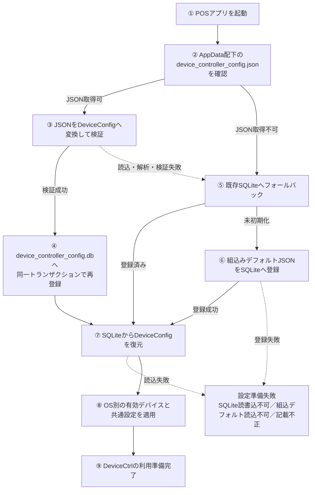
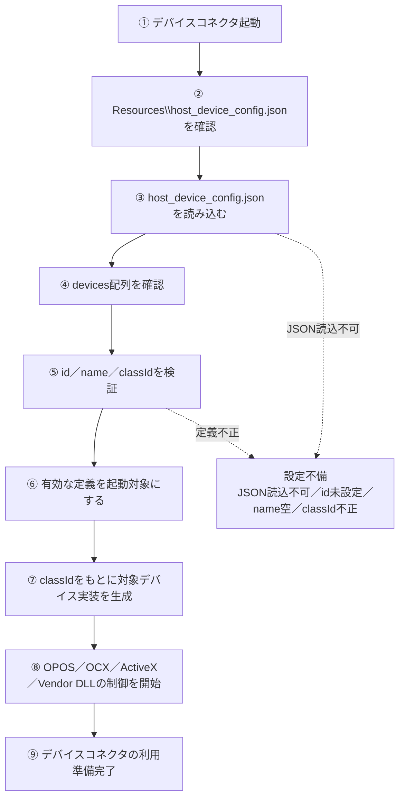

# 設定ファイル記載要領_端末アプリ_デバイス制御

## 表紙

| 項目 | 内容 |
|---|---|
| PJ名 | タブレットPOS |
| システム名 | タブレットPOS |
| 文書ID | CFG-01 |
| 成果物名 | 設定ファイル記載要領_端末アプリ_デバイス制御 |
| 版数 | 0.1.1 |
| 作成日 | 2026/09/03 |
| 作成者 | SMJサム |
| 承認者 | - |

## 変更履歴

| No. | 版数 | 変更日 | 区分 | 変更箇所（項番等） | 変更内容 | 担当者 |
|---|---|---|---|---|---|---|
| 1 | 0.0.0 | 2026/09/03 | 新規 | 全体 | 初版を作成しました。 | SMJサム |
| 2 | 0.1.0 | 2026/09/10 | 変更 | 全体 | POSの構成とインターフェースに合わせて更新しました。 | SMJサム |
| 3 | 0.1.1 | 2026/09/11 | 変更 | 全体 | システム名、資料名と参照先を統一しました。 | SMJサム |

## 目次

| No. | 内容 | シート名 |
|---|---|---|
| 1 | 概要 | 01_概要 |
| 2 | 設定ファイルの全体像 | 02_設定ファイルの全体像 |
| 3 | デバイス制御設定（フロー） | 03_デバイス制御設定_01 |
| 4 | デバイス制御設定（項目説明） | 03_デバイス制御設定_02 |
| 5 | デバイスコネクタ設定（フロー） | 04_デバイスコネクタ設定_01 |
| 6 | デバイスコネクタ設定（項目説明） | 04_デバイスコネクタ設定_02 |
| 7 | デバイス取得と制御 | 05_デバイス取得と制御 |
| 8 | 記載時チェックリスト | 06_記載時チェックリスト |
| 9 | 記載例：共通 | 07_記載例_共通 |
| 10 | 記載例：プリンター | 07_記載例_プリンター |
| 11 | 記載例：スキャナ | 07_記載例_スキャナ |
| 12 | 記載例：カスタマディスプレイ | 07_記載例_カスタマディスプレイ |
| 13 | 記載例：キーボード | 07_記載例_キーボード |
| 14 | 記載例：ドロア | 07_記載例_ドロア |
| 15 | 記載例：自動釣銭機 | 07_記載例_自動釣銭機 |
| 16 | 記載例：決済端末 | 07_記載例_決済端末 |
| 17 | 記載例：全体 | 07_記載例_全体 |


## 01_概要

### 1.1 本書の位置づけ

本書は、POSのデバイス制御層で使用する設定ファイルの記載要領を定義する文書である。

対象読者は、端末ごとの周辺機器設定を作成・確認する開発者、テスト担当者、導入担当者である。

本書では、端末アプリケーション側の設定である `device_controller_config.json` と、デバイスコネクタ側の設定である `host_device_config.json` を分けて説明する。

### 1.2 対象ファイル

| ファイル | 所在 | 用途 |
|---|---|---|
| `device_controller_config.json` | `Pos.DeviceCtrl/Resources/Raw/device_controller_config.json` | DeviceCtrlに埋め込むデフォルト設定 |
| `device_controller_config.json` | `FileSystem.AppDataDirectory/device_controller_config.json` | ウィンドウ生成時にSQLiteへ取り込む端末別設定 |
| `host_device_config.json` | `Pos.DeviceConnector/src/AppServer/Resources/host_device_config.json` | デバイスコネクタ側に同梱するデバイス実装設定 |
| `host_device_config.json` | `デバイスコネクタ実行フォルダ\Resources\host_device_config.json` | ビルド後にデバイスコネクタが実際に読み込む設定 |

### 1.3 前提事項

- `device_controller_config.json` は、端末アプリケーション側で使用するデバイス設定である。
- `device_controller_config.json` の起動時読込・デシリアライズ、SQLiteへの再登録・フォールバック読込・保存、および適用は DeviceCtrl が行う。アプリケーション層は DeviceManager の公開 API だけを呼び出す。
- `host_device_config.json` は、デバイスコネクタ側で使用するデバイス設定である。
- `device_controller_config.json` は、デバイスコネクタ側のデバイス読込設定を置き換えない。
- Windows の OPOS / OCX / ActiveX lifecycle はデバイスコネクタ側に閉じ込める。
- 端末アプリケーションは OPOS / OCX / ActiveX を直接呼び出さない。

### 1.4 関連ドキュメント

| 資料名 |
|---|
| ソフトウェア構造設計書 |
| 端末アプリケーション構造設計書 |
| デバイスコネクタ基本設計書 |
| 名前付きパイプコマンドサーバー プログラム仕様書 |
| 名前付きパイプデバイスコネクタアダプター プログラム仕様書 |
| デバイスコマンドルーター プログラム仕様書 |
| デバイスコマンドハンドラー プログラム仕様書 |
| デバイスサーバー プログラム仕様書 |
| デバイスマネージャー プログラム仕様書 |
| デバイスベース プログラム仕様書 |
| 自動釣銭機制御 RT-300 プログラム仕様書 |
| 自動釣銭機UIスレッドフォーム RT-300 プログラム仕様書 |
| ドロア制御 SHARP プログラム仕様書 |
| カスタマディスプレイ制御 SHARP プログラム仕様書 |
| 名前付きパイプコマンドマッパー プログラム仕様書 |
| 名前付きパイプイベントパブリッシャー プログラム仕様書 |
| 名前付きパイプクライアント プログラム仕様書 |
| 名前付きパイプイベント受信 プログラム仕様書 |

## 02_設定ファイルの全体像

本章では、2 つの設定ファイルがシステム全体のどこで使用されるかを示す。詳細なキー定義は 3 章および 4 章で説明する。

### 2.1 デバイス設定を含む全体構成

| 構成要素 | 役割 | 関連する設定 |
|---|---|---|
| POS 利用者 | POSアプリを操作する | - |
| POSアプリ | 売上、会計、周辺機器操作を行う端末アプリケーション | `device_controller_config.json` |
| 端末側デバイス設定 | 端末で使用するデバイス候補、有効デバイス、接続情報を定義する | `device_controller_config.json` |
| デバイスコネクタ | Windows端末でOPOS／OCX／ActiveXおよびCAFIS Arch機器を制御する外部プロセス | `host_device_config.json` |
| デバイスコネクタ側デバイス設定 | デバイスコネクタが起動・保持する既存デバイス資源を定義する | `host_device_config.json` |
| 共通デバイス通信契約 | DeviceCtrlとデバイスコネクタが共有する要求・応答・イベント、識別子、パイプ名および既定値を定義する | `Pos.DeviceContracts`（コンパイル時定義。設定ファイルではない） |
| Windows端末の外部機器 | カスタマディスプレイ、ドロア、自動釣銭機、レシートプリンタ、決済端末 | 端末側設定 + デバイスコネクタ側設定 |
| iOS / Android 端末の外部機器 | カメラ、Bluetooth、SDK 経由のプリンターなど | 主に端末側設定 |

### 2.2 設定ファイルの役割サマリ

| 設定ファイル | 管轄 | 目的 | 主な構成 | 読込タイミング |
|---|---|---|---|---|
| `device_controller_config.json` | DeviceCtrl | 端末で使用するデバイス候補と有効デバイスを定義する | `devices`, `activeDevices`, `appSettings` | DeviceManagerの初期化時 |
| `host_device_config.json` | デバイスコネクタ側 | デバイスコネクタがロードする既存デバイス資源を定義する | `devices` | デバイスコネクタ起動時 |

補足:

- Windows 端末で OPOS / OCX / ActiveX を利用する機器は、端末側設定とデバイスコネクタ側設定の両方を確認する。
- iOS / Android 端末で端末内のカメラ、Bluetooth、SDK を利用する機器は、主に `device_controller_config.json` を確認する。
- 2 つの設定ファイルは役割が異なるため、一方のファイルでもう一方を置き換えない。

### 2.3 本書の読み進め方

| 順序 | 章 | 確認する内容 |
|---|---|---|
| 1 | 2 章 | 2 つの設定ファイルの位置づけと役割を確認する |
| 2 | 3 章 | `device_controller_config.json` の読込フローと構造を、ルート項目から子項目へ順に確認する |
| 3 | 4 章 | `host_device_config.json` の読込フローと構造を、ルート項目から子項目へ順に確認する |
| 4 | 5 章 | 読み込んだ設定がデバイス制御時にどのように使用されるかを確認する |
| 5 | 6 章 | 記載漏れ、ID 不整合、OS 不整合がないかを確認する |

## 03_デバイス制御設定_01

### 3.2 起動時設定読込フロー



## 03_デバイス制御設定_02

本章では、`device_controller_config.json` の構造を、ルート項目から子項目へ順に説明する。

### 3.1 役割

| 観点 | 内容 |
|---|---|
| 目的 | 端末アプリケーションから見たデバイス候補と、OS ごとの有効デバイスを定義する |
| 対象 | Windows / iOS / Android の各端末で使用する周辺機器 |
| 使用者 | デバイス制御層（DeviceCtrl） |
| 主な判断 | どの OS で、どの デバイスID を使用し、どの接続方式で制御するか |


### 3.3 起動時処理概要

| 処理順 | 処理 | 内容 | 備考 |
|---|---|---|---|
| 1 | 初期化要求 | DeviceControlWindowからDeviceRuntimeを開始し、DeviceRuntimeがDeviceManager.InitializeAsyncを呼び出す | アプリケーション層はファイルを読み込まない |
| 2 | 起動時JSON確認 | DeviceCtrlがAppData配下のdevice_controller_config.jsonを確認する | アプリを再起動した場合も取込を再試行する |
| 3 | JSON取込 | JSONをDeviceConfigへ変換して検証する | 読込またはJSON解析に失敗した場合は警告ログを出力し、既存SQLiteへフォールバックする |
| 4 | SQLite再登録 | JSONを使用できる場合、device_controller_config.dbの4テーブルへ同一トランザクションで再登録する | JSONへは書き戻さない |
| 5 | SQLite読込 | SQLiteからDeviceConfigを復元する | JSON取込後を含め、実行中に使用する設定はSQLiteから読み込む |
| 6 | デフォルト設定使用 | JSONを使用できず、SQLiteも未初期化の場合だけ組込みデフォルトJSONをSQLiteへ登録する | 登録後はSQLiteから設定を復元する |
| 7 | 設定適用 | DeviceManagerがOS別のストラテジーを登録し、有効デバイスと共通設定を適用する | 同時に複数回初期化されても読込と適用は一度だけ行う |
| 8 | 利用準備完了 | DeviceCtrlの公開Getterを利用できる状態にする | OperationCanceledExceptionではフォールバックせず呼出元へ返す |

### 3.4 ルート項目

| 分類 | キー | 型 | 必須 | 内容 | 備考 |
|---|---|---|---|---|---|
| ルート項目 | `devices` | array | 必須 | 利用可能なデバイス候補一覧 | 各要素は `devices 配列` の定義に従う |
| ルート項目 | `activeDevices` | object | 必須 | デバイス種別 と OS ごとの有効デバイス指定 | `devices[].id` を参照する |
| ルート項目 | `appSettings` | object | 任意 | アプリケーション共通設定 | 現状は `namedPipe` を保持 |

### 3.5 devices 配列

`devices` は、端末で利用可能なデバイス候補を定義する配列である。実際に使用するデバイスは、後述の `activeDevices` で選択する。

| 分類 | キー | 型 | 必須 | 内容 | 備考 |
|---|---|---|---|---|---|
| devices 配列 | `id` | string | 必須 | 設定内で一意な デバイスID | `activeDevices` から参照するため重複不可 |
| devices 配列 | `name` | string | 必須 | デバイス名または論理名 | デバイスコネクタ経由デバイスでは OPOS 論理名と対応させる |
| devices 配列 | `type` | string | 必須 | デバイス種別 | `activeDevices` のキーと一致させる |
| devices 配列 | `vendor` | string | 任意 | ベンダー名 | 例: `sharp`, `epson` |
| devices 配列 | `series` | string | 任意 | 機種・シリーズ識別 | 導入・保守時に識別しやすい値にする |
| devices 配列 | `lang` | string | 任意 | 言語・地域識別 | 例: `jp` |
| devices 配列 | `os` | string | 必須 | 対象 OS | `windows`, `ios`, `android` |
| devices 配列 | `strategyclass` | string | 必須 | 使用する制御方式の識別名 | アプリ内で使用可能な名称を指定する |
| devices 配列 | `config` | object | 任意 | 接続方式・通信パラメータ | デバイス種別 / 制御方式により参照項目が異なる |

記載ルール:

- `id` はファイル内で重複させない。
- `type` は `activeDevices` のキーと一致させる。
- `os` は実行環境の OS と一致させる。
- `strategyclass` は、アプリ内で使用可能な制御方式の識別名を指定する。

### 3.6 devices[].config

`devices[].config` は、各デバイスの接続方式および通信パラメータを定義する。使用するキーは デバイス種別 と制御方式により異なる。

| 分類 | キー | 型 | 必須 | 内容 | 備考 |
|---|---|---|---|---|---|
| devices[].config | `connectiontype` | string | 任意 | ストラテジーが解釈する接続方式 | `wifi`, `bluetooth`, `serial`, `camera`, `USB`, `COM`, `NamedPipe`, `RawInput`。iOSプリンターは`tcp`, `wi-fi`もTCP/IP接続として扱う |
| devices[].config | `ipaddress` | string | 任意 | IP アドレス | ネットワーク接続 で使用 |
| devices[].config | `port` | string | 任意 | ポート番号 | TCP 接続時に使用 |
| devices[].config | `comport` | string | 任意 | COM ポート名 | シリアル接続 で使用 |
| devices[].config | `macaddress` | string | 任意 | MAC アドレス | Bluetooth / device discovery で使用 |
| devices[].config | `bluetoothaddress` | string | 任意 | Bluetooth アドレス | iOS / Android Bluetooth device で使用 |
| devices[].config | `baudrate` | string | 任意 | シリアル通信ボーレート | シリアル接続 で使用 |
| devices[].config | `parity` | string | 任意 | シリアル通信パリティ | シリアル接続 で使用 |
| devices[].config | `databits` | string | 任意 | シリアル通信データビット | シリアル接続 で使用 |
| devices[].config | `stopbits` | string | 任意 | シリアル通信ストップビット | シリアル接続 で使用 |
| devices[].config | `handshake` | string | 任意 | シリアル通信ハンドシェイク | シリアル接続 で使用 |
| devices[].config | `prioritize` | boolean | 任意 | 優先デバイス指定 | 決済端末などで使用 |

注意事項:

- 未使用項目は空文字で保持してよい。
- シリアル接続 の場合は `comport`, `baudrate`, `parity`, `databits`, `stopbits`, `handshake` を確認する。
- ネットワーク接続 の場合は `ipaddress` と `port` を確認する。
- Bluetooth device の場合は `bluetoothaddress` または制御方式が参照する address 項目を確認する。
- `connectiontype` は文字列であり、DeviceConnectionType列挙を設定値の全一覧として扱わない。
- WindowsのOPOS・OCXストラテジーでは、`connectiontype`の値にかかわらずDeviceCtrlからデバイスコネクタまでは`appSettings.namedPipe`で指定した名前付きパイプを使用する。

### 3.7 activeDevices

`activeDevices` は、実行 OS ごとに実際に使用する `devices[].id` を選択する設定である。

| 分類 | キー | 型 | 必須 | 内容 | 備考 |
|---|---|---|---|---|---|
| activeDevices | `local_printer` | array | 任意 | プリンターの有効デバイス | 要素は `os` と `id` を持つ |
| activeDevices | `local_scanner` | array | 任意 | スキャナの有効デバイス | 要素は `os` と `id` を持つ |
| activeDevices | `local_cashchanger` | array | 任意 | 自動釣銭機の有効デバイス | 要素は `os` と `id` を持つ |
| activeDevices | `local_display` | array | 任意 | カスタマディスプレイの有効デバイス | 要素は `os` と `id` を持つ |
| activeDevices | `local_drawer` | array | 任意 | ドロアの有効デバイス | 要素は `os` と `id` を持つ |
| activeDevices | `local_keyboard` | array | 任意 | POS キーボードの有効デバイス | 要素は `os` と `id` を持つ |
| activeDevices | `local_payment` | array | 任意 | 決済端末の有効デバイス | 要素は `os` と `id` を持つ |
| activeDevices 配列 | `os` | string | 必須 | 対象 OS | `devices[].os` と一致させる |
| activeDevices 配列 | `id` | string | 必須 | 使用する `devices[].id` | 必ず `devices[]` に存在する ID を指定 |

記載ルール:

- `activeDevices.*[].id` は、必ず `devices[].id` に存在する値を指定する。
- 同じ `type` と `os` に複数件を指定する場合、通常は 1 件を有効デバイスとして扱う。
- 対象 OS の行がない場合、該当 デバイス種別 は使用対象にならない。

### 3.8 appSettings.namedPipe

`appSettings.namedPipe` は、Windows端末からデバイスコネクタへ機器制御を依頼する際の共通設定である。省略時の既定値は、`Pos.DeviceContracts`の`DeviceCommandDefaults`を参照する。

| 分類 | キー | 型 | 必須 | 内容 | 備考 |
|---|---|---|---|---|---|
| appSettings | `namedPipe` | object | 任意 | デバイスコネクタ経由デバイス用の Named Pipe 設定 | iOS / Android では通常使用しない |
| appSettings.namedPipe | `pipeName` | string | 任意 | デバイスコネクタへ接続するための pipe 名 | 例: `Pos.DeviceConnector.Command` |
| appSettings.namedPipe | `connectionTimeoutMs` | number | 任意 | コマンド通信用パイプの接続待ち上限（ms） | 共通既定値: `5000` |
| appSettings.namedPipe | `responseTimeoutMs` | number | 任意 | コマンド応答待ち上限（ms） | 共通既定値: `30000`。Printer／Paymentの操作別上限は`Pos.DeviceContracts.DeviceOperationTimeouts`で`300000`を定義する |
| appSettings.namedPipe | `connectionRetryCount` | number | 任意 | 接続失敗時の再試行回数 | 現行設定: `3` |
| appSettings.namedPipe | `connectionRetryIntervalMs` | number | 任意 | 接続再試行間隔（ms） | 現行設定: `500` |
| appSettings.namedPipe | `eventPipeName` | string | 任意 | イベント通知用パイプ名 | 共通既定値: `Pos.DeviceConnector.Event` |
| appSettings.namedPipe | `eventReconnectIntervalMs` | number | 任意 | イベント通知用パイプの再接続間隔（ms） | 共通既定値: `1000` |

### 3.9 記載値一覧

#### type

| 値 | 対象 |
|---|---|
| `local_printer` | レシートプリンタ |
| `local_scanner` | バーコードスキャナ |
| `local_cashchanger` | 自動釣銭機 |
| `local_display` | カスタマディスプレイ |
| `local_drawer` | ドロア |
| `local_keyboard` | POS キーボード |
| `local_payment` | 決済端末 |

#### os

| 値 | 対象 |
|---|---|
| `windows` | Windows POS 端末 |
| `ios` | iPad / iOS 端末 |
| `android` | Android 端末 |

#### connectiontype

| 対象 | 主な値 | 接続情報と扱い |
|---|---|---|
| Windows OPOS・OCXデバイス | `serial`, `COM`, `USB`, `NamedPipe` | デバイス定義上の接続情報として保持する。DeviceCtrlとデバイスコネクタ間の実通信は名前付きパイプを使用し、周辺機器側のUSB・COMはデバイスコネクタで管理する |
| Windowsシリアルデバイス | `serial`, `COM`, `USB` | `comport`とシリアル通信項目を使用する。USBシリアル変換もCOMポートとして扱う |
| Windows専用キーボード | `RawInput` | Windows Raw Input APIを使用する |
| iOSプリンター | `tcp`, `wifi`, `wi-fi`, `bluetooth` | TCP/IP接続では`ipaddress`、Bluetooth接続では`bluetoothaddress`を使用する |
| iOSスキャナ | `camera`、BLE用設定 | カメラAPIまたはBluetooth Low Energy APIを使用する |
| Androidデバイス | `bluetooth`, `camera`, `USB` | 現在は設定値を保持するが、登録済みストラテジーから周辺機器への接続は実行しない |

#### strategyclass

| OS | strategyclass | 用途 |
|---|---|---|
| windows | `OposPrinterStrategy` | デバイスコネクタ経由プリンター |
| windows | `SerialHandyScannerStrategy` | Windowsのシリアル接続スキャナ |
| windows | `OposCashChangerStrategy` | デバイスコネクタ経由自動釣銭機 |
| windows | `SerialCashChangerStrategy` | Windowsのシリアル接続自動釣銭機 |
| windows | `OposCustomerDisplayStrategy` | デバイスコネクタ経由カスタマディスプレイ |
| windows | `OposDrawerStrategy` | デバイスコネクタ経由ドロア |
| windows | `WindowsRawKeyboardStrategy` | Windowsのキーボード入力 |
| windows | `OposCafisArchPaymentStrategy` | デバイスコネクタ経由 CAFIS Arch 決済端末 |
| ios | `IosEpsonPrinterStrategy` | iOS Epson printer |
| ios | `IosCameraBarcodeScannerStrategy` | iOS camera scanner |
| ios | `IosBleBarcodeScannerStrategy` | iOS BLE scanner |
| ios | `IosCustomerDisplayStrategy` | iOS customer display |
| android | `AndroidBluetoothPrinterStrategy` | Android Bluetooth printer |
| android | `AndroidCameraBarcodeScannerStrategy` | Android camera scanner |
| android | `AndroidEpsonDM70DCustomerDisplayStrategy` | Android Epson customer display |

## 04_デバイスコネクタ設定_01

### 4.2 起動時設定読込フロー



## 04_デバイスコネクタ設定_02

本章では、`host_device_config.json` の構造を、ルート項目から子項目へ順に説明する。

### 4.1 役割

| 観点 | 内容 |
|---|---|
| 目的 | デバイスコネクタがロードする既存デバイス資源を定義する |
| 対象 | OPOS / OCX / ActiveX / ベンダー提供 DLL で制御する周辺機器 |
| 使用者 | デバイスコネクタ |
| 主な判断 | デバイスコネクタ内でどの デバイスID をどの class ID で生成するか |
| 配置元 | `Pos.DeviceConnector/src/AppServer/Resources/host_device_config.json` |
| ビルド後配置先 | `デバイスコネクタ実行フォルダ\Resources\host_device_config.json` |
| 実行時参照先 | `AppContext.BaseDirectory\Resources\host_device_config.json` |


### 4.3 起動時処理概要

| 処理順 | 処理 | 内容 | 備考 |
|---|---|---|---|
| 1 | デバイスコネクタ起動 | 通常運用時はPOSアプリのライフサイクルに合わせて起動する | ユーザーによる手動の開始操作は前提としない |
| 2 | デバイスコネクタ側設定ファイル確認 | デバイスコネクタ実行フォルダ配下の `Resources\host_device_config.json` を確認する | ビルド時に `src\AppServer\Resources` から出力先へコピーされる |
| 3 | 設定ファイル読込 | `host_device_config.json` を読み込む | JSON が読めない場合は設定不備として扱う |
| 4 | devices 配列確認 | `devices` 配列を確認する | デバイスコネクタが起動・保持する対象機器の一覧として使用する |
| 5 | device 定義確認 | `id`, `name`, `classId` を確認する | `id` が設定されていない場合、`name` が空の場合、または `classId` が不正な場合は設定不備として扱う |
| 6 | 起動対象決定 | 有効な定義だけを起動対象にする | 不備がある定義は起動対象から外す |
| 7 | 対象デバイス実装生成 | `classId` をもとにデバイスコネクタ側の実装を生成する | - |
| 8 | 外部機器制御開始 | OPOS / OCX / ActiveX / Vendor DLL をデバイスコネクタ側から呼び出す | 端末アプリケーション側からは直接呼び出さない |
| 9 | 利用準備完了 | デバイスコネクタ側で利用できる状態にする | - |

### 4.4 ルート項目

| 分類 | キー | 型 | 必須 | 内容 | 備考 |
|---|---|---|---|---|---|
| ルート項目 | `devices` | array | 必須 | デバイスコネクタがロードするデバイス実装一覧 | 各要素は `devices 配列` の定義に従う |

### 4.5 devices 配列

| 分類 | キー | 型 | 必須 | 内容 | 備考 |
|---|---|---|---|---|---|
| devices 配列 | `id` | string | 必須 | デバイスコネクタ内の デバイスID | デバイスコネクタ内で制御対象の機器を識別するために使用 |
| devices 配列 | `name` | string | 必須 | デバイスコネクタ内で使用する表示名または論理名 | OPOS 論理名または表示名 |
| devices 配列 | `classId` | string | 必須 | デバイスコネクタ側の実装識別 ID | デバイスコネクタ側で生成可能な値を指定 |
| devices 配列 | `visible` | boolean | 任意 | device form の表示有無 | 通常は `false` |
| devices 配列 | `productName` | string | 任意 | 製品名・機種識別 | 保守時に device を識別するために使用 |
| devices 配列 | `parameters` | string / object | 任意 | device-specific parameter | device 実装により参照内容が異なる |

記載ルール:

- `classId` はデバイスコネクタ側で生成可能な値を指定する。
- `id` はデバイスコネクタ内で制御対象の機器を識別するため、重複させない。
- `device_controller_config.json` 側の `devices[].name` / `devices[].id` と完全一致が必要な項目ではないが、運用上は対応関係が追跡できる命名にする。

### 4.6 対象機器

| 機器 | 機種 |
| --- | --- |
| カスタマディスプレイ | RZ-4DP1 |
| ドロア | UP-J36DW3 |
| 自動釣銭機 | RT-300、RAD-300 |
| レシートプリンタ | POS内蔵 |
| 決済端末 | CAFIS Arch Saturn |

### 4.7 端末側設定との対応関係

`host_device_config.json` はデバイスコネクタがロードするデバイス実装を定義する。一方、`device_controller_config.json` は端末アプリケーション側で有効にする制御方式と接続設定を定義する。

| 観点 | `device_controller_config.json` | `host_device_config.json` |
|---|---|---|
| 管轄 | 端末アプリケーション側 | デバイスコネクタ側 |
| 主キー | `devices[].id` | `devices[].id` |
| 実装選択 | `strategyclass` | `classId` |
| 接続設定 | `devices[].config` | `parameters` / デバイスコネクタ内デバイス実装設定 |
| 参照タイミング | POSウィンドウ生成時、デバイス制御時 | デバイスコネクタ起動時 |

両ファイルの ID は必ずしも同一である必要はない。ただし、導入・保守時に追跡しやすいよう、デバイス種別、製品名、論理名の対応関係が分かる命名にする。

## 05_デバイス取得と制御

ハンディターミナルはHandyConnectionOptionsをStartへ渡します。A4帳票印刷はIA4ReportServiceへPDFデータとプリンタ名を渡します。POSAカード取引はIPosaServiceを使用します。これらの入力条件はインターフェース基本設計書_端末アプリ_デバイス制御.xlsxを参照してください。

本章では、読み込んだ設定がデバイス制御時にどのように使用されるかを示す。

### 5.1 使用デバイス選択処理

| 処理順 | 処理 | 内容 | 参照設定 |
|---|---|---|---|
| 1 | デバイス種別を指定する | プリンター、スキャナ、ドロアなど、使用したい デバイス種別 を指定する | `activeDevices` |
| 2 | 実行 OS を確認する | 現在の端末が Windows / iOS / Android のどれかを確認する | `os` |
| 3 | 有効 デバイスID を取得する | デバイス種別 と OS が一致する `activeDevices.*[].id` を取得する | `activeDevices.*[].id` |
| 4 | デバイス候補を取得する | `devices[]` から該当 ID の設定を取得する | `devices[].id` |
| 5 | 制御方式を決定する | `strategyclass` をもとに、対象デバイスの制御方式を決定する | `devices[].strategyclass` |
| 6 | 接続情報を渡す | `config` の接続情報を制御処理に渡す | `devices[].config` |

### 5.2 Windows 端末の外部機器制御

| 処理 | 内容 | 関連設定 |
|---|---|---|
| 使用デバイス選択 | 端末側設定から使用する デバイスID と制御方式を決定する | `device_controller_config.json` |
| OPOS・OCX経路 | DeviceCtrlから名前付きパイプでデバイスコネクタへ要求する | `appSettings.namedPipe` |
| OPOS・OCX機器制御 | デバイスコネクタ側の設定から対象実装を取得し、OPOS・OCXとドライバーを介してUSBまたはCOMで周辺機器を制御する | `host_device_config.json`, `classId`, `name`, `parameters` |
| シリアル直接接続 | DeviceCtrlのWindowsストラテジーからSerialPort・COMで周辺機器へ直接接続する | `connectiontype`, `comport`, シリアル通信項目 |
| Raw Input直接接続 | DeviceCtrlのWindowsストラテジーからWindows Raw Input APIを使用する | `connectiontype: RawInput` |
| 結果返却 | 各ストラテジーが同期処理結果をアプリケーションサービスへ返す。イベント受信はDeviceRuntimeが開始と停止を管理し、EventReceivedの購読先へ通知する | ストラテジーごとの同期処理結果、イベント受信ループ |

### 5.3 iOS / Android 端末の外部機器制御

| OS | 処理 | 内容 | 関連設定 |
|---|---|---|---|
| iOS | 使用デバイス選択 | DeviceCtrlが端末側設定から使用するデバイスIDと制御方式を決定する | `device_controller_config.json` |
| iOS | 周辺機器制御 | Epson SDKによるTCP/IP・Wi-Fi・Bluetooth、カメラAPI、またはBLE APIを直接使用する | `devices[].config` |
| iOS | 結果返却 | ストラテジーが処理結果またはイベントをアプリケーションサービスへ返す | 制御方式ごとの処理 |
| Android | 使用デバイス選択 | DeviceCtrlがBluetooth、カメラ、またはUSBの設定を持つデバイスを選択する | `device_controller_config.json` |
| Android | 利用状態 | ストラテジーは登録されているが、現在はSDKまたはAndroid APIを呼び出して周辺機器を制御しない | 制御方式ごとの処理 |

## 06_記載時チェックリスト

| No. | 確認項目 | 確認内容 |
|---|---|---|
| 1 | JSONの形式 | JSONとして読み込めること |
| 2 | デバイスID | `devices[].id` が重複していないこと |
| 3 | 有効デバイスの参照先 | `activeDevices.*[].id` が `devices[].id` に存在すること |
| 4 | OS | `os` が `windows`, `ios`, `android` のいずれかであること |
| 5 | デバイス種別 | `type` が `activeDevices` のキーと一致すること |
| 6 | strategyclass | アプリ内で使用可能な制御方式の識別名であること |
| 7 | デバイスコネクタ経由設定 | `appSettings.namedPipe.pipeName` がデバイスコネクタ側の pipe 設定と一致すること |
| 8 | シリアル接続 | `comport`, `baudrate`, `parity`, `databits`, `stopbits` が端末環境と一致すること |
| 9 | ネットワーク接続 | `ipaddress`, `port` が実機環境と一致すること |
| 10 | サーバー設定 | デバイスコネクタ経由デバイスの場合、デバイスコネクタ側 `host_device_config.json` に対応 device が定義されていること |
| 11 | 起動時取込 | AppData側の `device_controller_config.json` を次回起動時にSQLiteへ再登録してよい内容か確認すること |
| 12 | 文字コード | UTF-8 で保存されていること |

## 07_記載例_共通

本章では、`device_controller_config.json` における デバイス種別 ごとの記載例を示す。

### 7.1 記載例の前提

- 本章の例は、`devices` 配列に追加する 1 要素の例である。
- 実際に使用する device は、`activeDevices` 側で `os` と `id` を指定して有効化する。
- デバイスコネクタ経由デバイスの場合、`device_controller_config.json` では端末アプリケーション側の デバイス種別、strategy、接続方式を定義する。デバイスコネクタ側でロードするデバイス実装は `host_device_config.json` に定義する。
- `id`, `name`, `ipaddress`, `comport`, `macaddress` などは、導入先端末および実機環境に合わせて変更する。

## 07_記載例_プリンター

### 7.2 プリンター

#### Windows OPOS プリンター

接続する機器に合わせて設定します。

#### iOS Wi-Fi プリンター

```json
{
 "id": "printer_epson_mp80_ios",
 "name": "receipt_printer",
 "type": "local_printer",
 "vendor": "epson",
 "series": "MP80.ios.wifi",
 "lang": "jp",
 "os": "ios",
 "strategyclass": "IosEpsonPrinterStrategy",
 "config": {
 "connectiontype": "wifi",
 "ipaddress": "10.1.38.29",
 "port": "",
 "comport": "",
 "macaddress": "",
 "baudrate": "",
 "parity": "",
 "databits": "",
 "stopbits": "",
 "handshake": ""
 }
}
```

#### Android Bluetooth プリンター

```json
{
 "id": "printer_epson_mp80_android",
 "name": "receipt_printer",
 "type": "local_printer",
 "vendor": "epson",
 "series": "MP80.android",
 "lang": "jp",
 "os": "android",
 "strategyclass": "AndroidBluetoothPrinterStrategy",
 "config": {
 "connectiontype": "bluetooth",
 "ipaddress": "",
 "port": "",
 "comport": "",
 "macaddress": "",
 "baudrate": "",
 "parity": "",
 "databits": "",
 "stopbits": "",
 "handshake": ""
 }
}
```

## 07_記載例_スキャナ

### 7.3 スキャナ

#### Windows シリアルスキャナ

```json
{
 "id": "scanner_opos_serial_windows",
 "name": "opos_denso_scanner",
 "type": "local_scanner",
 "vendor": "denso",
 "series": "denso.windows",
 "lang": "jp",
 "os": "windows",
 "strategyclass": "SerialHandyScannerStrategy",
 "config": {
 "connectiontype": "COM",
 "ipaddress": "",
 "port": "",
 "comport": "COM7",
 "macaddress": "",
 "baudrate": "38400",
 "parity": "None",
 "databits": "8",
 "stopbits": "One",
 "handshake": ""
 }
}
```

#### iOS / Android カメラスキャナ

```json
{
 "id": "scanner_ipad_camera_ios",
 "name": "local_scanner",
 "type": "local_scanner",
 "vendor": "apple",
 "series": "iPad_Camera.ios",
 "lang": "jp",
 "os": "ios",
 "strategyclass": "IosCameraBarcodeScannerStrategy",
 "config": {
 "connectiontype": "camera",
 "ipaddress": "",
 "port": "",
 "comport": "",
 "macaddress": "",
 "baudrate": "",
 "parity": "",
 "databits": "",
 "stopbits": "",
 "handshake": ""
 }
}
```

Android 端末でカメラスキャナを使用する場合は、`os` を `android`、`strategyclass` を `AndroidCameraBarcodeScannerStrategy` に変更する。

## 07_記載例_カスタマディスプレイ

### 7.4 カスタマディスプレイ

#### Windows OPOS カスタマディスプレイ

接続する機器に合わせて設定します。

#### Android カスタマディスプレイ

```json
{
 "id": "customer_display_epson_dm70d_android",
 "name": "customer_display",
 "type": "local_display",
 "vendor": "epson",
 "series": "DM-D70.android",
 "lang": "jp",
 "os": "android",
 "strategyclass": "AndroidEpsonDM70DCustomerDisplayStrategy",
 "config": {
 "connectiontype": "USB",
 "ipaddress": "",
 "port": "",
 "comport": "",
 "macaddress": "",
 "baudrate": "",
 "parity": "",
 "databits": "",
 "stopbits": "",
 "handshake": ""
 }
}
```

## 07_記載例_キーボード

### 7.5 キーボード

#### Windowsキーボード

```json
{
  "id": "keyboard_sharp_pos_windows",
  "name": "pos_keyboard",
  "type": "local_keyboard",
  "vendor": "sharp",
  "series": "RZ-A476.windows",
  "lang": "jp",
  "os": "windows",
  "strategyclass": "WindowsRawKeyboardStrategy",
  "config": {
    "connectiontype": "RawInput",
    "ipaddress": "",
    "port": "",
    "comport": "",
    "macaddress": "",
    "baudrate": "",
    "parity": "",
    "databits": "",
    "stopbits": "",
    "handshake": ""
  }
}
```

Windowsのキーボード入力は`WindowsRawKeyboardStrategy`を使用します。接続方式は`RawInput`です。

## 07_記載例_ドロア

### 7.6 ドロア

#### Windows OPOS ドロア

```json
{
 "id": "drawer_external_windows",
 "name": "UPJ36DW3",
 "type": "local_drawer",
 "vendor": "external",
 "series": "External.windows",
 "lang": "jp",
 "os": "windows",
 "strategyclass": "OposDrawerStrategy",
 "config": {
 "connectiontype": "USB",
 "ipaddress": "",
 "port": "",
 "comport": "",
 "macaddress": "",
 "baudrate": "",
 "parity": "",
 "databits": "",
 "stopbits": "",
 "handshake": ""
 }
}
```

## 07_記載例_自動釣銭機

### 7.7 自動釣銭機

#### Windows OPOS 自動釣銭機

```json
{
 "id": "cash_changer_glory_rt300_windows",
 "name": "local_cashchanger",
 "type": "local_cashchanger",
 "vendor": "glory",
 "series": "RT-300.windows",
 "lang": "jp",
 "os": "windows",
 "strategyclass": "OposCashChangerStrategy",
 "config": {
 "connectiontype": "COM",
 "ipaddress": "",
 "port": "",
 "comport": "COM1",
 "macaddress": "",
 "baudrate": "9600",
 "parity": "Even",
 "databits": "7",
 "stopbits": "One",
 "handshake": ""
 }
}
```

#### Windows シリアル自動釣銭機

```json
{
 "id": "cash_changer_glory_rt300_serial",
 "name": "local_cashchanger",
 "type": "local_cashchanger",
 "vendor": "glory",
 "series": "RT-300.serial",
 "lang": "jp",
 "os": "windows",
 "strategyclass": "SerialCashChangerStrategy",
 "config": {
 "connectiontype": "COM",
 "ipaddress": "",
 "port": "",
 "comport": "COM1",
 "macaddress": "",
 "baudrate": "9600",
 "parity": "Even",
 "databits": "7",
 "stopbits": "One",
 "handshake": ""
 }
}
```

## 07_記載例_決済端末

### 7.8 決済端末

#### Windows CAFIS Arch 決済端末

```json
{
 "id": "payment_cafis_arch_saturn_windows",
 "name": "CAFIS Arch",
 "type": "local_payment",
 "vendor": "cafis",
 "series": "Saturn.windows",
 "lang": "jp",
 "os": "windows",
 "strategyclass": "OposCafisArchPaymentStrategy",
 "config": {
 "connectiontype": "OPOS",
 "ipaddress": "",
 "port": "",
 "comport": "",
 "macaddress": "",
 "baudrate": "",
 "parity": "",
 "databits": "",
 "stopbits": "",
 "handshake": ""
 }
}
```

デバイスコネクタ側の`host_device_config.json`には、`id=Payment`、`classId=Payment1`、`name=CAFIS Arch`の対応定義が必要である。

## 07_記載例_全体

### 7.9 device_controller_config.json 全体記載例

本節では、プリンター、スキャナ、カスタマディスプレイ、キーボードを含む `device_controller_config.json` の全体記載例を示す。

接続する機器に合わせて設定します。

上記はデバイスコネクタ経由デバイスを使用する端末の記載例である。導入先で使用する機器に合わせて、`devices[].id`、`devices[].name`、`devices[].strategyclass`、`devices[].config`、および `activeDevices` の参照 ID を変更する。
