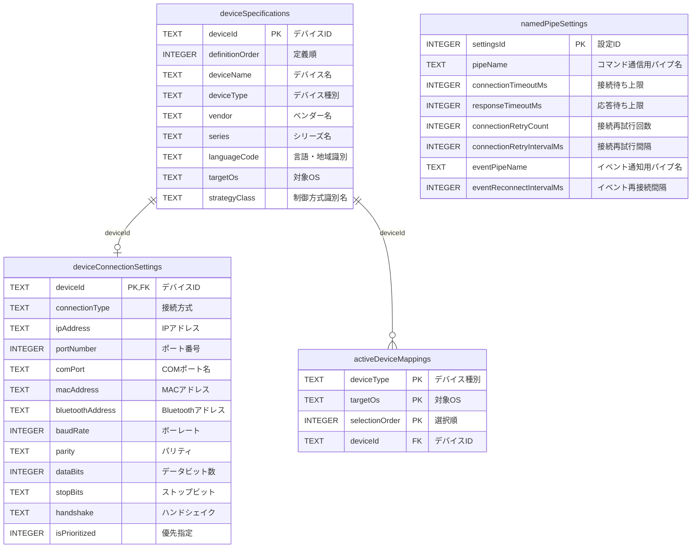

# デバイス制御設定 SQLiteテーブル定義書（現行実装）

## 表紙

| 項目 | 内容 |
| --- | --- |
| PJ名 | タブレットPOS |
| システム名 | タブレットPOS |
| サブシステム名 | デバイス制御層（DeviceCtrl） |
| 文書ID | DB-DEVICE-01 |
| 成果物名 | デバイス制御設定 SQLiteテーブル定義書（現行実装） |
| 版数 | 0.1.1 |
| 作成者 | SMJサム |
| 作成日 | 2026/08/28 |
| 目的 | 起動時にdevice_controller_config.jsonから取り込む設定と、実行中に読み込み・保存する設定を保持するSQLiteの物理テーブル構成を定義する。 |
| 対象範囲 | devices、activeDevicesおよびappSettings.namedPipeから生成するデータを対象とする。 |
| 対象外 | host_device_config.json、ローカル状態管理データおよび業務データは対象外とする。 |
| 前提 | アプリケーション起動時にJSON全体の形式、必須項目および参照関係を検証し、使用できる場合は1トランザクションでSQLiteへ再登録する。JSONを取得または使用できない場合は既存SQLite設定を読み込む。未使用の任意文字列はNULLへ変換する。SQLiteは既定で外部キー制約が無効のため、接続確立時にPRAGMA foreign_keys = ONを実行する。文字列の照合順序はBINARYとし、大文字と小文字を区別する。 |
| 関連資料 | CFG-01 デバイス制御層設定ファイル記載要領、ARCH-DEVICE-01 タブレットPOS デバイス制御クラス構成図 |

## 変更履歴

文書の改訂履歴を以下に示す。

| No. | 版数 | 変更日 | 区分 | 変更箇所（項番等） | 変更内容 | 担当者 |
| --- | --- | --- | --- | --- | --- | --- |
| 1 | 0.0.0 | 2026/09/03 | 新規 | 全体 | 初版を作成しました。 | VTI サム |
| 2 | 0.1.0 | 2026/09/10 | 変更 | 全体 | POSの構成と実装に合わせて更新しました。 | SMJサム |
| 3 | 0.1.1 | 2026/09/11 | 変更 | 全体 | システム名、資料名と参照先を統一しました。 | SMJサム |

## 目次

- 表紙
- 変更履歴
- 目次
- 概要
- テーブル一覧
- ERD
- 1. deviceSpecifications (main)
- 2. deviceConnectionSettings (main)
- 3. activeDeviceMappings (main)
- 4. namedPipeSettings (main)

## 概要

本書は、device_controller_config.jsonのデータ構造を基に、デバイス仕様、接続設定、有効デバイス対応および名前付きパイプ設定をSQLiteへ保存し、設定モデルとして復元する現行テーブル構成を示す。
アプリケーション起動時はJSONの取込を試行し、検証に成功したデータを関連する4テーブルへ同一トランザクションで再登録する。JSONを取得または使用できない場合は、前回SQLiteへ保存した設定を読み込む。JSON取込後を含め、実行中の設定読込元と保存先はSQLiteとする。

## テーブル一覧

| No | 物理テーブル名 | 備考 | 登録方法 | 移行方法 |
| --- | --- | --- | --- | --- |
| 1 | deviceSpecifications | devices配列のデバイス識別情報および制御方式を保持する。 | 検証済みJSONから追加または更新する。 | JSONの配列順を保持して全件を入れ替える。 |
| 2 | deviceConnectionSettings | devices[].configの接続設定をデバイス単位で保持する。 | configが存在するデバイスについて追加または更新する。 | deviceSpecificationsと同じトランザクションで全件を入れ替える。 |
| 3 | activeDeviceMappings | activeDevicesで指定されたOS別の有効デバイスを保持する。 | 参照先デバイスの存在を確認して追加または更新する。 | JSONの配列順を保持して全件を入れ替える。 |
| 4 | namedPipeSettings | appSettings.namedPipeの共通通信設定を1件保持する。 | namedPipeが存在する場合に1件を追加または更新する。 | JSONにnamedPipeがない場合は既存行を削除する。 |

## ERD

### 関係の説明

デバイス仕様（deviceSpecifications）1件に対し、デバイス接続設定（deviceConnectionSettings）は0件または1件となる。
有効デバイス対応（activeDeviceMappings）は0件以上となる。
名前付きパイプ設定（namedPipeSettings）は、JSON全体で0件または1件となる独立した設定である。

## 1. deviceSpecifications (main)

### テーブル情報

| 項目 | 内容 |
| --- | --- |
| システム名 | タブレットPOS |
| スキーマ名 | main |
| 論理テーブル名 | デバイス仕様 |
| RDBMS | SQLite |
| 物理テーブル名 | deviceSpecifications |
| 備考 | device_controller_config.jsonのdevices配列を正規化して保持する。配列順はdefinitionOrderに保存する。 |

### カラム情報

| No | 論理名 | 物理名 | データ型 | Not Null | デフォルト | 備考 |
| --- | --- | --- | --- | --- | --- | --- |
| 1 | デバイスID | deviceId | TEXT | Yes |  | devices[].id。設定内で一意とし、値を変更せずに保持する。 |
| 2 | 定義順 | definitionOrder | INTEGER | Yes |  | devices配列内の記載順。1から採番する。 |
| 3 | デバイス名 | deviceName | TEXT | Yes |  | devices[].name。 |
| 4 | デバイス種別 | deviceType | TEXT | Yes |  | devices[].type。CFG-01のデバイス種別を使用する。 |
| 5 | ベンダー名 | vendor | TEXT | No |  | devices[].vendor。空文字はNULLへ変換する。 |
| 6 | シリーズ名 | series | TEXT | No |  | devices[].series。空文字はNULLへ変換する。 |
| 7 | 言語・地域識別 | languageCode | TEXT | No |  | devices[].lang。値を変更せずに保持する。 |
| 8 | 対象OS | targetOs | TEXT | Yes |  | devices[].os。CFG-01の対象OSを使用する。 |
| 9 | 制御方式識別名 | strategyClass | TEXT | Yes |  | devices[].strategyclass。実装で使用する識別名を変更せずに保持する。 |

### インデックス情報

| No | インデックス名 | カラムリスト | 主キー | ユニーク | 備考 |
| --- | --- | --- | --- | --- | --- |
| 1 | pkDeviceSpecifications | deviceId | Yes | Yes | デバイスIDを主キーとする。 |
| 2 | ixDeviceSpecificationsDeviceTypeTargetOsOrder | deviceType, targetOs, definitionOrder | No | No | デバイス種別およびOSごとの候補をJSON記載順で取得する。 |

## 2. deviceConnectionSettings (main)

### テーブル情報

| 項目 | 内容 |
| --- | --- |
| システム名 | タブレットPOS |
| スキーマ名 | main |
| 論理テーブル名 | デバイス接続設定 |
| RDBMS | SQLite |
| 物理テーブル名 | deviceConnectionSettings |
| 備考 | devices[].configをデバイス単位で保持する。数値文字列は検証後にINTEGERへ変換し、未使用の空文字はNULLへ変換する。親デバイス削除時は連動して削除する。 |

### カラム情報

| No | 論理名 | 物理名 | データ型 | Not Null | デフォルト | 備考 |
| --- | --- | --- | --- | --- | --- | --- |
| 1 | デバイスID | deviceId | TEXT | Yes |  | deviceSpecifications.deviceIdを参照する。 |
| 2 | 接続方式 | connectionType | TEXT | No |  | config.connectiontype。許容値はCFG-01に従い、DBの検査制約では固定しない。 |
| 3 | IPアドレス | ipAddress | TEXT | No |  | config.ipaddress。空文字はNULLへ変換する。 |
| 4 | ポート番号 | portNumber | INTEGER | No |  | config.port。値がある場合は1以上65535以下とする。 |
| 5 | COMポート名 | comPort | TEXT | No |  | config.comport。空文字はNULLへ変換する。 |
| 6 | MACアドレス | macAddress | TEXT | No |  | config.macaddress。空文字はNULLへ変換する。 |
| 7 | Bluetoothアドレス | bluetoothAddress | TEXT | No |  | config.bluetoothaddress。空文字はNULLへ変換する。 |
| 8 | ボーレート | baudRate | INTEGER | No |  | config.baudrate。値がある場合は1以上とする。 |
| 9 | パリティ | parity | TEXT | No |  | config.parity。制御方式で使用可能な値を設定する。 |
| 10 | データビット数 | dataBits | INTEGER | No |  | config.databits。値がある場合は5以上8以下とする。 |
| 11 | ストップビット | stopBits | TEXT | No |  | config.stopbits。制御方式で使用可能な値を設定する。 |
| 12 | ハンドシェイク | handshake | TEXT | No |  | config.handshake。制御方式で使用可能な値を設定する。 |
| 13 | 優先指定 | isPrioritized | INTEGER | No |  | config.prioritize。NULL、0または1を保持する。 |

### インデックス情報

| No | インデックス名 | カラムリスト | 主キー | ユニーク | 備考 |
| --- | --- | --- | --- | --- | --- |
| 1 | pkDeviceConnectionSettings | deviceId | Yes | Yes | 1デバイスにつき接続設定を1件とする。 |

### 外部キー情報

| No | 外部キー名 | カラムリスト | 参照先テーブル名 | 参照先カラムリスト | 削除時動作 | 更新時動作 |
| --- | --- | --- | --- | --- | --- | --- |
| 1 | fkDeviceConnectionSettingsDeviceSpecificationsDeviceId | deviceId | deviceSpecifications | deviceId | CASCADE | NO ACTION |

## 3. activeDeviceMappings (main)

### テーブル情報

| 項目 | 内容 |
| --- | --- |
| システム名 | タブレットPOS |
| スキーマ名 | main |
| 論理テーブル名 | 有効デバイス対応 |
| RDBMS | SQLite |
| 物理テーブル名 | activeDeviceMappings |
| 備考 | activeDevices配下のデバイス種別、対象OSおよびデバイスIDの対応を保持する。配列順はselectionOrderに保存し、親デバイス削除時は連動して削除する。 |

### カラム情報

| No | 論理名 | 物理名 | データ型 | Not Null | デフォルト | 備考 |
| --- | --- | --- | --- | --- | --- | --- |
| 1 | デバイス種別 | deviceType | TEXT | Yes |  | activeDevices直下のキー。devices[].typeと一致させる。 |
| 2 | 対象OS | targetOs | TEXT | Yes |  | activeDevices.*[].os。参照先デバイスの対象OSと一致させる。 |
| 3 | 選択順 | selectionOrder | INTEGER | Yes |  | activeDevices.*[]内の記載順。1から採番する。 |
| 4 | デバイスID | deviceId | TEXT | Yes |  | activeDevices.*[].id。deviceSpecifications.deviceIdを参照する。 |

### インデックス情報

| No | インデックス名 | カラムリスト | 主キー | ユニーク | 備考 |
| --- | --- | --- | --- | --- | --- |
| 1 | pkActiveDeviceMappings | deviceType, targetOs, selectionOrder | Yes | Yes | デバイス種別およびOS内の記載順を主キーとする。 |
| 2 | uxActiveDeviceMappingsDeviceTypeTargetOsDeviceId | deviceType, targetOs, deviceId | No | Yes | 同じデバイスを同一のデバイス種別およびOSへ重複登録しない。 |

### 外部キー情報

| No | 外部キー名 | カラムリスト | 参照先テーブル名 | 参照先カラムリスト | 削除時動作 | 更新時動作 |
| --- | --- | --- | --- | --- | --- | --- |
| 1 | fkActiveDeviceMappingsDeviceSpecificationsDeviceId | deviceId | deviceSpecifications | deviceId | CASCADE | NO ACTION |

## 4. namedPipeSettings (main)

### テーブル情報

| 項目 | 内容 |
| --- | --- |
| システム名 | タブレットPOS |
| スキーマ名 | main |
| 論理テーブル名 | 名前付きパイプ設定 |
| RDBMS | SQLite |
| 物理テーブル名 | namedPipeSettings |
| 備考 | appSettings.namedPipeを保持する。テーブル全体で0件または1件とし、存在する場合のsettingsIdは1とする。 |

### カラム情報

| No | 論理名 | 物理名 | データ型 | Not Null | デフォルト | 備考 |
| --- | --- | --- | --- | --- | --- | --- |
| 1 | 設定ID | settingsId | INTEGER | Yes | 1 | 1固定とする。 |
| 2 | コマンド通信用パイプ名 | pipeName | TEXT | Yes | Pos.DeviceConnector.Command | namedPipe.pipeName。 |
| 3 | 接続待ち上限 | connectionTimeoutMs | INTEGER | Yes | 5000 | namedPipe.connectionTimeoutMs。単位はミリ秒とする。 |
| 4 | 応答待ち上限 | responseTimeoutMs | INTEGER | Yes | 30000 | namedPipe.responseTimeoutMs。単位はミリ秒とする。 |
| 5 | 接続再試行回数 | connectionRetryCount | INTEGER | Yes | 3 | namedPipe.connectionRetryCount。0以上とする。 |
| 6 | 接続再試行間隔 | connectionRetryIntervalMs | INTEGER | Yes | 500 | namedPipe.connectionRetryIntervalMs。単位はミリ秒とし、0以上とする。 |
| 7 | イベント通知用パイプ名 | eventPipeName | TEXT | Yes | Pos.DeviceConnector.Event | namedPipe.eventPipeName。 |
| 8 | イベント再接続間隔 | eventReconnectIntervalMs | INTEGER | Yes | 1000 | namedPipe.eventReconnectIntervalMs。単位はミリ秒とし、1以上とする。 |

### インデックス情報

| No | インデックス名 | カラムリスト | 主キー | ユニーク | 備考 |
| --- | --- | --- | --- | --- | --- |
| 1 | pkNamedPipeSettings | settingsId | Yes | Yes | 名前付きパイプ設定を1件に限定する。 |
