# EX-DEVICE-01 次世代POS デバイス制御実装例集

## 表紙

| 項目 | 内容 |
|---|---|
| PJ名 | 次世代POS |
| システム名 | 次世代POS |
| 文書ID | EX-DEVICE-01 |
| 成果物名 | 次世代POS デバイス制御実装例集 |
| 対象 | アプリケーションサービスから公開デバイス契約を利用するC#実装例 |
| 版数 | 1.0.0 |
| 作成日 | 2026/08/24 |
| 作成者 | VTI サム |
| レビュー担当 | SMJ 蒲田 |
| 承認者 | SMJ 蒲田 |
| 目的 | ベンダー、OS、または接続方式に依存しない、デバイス別の共通呼出方法を定義する。 |
| 期待成果 | 開発者がストラテジーの取得、Start、デバイス操作、結果判定、およびEndを一貫した手順で実装できること。 |

## 変更履歴

| No. | 版数 | 変更日 | 区分 | 変更箇所（項番等） | 変更内容 | 担当者 |
| --- | --- | --- | --- | --- | --- | --- |
| 1 | 1.0.0 | 2026/08/24 | 新規 | 全体 | 正式版として初版を作成。 | VTI サム |

## 目次

```text
1. 表紙
2. 変更履歴
3. 概要
4. 対象範囲
5. 関連資料
6. 共通利用フロー
7. スキャナー実装例
8. レシートプリンター実装例
9. カスタマディスプレイ実装例
10. ドロア実装例
11. 自動釣銭機実装例
12. 専用キーボード実装例
13. プラットフォーム対応
```

## 2. 概要

### 2.1 利用目的

本書は、デバイス操作を行うアプリケーションサービス向けの実装例を示す。ViewModelはユースケースまたはアプリケーションサービスを呼び出し、DeviceManagerやストラテジーを直接操作しない。

アプリケーションサービスはDeviceManagerから対象ストラテジーを取得し、デバイス種別ごとの公開デバイス契約のみを利用する。device_controller_config.jsonの読込み、対象デバイスの選択、およびプラットフォーム別ストラテジーの生成はデバイス制御層が担当する。

各回の呼出しでは、ストラテジー取得、Start、デバイス操作、結果判定、およびEndを明示的に実施する。画面表示、業務判定、再実行の可否、および利用者への通知はアプリケーション層の責務とする。

### 2.2 設計領域

| 設計領域 | 本書で定義する内容 | 本書で定義しない内容 |
|---|---|---|
| ソフトウェア設計 | 取得メソッド、公開デバイス契約、入出力、例外、およびライフサイクル。 | デバイス制御層内部のクラス選択、設定ファイル解析、および通信プロトコルの内部処理。 |
| 実装例 | デバイス別のC#呼出例、結果判定、および終了処理。 | 画面ごとの業務条件、メッセージ文言、および取引継続判定。 |
| 実装状況 | Windows、iOS、およびAndroidに対する実装例の適用可否。 | 店舗運用、監視、バックアップ、復旧、およびリリース手順。 |

StartとEndはソフトウェア上のデバイス・ライフサイクルを示し、運用担当者が実施する起動・停止手順ではない。

### 2.3 実装原則

| 項番 | 原則 | 実装内容 |
|---|---|---|
| 1 | 依存性注入 | DeviceManagerまたは公開デバイス契約をコンストラクターで受け取る。 |
| 2 | デバイス別の取得メソッド | プラットフォーム別ストラテジーを直接生成しない。 |
| 3 | null判定 | 設定に適合するデバイスがない場合を明示的に処理する。 |
| 4 | StartとEnd | Start完了後にのみ操作し、finallyでEndを実行する。 |
| 5 | 結果判定 | PrinterResponse、bool、コールバック、または例外を契約に合わせて判定する。 |
| 6 | 自動再実行の禁止 | コマンド未送信を識別できる場合、またはユースケースで許可された場合のみ再実行する。 |
| 7 | 設定の所有範囲 | アプリケーション層でデバイス設定ファイルを読み込まない。 |

## 3. 対象範囲

### 3.1 対象

1. DeviceManagerからデバイス別ストラテジーを取得する方法。
2. スキャナー、レシートプリンター、カスタマディスプレイ、ドロア、自動釣銭機、および専用キーボードの利用方法。
3. PrinterResponse、bool、またはコールバックによる結果受信方法。
4. Start、End、および異常時の終了処理。
5. プラットフォーム別ストラテジーから業務処理を分離する方法。

### 3.2 対象外

1. 画面ごとの業務条件、メッセージ内容、および操作権限。
2. 店舗におけるドライバー、OPOS、シリアルポート、SDK、および周辺機器の設定手順。
3. Windows向けOPOS／OCXストラテジーとデバイスコネクタ（Host）間の名前付きパイプ・プロトコル。
4. A4プリンターによる文書印刷。
5. 決済端末の要求、応答、およびイベント。

### 3.3 適用条件

| 項番 | 条件 | 確認内容 |
|---|---|---|
| 1 | デバイス制御層の登録完了 | 依存性注入コンテナーからDeviceManagerと対象ストラテジーを解決できる。 |
| 2 | 初期化完了 | DeviceManager.InitializeAsyncが有効なDeviceConfigで完了している。 |
| 3 | 有効デバイスの設定 | デバイス種別と実行OSに適合するDeviceSpecが設定されている。 |
| 4 | 業務データの検証完了 | 文字列、金額、およびレシートデータを呼出し前に検証している。 |
| 5 | 接続経路の利用可能 | ARCH-DEVICE-01で定義する接続経路と対象ストラテジーが利用できる。 |

## 4. 関連資料

| 文書ID | 文書名 | 本書との関係 |
|---|---|---|
| ARCH-DEVICE-01 | 次世代POS デバイス制御クラス構成図 | クラス、公開デバイス契約、設定、接続経路、およびライフサイクルを定義する。 |
| ARCH-02 | タブレットPOS 端末アプリケーション構造設計書 | アプリケーションサービスとViewModelの位置付けを定義する。 |
| ARCH-HOST-01 | タブレットPOS デバイスコネクタ基本設計書 | Windows向けデバイスコネクタ（Host）の責務境界を定義する。 |
| CFG-01 | タブレットPOS デバイス制御層設定ファイル記載要領 | デバイス選択と接続に使用する設定項目を定義する。 |
| PS-DEVICE-01〜11 | デバイス制御 プログラム仕様書 | DeviceManager、設定、ストラテジー生成、共通デバイス通信契約、名前付きパイプコマンド送信、およびイベント受信のクラス単位の仕様を定義する。 |

## 5. 共通利用フロー_01

デバイス別ストラテジーを利用する共通フローを以下に示す。

#### 凡例

| 表示 | 色 | 意味 |
|---|---|---|
| アプリ処理 | 背景:#DDEBF7 / 枠線:#5B9BD5 / 文字:#111111 / 太さ:2 | アプリケーションサービスの処理。 |
| 制御処理 | 背景:#E2F0D9 / 枠線:#70AD47 / 文字:#111111 / 太さ:2 | デバイス制御層の処理。 |
| 判定 | 背景:#FFF2CC / 枠線:#BF9000 / 文字:#111111 / 太さ:2 | 処理継続を判定する分岐。 |
| 異常処理 | 背景:#F4CCCC / 枠線:#C00000 / 文字:#111111 / 太さ:2 | 継続できない結果または業務側で判定する結果。 |
| 処理フェーズ | 背景:透明 / 枠線:#4472C4 / 文字:#111111 / 太さ:2 | 準備から結果返却までの処理区分。 |
| ラベル | 背景:#FFFFFF / 枠線:透明 / 文字:#111111 / 太さ:0 | コネクター中央で背後の線を隠すラベル。 |
| 主処理 | 線:#548235 / 線種:実線 / 太さ:2 | 通常の処理順序。 |
| 異常経路 | 線:#C00000 / 線種:破線 / 太さ:2 | 例外またはデバイス処理の異常経路。 |

### 5.1 共通利用フロー

```mermaid
%% diagram-profile=operational-scenario
%% legend-bind container=処理フェーズ
%% legend-bind class.app=アプリ処理
%% legend-bind class.control=制御処理
%% legend-bind class.decision=判定
%% legend-bind class.error=異常処理
%% legend-bind edge.default=主処理
%% legend-bind edge.dashed=異常経路
%% legend-bind label=ラベル
flowchart LR
 subgraph PREPARE["（1） 準備"]
 direction TB
 PREPARE_REQUEST["① 業務要求を受け付ける"]
 PREPARE_GET["② ストラテジーを要求する"]
 PREPARE_SELECT["③ 有効デバイスを選択し<br/>ストラテジーを生成する"]
 PREPARE_EXISTS{"④ ストラテジーがあるか"}
 PREPARE_UNAVAILABLE["⑤ デバイスなしの分岐で<br/>処理を終了する"]
 end
 subgraph START_PHASE["（2） 開始"]
 direction TB
 START_CALL["① Startを呼び出す"]
 START_DEVICE["② デバイスを初期化<br/>または接続する"]
 START_OK{"③ Startが成功したか"}
 START_ERROR["④ Start失敗の分岐で<br/>処理を終了する"]
 end
 subgraph DEVICE_ACTION["（3） デバイス操作"]
 direction TB
 ACTION_CALL["① デバイス操作を呼び出す"]
 ACTION_EXECUTE["② プラットフォーム別の<br/>処理を実行する"]
 ACTION_OK{"③ 結果が有効か"}
 ACTION_ERROR["④ 操作エラーを記録する"]
 end
 subgraph FINISH["（4） 終了"]
 direction TB
 FINISH_CALL["① finallyでEndを呼び出す"]
 FINISH_DEVICE["② 処理を終了または<br/>リソースを解放する"]
 FINISH_ERROR{"③ 操作エラーがあるか"}
 end
 subgraph RESULT["（5） 結果返却"]
 direction TB
 RESULT_SUCCESS["① 結果をユースケースへ返す"]
 RESULT_FAILURE["② エラーを業務処理へ渡す"]
 RESULT_COMPLETE["③ 完了"]
 end

 PREPARE_REQUEST --> PREPARE_GET --> PREPARE_SELECT --> PREPARE_EXISTS
 PREPARE_EXISTS -->|はい| START_CALL
 PREPARE_EXISTS -.->|いいえ| PREPARE_UNAVAILABLE
 PREPARE_UNAVAILABLE -.-> RESULT_COMPLETE
 START_CALL --> START_DEVICE --> START_OK
 START_OK -->|はい| ACTION_CALL
 START_OK -.->|いいえ| START_ERROR
 START_DEVICE -.->|初期化・接続時の例外| START_ERROR
 START_ERROR -.-> RESULT_COMPLETE
 ACTION_CALL --> ACTION_EXECUTE --> ACTION_OK
 ACTION_OK -->|はい| FINISH_CALL
 ACTION_OK -.->|いいえ| ACTION_ERROR
 ACTION_EXECUTE -.->|デバイス操作時の例外| ACTION_ERROR
 ACTION_ERROR -.->|エラー後も終了処理を実行| FINISH_CALL
 FINISH_CALL --> FINISH_DEVICE --> FINISH_ERROR
 FINISH_ERROR -->|いいえ| RESULT_SUCCESS
 FINISH_ERROR -.->|はい| RESULT_FAILURE
 RESULT_SUCCESS --> RESULT_COMPLETE
 RESULT_FAILURE -.-> RESULT_COMPLETE

 class PREPARE_REQUEST,PREPARE_GET,START_CALL,ACTION_CALL,ACTION_ERROR,FINISH_CALL,RESULT_SUCCESS app
 class PREPARE_SELECT,START_DEVICE,ACTION_EXECUTE,FINISH_DEVICE control
 class PREPARE_EXISTS,START_OK,ACTION_OK,FINISH_ERROR decision
 class PREPARE_UNAVAILABLE,START_ERROR,RESULT_FAILURE error
 class RESULT_COMPLETE app
```



#### 図の補足

- 設定にデバイス種別とOSに適合する対象がない場合、取得メソッドはnullを返す。
- Startが成功した後は、デバイス操作で例外が発生してもfinallyでEndを実行する。
- プリンターはStartと印刷の両方でPrinterResponse.Successを判定する。
- 再実行の可否は、送信状態と業務上の重複実行リスクに基づきアプリケーションサービスが判定する。

## 5. 共通利用フロー_02

### 5.2 フェーズ別責務

| 項番 | フェーズ | アプリケーションサービス | デバイス制御層 |
|---|---|---|---|
| 1 | （1）準備 | 業務条件と入力を確認し、対象ストラテジーを取得してnullを判定する。 | 有効デバイスを選択し、対応するストラテジーを生成する。 |
| 2 | （2）開始 | Startを呼び出し、契約に応じて結果を判定する。 | デバイスの初期化または接続を行う。 |
| 3 | （3）デバイス操作 | 公開デバイス契約のメソッドを呼び出し、同期結果またはコールバックを受け取る。 | 呼出しをプラットフォーム別実装へ委譲する。 |
| 4 | （4）終了 | finallyでEndを呼び出す。 | 接続の終了またはリソースの解放を行う。 |
| 5 | （5）結果返却 | 成功結果をユースケースへ返すか、エラーを業務処理へ渡す。 | デバイス固有の結果を公開契約の応答に変換する。 |

### 5.3 デバイス別の結果判定

| デバイス | 主な結果 | 判定方法 |
|---|---|---|
| スキャナー | コールバック文字列 | nullまたは空文字を失敗とし、必要に応じてタイムアウトを設定する。 |
| レシートプリンター | PrinterResponse | Startと印刷の各応答でSuccessを確認する。 |
| カスタマディスプレイ | Task | 例外なく完了したことを確認する。 |
| ドロア | bool | trueを成功とする。 |
| 自動釣銭機 | Taskまたは状態取得結果 | 重複払出しを避けるため、不明な状態で自動再実行しない。 |
| 専用キーボード | KeyboardKeyEventArgs | コールバックを業務コマンドへ渡し、リスナーの生存期間を明示的に管理する。 |

## 6. スキャナー実装例

### 6.1 利用契約

| 項目 | 内容 |
|---|---|
| 取得メソッド | GetScannerStrategyAsync |
| 公開デバイス契約 | IBarcodeScannerStrategy |
| 処理順序 | Start → Scan → コールバック受信 → End |
| 結果 | 読取データをコールバックで受け取る。 |

### 6.2 C#実装例

```csharp
using Pos.DeviceCtrl;

namespace Pos.Applications.Application.Devices;

public sealed class BarcodeScannerExample(DeviceManager deviceManager)
{
 public async Task<string> ReadOnceAsync(
 TimeSpan timeout,
 CancellationToken cancellationToken)
 {
 if (timeout <= TimeSpan.Zero)
 throw new ArgumentOutOfRangeException(nameof(timeout));

 var strategy = await deviceManager.GetScannerStrategyAsync()
 ?? throw new InvalidOperationException("No active scanner is configured.");

 await strategy.Start();
 try
 {
 var received = new TaskCompletionSource<string?>(
 TaskCreationOptions.RunContinuationsAsynchronously);
 await strategy.Scan(value => received.TrySetResult(value));
 var value = await received.Task.WaitAsync(timeout, cancellationToken);
 return string.IsNullOrWhiteSpace(value)
 ? throw new InvalidOperationException("The scanner returned no data.")
 : value;
 }
 finally
 {
 await strategy.End();
 }
 }
}
```

### 6.3 適用時の注意

1. Scanはコールバックでデータを返すため、アプリケーションサービスでタイムアウトとキャンセルを管理する。
2. 同一ストラテジー・インスタンスを複数の同時読取要求で共有しない。
3. タイムアウトまたはキャンセル時にもfinallyでEndを実行する。
4. データの長さ、形式、およびコード種別を業務利用前に検証する。

## 7. レシートプリンター実装例

### 7.1 利用契約

| 項目 | 内容 |
|---|---|
| 取得メソッド | GetPrinterStrategyAsync |
| 公開デバイス契約 | IPrinterStrategy |
| 処理順序 | Start → Success確認 → PrintReceipt → Success確認 → End |
| データ | Receipt内にReceiptLineの一覧を設定する。 |

### 7.2 C#実装例

```csharp
using Pos.DeviceCtrl;
using Pos.DeviceCtrl.Models.PrinterLayout;

namespace Pos.Applications.Application.Devices;

public sealed class ReceiptPrinterExample(DeviceManager deviceManager)
{
 public async Task PrintAsync(Receipt receipt)
 {
 var strategy = await deviceManager.GetPrinterStrategyAsync()
 ?? throw new InvalidOperationException("No active receipt printer is configured.");

 var startResult = await strategy.Start();
 if (!startResult.Success)
 throw new InvalidOperationException("The receipt printer could not be started.");

 try
 {
 var result = await strategy.PrintReceipt(receipt);
 if (!result.Success)
 throw new InvalidOperationException("Receipt printing did not report success.");
 }
 finally
 {
 await strategy.End();
 }
 }
}
```

### 7.3 適用時の注意

1. StartとPrintReceiptの両方でPrinterResponse.Successを確認する。
2. ReceiptLineは種別に応じてContent、Style、FontStyle、FontSize、およびFeedLineを設定する。
3. レシートデータは業務層で整形と検証を完了してから渡す。
4. ドロア操作はIDrawerStrategyを使用し、レシート印刷の成否と分離する。
5. A4印刷には本実装例を使用しない。

## 8. カスタマディスプレイ実装例

### 8.1 利用契約

| 項目 | 内容 |
|---|---|
| 取得メソッド | GetCustomerDisplayStrategyAsync |
| 公開デバイス契約 | ICustomerDisplayStrategy |
| 処理順序 | 表示開始時にStart → DisplayTextAt → 必要に応じてClearText → 表示終了時にEnd |
| 結果 | 例外なくTaskが完了する。 |

### 8.2 C#実装例

```csharp
using Pos.DeviceCtrl;
using Pos.DeviceCtrl.Interfaces;

namespace Pos.Applications.Application.Devices;

public sealed class CustomerDisplaySession(DeviceManager deviceManager) : IAsyncDisposable
{
 private ICustomerDisplayStrategy? _strategy;

 public async Task StartAsync()
 {
 if (_strategy is not null) return;
 var strategy = await deviceManager.GetCustomerDisplayStrategyAsync()
 ?? throw new InvalidOperationException("No active customer display is configured.");
 await strategy.Start();
 _strategy = strategy;
 }

 public async Task ShowTotalAsync(string itemText, string totalText)
 {
 var strategy = _strategy
 ?? throw new InvalidOperationException("The display session is not started.");
 await strategy.DisplayTextAt(itemText, row: 0, column: 0, attribute: 0);
 await strategy.DisplayTextAt(totalText, row: 1, column: 0, attribute: 0);
 }

 public async ValueTask DisposeAsync()
 {
 if (_strategy is null) return;
 var strategy = _strategy;
 _strategy = null;
 try { await strategy.ClearText(); }
 finally { await strategy.End(); }
 }
}
```

### 8.3 適用時の注意

1. カスタマディスプレイを使用する画面または取引の間、表示セッションを維持する。
2. 表示可能な文字数と文字種は対象機種の仕様に従う。
3. DisposeAsyncで表示を消去し、ClearTextが失敗してもEndを実行する。

## 9. ドロア実装例

### 9.1 利用契約

| 項目 | 内容 |
|---|---|
| 取得メソッド | GetDrawerStrategyAsync |
| 公開デバイス契約 | IDrawerStrategy |
| 処理順序 | Start → OpenDrawer → bool判定 → End |
| 結果 | ストラテジーがtrueを返した場合を成功とする。 |

### 9.2 C#実装例

```csharp
using Pos.DeviceCtrl;

namespace Pos.Applications.Application.Devices;

public sealed class DrawerExample(DeviceManager deviceManager)
{
 public async Task OpenAsync()
 {
 var strategy = await deviceManager.GetDrawerStrategyAsync()
 ?? throw new InvalidOperationException("No active drawer is configured.");
 await strategy.Start();
 try
 {
 if (!await strategy.OpenDrawer())
 throw new InvalidOperationException("The drawer did not report success.");
 }
 finally
 {
 await strategy.End();
 }
 }
}
```

### 9.3 適用時の注意

1. IDrawerStrategyを使用し、プリンターのドロアー開放呼出しと業務上の責務を混在させない。
2. trueはストラテジーが返す操作結果である。物理的な開閉状態を必要とする場合は、CheckStatusまたは対応する設計で確認する。
3. 要求送信後に結果が不明な場合、OpenDrawerを自動再実行しない。

## 10. 自動釣銭機実装例

### 10.1 利用契約

| 項目 | 内容 |
|---|---|
| 取得メソッド | GetCashChangerStrategyAsync |
| 公開デバイス契約 | ICashChangerStrategy |
| 処理順序 | 金額検証 → Start → DispenseChange → End |
| 入力 | 正の整数金額をInvariant Cultureの数字文字列に変換する。 |

### 10.2 C#実装例

```csharp
using System.Globalization;
using Pos.DeviceCtrl;

namespace Pos.Applications.Application.Devices;

public sealed class CashChangerExample(DeviceManager deviceManager)
{
 public async Task DispenseAsync(int amount)
 {
 if (amount <= 0)
 throw new ArgumentOutOfRangeException(nameof(amount));

 var strategy = await deviceManager.GetCashChangerStrategyAsync()
 ?? throw new InvalidOperationException("No active cash changer is configured.");

 await strategy.Start();
 try
 {
 await strategy.DispenseChange(amount.ToString(CultureInfo.InvariantCulture));
 }
 finally
 {
 await strategy.End();
 }
 }
}
```

### 10.3 適用時の注意

1. 金額の計算と検証はアプリケーション層で完了してからデバイス制御層へ渡す。
2. 払出し完了の有無を判定できない場合、DispenseChangeを自動再実行しない。
3. 入金ではBeginDeposit、GetDepositAmount、FixDeposit、EndDeposit、およびCancelTransactionを対応する現金取引設計に従って使用する。
4. 失敗時は取引状態を確定してから後続操作を許可する。

## 11. 専用キーボード実装例

### 11.1 利用契約

| 項目 | 内容 |
|---|---|
| 取得メソッド | GetKeyboardStrategyAsync |
| 公開デバイス契約 | IKeyboardStrategy |
| 処理順序 | Start → Listen → ストラテジー保持 → サービス停止時にEnd |
| データ | KeyboardKeyEventArgsにKeyValue、VirtualKey、ScanCode、DeviceId、およびIsDedicatedが含まれる。 |

### 11.2 C#実装例

```csharp
using Pos.DeviceCtrl;
using Pos.DeviceCtrl.Interfaces;

namespace Pos.Applications.Application.Devices;

public sealed class DedicatedKeyboardExample(DeviceManager deviceManager) : IAsyncDisposable
{
 private IKeyboardStrategy? _strategy;

 public async Task StartAsync(Action<KeyboardKeyEventArgs> onKeyReceived)
 {
 if (_strategy is not null) return;
 var strategy = await deviceManager.GetKeyboardStrategyAsync()
 ?? throw new InvalidOperationException("No active dedicated keyboard is configured.");
 await strategy.Start();
 try
 {
 await strategy.Listen(onKeyReceived);
 _strategy = strategy;
 }
 catch
 {
 await strategy.End();
 throw;
 }
 }

 public async ValueTask DisposeAsync()
 {
 if (_strategy is null) return;
 var strategy = _strategy;
 _strategy = null;
 await strategy.End();
 }
}
```

### 11.3 適用時の注意

1. サービスの生存期間中はストラテジーをフィールドに保持し、リスナーを維持する。
2. ガード条件により同一サービスへの重複登録を防止する。
3. コールバック内で長時間処理せず、必要な業務処理をアプリケーションコマンドまたは適切な実行コンテキストへ渡す。
4. DisposeAsyncはEndを1回だけ実行し、ストラテジー参照を解放する。

## 12. プラットフォーム対応

### 12.1 実装例の適用可否

| 実装例 | Windows | iOS | Android |
|---|---|---|---|
| スキャナー | SerialHandyScannerStrategyに適用できる。 | IosCameraBarcodeScannerStrategyとIosBleBarcodeScannerStrategyに適用できる。 | AndroidCameraBarcodeScannerStrategyは登録されるが、現行クラスに読取処理がないため適用できない。 |
| レシートプリンター | OposPrinterStrategyに適用できる。 | IosEpsonPrinterStrategyに適用できる。 | AndroidBluetoothPrinterStrategyは登録されるが、現行クラスに印刷処理がないため適用できない。 |
| カスタマディスプレイ | OposCustomerDisplayStrategyに適用できる。 | IosCustomerDisplayStrategyに適用できる。 | AndroidEpsonDm70DCustomerDisplayStrategyは登録されるが、現行クラスに表示処理がないため適用できない。 |
| ドロア | OposDrawerStrategyに適用できる。 | 対象外。 | 対象外。 |
| 自動釣銭機 | OposCashChangerStrategyに適用できる。SerialCashChangerStrategyは必須操作が揃っていないため本例の対象外。 | 対象外。 | 対象外。 |
| 専用キーボード | WindowsRawKeyboardStrategyに適用できる。 | 対象外。 | 対象外。 |

Android向けの3ストラテジーは依存性注入とStrategyFactoryに登録されるが、現行ソースではクラス本体にSDKまたはOS APIの呼出処理が実装されていない。そのため、本書の呼出例は適用対象外とする。

### 12.2 複数ベンダー対応の原則

1. アプリケーションサービスは、デバイス取得、公開デバイス契約、およびライフサイクル順序を変更しない。
2. ベンダー、機種、およびOSの差し替えはDeviceSpecとプラットフォーム別ストラテジーで行う。
3. 接続設定はCFG-01で管理する。
4. 公開デバイス契約にない操作は、利用前にプラットフォーム別設計で定義する。
5. 対象デバイスごとにStart、主操作、失敗結果、例外、およびEndを確認する。

### 12.3 A4プリンターとの境界

A4プリンターはレシート用のReceiptモデルを使用しない。文書生成、プリンター選択、ジョブ管理、取消し、および印刷状態はA4印刷の専用設計で定義する。
