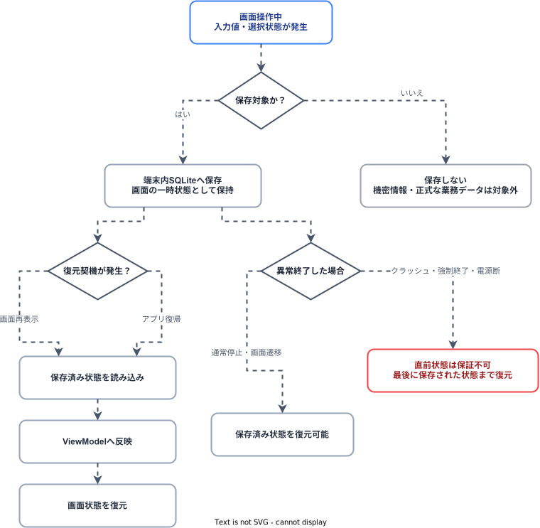

タブレットPOS

ソフトウェア構造設計書

文書ID: ARCH-01

第1.0.1版

2026年6月25日

## 改訂履歴

|            |       |                                                                                                                                                                          |        |        |
| :--------- | :---- | :----------------------------------------------------------------------------------------------------------------------------------------------------------------------- | :----- | :----- |
| 改訂日     | 版数  | 内容                                                                                                                                                                     | 改訂者 | 承認者 |
| 2026/06/04 | 1.0.0 | タブレットPOS の構成に合わせ、端末アプリケーション、デバイス制御層（DeviceCtrl）、コネクタサーバー（Host）、Named Pipe 連携、ローカル状態保持、監視方式を中心とした構造設計として改訂 | VTI    | -      |
| 2026/06/09 | 1.0.0 | Domain / Application / Ports の役割説明を補足し、Host refactor 後の command core、transport adapter、process state 構造を反映 | VTI    | -      |
| 2026/06/11 | 1.0.0 | Host / DeviceCtrl の設定ファイル名と配置方針を整理し、`host_device_config.json` / `device_controller_config.json` 前提へ更新 | VTI    | -      |
| 2026/06/18 | 1.0.0 | CustomerDisplay 契約、Scanner / Keyboard のローカル制御、コネクタサーバー（Host）command mapping、イベント未実装範囲、テスト実績を現行ソースに合わせて更新 | VTI    | -      |
| 2026/06/23 | 1.0.0 | 停止要求とコネクタサーバー（Host）構成図を現行方式に合わせて更新 | VTI    | -      |
| 2026/06/25 | 1.0.1 | 設定ファイル名、Named Pipe 名、コネクタサーバー（Host）の通常運用時の自動起動・停止方針を現行構成に合わせて更新 | VTI    | -      |
|            |       |                                                                                                                                                                          |        |        |

## 目次

- [1. イントロダクション](#1-イントロダクション)
  - [1.1 本書の位置づけ](#11-本書の位置づけ)
  - [1.2 前提事項](#12-前提事項)
  - [1.3 対象読者](#13-対象読者)
  - [1.4 関連ドキュメント](#14-関連ドキュメント)
- [2. 基本アーキテクチャ](#2-基本アーキテクチャ)
  - [2.1 システム全体構成](#21-システム全体構成)
  - [2.2 基本方針](#22-基本方針)
  - [2.3 採用技術](#23-採用技術)
  - [2.4 動作基盤](#24-動作基盤)
  - [2.5 構成要素](#25-構成要素)
- [3. 端末アプリケーション・アーキテクチャ](#3-端末アプリケーションアーキテクチャ)
  - [3.1 レイヤ構成](#31-レイヤ構成)
  - [3.2 依存関係ルール](#32-依存関係ルール)
  - [3.3 プレゼンテーション層](#33-プレゼンテーション層)
  - [3.4 アプリケーション層](#34-アプリケーション層)
  - [3.5 ドメイン層](#35-ドメイン層)
  - [3.6 外部境界 / 実装基盤](#36-外部境界--実装基盤)
  - [3.7 画面遷移方式](#37-画面遷移方式)
  - [3.8 ライフサイクル方式](#38-ライフサイクル方式)
  - [3.9 UI コントロール / スタイル](#39-ui-コントロール--スタイル)
- [4. デバイス制御層（DeviceCtrl）・アーキテクチャ](#4-デバイス制御層（DeviceCtrl）アーキテクチャ)
  - [4.1 位置づけ](#41-位置づけ)
  - [4.2 レイヤ構成](#42-レイヤ構成)
  - [4.3 設計要素](#43-設計要素)
  - [4.4 コネクタサーバー（Host）連携方式](#44-コネクタサーバーhost連携方式)
  - [4.5 Windows strategy とコネクタサーバー（Host）コマンドの対応](#45-windows-strategy-とコネクタサーバーhostコマンドの対応)
    - [4.5.1 コネクタサーバー（Host）経由デバイス一覧](#451-コネクタサーバーhost経由デバイス一覧)
    - [4.5.2 Customer display](#452-customer-display)
    - [4.5.3 CashDrawer](#453-cashdrawer)
    - [4.5.4 CashChanger](#454-cashchanger)
    - [4.5.5 Platform-local strategy model](#455-platform-local-strategy-model)
  - [4.6 設定方針](#46-設定方針)
  - [4.7 実装段階](#47-実装段階)
- [5. コネクタサーバー（Host）・アーキテクチャ](#5-コネクタサーバー（Host）アーキテクチャ)
  - [5.1 コネクタサーバー（Host）の役割](#51-host-の役割)
  - [5.2 起動フロー](#52-起動フロー)
  - [5.3 停止フロー](#53-停止フロー)
  - [5.4 host_device_config.json](#54-host-device-config)
  - [5.5 IFDevice 境界](#55-ifdevice-境界)
  - [5.6 DeviceCommandRouter](#56-devicecommandrouter)
  - [5.7 OPOS / OCX / ActiveX 境界](#57-opos--ocx--activex-境界)
  - [5.8 デバイス別制約](#58-デバイス別制約)
- [6. 端末アプリケーション・コネクタサーバー連携方式](#6-端末アプリケーションホスト連携方式)
  - [6.1 基本方針](#61-基本方針)
  - [6.2 Pipe 一覧](#62-pipe-一覧)
  - [6.3 Command request 形式](#63-command-request-形式)
  - [6.4 Command response 形式](#64-command-response-形式)
  - [6.5 対応 message](#65-対応-message)
  - [6.6 Event 方式](#66-event-方式)
  - [6.7 DeviceCtrl 呼び出し構造](#67-devicectrl-呼び出し構造)
- [7. 共通基盤方式](#7-共通基盤方式)
  - [7.1 DI](#71-di)
  - [7.2 ローカル状態保持](#72-ローカル状態保持)
    - [7.2.1 保存対象](#721-保存対象)
    - [7.2.2 保存・復元契機](#722-保存復元契機)
    - [7.2.3 保存処理の制御](#723-保存処理の制御)
    - [7.2.4 異常終了時の扱い](#724-異常終了時の扱い)
  - [7.3 監視 / Sentry](#73-監視--sentry)
    - [7.3.1 使用クラス](#731-使用クラス)
    - [7.3.2 ログレベルと使用目的](#732-ログレベルと使用目的)
    - [7.3.3 Sentry 送信方針](#733-sentry-送信方針)
    - [7.3.4 業務イベントごとのログ内容](#734-業務イベントごとのログ内容)
    - [7.3.5 設定キー](#735-設定キー)
    - [7.3.6 環境別の扱い](#736-環境別の扱い)
    - [7.3.7 マスキング方針](#737-マスキング方針)
  - [7.4 ログ](#74-ログ)
    - [7.4.1 ログの分類](#741-ログの分類)
    - [7.4.2 使用クラス](#742-使用クラス)
    - [7.4.3 出力先と連携方式](#743-出力先と連携方式)
    - [7.4.4 App / DeviceCtrl ログ出力ケース](#744-app--devicectrl-ログ出力ケース)
    - [7.4.5 Hostローカルログ出力ケース](#745-hostローカルログ出力ケース)
  - [7.5 エラーハンドリング](#75-エラーハンドリング)
- [8. モジュール構成](#8-モジュール構成)
  - [8.1 ソース構成](#81-ソース構成)
  - [8.2 モジュール責務](#82-モジュール責務)
  - [8.3 境界整理](#83-境界整理)
- [9. 配備・設定方式](#9-配備設定方式)
  - [9.1 端末アプリケーション](#91-端末アプリケーション)
  - [9.2 デバイス制御層（DeviceCtrl）](#92-デバイス制御層（DeviceCtrl）)
  - [9.3 コネクタサーバー（Host）](#93-コネクタサーバー（Host）)
  - [9.4 設定ファイル](#94-設定ファイル)
- [10. テスト・検証方式](#10-テスト検証方式)
  - [10.1 ビルド確認](#101-ビルド確認)
  - [10.2 単体テスト方針](#102-単体テスト方針)
  - [10.3 結合テスト方針](#103-結合テスト方針)
  - [10.4 回帰防止観点](#104-回帰防止観点)
- [11. 関連資料](#11-関連資料)

## 1. イントロダクション

### 1.1 本書の位置づけ

本書は、タブレットPOS のアプリケーション基盤およびデバイス制御基盤のソフトウェア構造を定義する文書である。

対象は `POS 開発用ベースプロジェクト` の現行構成および設計資料に基づく。POS 周辺機器制御を C# / .NET 環境で統一し、端末アプリケーション側は .NET MAUI のアプリケーション基盤として整理する。

本書は個別画面、個別業務仕様、店舗運用仕様、外部システム連携仕様の詳細設計ではない。業務機能が追加された場合は、各機能の基本設計書・詳細設計書で補足する。

### 1.2 前提事項

- 端末アプリケーションは `TabetPos.Applications` を中心とする .NET MAUI アプリケーションである。
- Windows の CustomerDisplay、CashDrawer、CashChanger は `TabetPos.Host` を経由して制御する。Scanner と Keyboard はコネクタサーバー（Host）を経由せず `TabetPos.DeviceCtrl` 内でローカル制御する。
- `TabetPos.Host` は OPOS / OCX / ActiveX を利用するコネクタサーバー（Host）経由デバイスを扱う Windows Forms プロセスである。
- Windows Printer はコネクタサーバー（Host）への統合を予定しているが、現時点では未統合であり、既存 strategy を維持する。
- Application とコネクタサーバー（Host）の通信経路は `TabetPos.DeviceCtrl` から Named Pipe で `TabetPos.Host` を呼び出す方式とする。
- Application はデバイス制御層（DeviceCtrl）を経由してコネクタサーバー（Host）へ要求を送信する。
- 現時点で `TabetPos.Applications` に業務 Domain、API client、Named Pipe client は未実装である。追加時は抽象境界と実装境界の分離方針に従って実装する。
- 現時点で server WebAPI、SQL Server repository、batch job は タブレットPOS の対象構成には含めない。

### 1.3 対象読者

| 読者 | 用途 |
|---|---|
| アプリケーション開発者 | 画面、ViewModel、Application command/query、port 実装時の構造ルールを確認する |
| デバイス制御開発者 | Host、DeviceManager、IFDevice、OPOS / OCX の境界を確認する |
| テスト担当者 | ビルド確認、疎通確認、デバイス結合確認の観点を確認する |
| PM / アーキテクト | タブレットPOS の構造方針と未実装範囲を確認する |

### 1.4 関連ドキュメント

| ファイル名 |
|---|
| ARCH-02_タブレットPOS_端末アプリケーション構造設計書.docx |
| コネクタサーバー構造設計書 |
| PS-HOST-01_タブレットPOS_ホスト_名前付きパイプコマンドサーバー_プログラム仕様書.xlsx |
| PS-HOST-02_タブレットPOS_ホスト_名前付きパイプデバイスホストアダプター_プログラム仕様書.xlsx |
| PS-HOST-03_タブレットPOS_ホスト_デバイスコマンドルーター_プログラム仕様書.xlsx |
| PS-HOST-04_タブレットPOS_ホスト_デバイスコマンドハンドラー_プログラム仕様書.xlsx |
| PS-HOST-05_タブレットPOS_ホスト_デバイスサーバーホスト_プログラム仕様書.xlsx |
| PS-HOST-06_タブレットPOS_ホスト_デバイスマネージャー_プログラム仕様書.xlsx |
| PS-HOST-07_タブレットPOS_ホスト_デバイスベース_プログラム仕様書.xlsx |
| PS-HOST-08_タブレットPOS_ホスト_釣銭機制御_RT-300_プログラム仕様書.xlsx |
| PS-HOST-09_タブレットPOS_ホスト_自動釣銭機UIスレッドフォーム_RT-300_プログラム仕様書.xlsx |
| PS-HOST-10_タブレットPOS_ホスト_キャッシュドロア制御_SHARP_プログラム仕様書.xlsx |
| PS-HOST-11_タブレットPOS_ホスト_カスタマーディスプレイ制御_SHARP_プログラム仕様書.xlsx |

## 2. 基本アーキテクチャ

### 2.1 システム全体構成

タブレットPOS は、端末アプリケーションとコネクタサーバー（Host）を分離する構成を基本とする。


### 2.2 基本方針

- 端末アプリケーションは UI、画面状態、業務ユースケースの呼び出しを担当する。
- コネクタサーバー（Host）経由デバイスの open / claim / enable / release / close はコネクタサーバー（Host）側に閉じ込める。
- 端末アプリケーションからコネクタサーバー（Host）経由デバイスの OPOS / OCX / ActiveX を直接呼び出さない。
- Application層は UIフレームワーク、IPC実装、Sentry SDK、SQLite実装へ直接依存しない。監視・ローカル状態は `TabetPos.Core` の抽象サービスを経由する。
- `TabetPos.Core` は logging、monitoring、SQLite local state の共通基盤であり、業務 service / API client / domain model を含めない。
- デバイスstrategy / factory / config は `TabetPos.DeviceCtrl` レイヤに分離し、`TabetPos.Applications` へ直接埋め込まない。
- `TabetPos.DeviceCtrl` は `TabetPos.Core.Logging.IAppLogger` を共通ログポートとして利用し、デバイス制御層（DeviceCtrl）内に独自 logger 基盤を持たない。
- iOS / Android の Epson SDK binding は `TabetPos.BindingLibrary` に分離する。
- `Composition` で DI 登録を行う。
- `TabetPos.Host` は MAUI application の内部レイヤではなく、別プロセスとして起動する Named Pipe host である。
- コネクタサーバー（Host）は Named Pipe command経路とコネクタサーバー（Host）側Event publisherを提供する。DeviceCtrl側Event listenerは未実装である。
- 既存デバイス資源はコネクタサーバー（Host）側の `host_device_config.json` により動的ロードする。

### 2.3 採用技術

| 領域 | 技術 / ライブラリ | 用途 |
|---|---|---|
| 端末アプリ | .NET MAUI | POSアプリケーションシェル / UI |
| UI 補助 | CommunityToolkit.Maui | MAUIツールキット |
| MVVM | CommunityToolkit.Mvvm | ViewModel / コマンドsource generator |
| Navigation | MAUI Shell | ルート方式の画面遷移 |
| DI | Microsoft.Extensions.DependencyInjection | サービス登録 |
| ローカル状態 | Microsoft.EntityFrameworkCore.Sqlite | ViewModelスナップショット保持 |
| Monitoring | Sentry / Sentry.Maui | クラッシュ / エラー / Breadcrumb監視 |
| Logging | Serilog | IAppLogger / 保守ログ・収集ログ / log sync |
| コネクタサーバー（Host）UI / message pump | Windows Forms | OPOS / OCX host form |
| IPC | Named Pipe | Application-Host間のコマンド / イベント経路 |
| Device control | OPOS / OCX / ActiveX | POS peripheral control |

### 2.4 動作基盤

`TabetPos.Applications` は OS 条件により target framework を切り替える。

| Project | 動作基盤 |
|---|---|
| `TabetPos.Applications` | Windows: `net10.0-windows10.0.19041.0` |
| `TabetPos.Applications` | non-Windows placeholder: `net10.0-ios` |
| `TabetPos.Core` | Windows: `net10.0-windows10.0.19041.0` / non-Windows: `net10.0-android`, `net10.0-ios` |
| `TabetPos.DeviceCtrl` | .NET class library / MAUI互換デバイス制御層（DeviceCtrl） |
| `TabetPos.BindingLibrary` | iOS / Android Epson SDK binding |
| `TabetPos.ApplicationControls` | MAUIコントロールプロジェクト |
| `TabetPos.Host` | Windows Forms / 外部Named Pipeコネクタサーバー（Host）プロセス |

Windows POS 端末での実行を主対象とする。OPOS / OCX / ActiveX を扱う コネクタサーバー（Host）は Windows 前提である。

### 2.5 構成要素

| 分類 | Project / module | 概要 |
|---|---|---|
| 端末アプリケーション | `TabetPos.Applications` | POS 画面、ViewModel、画面遷移、Applicationユースケース |
| 共通基盤 | `TabetPos.Core` | IAppLogger、Sentry監視、保守ログ・収集ログ、SQLiteローカル状態、ViewModel snapshot |
| デバイス制御層（DeviceCtrl） | `TabetPos.DeviceCtrl` | POS 周辺機器の strategy / factory / config を管理するレイヤ |
| デバイスSDK binding | `TabetPos.BindingLibrary` | Epson iOS / Android SDK binding |
| UIコントロール | `TabetPos.ApplicationControls` | POS 向け共通コントロール / スタイル |
| アプリ共通ユーティリティ | `TabetPos.ApplicationUtils` | 日付 / 文字列 / ログ / 検証などのユーティリティ |
| コネクタサーバー（Host）プロセス | `TabetPos.Host` | MAUI app とは別プロセスで起動する Named Pipe host。device manager、OPOS / OCX adapter を保持する |
| 既存バイナリ | `TabetPos.Host/legacyBin` | vendor / device interop DLL |

## 3. 端末アプリケーション・アーキテクチャ

### 3.1 レイヤ構成

`TabetPos.Applications` は以下のレイヤ構成を基本とする。

```text
TabetPos.Applications/
  Presentation/
    Views/
    ViewModels/
  Application/
    Abstractions/
    Common/
    <Module>/
      Commands/
      Queries/
  Domain/
    <Module>/              # 業務 domain が必要になった時点で追加
  Ports/
    Navigation/
  Infrastructure/
    Navigation/
  Composition/
```

monitoring / local state / snapshot は `TabetPos.Applications` 内ではなく、共通基盤 layer の `TabetPos.Core` に配置する。device strategy / factory / config は独立 layer の `TabetPos.DeviceCtrl` に配置する。

### 3.2 依存関係ルール

| From | To | 可否 | 備考 |
|---|---|---:|---|
| `Presentation` | `Application`, `Ports` | 可 | ViewModel は command/query handler または port を利用する |
| `Presentation` | `TabetPos.Core` | 可 | 監視、local state snapshot の抽象サービスを利用する |
| `Presentation` | `Infrastructure` | 不可 | 実装詳細へ直接依存しない |
| `Application` | `Domain`, `Ports` | 可 | 業務ユースケースと抽象境界 |
| `Application` | `TabetPos.Core` | 可 | 共通結果、監視、local state の抽象を利用する |
| `Application` | `TabetPos.DeviceCtrl` | 可 | デバイス操作の抽象 API を呼び出す |
| `Application` | `Presentation`, `Infrastructure` | 不可 | UI / implementation へ依存しない |
| `Infrastructure` | `Ports` | 可 | port implementation |
| `Composition` | 全レイヤ | 可 | DI登録のため |
| `TabetPos.Applications` | `TabetPos.Host` concrete device class | 不可 | コネクタサーバー（Host）とは `TabetPos.DeviceCtrl` 経由で連携する |
| `TabetPos.DeviceCtrl` | `TabetPos.Host` concrete device class | 不可 | コネクタサーバー（Host）とは Named Pipe 契約のみで連携する |

### 3.3 プレゼンテーション層

`Presentation` は画面表示、ユーザー操作、画面状態を担当する。

主なクラス:

| クラス | 概要 |
|---|---|
| `MainPage` | 疎通確認用の初期画面 |
| `MainPageViewModel` | Sentry / マスキング / スナップショット確認用 ViewModel |
| `BaseContentPage` | loading overlay などのページ基底 |
| `BaseViewModel` | lifecycle hook、画面遷移パラメータ、loading helper |
| `SnapshotViewModelBase` | `[PersistSnapshot]` プロパティの保存 / 復元 |

ViewModel はデバイス実装、Named Pipe実装、Sentry SDK、EF Core DbContext を直接呼び出さない。デバイス操作が必要な場合は `Application` ユースケースを経由し、ユースケースが `TabetPos.DeviceCtrl` の strategy / service abstraction を呼び出す。

### 3.4 アプリケーション層

`Application` は業務ユースケースを command / query として表現する。

主な抽象:

| Interface / class | 概要 |
|---|---|
| `ICommandHandler<TCommand>` | 副作用を持つユースケース |
| `ICommandHandler<TCommand, TResult>` | 結果を返すコマンド |
| `IQueryHandler<TQuery, TResult>` | 読取専用ユースケース |
| `Result` / `Result<TValue>` | 成功 / 失敗結果 |

業務機能追加時はモジュール単位で以下の構成を使用する。

```text
Application/
  Sales/
    Commands/
      CompleteSale/
        CompleteSaleCommand.cs
        CompleteSaleCommandHandler.cs
    Queries/
      GetCurrentSale/
        GetCurrentSaleQuery.cs
        GetCurrentSaleQueryHandler.cs
```

`UseCases` という汎用フォルダを追加せず、command / query handler を Applicationユースケースとする。

Application層の command / query は、特定の業務操作を実行するための「ユースケース」である。たとえば `CompleteSaleCommandHandler` は売上完了という処理単位を表し、入力検証、Domain rule の呼び出し、デバイス操作、local state、外部port呼び出しを調整する。

複数ユースケースで共有される業務ルール、不変条件、状態遷移を command / query handler に直接埋め込まない。そのようなルールは Domain層へ移し、Application層は Domain を使って処理を組み立てる。

### 3.5 ドメイン層

現時点で業務 Domain は未作成である。これは boilerplate に具体的な販売、返品、精算などの業務モデルがまだ入っていないためである。

Domain層は、各業務モジュールの business base である。売上、返品、支払、割引、精算などの業務概念そのもの、業務ルール、不変条件、状態遷移を表す。

Domain は Application と同じモジュール名を持つが、command / query の中には置かない。たとえば売上モジュールでは、`Application/Sales` は売上に対する個別ユースケースを持ち、`Domain/Sales` はそれらのユースケースが共通して利用する売上モデルと業務ルールを持つ。

```text
Application/
  Sales/
    Commands/
      CompleteSale/
        CompleteSaleCommand.cs
        CompleteSaleCommandHandler.cs
    Queries/
      GetCurrentSale/
        GetCurrentSaleQuery.cs
        GetCurrentSaleQueryHandler.cs

Domain/
  Sales/
    Sale.cs
    SaleLine.cs
    Payment.cs
    DiscountPolicy.cs
```

この構成では、`CompleteSaleCommandHandler` は売上完了というユースケースの流れを担当する。一方で、売上合計、支払不足判定、割引可否、売上状態遷移などの業務ルールは `Domain/Sales` に置く。これにより、売上完了、返品、取消、再計算など複数のユースケースが同じ業務ルールを共有できる。

Domain は以下の場合に追加する。

- 売上、返品、支払、割引、精算などの業務ルールが UI / API / デバイスから独立して存在する。
- 複数ユースケースで共有される不変条件を保護する必要がある。
- DTO や UI model では表現できない業務状態遷移がある。

単純なリクエスト / レスポンスDTOや UI 表示モデルの置き場として `Domain` を作らない。

### 3.6 外部境界 / 実装基盤

主な外部境界:

Port は Application から外部機能を呼び出すための interface 境界である。Application は `HttpClient`、MAUI Shell、Named Pipe、EF Core DbContext などの実装詳細を直接扱わず、port interface に依存する。Infrastructure はその port を実装する。

`TabetPos.Applications/Infrastructure` は、Application固有portの実装置き場である。たとえば画面遷移の `INavigationService` に対する `MauiNavigationService` を置く。これはシステム全体の infrastructure すべてを `TabetPos.Applications` に集約するという意味ではない。

| Port | Implementation | 概要 |
|---|---|---|
| `INavigationService` | `MauiNavigationService` | Shell navigation |
| `IRouteRegistry` | `MauiRouteRegistry` | View / ViewModel とルートの対応付け |
| `TabetPos.Core.Monitoring.IMonitoringService` | `TabetPos.Core.Monitoring.SentryMonitoringService` | Sentry 監視の抽象化 |
| `TabetPos.Core.Logging.IAppLogger` | `TabetPos.Core.Logging.ApplicationLoggerService` | アプリ / デバイス制御の共通ログ出力 |
| `TabetPos.Core.Logging.ILogStore` | `TabetPos.Core.Logging.LocalFileLogStore` | 保守ログ・収集ログのローカル保存 |
| `TabetPos.Core.Logging.ILogSyncService` | `TabetPos.Core.Logging.LogSyncService` | ローカルログのローテーション / サーバーストレージ同期 |
| `TabetPos.Core.Logging.ILogUploadClient` | `TabetPos.Core.Logging.HttpLogUploadClient` | 設定済みendpointへのログアップロード |
| `TabetPos.Core.State.IViewModelSnapshotService` | `TabetPos.Core.State.EfCoreViewModelSnapshotService` | ViewModel snapshot persistence |
| `TabetPos.Core.State.ILocalStateSessionService` | `TabetPos.Core.State.EfCoreLocalStateSessionService` | ローカル状態セッション管理 |

Monitoring / logging / local state は `TabetPos.Core` の責務である。Device strategy / コネクタサーバー（Host）IPC は `TabetPos.DeviceCtrl` の責務である。`TabetPos.Applications` には Sentry SDK adapter、EF Core DbContext、デバイス固有の通信実装を置かない。

SQLite local state が `TabetPos.Applications/Infrastructure` ではなく `TabetPos.Core` に置かれる理由は、local state、logging、monitoring をアプリ全体で共通利用する基盤として扱うためである。Application層からは `TabetPos.Core.State.IViewModelSnapshotService` や `ILocalStateSessionService` などの抽象サービスを利用し、EF Core / SQLite の実装詳細へ直接依存しない。

### 3.7 画面遷移方式

画面遷移は MAUI Shell route を使用する。

- `AppShell` が `IRouteRegistry.RegisterRoute<TPage, TViewModel>(route)` を呼び出す。
- `MauiRouteRegistry` がルート対応付けを保持する。
- `MauiNavigationService` は route 解決後、`Shell.Current.GoToAsync(...)` を実行する。
- 画面遷移の開始 / 成功 / 失敗は `IMonitoringService` に Breadcrumb / Event として記録する。

### 3.8 ライフサイクル方式

`App.CreateWindow(...)` は page / window lifecycle を ViewModel へ渡す。

| Lifecycle | ViewModel hook |
|---|---|
| `PageAppearing` | `HandleAppearingAsync()` |
| `PageDisappearing` | `HandleDisappearingAsync()` |
| `Window.Deactivated` | `HandleStoppingAsync()` |
| `Window.Activated` | `HandleResumingAsync()` |
| `Window.Stopped` | `HandleStoppingAsync()` |
| `Window.Resumed` | `HandleResumingAsync()` |

`BaseViewModel` は画面表示・非表示時に監視コンテキストとライフサイクルBreadcrumbを記録する。

コネクタサーバー（Host）は、通常運用時にはユーザー操作ではなくアプリのライフサイクルに合わせて制御する。アプリ起動、画面作成、復帰時は アプリ側の起動制御処理がコネクタサーバー（Host）の起動状態を確認し、未起動の場合はバックグラウンドプロセスとして自動起動する。アプリ停止、終了時はコネクタサーバー（Host）へ `Kill` を送信し、コネクタサーバー（Host）側の停止処理で Named Pipe と対象デバイスを終了する。Start/Stop 画面を残す場合も、デバッグ／開発者向けの確認用途に限定する。

### 3.9 UI コントロール / スタイル

`TabetPos.ApplicationControls` は POS 向け UI control と style を提供する。

主なコントロール:

- `AtButton`
- `AtCheckBox`
- `AtDropDown`
- `AtImageButton`
- `AtLabel`
- `AtSwitch`
- `AtTextBox`

主なスタイルリソース:

- `Colors.xaml`
- `Dimens.xaml`
- `FontSizes.xaml`
- `Styles.xaml`

個別画面は MAUI standard control と project control を併用できるが、POS 共通 style / size / font の統一を優先する。

## 4. デバイス制御層（DeviceCtrl）・アーキテクチャ

### 4.1 位置づけ

`TabetPos.DeviceCtrl` は、POS 周辺機器の strategy / factory / config を管理するデバイス制御 layer / solution である。

目的は、端末アプリケーションから見た device 操作 API を統一しつつ、Windows の実デバイス制御は `TabetPos.Host` に集約し、iOS / Android の端末内デバイスは platform-local strategy として扱うことである。

依存関係:

```text
TabetPos.Applications
  -> TabetPos.Core
  -> TabetPos.DeviceCtrl
      -> TabetPos.Core.Logging
      -> TabetPos.BindingLibrary
      -> TabetPos.Host via Named Pipe
          -> IFDevice / OPOS / OCX / ActiveX
      -> Platform local device
          -> Camera / BLE / Epson SDK
```

### 4.2 レイヤ構成

```text
sources/tabletposboilerplate/
  TabetPos.DeviceCtrl/
    TabetPos.DeviceCtrl.csproj
    DeviceManager.cs
    Configuration/
      DeviceConfiguration.cs
    Constants/
      ScannerConstants.cs
    Factory/
      StrategyFactory.cs
    Interfaces/
      IPrinterStrategy.cs
      IBarcodeScannerStrategy.cs
      ICashChangerStrategy.cs
      ICustomerDisplayStrategy.cs
      IDrawerStrategy.cs
      IKeyboardStrategy.cs
    Models/
      Config/
      Device/
      Printer/
      PrinterLayout/
      CustomerDisplayData/
    StrategyBase/
      DeviceStrategyBase.cs
      PrinterStrategyBase.cs
      BarcodeScannerStrategyBase.cs
      CashChangerStrategyBase.cs
      CustomerDisplayStrategyBase.cs
      DrawerStrategyBase.cs
    Platforms/
      Windows/
        Modules/
          NamedPipeClient.cs
        Strategies/
          CustomerDisplay/
          Drawer/
          CashChanger/
          Printer/
          Scanner/
          Keyboard/
      iOS/
        Strategies/
          Scanner/
          Printer/
          CustomerDisplay/
      Android/
        Strategies/
          Scanner/
          Printer/
          CustomerDisplay/
  TabetPos.BindingLibrary/
    Epos2iOS/
    Epos2Android/
```

`TabetPos.DeviceCtrl` は device strategy layer である。Windows の OPOS / OCX concrete control は `TabetPos.Host` に残し、iOS / Android のカメラ、BLE、Epson SDK は platform-local strategy 内に閉じ込める。platform strategy の class 名は device capability と接続方式から決定し、Application は具体 class 名へ依存しない。

### 4.3 設計要素

`TabetPos.DeviceCtrl` の設計要素:

| 設計要素 | 適用方針 |
|---|---|
| `DeviceManager` | config load、有効デバイス解決、strategy access を管理する。DI から生成される |
| `StrategyFactory<TBase>` | `StrategyClass` 名から strategy を生成する。DI container 経由の `ActivatorUtilities` を優先する |
| `DeviceStrategyBase` | command start / completed / failed hook、共通 lifecycle、`IAppLogger` の保持を提供する |
| `TabetPos.Core.Logging.IAppLogger` | DeviceCtrl 共通ログ出力に使用する |
| `INamedPipeClient` | Windows strategy から コネクタサーバー（Host）named pipe へ command を送信する通信ポート |
| `Interfaces/*Strategy` | Application から見た device capability contract を定義する。Windows / コネクタサーバー（Host）固有 command 名を共通 interface としない |
| `Models/Config`, `Models/Device` | `DeviceSpec`, `DeviceConfig`, `ActiveDevice`, `NamedPipeSettings` を管理する |
| `Models/PrinterLayout` | Epson SDK printer の receipt model として使用する |
| `Platforms/Windows` | `TabetPos.Host` 連携および Windows ローカルデバイスを扱う |
| `Platforms/iOS` | Camera / BLE / Epson SDK を用いた platform-local strategy を扱う |
| `Platforms/Android` | Camera / Bluetooth / Epson SDK を用いた platform-local strategy を扱う |
| `TabetPos.BindingLibrary` | Epson iOS / Android SDK binding を提供する |

### 4.4 コネクタサーバー（Host）連携方式

`TabetPos.DeviceCtrl` の strategy interface は Application から見た capability contract である。Windows / コネクタサーバー（Host）固有の methodId、DirectIO、OPOS command 名は common interface に露出せず、Windows strategy 内の adapter mapping として扱う。

`TabetPos.DeviceCtrl` の Windows strategy のうち、コネクタサーバー（Host）経由デバイスは `INamedPipeClient` を通じて `TabetPos.Host` へ command を送信する。`NamedPipeClient` は `INamedPipeClient` の実装であり、strategy からは DI で注入して使用する。

Scanner と Keyboard は `TabetPos.Host` を経由しない。Scanner は `TabetPos.DeviceCtrl` 内のplatform-local strategy、Keyboard はWindowsローカルKeyboard listener strategyとして扱う。

```text
I*Strategy
  -> コネクタサーバー（Host）経由 Opos*Strategy
    -> NamedPipeClient
      -> TabetPos.Host.Command
        -> NamedPipeCommandServer
          -> NamedPipeCommandMapper
          -> DeviceCommandRouter
            -> DeviceCommandHandler
              -> IFDevice.DeviceUse / DeviceUnUse / DeviceMethod
```

`NamedPipeClient` の責務:

- `NamedPipeSettings` から pipe name / timeout を取得する。
- UTF-8 JSON request を named pipe へ送信し、1行responseを受信する。
- response の `success`, `resultCode`, `message`, `payload` を strategy の結果へmapする。タイムアウト / 接続エラーは通信エラーとして呼出元へ通知する。
- コネクタサーバー（Host）の Event publisher は実装済みだが、`TabetPos.DeviceCtrl` 側の Event listener は未実装である。

### 4.5 Windows strategy とコネクタサーバー（Host）コマンドの対応

本節の対応表は Windows のコネクタサーバー（Host）経由 strategy の adapter mapping を示す。iOS / Android strategy は同じdevice capabilityをCamera / BLE / Epson SDKで実現するが、コネクタサーバー（Host）の methodId への準拠は要求しない。

#### 4.5.1 コネクタサーバー（Host）経由デバイス一覧

| Device | コネクタサーバー（Host）deviceId | コネクタサーバー（Host）実装 | DeviceCtrl strategy |
|---|---|---|---|
| Customer display | `CustomerDisplay` | `LineDisplayBySharp`（物理実装名称） | `OposCustomerDisplayStrategy` |
| Cash drawer | `CashDrawer` | `CashDrawerBySharp` | `OposDrawerStrategy` / `OposSharpDrawerStrategy` |
| Cash changer | `CashChanger` | `CashChangerByRT300` | `OposCashChangerStrategy` |

`SerialCashChangerStrategy` はローカル接続であり、コネクタサーバー（Host）経由 mapping には含めない。Printer はコネクタサーバー（Host）への統合予定で、現時点の mapping には含めない。

#### 4.5.2 Customer display

| Windows strategy操作 | Hostメッセージ | deviceId | methodId | payloadキー | 戻り値 / イベント | 備考 |
|---|---|---|---|---|---|---|
| `Start` | `DeviceUse` | `CustomerDisplay` | - | - | `ResultCode`, `ReturnValue` | Host上のデバイス使用開始 |
| `End` | `DeviceUnUse` | `CustomerDisplay` | - | - | `ResultCode`, `ReturnValue` | Host上のデバイス使用終了 |
| `ClearDescriptors` | `DeviceMethod` | `CustomerDisplay` | `ClearDescriptors` | - | `ResultCode`, `ResultCodeExtended` | `LineDisplayBySharp.DeviceMethod` で処理 |
| `ClearText` | `DeviceMethod` | `CustomerDisplay` | `ClearText` | - | `ResultCode`, `ResultCodeExtended` | 表示文字列を消去 |
| `DisplayText` | `DeviceMethod` | `CustomerDisplay` | `DisplayText` | `Data`, `Attribute` | `ResultCode`, `ResultCodeExtended` | 文字列表示 |
| `DisplayTextAt` | `DeviceMethod` | `CustomerDisplay` | `DisplayTextAt` | `Row`, `Column`, `Data`, `Attribute` | `ResultCode`, `ResultCodeExtended` | 指定位置へ表示 |
| `ScrollText` | `DeviceMethod` | `CustomerDisplay` | `ScrollText` | `Direction`, `Units` | `ResultCode`, `ResultCodeExtended` | スクロール表示 |

コネクタサーバー（Host）は `LinDsp` / `LinDspTelop` も処理できるが、現行の `ICustomerDisplayStrategy` からは公開していない。`SetDescriptor`, `CreateWindow`, `DestroyWindow`, `RefreshWindow`, `DirectIo` は interface に存在するが、Windows strategy では `NotSupportedException` とする。

#### 4.5.3 CashDrawer

| Windows strategy操作 | Hostメッセージ | deviceId | methodId | payloadキー | 戻り値 / イベント | 備考 |
|---|---|---|---|---|---|---|
| `Start` | `DeviceUse` | `CashDrawer` | - | - | `ResultCode`, `ReturnValue` | Host上のデバイス使用開始 |
| `End` | `DeviceUnUse` | `CashDrawer` | - | - | `ResultCode`, `ReturnValue` | Host上のデバイス使用終了 |
| `OpenDrawer` | `DeviceMethod` | `CashDrawer` | `OpenDrawer` | - | `ResultCode`, `ResultCodeExtended` | `CashDrawerBySharp.DeviceMethod` で処理 |

`StatusCheck` は現行 Host mapping では未対応である。

#### 4.5.4 CashChanger

| Windows strategy操作 | Hostメッセージ | deviceId | methodId | payloadキー | 戻り値 / イベント | 備考 |
|---|---|---|---|---|---|---|
| `Start` | `DeviceUse` | `CashChanger` | - | - | `ResultCode`, `ReturnValue` | Host上のデバイス使用開始 |
| `End` | `DeviceUnUse` | `CashChanger` | - | - | `ResultCode`, `ReturnValue` | Host上のデバイス使用終了 |
| `BeginDeposit` | `DeviceMethod` | `CashChanger` | `CashChangerBeginDeposit` | `Sync`, `ProgramID` | `ResultCode`, `ResultCodeExtended`, `ReturnValue` | 入金開始 |
| `FixDeposit` | `DeviceMethod` | `CashChanger` | `CashChangerFixDeposit` | `Sync`, `ProgramID` | `ResultCode`, `ResultCodeExtended`, `DepositAmount`, `DepositCounts` | 入金確定 |
| `EndDeposit` | `DeviceMethod` | `CashChanger` | `CashChangerEndDeposit` | `Sync`, `ProgramID`, `Success` | `ResultCode`, `ResultCodeExtended` | 入金終了 |
| `PauseDeposit` | `DeviceMethod` | `CashChanger` | `CashChangerStopDeposit` | `Sync`, `ProgramID`, `Control` | `ResultCode`, `ResultCodeExtended` | 入金一時停止 |
| `ReadCashCounts` | `DeviceMethod` | `CashChanger` | `CashChangerReadCashCounts` | `Sync`, `ProgramID` | `CashCounts`, `ResultCode`, `ResultCodeExtended` | 現金在高取得 |
| `DispenseChange` | `DeviceMethod` | `CashChanger` | `CashChangerDispenseChange` | `Sync`, `ProgramID`, `CurrentExit`, `Amount` | `ResultCode`, `ResultCodeExtended` | 金額指定払出 |
| `GetDepositAmount` / `GetDepositCount` / `SubTotal` | `DeviceMethod` | `CashChanger` | `CashChangerDepositAmount` | `Sync`, `ProgramID` | `DepositAmount`, `DepositCounts`, `ResultCode`, `ResultCodeExtended` | 現行strategyでは同一methodIdへmap |
| `DepositData` | `DeviceMethod` | `CashChanger` | `CashChangerDepositDataRead` | `Sync`, `ProgramID` | `DepositData`, `ResultCode`, `ResultCodeExtended` | 計数データ取得 |
| `Enq` | `DeviceMethod` | `CashChanger` | `CashChangerEnq` | `Sync`, `ProgramID` | `ResultCode`, `ResultCodeExtended` | 状態照会 |
| `GetCoinStatus` | `DeviceMethod` | `CashChanger` | `CashChangerReadCoinStatus` | `Sync`, `ProgramID` | `Status`, `ResultCode`, `ResultCodeExtended` | 硬貨部状態 |
| `Seisa` | `DeviceMethod` | `CashChanger` | `CashChangerSeisa` | `Sync`, `ProgramID` | `SeisaData`, `ResultCode`, `ResultCodeExtended` | 精査 |
| `OpenDrawer` | `DeviceMethod` | `CashChanger` | `CashChangerOpenDrawer` | `Sync`, `ProgramID`, `Control` | `Status`, `ResultCode`, `ResultCodeExtended` | 棒金ドロワ制御 |
| `CancelTransaction` | `DeviceMethod` | `CashChanger` | `CashChangerRecoveryDeposit` | `Sync`, `ProgramID` | `ResultCode`, `ResultCodeExtended` | 入金中断復旧 |
| `GuidanceError` | `DeviceMethod` | `CashChanger` | `CashChangerErrGuidance` | `Sync`, `ProgramID` | `ResultCode`, `ResultCodeExtended` | エラーガイダンス |

全 DeviceMethod request は `Sync=True`, `ProgramID=TabetPos.DeviceCtrl` を共通設定する。`EndDeposit` は `Success=1`、`PauseDeposit` は `Control=1`、`OpenDrawer` は `Control=1`、`DispenseChange` は `CurrentExit=0` を設定する。requestの `Handle` はpayloadではなくtop-level項目であり、現行strategyでは空文字を送信する。

`BeginTransaction`, `DepositMode`, `Collect` は現行interfaceに存在するが、必要な payload を契約から確定できないため `NotSupportedException` とする。Host が持つ `EndDeposit_FlagOn`, `DispenseCash`, `ClearInput`, `DirectIO`, `ReadBillStatus`, `ClearHandle`, `Answer`, `DataEventCount`, `AsyncStart`, `AsyncEnd`, `AsyncStatusGet`, `AsyncEventGet` は現行strategyから公開しない。

#### 4.5.5 Platform-local strategy model

Platform-local device は `TabetPos.Host` の methodId へ対応させず、device capability を各OSのnative API / SDKで実現する。

| Capability | iOS implementation model | Android implementation model | Windows local model |
|---|---|---|---|
| Scanner | Camera strategy または BLE scanner service | Camera strategy または Bluetooth scanner service | Serial / local event strategy |
| Printer | Epson SDK strategy | Epson SDK strategy | 現行strategyを維持する。コネクタサーバー（Host）への統合は将来対応 |
| Customer display | Epson SDK customer display strategy | Epson SDK customer display strategy | コネクタサーバー（Host）経由 CustomerDisplay adapter mapping に従う |
| Drawer | Epson printer pulse または drawer strategy | - | コネクタサーバー（Host）経由 CashDrawer adapter mapping に従う |
| Keyboard | - | - | platform keyboard listener strategy |

Platform-local strategy は以下の方針で実装する。

- Application へは common capability interface の結果・event を返す。
- Native API / SDK 固有の callback、status code、connection handle は strategy 内で変換する。
- 接続方式、device id、retry / timeout は `DeviceConfig` から取得する。
- 未対応deviceは common interface を拡張せず、対象device専用のstrategyまたはserviceとして分離する。

### 4.6 設定方針

`TabetPos.DeviceCtrl` は config-driven strategy selection を採用する。

主な設定概念:

| 概念 | 内容 |
|---|---|
| `DeviceConfig` | デバイス一覧、有効デバイス、アプリ設定 |
| `DeviceSpec` | device id、type、OS、strategy class、接続設定、method mapping 補助 |
| `ActiveDevice` | runtime OS / store / terminal config に応じた有効デバイス選択 |
| `NamedPipeSettings` | command pipe `TabetPos.Host.Command` と timeout。Event listener設定は未実装 |

`device_controller_config.json` は `TabetPos.DeviceCtrl` の設定ファイルである。package default は `TabetPos.Applications/Resources/Raw/device_controller_config.json` に配置し、runtime 編集後の設定は `FileSystem.AppDataDirectory/device_controller_config.json` に保存する。起動時は runtime 設定を優先し、存在しない場合のみ package default を読み込む。

`host_device_config.json` は `TabetPos.Host` のデバイス読込source-of-truthである。`TabetPos.DeviceCtrl` の `device_controller_config.json` は Application から見た有効strategy選択であり、コネクタサーバー（Host）の device loading 設定を置き換えない。

### 4.7 実装段階

| 項目 | 実装範囲 | 確認観点 |
|---|---|---|
| Strategy基盤 | interfaces / models / strategy base / factory / DeviceManager | Windows build、strategy生成 |
| Windows コネクタサーバー（Host）経由デバイス | CustomerDisplay、CashDrawer、CashChanger | Named Pipe command、Host応答、result mapping |
| Windows Printer | 既存strategyを維持。コネクタサーバー（Host）への統合は将来対応 | 現時点では コネクタサーバー（Host）command mapping の対象外 |
| Windows local device | Scanner、Keyboard | local event、scan / key入力通知 |
| iOS platform-local device | Camera scanner、BLE scanner、Epson printer、Epson customer display | camera / BLE / Epson SDK lifecycle |
| Android platform-local device | Camera scanner、Bluetooth printer / customer display | platform-local strategy 起動確認 |
| Binding library | Epson iOS / Android binding | target framework別 build、SDK symbol解決 |
| Application integration | Applicationユースケース / facade 経由の呼び出し | アプリコマンド結合確認 |

Android は platform-local strategy の実装枠を持つが、Windows と同じコネクタサーバー（Host）コマンド対応を要求しない。

## 5. コネクタサーバー（Host）・アーキテクチャ

### 5.1 コネクタサーバー（Host）の役割

`TabetPos.Host` はCustomerDisplay、CashDrawer、CashChangerなどのコネクタサーバー（Host）経由デバイスを制御するWindows device host processであり、MAUI applicationとは別プロセスとして起動する。

`TabetPos.Host` は Application層でもデバイスstrategy層でもない。実行時は `TabetPos.DeviceCtrl` から接続される Named Pipe hostプロセスであり、Hostプロセス内で WinForms message pump、device manager、OPOS / OCX adapter を保持する。

主な責務:

- Named Pipeコマンド / イベントの起動・停止。
- AppStopServer またはアプリライフサイクルから送信されるコネクタサーバー（Host）停止要求の受付。
- `host_device_config.json` に基づくデバイスクラスの動的ロード。
- `IFDevice` 実装へのコマンドdispatch。
- OPOS / OCX / ActiveX のライフサイクル管理。
- 既存デバイス資源結果dictionaryの保持。

### 5.2 起動フロー

```text
AppServer
  -> ServerAppForm または non-debug runtime
  -> TabletHost.StartHost()
     -> DeviceCommandHandler を生成
     -> DeviceHostTransport.Start(commandHandler)
        -> NamedPipeCommandServer.Start()
        -> NamedPipeEventPublisher を準備
     -> IFSettingDevice を生成
     -> TabletDeviceManager.GetInstance()
     -> TabletDeviceManager.StartDeviceManager(setting, host)
        -> setting.GetDeviceSettingList()
        -> setting.CreateDevice(ref devId)
        -> iDev.StartDevice(devId)
        -> loaded device snapshot に追加
```

`AppServer` は `TabetPos.Host` process の entry point である。debug mode は `ServerAppForm` を表示し、開始 / 終了ボタンで Host を確認できる。通常運用時は画面を表示せず、`HostProcessRuntime` が `TabletHost` を起動し、WinForms message pump を保持する。

### 5.3 停止フロー

```text
TabletHost.StopHost()
  -> DeviceHostTransport.Stop()
     -> NamedPipeCommandServer.Stop()
     -> NamedPipeEventPublisher.Stop()
  -> TabletDeviceManager.StopDeviceManager()
     -> foreach device StopDevice()
     -> loaded device snapshot をclear
```

コネクタサーバー（Host）終了時は WinForms message pump、device form、OCX の状態が関係するため、単純な process kill ではなくコネクタサーバー（Host）の停止処理を通す。

### 5.4 host_device_config.json

Device loading は `host_device_config.json` で制御する。汎用的な設定名は使用せず、コネクタサーバー（Host）側の設定であることをファイル名で明示する。

Expected path:

```text
sources/tabletposboilerplate/TabetPos.Host/src/AppServer/Resources/host_device_config.json
```

Example:

```json
{
  "devices": [
    {
      "id": "CustomerDisplay",
      "name": "SHARPRZ4DP1B",
      "classId": "LineDisplay1",
      "visible": false,
      "productName": "SHARPRZ4DP1B"
    }
  ]
}
```

| Key | 内容 |
|---|---|
| `devices[].id` | コネクタサーバー（Host）内で扱う論理device ID。Customer display は `CustomerDisplay` を使用する |
| `devices[].name` | runtime device display name |
| `devices[].visible` | device form visibility |
| `devices[].classId` | 既存 `KsClassFactory` で生成する runtime class ID |
| `devices[].productName` | device product name |

`LineDisplay1` は 既存 API の `KsClassID` / `KsClassFactory` が使用する物理実装側の class IDである。Application / DeviceCtrl / Host間の論理IDは `CustomerDisplay` に統一するが、この class ID と 既存 API 名は変更しない。

使用有無は compile reference ではなく、runtime の `host_device_config.json` と `classId` により決まる。

### 5.5 IFDevice 境界

#### 概要

`IFDevice` 境界は、コネクタサーバー（Host）プロセス内のデバイス制御実装を統一的に呼び出すためのインターフェース境界である。各デバイス実装は `IFDevice` を実装し、コネクタサーバー（Host）はデバイスID、利用開始、利用終了、メソッド実行を同一の契約で扱う。

Windows 環境のコネクタサーバー（Host）経由デバイスでは、端末アプリケーションからの操作要求は `TabetPos.DeviceCtrl`、Named Pipe、`TabetPos.Host` を経由し、最終的にコネクタサーバー（Host）内の `IFDevice` 実装へ委譲される。Scanner / Keyboard はこの経路を使用しない。Printer はコネクタサーバー（Host）への統合予定であり、現時点ではこの経路へ未統合である。

| メンバー | 概要 |
|---|---|
| `TabletDeviceId` | デバイスID |
| `KeepAliveDateTime` | デバイス応答の最終生存確認日時 |
| `StartDevice(TabletDeviceId)` | デバイス起動 |
| `StopDevice()` | デバイス停止 |
| `DeviceMethod(TabletDeviceMethodID, Dictionary<string,string>, ref Dictionary<string,string>)` | デバイスメソッド実行 |
| `DeviceUse(Dictionary<string,string>, ref Dictionary<string,string>)` | デバイス利用開始 |
| `DeviceUnUse(Dictionary<string,string>, ref Dictionary<string,string>)` | デバイス利用終了 |

コネクタサーバー（Host）境界では当面、要求値および応答値を辞書形式で保持する。標準化されたデバイス結果モデルは、`TabetPos.DeviceCtrl` 側のストラテジー結果モデルとして別途定義する。

### 5.6 DeviceCommandRouter

コネクタサーバー（Host）内部では、Named Pipe transport と device command handling を分離する。Named Pipe request は `NamedPipeCommandMapper` で内部コマンドへ変換し、`DeviceCommandHandler` へ渡す。

主な内部要素:

| 要素 | 役割 |
|---|---|
| `DeviceCommandHandler` | `DeviceUse`, `DeviceUnUse`, `DeviceUnUseComplete`, `DeviceMethod`, `Kill`, `ReStart` の共通処理 |
| `NamedPipeCommandMapper` | Named Pipe request / response とコネクタサーバー（Host）内部コマンドの相互変換 |
| `DeviceHostTransport` | Named Pipe command server と event publisher の起動・停止を集約 |
| `NamedPipeCommandServer` | `TabetPos.Host.Command` のrequest / responseを扱う |
| `NamedPipeEventPublisher` | `TabetPos.Host.Event` へ device event をpublishする |

Named Pipe command は `DeviceCommandRouter` により device key ごとの worker queue へ振り分ける。

- queue key は `DeviceId`。未指定時は `Host`。
- worker thread は background thread。
- worker thread は `ApartmentState.STA`。
- 同一 device 内の command order を保持する。
- 異なる device は並行処理できる。

STA worker は OCX / COMデバイス呼び出しのスレッド制約を考慮した構造である。

`TabletDeviceManager` は loaded device の snapshot を公開し、device lookup は `FindDevice(TabletDeviceId)` 経由で行う。コネクタサーバー（Host）command handler はこの registry interface を通じて `IFDevice` を取得し、mutable list へ直接依存しない。

`TabletProcessInfo` は `(deviceId, handle)` をkeyにした thread-safe store として保持する。CashChanger などの既存デバイス資源がstatic facadeを参照するため、`ProcessInfoes` などの既存 API は当面互換として残す。

### 5.7 OPOS / OCX / ActiveX 境界

主なデバイス境界:

| Device | Implementation | 主なinterop |
|---|---|---|
| CustomerDisplay | `LineDisplayBySharp`（物理実装名称） | `AxInterop.LINEDISPLAYLib.dll`, `Interop.LINEDISPLAYLib.dll` |
| CashDrawer | `CashDrawerBySharp` | `AxInterop.DRAWERLib.dll`, `Interop.DRAWERLib.dll` |
| CashChanger | `CashChangerByRT300` | `AxInterop.OposCashChanger_CCO.dll` |

Device class は WinForms form 上に OCX control を保持する。多くのデバイスで `LoopTimer.SynchronizingObject = _oFrm` を設定しており、OCX を保持する form / UI thread boundary を守る必要がある。

### 5.8 デバイス別制約

#### CustomerDisplay Sharp

- 主なコマンドは `ClearDescriptors`, `ClearText`, `DisplayText`, `DisplayTextAt`, `ScrollText`, `LinDsp`, `LinDspTelop`。
- method 単位で `Device_Start` / コマンド実行 / 結果読込 / `Device_End` を行う。
- `DirectIO` はvendor固有の退避経路として扱う。

#### CashDrawer Sharp

- 主なコマンドは `OpenDrawer`。
- デバイス境界は比較的小さいが、OPOS / OCX lifecycle はコネクタサーバー（Host）側に保持する。

#### CashChanger RT300

- `AsyncMode`, `FreezeEvents`, `DataEventEnabled` が重要。
- `BeginDeposit` / `EndDeposit` など入金状態はhandleと結びつく。
- 既存ファイル連携として `TURIREQ.DAT`, `TURIANS.DAT`, `TURIREQ_OK.DAT`, `TURIANS_OK.DAT`, `TURIANS_NG.DAT` を扱う経路が残る。
- 特殊な結果コードやvendor固有ガイダンスはadapter側に閉じ込める。

## 6. 端末アプリケーション・コネクタサーバー連携方式

### 6.1 基本方針

端末アプリケーションは `TabetPos.DeviceCtrl` を経由してコネクタサーバー（Host）経由デバイスコマンドを送信し、同期レスポンスを受け取る。このcommand経路は実装済みである。コネクタサーバー（Host）側のEvent publisherも実装済みだが、`TabetPos.DeviceCtrl` 側のEvent listenerは未実装のため、コネクタサーバー（Host）からのcallbackをApplicationユースケースへ通知する処理は今後の対応となる。

端末アプリケーションはコネクタサーバー（Host）の `IFDevice` 実装、OPOS / OCX、Named Pipe実装を知らない。Application service は `TabetPos.DeviceCtrl` の strategy / service abstraction を呼び出す。

Keyboard と Scanner はコネクタサーバー（Host）経由デバイスコマンドの対象外であり、`TabetPos.DeviceCtrl` 内のローカルstrategy / listenerからApplicationユースケースへ通知する。コネクタサーバー（Host）にScanner実装とScanner専用pipeは持たせない。Printerはコネクタサーバー（Host）への統合を予定しているが、現時点では未統合である。

### 6.2 Pipe 一覧

| Pipe | 方向 | 用途 |
|---|---|---|
| `TabetPos.Host.Command` | DeviceCtrl client -> Host process -> DeviceCtrl client | コマンド要求 / 同期レスポンス |
| `TabetPos.Host.Event` | Host process -> DeviceCtrl listener | コネクタサーバー（Host）側publisherは実装済み。DeviceCtrl側listenerは未実装 |

### 6.3 Command request 形式

Named Pipeコマンドは UTF-8 JSON 1行で送信する。

```json
{
  "requestId": "202606040001",
  "message": "DeviceMethod",
  "deviceId": "CustomerDisplay",
  "methodId": "DisplayText",
  "handle": "0",
  "payload": {
    "Data": "TOTAL 1,000",
    "Attribute": "0"
  }
}
```

コネクタサーバー（Host）は `message`, `deviceId`, `methodId`, `handle`, `payload` をもとに内部コマンドを組み立てる。

### 6.4 Command response 形式

```json
{
  "requestId": "202606040001",
  "success": true,
  "resultCode": 0,
  "message": "",
  "payload": {
    "ResultCode": "0",
    "ReturnValue": "0"
  }
}
```

コネクタサーバー（Host）は device return dictionary に `ResultCode` と `ReturnValue` が無い場合、`returnValue` から補完する。

### 6.5 対応 message

| Message | 概要 |
|---|---|
| `DeviceMethod` | デバイスメソッド実行 |
| `DeviceUse` | デバイス使用開始 |
| `DeviceUnUse` | デバイス使用終了 |
| `DeviceUnUseComplete` | デバイスプロセス情報削除 |
| `Kill` | Host stop |
| `ReStart` | Host restart |

未対応メッセージは失敗レスポンスとする。

### 6.6 Event 方式

デバイス側が `ReplyDevice(...)` を呼び出すと、コネクタサーバー（Host）は `TabetPos.Host.Event` へNamed Pipeイベントをpublishする。現時点ではDeviceCtrl側listenerが未実装のため、イベントのend-to-end受信は成立していない。

イベント例:

```json
{
  "eventId": "generated-id",
  "relatedRequestId": null,
  "deviceId": "CustomerDisplay",
  "methodId": "DisplayText",
  "eventType": "ReplyDevice",
  "message": "ReplyDevice",
  "payload": {
    "ResultCode": "0"
  }
}
```

### 6.7 DeviceCtrl 呼び出し構造

`TabetPos.DeviceCtrl` からコネクタサーバー（Host）を呼び出す場合は、以下を原則とする。

```text
Presentation/ViewModels
  -> Application/<Module>/Commands or Queries
    -> TabetPos.DeviceCtrl/Interfaces/I*Strategy
      -> Windows Opos*Strategy（コネクタサーバー（Host）経由）
        -> NamedPipeClient
          -> TabetPos.Host.Command
```

ViewModel からNamed Pipe clientを直接作らない。Named Pipe timeoutとcommand / responseの組み立ては `TabetPos.DeviceCtrl` の通信実装に閉じ込める。retry / reconnectは将来実装する場合も同じ境界に配置し、現行実装済みとは扱わない。

## 7. 共通基盤方式

### 7.1 DI

DI 登録は `TabetPos.Applications/Composition/DependencyInjection.cs`、`TabetPos.Core/ServiceCollectionExtensions.cs`、`TabetPos.DeviceCtrl/ServiceCollectionExtensions.cs` に分担する。

`TabetPos.Core` は `AddTabetPosCore(appDataPath)` で共通基盤を登録する。
`TabetPos.DeviceCtrl` は `AddTabetPosDeviceCtrl()` で device strategy / factory / named pipe client を登録する。

主な登録:

`TabetPos.Core`:

- `IAppLogger` -> `ApplicationLoggerService`
- `ILogStore` -> `LocalFileLogStore`
- `ILogSyncService` -> `LogSyncService`
- `ILogUploadClient` -> `HttpLogUploadClient`
- `IMonitoringService` -> `SentryMonitoringService`
- `IDbConnectionInterceptor` -> `SqliteJournalModeSettingInterceptor`
- `IDbContextFactory<LocalStateDbContext>`
- `ILocalStateSessionService` -> `EfCoreLocalStateSessionService`
- `IViewModelSnapshotService` -> `EfCoreViewModelSnapshotService`

`TabetPos.Applications`:

- `AddTabetPosCore(FileSystem.AppDataDirectory)`
- `AddTabetPosDeviceCtrl()`
- `IRouteRegistry` -> `MauiRouteRegistry`
- `INavigationService` -> `MauiNavigationService`
- `AppShell`
- `MainPage`
- `MainPageViewModel`

`TabetPos.DeviceCtrl`:

- `DeviceManager`
- `INamedPipeClient` -> `NamedPipeClient`
- platform別 strategy concrete class

`StrategyFactory<TBase>` は `DeviceManager` から渡された `IServiceProvider` を使用し、strategy concrete class を DI container 経由で生成する。`IAppLogger`、`INamedPipeClient` などの共通依存は constructor injection または `DeviceStrategyBase` の logger binding により注入する。

`TabetPos.Applications` 側の DI ではデバイスユースケース / facade を登録し、strategy factory / named pipe communication の詳細は `TabetPos.DeviceCtrl` 側の composition extension に閉じ込める。

### 7.2 ローカル状態保持




ローカル状態保持は `TabetPos.Core.State` の責務である。画面入力途中の ViewModel 状態を端末内 SQLite に保存し、画面再表示またはアプリ復帰時に復元する。

#### 7.2.1 保存対象

| 項目 | 内容 |
|---|---|
| DBファイル | `FileSystem.AppDataDirectory/tabletpos_local_state.db` |
| ORM | EF Core SQLite |
| 対象 | `[PersistSnapshot]` を付与したプロパティ / 生成フィールド |
| 保存間隔制御 | 500ms |
| 主テーブル | `local_state_sessions`, `view_model_snapshots` |

`SnapshotViewModelBase` は明示指定されたプロパティのみ保存する。保存対象は、画面再表示時に復元する必要がある入力値、選択状態、画面内一時状態に限定する。

保存しない対象:

| 対象 | 理由 |
|---|---|
| UIコントロールインスタンス | シリアライズ / 復元できないため |
| サービス / コマンド / DbContext | 実行時オブジェクトであり状態保持対象ではないため |
| password / token / PIN | 機密情報のため |
| デバイスハンドル / OPOSオブジェクト | デバイス lifecycle は Host / DeviceCtrl の責務であるため |
| 業務取引として永続化すべきデータ | 専用の業務スキーマで管理すべきため |

#### 7.2.2 保存・復元契機

| 発生契機 | 処理 | 対象クラス / メソッド | 記録内容 |
|---|---|---|---|
| ページ表示 | 状態復元 | `SnapshotViewModelBase.OnAppearingAsync()` | `session_key`, `snapshot_key` に一致する保存データを取得してプロパティへ反映 |
| ページ非表示 | 状態保存 | `SnapshotViewModelBase.OnDisappearingAsync()` | `[PersistSnapshot]` 対象プロパティ / フィールドを JSON 保存データとして保存 |
| Window非アクティブ化 | 状態保存 | `SnapshotViewModelBase.OnStoppingAsync()` | アプリ非アクティブ化直前の入力状態を保存 |
| Window停止 | 状態保存 | `SnapshotViewModelBase.OnStoppingAsync()` | Window停止前の入力状態を保存 |
| Windowアクティブ化 | 状態復元 | `SnapshotViewModelBase.OnResumingAsync()` | 復帰時に保存済みスナップショットを復元 |
| Window復帰 | 状態復元 | `SnapshotViewModelBase.OnResumingAsync()` | 復帰後に保存済みスナップショットを復元 |

#### 7.2.3 保存処理の制御

| 制御項目 | 内容 |
|---|---|
| 多重保存防止 | `SemaphoreSlim` により同一 ViewModel の保存を直列化する |
| 保存間隔制御 | 直近保存から 500ms 未満の場合は保存を抑止する |
| 保存データ | プロパティ / フィールド名をキーとする JSON |
| セッション | `SnapshotSessionKey` により業務フロー / セッション単位で管理する |
| スナップショット | `SnapshotKey` により ViewModel 単位で管理する |

現行設計では、プロパティ変更ごとの自動保存は行わない。保存契機はライフサイクルイベントとし、頻繁な入力変更による SQLite 書き込み増加を避ける。

#### 7.2.4 異常終了時の扱い

| ケース | 保存可否 | 復元結果 | 備考 |
|---|---|---|---|
| 画面遷移 | 可 | 遷移前に保存したスナップショットを復元可能 | `PageDisappearing` で保存 |
| アプリ非アクティブ化 / 停止 | 可 | 停止前に保存したスナップショットを復元可能 | OS lifecycle が通知される場合 |
| アプリ復帰 | - | 保存済みスナップショットを復元 | `Window.Activated` / `Window.Resumed` で復元 |
| プロセスクラッシュ | 不保証 | 最後に保存済みのスナップショットまで復元可能 | crash 瞬間の入力は保存できない可能性がある |
| 強制終了 / 電源断 / OS kill | 不保証 | 最後に保存済みのスナップショットまで復元可能 | lifecycle が通知されない場合は直前状態を保存できない |

入力 1 文字単位の保全が必要な業務については、ローカル状態保持基盤ではなく、専用の業務スキーマ、debounce付き自動保存、または定期保存を別途設計する。

### 7.3 監視 / Sentry

監視は `TabetPos.Core.Monitoring.IMonitoringService` を通じて行う。Sentry はクラッシュ / エラーEventの収集およびエラー発生前のBreadcrumb参照に使用する。Sentry SDK の初期化は `TabetPos.Applications/MauiProgram.cs` で行い、設定値と送信前マスキングは `TabetPos.Core.Monitoring` が提供する。

#### 7.3.1 使用クラス

| クラス | 概要 |
|---|---|
| `IMonitoringService` | 共通監視ポート |
| `SentryMonitoringService` | Sentry SDKアダプタ |
| `SentryConfiguration` | SDKオプション設定 |
| `SentrySettings` | DSN / 環境 / 有効フラグ |
| `SensitiveDataMasker` | 機密文字列のマスキング |
| `MonitoringEvent` | カテゴリ / メッセージ / レベル / データ |
| `MonitoringContext` | 画面 / 業務 / 端末 / デバイス / APIコンテキスト |
| `MonitoringLevel` | debug / info / warning / error |

#### 7.3.2 ログレベルと使用目的

| Level | 使用目的 | タブレットPOS での例 |
|---|---|---|
| Debug | 開発中または調査時のみ必要な内部情報。本番環境では原則送信しない | ルート対応付け、strategy対応付け、内部変換結果 |
| Info | 業務上意味のある正常イベント、またはシステム処理の流れを追跡するための情報 | 画面表示、画面非表示、アプリ復帰、デバイスコマンド開始 / 完了 |
| Warning | 想定外だが処理継続できる状態 | リトライ成功、設定不足に対する既定値適用、状態保存の間隔制御による抑止 |
| Error | 業務が正常完了できないエラー、重大エラー、またはクラッシュ | 画面遷移失敗、コネクタサーバー（Host）commandタイムアウト、デバイスエラー、未処理例外 |

#### 7.3.3 Sentry 送信方針

| ログレベル | Sentry での扱い | 目的 |
|---|---|---|
| Debug | 送信しない | 調査用の内部情報をクラウドへ送らないため |
| Info | Breadcrumbとして記録 | エラー発生前の画面・操作・デバイス処理の流れを追跡するため |
| Warning | Breadcrumbとして記録 | エラーに至る前の異常兆候を確認するため |
| Error | Eventとして送信 | ダッシュボード上で調査対象エラーとして扱うため |

通常操作ログを個別Eventとして送信しない。Error Eventが送信される際、直前のBreadcrumbを参照して発生前の操作や状態を確認する。

#### 7.3.4 業務イベントごとのログ内容

| イベント | Level | Category | Sentryでの扱い | 記録内容 |
|---|---|---|---|---|
| 画面表示 | Info | Lifecycle | Breadcrumb | 画面名 |
| 画面非表示 | Info | Lifecycle | Breadcrumb | 画面名 |
| アプリ非アクティブ化 / 停止 | Info | Lifecycle | Breadcrumb | Window状態、画面名 |
| アプリアクティブ化 / 復帰 | Info | Lifecycle | Breadcrumb | Window状態、画面名 |
| 画面遷移開始 | Info | Navigation | Breadcrumb | ルート、遷移先 |
| 画面遷移成功 | Info | Navigation | Breadcrumb | ルート、遷移先 |
| 画面遷移失敗 | Error | Navigation | Event | ルート、マスク済みエラーメッセージ |
| 状態保存 | Info | LocalState | Breadcrumb | `session_key`, `snapshot_key`, 保存対象件数 |
| 状態復元 | Info | LocalState | Breadcrumb | `session_key`, `snapshot_key`, 復元対象件数 |
| 状態保存抑止 | Warning | LocalState | Breadcrumb | 抑止理由、保存間隔制御の判定値 |
| デバイスコマンド開始 | Info | DeviceCtrl | Breadcrumb | デバイス名、コマンド名、requestId |
| デバイスコマンド完了 | Info | DeviceCtrl | Breadcrumb | デバイス名、コマンド名、requestId、処理時間(ms)、resultCode |
| デバイスリトライ成功 | Warning | DeviceCtrl | Breadcrumb | デバイス名、コマンド名、リトライ回数 |
| デバイスエラー / タイムアウト | Error | DeviceCtrl | Event | デバイス名、コマンド名、requestId、マスク済みエラーメッセージ |
| Host接続エラー | Error | DeviceCtrl | Event | pipe名、requestId、タイムアウト / 接続失敗 |
| Sentry疎通確認 | Error または Info | Monitoring | Event | テストメッセージ、環境 |

#### 7.3.5 設定キー

| 用途 | app config | environment variable |
|---|---|---|
| DSN | `Sentry:Dsn` | `TABLETPOS_SENTRY_DSN` |
| Environment | `Sentry:Environment` | `TABLETPOS_SENTRY_ENVIRONMENT` |
| Enable / disable | `Sentry:EnableSentry` | `TABLETPOS_SENTRY_ENABLED` |

#### 7.3.6 環境別の扱い

| 環境 | Sentry | 目的 |
|---|---|---|
| Debug/local | 原則無効 | ローカル開発でEventを送信しない |
| Staging | 有効 | 連携確認、Event / Breadcrumb確認 |
| Production/Release | 有効 | 実運用エラー / クラッシュの監視 |

DSN が未設定または空の場合、アプリは通常通り動作し、Sentry Eventは送信しない。

#### 7.3.7 マスキング方針

送信前に以下の候補をマスクする。

- クレジットカード番号
- 会員番号
- 電話番号
- メールアドレス

| データ種別 | マスク方法 | マスク後の例 |
|---|---|---|
| クレジットカード番号 | 下 4 桁のみ残す | `************4444` |
| 会員番号 | 先頭 4 桁と下 4 桁のみ残す | `1234****9012` |
| 電話番号 | 一部の先頭番号と下 4 桁のみ残す | `090****5678` |
| メールアドレス | `@` より前をマスク | `***@domain.com` |

標準設計ではリクエスト / レスポンスボディを Sentry Eventへ付与しない。API / デバイスログの構造が確定した場合、キー名ベースのマスキングルールを追加する。

### 7.4 ログ

#### 7.4.1 ログの分類

タブレットPOS ではログを以下の2種類に分ける。

| 分類 | 主な出力先 | 目的 |
|---|---|---|
| 監視ログ | Sentry | エラー / クラッシュの検知、エラー発生前のBreadcrumb確認 |
| 保守ログ・収集ログ | 端末ローカルファイル、サーバーストレージ | デバイス制御、Named Pipe、platform-local device の調査 |

監視ログは `IMonitoringService` を通じて Sentry へ送信する。保守ログ・収集ログは `IAppLogger` を通じてローカル保存し、必要に応じて `ILogSyncService` でサーバーストレージへ同期する。

#### 7.4.2 使用クラス

| クラス | 概要 |
|---|---|
| `IAppLogger` | アプリ / DeviceCtrl 共通ログポート |
| `ApplicationLoggerService` | Serilog、ローカル保存、Sentry連携を制御する実装 |
| `ILogStore` | 保守ログ・収集ログの保存ポート |
| `LocalFileLogStore` | 端末ローカルファイルへの追記、ローテーション、復元 |
| `ILogSyncService` | ローカルログのローテーション / サーバーストレージ同期 |
| `ILogUploadClient` | 外部ストレージへのアップロードポート |
| `HttpLogUploadClient` | 設定済みendpointへログファイルを送信する実装 |
| `LogStorageOptions` | ローカルログ保存ディレクトリ / ファイル名 / 最小同期サイズ |
| `LogSyncOptions` | 同期endpoint / 同期後削除フラグ |

ログ出力は `IAppLogger` を経由する。ログ同期や送信先決定は logger の責務ではなく、ログ同期は `ILogSyncService`、Sentry監視は `IMonitoringService` の責務である。

#### 7.4.3 出力先と連携方式

| 対象 | 出力先 | 用途 |
|---|---|---|
| `TabetPos.Applications` | `TabetPos.Core.Monitoring` 経由の Sentry Breadcrumb / Event | 画面遷移、ライフサイクル、エラー、ローカル状態操作の追跡 |
| `TabetPos.Applications` | `TabetPos.Core.Logging.IAppLogger` 経由のローカルログ | アプリ側の保守ログ・収集ログ |
| `TabetPos.DeviceCtrl` | `TabetPos.Core.Logging.IAppLogger` 経由のローカルログ | strategyコマンド、コネクタサーバー（Host）command、platform-local deviceイベントの追跡 |
| `TabetPos.Host` | 既存 `KsLogControls` ローカルログ | デバイスアダプタ、OPOS / OCX、Hostプロセス内部処理の調査 |

Named Pipe response はデバイス応答の通信経路であり、ローカルログの代替ではない。コネクタサーバー（Host）のデバイス固有調査にはコネクタサーバーローカルログを保持する。

ログレベルごとの扱いは以下とする。

| Level | ローカル保存 | Sentry | 用途 |
|---|---|---|---|
| Debug | 出力する | 送信しない | 開発 / 障害調査用の内部情報 |
| Info | 出力する | Breadcrumb | 正常処理の流れ |
| Warning | 出力する | Breadcrumb | 継続可能な異常兆候 |
| Error | 出力する | Event | 業務継続に影響するエラー |

保守ログ・収集ログをサーバーストレージへ同期する場合、同期先endpointは設定から取得する。コード内に送信先URLを固定しない。

#### 7.4.4 App / DeviceCtrl ログ出力ケース

| ケース | Level | Category | 出力先 | 記録内容 |
|---|---|---|---|---|
| 画面表示 / 非表示 | Info | Lifecycle | Sentry Breadcrumb、ローカルログ | 画面名 |
| Windowライフサイクル | Info | Lifecycle | Sentry Breadcrumb、ローカルログ | `Activated`, `Deactivated`, `Stopped`, `Resumed` |
| 画面遷移成功 | Info | Navigation | Sentry Breadcrumb、ローカルログ | ルート、遷移先 |
| 画面遷移失敗 | Error | Navigation | Sentry Event、ローカルログ | ルート、マスク済み例外メッセージ |
| 状態保存成功 | Info | LocalState | Sentry Breadcrumb、ローカルログ | `session_key`, `snapshot_key`, プロパティ件数 |
| 状態復元成功 | Info | LocalState | Sentry Breadcrumb、ローカルログ | `session_key`, `snapshot_key`, プロパティ件数 |
| 状態保存データのserialize / deserialize失敗 | Error | LocalState | Sentry Event、ローカルログ | `snapshot_key`, プロパティ名、マスク済みエラーメッセージ |
| コネクタサーバー（Host）command送信 | Info | DeviceCtrl | Sentry Breadcrumb、ローカルログ | requestId、deviceId、methodId |
| コネクタサーバー（Host）command応答 | Info | DeviceCtrl | Sentry Breadcrumb、ローカルログ | requestId、deviceId、methodId、resultCode、処理時間(ms) |
| コネクタサーバー（Host）commandタイムアウト | Error | DeviceCtrl | Sentry Event、ローカルログ | requestId、deviceId、methodId、timeout |
| ローカルScannerデータ受信 | Info | DeviceCtrl | Sentry Breadcrumb、ローカルログ | デバイス名、データ長、symbology。raw barcode は記録しない |
| ローカルKeyboardイベント受信 | Info | DeviceCtrl | Sentry Breadcrumb、ローカルログ | key label / key code。業務入力値そのものは記録しない |
| ログ同期開始 | Info | LogSync | ローカルログ | 対象ファイル、端末情報 |
| ログ同期成功 | Info | LogSync | ローカルログ | 対象ファイル、送信先種別、処理時間(ms) |
| ログ同期失敗 | Error | LogSync | Sentry Event、ローカルログ | 対象ファイル、マスク済みエラーメッセージ |

#### 7.4.5 Hostローカルログ出力ケース

| ケース | Level 相当 | 出力先 | 記録内容 |
|---|---|---|---|
| Host起動 / 停止 | Info | `KsLogControls` | プロセス起動 / 停止、モード、設定パス |
| `host_device_config.json` 読込 | Info / Warning | `KsLogControls` | device ID、classId、読込結果、設定不足 |
| デバイス起動 / 停止 | Info | `KsLogControls` | deviceId、実装クラス、結果 |
| `DeviceMethod` 開始 / 終了 | Info | `KsLogControls` | deviceId、methodId、resultCode、resultCodeExtended |
| OPOS / OCXエラー | Error | `KsLogControls` | deviceId、methodId、ResultCode、ResultCodeExtended、ErrorMessage |
| CashChanger非同期イベント | Info / Error | `KsLogControls` | command、DirectIOEvent、StatusUpdateEvent、ResultCode |
| CashChangerファイル連携エラー | Error | `KsLogControls` | ファイル名、操作、リトライ回数、エラーメッセージ |

Hostログにデバイス固有の保存データを出力する場合、機密情報はマスクする必要がある。生のリクエスト / レスポンスボディ、バーコード生データ、決済データ、認証情報をそのまま出力しない。

### 7.5 エラーハンドリング

`TabetPos.Applications`:

- Applicationユースケースは `Result` / `Result<T>` で業務的な失敗を返す。
- システム例外は監視Eventとして記録する。
- 画面遷移失敗は `MauiNavigationService` が Sentry Eventへ送信する。
- DeviceCtrl 経由のデバイスユースケースでは Hostレスポンスの `success`, `resultCode`, `message`, `payload` をアプリ結果へmapする。

`TabetPos.DeviceCtrl`:

- `NamedPipeClient` は Hostレスポンスをstrategy結果へmapする。
- strategy は コネクタサーバー（Host）command契約に従って device 操作を送信する。
- Host接続タイムアウト / payload不足はデバイス制御層（DeviceCtrl）のエラーとしてログ / 監視へ渡す。

`TabetPos.Host`:

- `DeviceMethod` などは `int returnValue` とdictionary形式のpayloadを返す。
- OPOS / OCX / vendor固有エラーはデバイスadapter内に留める。
- Named Pipe command handler の例外は `success=false`, `resultCode=-1`, `message=<exception message>` としてレスポンス化する。

## 8. モジュール構成

### 8.1 ソース構成

```text
sources/tabletposboilerplate/
  TabetPos.Applications/
  TabetPos.Core/
  TabetPos.DeviceCtrl/
  TabetPos.BindingLibrary/
  TabetPos.ApplicationControls/
  TabetPos.ApplicationUtils/
  TabetPos.Host/
    src/
      AppServer/
      AppStopServer/
      TabletHost/DeviceHost/
      TabletDeviceManager/
      TabletDeviceDefinition/
      TabletDevice/
        DeviceBase/
        CustomerDisplay/
        CashDrawer/
        CashChanger/
    legacyBin/
```

### 8.2 モジュール責務

| モジュール | 責務 |
|---|---|
| `TabetPos.Applications` | MAUIアプリシェル、ViewModel、画面遷移、Applicationユースケース |
| `TabetPos.Core` | IAppLogger、Sentry monitoring、保守ログ・収集ログ、SQLite local state、ViewModel snapshot |
| `TabetPos.DeviceCtrl` | POS 周辺機器の strategy / factory / config レイヤ。TabletHost Named Pipe契約と platform-local device を扱う |
| `TabetPos.BindingLibrary` | Epson iOS / Android SDK binding |
| `TabetPos.ApplicationControls` | 再利用可能な POS UIコントロールとスタイル |
| `TabetPos.ApplicationUtils` | アプリ共通ユーティリティ関数 |
| `AppServer` | Hostプロセスentry / debug form |
| `AppStopServer` | 停止要求を Named Pipe 経由で送信 |
| `TabletHost/DeviceHost` | Hostプロセス中核、command core、Named Pipe command server / event publisher、コマンドrouting |
| `TabletDeviceManager` | デバイス読込、ライフサイクル、keep-alive監視、loaded device snapshot / lookup |
| `TabletDeviceDefinition` | デバイスID、メソッドID、定数、インターフェース |
| `TabletDevice/*` | 実OPOS / OCXデバイスadapter |
| `legacyBin` | interop / vendor / 既存共通DLL |

commit `b484ac1` 以降、コネクタサーバー（Host）側の自社管理クラス / assembly 名は Tablet prefix に統一する。一方、`legacyBin` が提供する `KsUtility`, `KsLogControls`, `KsClassID`, `KsClassFactory`, `KsMemoryMappedFile`, `KsApplicationControls`, `KSINIED` などは外部 binary API 名であり、build / runtime reference のため変更しない。

### 8.3 境界整理

| 境界 | ルール |
|---|---|
| UI -> Device | UI からデバイスを直接呼び出さない |
| App -> Core | 監視、ローカル状態、共通ログ基盤を `TabetPos.Core` 経由で扱う |
| Application -> DeviceCtrl | デバイスstrategy / service abstraction 経由で呼び出す |
| DeviceCtrl -> Host | `NamedPipeClient` と コネクタサーバー（Host）named pipe 経由で接続する |
| DeviceCtrl -> Core | `TabetPos.Core.Logging.IAppLogger` を利用する |
| DeviceCtrl -> BindingLibrary | Epson SDK binding を platform strategy 内で利用する |
| DeviceCtrl -> Platform local | Camera / BLE / Epson SDK は platform strategy 内に閉じ込める |
| Host -> Device | `IFDevice` 経由で呼び出す |
| Device -> OPOS / OCX | 実adapter内に閉じ込める |
| Monitoring | `TabetPos.Core.Monitoring.IMonitoringService` 経由で扱う |
| ローカル状態 | `TabetPos.Core.State.IViewModelSnapshotService` / `ILocalStateSessionService` 経由で扱う |

## 9. 配備・設定方式

### 9.1 端末アプリケーション

`TabetPos.Applications` は MAUI application として build / package する。Windows 端末ではunpackaged modeを前提とする。

主な設定:

```xml
<WindowsPackageType>None</WindowsPackageType>
```

### 9.2 デバイス制御層（DeviceCtrl）

`TabetPos.DeviceCtrl` は端末アプリケーションと同一端末上で動作するライブラリとして配備する。Windows 環境では `TabetPos.Host` の Named Pipe に接続できる設定を持ち、iOS / Android 環境では platform-local device の接続設定を持つ。

必要な実行時設定:

- 有効デバイスstrategy設定
- command pipe名: `TabetPos.Host.Command`
- timeout設定
- camera scanner 設定
- BLE scanner 設定
- Epson SDK printer / display 設定

`TabetPos.Host.Event` のDeviceCtrl listener設定と再接続ポリシーは未実装であり、今後の対応範囲とする。

### 9.3 コネクタサーバー（Host）

`TabetPos.Host` は Windows Forms hostプロセスとして配備する。

必要な実行時asset:

- `AppServer` 実行ファイル
- `legacyBin` DLL
- vendor OPOS / OCX runtime
- `AppServer/Resources/host_device_config.json`
- ログ出力ディレクトリ
- デバイス固有データディレクトリ。CashChangerファイル連携などで必要

### 9.4 設定ファイル

| 設定 | 所在 | 用途 |
|---|---|---|
| `host_device_config.json` | `AppServer/Resources/host_device_config.json` | コネクタサーバー（Host）側のデバイス読込、runtime class ID、device-specific parameter |
| `device_controller_config.json` | `TabetPos.Applications/Resources/Raw/device_controller_config.json` / `FileSystem.AppDataDirectory/device_controller_config.json` | デバイス制御層（DeviceCtrl）側の有効strategy選択、接続設定、Named Pipe 設定 |
| Sentry config | app config / environment variable | `TabetPos.Core.Monitoring` の監視設定 |
| Log sync config | app config / environment variable | `TabetPos.Core.Logging` の保守ログ・収集ログ同期設定 |
| ローカルログ | `FileSystem.AppDataDirectory/logs` | `TabetPos.Core.Logging` の保守ログ・収集ログ |
| ローカル状態DB | `FileSystem.AppDataDirectory` | `TabetPos.Core.State` の ViewModelスナップショット |
| Host 既存 config | `AppServer/app.config`, `AppStopServer/app.config` | 既存 probing / ログパス |

## 10. テスト・検証方式

### 10.1 ビルド確認

Coreビルド:

```powershell
dotnet build sources/tabletposboilerplate/TabetPos.Core/TabetPos.Core.csproj -f net10.0-windows10.0.19041.0 -v:m
```

Applicationビルド:

```powershell
dotnet build sources/tabletposboilerplate/TabetPos.Applications/TabetPos.Applications.csproj -f net10.0-windows10.0.19041.0 -v:m
```

Hostビルド:

```powershell
dotnet build sources/tabletposboilerplate/TabetPos.Host/src/TabletHost/DeviceHost/TabletHost.csproj -p:EnableWindowsTargeting=true /m:1
dotnet build sources/tabletposboilerplate/TabetPos.Host/tests/DeviceHostCore.Tests/DeviceHostCore.Tests.csproj -p:EnableWindowsTargeting=true /m:1 -nr:false
dotnet build sources/tabletposboilerplate/TabetPos.Host/tests/TabletDeviceSettingBase.Tests/TabletDeviceSettingBase.Tests.csproj -p:EnableWindowsTargeting=true /m:1 -nr:false
```

2026/06/23 のローカル確認では、上記の Host 本体と Host test project の build が成功している。`dotnet test` は macOS arm64 に `Microsoft.WindowsDesktop.App 10.0.0` がないため testhost 起動前に停止する。

DeviceCtrlビルド:

```powershell
dotnet build sources/tabletposboilerplate/TabetPos.DeviceCtrl/TabetPos.DeviceCtrl.csproj -f net10.0-windows10.0.19041.0 -v:m
```

### 10.2 単体テスト方針

現行sourceには以下の自動テストがある。

| Test project | 現行確認内容 |
|---|---|
| `TabetPos.Test` | DeviceCtrlのHost mapping、Scanner / Keyboardのローカル制御、Sentry / local stateを含む48 test |
| `TabetPos.Host/tests/DevicePipeline.Tests` | CustomerDisplay 7、CashDrawer 6、CashChanger 18の合計31 command callを4 testで検証。全command coverage guard、失敗応答の伝播、未対応methodがtransportへ送信されないことを含む |
| `TabetPos.Host/tests/TabletDeviceSettingBase.Tests` | host_device_config.json、class ID、OPOS runtime connectivityを検証。実機Openは `TABETPOS_OPOS_RUN_HARDWARE_OPEN_TESTS=1` 指定時のみ実行。2026/06/23 のローカル確認では build 成功。`dotnet test` は macOS arm64 に `Microsoft.WindowsDesktop.App 10.0.0` がないため testhost 起動前に停止 |

今後はEvent listener実装時のend-to-end test、Printer別Host統合時のcontract test、実機またはvendor simulatorによるOPOS lifecycle testを追加する。

### 10.3 結合テスト方針

| 対象 | 観点 |
|---|---|
| Sentry疎通確認 | Event IDが返る、マスキング済みメッセージが送信される |
| ローカル状態 | app stop / resume 後に `[PersistSnapshot]` プロパティが復元される |
| DeviceCtrl strategy | strategy method が コネクタサーバー（Host）command へ正しく変換される |
| Named Pipe command | request / response が 1 line で成立する |
| Event pipe | Host publisherの出力を確認する。DeviceCtrl listener実装後にend-to-end受信を追加する |
| Scannerローカルイベント | Scannerデータが DeviceCtrlローカルstrategyから Applicationユースケースへ通知される |
| iOS Camera scanner | カメラ起動、読取範囲、barcode 検出、画面復帰時の解放を確認する |
| iOS BLE scanner | BLE 接続、再接続、画面遷移時 disconnect、barcode event を確認する |
| Epson SDK printer | 接続、印字、cut、drawer pulse、status callback を確認する |
| Keyboardローカルイベント | キーイベントが DeviceCtrlローカルlistenerから Applicationユースケースへ通知される |
| OPOS / OCX | 実機またはvendor simulatorで open / claim / command / release sequence を確認する |

### 10.4 回帰防止観点

- Scannerローカルイベントの受信 / release policy を単純化しない。バーコード読み漏れにつながる可能性がある。
- CashChanger の `AsyncMode`, `FreezeEvents`, `DataEventEnabled`, 入金handle policy を共通 finally で上書きしない。
- `host_device_config.json` で使われる `classId` をrenameしない。
- 論理device IDは `CustomerDisplay` を使用し、物理実装名称 `LineDisplay1`, `LineDisplayBySharp`, vendor interop名称は変更しない。
- `ResultCode`, `ResultCodeExtended`, `ErrorMessage`, `ReturnValue` の既存 keyを削除しない。
- OCX form / timer / message pump boundary を削除しない。
- Hostローカルログを Named Pipeレスポンスで置き換えない。
- DeviceCtrl の コネクタサーバー（Host）command mapping を Application UI へ露出しない。

## 11. 関連資料

本書は、以下の資料および現行 source の確認結果をもとに作成する。

| 種別 | 主な対象 |
|---|---|
| Application architecture | `TabetPos.Applications`、画面遷移、Applicationユースケース |
| Core architecture | `TabetPos.Core`、IAppLogger、保守ログ・収集ログ、Sentry monitoring、SQLite local state |
| Device control architecture | `TabetPos.DeviceCtrl`、`TabetPos.BindingLibrary`、デバイスstrategy、factory、config設計 |
| Device host architecture | `TabetPos.Host`、Named Pipe、デバイス読込、OCX threading |
| Device-specific knowledge | Scanner DENSO、CustomerDisplay、CashDrawer、CashChanger RT300、OPOS / OCX |
| Reference source | `sources/tabletposboilerplate/TabetPos.Applications`、`sources/tabletposboilerplate/TabetPos.Core`、`sources/tabletposboilerplate/TabetPos.DeviceCtrl`、`sources/tabletposboilerplate/TabetPos.BindingLibrary`、`sources/tabletposboilerplate/TabetPos.Host` |
