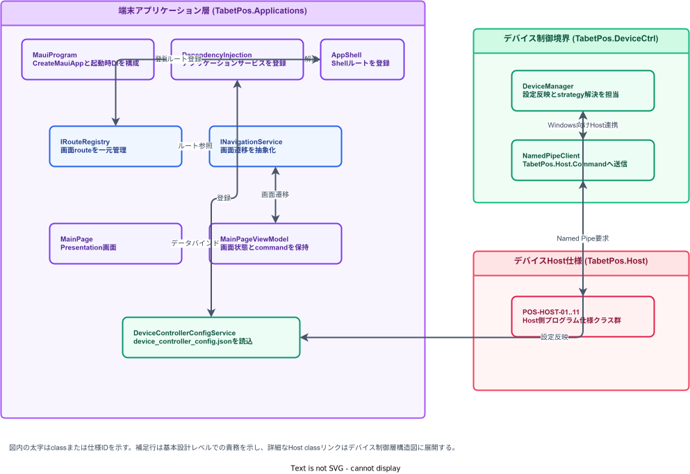

タブレットPOS
ARCH-02 端末アプリケーション構造設計書
第1.0.0版
2026年6月19日

## 改訂履歴

| 改訂日 | 版数 | 内容 | 改訂者 | 承認者 |
| :----- | :--- | :--- | :----- | :----- |
| 2026/06/19 | 1.0.0 | タブレットPOS ソフトウェア全体構造設計書の構成に合わせ、端末アプリケーションの Presentation / Application / Domain / Ports / Infrastructure の責務と実装規約を定義 | VTI | - |

## 目次

- [1. イントロダクション](#1-イントロダクション)
  - [1.1 本書の位置づけ](#11-本書の位置づけ)
  - [1.2 前提事項](#12-前提事項)
  - [1.3 対象読者](#13-対象読者)
  - [1.4 関連ドキュメント](#14-関連ドキュメント)
- [2. 基本アーキテクチャ](#2-基本アーキテクチャ)
  - [2.1 端末アプリケーションの責務](#21-端末アプリケーションの責務)
  - [2.2 レイヤ構成](#22-レイヤ構成)
  - [2.3 依存関係ルール](#23-依存関係ルール)
  - [2.4 採用技術](#24-採用技術)
- [3. Presentation 層](#3-presentation-層)
  - [3.1 構成要素](#31-構成要素)
  - [3.2 画面と ViewModel](#32-画面と-viewmodel)
  - [3.3 Shell 画面遷移](#33-shell-画面遷移)
  - [3.4 画面ライフサイクル](#34-画面ライフサイクル)
- [4. Application 層](#4-application-層)
  - [4.1 構成要素](#41-構成要素)
  - [4.2 サービス実装規約](#42-サービス実装規約)
  - [4.3 デバイス制御層との連携](#43-デバイス制御層との連携)
  - [4.4 非同期処理とエラー処理](#44-非同期処理とエラー処理)
- [5. Domain / Ports / Infrastructure](#5-domain--ports--infrastructure)
  - [5.1 Domain 層](#51-domain-層)
  - [5.2 Ports 層](#52-ports-層)
  - [5.3 Infrastructure 層](#53-infrastructure-層)
  - [5.4 設定・ログ・永続化](#54-設定ログ永続化)
- [6. 実装規約](#6-実装規約)
  - [6.1 DI 登録規約](#61-di-登録規約)
  - [6.2 画面追加規約](#62-画面追加規約)
  - [6.3 命名・配置規約](#63-命名配置規約)
  - [6.4 テスト・検証観点](#64-テスト検証観点)
- [7. 関連資料](#7-関連資料)

## 1. イントロダクション

### 1.1 本書の位置づけ

本書は、タブレットPOS 端末アプリケーションの内部構造を定義する構造設計書である。

対象は `TabetPos.Applications` を中心とし、UI、画面遷移、ViewModel、Application service、設定サービス、DeviceCtrl 呼び出し境界を扱う。

本書は個別業務画面の詳細仕様ではない。個別機能の入力項目、業務判定、帳票レイアウトは各機能仕様書で定義する。

### 1.2 前提事項

端末アプリケーションは .NET MAUI を基盤とする。

`MauiProgram` で UI、Platform service、Core layer、Application service、ViewModel、Page を DI 登録する。

画面遷移は MAUI Shell route と `IRouteRegistry` / `INavigationService` の組み合わせで管理する。

デバイス制御は `TabetPos.DeviceCtrl` の strategy interface を経由し、画面層から OPOS / OCX / Named Pipe を直接呼び出さない。

### 1.3 対象読者

| 読者 | 用途 |
|---|---|
| アプリケーション開発者 | Page、ViewModel、Application service の配置と責務を確認する |
| デバイス制御開発者 | 端末アプリケーションから DeviceCtrl へ渡す境界を確認する |
| テスト担当者 | 画面遷移、ライフサイクル、設定反映、デバイス呼び出しの検証観点を確認する |
| PM / アーキテクト | 端末アプリケーション層の設計方針と未実装範囲を確認する |

### 1.4 関連ドキュメント

| ファイル名 |
|---|
| ARCH-01_タブレットPOS_ソフトウェア構造設計書.docx |
| ARCH-03_タブレットPOS_デバイス制御層構造設計書.docx |
| POS-HOST-01_タブレットPOS_ホスト_名前付きパイプコマンドサーバー_プログラム仕様書.xlsx |
| POS-HOST-02_タブレットPOS_ホスト_名前付きパイプデバイスホストアダプター_プログラム仕様書.xlsx |
| POS-HOST-03_タブレットPOS_ホスト_デバイスコマンドルーター_プログラム仕様書.xlsx |
| POS-HOST-04_タブレットPOS_ホスト_デバイスコマンドハンドラー_プログラム仕様書.xlsx |
| POS-HOST-05_タブレットPOS_ホスト_デバイスサーバーホスト_プログラム仕様書.xlsx |
| POS-HOST-06_タブレットPOS_ホスト_デバイスマネージャー_プログラム仕様書.xlsx |
| POS-HOST-07_タブレットPOS_ホスト_デバイスベース_プログラム仕様書.xlsx |
| POS-HOST-08_タブレットPOS_ホスト_釣銭機制御_RT-300_プログラム仕様書.xlsx |
| POS-HOST-09_タブレットPOS_ホスト_自動釣銭機UIスレッドフォーム_RT-300_プログラム仕様書.xlsx |
| POS-HOST-10_タブレットPOS_ホスト_キャッシュドロア制御_SHARP_プログラム仕様書.xlsx |
| POS-HOST-11_タブレットPOS_ホスト_カスタマーディスプレイ制御_SHARP_プログラム仕様書.xlsx |

## 2. 基本アーキテクチャ

### 2.1 端末アプリケーションの責務

端末アプリケーションは、POS 操作画面、画面状態、ユーザー操作、Application service 呼び出し、DeviceCtrl への抽象化された制御要求を担当する。

端末アプリケーションは、周辺機器の物理接続、OPOS / OCX / ActiveX の lifecycle、Named Pipe の wire protocol を直接管理しない。

図 2-1 に端末アプリケーション層の主要 class と境界を示す。

図内の太字は class 名または仕様IDを示し、下段は基本設計レベルの責務を示す。端末アプリケーション層は画面、ViewModel、navigation、device 設定読込を担当し、デバイスの物理制御は `TabetPos.DeviceCtrl` と `TabetPos.Host` へ委譲する。

| 設計要素 | 対象 class / file | 基本設計上の役割 |
|---|---|---|
| 起動構成 | `MauiProgram`, `DependencyInjection` | MAUI app の生成、DI container 構成、画面 / ViewModel / service 登録を行う |
| 画面遷移 | `AppShell`, `IRouteRegistry`, `INavigationService` | Shell route 登録、route 名の一元管理、ViewModel からの画面遷移要求を扱う |
| 画面構成 | `MainPage`, `MainPageViewModel` | 画面表示、入力状態、command、navigation / device service 呼び出しを分離する |
| デバイス設定 | `DeviceControllerConfigService` | `device_controller_config.json` を読み込み、`DeviceManager` へ設定を反映する |
| デバイス境界 | `DeviceManager`, `NamedPipeClient` | strategy 解決と Host 連携を担当し、端末アプリケーションから通信詳細を隠蔽する |

### 2.2 レイヤ構成

| レイヤ | 主な構成 | 責務 |
|---|---|---|
| Presentation | Views、ViewModels、Resources、Controls | 画面表示、入力、画面状態、UI lifecycle |
| Application | Devices、Navigation、共通Result / handler契約 | ユースケース単位の調整、画面遷移、設定読込、DeviceCtrl 呼び出し |
| Domain | 業務モデル、業務ルール | 現行ソースでは独立folder未作成。業務ルール増加時に分離する |
| Ports | service interface、device strategy interface | 外部境界を抽象化する契約 |
| Infrastructure | Platform services、local settings、file system、HTTP、logging | OS / SDK / 永続化などの実装詳細 |

### 2.3 依存関係ルール

Presentation は Application service と ViewModel base に依存してよい。

Application は Ports と Domain に依存してよいが、UI 表示部品や OPOS / Named Pipe 実装へ直接依存しない。

Domain は MAUI、Shell、DeviceCtrl 実装、HTTP、SQLite、Sentry、Serilog へ依存しない。

Infrastructure は Ports の実装として配置し、OS API、ファイル、HTTP、SDK などの詳細を閉じ込める。

### 2.4 採用技術

| 領域 | 技術 / ライブラリ | 用途 |
|---|---|---|
| UI | .NET MAUI | POS 端末アプリケーション UI |
| UI 補助 | CommunityToolkit.Maui | MAUI toolkit |
| MVVM | CommunityToolkit.Mvvm | ObservableObject / command pattern |
| Navigation | MAUI Shell | Route based navigation |
| DI | Microsoft.Extensions.DependencyInjection | Page / ViewModel / service 登録 |
| Logging | Serilog / AppLogger | アプリケーションログ |
| Device boundary | TabetPos.DeviceCtrl | 周辺機器制御 strategy 呼び出し |

## 3. Presentation 層

### 3.1 構成要素

`Views` は XAML / code-behind による画面定義、`ViewModels` は画面状態と画面操作を担当する。

`Resources` は文字列、スタイル、フォントなどの表示リソースを保持する。

`Views.Base.BaseContentPage` と `BaseViewModel` は loading 表示、lifecycle、header 表示、キー入力処理の共通基盤である。

### 3.2 画面と ViewModel

画面は Page と ViewModel を 1 対 1 に近い粒度で構成する。

ViewModel は画面状態、入力検証、画面操作、Application service 呼び出しを担当する。

ViewModel から他画面へ遷移する場合は `INavigationService` を利用し、`Shell.Current.GoToAsync` を各 ViewModel に分散させない。

### 3.3 Shell 画面遷移

`AppShell.RegisterRoutes` は `IRouteRegistry.RegisterRoute<TPage, TViewModel>` を呼び出し、Shell route と ViewModel から route を引く対応を登録する。

`MauiNavigationService` は route 正規化、戻る可否、パラメータ付き遷移、遷移後の `INavigationAware.OnNavigatedTo` 呼び出しを担当する。

ホーム画面への遷移は root stack reset を伴う route として扱う。

### 3.4 画面ライフサイクル

`BaseViewModel.InitializeAsync` は初回表示時の重い初期化に利用する。

`OnAppearingAsync` は画面再表示ごとのデータ更新に利用する。

`OnDisappearingAsync` は画面離脱時の一時的な cleanup に利用する。

`OnResumingAsync` / `OnStoppingAsync` はアプリ foreground / background 遷移時の再接続、保存、停止処理に利用する。

## 4. Application 層

### 4.1 構成要素

Application 層は、Navigation、DeviceController 設定読込、共通Result、command / query handler 契約など、画面をまたぐ処理を提供する。

`MauiProgram` は `AddApplicationServices()` を呼び出し、`IDeviceControllerConfigService`、`IRouteRegistry`、`INavigationService`、`AppShell`、`MainPage`、`MainPageViewModel` を DI 登録する。

### 4.2 サービス実装規約

Service は interface を経由して ViewModel へ注入する。

Service は UI 表示そのものではなく、画面から呼び出される処理単位を提供する。

外部 I/O を伴う service は非同期 API を基本とし、例外はログ出力後に呼び出し側で扱える形にする。

### 4.3 デバイス制御層との連携

`IDeviceControllerConfigService.InitializeDeviceManagerAsync` は設定読込後に DI で注入された `DeviceManager.InitializeFromConfig` を呼び出す。

ViewModel は `ICashChangerStrategy`、`IPrinterStrategy`、`IBarcodeScannerStrategy` などの device interface を介してデバイス操作を呼び出す。

端末アプリケーション側では device strategy の選択条件、OS 別実装、Named Pipe command 名を直接分岐しない。

### 4.4 非同期処理とエラー処理

`BaseViewModel.WithLoadingAsync` は loading 表示を伴う非同期処理の共通 wrapper である。

`BaseViewModel.ExecuteCommand` は UI thread と background task の切り替えを扱う。

DeviceCtrl 呼び出し失敗時の表示文言、再試行可否、画面遷移は Application / Presentation 側で判断する。

## 5. Domain / Ports / Infrastructure

### 5.1 Domain 層

Domain 層は業務ルール、金額計算、販売状態、入力可否など、UI と device implementation から独立した判断を保持する。

現行ソースでは画面実装に近い処理が多いため、業務ルールが増える場合は ViewModel から Domain service / model へ段階的に分離する。

### 5.2 Ports 層

Ports は Application 層が利用する抽象契約である。

例として、`INavigationService`、`IRouteRegistry`、`IDeviceControllerConfigService`、DeviceCtrl の各 strategy interface が該当する。

### 5.3 Infrastructure 層

Infrastructure 層は OS API、ファイルアクセス、HTTP、MAUI platform dispatcher、local settings、device SDK などの実装詳細を担当する。

Infrastructure は Application / Ports から呼び出される実装であり、Domain から直接参照しない。

### 5.4 設定・ログ・永続化

デバイス設定は `device_controller_config.json` から読み込む。`DeviceControllerConfigService` は runtime 設定ファイルを優先し、存在しない場合は package default を読み込み、DeviceManager へ反映する。

ログは `AppLogger` / Serilog を経由し、端末アプリケーションのログファイルは app data 配下の `logs/app.log` を基本とする。

ローカル状態、設定、DB migration は `MauiProgram` と Core layer 登録により初期化される。runtime 設定保存時は app data 配下の `device_controller_config.json` を更新する。

## 6. 実装規約

### 6.1 DI 登録規約

Page、ViewModel、Service は `MauiProgram` で登録する。

画面常駐または共有状態が必要なものは Singleton、画面遷移ごとに状態を分離するものは Transient とする。

登録漏れは Shell 遷移時の runtime error になりやすいため、画面追加時は route 登録、Page 登録、ViewModel 登録を同時に確認する。

### 6.2 画面追加規約

新規画面追加時は Page、ViewModel、route 名、`AppShell.RegisterRoutes` 内の `IRouteRegistry.RegisterRoute`、DI 登録を一組で追加する。

ViewModel は `BaseViewModel` を継承し、初期化、再表示、画面離脱、アプリ resume / stop の処理を適切な lifecycle method に分ける。

### 6.3 命名・配置規約

画面名は `{Feature}Page`、ViewModel は `{Feature}PageViewModel` を基本とする。

Application service は用途別folderに interface と実装を配置する。現行の device 設定は `Application/Devices`、navigation は `Ports/Navigation` と `Infrastructure/Navigation` に分離する。

Platform 固有処理は platform service として分離し、ViewModel に OS 分岐を埋め込まない。

### 6.4 テスト・検証観点

画面追加時は route 登録、DI 解決、初回表示、戻る遷移、パラメータ受け渡しを確認する。

DeviceCtrl 呼び出しを伴う画面は、device 未接続、設定不備、timeout、再試行時の UI 表示を確認する。

device_controller_config 更新時は JSON parse、DeviceManager 再初期化、既存画面への影響を確認する。

## 7. 関連資料

- `sources/POS 開発用ベースプロジェクト/TabetPos.Applications/MauiProgram.cs`
- `sources/POS 開発用ベースプロジェクト/TabetPos.Applications/AppShell.xaml.cs`
- `sources/POS 開発用ベースプロジェクト/TabetPos.Applications/Presentation/ViewModels/Base/BaseViewModel.cs`
- `sources/POS 開発用ベースプロジェクト/TabetPos.Applications/Application/Devices/DeviceControllerConfigService.cs`
- `sources/POS 開発用ベースプロジェクト/TabetPos.DeviceCtrl/Interfaces/`
