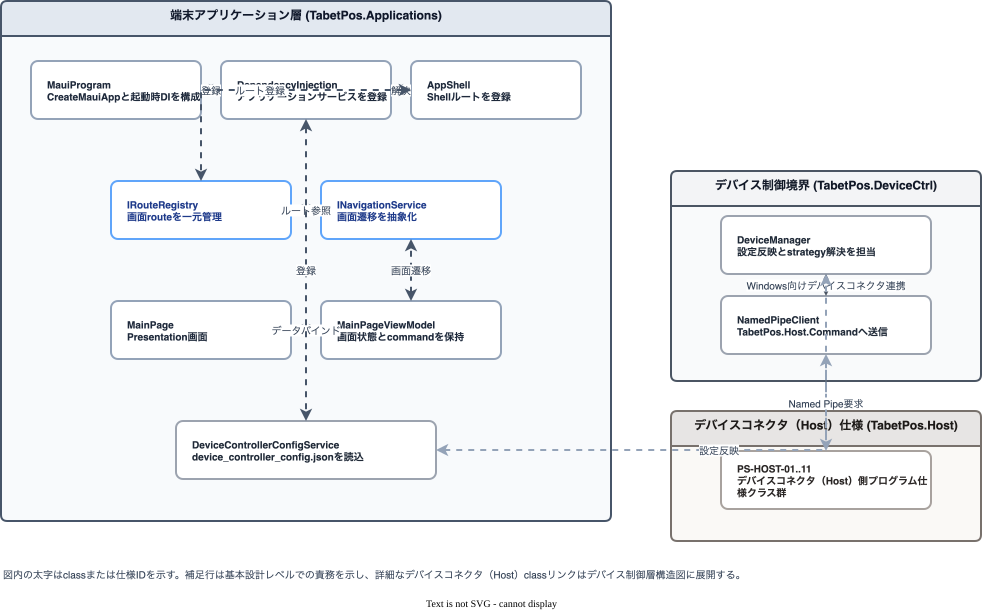

# ARCH-02 タブレットPOS 端末アプリケーション構造設計書

タブレットPOS
ARCH-02 端末アプリケーション構造設計書
文書ID: ARCH-02
第1.0.0版
2026年9月3日

## 表紙

文書情報を以下に示す。

| 項目 | 内容 |
|---|---|
| 文書ID | ARCH-02 |
| PJ名 | タブレットPOS |
| システム名 | タブレットPOS |
| 成果物名 | 端末アプリケーション構造設計書 |
| 版数 | 1.0.0 |
| 作成日 | 2026/09/03 |

## 変更履歴

| No. | 版数 | 変更日 | 区分 | 変更箇所（項番等） | 変更内容 | 担当者 |
| --- | --- | --- | --- | --- | --- | --- |
| 1 | 1.0.0 | 2026/09/03 | 新規 | 全体 | 正式版として初版を作成。 | VTI |

## 目次

```text
1. イントロダクション
2. 基本アーキテクチャ
3. プレゼンテーション層
4. アプリケーション層
5. ドメイン／ポート／インフラストラクチャ
6. 実装規約
7. 関連資料
8. 結論
```

- [1. イントロダクション](#1-イントロダクション)
 - [1.1 本書の位置づけ](#11-本書の位置づけ)
 - [1.2 前提事項](#12-前提事項)
 - [1.3 対象読者](#13-対象読者)
 - [1.4 関連ドキュメント](#14-関連ドキュメント)
- [2. 基本アーキテクチャ](#2-基本アーキテクチャ)
 - [2.1 端末アプリケーションの責務](#21-端末アプリケーションの責務)
 - [2.2 レイヤ構成](#22-レイヤ構成)
 - [2.3 依存関係ルール](#23-依存関係ルール)
 - [2.4 採用技術](#24-採用技術)
- [3. プレゼンテーション層](#3-プレゼンテーション層)
 - [3.1 構成要素](#31-構成要素)
 - [3.2 画面とビューモデル](#32-画面とビューモデル)
 - [3.3 シェル画面遷移](#33-シェル画面遷移)
 - [3.4 画面ライフサイクル](#34-画面ライフサイクル)
- [4. アプリケーション層](#4-アプリケーション層)
 - [4.1 構成要素](#41-構成要素)
 - [4.2 サービス実装規約](#42-サービス実装規約)
 - [4.3 デバイス制御層との連携](#43-デバイス制御層との連携)
 - [4.4 非同期処理とエラー処理](#44-非同期処理とエラー処理)
- [5. ドメイン／ポート／インフラストラクチャ](#5-ドメインポートインフラストラクチャ)
 - [5.1 ドメイン層](#51-ドメイン層)
 - [5.2 ポート層](#52-ポート層)
 - [5.3 インフラストラクチャ層](#53-インフラストラクチャ層)
 - [5.4 設定・ログ・永続化](#54-設定ログ永続化)
- [6. 実装規約](#6-実装規約)
 - [6.1 DI 登録規約](#61-di-登録規約)
 - [6.2 画面追加規約](#62-画面追加規約)
 - [6.3 命名・配置規約](#63-命名配置規約)
 - [6.4 テスト・検証観点](#64-テスト検証観点)
- [7. 関連資料](#7-関連資料)
- [8. 結論](#8-結論)

## 1. イントロダクション

### 1.1 本書の位置づけ

本書は、タブレットPOS 端末アプリケーションの内部構造を定義する構造設計書である。

対象は `Pos.Applications` を中心とし、UI、画面遷移、ViewModel、Application service、設定サービス、DeviceCtrl 呼び出し境界を扱う。

本書は個別業務画面の詳細仕様ではない。個別機能の入力項目、業務判定、帳票レイアウトは各機能仕様書で定義する。

### 1.2 前提事項

端末アプリケーションは .NET MAUI を基盤とする。

`MauiProgram` で UI、Platform service、Core layer、Application service、ViewModel、Page を DI 登録する。

画面遷移は MAUI Shell route と `IRouteRegistry` / `INavigationService` の組み合わせで管理する。

デバイス制御は `Pos.DeviceCtrl` の strategy interface を経由し、画面層から OPOS / OCX / Named Pipe を直接呼び出さない。

### 1.3 対象読者

| 読者 | 用途 |
|---|---|
| アプリケーション開発者 | Page、ViewModel、Application service の配置と責務を確認する |
| デバイス制御開発者 | 端末アプリケーションから DeviceCtrl へ渡す境界を確認する |
| テスト担当者 | 画面遷移、ライフサイクル、設定反映、デバイス呼び出しの検証観点を確認する |
| PM / アーキテクト | 端末アプリケーション層の設計方針、現在の適用範囲、および責務境界を確認する |

### 1.4 関連ドキュメント

| ファイル名 |
|---|
| ARCH-01_タブレットPOS_ソフトウェア構造設計書.docx |
| デバイスコネクタ基本設計書 |
| DB-DEVICE-01_デバイス制御設定_SQLiteテーブル定義書.xlsx |
| PS-HOST-01_タブレットPOS_ホスト_名前付きパイプコマンドサーバー_プログラム仕様書.xlsx |
| PS-HOST-02_タブレットPOS_ホスト_名前付きパイプデバイスホストアダプター_プログラム仕様書.xlsx |
| PS-HOST-03_タブレットPOS_ホスト_デバイスコマンドルーター_プログラム仕様書.xlsx |
| PS-HOST-04_タブレットPOS_ホスト_デバイスコマンドハンドラー_プログラム仕様書.xlsx |
| PS-HOST-05_タブレットPOS_ホスト_デバイスサーバーホスト_プログラム仕様書.xlsx |
| PS-HOST-06_タブレットPOS_ホスト_デバイスマネージャー_プログラム仕様書.xlsx |
| PS-HOST-07_タブレットPOS_ホスト_デバイスベース_プログラム仕様書.xlsx |
| PS-HOST-08_タブレットPOS_ホスト_自動釣銭機制御_RT-300_プログラム仕様書.xlsx |
| PS-HOST-09_タブレットPOS_ホスト_自動釣銭機UIスレッドフォーム_RT-300_プログラム仕様書.xlsx |
| PS-HOST-10_タブレットPOS_ホスト_ドロア制御_SHARP_プログラム仕様書.xlsx |
| PS-HOST-11_タブレットPOS_ホスト_カスタマディスプレイ制御_SHARP_プログラム仕様書.xlsx |

## 2. 基本アーキテクチャ

### 2.1 端末アプリケーションの責務

端末アプリケーションは、POS 操作画面、画面状態、ユーザー操作、Application service 呼び出し、DeviceCtrl への抽象化された制御要求を担当する。

端末アプリケーションは、周辺機器の物理接続、OPOS / OCX / ActiveX の lifecycle、Named Pipe の wire protocol を直接管理しない。

図 2-1 に端末アプリケーション層の主要 class と境界を示す。



図内の太字はclass名または仕様IDを示し、下段は基本設計レベルの責務を示す。端末アプリケーション層は画面、ViewModel、navigation、DeviceManager初期化、およびHost・イベント受信のライフサイクルを担当する。デバイス設定の読込・保存とstrategy選択は `Pos.DeviceCtrl`、物理制御は `Pos.DeviceCtrl` と `Pos.DeviceConnector` へ委譲する。

| 設計要素 | 対象クラス／ファイル | 基本設計上の役割 |
|---|---|---|
| 起動構成 | `MauiProgram`, `DependencyInjection` | MAUI appの生成、`AddApplicationServices`によるDI構成、ローカルDB migration、および`DeviceManager.InitializeAsync`の起動を行う |
| 画面遷移 | `AppShell`, `IRouteRegistry`, `INavigationService` | Shell route 登録、route 名の一元管理、ViewModel からの画面遷移要求を扱う |
| 画面構成 | `MainPage`, `MainPageViewModel` | 画面表示、入力状態、command、navigation / device service 呼び出しを分離する |
| デバイス設定 | `DeviceManager`, `DeviceControllerConfigService` | 端末アプリケーションは`DeviceManager.InitializeAsync`だけを起動し、DeviceCtrl内部の設定サービスが起動時JSON取込、SQLiteへの再登録・フォールバック読込、および設定適用を行う |
| 実機確認用デバイス境界 | `DeviceIntegrationTestViewModel`, `IDeviceIntegrationTestStrategyProvider`, `DeviceIntegrationTestStrategyProvider` | ViewModelからDeviceManagerを直接参照せず、デバイス種別ごとの公開strategyを取得する |
| デバイスサービスライフサイクル | `App`, `IHostProcessManager`, `IDeviceEventReceiver` | Window作成・有効化・再開時にHostとイベント受信を開始し、停止・破棄時にイベント受信とHostを停止する |

### 2.2 レイヤ構成

| レイヤ | 主な構成 | 責務 |
|---|---|---|
| Presentation | Views、ViewModels、Resources、Controls | 画面表示、入力、画面状態、UI lifecycle |
| Application | Devices、Navigation、共通Result / handler契約 | ユースケース単位の調整、画面遷移、実機確認用strategy provider、Hostプロセス管理、およびDeviceCtrl呼び出し |
| Domain | 業務モデル、業務ルール | 現行構成では独立したDomain folderを使用しない。業務ルールを追加する場合はUIとdevice実装から分離する |
| Ports | navigation、dialog、device process / strategy provider interface | 外部境界を抽象化する契約 |
| Infrastructure | Platform services、local settings、file system、HTTP、logging | OS / SDK / 永続化などの実装詳細 |

### 2.3 依存関係ルール

Presentation は Application service と ViewModel base に依存してよい。

Application は Ports と Domain に依存してよいが、UI 表示部品や OPOS / Named Pipe 実装へ直接依存しない。

Domain は MAUI、Shell、DeviceCtrl 実装、HTTP、SQLite、Sentry、Serilog へ依存しない。

Infrastructure は Ports の実装として配置し、OS API、ファイル、HTTP、SDK などの詳細を閉じ込める。

### 2.4 採用技術

| 領域 | 技術 / ライブラリ | 用途 |
|---|---|---|
| UI | .NET MAUI | POS 端末アプリケーション UI |
| UI 補助 | CommunityToolkit.Maui | MAUI toolkit |
| MVVM | CommunityToolkit.Mvvm | ObservableObject / command pattern |
| Navigation | MAUI Shell | Route based navigation |
| DI | Microsoft.Extensions.DependencyInjection | Page / ViewModel / service 登録 |
| Logging | Serilog / AppLogger | アプリケーションログ |
| Device boundary | Pos.DeviceCtrl | 周辺機器制御 strategy 呼び出し |
| Shared device contract | Pos.DeviceContracts | DeviceCtrlとHostで共有する名前付きパイプ要求・応答・イベントDTO、識別子、および通信既定値 |

## 3. プレゼンテーション層

### 3.1 構成要素

`Views` は XAML / code-behind による画面定義、`ViewModels` は画面状態と画面操作を担当する。

`Resources` は文字列、スタイル、フォントなどの表示リソースを保持する。

`Views.Base.BaseContentPage` と `BaseViewModel` は loading 表示、lifecycle、header 表示、キー入力処理の共通基盤である。

### 3.2 画面とビューモデル

画面は Page と ViewModel を 1 対 1 に近い粒度で構成する。

ViewModel は画面状態、入力検証、画面操作、Application service 呼び出しを担当する。

ViewModel から他画面へ遷移する場合は `INavigationService` を利用し、`Shell.Current.GoToAsync` を各 ViewModel に分散させない。

### 3.3 シェル画面遷移

`AppShell.RegisterRoutes` は `IRouteRegistry.RegisterRoute<TPage, TViewModel>` を呼び出し、Shell route と ViewModel から route を引く対応を登録する。

`MauiNavigationService` は route 正規化、戻る可否、パラメータ付き遷移、遷移後の `INavigationAware.OnNavigatedTo` 呼び出しを担当する。

ホーム画面への遷移は root stack reset を伴う route として扱う。

### 3.4 画面ライフサイクル

`BaseViewModel.InitializeAsync` は初回表示時の重い初期化に利用する。

`OnAppearingAsync` は画面再表示ごとのデータ更新に利用する。

`OnDisappearingAsync` は画面離脱時の一時的な cleanup に利用する。

`OnResumingAsync` / `OnStoppingAsync` はアプリ foreground / background 遷移時の再接続、保存、停止処理に利用する。

## 4. アプリケーション層

### 4.1 構成要素

Application層は、Navigation、Hostプロセス管理、実機確認用strategy provider、共通Result、command / query handler契約など、画面をまたぐ処理を提供する。デバイス設定の読込と保存はDeviceCtrl内部の責務とする。

`MauiProgram` は `AddApplicationServices()` を呼び出す。`DependencyInjection.AddApplicationServices` は `AddPosDeviceCtrl()` によりDeviceCtrlを登録し、`IHostProcessManager`、`IDeviceIntegrationTestStrategyProvider`、`IRouteRegistry`、`INavigationService`、`AppShell`、Page、およびViewModelをDI登録する。

### 4.2 サービス実装規約

Service は interface を経由して ViewModel へ注入する。

Service は UI 表示そのものではなく、画面から呼び出される処理単位を提供する。

外部 I/O を伴う service は非同期 API を基本とし、例外はログ出力後に呼び出し側で扱える形にする。

### 4.3 デバイス制御層との連携

`MauiProgram.InitializeDeviceControllerConfig` はDIから `DeviceManager` を解決し、`InitializeAsync` の完了を待つ。設定読込、デフォルト設定への切替、strategy登録、およびNamedPipeSettingsの適用はDeviceCtrl内部で行う。

`DeviceIntegrationTestViewModel` は `IDeviceIntegrationTestStrategyProvider` を介して実機確認用のstrategyを取得する。`DeviceIntegrationTestStrategyProvider` は `DeviceManager.Get...StrategyAsync` へ委譲し、`ICashChangerStrategy`、`IPrinterStrategy`、`IPaymentStrategy`、`IBarcodeScannerStrategy` などの公開デバイス契約を返す。

端末アプリケーション側では device strategy の選択条件、OS 別実装、Named Pipe command 名を直接分岐しない。

`App` はWindow作成・有効化・再開時に `IHostProcessManager.EnsureStartedAsync` の後で `IDeviceEventReceiver.StartAsync` を呼び出し、停止・破棄時はイベント受信を止めてからHostを停止する。現行ソースでは `EventReceived` の購読者を登録していないため、受信イベントをApplicationユースケースへ引き渡さない。

### 4.4 非同期処理とエラー処理

`BaseViewModel.WithLoadingAsync` は loading 表示を伴う非同期処理の共通 wrapper である。

`BaseViewModel.ExecuteCommand` は UI thread と background task の切り替えを扱う。

DeviceCtrl 呼び出し失敗時の表示文言、再試行可否、画面遷移は Application / Presentation 側で判断する。

## 5. ドメイン／ポート／インフラストラクチャ

### 5.1 ドメイン層

Domain 層は業務ルール、金額計算、販売状態、入力可否など、UI と device implementation から独立した判断を保持する。

現行ソースでは画面実装に近い処理が多いため、業務ルールが増える場合は ViewModel から Domain service / model へ段階的に分離する。

### 5.2 ポート層

Ports は Application 層が利用する抽象契約である。

例として、`INavigationService`、`IRouteRegistry`、`IHostProcessManager`、`IDeviceIntegrationTestStrategyProvider`、DeviceCtrlの各strategy interfaceが該当する。

### 5.3 インフラストラクチャ層

Infrastructure 層は OS API、ファイルアクセス、HTTP、MAUI platform dispatcher、local settings、device SDK などの実装詳細を担当する。

Infrastructure は Application / Ports から呼び出される実装であり、Domain から直接参照しない。

### 5.4 設定・ログ・永続化

デバイス設定はDeviceCtrl内部の `DeviceControllerConfigService` がアプリ起動時に `device_controller_config.json` の取込を試行する。読込・検証できた場合は `device_controller_config.db` へ再登録し、SQLiteから設定を復元する。JSONを取得または使用できない場合は既存SQLiteへフォールバックし、SQLiteも未初期化の場合だけ組込みデフォルトを登録する。実行中はSQLiteから読み込み、`DeviceManager` へ適用する。端末アプリケーションは設定ファイルとデータベースを直接操作しない。

ログは `AppLogger` / Serilog を経由し、端末アプリケーションのログファイルは app data 配下の `logs/app.log` を基本とする。

ローカル状態、設定、およびDB migrationは `MauiProgram` とCore layerの登録により初期化される。デバイス設定の保存時は `device_controller_config.db` を更新し、保存に成功した場合に `DeviceManager` が新しい設定を適用する。JSONへは書き戻さず、外部JSONの変更は次回アプリ起動時に再取込する。

## 6. 実装規約

### 6.1 DI 登録規約

Page、ViewModel、Serviceは `DependencyInjection.AddApplicationServices` で登録し、`MauiProgram` はこの拡張メソッドを一度呼び出す。DeviceCtrlの登録は `AddPosDeviceCtrl` へ委譲する。

画面常駐または共有状態が必要なものは Singleton、画面遷移ごとに状態を分離するものは Transient とする。

登録漏れは Shell 遷移時の runtime error になりやすいため、画面追加時は route 登録、Page 登録、ViewModel 登録を同時に確認する。

### 6.2 画面追加規約

新規画面追加時は Page、ViewModel、route 名、`AppShell.RegisterRoutes` 内の `IRouteRegistry.RegisterRoute`、DI 登録を一組で追加する。

ViewModel は `BaseViewModel` を継承し、初期化、再表示、画面離脱、アプリ resume / stop の処理を適切な lifecycle method に分ける。

### 6.3 命名・配置規約

画面名は `{Feature}Page`、ViewModel は `{Feature}PageViewModel` を基本とする。

Application serviceは用途別folderにinterfaceと実装を配置する。Hostプロセス管理は `Application/Devices`、実機確認用strategy providerは `Application/Devices/Testing`、navigationは `Ports/Navigation` と `Infrastructure/Navigation` に分離する。DeviceCtrlの設定サービスは `Pos.DeviceCtrl/Configuration` に配置する。

Platform 固有処理は platform service として分離し、ViewModel に OS 分岐を埋め込まない。

### 6.4 テスト・検証観点

画面追加時は route 登録、DI 解決、初回表示、戻る遷移、パラメータ受け渡しを確認する。

DeviceCtrl 呼び出しを伴う画面は、device 未接続、設定不備、timeout、再試行時の UI 表示を確認する。

Host再起動またはNamed Pipe切断を検出した場合は、通信異常を操作結果「失敗」として記録し、再起動前のstrategy参照を破棄して画面状態を「未接続」へ戻すことを確認する。後続操作は、`Start`で新しいHostセッションを確立してから実行する。

device_controller_config更新時は、入力JSONの検証、SQLiteの4テーブルへの再登録、SQLiteからの設定復元、`DeviceManager` への再適用、コマンド通信とイベント受信へのNamedPipeSettings反映、および既存画面への影響を確認する。JSONを取得できない再起動では前回SQLiteへ保存した設定を使用できること、SQLiteへの保存に失敗した場合は新しい設定を適用しないことを確認する。

## 7. 関連資料

- `sources/pos-integration/Pos.Applications/MauiProgram.cs`
- `sources/pos-integration/Pos.Applications/App.xaml.cs`
- `sources/pos-integration/Pos.Applications/Composition/DependencyInjection.cs`
- `sources/pos-integration/Pos.Applications/AppShell.xaml.cs`
- `sources/pos-integration/Pos.Applications/Presentation/ViewModels/Base/BaseViewModel.cs`
- `sources/pos-integration/Pos.Applications/Application/Devices/Testing/DeviceIntegrationTestStrategyProvider.cs`
- `sources/pos-integration/Pos.DeviceCtrl/Configuration/DeviceControllerConfigService.cs`
- `sources/pos-integration/Pos.DeviceCtrl/DeviceManager.cs`
- `sources/pos-integration/Pos.DeviceCtrl/Interfaces/`

## 8. 結論

端末アプリケーションは、`MauiProgram` と `DependencyInjection` で構成を登録し、`DeviceManager.InitializeAsync` の起動だけを担当する。設定の読込・保存、strategy選択、および名前付きパイプ設定の適用はDeviceCtrl内部で完結する。

実機確認画面は `IDeviceIntegrationTestStrategyProvider` を介してDeviceManagerから公開strategyを取得する。Windowsでは `App` がHostとイベント受信のライフサイクルを管理するが、現行ソースでは `EventReceived` の購読者を登録していないため、受信イベントをApplicationユースケースへ引き渡さない。

端末アプリケーション側の `DeviceManager` はstrategy選択とDeviceCtrl設定を管理する。Host側の `TabletDeviceManager` は別プロセス内で物理デバイスの読込、利用状態、およびライフサイクルを管理する。名称が似ていても責務とプロセス境界は異なる。
