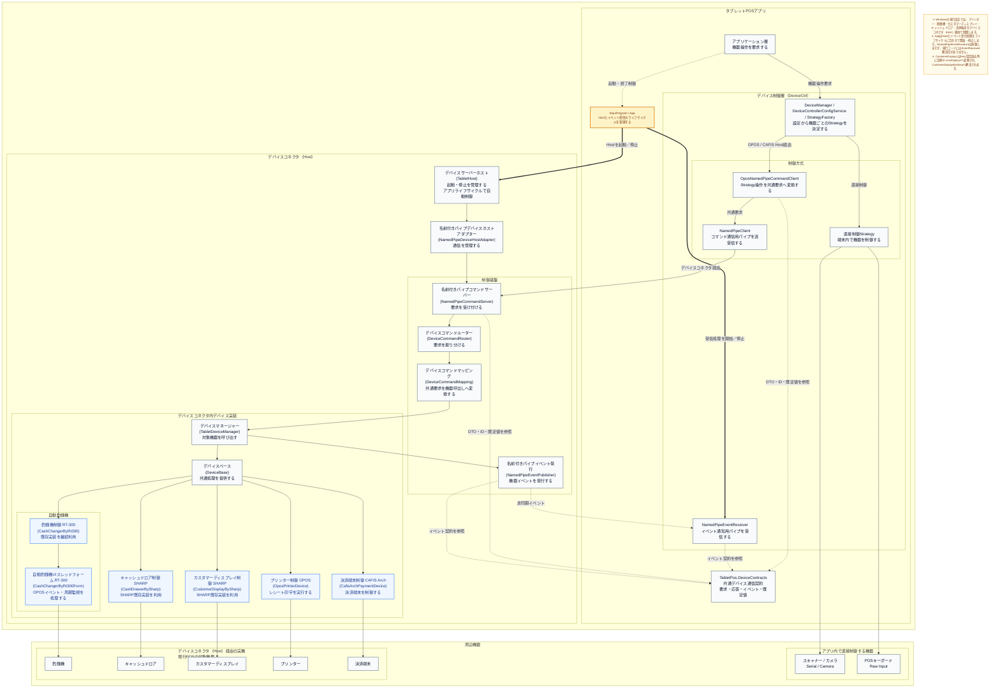

# タブレットPOS デバイスコネクタ制御方式構造図 Mermaid 原文

```mermaid
flowchart TB
    classDef direct fill:#F0FDF4,stroke:#22C55E,color:#14532D,stroke-width:1.5px;
    classDef server fill:#EFF6FF,stroke:#3B82F6,color:#1E3A8A,stroke-width:1.5px;
    classDef core fill:#F8FAFC,stroke:#64748B,color:#0F172A,stroke-width:1.5px;
    classDef lifecycle fill:#FEF3C7,stroke:#D97706,color:#78350F,stroke-width:2px,font-size:12px;
    classDef memo fill:#FFFBEB,stroke:#F59E0B,color:#78350F,stroke-width:1px,font-size:11px;

    subgraph upper[" "]
        direction LR

        subgraph tablet_pos["タブレットPOSアプリ"]
            direction TB

            app_layer["アプリケーション層\n機器操作を要求する"]
            app_lifecycle["MauiProgram / App\nHostとイベント受信のライフサイクルを管理する"]

            subgraph device_ctrl["デバイス制御層（DeviceCtrl）"]
                direction TB
                device_setup["DeviceManager / DeviceControllerConfigService / StrategyFactory\n設定から機器ごとのStrategyを決定する"]

                subgraph control_route["制御方式"]
                    direction LR
                    direct_control["直接制御Strategy\n端末内で機器を制御する"]
                    opos_mapper["OposNamedPipeCommandClient\nStrategy操作を共通要求へ変換する"]
                    namedpipe_client["NamedPipeClient\nコマンド通信用パイプを送受信する"]
                end

                event_receiver["NamedPipeEventReceiver\nイベント通知用パイプを受信する"]
            end

            device_contracts["TabletPos.DeviceContracts\n共通デバイス通信契約\n要求・応答・イベント・既定値"]

            app_layer -->|"機器操作要求"| device_setup
            app_layer -.->|"起動・終了制御"| app_lifecycle
            device_setup -->|"直接制御"| direct_control
            device_setup -->|"OPOS / CAFIS Host経由"| opos_mapper
            opos_mapper -->|"共通要求"| namedpipe_client
            opos_mapper -.->|"DTO・ID・既定値を参照"| device_contracts
            event_receiver -.->|"イベント契約を参照"| device_contracts
        end

        subgraph appserver["デバイスコネクタ（Host）"]
            direction TB

            host_main["デバイスサーバーホスト\n(TabletHost)\n起動・停止を管理する\nアプリライフサイクルで自動制御"]
            host_adapter["名前付きパイプデバイスホストアダプター\n(NamedPipeDeviceHostAdapter)\n通信を管理する"]

            subgraph appserver_core["制御基盤"]
                direction LR
                command_server["名前付きパイプコマンドサーバー\n(NamedPipeCommandServer)\n要求を受け付ける"]
                command_router["デバイスコマンドルーター\n(DeviceCommandRouter)\n要求を振り分ける"]
                command_mapper["デバイスコマンドマッピング\n(DeviceCommandMapping)\n共通要求を機器呼出しへ変換する"]
                event_publisher["名前付きパイプイベント発行\n(NamedPipeEventPublisher)\n機器イベントを発行する"]
            end

            subgraph appserver_runtime["デバイスコネクタ内デバイス実装"]
                direction TB
                device_manager["デバイスマネージャー\n(TabletDeviceManager)\n対象機器を呼び出す"]
                device_base["デバイスベース\n(DeviceBase)\n共通処理を提供する"]

                subgraph cash_changer_group["自動釣銭機"]
                    direction TB
                    cash_changer["釣銭機制御 RT-300\n(CashChangerByRt300)\n既存実装を継続利用"]
                    cash_changer_form["自動釣銭機UIスレッドフォーム RT-300\n(CashChangerByRt300Form)\nOPOSイベント・周期監視を処理する"]
                end

                cash_drawer["キャッシュドロア制御 SHARP\n(CashDrawerBySharp)\nSHARP既存実装を利用"]
                customer_display["カスタマーディスプレイ制御 SHARP\n(CustomerDisplayBySharp)\nSHARP既存実装を利用"]
                printer_host["プリンター制御 OPOS\n(OposPrinterDevice)\nレシート印字を実行する"]
                payment_host["決済端末制御 CAFIS Arch\n(CafisArchPaymentDevice)\n決済端末を制御する"]
            end

            host_main --> host_adapter
            host_adapter --> command_server
            command_server --> command_router
            command_router --> command_mapper
            command_mapper --> device_manager
            device_manager --> device_base
            device_base --> cash_changer
            cash_changer --> cash_changer_form
            device_base --> cash_drawer
            device_base --> customer_display
            device_base --> printer_host
            device_base --> payment_host
            device_manager --> event_publisher
            command_server -.->|"DTO・ID・既定値を参照"| device_contracts
            event_publisher -.->|"イベント契約を参照"| device_contracts
        end
    end

    subgraph devices["周辺機器"]
        direction LR

        subgraph direct_devices["アプリ内で直接制御する機器"]
            direction TB
            scanner["スキャナー / カメラ\nSerial / Camera"]
            keyboard["POSキーボード\nRaw Input"]
        end

        subgraph server_devices["デバイスコネクタ（Host）経由の実機\n現行POSの対象機器"]
            direction TB
            cash_changer_device["釣銭機"]
            cash_drawer_device["キャッシュドロア"]
            customer_display_device["カスタマーディスプレイ"]
            printer_device["プリンター"]
            payment_terminal["決済端末"]
        end
    end

    namedpipe_client -->|"デバイスコネクタ経由"| command_server
    event_publisher -.->|"非同期イベント"| event_receiver
    app_lifecycle ==>|"Hostを起動／停止"| host_main
    app_lifecycle ==>|"受信処理を開始／停止"| event_receiver

    direct_control --> scanner
    direct_control --> keyboard

    cash_changer_form --> cash_changer_device
    cash_drawer --> cash_drawer_device
    customer_display --> customer_display_device
    printer_host --> printer_device
    payment_host --> payment_terminal

    memo["＊ Windowsの現行設定では、プリンター・釣銭機・カスタマーディスプレイ・キャッシュドロア・決済端末をデバイスコネクタ（Host）経由で制御します。\n＊ AppはHostとイベント受信処理をライフサイクルに合わせて開始・停止します。NamedPipeEventReceiverは稼働しますが、現行コードにはEventReceived購読先がありません。\n＊ CustomerDisplay1はHost設定読込時に互換ID LineDisplay1へ変換され、CustomerDisplayBySharpへ解決されます。"]

    class app_layer,device_setup,namedpipe_client,opos_mapper,event_receiver,device_contracts,direct_control,host_main,host_adapter,command_server,command_router,command_mapper,event_publisher,device_manager,device_base core;
    class scanner,keyboard,printer_device,payment_terminal,cash_changer_device,cash_drawer_device,customer_display_device core;
    class cash_changer,cash_changer_form,cash_drawer,customer_display,printer_host,payment_host server;
    class app_lifecycle lifecycle;
    class memo memo;
```
