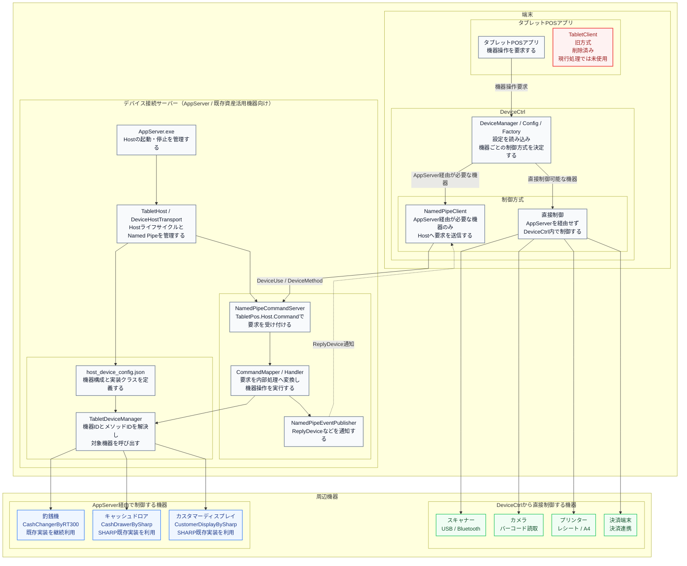

# タブレットPOS DeviceCtrl / AppServer 制御方式構造図 Mermaid 原文

```mermaid
%%{init: {
  "flowchart": {
    "nodeSpacing": 25,
    "padding": 8,
    "curve": "linear"
  }
}}%%

flowchart TB
    classDef removed fill:#FEF2F2,stroke:#EF4444,color:#991B1B,stroke-width:2px;
    classDef direct fill:#F0FDF4,stroke:#22C55E,color:#14532D,stroke-width:1.5px;
    classDef server fill:#EFF6FF,stroke:#3B82F6,color:#1E3A8A,stroke-width:1.5px;
    classDef core fill:#F8FAFC,stroke:#64748B,color:#0F172A,stroke-width:1.5px;

    subgraph upper[" "]
        direction LR

        subgraph terminal["端末"]
            direction TB

            subgraph tablet_app["タブレットPOSアプリ"]
                direction TB
                pos_app["タブレットPOSアプリ\n機器操作を要求する"]
                tabletclient_removed["TabletClient\n旧方式\n削除済み\n現行処理では未使用"]
            end

            subgraph device_ctrl["DeviceCtrl"]
                direction TB
                device_setup["DeviceManager / Config / Factory\n設定を読み込み\n機器ごとの制御方式を決定する"]

                subgraph control_route["制御方式"]
                    direction LR
                    direct_control["直接制御\nAppServerを経由せず\nDeviceCtrl内で制御する"]
                    namedpipe_client["NamedPipeClient\nAppServer経由が必要な機器のみ\nHostへ要求を送信する"]
                end
            end

            pos_app -->|"機器操作要求"| device_setup
            device_setup -->|"直接制御可能な機器"| direct_control
            device_setup -->|"AppServer経由が必要な機器"| namedpipe_client
        end

        subgraph appserver["デバイス接続サーバー（AppServer / 既存資産活用機器向け）"]
            direction TB

            app_server["AppServer.exe\nHostの起動・停止を管理する"]
            tablethost["TabletHost / DeviceHostTransport\nHostライフサイクルと\nNamed Pipeを管理する"]

            subgraph appserver_core[" "]
                direction LR
                command_server["NamedPipeCommandServer\nTabletPos.Host.Commandで\n要求を受け付ける"]
                mapper_handler["CommandMapper / Handler\n要求を内部処理へ変換し\n機器操作を実行する"]
                event_publisher["NamedPipeEventPublisher\nReplyDeviceなどを通知する"]
            end

            subgraph appserver_runtime[" "]
                direction LR
                host_config["host_device_config.json\n機器構成と実装クラスを定義する"]
                device_manager["TabletDeviceManager\n機器IDとメソッドIDを解決し\n対象機器を呼び出す"]
            end

            app_server --> tablethost
            tablethost --> command_server
            command_server --> mapper_handler
            mapper_handler --> device_manager
            mapper_handler --> event_publisher
            tablethost --> host_config
            host_config --> device_manager
        end
    end

    subgraph devices["周辺機器"]
        direction LR

        subgraph direct_devices["DeviceCtrlから直接制御する機器"]
            direction TB
            scanner["スキャナー\nUSB / Bluetooth"]
            camera["カメラ\nバーコード読取"]
            printer["プリンター\nレシート / A4"]
            payment_terminal["決済端末\n決済連携"]
        end

        subgraph server_devices["AppServer経由で制御する機器\nOCX / 既存資産を活用"]
            direction TB
            cash_changer["釣銭機\nCashChangerByRT300\n既存実装を継続利用"]
            cash_drawer["キャッシュドロア\nCashDrawerBySharp\nSHARP既存実装を利用"]
            customer_display["カスタマーディスプレイ\nCustomerDisplayBySharp\nSHARP既存実装を利用"]
        end
    end

    namedpipe_client -->|"DeviceUse / DeviceMethod"| command_server
    event_publisher -.->|"ReplyDevice通知"| namedpipe_client

    direct_control --> scanner
    direct_control --> camera
    direct_control --> printer
    direct_control --> payment_terminal

    device_manager --> cash_changer
    device_manager --> cash_drawer
    device_manager --> customer_display

    class pos_app,device_setup,namedpipe_client,direct_control,app_server,tablethost,command_server,mapper_handler,event_publisher,host_config,device_manager core;
    class tabletclient_removed removed;
    class scanner,camera,printer,payment_terminal direct;
    class cash_changer,cash_drawer,customer_display server;
```
