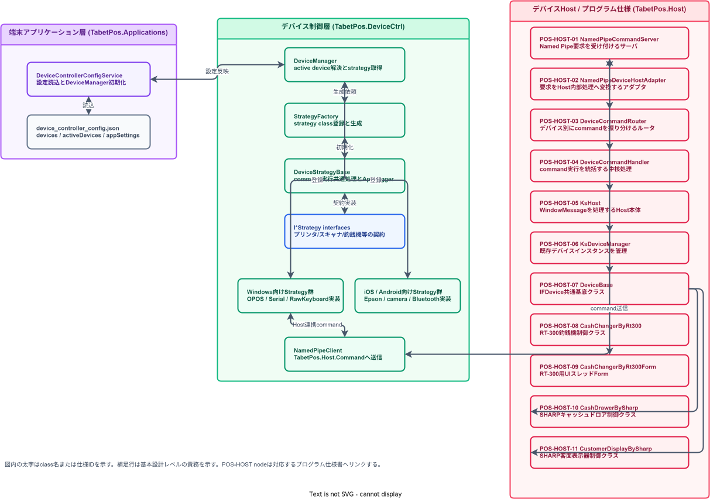

タブレットPOS
ARCH-03 デバイス制御層構造設計書
第1.0.0版
2026年6月19日

## 改訂履歴

| 改訂日 | 版数 | 内容 | 改訂者 | 承認者 |
| :----- | :--- | :--- | :----- | :----- |
| 2026/06/19 | 1.0.0 | タブレットPOS ソフトウェア全体構造設計書の構成に合わせ、DeviceManager / DeviceCtrl / Strategy / Factory / Device Interface の構成と責務を定義 | VTI | - |

## 目次

- [1. イントロダクション](#1-イントロダクション)
  - [1.1 本書の位置づけ](#11-本書の位置づけ)
  - [1.2 前提事項](#12-前提事項)
  - [1.3 対象読者](#13-対象読者)
  - [1.4 関連ドキュメント](#14-関連ドキュメント)
- [2. 基本アーキテクチャ](#2-基本アーキテクチャ)
  - [2.1 デバイス制御層の責務](#21-デバイス制御層の責務)
  - [2.2 レイヤ構成](#22-レイヤ構成)
  - [2.3 制御方針](#23-制御方針)
  - [2.4 対象デバイス](#24-対象デバイス)
- [3. DeviceManager](#3-devicemanager)
  - [3.1 役割](#31-役割)
  - [3.2 初期化方式](#32-初期化方式)
  - [3.3 active device 解決](#33-active-device-解決)
  - [3.4 strategy 取得 API](#34-strategy-取得-api)
- [4. Strategy / Factory](#4-strategy--factory)
  - [4.1 Strategy interface](#41-strategy-interface)
  - [4.2 DeviceStrategyBase](#42-devicestrategybase)
  - [4.3 StrategyFactory](#43-strategyfactory)
  - [4.4 OS 別 strategy](#44-os-別-strategy)
- [5. Device Interface / 通信境界](#5-device-interface--通信境界)
  - [5.1 DeviceSpec / DeviceConfig](#51-devicespec--deviceconfig)
  - [5.2 Named Pipe 境界](#52-named-pipe-境界)
  - [5.3 Host-backed device](#53-host-backed-device)
  - [5.4 Platform-local device](#54-platform-local-device)
- [6. 設定・エラー・ログ](#6-設定エラーログ)
  - [6.1 device_controller_config.json](#61-device_controller_configjson)
  - [6.2 appSettings.namedPipe](#62-appsettingsnamedpipe)
  - [6.3 エラー処理](#63-エラー処理)
  - [6.4 ログ方針](#64-ログ方針)
- [7. 実装規約](#7-実装規約)
  - [7.1 新規 device type 追加](#71-新規-device-type-追加)
  - [7.2 新規 strategy 追加](#72-新規-strategy-追加)
  - [7.3 テスト・検証観点](#73-テスト検証観点)
- [8. 関連資料](#8-関連資料)

## 1. イントロダクション

### 1.1 本書の位置づけ

本書は、タブレットPOS デバイス制御層の内部構造を定義する構造設計書である。

対象は `TabetPos.DeviceCtrl` を中心とし、DeviceManager、Strategy、Factory、Device Interface、設定モデル、Windows Named Pipe 連携を扱う。

本書は Host プロセス内部の個別 OPOS / OCX 実装仕様ではない。Host 側の詳細はデバイスホスト プログラム仕様書で定義する。

### 1.2 前提事項

デバイス制御層は端末アプリケーションから呼び出される class library である。

OS、device type、active device、strategy class は設定により決定する。

Windows の一部デバイスは Named Pipe 経由で Host-backed device として制御する。

iOS / Android の camera、Bluetooth、Epson SDK などは platform-local strategy として DeviceCtrl 内に配置する。

### 1.3 対象読者

| 読者 | 用途 |
|---|---|
| デバイス制御開発者 | DeviceManager、strategy、factory、設定モデルの責務を確認する |
| アプリケーション開発者 | ViewModel / service から呼び出す device interface を確認する |
| Host 開発者 | Windows strategy と Host command 境界を確認する |
| テスト担当者 | 設定切替、OS 別 strategy、通信失敗時の検証観点を確認する |

### 1.4 関連ドキュメント

| ファイル名 |
|---|
| ARCH-01_タブレットPOS_ソフトウェア構造設計書.docx |
| ARCH-02_タブレットPOS_端末アプリケーション構造設計書.docx |
| プログラム仕様書_POS-HOST-01_タブレットPOS_HOST_NamedPipeCommandServer.xlsx |
| プログラム仕様書_POS-HOST-02_タブレットPOS_HOST_NamedPipeDeviceHostAdapter.xlsx |
| プログラム仕様書_POS-HOST-03_タブレットPOS_HOST_DeviceCommandRouter.xlsx |
| プログラム仕様書_POS-HOST-04_タブレットPOS_HOST_DeviceCommandCore.xlsx |
| プログラム仕様書_POS-HOST-05_タブレットPOS_HOST_KsHost.xlsx |
| プログラム仕様書_POS-HOST-06_タブレットPOS_HOST_KsDeviceManager.xlsx |
| プログラム仕様書_POS-HOST-07_タブレットPOS_HOST_DeviceBase.xlsx |
| プログラム仕様書_POS-HOST-08_タブレットPOS_HOST_CashChangerByRT300.xlsx |
| プログラム仕様書_POS-HOST-09_タブレットPOS_HOST_CashChangerByRT300Form.xlsx |
| プログラム仕様書_POS-HOST-10_タブレットPOS_HOST_CashDrawerBySharp.xlsx |
| プログラム仕様書_POS-HOST-11_タブレットPOS_HOST_CustomerDisplayBySharp.xlsx |

## 2. 基本アーキテクチャ

### 2.1 デバイス制御層の責務

デバイス制御層は、端末アプリケーションからの device operation を、OS / vendor / connection type に応じた strategy 実装へ委譲する。

端末アプリケーションに OPOS、OCX、Serial、Bluetooth、camera、Named Pipe の詳細を露出させないことを基本方針とする。

図 2-1 にデバイス制御層の主要 class と Host 連携境界を示す。

図内の太字は class 名または仕様IDを示し、下段は基本設計レベルの責務を示す。`TabetPos.DeviceCtrl` 内の class は端末アプリケーションへ strategy interface を公開し、Windows の Host-backed device は `NamedPipeClient` から `TabetPos.Host` の POS-HOST class 群へ command を送信する。

| 設計要素 | 対象 class / file | 基本設計上の役割 |
|---|---|---|
| 設定読込 | `DeviceControllerConfigService`, `device_controller_config.json` | device 一覧、active device、Named Pipe 設定を読み込み、DeviceCtrl 初期化へ渡す |
| 制御中核 | `DeviceManager` | active device 解決、strategy factory 保持、strategy instance の取得口を提供する |
| 生成管理 | `StrategyFactory<TBase>` | `strategyclass` 名に対応する strategy class を登録し、設定に基づいて生成する |
| 共通処理 | `DeviceStrategyBase` | command 開始 / 終了、ログ出力、DeviceSpec 保持など strategy 共通処理をまとめる |
| 公開契約 | `I*Strategy interfaces` | プリンタ、スキャナ、釣銭機、客面表示器、ドロア、キーボード操作を抽象化する |
| Host連携 | `NamedPipeClient`, `POS-HOST-01..11` | Windows の Host-backed strategy から Named Pipe で Host 側 device class へ処理を渡す |

### 2.2 レイヤ構成

| 構成 | 主な class / folder | 責務 |
|---|---|---|
| DeviceManager | `DeviceManager` | 設定読込後の device 一覧、active device、strategy factory を管理 |
| Device Interface | `Interfaces/*Strategy` | アプリケーションが利用する device operation 契約 |
| Strategy | `Platforms/*/Strategies` | OS / vendor / protocol 別の device operation 実装 |
| Factory | `Factory/StrategyFactory` | strategy class 名から strategy instance を生成 |
| Model | `Models/Config`, `Models/Device` | JSON 設定、device spec、通信設定を保持 |
| Transport | `NamedPipeClient`, serial / platform SDK | Host または実デバイスとの通信境界 |

### 2.3 制御方針

DeviceManager は singleton として runtime 中の device 設定と strategy cache を保持する。

Strategy は interface 単位で公開し、呼び出し側は具象 class を参照しない。

Factory は strategy class 名を設定から受け取り、登録済み strategy の生成に限定する。

Host-backed device は Windows strategy が Named Pipe command を送信し、Host 側で OPOS / OCX を処理する。

### 2.4 対象デバイス

| device type | 主な interface | 主な実装例 |
|---|---|---|
| `local_printer` | `IPrinterStrategy` | `OposPrinterStrategy`, `IosEpsonPrinterStrategy`, `AndroidBluetoothPrinterStrategy` |
| `local_scanner` | `IBarcodeScannerStrategy` | `SerialHandyScannerStrategy`, `IosCameraBarcodeScannerStrategy`, `AndroidCameraBarcodeScannerStrategy` |
| `local_cashchanger` | `ICashChangerStrategy` | `OposCashChangerStrategy`, `SerialCashChangerStrategy` |
| `local_display` | `ICustomerDisplayStrategy` | `OposCustomerDisplayStrategy`, iOS / Android customer display strategy |
| `local_drawer` | `IDrawerStrategy` | `OposDrawerStrategy` |
| `local_keyboard` | `IKeyboardStrategy` | `OposKeyboardStrategy`, `WindowsRawKeyboardStrategy` |

## 3. DeviceManager

### 3.1 役割

`DeviceManager` は DeviceCtrl 層の entry point である。

設定に含まれる device 一覧、active device、app settings、strategy factory、strategy cache を保持し、Application 層へ device interface を返す。

### 3.2 初期化方式

`DeviceControllerConfigService` は runtime 設定ファイルまたは package default を読み込み、DI で注入された `DeviceManager.InitializeFromConfig(config)` を呼び出す。

`InitializeFromConfig` は device 一覧を保持し、OS 別 strategy を登録し、Windows の `NamedPipeSettings` が存在する場合は `NamedPipeClient.Configure` を実行する。

`EnsureInitializedAsync` は未初期化時に package default の `device_controller_config.json` を読み込み、二重初期化を `_initLock` で制御する。

### 3.3 active device 解決

`ActiveDevices` は device type ごとに OS と id を保持する。

DeviceManager は現在 OS を `windows` / `ios` / `android` として判定し、device type と OS に一致する active entry を選択する。

選択された id に一致する `DeviceSpec` を device 一覧から取得し、その `strategyclass` を factory へ渡す。

### 3.4 strategy 取得 API

`GetPrinterStrategyAsync`、`GetScannerStrategyAsync`、`GetCashChangerStrategyAsync`、`GetCustomerDisplayStrategyAsync`、`GetDrawerStrategyAsync`、`GetKeyboardStrategyAsync` を公開する。

各 API は初期化保証、active device 解決、strategy 生成を行い、呼び出し側には interface 型を返す。

## 4. Strategy / Factory

### 4.1 Strategy interface

Strategy interface は Application 層が利用する device operation の契約である。

`IPrinterStrategy` は Start / End / PrintReceipt / OpenDrawer を定義する。

`ICashChangerStrategy` は取引開始、入金、入金額取得、釣銭払い出し、精査などの釣銭機操作を定義する。

その他の scanner、drawer、customer display、keyboard も device type ごとに interface を分ける。

### 4.2 DeviceStrategyBase

`DeviceStrategyBase` は strategy 共通の DeviceSpec、CurrentMethod、CommandStart、Start / End、command 実行 wrapper を提供する。

command 実行 wrapper は background task で処理し、開始、成功、失敗を `AppLogger` に出力する。

CRTP 型の `DeviceStrategyBase<T>` は strategy instance を device spec と紐づけて再利用する。

### 4.3 StrategyFactory

`StrategyFactory<TBase>` は strategy class 名と creator を dictionary で管理する。

`Register<T>(name)` は strategy 型を登録し、public static `InitInstance(DeviceSpec)` がある場合はそれを優先して instance を生成する。

未登録の strategy class 名が指定された場合は例外とし、設定ミスを早期に検出する。

### 4.4 OS 別 strategy

Windows では OPOS / Serial / Raw keyboard などの strategy を登録する。

iOS では Epson printer、camera scanner、BLE scanner、customer display の strategy を登録する。

Android では Bluetooth printer、camera scanner、Epson DM-D70 customer display の strategy を登録する。

## 5. Device Interface / 通信境界

### 5.1 DeviceSpec / DeviceConfig

`DeviceSpec` は id、name、type、vendor、series、lang、os、strategyclass、config を保持する。

`DeviceConfig` は connection type、IP、port、COM port、MAC address、Bluetooth address、baud rate、parity、data bits、stop bits、handshake を保持する。

DeviceSpec は device identity、DeviceConfig は接続パラメータという役割で分離する。

### 5.2 Named Pipe 境界

`NamedPipeClient` は Windows Host-backed device との IPC transport である。

既定 pipe 名は `TabetPos.Host.Command`、既定 timeout は 5000ms である。

旧既定値 `KsPOSPipeMessage` が設定されている場合、`NamedPipeClient.Configure` は `TabetPos.Host.Command` へ移行する。

`NamedPipeSettings` により pipe 名と timeout を設定から上書きできる。

`SendMessage` は同時送信を抑止し、1 command / 1 response の同期的な要求応答として扱う。

### 5.3 Host-backed device

Windows の customer display、drawer、cash changer などは strategy が legacy command 文字列を Named Pipe へ送信し、Host が OPOS / OCX を実行する。

DeviceCtrl は Host の内部 device lifecycle を直接制御せず、Host command の送信と response 受信を担当する。

### 5.4 Platform-local device

iOS / Android の camera、Bluetooth、Epson SDK など Host を経由しないデバイスは platform-local strategy として実装する。

Platform-local strategy でも Application 層へ公開する契約は device interface に統一する。

## 6. 設定・エラー・ログ

### 6.1 device_controller_config.json

`device_controller_config.json` は `devices`、`activeDevices`、`appSettings` を root に持つ。

`devices` は OS 別 device spec と strategy class を列挙する。

`activeDevices` は device type ごとに runtime で利用する id を OS 別に指定する。

### 6.2 appSettings.namedPipe

`appSettings.namedPipe.pipeName` は Host 連携 pipe 名を定義する。

`appSettings.namedPipe.connectionTimeoutMs` は Named Pipe 接続 timeout を定義する。

Windows Host-backed device を利用する場合は、端末アプリケーションと Host の pipe 名を一致させる必要がある。

### 6.3 エラー処理

設定に該当 device が存在しない場合、DeviceManager は null または例外により呼び出し側へ失敗を伝える。

Named Pipe 接続 timeout、通信例外、Host 未起動は response 文字列または例外として strategy から上位へ伝播する。

利用者向け表示、再試行、代替手段の提示は Application / Presentation 層で判断する。

### 6.4 ログ方針

DeviceCtrl は `AppLogger` を利用して初期化、strategy 登録、command 実行、通信失敗を記録する。

ログには device type、strategy class、command 名、例外情報を含める。

カード情報、個人情報、認証情報などの機微情報はログに出力しない。

## 7. 実装規約

### 7.1 新規 device type 追加

新規 device type を追加する場合は、interface、DeviceManager 取得 API、active device 解決、`device_controller_config.json` の activeDevices 定義を一組で追加する。

Application 層には新規 interface を公開し、具象 strategy class 名を露出させない。

### 7.2 新規 strategy 追加

新規 strategy は該当 OS の `Platforms/{OS}/Strategies` 配下に配置する。

strategy class 名は `device_controller_config.json` の `strategyclass` と一致させる。

DeviceManager の OS 別登録処理で `StrategyFactory.Register<T>` を追加する。

### 7.3 テスト・検証観点

設定読込、OS 判定、active device 選択、strategy factory 登録漏れを確認する。

Host-backed device は Host 起動済み、Host 未起動、pipe 名不一致、timeout、異常 response を確認する。

Platform-local device は実機接続、権限、SDK 初期化、切断・再接続を確認する。

## 8. 関連資料

- `sources/POS 開発用ベースプロジェクト/TabetPos.DeviceCtrl/DeviceManager.cs`
- `sources/POS 開発用ベースプロジェクト/TabetPos.DeviceCtrl/Factory/StrategyFactory.cs`
- `sources/POS 開発用ベースプロジェクト/TabetPos.DeviceCtrl/StrategyBase/DeviceStrategyBase.cs`
- `sources/POS 開発用ベースプロジェクト/TabetPos.DeviceCtrl/Interfaces/`
- `sources/POS 開発用ベースプロジェクト/TabetPos.DeviceCtrl/Models/Config/DeviceConfig.cs`
- `sources/POS 開発用ベースプロジェクト/TabetPos.DeviceCtrl/Models/Device/DeviceSpec.cs`
- `sources/POS 開発用ベースプロジェクト/TabetPos.DeviceCtrl/Platforms/Windows/Modules/NamedPipeClient.cs`
- `sources/POS 開発用ベースプロジェクト/TabetPos.Applications/Resources/Raw/device_controller_config.json`
