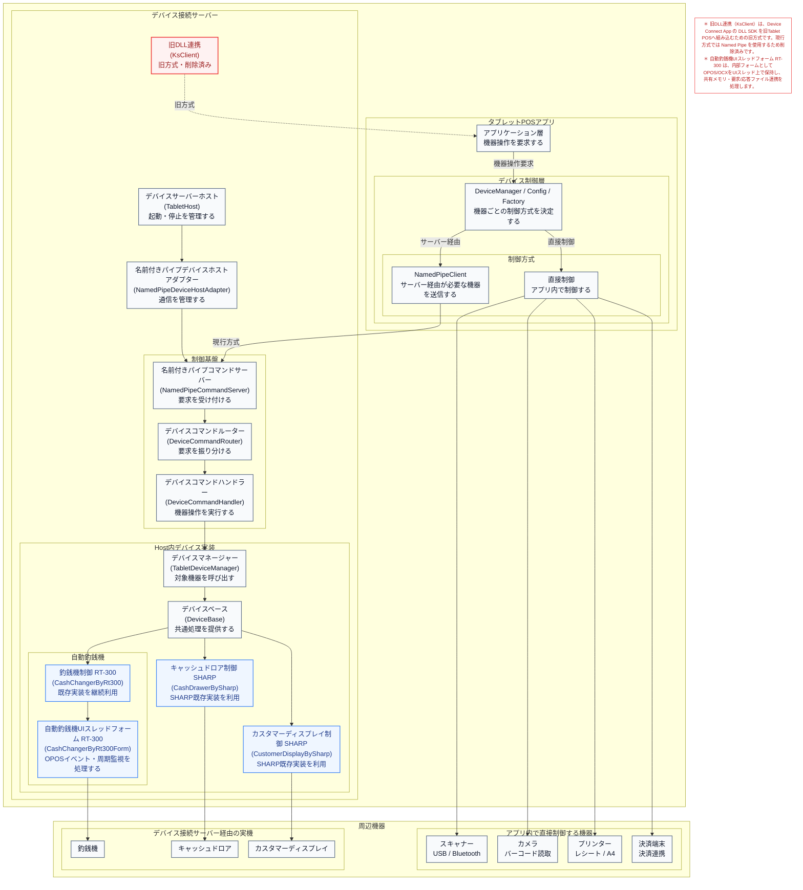

# タブレットPOS デバイス接続サーバー制御方式構造図 Mermaid 原文

```mermaid
%%{init: {
  "flowchart": {
    "nodeSpacing": 25,
    "rankSpacing": 35,
    "padding": 8,
    "curve": "basis"
  }
}}%%

flowchart TB
    classDef removed fill:#FEF2F2,stroke:#EF4444,color:#991B1B,stroke-width:2px;
    classDef direct fill:#F0FDF4,stroke:#22C55E,color:#14532D,stroke-width:1.5px;
    classDef server fill:#EFF6FF,stroke:#3B82F6,color:#1E3A8A,stroke-width:1.5px;
    classDef core fill:#F8FAFC,stroke:#64748B,color:#0F172A,stroke-width:1.5px;
    classDef memo fill:#FFFFFF,stroke:#EF4444,color:#B91C1C,stroke-width:1px,font-size:11px;

    subgraph upper[" "]
        direction LR

        subgraph tablet_pos["タブレットPOSアプリ"]
            direction TB

            app_layer["アプリケーション層\n機器操作を要求する"]

            subgraph device_ctrl["デバイス制御層"]
                direction TB
                device_setup["DeviceManager / Config / Factory\n機器ごとの制御方式を決定する"]

                subgraph control_route["制御方式"]
                    direction LR
                    direct_control["直接制御\nアプリ内で制御する"]
                    namedpipe_client["NamedPipeClient\nサーバー経由が必要な機器を送信する"]
                end
            end

            app_layer -->|"機器操作要求"| device_setup
            device_setup -->|"直接制御"| direct_control
            device_setup -->|"サーバー経由"| namedpipe_client
        end

        subgraph appserver["デバイス接続サーバー"]
            direction TB

            old_dll_removed["旧DLL連携\n(KsClient)\n旧方式・削除済み"]

            host_main["デバイスサーバーホスト\n(TabletHost)\n起動・停止を管理する"]
            host_adapter["名前付きパイプデバイスホストアダプター\n(NamedPipeDeviceHostAdapter)\n通信を管理する"]

            subgraph appserver_core["制御基盤"]
                direction LR
                command_server["名前付きパイプコマンドサーバー\n(NamedPipeCommandServer)\n要求を受け付ける"]
                command_router["デバイスコマンドルーター\n(DeviceCommandRouter)\n要求を振り分ける"]
                command_handler["デバイスコマンドハンドラー\n(DeviceCommandHandler)\n機器操作を実行する"]
            end

            subgraph appserver_runtime["Host内デバイス実装"]
                direction TB
                device_manager["デバイスマネージャー\n(TabletDeviceManager)\n対象機器を呼び出す"]
                device_base["デバイスベース\n(DeviceBase)\n共通処理を提供する"]

                subgraph cash_changer_group["自動釣銭機"]
                    direction TB
                    cash_changer["釣銭機制御 RT-300\n(CashChangerByRt300)\n既存実装を継続利用"]
                    cash_changer_form["自動釣銭機UIスレッドフォーム RT-300\n(CashChangerByRt300Form)\nOPOSイベント・周期監視を処理する"]
                end

                cash_drawer["キャッシュドロア制御 SHARP\n(CashDrawerBySharp)\nSHARP既存実装を利用"]
                customer_display["カスタマーディスプレイ制御 SHARP\n(CustomerDisplayBySharp)\nSHARP既存実装を利用"]
            end

            host_main --> host_adapter
            host_adapter --> command_server
            command_server --> command_router
            command_router --> command_handler
            command_handler --> device_manager
            device_manager --> device_base
            device_base --> cash_changer
            cash_changer --> cash_changer_form
            device_base --> cash_drawer
            device_base --> customer_display
        end
    end

    subgraph devices["周辺機器"]
        direction LR

        subgraph direct_devices["アプリ内で直接制御する機器"]
            direction TB
            scanner["スキャナー\nUSB / Bluetooth"]
            camera["カメラ\nバーコード読取"]
            printer["プリンター\nレシート / A4"]
            payment_terminal["決済端末\n決済連携"]
        end

        subgraph server_devices["デバイス接続サーバー経由の実機"]
            direction TB
            cash_changer_device["釣銭機"]
            cash_drawer_device["キャッシュドロア"]
            customer_display_device["カスタマーディスプレイ"]
        end
    end

    old_dll_removed -.->|"旧方式"| app_layer
    namedpipe_client -->|"現行方式"| command_server

    direct_control --> scanner
    direct_control --> camera
    direct_control --> printer
    direct_control --> payment_terminal

    cash_changer_form --> cash_changer_device
    cash_drawer --> cash_drawer_device
    customer_display --> customer_display_device

    memo["＊ 旧DLL連携（KsClient）は、Device Connect App の DLL SDK を旧Tablet POSへ組み込むための旧方式です。現行方式では Named Pipe を使用するため削除済みです。\n＊ 自動釣銭機UIスレッドフォーム RT-300 は、内部フォームとしてOPOS/OCXをUIスレッド上で保持し、共有メモリ・要求/応答ファイル連携を処理します。"]

    class app_layer,device_setup,namedpipe_client,direct_control,host_main,host_adapter,command_server,command_router,command_handler,device_manager,device_base core;
    class old_dll_removed removed;
    class scanner,camera,printer,payment_terminal,cash_changer_device,cash_drawer_device,customer_display_device core;
    class cash_changer,cash_changer_form,cash_drawer,customer_display server;
    class memo memo;
```
