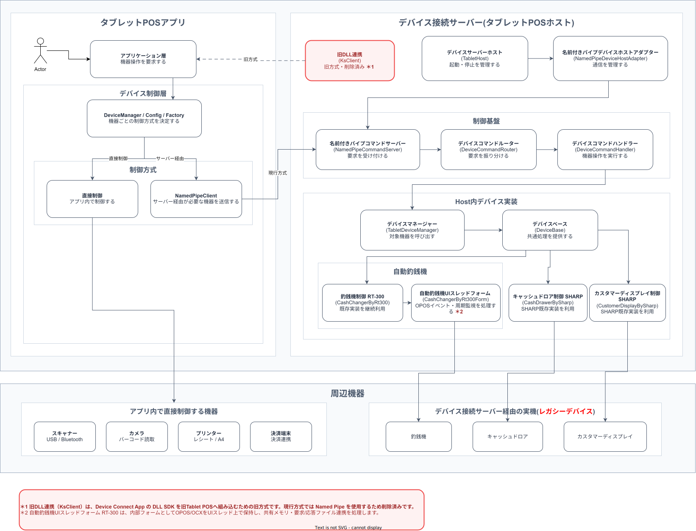

タブレットPOS
ARCH-03 デバイス接続サーバー構造設計書
文書ID: ARCH-03
第1.0.1版
2026年6月24日

## 改訂履歴

| 改訂日 | 版数 | 内容 | 改訂者 | 承認者 |
| :----- | :--- | :--- | :----- | :----- |
| 2026/06/24 | 1.0.1 | デバイス接続サーバーを中心とする構造に見直し、DeviceCtrl は呼び出し境界として整理 | VTI | - |
| 2026/06/19 | 1.0.0 | タブレットPOS ソフトウェア全体構造設計書の構成に合わせ、DeviceManager / DeviceCtrl / Strategy / Factory / Device Interface の構成と責務を定義 | VTI | - |

## 目次

- [1. イントロダクション](#1-イントロダクション)
  - [1.1 本書の位置づけ](#11-本書の位置づけ)
  - [1.2 目的](#12-目的)
  - [1.3 前提事項](#13-前提事項)
  - [1.4 対象読者](#14-対象読者)
  - [1.5 関連ドキュメント](#15-関連ドキュメント)
- [2. 基本アーキテクチャ](#2-基本アーキテクチャ)
  - [2.1 全体構造](#21-全体構造)
  - [2.2 レイヤ構成](#22-レイヤ構成)
  - [2.3 DeviceCtrl との境界](#23-devicectrl-との境界)
  - [2.4 デバイス接続サーバーの責務](#24-デバイス接続サーバーの責務)
- [3. 制御方式](#3-制御方式)
  - [3.1 Named Pipe 通信](#31-named-pipe-通信)
  - [3.2 コマンド処理フロー](#32-コマンド処理フロー)
  - [3.3 デバイス起動フロー](#33-デバイス起動フロー)
  - [3.4 応答通知](#34-応答通知)
- [4. Host 内部構成](#4-host-内部構成)
  - [4.1 制御基盤](#41-制御基盤)
  - [4.2 デバイス管理](#42-デバイス管理)
  - [4.3 対象デバイス実装](#43-対象デバイス実装)
- [5. 設定ファイル](#5-設定ファイル)
  - [5.1 host_device_config.json](#51-host_device_configjson)
  - [5.2 device_controller_config.json](#52-device_controller_configjson)
- [6. 初期対象デバイス](#6-初期対象デバイス)
- [7. テスト・確認観点](#7-テスト確認観点)
- [8. 関連資料](#8-関連資料)

## 1. イントロダクション

### 1.1 本書の位置づけ

本書は、タブレットPOS に追加するデバイス接続サーバーの構造を定義する構造設計書である。

対象は `TabetPos.Host` を中心とし、Host の起動、Named Pipe 通信、コマンド処理、Host 内デバイス管理、既存デバイス資源の呼び出し方式を扱う。

`TabetPos.DeviceCtrl` はタブレットPOSアプリ内のデバイス制御層であり、本書ではデバイス接続サーバーへ要求を渡す呼び出し境界として扱う。DeviceCtrl 内部の strategy / factory / interface の詳細は、本書の主対象ではない。

### 1.2 目的

デバイス接続サーバーを適用する目的は、過去のトラブル等の課題が対策済みである現行資源の有効利用の観点で、初期対象デバイスを安全に継続利用することである。

初期段階では、既存 OPOS / OCX / legacy DLL との結合が強いデバイスを Host 側に配置し、タブレットPOSアプリからは Named Pipe 経由で操作要求だけを送信する。

これにより、タブレットPOSアプリ側へ OPOS、OCX、UI スレッド制約、共有メモリ、要求/応答ファイル連携などの詳細を直接持ち込まない構成にする。

### 1.3 前提事項

デバイス接続サーバーは Windows 端末上で動作する Host プロセスである。

タブレットPOSアプリは DeviceCtrl 内の `NamedPipeClient` から `TabetPos.Host.Command` へ要求を送信する。

Host は `host_device_config.json` に定義された対象デバイスを起動し、DeviceId と MethodId に基づいて対象デバイス実装を呼び出す。

スキャナー、カメラ、プリンター、決済端末など、アプリ内で直接制御する機器はデバイス接続サーバーの初期対象外とする。

### 1.4 対象読者

| 読者 | 用途 |
|---|---|
| Host 開発者 | デバイス接続サーバーの起動、通信、command 処理、デバイス管理の責務を確認する |
| DeviceCtrl 開発者 | アプリ側から Host へ渡す Named Pipe 境界を確認する |
| デバイス担当者 | 初期対象デバイスと既存資源の利用範囲を確認する |
| テスト担当者 | Host 起動、通信、対象デバイス呼び出し、停止時の確認観点を確認する |

### 1.5 関連ドキュメント

| ファイル名 |
|---|
| ARCH-01_タブレットPOS_ソフトウェア構造設計書.docx |
| ARCH-02_タブレットPOS_端末アプリケーション構造設計書.docx |
| CFG-01_タブレットPOS_デバイス制御層設定ファイル記載要領.docx |
| PS-HOST-01_タブレットPOS_ホスト_名前付きパイプコマンドサーバー_プログラム仕様書.xlsx |
| PS-HOST-02_タブレットPOS_ホスト_名前付きパイプデバイスホストアダプター_プログラム仕様書.xlsx |
| PS-HOST-03_タブレットPOS_ホスト_デバイスコマンドルーター_プログラム仕様書.xlsx |
| PS-HOST-04_タブレットPOS_ホスト_デバイスコマンドハンドラー_プログラム仕様書.xlsx |
| PS-HOST-05_タブレットPOS_ホスト_デバイスサーバーホスト_プログラム仕様書.xlsx |
| PS-HOST-06_タブレットPOS_ホスト_デバイスマネージャー_プログラム仕様書.xlsx |
| PS-HOST-07_タブレットPOS_ホスト_デバイスベース_プログラム仕様書.xlsx |
| PS-HOST-08_タブレットPOS_ホスト_釣銭機制御_RT-300_プログラム仕様書.xlsx |
| PS-HOST-09_タブレットPOS_ホスト_自動釣銭機UIスレッドフォーム_RT-300_プログラム仕様書.xlsx |
| PS-HOST-10_タブレットPOS_ホスト_キャッシュドロア制御_SHARP_プログラム仕様書.xlsx |
| PS-HOST-11_タブレットPOS_ホスト_カスタマーディスプレイ制御_SHARP_プログラム仕様書.xlsx |

## 2. 基本アーキテクチャ

### 2.1 全体構造

図 2-1 に、タブレットPOSアプリ、DeviceCtrl、デバイス接続サーバー、周辺機器の関係を示す。

図 2-1 デバイス接続サーバー制御方式構造図

図内の Host 側ブロック名は、対応するプログラム仕様書の機能名を示す。括弧内は実装 class 名を示す。

### 2.2 レイヤ構成

| 構成 | 主な class / file | 責務 |
|---|---|---|
| タブレットPOSアプリ | アプリケーション層 | 画面または業務処理から機器操作を要求する |
| デバイス制御層 | `DeviceManager`, `NamedPipeClient`, `device_controller_config.json` | 機器ごとの制御方式を決定し、Host 経由の対象だけを Named Pipe へ送信する |
| デバイス接続サーバー | `TabletHost`, `NamedPipeDeviceHostAdapter` | Host の起動、停止、Named Pipe 通信、デバイス管理を行う |
| Host 制御基盤 | `NamedPipeCommandServer`, `DeviceCommandRouter`, `DeviceCommandHandler` | 要求受付、デバイス単位の順序制御、対象デバイス呼び出しを行う |
| Host 内デバイス実装 | `TabletDeviceManager`, `DeviceBase`, 各デバイス class | 既存 OPOS / OCX / legacy DLL を利用して実機を制御する |
| 実機 | 釣銭機、キャッシュドロア、カスタマーディスプレイ | Host 内デバイス実装から操作される対象機器 |

### 2.3 DeviceCtrl との境界

DeviceCtrl はタブレットPOSアプリ内の layer であり、デバイス接続サーバーとは別プロセスの Host へ要求を渡す。

DeviceCtrl は `device_controller_config.json` の設定に従い、アプリ内で直接制御する機器と、Host 経由で制御する機器を分ける。

Host 経由の場合、`NamedPipeClient` は `TabetPos.Host.Command` へ JSON 形式の要求を送信し、Host から同期応答を受け取る。

旧方式の `KsClient` による DLL 連携は、旧 Tablet POS へ Device Connect App の DLL SDK を組み込むための方式である。現行方式では Named Pipe を使用するため、この経路は使用しない。

### 2.4 デバイス接続サーバーの責務

デバイス接続サーバーは、アプリケーションから分離した Host プロセスとして、既存デバイス資源の起動、保持、呼び出し、終了を担当する。

Host 側では `TabletHost` が `TabletDeviceManager` を起動し、`host_device_config.json` から対象デバイスを読み込む。

各デバイス class は `IFDevice` として管理され、`DeviceUse`、`DeviceUnUse`、`DeviceMethod` の要求に応じて実機操作を行う。

## 3. 制御方式

### 3.1 Named Pipe 通信

Host は `NamedPipeDeviceHostAdapter` を通じて、Command Pipe と Event Pipe を起動する。

| Pipe | 既定名 | 用途 |
|---|---|---|
| Command Pipe | `TabetPos.Host.Command` | DeviceCtrl などの client から Host へ操作要求を送信する |
| Event Pipe | `TabetPos.Host.Event` | Host から device reply などの非同期通知を送信する |

DeviceCtrl 側では legacy pipe 名 `TabletPOSPipeMessage` が設定された場合でも、現行 pipe 名 `TabetPos.Host.Command` に補正する。

### 3.2 コマンド処理フロー

| 順序 | 処理 | 主な class |
|---|---|---|
| 1 | DeviceCtrl が Host へ要求を送信する | `NamedPipeClient` |
| 2 | Host が Command Pipe で要求を受け付ける | `NamedPipeCommandServer` |
| 3 | 要求を内部 command / response 形式へ変換する | `NamedPipeCommandMapper` |
| 4 | DeviceId 単位の worker に要求を投入する | `DeviceCommandRouter` |
| 5 | Host 制御要求またはデバイス操作要求として判定する | `DeviceCommandHandler` |
| 6 | 対象デバイスを検索して操作を実行する | `TabletDeviceManager`, `IFDevice` |
| 7 | 実行結果を Command Pipe の同期応答として返す | `NamedPipeCommandServer` |

主な message は `DeviceUse`、`DeviceUnUse`、`DeviceUnUseComplete`、`DeviceMethod`、`Kill`、`ReStart` とする。

### 3.3 デバイス起動フロー

`TabletHost.StartHost()` は Host 起動時に `DeviceHostTransport` と command handler を初期化し、`TabletDeviceManager.StartDeviceManager()` を呼び出す。

`TabletDeviceManager` は `IFSettingDevice.GetDeviceSettingList()` から起動対象を取得し、各 device class を生成して `StartDevice()` を実行する。

起動した device instance は Host 内の `_deviceList` に保持され、以後の command は DeviceId に基づいて該当 instance へ渡される。

### 3.4 応答通知

同期応答は Command Pipe の同一接続へ JSON で返却する。

デバイス側からの非同期応答は、`TabletHost.ReplyDevice()` から `NamedPipeDeviceHostAdapter.PublishDeviceReply()` を経由し、Event Pipe へ送信する。

## 4. Host 内部構成

### 4.1 制御基盤

| プログラム仕様 | Class | 役割 |
|---|---|---|
| 名前付きパイプコマンドサーバー | `NamedPipeCommandServer` | Named Pipe の待受、要求読込、応答返却を行う |
| 名前付きパイプデバイスホストアダプター | `NamedPipeDeviceHostAdapter` | Command Pipe / Event Pipe と Host 内 command 処理を接続する |
| デバイスコマンドルーター | `DeviceCommandRouter` | DeviceId 単位で要求を順序制御する |
| デバイスコマンドハンドラー | `DeviceCommandHandler` | message を判定し、Host 制御または IFDevice 呼び出しへ振り分ける |
| デバイスサーバーホスト | `TabletHost` | Host 起動、停止、DeviceManager 起動、reply publish を管理する |

### 4.2 デバイス管理

| プログラム仕様 | Class | 役割 |
|---|---|---|
| デバイスマネージャー | `TabletDeviceManager` | 設定から対象デバイスを起動し、DeviceId に対応する instance を管理する |
| デバイスベース | `DeviceBase` | OPOS / OCX device の open、claim、release、close、周期監視の共通処理を提供する |

### 4.3 対象デバイス実装

| プログラム仕様 | Class | 役割 |
|---|---|---|
| 釣銭機制御 RT-300 | `CashChangerByRt300` | RT-300 釣銭機の操作要求を受け付け、内部フォームへ処理を渡す |
| 自動釣銭機UIスレッドフォーム RT-300 | `CashChangerByRt300Form` | OPOS/OCX を UI スレッド上で保持し、イベント、周期監視、共有メモリ、要求/応答ファイル連携を処理する |
| キャッシュドロア制御 SHARP | `CashDrawerBySharp` | SHARP キャッシュドロアの open / close 系操作を実行する |
| カスタマーディスプレイ制御 SHARP | `CustomerDisplayBySharp` | SHARP カスタマーディスプレイの表示、消去、スクロール操作を実行する |

## 5. 設定ファイル

### 5.1 host_device_config.json

`host_device_config.json` は Host が起動するデバイス実装を定義する。

実行時は `AppContext.BaseDirectory\Resources\host_device_config.json` を読み込む。

| 項目 | 内容 |
|---|---|
| `id` | `TabletDeviceId` に登録されたデバイスID |
| `name` | 実行時に使用するデバイス名 |
| `classId` | legacy class factory が生成するデバイス class ID |
| `visible` | デバイス用フォームを表示するかどうか |
| `parameters` | デバイスごとの追加パラメータ |

初期設定では `CustomerDisplay`、`CashDrawer`、`CashChanger` を定義する。

### 5.2 device_controller_config.json

`device_controller_config.json` はタブレットPOSアプリ側の DeviceCtrl 設定である。

Host 経由のデバイスでは `appSettings.namedPipe.pipeName` に `TabetPos.Host.Command` を指定し、DeviceCtrl からデバイス接続サーバーへ要求を送信する。

この設定は Host 内のデバイス生成設定ではない。Host 内の対象デバイスは `host_device_config.json` で管理する。

## 6. 初期対象デバイス

| 対象デバイス | Host 内 class | 適用理由 |
|---|---|---|
| 釣銭機 RT-300 | `CashChangerByRt300`, `CashChangerByRt300Form` | OPOS/OCX、UI スレッド、共有メモリ、要求/応答ファイル連携を既存資源として継続利用するため |
| キャッシュドロア SHARP | `CashDrawerBySharp` | SHARP 既存実装を Host 側に保持し、アプリ側から分離して利用するため |
| カスタマーディスプレイ SHARP | `CustomerDisplayBySharp` | SHARP 既存実装を Host 側に保持し、表示制御を継続利用するため |

上記以外の機器は、初期段階では DeviceCtrl 内または各 platform の strategy で直接制御する。

## 7. テスト・確認観点

| 観点 | 確認内容 |
|---|---|
| Host 起動 | `TabletHost.StartHost()` により Command Pipe / Event Pipe と対象デバイスが起動すること |
| 設定読込 | `host_device_config.json` の対象デバイスが `TabletDeviceManager` に登録されること |
| 通信 | `NamedPipeClient` から `TabetPos.Host.Command` へ要求を送信し、応答を受け取れること |
| 順序制御 | 同一 DeviceId の要求が `DeviceCommandRouter` で順序制御されること |
| デバイス操作 | `DeviceUse`、`DeviceUnUse`、`DeviceMethod` が対象 `IFDevice` に渡ること |
| 停止 | `StopHost` または `Kill` により pipe と起動済みデバイスが終了すること |

## 8. 関連資料

- `sources/tabletposboilerplate/TabetPos.Host/README.md`
- `sources/tabletposboilerplate/TabetPos.Host/src/TabletHost/DeviceHost/TabletHost.cs`
- `sources/tabletposboilerplate/TabetPos.Host/src/TabletHost/DeviceHost/NamedPipeDeviceHostAdapter.cs`
- `sources/tabletposboilerplate/TabetPos.Host/src/TabletHost/DeviceHost/NamedPipeCommandServer.cs`
- `sources/tabletposboilerplate/TabetPos.Host/src/TabletHost/DeviceHost/DeviceCommandRouter.cs`
- `sources/tabletposboilerplate/TabetPos.Host/src/TabletHost/DeviceHost/DeviceCommandCore.cs`
- `sources/tabletposboilerplate/TabetPos.Host/src/TabletDeviceManager/TabletDeviceManager.cs`
- `sources/tabletposboilerplate/TabetPos.Host/src/TabletDevice/DeviceBase/DeviceBase.cs`
- `sources/tabletposboilerplate/TabetPos.Host/src/AppServer/Resources/host_device_config.json`
- `sources/tabletposboilerplate/TabetPos.Applications/Resources/Raw/device_controller_config.json`
