# ARCH-DEVICE-01 次世代POS デバイス制御クラス構成図

次世代POS
ARCH-DEVICE-01 デバイス制御クラス構成図
文書ID: ARCH-DEVICE-01
第0.4.13版
2026年7月29日

## 00_表紙

文書情報を以下に示す。

| 項目 | 内容 |
|---|---|
| 文書ID | ARCH-DEVICE-01 |
| 文書名 | 次世代POS デバイス制御クラス構成図 |
| 対象 | タブレットPOS端末アプリのアプリケーション層とデバイス制御層の関係 |
| 版数 | 0.4.13 |
| 作成日 | 2026/07/24 |
| 作成者 | VTI サム, VTI 吉田 |
| レビュー担当 | SMJ 蒲田 |
| 承認者 | SMJ 蒲田 |
| 目的 | 業務処理の呼出元、設定管理、ストラテジーパターン、公開デバイス契約、およびプラットフォーム別処理の責務と関係を明確にする。 |
| 期待成果 | 開発者が利用すべきクラスとインターフェースを判断でき、業務処理をベンダー、OS、およびデバイス接続方式から独立させられること。 |

## 01_改訂履歴

文書の改訂履歴を以下に示す。

| 版数 | 日付 | 変更内容 | 作成者 | 承認者 |
|---|---|---|---|---|
| 0.4.13 | 2026/07/29 | 外部境界のiOS周辺機器とAndroid周辺機器を共通の「iOS／Android周辺機器」へ統合。プラットフォーム別ストラテジーは個別に保持し、各ストラテジーが必要な公開操作を提供する場合に同じ周辺機器境界へ直接接続する関係を明確化。 | VTI サム | |
| 0.4.12 | 2026/07/29 | クラス構成図の関係を主処理、コマンド通信、ライフサイクル、実機制御、非同期イベント、および設定参照に分類。要求と同期応答、実機制御と結果を双方向で示し、非同期イベントを独立した一方向の関係として明確化。表と構成要素の間隔を縮小し、責務領域を連続して確認できる配置へ調整。 | VTI サム | |
| 0.4.11 | 2026/07/29 | デバイス制御層を構成する「共通制御・設定管理」と「ストラテジーパターン」をExcel上で個別の表として生成できるように、Markdownへ親グループと表の描画区分を追加。 | VTI サム | |
| 0.4.10 | 2026/07/29 | 論理名と物理識別子の表記を整理し、概要と構成説明では論理名を使用する形に統一。ストラテジー生成と公開デバイス契約を分離し、公開デバイス契約を構成するインターフェースとの実装対応を明確化。 | VTI サム | |
| 0.4.9 | 2026/07/29 | プラットフォーム別ストラテジーがデバイス制御層に含まれる構成を明確にし、公開デバイス契約、ストラテジー生成、およびプラットフォーム別実装の関係をストラテジーパターンとして図と構成説明へ反映。 | VTI サム | |
| 0.4.8 | 2026/07/24 | クラス構成説明を全体構成図と同じ順序で確認できるように、構成階層の一覧と責務領域・構成要素の段階的な説明を追加。クラス関係、接続方式、ライフサイクル、および利用順序の表は詳細契約として後段へ整理。 | VTI サム | |
| 0.4.7 | 2026/07/24 | ARCH-HOST-01の凡例に合わせて、プラットフォーム別ストラテジーまたはデバイスコネクタから周辺機器への実機制御を紫色で表示するように統一。 | VTI サム | |
| 0.4.6 | 2026/07/23 | ARCH-HOST-01の凡例に合わせて、タブレットPOS端末アプリ領域、論理構成要素、デバイスコネクタ、周辺機器、補足コメント、およびコネクターの表示色を統一。MermaidとOffice Scriptの色指定を同じ凡例から生成する構成へ更新。 | VTI サム | |
| 0.4.5 | 2026/07/23 | ARCH-HOST-01に合わせて、デバイスコネクタ、デバイス制御層、ドロア、カスタマディスプレイ、コマンド通信用パイプ、およびイベント通知用パイプの名称を統一。全シートの論理名と物理識別子の表記を整理。 | VTI サム | |
| 0.4.4 | 2026/07/23 | 本書が扱うシステム構造、設定、および実装対応の設計領域を明確化。クラス構成図を論理責務と物理識別子の対応が分かる表記へ改め、接続経路の重複説明を整理。 | VTI サム | |
| 0.4.3 | 2026/07/23 | クラス構成、設定・初期化、およびプラットフォーム対応の責務に沿ってシート構成を整理し、重複していた利用手順と接続説明を統合。 | VTI サム | |
| 0.4.2 | 2026/07/23 | Windows、iOS、およびAndroidの接続方式をソースコードに合わせて詳細化。名前付きパイプと物理接続の境界、TCP/IP・Wi-Fi・Bluetooth・BLE・USB・COM・Raw Inputの適用箇所、およびconnectiontypeの設定契約を追加。 | VTI サム | |
| 0.4.1 | 2026/07/22 | WindowsのOPOS／OCX経由のみがデバイスコネクタを使用し、Windowsのシリアル・Raw InputおよびiOSはデバイス制御層から直接接続する責務境界に更新。Androidの直接接続は現在利用できないことも明確化。 | VTI サム | |
| 0.4.0 | 2026/07/22 | device_controller_config.jsonの読込、フォールバック、保存、および適用の責務をデバイス制御層（DeviceCtrl）へ移管し、図、公開API、および実装状況をソースコードに合わせて更新。 | VTI サム | |
| 0.3.0 | 2026/07/22 | アプリケーションサービス経由のデバイス呼出境界を明確化し、内容区分とプラットフォーム別の実装状況を追加。 | VTI サム | |
| 0.2.0 | 2026/07/21 | 正式文書向けに内容を整理し、クラス図を統合。初期化とストラテジー取得を説明へまとめ、責務、インターフェース、設定、およびプラットフォーム範囲に内容を集約。 | VTI サム | |
| 0.1.0 | 2026/07/21 | デバイス制御クラス構成図を新規作成。 | VTI サム | |

## 目次

本書のシート一覧を以下に示す。

| No | 資料名称 | 備考 | No | 資料名称 | 備考 |
|---|---|---|---|---|---|
| ① | 表紙 | 00_表紙 | ⑥ | クラス構成図 | 05_クラス構成_01 |
| ② | 改訂履歴 | 01_改訂履歴 | ⑦ | クラス構成説明 | 05_クラス構成_02 |
| ③ | 概要 | 02_概要 | ⑧ | 設定・初期化 | 06_設定・初期化 |
| ④ | 対象範囲 | 03_対象範囲 | ⑨ | プラットフォーム対応 | 07_プラットフォーム対応 |
| ⑤ | 関連資料 | 04_関連資料 |  |  |  |

## 02_概要

目的、結論、および設計方針を以下に示す。

### 2.1 目的と結論

画面状態管理は業務要求をアプリケーションサービスへ送る。アプリケーションサービスはデバイス管理と公開デバイス契約を介してデバイス操作を要求する。画面状態管理はデバイス管理またはストラテジーを直接呼び出さない。また、画面状態管理とアプリケーションサービスはベンダーまたはOSに応じてクラスを選択せず、OPOS、名前付きパイプ、シリアル通信、またはデバイスSDKを直接呼び出さない。

アプリ起動時、構成ルートはデバイス管理へ初期化を要求するだけである。デバイス制御層内では、設定管理がランタイムファイルを読み込み、必要に応じて同梱されたデフォルト設定へフォールバックして設定モデルへ変換する。デバイス管理は設定を適用し、実行中のOSに対応するデバイスを選択して、該当するストラテジーを生成する。アプリケーション層はファイルの読込やJSONのデシリアライズを行わず、どの設定元が使用されたかにも依存しない。

本構成はストラテジーパターンを使用する。アプリケーションサービスは公開デバイス契約へ依存し、デバイス管理とストラテジー生成が設定に対応するプラットフォーム別ストラテジーを選択して生成する。各ストラテジーはデバイス種別ごとに同じ公開デバイス契約を実装するため、デバイス機種またはプラットフォームを変更しても、業務処理は同一の呼出方法を維持できる。

プラットフォームごとの接続経路は、デバイス制御層からデバイスコネクタ、SDK、OS API、または周辺機器までの責務境界として本書で定義する。接続設定値と組合せはCFG-01、アプリケーションサービスからの具体的な利用方法はEX-DEVICE-01で定義する。

### 2.2 本書の設計領域

| 設計領域 | 本書で定義する内容 | 本書で定義しない内容 |
|---|---|---|
| システム構造設計 | アプリケーション層、デバイス制御層、デバイスコネクタ、および周辺機器の責務と依存関係。 | 画面ごとの業務ルールと取引判断。 |
| 設定設計 | device_controller_config.jsonの所有、読込、フォールバック、保存、および適用。 | 店舗での設定変更手順、監視、バックアップ、復旧、およびリリース作業。 |
| ソフトウェア詳細設計・実装対応 | 公開クラス、インターフェース、メソッド、ライフタイム、およびプラットフォーム別実装との対応。 | 各SDK、OPOSサービスオブジェクト、およびデバイスプロトコルの内部詳細。 |

本書の初期化、設定読込、Start、およびEndはソフトウェアの実行契約を示すものであり、運用担当者が実施する運用設計ではない。監視、ログ運用、バックアップ、計画停止、リリース、障害復旧、運用体制、および運用日程を設計する場合は、別の運用設計書で管理する。

### 2.3 設計方針

| No | 原則 | 設計内容 |
|---|---|---|
| ① | アプリケーションサービス経由で呼び出す | 画面状態管理はアプリケーションサービスを呼び出し、アプリケーションサービスだけがストラテジーを取得して、デバイス種別ごとの公開デバイス契約を使用する。 |
| ② | 設定から選択する | デバイス種別、OS、および有効デバイス設定から、使用するデバイスとストラテジーを決定する。 |
| ③ | プラットフォーム固有処理を分離する | OPOS／OCX向けの名前付きパイプ通信、シリアル通信、SDK、およびOS APIをデバイス制御層のプラットフォーム別実装に閉じ込める。 |
| ④ | デバイス制御層が設定を管理する | デバイス制御層が設定の読込、フォールバック、保存、および適用を行い、アプリケーション層は公開ファサードだけを呼び出す。 |
| ⑤ | ライフサイクルを明確に管理する | 呼出側は操作前にStartを実行し、利用終了時にEndを実行する。 |
| ⑥ | ベンダーに依存しない | ベンダーまたは機種の変更はストラテジーと設定で行い、業務コードにベンダー別分岐を追加しない。 |

### 2.4 対象読者

| 利用者 | 利用目的 |
|---|---|
| アプリケーション層の開発者 | デバイス制御層の呼出を担当するアプリケーションサービスと、画面状態管理がユースケース経由で結果を受け取る方法を確認する。 |
| デバイス制御層の開発者 | マネージャー、ファクトリー、設定モデル、およびストラテジーの責務を確認する。 |
| 複数ベンダー対応の開発者 | 業務フローを変更せずに、プラットフォーム別クラスとデバイス設定を追加する。 |
| レビュー担当者・テスト担当者 | 責務境界、ライフサイクル、エラー処理、およびプラットフォーム範囲を確認する。 |

### 2.5 本書の読み方

① 03_対象範囲で、デバイス制御層の対象と他文書で管理する対象を確認する。

② 05_クラス構成のシート一式で、クラス間の関係と主な利用順序を確認する。

③ 05_クラス構成_02で、構成要素の責務、初期化、およびストラテジー取得の関係を確認する。

④ 06_設定・初期化と07_プラットフォーム対応で、設定元、初期化条件、およびOS別の対応状況を確認する。

## 03_対象範囲

本書の対象範囲と責務境界を以下に示す。

### 3.1 対象範囲

① ファイルI/OまたはJSON解析をアプリケーション層へ持ち込まず、構成ルートからデバイス制御層を初期化する処理。

② デバイス種別とOSに基づく有効デバイスの選択。

③ ストラテジーの生成とアプリケーション層への公開デバイス契約の返却。

④ スキャナー、レシートプリンター、カスタマディスプレイ、ドロア、自動釣銭機、および専用キーボード。

⑤ Windowsのデバイスコネクタ経由の制御と、デバイス制御層から周辺機器への直接制御の境界。

⑥ Start、デバイス操作、Endのライフサイクル、および処理結果と通信エラーの分類。

### 3.2 対象外

① 各画面の業務ルール、メッセージ内容、および取引の続行または中止の判断。

② デバイスコネクタ内部の構造、OPOSサービスオブジェクト、ドライバー、および店舗でのデバイス設置手順。

③ ベンダー別・デバイス機種別SDKの詳細設計。

④ A4印刷。本機能はデバイス制御層のレシート向けインターフェースを使用せず、別の文書印刷設計で管理する。

⑤ 決済端末。決済フロー、応答、およびイベントは別の決済設計で管理する。

### 3.3 責務境界

| 責務領域 | 担当内容 | 担当しない内容 |
|---|---|---|
| 画面状態管理 | アプリケーションサービスへ要求を送り、ユースケースの結果に基づいて画面を更新する。 | デバイス管理、ストラテジー、OPOS、名前付きパイプ、シリアル通信、またはSDKを直接呼び出すこと。 |
| アプリケーションサービス | 業務データの準備、ストラテジーの要求、操作ライフサイクルの管理、および結果の評価を行う。 | device_controller_config.jsonの読込、OSまたはベンダーに応じたクラス選択、OPOS、名前付きパイプ、シリアル通信、およびSDKの直接呼出。 |
| デバイス制御層 | device_controller_config.jsonの読込、フォールバック、保存、および適用を行い、有効デバイスを選択してストラテジーを生成し、公開デバイス契約を提供してプラットフォーム別処理へ呼出を転送する。 | 業務判断および利用者向けメッセージ内容の決定。 |
| デバイスコネクタ | WindowsのOPOS／OCX環境を必要とする操作だけを別プロセスで実行し、処理結果またはイベントを返す。 | シリアル接続、Raw Input、iOS・AndroidのSDK呼出、POS画面、および取引状態の制御。 |
| デバイス・SDK・OS API | デバイス制御層のプラットフォーム別ストラテジーから直接呼び出され、デバイスプロトコルに従って物理操作を実行し、状態を返す。 | アプリの業務フローの選択。 |

## 04_関連資料

関連文書を以下に示す。

| 文書ID | 文書名 | 本書との関係 |
|---|---|---|
| ARCH-01 | タブレットPOS ソフトウェア構造設計書 | POSシステム全体の構造を定義する。 |
| ARCH-02 | タブレットPOS 端末アプリケーション構造設計書 | アプリケーション層の構造とデバイス制御層の呼出箇所を定義する。 |
| ARCH-HOST-01 | タブレットPOS デバイスコネクタ基本設計書 | Windows上のデバイスコネクタのプロセス境界と通信を定義する。 |
| CFG-01 | タブレットPOS デバイス制御層設定ファイル記載要領 | デバイスの定義方法と有効デバイス設定を定義する。 |
| EX-DEVICE-01 | 次世代POS デバイス制御実装例集 | 本書で示すインターフェースを使用したC#の実装例を提供する。 |
| - | デバイス制御層_ドキュメント一覧 | デバイス制御層文書群の位置付けと目的を示す。 |

## 区分_クラス構成

| 項目 | 内容 |
|---|---|
| 区分名 | クラス構成 |

## 05_クラス構成_01

以下の図は、業務処理の呼出元からプラットフォーム別ストラテジーおよび周辺機器までの関係を示す。

#### 凡例

矢印の向きは関係の方向を示し、色と線種は関係の意味を示す。要求と同期応答、または実機制御と結果を同じ経路で送受信する関係のみを双方向で示し、非同期イベントと設定参照は独立した一方向の関係として示す。

| 表示 | 色 | 意味 |
|---|---|---|
| タブレットPOS端末アプリ領域 | 背景:#F7FBFF / 枠線:#4472C4 / 文字:#111111 / 太さ:2 | アプリケーション層、デバイス制御層、およびプラットフォーム別ストラテジーがタブレットPOS端末アプリ内に属することを示す。 |
| 構成要素 | 背景:#F8FBFD / 枠線:#0D32B2 / 文字:#111111 / 太さ:2 | タブレットPOS端末アプリ内の論理構成要素、設定元、および処理を示す。 |
| デバイスコネクタ | 背景:#FCE4D6 / 枠線:#ED7D31 / 文字:#111111 / 太さ:2 | OPOS／OCXを利用するWindows別プロセスを示す。 |
| 周辺機器 | 背景:#E4DFEC / 枠線:#8064A2 / 文字:#111111 / 太さ:2 | デバイスコネクタまたはプラットフォーム別ストラテジーから制御される機器を示す。 |
| 責務領域 | 背景:透明 / 枠線:#ED7D31 / 文字:#111111 / 太さ:2 | 同じ責務を持つ要素のグループを示す。背景は透明とし、オレンジ色の枠線を使用する。 |
| コネクターラベル | 背景:#FFFFFF / 枠線:透明 / 文字:#111111 / 太さ:0 | コネクター中央に重ね、背後の線を隠して関係を読みやすくする折返し可能なラベルを示す。 |
| 補足コメント | 背景:#FFF2CC / 枠線:#BF9000 / 文字:#404040 / 太さ:2 / 透過率:70% | 明示した構成要素の設計上の補足を示す。 |
| ━━▶ 主処理 | 線:#1F4E79 / 線種:実線 / 太さ:2 | 主な呼出または依存関係を示す。 |
| ◀━━▶ コマンド通信 | 線:#1F4E79 / 線種:実線 / 太さ:3 | デバイス制御層からの要求とデバイスコネクタからの同期応答をコマンド通信用パイプで送受信する関係を示す。 |
| ━━▶ ライフサイクル | 線:#548235 / 線種:実線 / 太さ:2 | 初期化、開始、および終了に関する呼出を示す。 |
| ◀━━▶ 実機制御 | 線:#7030A0 / 線種:実線 / 太さ:2 | プラットフォーム別ストラテジーまたはデバイスコネクタと周辺機器間の制御と結果を示す。 |
| ┄┄▶ 非同期イベント | 線:#C65911 / 線種:破線 / 太さ:2 | 同期応答とは別にデバイスコネクタから通知されるイベントを示す。 |
| ┈┈▶ 設定参照 | 線:#7F7F7F / 線種:破線 / 太さ:2 | 設定情報を参照、フォールバック、保存、または適用する関係を示す。 |

### 5.1 クラス構成図

```mermaid
%%{init: {"flowchart": {"defaultRenderer": "dagre", "curve": "linear", "nodeSpacing": 16, "rankSpacing": 32}}}%%
flowchart LR
    %% excel-render container.DEVICE_CTRL=group
    %% excel-render container.CORE=table
    %% excel-render container.STRATEGY_PATTERN=table
    %% legend-bind container=責務領域
    %% legend-bind container.APP=タブレットPOS端末アプリ領域
    %% legend-bind container.DEVICE_CTRL=責務領域
    %% legend-bind container.CORE=タブレットPOS端末アプリ領域
    %% legend-bind container.STRATEGY_PATTERN=責務領域
    %% legend-bind container.PLATFORM=タブレットPOS端末アプリ領域
    %% legend-bind container.CONFIG_GROUP=責務領域
    %% legend-bind container.EXTERNAL=責務領域
    %% legend-bind class.component=構成要素
    %% legend-bind class.connector=デバイスコネクタ
    %% legend-bind class.peripheral=周辺機器
    %% legend-bind edge.default=━━▶ 主処理
    %% legend-bind edge.dashed=┈┈▶ 設定参照
    %% legend-bind edge.8=━━▶ ライフサイクル
    %% legend-bind edge.16=◀━━▶ コマンド通信
    %% legend-bind edge.17=┄┄▶ 非同期イベント
    %% legend-bind edge.18=◀━━▶ 実機制御
    %% legend-bind edge.19=◀━━▶ 実機制御
    %% legend-bind edge.20=◀━━▶ 実機制御
    %% legend-bind edge.21=◀━━▶ 実機制御
    %% legend-bind label=コネクターラベル
    %% legend-bind comment=補足コメント
    %% alt-text shape.CONNECTOR=コマンド通信用パイプとイベント通知用パイプはデバイス制御層との通信に使用する。周辺機器との物理接続はOPOS／OCX側で管理する。
    subgraph APP["（1） アプリケーション層"]
        direction LR
        BOOT("① 構成ルート<br/>（MauiProgram）")
        VIEW("② 画面状態管理<br/>（ViewModel）")
        SERVICE("③ アプリケーションサービス<br/>デバイス呼出を管理")
        VIEW -->|ユースケースを呼出| SERVICE
    end

    subgraph DEVICE_CTRL["（2） デバイス制御層（DeviceCtrl）"]
        direction LR
        subgraph CORE["① 共通制御・設定管理"]
            direction TB
            subgraph CONFIG_GROUP["①-1 設定管理"]
                direction TB
                RUNTIME("①-1-1 ランタイム設定<br/>アプリデータ領域")
                DEFAULT("①-1-2 デフォルト設定<br/>デバイス制御層のリソース")
                CONFIG("①-1-3 設定管理<br/>（DeviceControllerConfigService）")
                MODEL("①-1-4 設定モデル<br/>（DeviceConfig / ActiveDevice / DeviceSpec）")
                RUNTIME -.-> CONFIG
                DEFAULT -.->|フォールバック| CONFIG
                CONFIG -.-> RUNTIME
                CONFIG -->|デシリアライズ| MODEL
            end
            MANAGER("①-2 デバイス管理<br/>（DeviceManager）")
            MANAGER -.->|適用| MODEL
        end

        subgraph STRATEGY_PATTERN["② ストラテジーパターン"]
            direction TB
            FACTORY("②-1 ストラテジー生成<br/>（StrategyFactory&lt;T&gt;）")
            CONTRACT("②-2 公開デバイス契約<br/>（IPrinterStrategy等）")
            subgraph PLATFORM["②-3 プラットフォーム別ストラテジー<br/>公開デバイス契約を実装"]
                direction LR
                WIN_CONNECTOR("②-3-1 Windows OPOS／OCX<br/>ストラテジー")
                WIN_DIRECT("②-3-2 Windows直接接続<br/>SerialPort / Raw Input")
                IOS("②-3-3 iOS直接接続<br/>TCP/IP・Bluetooth / カメラ・BLE")
                ANDROID("②-3-4 Android直接接続<br/>Bluetooth・カメラ・USB / 現在は利用不可")
            end
            FACTORY --> CONTRACT
        end
        MANAGER --> FACTORY
    end

    subgraph EXTERNAL["（3） 外部境界"]
        direction LR
        CONNECTOR("① デバイスコネクタ<br/>Windows別プロセス")
        WIN_OPOS_DEVICE("② Windows OPOS／OCX機器<br/>USB / COM")
        WIN_DIRECT_DEVICE("③ Windows直接接続機器<br/>COM / Raw Input")
        MOBILE_DEVICE("④ iOS／Android周辺機器<br/>プラットフォームから直接接続")
    end

    BOOT -->|InitializeAsync| MANAGER
    MANAGER --> CONFIG
    SERVICE -->|Get...StrategyAsync| MANAGER
    SERVICE -->|Start / デバイス操作 / End| CONTRACT
    FACTORY -->|生成| WIN_CONNECTOR
    FACTORY -->|生成| WIN_DIRECT
    FACTORY -->|生成| IOS
    FACTORY -->|生成| ANDROID
    WIN_CONNECTOR <-->|要求／同期応答<br/>コマンド通信用パイプ| CONNECTOR
    CONNECTOR -.->|イベント通知用パイプ<br/>非同期イベント| WIN_CONNECTOR
    CONNECTOR <-->|実機制御／結果| WIN_OPOS_DEVICE
    WIN_DIRECT <-->|実機制御／結果| WIN_DIRECT_DEVICE
    IOS <-->|実機制御／結果| MOBILE_DEVICE
    ANDROID <-->|実機制御／結果| MOBILE_DEVICE

    class BOOT,VIEW,SERVICE,RUNTIME,DEFAULT,CONFIG,MODEL,MANAGER,FACTORY,CONTRACT,WIN_CONNECTOR,WIN_DIRECT,IOS,ANDROID component
    class CONNECTOR connector
    class WIN_OPOS_DEVICE,WIN_DIRECT_DEVICE,MOBILE_DEVICE peripheral
```

#### 図の補足

- 構成ルートはデバイス管理の初期化処理だけを呼び出す。ファイルI/OとJSON解析はすべてデバイス制御層内で行う。
- 設定管理はランタイムファイルを優先し、デフォルトリソースへフォールバックする。設定保存時はランタイムファイルだけを書き込む。
- 画面状態管理はアプリケーションサービスだけを呼び出す。アプリケーションサービスがデバイス管理と公開デバイス契約へ直接依存する。
- デバイス管理はデバイス種別、OS、および有効デバイス設定に基づいてデバイス仕様を選択してから、ストラテジー生成を要求する。
- デバイス制御層はストラテジーパターンを使用する。ストラテジー生成は設定に対応するストラテジーを生成し、各プラットフォーム別ストラテジーは共通の公開デバイス契約を実装する。
- ストラテジーの実装はプラットフォームごとに異なるが、アプリケーションサービスは公開デバイス契約だけを呼び出すため、アプリケーション層に対する契約は共通である。
- デバイスコネクタはWindows専用であり、OPOS／OCX環境を必要とするストラテジーだけがコマンド通信用パイプとイベント通知用パイプを使用する。要求と同期応答はコマンド通信用パイプを双方向で使用し、非同期イベントはイベント通知用パイプからデバイス制御層へ一方向で通知する。USBまたはCOMはデバイスコネクタから周辺機器までの物理接続であり、デバイス制御層からデバイスコネクタまでの通信方式ではない。
- Windowsの直接接続ではSerialPort・COMまたはRaw Input APIを使用する。iOSとAndroidは共通の周辺機器境界を持ち、各プラットフォーム別ストラテジーが必要な公開操作を提供する場合に、SDKまたはOS APIを使用してデバイスコネクタを経由せず直接接続する。iOSは利用可能であり、Androidは現在のストラテジーが必須操作を提供していないため接続を実行しない。

## 05_クラス構成_02

クラス構成図に示す責務領域、責務グループ、および論理構成要素の関係を説明する。

### 5.2 構成の階層

| 区分 | 表現 | 説明 |
|---|---|---|
| 責務領域 | （1）〜（3） | アプリケーション層、デバイス制御層、および外部境界の責務範囲。 |
| デバイス制御区分 | （2）の内枠、①〜② | 共通制御・設定管理とストラテジーパターンを同じデバイス制御層に含める。 |
| 責務グループ | ①-1〜①-2、②-1〜②-3 | 設定管理、デバイス管理、ストラテジー生成、公開デバイス契約、およびプラットフォーム別実装のまとまり。 |
| 論理構成要素 | ①〜④、①-1-1〜①-1-4、②-3-1〜②-3-4 | 処理、設定、データの受け渡し、または周辺機器制御を担当する構成要素。 |

### 5.3 責務領域と構成要素

（1）アプリケーション層は、業務要求、画面状態、およびデバイス利用の開始点を管理し、設定ファイルの読込やプラットフォーム別処理を直接扱わない。

① 構成ルートは、アプリ起動時にデバイス管理の初期化処理を呼び出し、デバイス制御層の初期化を開始する。

関連シート: 06_設定・初期化

② 画面状態管理は、画面から受け付けた業務要求をアプリケーションサービスへ渡し、返された業務結果を画面状態へ反映する。

③ アプリケーションサービスは、デバイス種別に対応するストラテジー取得、開始、デバイス操作、および終了を公開デバイス契約経由で呼び出す。

関連シート: 07_プラットフォーム対応

（2）デバイス制御層は、①共通制御・設定管理と②ストラテジーパターンで構成する。設定の読込からストラテジーの選択、生成、および実行までを同じデバイス制御層の責務として扱う。

① 共通制御・設定管理は、設定の読込と適用、および有効デバイスの選択を担当する。

①-1 設定管理は、デバイス制御層が所有する設定元と設定モデルを一つの初期化経路で管理する。

①-1-1 ランタイム設定は、アプリデータ領域のdevice_controller_config.jsonを保持し、存在して有効な場合に優先して使用する。

関連シート: 06_設定・初期化

①-1-2 デフォルト設定は、デバイス制御層の埋め込みリソースとして保持し、ランタイム設定が存在しない、または無効な場合に使用する。

関連シート: 06_設定・初期化

①-1-3 設定管理は、読込、フォールバック、デシリアライズ、およびランタイム設定の保存をデバイス制御層内で実行する。

関連シート: 06_設定・初期化

①-1-4 設定モデルは、デバイス、OS、ストラテジー、接続情報、および有効デバイスの対応を保持する。

関連シート: 06_設定・初期化

①-2 デバイス管理は、読み込んだ設定を適用し、デバイス種別、OS、および有効デバイスIDに基づいてデバイス仕様を選択する。

関連シート: 06_設定・初期化、07_プラットフォーム対応

② ストラテジーパターンは、共通の公開デバイス契約とプラットフォーム別実装を分離し、ストラテジー生成によって設定に対応する実装を選択して生成する。

関連シート: 07_プラットフォーム対応

②-1 ストラテジー生成は、選択されたデバイス仕様に対応するプラットフォーム別クラスを生成する。

関連シート: 07_プラットフォーム対応

②-2 公開デバイス契約は、アプリケーションサービスへ共通の開始、デバイス操作、および終了を提供する。

関連シート: 07_プラットフォーム対応

②-3 プラットフォーム別ストラテジーは、Windows、iOS、またはAndroidごとに公開デバイス契約を実装し、プラットフォーム差分をアプリケーション層から隠蔽する。

②-3-1 Windows OPOS／OCXストラテジーは、コマンド通信用パイプとイベント通知用パイプを使用してデバイスコネクタへ処理を渡す。

関連シート: 07_プラットフォーム対応

②-3-2 Windows直接接続ストラテジーは、SerialPort・COMまたはRaw Input APIを使用してWindows周辺機器を直接制御する。

関連シート: 07_プラットフォーム対応

②-3-3 iOS直接接続ストラテジーは、Epson SDK、カメラAPI、またはBLE APIを使用して、共通のiOS／Android周辺機器境界へ直接接続する。

関連シート: 07_プラットフォーム対応

②-3-4 Android直接接続ストラテジーは、同じiOS／Android周辺機器境界を対象とするが、現在はBluetooth、カメラ、またはUSBを使用するための必須操作を提供しない。

関連シート: 07_プラットフォーム対応

（3）外部境界は、タブレットPOS端末アプリ外で実行するデバイスコネクタと、各プラットフォームから制御される周辺機器で構成する。

① デバイスコネクタは、Windows別プロセスとしてOPOS／OCX資源を保持し、対象のWindows周辺機器を制御する。

関連シート: 03_対象範囲、07_プラットフォーム対応

② Windows OPOS／OCX機器は、デバイスコネクタからOPOS／OCXとドライバーを介してUSBまたはCOMで制御される。

関連シート: 03_対象範囲、07_プラットフォーム対応

③ Windows直接接続機器は、Windows直接接続ストラテジーからCOMまたはRaw Inputで制御される。

関連シート: 03_対象範囲、07_プラットフォーム対応

④ iOS／Android周辺機器は、各プラットフォーム別ストラテジーが必要な公開操作を提供する場合に、SDKまたはOS APIを介して直接制御される。iOSはTCP/IP、Wi-Fi、Bluetooth、カメラ、またはBLEで接続する。AndroidはBluetooth、カメラ、またはUSBを使用する設計だが、現在は必須操作を提供していないため接続を実行しない。

関連シート: 03_対象範囲、07_プラットフォーム対応

### 5.4 実装識別子との対応

論理構成要素と実装クラスの対応、および実装クラス間の呼出関係を以下に示す。この節では、ソースコードとの追跡に必要な物理識別子をそのまま記載する。

| No | 呼出元（物理識別子） | 呼出先（物理識別子） | メソッド・関係 | 設計上の意味 |
|---|---|---|---|---|
| ① | MauiProgram | DeviceManager | InitializeAsync | アプリケーション層で設定ファイルを読み込まず、デバイス制御層の初期化を起動する。 |
| ② | DeviceManager | DeviceControllerConfigService | 読込 | デバイス制御層が管理する設定元からDeviceConfigの読込を要求する。 |
| ③ | DeviceControllerConfigService | ランタイム設定 | 読込・保存 | AppDataのファイルを優先して読み込み、新しい設定をBOMなしUTF-8で保存する。 |
| ④ | DeviceControllerConfigService | デフォルト設定 | フォールバック | ランタイム設定が存在しない、または無効な場合にデバイス制御層のリソースを読み込む。 |
| ⑤ | DeviceManager | DeviceConfig | 適用 | ストラテジーを登録し、DeviceSpecを生成して通信モジュールを設定する。 |
| ⑥ | ViewModel | アプリケーションサービス | ユースケース呼出 | 業務要求を送り、画面更新に使用する結果を受け取る。 |
| ⑦ | アプリケーションサービス | DeviceManager | Get...StrategyAsync | ベンダーまたはOSを指定せず、デバイス種別に応じたストラテジーを要求する。 |
| ⑧ | DeviceManager | StrategyFactory | インスタンス生成 | 対象プラットフォームに登録されたクラスの生成を要求する。 |
| ⑨ | StrategyFactory | 公開デバイス契約 | インスタンス返却 | 生成したプラットフォーム別ストラテジーを公開デバイス契約として返す。 |
| ⑩ | アプリケーションサービス | 公開デバイス契約 | 操作呼出 | Start、デバイス操作、およびEndを実行する。 |
| ⑪ | Windows OPOS／OCXストラテジー | デバイスコネクタ | コマンド通信用／イベント通知用パイプ | Windows別プロセスのOPOS／OCX処理だけを呼び出す。 |
| ⑫ | デバイスコネクタ | Windows周辺機器 | OPOS／OCX、USB・COM | OPOS／OCXとドライバーの設定に従ってUSBまたはCOMで物理デバイスを制御し、同期応答または非同期イベントを返す。 |
| ⑬ | Windows直接接続ストラテジー | Windows周辺機器 | SerialPort・COM、Raw Input | デバイスコネクタを使用せず、SerialPortまたはWindows Raw Input APIで直接制御する。 |
| ⑭ | iOSストラテジー | iOS／Android周辺機器 | TCP/IP・Wi-Fi・Bluetooth、カメラ・BLE | Epson SDK、カメラAPI、またはBLE APIをアプリプロセス内から直接使用する。 |
| ⑮ | Androidストラテジー | iOS／Android周辺機器 | Bluetooth、カメラ、USB | 接続設定はあるが、現在のストラテジーは周辺機器への必須操作を提供していないため利用できない。 |

公開デバイス契約を構成するインターフェースと、ストラテジーパターンを支える実装識別子を以下に示す。

| 論理名 | 物理識別子 | 対象 |
|---|---|---|
| レシートプリンター契約 | IPrinterStrategy | レシート印刷を行うストラテジーの公開デバイス契約。 |
| スキャナー契約 | IBarcodeScannerStrategy | バーコード読取を行うストラテジーの公開デバイス契約。 |
| 自動釣銭機契約 | ICashChangerStrategy | 入出金を行うストラテジーの公開デバイス契約。 |
| カスタマディスプレイ契約 | ICustomerDisplayStrategy | 表示を行うストラテジーの公開デバイス契約。 |
| ドロア契約 | IDrawerStrategy | ドロア開放を行うストラテジーの公開デバイス契約。 |
| 専用キーボード契約 | IKeyboardStrategy | 専用キー入力を受け取るストラテジーの公開デバイス契約。 |
| 共通ストラテジー基底 | DeviceStrategyBase、DeviceStrategyBase&lt;T&gt; | プラットフォーム別ストラテジーに共通する開始、終了、および設定保持の基底実装。 |
| ストラテジー生成 | StrategyFactory&lt;T&gt; | 登録済みのプラットフォーム別ストラテジーを生成し、公開デバイス契約として返す。 |

### 5.5 接続方式と責務境界

| プラットフォーム | 対象 | デバイス制御層からの接続先 | デバイス制御層側の方式 | 周辺機器側の方式 | 現在の状態 |
|---|---|---|---|---|---|
| Windows | OPOS／OCXデバイス | デバイスコネクタ | コマンド通信用／イベント通知用パイプ | OPOS／OCXとドライバーを介したUSBまたはCOM | 利用可能。物理接続方式はデバイスコネクタ側の設定で決まり、デバイス制御層は選択しない。 |
| Windows | シリアルデバイス | 周辺機器 | SerialPort・COM | COMまたはUSBシリアル変換 | スキャナーは利用可能。シリアル自動釣銭機は公開操作が不足するため利用対象外。 |
| Windows | 専用キーボード | Windows OS | Raw Input API | キーボードまたはHIDとしてOSへ接続 | 利用可能。 |
| iOS | レシートプリンター | Epson SDK | TCP/IPまたはBluetooth | Wi-FiネットワークまたはBluetooth | 利用可能。 |
| iOS | スキャナー | iOS API | カメラAPIまたはBLE API | カメラまたはBluetooth Low Energy | 利用可能。 |
| iOS | カスタマディスプレイ | Epson SDK | Bluetooth | Bluetooth | 利用可能。 |
| Android | プリンター、スキャナー、カスタマディスプレイ | SDKまたはAndroid API | Bluetooth、カメラ、またはUSB | Bluetooth、カメラ、またはUSB | 設定と登録は存在するが、現在のストラテジーは周辺機器への必須操作を提供しない。 |

### 5.6 インスタンスのライフサイクル

| 構成要素 | ライフタイム | 設計上の扱い |
|---|---|---|
| デバイス管理 | シングルトン | 初期化、設定保存、およびストラテジー取得の公開ファサードであり、現在の設定を保持する。 |
| 設定管理 | 内部シングルトン | デバイス制御層内で設定の読込、フォールバック、デシリアライズ、および保存を行う。 |
| 設定格納 | 内部シングルトン | アプリケーション層に依存せず、ランタイムファイルとデフォルトリソースへアクセスする。 |
| Windowsのデバイスコネクタ用コマンド・イベントモジュール | シングルトン | OPOS／OCX経由の操作に限り、アプリのライフサイクル全体でコマンド通信用／イベント通知用パイプ設定を共有する。 |
| プラットフォーム別ストラテジー | トランジェント | 取得のたびにインスタンスを生成し、呼出側がその開始と終了を管理する。 |

### 5.7 初期化順序

| No | 処理 | 結果 |
|---|---|---|
| ① | アプリがデバイス制御層と関連サービスをDIコンテナーへ登録する。 | デバイス管理、通信モジュール、およびストラテジーをDIから生成できる。 |
| ② | 構成ルートがデバイス管理の初期化処理を呼び出す。 | アプリケーション層は初期化の起動だけを担当し、ファイル読込には関与しない。 |
| ③ | デバイス制御層がランタイムファイルを読み込み、存在しない、または無効な場合はデフォルトリソースを読み込む。 | 有効な設定モデルを取得するか、初期化エラーが発生する。 |
| ④ | デバイス管理がプラットフォーム別ストラテジーを登録し、デバイス仕様一覧を生成する。 | 設定から制御クラスへの対応関係が作成される。 |
| ⑤ | Windowsでは、デバイスコネクタ用のコマンド・イベント設定を名前付きパイプ通信モジュールへ適用する。 | OPOS／OCXストラテジーがデバイスコネクタへ要求できる状態になる。 |

### 5.8 ストラテジーの取得・利用順序

| No | 処理 | 結果 |
|---|---|---|
| ① | アプリケーション層がデバイス管理の対応するストラテジー取得処理を呼び出す。 | デバイス種別に基づく選択を開始する。 |
| ② | デバイス管理がOSに応じて有効デバイスを絞り込み、該当するデバイス仕様を検索する。 | ストラテジー名と接続設定を取得する。 |
| ③ | ストラテジー生成が公開デバイス契約を実装するインスタンスを生成し、デバイス仕様とロガーを設定する。 | 公開デバイス契約を取得する。 |
| ④ | アプリケーション層が開始、デバイス操作、および終了を呼び出す。 | 応答、戻り値、コールバック、または例外で結果が返る。 |

### 5.9 同期結果と非同期データ

| 区分 | 受取方法 | 主な用途 |
|---|---|---|
| 直接結果 | Task、PrinterResponse、またはbool | Start、End、レシート印刷、ドロア開放、および同期完了するコマンド。 |
| ストラテジーコールバック | アプリケーション層が指定するAction | スキャナーおよび専用キーボードのデータ。 |
| Windowsの非同期イベント | IDeviceEventReceiver.EventReceived | 同期応答とは独立してデバイスコネクタから発生するイベント。iOSとAndroidではNullDeviceEventReceiverを使用する。 |

関連シート: 06_設定・初期化

## 区分_設定・対応範囲

| 項目 | 内容 |
|---|---|
| 区分名 | 設定・対応範囲 |

## 06_設定・初期化

デバイス制御層が管理する設定元、初期化、および設定更新の扱いを以下に示す。

### 6.1 設定の利用優先順位

デバイス制御層は同じスキーマを持つ二つの設定元を管理する。ランタイムファイルはFileSystem.AppDataDirectory/device_controller_config.jsonに配置する。デフォルト設定はTabetPos.DeviceCtrlアセンブリの埋め込みリソースとする。device_controller_config.jsonはhost_device_config.jsonを置き換えるものではなく、デバイスコネクタはhost_device_config.jsonだけを読み込む。

| 優先順位 | 設定 | 利用条件 | 異常時の扱い |
|---|---|---|---|
| 1 | ランタイム設定 | ファイルが存在し、有効な設定モデルへ変換できる場合。 | 警告ログを出力し、デバイス制御層のデフォルト設定を使用する。 |
| 2 | デフォルト設定 | ランタイム設定が存在しない、または使用できない場合。 | 有効な設定モデルを生成できない場合はエラーログを出力し、例外を呼出元へ返して初期化を中止する。 |

OperationCanceledExceptionは直ちに呼出元へ返し、フォールバックを実行しない。複数のInitializeAsyncが同時に呼び出された場合も、設定の読込と適用は一度だけ正常実行する。

### 6.2 設定要素

| 設定要素 | 内容 | 用途 |
|---|---|---|
| devices | デバイス仕様一覧。 | ID、種別、OS、ストラテジー、および接続情報を定義する。 |
| activeDevices | デバイス種別・OS別のID一覧。 | 実行環境で使用するデバイス仕様を一つ選択する。 |
| appSettings.namedPipe | コマンド通信用パイプ名、イベント通知用パイプ名、タイムアウト、および再試行間隔。 | Windows上のデバイスコネクタとの通信を制御する。 |

### 6.3 初期化・設定更新

| 状態 | デバイス制御層の処理 | 結果 |
|---|---|---|
| ランタイム設定が存在しない | デフォルト設定を読み込む。 | 利用可能な設定を初期状態として適用する。 |
| ランタイム設定を読み込めない、または変換できない | 警告ログを出力し、デフォルト設定へ切り替える。 | デフォルト設定が有効な場合は初期化を継続する。 |
| デフォルト設定を読み込めない、または変換できない | エラーログを出力する。 | 例外を返して初期化を中止する。 |
| 初期化が取り消された | 代替設定へ切り替えず、取消をそのまま返す。 | 初期化を終了する。 |
| 複数の初期化要求が同時に発生した | 排他制御により読込と適用を一度だけ行う。 | 同じ初期状態を共有する。 |
| 設定保存が成功した | ランタイム設定を書き込んだ後、新しい設定を適用する。 | 以後のデバイス選択に新しい設定を使用する。 |
| 設定保存に失敗した | 新しい設定を適用しない。 | 現在使用中の設定を維持する。 |

接続方式ごとの設定項目、値、および組合せはCFG-01に定義する。アプリケーション層からの具体的な利用手順とエラー判定はEX-DEVICE-01に定義する。

## 07_プラットフォーム対応

プラットフォーム別ストラテジーの対応関係と拡張規則を以下に示す。

### 7.1 プラットフォーム別ストラテジー

| プラットフォーム | デバイス区分 | ストラテジー | 接続経路 | 現在の状態 |
|---|---|---|---|---|
| Windows | 自動釣銭機 | OposCashChangerStrategy | コマンド通信用／イベント通知用パイプ → デバイスコネクタ → OPOS／OCX → USB・COM | 主な入金・出金操作を提供する。BeginTransaction、DepositMode、Collectは対応範囲外。 |
| Windows | 自動釣銭機 | SerialCashChangerStrategy | デバイス制御層 → SerialPort・COM → 周辺機器 | 利用不可。シリアル通信と一部の入金操作は提供するが、公開デバイス契約の多くの必須操作を提供していない。 |
| Windows | カスタマディスプレイ | OposCustomerDisplayStrategy | コマンド通信用／イベント通知用パイプ → デバイスコネクタ → OPOS／OCX → USB・COM | 基本の表示、位置指定表示、消去、およびスクロールを提供する。一部の公開操作は対応範囲外。 |
| Windows | レシートプリンター | OposPrinterStrategy | コマンド通信用／イベント通知用パイプ → デバイスコネクタ → OPOS／OCX → USB・COM | Start、PrintReceipt、Endを提供する。プリンター経由のOpenDrawerは利用できない。 |
| Windows | スキャナー | SerialHandyScannerStrategy | デバイス制御層 → SerialPort → 周辺機器 | 実装済み。 |
| Windows | 専用キーボード | WindowsRawKeyboardStrategy | デバイス制御層 → Windows Raw Input API → 周辺機器 | 実装済み。 |
| Windows | ドロア | OposDrawerStrategy | コマンド通信用／イベント通知用パイプ → デバイスコネクタ → OPOS／OCX → USB・COM | Start、OpenDrawer、Endを提供する。CheckStatusは対応範囲外。 |
| iOS | レシートプリンター | IosEpsonPrinterStrategy | デバイス制御層 → Epson ePOS SDK → TCP/IP・Wi-FiまたはBluetooth → 周辺機器 | 実装済み。 |
| iOS | スキャナー | IosCameraBarcodeScannerStrategy、IosBleBarcodeScannerStrategy | デバイス制御層 → カメラAPIまたはBLE API → カメラ・Bluetooth Low Energy機器 | 実装済み。 |
| iOS | カスタマディスプレイ | IosCustomerDisplayStrategy | デバイス制御層 → Epson ePOS SDK → Bluetooth → 周辺機器 | 実装済み。 |
| Android | レシートプリンター | AndroidBluetoothPrinterStrategy | デバイス制御層 → Epson SDK → Bluetooth → 周辺機器（設計） | 利用不可。SDKモジュールはあるが、ストラテジーから呼び出されていない。 |
| Android | スキャナー | AndroidCameraBarcodeScannerStrategy | デバイス制御層 → カメラAPI → 周辺機器（設計） | 利用不可。実際のスキャン処理とコールバックが実装されていない。 |
| Android | カスタマディスプレイ | AndroidEpsonDm70DCustomerDisplayStrategy | デバイス制御層 → Epson SDK → USB → 周辺機器（設計） | 利用不可。USB設定はあるが、SDKモジュールはストラテジーから呼び出されていない。 |

Windowsシリアル自動釣銭機ストラテジーはシリアル接続と一部の操作を提供するが、公開デバイス契約全体を満たさないため利用対象外とする。Androidの三つのストラテジーは登録されているが、SDKモジュールまたはOS APIを呼び出さないため利用対象外とする。

接続方式ごとの設定値はCFG-01、公開デバイス契約の具体的な利用方法はEX-DEVICE-01を参照する。

### 7.2 A4プリンターの境界

A4プリンターは、レシートプリンターのレシートモデル（Receipt）とレシート印刷（PrintReceipt）を使用しない。A4印刷は、文書生成、プリンター選択、印刷ジョブ管理、および印刷状態を扱う別のフローとして設計するため、本書の公開デバイス契約にはA4プリンターを追加しない。
