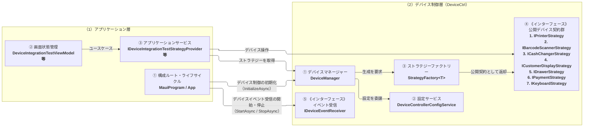
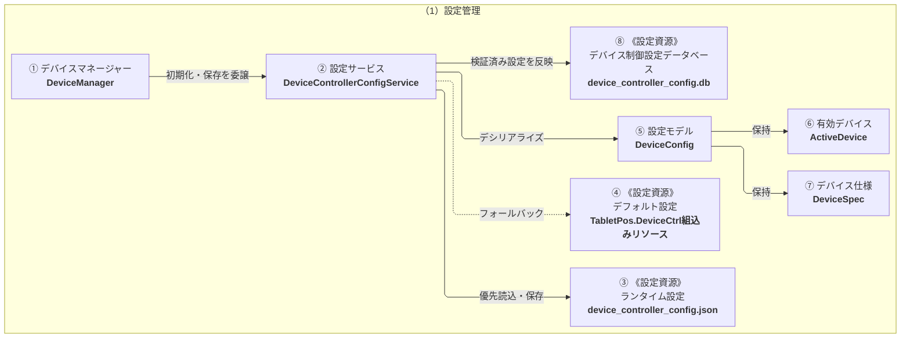
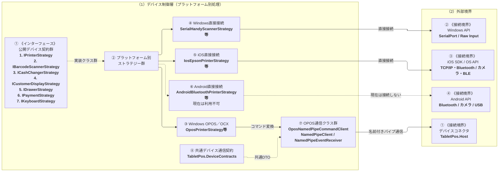

# ARCH-DEVICE-01 次世代POS デバイス制御クラス構成図

次世代POS
ARCH-DEVICE-01 デバイス制御クラス構成図
文書ID: ARCH-DEVICE-01
第0.1.2版
2026年8月31日

## 表紙

文書情報を以下に示す。

| 項目 | 内容 |
|---|---|
| PJ名 | 次世代POS |
| システム名 | 次世代POS |
| 文書ID | ARCH-DEVICE-01 |
| 文書名 | 次世代POS デバイス制御クラス構成図 |
| 成果物名 | 次世代POS デバイス制御クラス構成図 |
| 対象 | タブレットPOS端末アプリのアプリケーション層とデバイス制御層の関係 |
| 版数 | 0.1.2 |
| 作成日 | 2026/08/31 |
| 作成者 | VTI サム |
| レビュー担当 | SMJ 蒲田 |
| 承認者 | SMJ 蒲田 |
| 目的 | 業務処理の呼出元、デバイスマネージャー、設定サービス、設定ストレージ、ストラテジーパターン、公開デバイス契約、およびプラットフォーム別処理の責務と関係を明確にする。 |
| 期待成果 | 開発者が利用すべきクラスとインターフェースを判断でき、業務処理をベンダー、OS、およびデバイス接続方式から独立させられること。 |

## 変更履歴

文書の改訂履歴を以下に示す。

| No. | 版数 | 変更日 | 区分 | 変更箇所（項番等） | 変更内容 | 担当者 |
|---|---|---|---|---|---|---|
| 1 | 0.1.0 | 2026/08/24 | 新規 | 全体 | デバイス制御クラス構成図を新規作成。責務領域、構成要素、および関連プログラム仕様書の対応を整理。 | VTI サム |
| 2 | 0.1.1 | 2026/08/24 | 変更 | クラス構成図 | 単一の構成図を、全体、設定管理、およびプラットフォーム別の3図に分割し、責務領域と構成要素の説明を各図の説明シートに整理。 | VTI サム |
| 3 | 0.1.2 | 2026/08/31 | 変更 | 設定管理クラス構成図 | JSONを設定の読込元として維持し、検証済み設定をデバイス制御設定データベースへ反映する構成と保存順序を追加。 | VTI サム |

## 目次

本書のシート一覧を以下に示す。

```text
1. 表紙
2. 変更履歴
3. 目次
4. 概要
5. 対象範囲
6. 関連資料
7. 全体クラス構成図
8. 全体クラス構成図（説明）
9. 設定管理クラス構成図
10. 設定管理クラス構成図（説明）
11. プラットフォーム別クラス構成図
12. プラットフォーム別クラス構成図（説明）
```

## 02_概要

目的、結論、および設計方針を以下に示す。

### 2.1 目的と結論

タブレットPOS端末アプリは、画面状態管理、アプリケーションサービス、デバイス制御層の順にデバイス操作を呼び出す。アプリケーション層は公開デバイス契約だけに依存し、ベンダー、OS、および接続方式に固有の処理を持たない。

デバイス制御層は設定から有効なデバイスを選択し、ストラテジーパターンによってプラットフォーム別実装を切り替える。設定の読込・保存と、デバイスコネクタ、SDK、またはOS APIへの接続処理をアプリケーション層から分離する。

WindowsのOPOS／OCX系はデバイスコネクタを経由し、Windows直接接続とiOSはプラットフォーム別ストラテジーから周辺機器へ接続する。Android向け実装は構成上存在するが、現在は利用できない。この構成により、デバイス機種またはプラットフォームを変更しても、業務処理は同じ呼出方法を維持できる。

### 2.2 本書の設計領域

| 設計領域 | 本書で定義する内容 | 本書で定義しない内容 |
|---|---|---|
| システム構造設計 | アプリケーション層、デバイス制御層、デバイスコネクタ、および周辺機器の責務と依存関係。 | 画面ごとの業務ルールと取引判断。 |
| 設定設計 | device_controller_config.jsonの所有、読込、フォールバック、保存、SQLiteへの反映、および適用。 | 店舗での設定変更手順、監視、バックアップ、復旧、およびリリース作業。 |
| 実装対応 | 論理構成要素と実装識別子、および関連プログラム仕様書との対応。 | 各クラス／インターフェースのメソッド仕様、入出力、例外、および詳細処理。 |

監視、ログ運用、バックアップ、計画停止、リリース、障害復旧、運用体制、および運用日程は、別の運用設計書で管理する。

### 2.3 設計方針

| 項番 | 原則 | 設計内容 |
|---|---|---|
| 1 | アプリケーションサービス経由で呼び出す | 画面状態管理はアプリケーションサービスを呼び出し、アプリケーションサービスだけがストラテジーを取得して、デバイス種別ごとの公開デバイス契約を使用する。 |
| 2 | 設定から選択する | デバイス種別、OS、および有効デバイス設定から、使用するデバイスとストラテジーを決定する。 |
| 3 | プラットフォーム固有処理を分離する | OPOS／OCX向けの名前付きパイプ通信、シリアル通信、SDK、およびOS APIをデバイス制御層のプラットフォーム別実装に閉じ込める。 |
| 4 | デバイス制御層が設定を管理する | デバイス制御層が設定の読込、フォールバック、保存、および適用を行い、アプリケーション層は公開ファサードだけを呼び出す。 |
| 5 | ライフサイクルを明確に管理する | デバイス操作の開始・終了を公開デバイス契約で管理し、アプリの起動・終了に合わせてイベント受信を開始・停止する。 |
| 6 | ベンダーに依存しない | ベンダーまたは機種の変更はストラテジーと設定で行い、業務コードにベンダー別分岐を追加しない。 |

### 2.4 対象読者

| 利用者 | 利用目的 |
|---|---|
| アプリケーション層の開発者 | デバイス制御層の呼出を担当するアプリケーションサービスと、画面状態管理がユースケース経由で結果を受け取る方法を確認する。 |
| デバイス制御層の開発者 | デバイスマネージャー、設定サービス、設定ストレージ、デバイス構成、ストラテジーファクトリー、デバイス仕様モデル、およびストラテジーの責務を確認する。 |
| 複数ベンダー対応の開発者 | 業務フローを変更せずに、プラットフォーム別クラスとデバイス設定を追加する。 |
| レビュー担当者・テスト担当者 | 責務境界、構成要素の関係、実装識別子、およびプラットフォーム範囲を確認する。 |

### 2.5 本書の構成

(1) 03_対象範囲で、デバイス制御層の対象と他文書で管理する対象を確認する。

(2) 05_全体クラス構成図_01の5.1で、アプリケーション層から公開デバイス契約までの主要な依存関係を確認する。

(3) 06_設定管理クラス構成図_01の6.1で、設定の読込、フォールバック、保存、SQLiteへの反映、および適用を担当するクラスと設定資源の関係を確認する。

(4) 07_プラットフォーム別クラス構成図_01の7.1で、Windows OPOS／OCX、Windows直接接続、iOS、およびAndroidのストラテジーと通信境界を確認する。

(5) 各クラス構成図の説明シートで、該当する責務領域、構成要素、実装識別子、主な連携・利用条件、および関連プログラム仕様書を確認する。

## 03_対象範囲

本書の対象範囲と対象外を以下に示す。

### 3.1 対象範囲

① ファイルI/OまたはJSON解析をアプリケーション層へ持ち込まず、構成ルートからデバイス制御層を初期化する処理。

② デバイス種別とOSに基づく有効デバイスの選択。

③ ストラテジーの生成とアプリケーション層への公開デバイス契約の返却。

④ スキャナー、レシートプリンター、カスタマディスプレイ、ドロア、自動釣銭機、決済端末、および専用キーボード。

⑤ Windowsのデバイスコネクタ経由の制御と、デバイス制御層から周辺機器への直接制御の境界。

⑥ 論理構成要素、実装識別子、および関連プログラム仕様書の対応。

### 3.2 対象外

① 各画面の業務ルール、メッセージ内容、および取引の続行または中止の判断。

② デバイスコネクタ内部の構造、OPOSサービスオブジェクト、ドライバー、および店舗でのデバイス設置手順。

③ ベンダー別・デバイス機種別SDKの詳細設計。

④ A4印刷。本機能はデバイス制御層のレシート向けインターフェースを使用せず、別の文書印刷設計で管理する。

⑤ 決済端末の取引判断、売上業務フロー、およびCAFIS Arch固有の電文詳細。デバイス制御層の公開契約、ストラテジー選択、およびデバイスコネクタとの接続関係は本書で定義する。

## 04_関連資料

関連文書を以下に示す。

| 文書ID | 文書名 | 本書との関係 |
|---|---|---|
| ARCH-01 | タブレットPOS ソフトウェア構造設計書 | POSシステム全体の構造を定義する。 |
| ARCH-02 | タブレットPOS 端末アプリケーション構造設計書 | アプリケーション層の構造とデバイス制御層の呼出箇所を定義する。 |
| ARCH-HOST-01 | タブレットPOS デバイスコネクタ基本設計書 | Windows上のデバイスコネクタのプロセス境界と通信を定義する。 |
| CFG-01 | タブレットPOS デバイス制御層設定ファイル記載要領 | デバイスの定義方法と有効デバイス設定を定義する。 |
| DB-DEVICE-01 | デバイス制御設定 SQLiteテーブル定義書 | 検証済みJSONから反映する4テーブルの物理構成を定義する。 |
| EX-DEVICE-01 | 次世代POS デバイス制御実装例集 | 本書で示すインターフェースを使用したC#の実装例を提供する。 |
| PS-DEVICE-01〜11 | タブレットPOS デバイス制御 プログラム仕様書 | 本書の論理構成要素に対応するクラス、インターフェース、およびメソッドの詳細を定義する。構成要素ごとの対応は、各クラス構成図の説明シートに示す。 |
| - | デバイス制御層_ドキュメント一覧 | デバイス制御層文書群の位置付けと目的を示す。 |

## 05_全体クラス構成図_01

以下の図は、アプリケーション層からデバイス制御層の公開窓口までの主要なクラスおよびインターフェースの関係を示す。

#### 凡例

3図で共通して使用する関係を以下に示す。

| 表示 | 色 | 意味 |
|---|---|---|
| 責務領域 | 背景:#F7FBFF / 枠線:#4472C4 / 文字:#111111 / 太さ:2 | クラスを所有する上位の責務領域を示す。 |
| アプリケーション領域 | 背景:#DDEBF7 / 枠線:#4472C4 / 文字:#111111 / 太さ:2 | アプリケーション層の責務領域を示す。 |
| デバイス制御領域 | 背景:#E2F0D9 / 枠線:#70AD47 / 文字:#111111 / 太さ:2 | デバイス制御層の責務領域を示す。 |
| クラス | 背景:#F8FBFD / 枠線:#0D32B2 / 文字:#111111 / 太さ:2 | アプリ内のクラスまたは同種クラス群を示す。 |
| 公開インターフェース | 背景:#DDEBF7 / 枠線:#4472C4 / 文字:#111111 / 太さ:2 | 公開インターフェースまたは同種インターフェース群を示す。 |
| 《設定資源》 | 背景:#FFF2CC / 枠線:#BF9000 / 文字:#111111 / 太さ:2 | クラスではなく、設定サービスが読み込むJSON設定、フォールバック用の組込みリソース、または検証済み設定の反映先を示す。 |
| 共通通信契約 | 背景:#FFF2CC / 枠線:#BF9000 / 文字:#111111 / 太さ:2 | デバイス制御層とデバイスコネクタが共有する通信契約を示す。 |
| 《接続境界》 | 背景:#FCE4D6 / 枠線:#ED7D31 / 文字:#111111 / 太さ:2 | OS API、SDK、または別プロセスとの通信境界を示す。 |
| 利用対象外実装 | 背景:#F2F2F2 / 枠線:#7F7F7F / 文字:#666666 / 太さ:2 / 線種:破線 | 構成上は存在するが、現在は利用できない実装を示す。 |
| ━━▶ 主な関係 | 線:#4472C4 / 線種:実線 / 太さ:2 | 主な呼出、生成、返却、または通信の関係を示す。 |
| ┄┄▶ 補助関係 | 線:#7F7F7F / 線種:破線 / 太さ:2 | インターフェースの実装、補助的な参照、またはフォールバックの関係を示す。 |
| コネクターラベル | 背景:#FFFFFF / 枠線:透明 / 文字:#111111 / 太さ:0 | コネクター上に関係の内容を表示する。 |

### 5.1 全体クラス構成図



## 05_全体クラス構成図_02

### 5.2 構成図の概要

本図では、アプリケーション層からデバイス制御層を利用する流れを示す。

- 画面状態管理は、画面で受け付けた業務要求をアプリケーションサービスへ渡す。
- アプリケーションサービスは、デバイスマネージャーから対象デバイスのストラテジーを取得する。
- デバイス操作は公開デバイス契約を介して実行するため、アプリケーション層は具象クラスを直接参照しない。
- アプリの起動・終了に合わせて、デバイス制御の初期化（InitializeAsync）とデバイスイベント受信の開始・停止（StartAsync / StopAsync）を行う。
- 設定管理の詳細は6.1、プラットフォーム別実装は7.1に示す。

### 5.3 責務領域

全体クラス構成では、アプリケーション層とデバイス制御層の境界を確認する。設定管理の内部は6.2～6.4、プラットフォーム固有処理と外部境界は7.2～7.4に示す。

| 図中番号 | 責務領域 | 主な責務 | 主な構成要素 | 関連資料 |
|---|---|---|---|---|
| （1） | アプリケーション層 | 業務要求を受け付け、アプリケーションサービスからデバイス制御層の公開窓口と公開デバイス契約を呼び出す。アプリの起動・終了に合わせて初期化とイベント受信のライフサイクルを管理する。 | 構成ルート・ライフサイクル、画面状態管理、アプリケーションサービス | ARCH-02_タブレットPOS_端末アプリケーション構造設計書.xlsx<br>EX-DEVICE-01_次世代POS_デバイス制御実装例集.xlsx |
| （2） | デバイス制御層（DeviceCtrl） | 設定に基づいて有効なデバイスを選択し、公開デバイス契約を実装するストラテジーを生成する。プラットフォーム固有の通信とデバイス操作をアプリケーション層から分離する。 | デバイスマネージャー、設定サービス、ストラテジーファクトリー、公開デバイス契約 | CFG-01_タブレットPOS_デバイス制御層設定ファイル記載要領.xlsx<br>EX-DEVICE-01_次世代POS_デバイス制御実装例集.xlsx |

### 5.4 構成要素と実装対応

<!-- excel-render table-grid=wide -->
| 図中番号 | 論理構成要素 | 実装識別子 | 責務 | 主な連携・利用条件 | 関連プログラム仕様書 |
|---|---|---|---|---|---|
| （1） | アプリケーション層 |  |  |  |  |
| ① | 構成ルート・ライフサイクル | MauiProgram、App | デバイス制御層のサービスを登録し、アプリの起動・終了に合わせて初期化、デバイスコネクタの起動・停止、およびイベント受信の開始・停止を管理する。 | 初期化はDeviceManagerへ委譲し、設定ファイルを直接読み込まない。 | PS-DEVICE-05_タブレットPOS_デバイス制御_サービス登録_プログラム仕様書.xlsx |
| ② | 画面状態管理 | DeviceIntegrationTestViewModel等 | 画面から受け付けた業務要求をアプリケーションサービスへ渡し、返された結果を画面状態へ反映する。 | DeviceManager、ストラテジー、通信API、およびSDKを直接呼び出さない。 | － |
| ③ | アプリケーションサービス | IDeviceIntegrationTestStrategyProvider、DeviceIntegrationTestStrategyProvider等 | デバイス種別に対応するストラテジーを取得し、Start、デバイス操作、およびEndを公開デバイス契約経由で呼び出す。 | ベンダー、OS、および接続方式による分岐を業務処理へ持ち込まない。 | － |
| （2） | デバイス制御層（DeviceCtrl） |  |  |  |  |
| ① | デバイスマネージャー | DeviceManager | 現在の設定を保持し、使用するデバイス仕様とストラテジーを選択する。 | 設定の読込・保存と選択条件の詳細は6.2および6.4に示す。 | PS-DEVICE-01_タブレットPOS_デバイス制御_デバイスマネージャー_プログラム仕様書.xlsx |
| ② | 設定サービス | DeviceControllerConfigService | 設定を読み込み、デバイスマネージャーが使用する設定モデルを提供する。 | 読込、フォールバック、保存、および適用の詳細は6.2および6.4に示す。 | PS-DEVICE-02_タブレットPOS_デバイス制御_設定サービス_プログラム仕様書.xlsx<br>PS-DEVICE-04_タブレットPOS_デバイス制御_設定ストレージインターフェース_プログラム仕様書.xlsx |
| ③ | ストラテジーファクトリー | StrategyFactory&lt;TBase&gt; | 選択されたデバイス仕様に対応するプラットフォーム別ストラテジーを生成する。 | 生成したインスタンスへデバイス仕様とロガーを設定し、公開デバイス契約として返す。 | PS-DEVICE-07_タブレットPOS_デバイス制御_ストラテジーファクトリー_プログラム仕様書.xlsx |
| ④ | 公開デバイス契約 | IPrinterStrategy、IBarcodeScannerStrategy、ICashChangerStrategy、ICustomerDisplayStrategy、IDrawerStrategy、IPaymentStrategy、IKeyboardStrategy | デバイス種別ごとに共通のStart、デバイス操作、およびEndをアプリケーションサービスへ公開する。 | プラットフォーム別ストラテジーが契約を実装し、呼出側は具象クラスに依存しない。 | PS-DEVICE-08_タブレットPOS_デバイス制御_デバイスストラテジー基底_プログラム仕様書.xlsx |
| ⑤ | イベント受信 | IDeviceEventReceiver、NamedPipeEventReceiver | イベント通知用パイプから共通イベントを継続受信する。 | Appのライフサイクルで開始・停止する。現行ソースではEventReceivedの購読者がなく、受信イベントをアプリケーションユースケースへ引き渡さない。 | PS-DEVICE-11_タブレットPOS_デバイス制御_名前付きパイプイベント受信_プログラム仕様書.xlsx |

## 06_設定管理クラス構成図_01

以下の図は、デバイス制御設定の読込、フォールバック、保存、および適用を担当するクラス、モデル、および設定元の関係を示す。

### 6.1 設定管理クラス構成図



## 06_設定管理クラス構成図_02

### 6.2 構成図の概要

本図では、どの設定を読み込み、どのデバイス仕様を有効にするかを示す。

- 設定サービスは、使用可能なランタイム設定を優先して読み込む。
- ランタイム設定を使用できない場合は、組込みのデフォルト設定を読み込む。
- 読み込んだJSON設定をデシリアライズして検証し、実行時に参照するデバイス仕様モデルへ変換する。
- 検証済み設定は、JSONを取込元としてデバイス制御設定データベースの4テーブルへ同一トランザクションで反映する。SQLiteは起動時の設定読込元としては使用しない。
- 設定保存時はランタイム設定を先に更新し、同じ設定をSQLiteへ反映する。両方の保存に成功した場合に、デバイスマネージャーが新しい設定を適用する。
- デバイスマネージャーは、デバイス種別、OS、および有効デバイスIDを基に、有効デバイス（ActiveDevice）とデバイス仕様（DeviceSpec）を決定する。
- 設定項目と値はCFG-01、SQLiteの物理テーブル構成はDB-DEVICE-01、各クラスのメソッド仕様はPS-DEVICE-01〜06およびPS-DEVICE-09で定義する。

### 6.3 責務領域

設定管理に関する責務はデバイス制御層が所有する。設定項目と値はCFG-01で定義する。

| 図中番号 | 責務領域 | 主な責務 | 関連資料 |
|---|---|---|---|
| （1） | 設定管理 | 設定の読込、フォールバック、保存、SQLiteへの反映、適用、および有効なデバイス仕様の選択を管理する。 | CFG-01_タブレットPOS_デバイス制御層設定ファイル記載要領.xlsx<br>DB-DEVICE-01_デバイス制御設定_SQLiteテーブル定義書.xlsx |

### 6.4 構成要素と実装対応

本項は、設定を読み込み、選択し、適用する構成要素の責務と実装対応を示す。

<!-- excel-render table-grid=wide -->
| 図中番号 | 論理構成要素 | 実装識別子 | 責務 | 主な連携・利用条件 | 関連プログラム仕様書 |
|---|---|---|---|---|---|
| （1） | 設定管理 |  |  |  |  |
| ① | デバイスマネージャー | DeviceManager | 設定を初期化・保存し、デバイス種別、OS、および有効デバイスIDに対応するデバイス仕様を選択する。 | シングルトンとして現在の設定を保持し、選択したデバイス仕様からストラテジーの生成を要求する。 | PS-DEVICE-01_タブレットPOS_デバイス制御_デバイスマネージャー_プログラム仕様書.xlsx |
| ② | 設定サービス | DeviceControllerConfigService | 設定ストレージインターフェースを介してJSON設定を読み込み、デシリアライズ・検証した設定をSQLiteへ反映する。設定保存時はランタイム設定を先に更新し、SQLiteへの反映後に新しい設定を適用する。 | ランタイム設定を優先し、読込・変換に失敗した場合はデフォルト設定へ切り替える。SQLiteは設定の反映先であり、起動時の読込元としては使用しない。取消時は切り替えず、保存失敗時は現在の設定を維持する。 | PS-DEVICE-02_タブレットPOS_デバイス制御_設定サービス_プログラム仕様書.xlsx<br>PS-DEVICE-04_タブレットPOS_デバイス制御_設定ストレージインターフェース_プログラム仕様書.xlsx |
| ③ | ランタイム設定 | device_controller_config.json | アプリデータ領域に保存されたデバイス制御設定を保持する。 | ファイルが存在し、有効なデバイス仕様へ変換できる場合に優先して使用する。 | PS-DEVICE-03_タブレットPOS_デバイス制御_組込み設定ストレージ_プログラム仕様書.xlsx |
| ④ | デフォルト設定 | TabletPos.DeviceCtrlの埋め込みリソース | ランタイム設定を使用できない場合の初期設定を保持する。 | ランタイム設定が存在しない、または無効な場合に使用する。 | PS-DEVICE-03_タブレットPOS_デバイス制御_組込み設定ストレージ_プログラム仕様書.xlsx |
| ⑤ | 設定モデル | DeviceConfig | デバイス設定全体を保持する。 | devices、activeDevices、およびappSettings.namedPipeを保持し、設定選択と通信設定に必要な情報を提供する。 | PS-DEVICE-06_タブレットPOS_デバイス制御_デバイス構成_プログラム仕様書.xlsx<br>PS-DEVICE-09_タブレットPOS_デバイス制御_デバイス仕様モデル_プログラム仕様書.xlsx |
| ⑥ | 有効デバイス | ActiveDevice | OSおよびデバイス種別ごとに使用するデバイスIDを保持する。 | デバイスマネージャーが有効なデバイス仕様を選択するときに参照する。 | PS-DEVICE-06_タブレットPOS_デバイス制御_デバイス構成_プログラム仕様書.xlsx<br>PS-DEVICE-09_タブレットPOS_デバイス制御_デバイス仕様モデル_プログラム仕様書.xlsx |
| ⑦ | デバイス仕様 | DeviceSpec | デバイスID、種別、OS、ストラテジー名、および接続情報を保持する。 | 選択したストラテジーの生成と通信設定に使用する。 | PS-DEVICE-06_タブレットPOS_デバイス制御_デバイス構成_プログラム仕様書.xlsx<br>PS-DEVICE-09_タブレットPOS_デバイス制御_デバイス仕様モデル_プログラム仕様書.xlsx |
| ⑧ | デバイス制御設定データベース | device_controller_config.db | 検証済みJSONのデバイス仕様、接続設定、有効デバイス対応、および名前付きパイプ設定を保持する。 | `SqliteDeviceControllerConfigStorage` が4テーブルを同一トランザクションで全件入れ替える。SQLiteから設定モデルは復元しない。 | DB-DEVICE-01_デバイス制御設定_SQLiteテーブル定義書.xlsx |

## 07_プラットフォーム別クラス構成図_01

以下の図は、公開デバイス契約を実装するプラットフォーム別ストラテジーと、各プラットフォームの通信境界を示す。

### 7.1 プラットフォーム別クラス構成図



## 07_プラットフォーム別クラス構成図_02

### 7.2 構成図の概要

本図では、公開デバイス契約を各プラットフォームでどのように実装し、どの経路で機器に接続するかを示す。

- Windows OPOS／OCXでは、ストラテジーからOPOSコマンド変換、名前付きパイプクライアント、およびデバイスコネクタを経由して機器に接続する。
- Windows直接接続では、SerialPortまたはRaw Input APIを使用する。スキャナーと専用キーボードは利用できるが、シリアル自動釣銭機は利用対象外とする。
- iOSでは、SDKまたはOS APIを使用して機器に直接接続する。
- Androidでは、Bluetooth、カメラ、またはUSBを使用するクラスと登録は存在するが、必須処理を提供していないため現在は利用できない。
- ストラテジーファクトリーとの生成関係は5.1、対象機器と利用条件は7.4に示す。

### 7.3 責務領域

プラットフォーム別クラス構成では、デバイス制御層に閉じ込めるプラットフォーム固有処理と、アプリの外側にある接続先の境界を確認する。

| 図中番号 | 責務領域 | 主な責務 | 主な構成要素 | 関連資料 |
|---|---|---|---|---|
| （1） | デバイス制御層（プラットフォーム別処理） | 公開デバイス契約をプラットフォーム別ストラテジーで実装し、OPOS／OCX、SerialPort、Raw Input、SDK、およびOS APIの違いを呼出側から隠蔽する。 | Windows OPOS／OCXストラテジー、Windows直接接続ストラテジー、iOS直接接続ストラテジー、Android直接接続ストラテジー | EX-DEVICE-01_次世代POS_デバイス制御実装例集.xlsx |
| （2） | 外部境界 | タブレットPOS端末アプリの外側で実行するデバイスコネクタと周辺機器を示し、名前付きパイプ、OPOS／OCX、SDK、およびOS APIの責務境界を明確にする。 | デバイスコネクタ、Windows OPOS／OCX機器、Windows直接接続機器、iOS／Android周辺機器 | ARCH-HOST-01_タブレットPOS_デバイスコネクタ基本設計書.xlsx |

### 7.4 構成要素と実装対応

<!-- excel-render table-grid=wide -->
| 図中番号 | 論理構成要素 | 実装識別子 | 責務 | 主な連携・利用条件 | 関連プログラム仕様書 |
|---|---|---|---|---|---|
| （1） | デバイス制御層（プラットフォーム別処理） |  |  |  |  |
| ① | 公開デバイス契約 | IPrinterStrategy、IBarcodeScannerStrategy、ICashChangerStrategy、ICustomerDisplayStrategy、IDrawerStrategy、IPaymentStrategy、IKeyboardStrategy | デバイス種別ごとに共通のStart、デバイス操作、およびEndをアプリケーションサービスへ公開する。 | プラットフォーム別ストラテジーが契約を実装し、呼出側は具象クラスに依存しない。 | PS-DEVICE-08_タブレットPOS_デバイス制御_デバイスストラテジー基底_プログラム仕様書.xlsx |
| ② | プラットフォーム別ストラテジー群 | － | 公開デバイス契約を実装するストラテジーをプラットフォームと接続方式ごとに分類する。 | デバイスマネージャーが選択したデバイス仕様に基づいて対象ストラテジーを生成する。 | PS-DEVICE-08_タブレットPOS_デバイス制御_デバイスストラテジー基底_プログラム仕様書.xlsx |
| ③ | Windows OPOS／OCXストラテジー | OposPrinterStrategy、OposCashChangerStrategy、OposCustomerDisplayStrategy、OposDrawerStrategy、OposCafisArchPaymentStrategy等 | 公開デバイス契約を実装し、OPOSコマンド変換と名前付きパイプ通信を介してデバイスコネクタへ操作を渡す。 | WindowsのOPOS／OCXまたはCAFIS Arch環境を必要とするデバイスで使用する。 | PS-DEVICE-08_タブレットPOS_デバイス制御_デバイスストラテジー基底_プログラム仕様書.xlsx |
| ④ | Windows直接接続ストラテジー | SerialHandyScannerStrategy、WindowsRawKeyboardStrategy、SerialCashChangerStrategy等 | SerialPort・COMまたはRaw Input APIを使用し、Windows周辺機器を直接制御する。 | スキャナーと専用キーボードは利用可能である。シリアル自動釣銭機は公開デバイス契約の必須操作を満たさないため利用対象外とする。 | PS-DEVICE-08_タブレットPOS_デバイス制御_デバイスストラテジー基底_プログラム仕様書.xlsx |
| ⑤ | iOS直接接続ストラテジー | IosEpsonPrinterStrategy、IosCameraBarcodeScannerStrategy、IosBleBarcodeScannerStrategy、IosCustomerDisplayStrategy | SDKまたはOS APIを使用し、iOS上の周辺機器へ直接接続する。 | レシートプリンター、スキャナー、およびカスタマディスプレイで利用可能である。 | PS-DEVICE-08_タブレットPOS_デバイス制御_デバイスストラテジー基底_プログラム仕様書.xlsx |
| ⑥ | Android直接接続ストラテジー | AndroidBluetoothPrinterStrategy、AndroidCameraBarcodeScannerStrategy、AndroidEpsonDm70DCustomerDisplayStrategy | Bluetooth、カメラ、またはUSBを使用するAndroid向けの公開デバイス契約を実装する。 | 設定と登録は存在するが、現在は周辺機器を操作する必須処理を提供していないため利用不可とする。 | PS-DEVICE-08_タブレットPOS_デバイス制御_デバイスストラテジー基底_プログラム仕様書.xlsx |
| ⑦ | OPOS通信クラス群 | OposNamedPipeCommandClient、INamedPipeClient、NamedPipeClient、NamedPipeEventReceiver | Windows OPOS／OCXストラテジーの操作を共通要求へ変換し、コマンド通信用パイプへ送信して同期応答を受信する。イベント通知用パイプから共通イベントを受信する。 | デバイスマネージャーが適用したパイプ名、タイムアウト、および再試行設定を使用する。 | PS-DEVICE-10_タブレットPOS_デバイス制御_名前付きパイプクライアント_プログラム仕様書.xlsx<br>PS-DEVICE-11_タブレットPOS_デバイス制御_名前付きパイプイベント受信_プログラム仕様書.xlsx |
| ⑧ | 共通デバイス通信契約 | TabletPos.DeviceContracts | デバイス制御層とデバイスコネクタが共有する要求、応答、イベント、識別子、および通信既定値を定義する。 | 両者は同じDTOを参照し、同名の通信モデルを個別に保持しない。 | PS-DEVICE-10_タブレットPOS_デバイス制御_名前付きパイプクライアント_プログラム仕様書.xlsx<br>PS-DEVICE-11_タブレットPOS_デバイス制御_名前付きパイプイベント受信_プログラム仕様書.xlsx |
| （2） | 外部境界 |  |  |  |  |
| ① | デバイスコネクタ | TabletPos.Host | Windows別プロセスとしてOPOS／OCXおよびCAFIS Arch資源を保持し、対象デバイスを制御する。 | コマンド通信用パイプで要求と同期応答を送受信し、イベント通知用パイプから非同期イベントを送信する。 | － |
| ② | Windows API | SerialPort、Raw Input | Windows直接接続ストラテジーから周辺機器の物理操作を受け付ける。 | スキャナーと専用キーボードは利用可能である。シリアル自動釣銭機は現在の必須操作を満たさないため利用対象外とする。 | － |
| ③ | iOS SDK／OS API | TCP/IP、Bluetooth、カメラ、BLE | iOS直接接続ストラテジーから周辺機器の物理操作を受け付ける。 | レシートプリンター、スキャナー、およびカスタマディスプレイで利用する。 | － |
| ④ | Android API | Bluetooth、カメラ、USB | Android直接接続ストラテジーから周辺機器の物理操作を受け付ける。 | 現在のストラテジーが必須操作を提供していないため、接続を実行しない。 | － |
