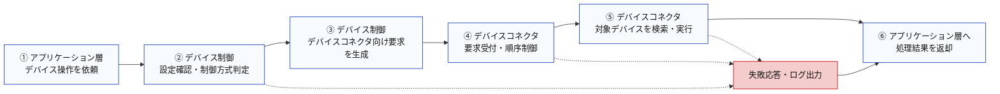
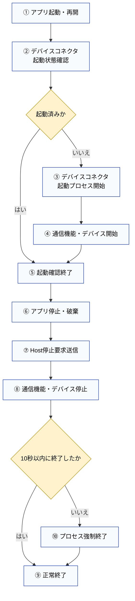

# ARCH-HOST-01 デバイスコネクタ基本設計書

タブレットPOS
ARCH-HOST-01 デバイスコネクタ基本設計書
文書ID: ARCH-HOST-01
第0.2.17版
2026年7月10日

## 00_表紙

| 項目 | 内容 |
|---|---|
| 文書ID | ARCH-HOST-01 |
| 文書名 | タブレットPOS デバイスコネクタ基本設計書 |
| 対象 | デバイスコネクタ |
| 版数 | 0.2.17 |
| 作成日 | 2026/07/07 |
| 作成者 | VTI サム |
| レビュー担当 | SMJ 鎌田 |
| 承認者 | - |
| 目的 | デバイスコネクタの役割、機能、インターフェース、設定、エラー処理、ログ、確認事項を基本設計として整理する。 |
| 期待成果 | デバイスコネクタの基本設計としてレビューできる状態にし、未決事項を19_確認事項で判断できるようにする。 |
| 想定形式 | 目次から各設計シートを確認できる構成とする。 |

## 01_改訂履歴

| 版数 | 日付 | 変更内容 | 作成者 | 承認者 |
|---|---|---|---|---|
| 0.2.17 | 2026/07/10 | ライフサイクル図をフローチャートへ簡略化し、コード識別子を日本語論理名との併記へ統一。 | VTI サム | - |
| 0.2.16 | 2026/07/10 | 本文と図の論理名称を日本語に統一し、英語の実装識別子は項目定義、メッセージ一覧、設定例、実装対応表に限定。 | VTI サム | - |
| 0.2.15 | 2026/07/10 | デバイス操作要求処理フロー図を、主要な処理段階と異常経路を確認できる簡潔なフローチャートに修正。 | VTI サム | - |
| 0.2.14 | 2026/07/10 | 全体構成図の凡例とメモを、5.1の構成および5.2の責務・項番と一致する内容に修正。 | VTI サム | - |
| 0.2.13 | 2026/07/10 | 全体構成図の凡例とメモを、図と合わせて確認しやすい簡潔な表示に修正。 | VTI サム | - |
| 0.2.12 | 2026/07/10 | 全体構成図に表示ルールと設計上の補足を追加し、図の色、線種、責務境界と一致する内容に修正。 | VTI サム | - |
| 0.2.11 | 2026/07/10 | 全体構成図の処理経路を整理し、内部名称を利用者向けの日本語表現に修正。 | VTI サム | - |
| 0.2.10 | 2026/07/10 | 全体構成図と構成要素の項番を、構成ブロック間で連続する番号に修正。 | VTI サム | - |
| 0.2.9 | 2026/07/10 | ソースコードに合わせて、全体構成、処理フロー、ライフサイクル、設定、エラー処理、ログ、実装対応を見直し。 | VTI サム | - |
| 0.2.8 | 2026/07/08 | デバイスコネクタの基本設計書として新規作成。 | VTI サム | - |

## 目次

| No | 資料名称 | 備考 | No | 資料名称 | 備考 |
|---|---|---|---|---|---|
| 1 | 表紙 | 00_表紙 | 13 | ライフサイクル説明 | 09_ライフサイクル_02 |
| 2 | 改訂履歴 | 01_改訂履歴 | 14 | インターフェース一覧 | 10_インターフェース一覧 |
| 3 | 概要 | 02_概要 | 15 | 要求項目定義 | 11_要求項目定義 |
| 4 | 対象範囲 | 03_対象範囲 | 16 | 応答項目定義 | 12_応答項目定義 |
| 5 | 関連資料 | 04_関連資料 | 17 | イベント項目定義 | 13_イベント項目定義 |
| 6 | 全体構成図 | 05_全体構成_01 | 18 | メッセージ一覧 | 14_メッセージ一覧 |
| 7 | 全体構成説明 | 05_全体構成_02 | 19 | 設定ファイル設計 | 15_設定ファイル設計 |
| 8 | デバイス操作要求処理フロー図 | 06_デバイス操作要求処理フロー_01 | 20 | デバイス別設計 | 16_デバイス別設計 |
| 9 | デバイス操作要求処理フロー説明 | 06_デバイス操作要求処理フロー_02 | 21 | エラー処理 | 17_エラー処理 |
| 10 | 機能一覧 | 07_機能一覧 | 22 | ログ設計 | 18_ログ設計 |
| 11 | 機能詳細 | 08_機能詳細 | 23 | 確認事項 | 19_確認事項 |
| 12 | ライフサイクル図 | 09_ライフサイクル_01 | 24 | 実装対応表 | 20_実装対応表 |

## 02_概要

### 2.1 結論

本書は、Windows端末上で別プロセスとして動作するデバイスコネクタを対象にした基本設計書である。タブレットPOS端末アプリは、画面・業務を担当するアプリケーション層と、デバイス制御で構成される。

デバイス操作は、アプリケーション層からデバイス制御を経由してデバイスコネクタへ送る。アプリケーション層は、デバイス操作のためにデバイスコネクタの通信処理や個別デバイス実装を直接呼び出さない。一方、デバイスコネクタプロセスの起動と停止は、アプリケーション層のデバイスコネクタプロセス管理部が担当する。デバイスコネクタは、名前付きパイプ通信、デバイスID単位の順序制御、コマンド処理、デバイス管理、および既存OPOS、OCX、共有メモリ、要求/応答ファイル連携を利用した実機制御を担当する。

### 2.2 設計方針

① アプリケーション層は、画面操作と業務処理から必要なデバイス操作をデバイス制御へ渡す。

② デバイス制御は、設定を読み込み、実行環境に対応するデバイスストラテジーを選択する。デバイスコネクタ経由のストラテジーは、コマンド用名前付きパイプへ要求を送る。

③ アプリケーション層のデバイスコネクタプロセス管理部は、アプリの起動、再開、停止に合わせてデバイスコネクタプロセスを起動または停止する。

④ デバイスコネクタは、コマンド受付、デバイスID単位の順序制御、要求変換、コマンド判定、デバイス検索、個別デバイス実行の順に処理する。

⑤ コマンド要求と同期応答はコマンド通信用パイプ（TabetPos.Host.Command）を使用する。デバイスコネクタ側の非同期通知はイベント通知用パイプ（TabetPos.Host.Event）を使用するが、デバイス制御側のイベント受信は確認事項として扱う。

⑥ 初期対象は、RT-300釣銭機、SHARPキャッシュドロア、SHARPカスタマーディスプレイとする。

⑦ 物理クラス名や詳細メソッドは、本文で繰り返さず、20_実装対応表またはプログラム仕様書で確認する。

### 2.3 レビュー判断

本書の対象範囲、役割分担、通信方式、設定、エラー処理、ログ、確認事項に大きな認識差異がなければ、デバイスコネクタの基本設計としてレビュー完了を判断できる。未決事項は、19_確認事項で確認する。

## 03_対象範囲

### 3.1 対象

本書では、デバイスコネクタ経由で扱うデバイス操作と、デバイスコネクタプロセスの起動・停止に必要な範囲を対象にする。

① Windows端末上で動作するデバイスコネクタプロセス。

② アプリケーション層のデバイスコネクタプロセス管理部によるデバイスコネクタプロセスの起動、停止、二重起動防止。

③ コマンド通信用パイプ（TabetPos.Host.Command）による同期要求と同期応答。

④ イベント通知用パイプ（TabetPos.Host.Event）によるデバイスコネクタ側の非同期通知送信。

⑤ デバイスコネクタ内の設定読込、デバイス生成、起動済みデバイス保持、検索、停止。

⑥ RT-300釣銭機、SHARPキャッシュドロア、SHARPカスタマーディスプレイ。

⑦ 入力不備、未登録デバイス、通信失敗、デバイス実行失敗、停止失敗の扱い。

⑧ 現在の実装で出力している起動、停止、デバイス起動、デバイス監視、およびデバイス制御側通信のログ。

### 3.2 対象外

画面の表示項目、画面遷移、ユーザー向け文言は、アプリ側設計で扱う。

デバイス制御内部の直接制御方式は、本書の対象外とする。本書は、デバイスコネクタ経由で既存デバイス資源を利用する範囲に絞る。

デバイス制御側のイベント通知用パイプ（TabetPos.Host.Event）受信処理は、現行ソースコードに実装されていないため、本書ではデバイスコネクタ側の送信処理と確認事項のみを扱う。

個別クラスのprivateメソッド、内部変数、詳細な分岐条件は、プログラム仕様書で扱う。

OPOS設定、ドライバー導入、店舗での実機設定は、運用手順書または導入手順書で扱う。

プリンター、スキャナー、決済端末などの将来追加機器は、初期対象ではないため本書では扱わない。

## 04_関連資料

| 文書ID | 文書名 | 本書との関係 |
|---|---|---|
| ARCH-01 | タブレットPOS ソフトウェア構造設計書 | タブレットPOS全体構造の前提資料。 |
| ARCH-02 | タブレットPOS 端末アプリケーション構造設計書 | 端末アプリ側の構造の前提資料。 |
| ARCH-03 | タブレットPOS デバイスコネクタ構造設計書 | デバイスコネクタの構造、責務、主要コンポーネントの前提資料。 |
| CFG-01 | タブレットPOS デバイス制御設定ファイル記載要領 | device_controller_config.jsonとhost_device_config.jsonの記載要領。 |
| PS-HOST-01 | 名前付きパイプコマンドサーバー | コマンド受信部のプログラム仕様。 |
| PS-HOST-02 | 名前付きパイプデバイスホストアダプター | デバイスコネクタ通信アダプターのプログラム仕様。 |
| PS-HOST-03 | デバイスコマンドルーター | デバイスID単位の順序制御のプログラム仕様。 |
| PS-HOST-04 | デバイスコマンドハンドラー | デバイスコネクタ制御要求とデバイス操作要求の振り分け仕様。 |
| PS-HOST-05 | デバイスサーバーホスト | デバイスコネクタ本体の起動、停止、通信管理の仕様。 |
| PS-HOST-06 | デバイスマネージャー | デバイス生成、保持、検索、停止の仕様。 |
| PS-HOST-07 | デバイスベース | デバイス共通基底処理の仕様。 |
| PS-HOST-08 | 釣銭機制御 RT-300 | RT-300釣銭機のプログラム仕様。 |
| PS-HOST-10 | キャッシュドロア制御 SHARP | SHARPキャッシュドロアのプログラム仕様。 |
| PS-HOST-11 | カスタマーディスプレイ制御 SHARP | SHARPカスタマーディスプレイのプログラム仕様。 |

## 05_全体構成_01

### 5.1  全体構成図

```mermaid
flowchart LR
    subgraph APP["（1） アプリケーション層"]
        direction TB
        Business["① 画面・業務処理"]
        Lifecycle["② アプリライフサイクル"]
        HostManager["③ デバイスコネクタプロセス管理"]

        Lifecycle -->|ライフサイクル通知| HostManager
    end

    subgraph CTRL["（2） デバイス制御"]
        direction TB
        Config["④ 設定参照・読込"]
        Strategy["⑤ 使用ストラテジー判定"]
        Request["⑥ 要求生成"]
        Client["⑦ 名前付きパイプクライアント"]
        Result["⑧ 応答変換・返却"]

        Config -.->|有効デバイス・ストラテジー設定| Strategy
        Config -.->|名前付きパイプ設定| Client
        Strategy --> Request --> Client --> Result
    end

    subgraph HOST["（3） デバイスコネクタ"]
        direction TB
        HostControl["⑨ デバイスコネクタ起動・停止管理"]
        Server["⑩ コマンド受付"]
        Router["⑪ デバイスID別順序制御"]
        Mapper["⑫ 要求・応答変換"]
        Handler["⑬ コマンド判定・実行"]
        Manager["⑭ デバイス管理"]
        Impl["⑮ 個別デバイス実装"]
        Publisher["⑯ イベント配信"]

        Server --> Router --> Mapper --> Handler
        Handler <-->|検索・実行結果| Manager
        Manager <-->|取得・実行結果| Impl
        Impl -.->|デバイス処理結果通知| Publisher
    end

    subgraph DEVICE["（4） 周辺機器"]
        direction TB
        CashChanger["⑰ 釣銭機（RT-300）"]
        CashDrawer["⑱ キャッシュドロア（SHARP）"]
        CustomerDisplay["⑲ カスタマーディスプレイ（SHARP）"]
    end

    EventPipe["イベント通知用パイプ<br/>（TabetPos.Host.Event）<br/>受信側：確認事項"]

    %% デバイス操作要求の主経路
    Business -->|デバイス操作要求| Strategy
    Client <-->|コマンド要求／同期応答| Server
    Result -->|処理結果| Business

    %% Hostプロセスのライフサイクル
    HostManager -->|存在確認・起動・終了待機| HostControl
    HostManager -->|Host停止要求| Server
    HostControl -->|通信開始・停止| Server
    HostControl -->|設定読込・起動停止| Manager

    %% 実機制御
    Impl <-->|制御／結果| CashChanger
    Impl <-->|制御／結果| CashDrawer
    Impl <-->|制御／結果| CustomerDisplay

    %% 非同期イベント
    Publisher -.->|イベントJSON| EventPipe

    classDef component fill:#F8FBFD,stroke:#0D32B2,color:#111111
    class Business,Lifecycle,HostManager,Config,Strategy,Request,Client,Result,HostControl,Server,Router,Mapper,Handler,Manager,Impl,Publisher,CashChanger,CashDrawer,CustomerDisplay component
    style APP fill:#DDEBF7,stroke:#5B9BD5
    style CTRL fill:#E2F0D9,stroke:#70AD47
    style HOST fill:#FCE4D6,stroke:#ED7D31
    style DEVICE fill:#E4DFEC,stroke:#8064A2
    style EventPipe fill:#F2F2F2,stroke:#0D32B2,stroke-dasharray:5 5
    linkStyle default stroke:#1F4E79,stroke-width:1.5px
```



#### 汎用

| 表示 | 背景色 | 枠線色 | 意味 |
|---|---|---|---|
| （1）アプリケーション層 | #DDEBF7 | #5B9BD5 | 画面・業務処理、アプリライフサイクル、およびデバイスコネクタプロセス管理を担当する領域を示す。 |
| （2）デバイス制御 | #E2F0D9 | #70AD47 | 設定読込、使用ストラテジー判定、要求生成、名前付きパイプ通信、および応答返却を担当する領域を示す。 |
| （3）デバイスコネクタ | #FCE4D6 | #ED7D31 | デバイスコネクタの起動・停止、コマンド受付、順序制御、要求変換、デバイス管理、実機制御、およびイベント配信を担当する領域を示す。 |
| （4）周辺機器 | #E4DFEC | #8064A2 | デバイスコネクタから制御される釣銭機、キャッシュドロア、およびカスタマーディスプレイを示す。 |
| 構成要素（①〜⑲） | #F8FBFD | #0D32B2 | 各領域の処理、管理機能、および対象デバイスを示す。項番は5.2の構成要素と対応する。 |
| イベント受信（確認事項） | #F2F2F2 | #0D32B2 | イベント通知用パイプ（TabetPos.Host.Event）の送信先を示す。デバイス制御側の受信処理は確認事項として扱う。 |
| コネクタ | #FFFFFF | #1F4E79 | 実線は同期処理または制御、双方向矢印は要求と結果、点線は設定参照または非同期イベント通知を示す。 |

#### メモ

- 5.1は全体構成と責務境界を示し、①〜⑲の項番は5.2の構成要素と対応する。
- デバイス操作要求と同期応答はデバイス制御を経由し、アプリケーション層からデバイスコネクタ内部の処理を直接呼び出さない。
- デバイスコネクタプロセスの起動、停止、および終了待機はアプリケーション層が担当し、デバイスコネクタは通信処理と実機制御を担当する。
- イベント通知用パイプ（TabetPos.Host.Event）の受信側は19_確認事項、詳細な処理手順は06_デバイス操作要求処理フロー_02および09_ライフサイクル_02で整理する。

## 05_全体構成_02

### 5.2 構成要素

タブレットPOS端末アプリは、アプリケーション層とデバイス制御で構成される。デバイス操作はデバイス制御を経由する。デバイスコネクタプロセスの起動と停止は、アプリケーション層のデバイスコネクタプロセス管理部が担当する。各構成要素の項番は、（1）から（4）まで連続する番号とし、5.1の図と5.2の説明で同じ番号を使用する。5.1の実線は同期処理または制御を示し、双方向矢印は要求と応答、検索と実行結果、または実機制御と結果の関係を示す。点線は、処理時に参照する設定、または同期応答とは別に送信するデバイス処理結果通知を示す。

（1）アプリケーション層は、画面と業務処理、およびデバイスコネクタプロセスのライフサイクルを担当する。実機制御の詳細は持たない。

  ① 画面・業務処理は、必要なデバイス操作をデバイス制御へ依頼し、処理結果を受け取る。
    関連シート: 06_デバイス操作要求処理フロー_02、12_応答項目定義、14_メッセージ一覧
  ② アプリライフサイクルは、ウィンドウ生成、アクティブ化、再開、停止、破棄をデバイスコネクタプロセス管理へ通知する。
    関連シート: 09_ライフサイクル_02
  ③ デバイスコネクタプロセス管理は、デバイスコネクタプロセスの存在確認、起動、Host停止要求、終了待機を行う。
    関連シート: 09_ライフサイクル_02、17_エラー処理

（2）デバイス制御は、設定に基づいて使用デバイスとストラテジーを選択する。デバイスコネクタ経由の対象は、名前付きパイプで要求を送信し、同期応答をアプリケーション層へ返す。

  ④ 設定参照・読込は、device_controller_config.jsonからデバイス候補、有効デバイス、ストラテジー、名前付きパイプの接続設定を読み込む。読み込んだ設定は、使用ストラテジーの判定と名前付きパイプ接続に使用する。
    関連シート: 15_設定ファイル設計
  ⑤ 使用ストラテジー判定は、実行環境と有効デバイス設定からデバイスコネクタ経由のストラテジーを選択する。
    関連シート: 06_デバイス操作要求処理フロー_02、15_設定ファイル設計
  ⑥ 要求生成は、選択したストラテジーがデバイスコネクタへ送るコマンド要求を作成する。
    関連シート: 11_要求項目定義、14_メッセージ一覧
  ⑦ 名前付きパイプクライアントは、JSON要求を一行で送信し、同じ接続でJSON応答を受信する。
    関連シート: 10_インターフェース一覧、11_要求項目定義、12_応答項目定義
  ⑧ 応答変換・返却は、デバイスコネクタの応答をストラテジーの処理結果へ変換し、アプリケーション層へ返す。
    関連シート: 12_応答項目定義、17_エラー処理

（3）デバイスコネクタは、デバイス制御からの要求を受け付け、デバイスID単位の順序制御、要求変換、コマンド判定、デバイス検索、個別デバイス実行、応答返却を行う。

  ⑨ デバイスコネクタ起動・停止管理は、通信機能とデバイス管理を開始・停止し、Host停止要求またはHost再起動要求を処理する。
    関連シート: 09_ライフサイクル_02、14_メッセージ一覧、17_エラー処理
  ⑩ コマンド受付は、デバイス制御またはデバイスコネクタプロセス管理部から一行の要求を受け付け、同じ接続で同期応答を返す。
    関連シート: 06_デバイス操作要求処理フロー_02、10_インターフェース一覧、11_要求項目定義、12_応答項目定義
  ⑪ デバイスID別順序制御は、同一デバイスIDの要求を専用のSTAワーカーで投入順に処理する。デバイスIDが異なる要求は別ワーカーで処理できる。
    関連シート: 06_デバイス操作要求処理フロー_02、07_機能一覧、08_機能詳細、18_ログ設計
  ⑫ 要求・応答変換は、JSON要求または既存互換形式をデバイスコネクタ内部形式へ変換し、処理結果をJSON応答へ変換する。
    関連シート: 11_要求項目定義、12_応答項目定義、14_メッセージ一覧
  ⑬ コマンド判定・実行は、Host停止要求、Host再起動要求、デバイス使用開始、デバイス使用終了、デバイス使用終了完了、デバイスメソッド実行を振り分ける。
    関連シート: 07_機能一覧、08_機能詳細、14_メッセージ一覧、17_エラー処理
  ⑭ デバイス管理は、設定に基づいてデバイスを生成、保持、検索、停止する。
    関連シート: 15_設定ファイル設計、16_デバイス別設計、17_エラー処理、18_ログ設計
  ⑮ 個別デバイス実装は、デバイスコネクタ内でOPOS、OCX、共有メモリ、要求/応答ファイル連携などの既存資源を使い、実機制御を行う。
    関連シート: 16_デバイス別設計、20_実装対応表
  ⑯ イベント配信は、デバイスコネクタ内で生成されたデバイス処理結果通知を、イベント通知用パイプ（TabetPos.Host.Event）へ接続済みのクライアントへ送信する。通知種別には、デバイス処理結果通知を示す識別値を設定する。
    関連シート: 10_インターフェース一覧、13_イベント項目定義、19_確認事項

（4）周辺機器は、店舗で利用する実機である。初期対象は、釣銭機（RT-300）、キャッシュドロア（SHARP）、カスタマーディスプレイ（SHARP）の3種類とする。

  ⑰ 釣銭機（RT-300）は、デバイスコネクタ内の釣銭機制御部から実機制御される。
    関連シート: 16_デバイス別設計、17_エラー処理
  ⑱ キャッシュドロア（SHARP）は、デバイスコネクタ内のキャッシュドロア制御部から実機制御される。
    関連シート: 16_デバイス別設計、17_エラー処理
  ⑲ カスタマーディスプレイ（SHARP）は、デバイスコネクタ内のカスタマーディスプレイ制御部から実機制御される。
    関連シート: 16_デバイス別設計、17_エラー処理

## 06_デバイス操作要求処理フロー_01

### 6.1 デバイス操作要求処理フロー図



## 06_デバイス操作要求処理フロー_02

### 6.2 通常処理

6.1の①〜⑥は、デバイス操作要求の主要な処理段階を示す。以下では、各段階の内部処理を①〜⑯の詳細手順として整理する。

通常のデバイス操作は、アプリケーション層の要求から始まり、デバイス制御を経由してデバイスコネクタ内の個別デバイス実装へ渡される。同期応答は、要求と同じコマンド用パイプ接続でデバイス制御へ返す。デバイスコネクタは、同期応答とは別にデバイス処理結果をイベント用パイプへ通知できる。ただし、デバイス制御側の受信処理は現行ソースコードにないため、確認事項として扱う。

① アプリケーション層は、画面操作または業務処理をきっかけにデバイス操作をデバイス制御へ依頼する。

② デバイス制御は、device_controller_config.jsonを読み込み、実行環境と有効デバイス設定から使用するストラテジーを選択する。

③ デバイスコネクタ経由のストラテジーは、要求ID、メッセージ種別、デバイスID、メソッドID、ハンドル、付加データを持つ要求を生成する。

④ 名前付きパイプクライアントは、コマンド通信用パイプ（TabetPos.Host.Command）へJSON要求をUTF-8の一行として送信する。

⑤ コマンド受付は要求を読み取り、デバイスIDに対応する順序制御キューへ投入する。順序制御は、同一デバイスIDの要求を専用のSTAワーカーで投入順に処理する。デバイスIDがないデバイスコネクタ制御要求はデバイスコネクタ用キューで処理する。

⑥ 要求変換は、JSON要求または既存互換形式をデバイスコネクタ内部のコマンド形式へ変換する。

⑦ コマンド処理は、デバイスコネクタ制御要求とデバイス操作要求を判定する。デバイス操作要求の場合は、デバイス管理へ対象デバイスの検索を依頼する。

⑧ デバイス管理は、起動済みデバイスから対象デバイスIDを検索する。

⑨ デバイス管理は、個別デバイス実装へ処理を渡す。個別デバイス実装は、メッセージ種別、メソッドID、付加データをもとに実機制御を実行する。

⑩ 個別デバイス実装は、デバイス管理へ実行結果を返す。

⑪ デバイス管理は、コマンド処理へデバイス実行結果を返す。

⑫ 応答変換は、コマンド処理結果をコマンド応答JSONへ変換する。

⑬ 通信アダプターは、応答JSONを順序制御へ返す。

⑭ 順序制御は対象要求のキュー処理を完了し、応答JSONをコマンド受付へ返す。

⑮ コマンド受付は、要求と同じ接続で応答JSONをデバイス制御へ返す。

⑯ デバイス制御は、応答をストラテジーの処理結果へ変換し、アプリケーション層へ返す。

A デバイスコネクタ内でデバイス処理結果通知が生成された場合、個別デバイス実装はデバイス処理結果をデバイス管理へ返す。

B イベント配信は、デバイス処理結果通知をイベント通知用パイプ（TabetPos.Host.Event）へ接続済みのクライアントへ送信する。通知種別には、デバイス処理結果通知を示す識別値を設定する。デバイス制御側の受信処理は、19_確認事項で扱う。

## 07_機能一覧

| 機能ID | 機能名 | 概要 | 入力 | 出力 | 主な担当 | 備考 |
|---|---|---|---|---|---|---|
| F-HOST-001 | デバイスコネクタプロセス確認 | ウィンドウ生成、アクティブ化、再開時にデバイスコネクタプロセスが動作中か確認する。 | アプリライフサイクルイベント | デバイスコネクタ起動要否 | アプリケーション層 / デバイスコネクタプロセス管理部 | プロセスの存在を確認する。パイプの受付準備完了までは確認しない。 |
| F-HOST-002 | デバイスコネクタプロセス起動 | デバイスコネクタが未起動の場合、実行ファイルを非表示の別プロセスとして起動する。 | デバイスコネクタ起動要否 | デバイスコネクタプロセス | アプリケーション層 / デバイスコネクタプロセス管理部 | 起動済みプロセスがある場合は多重起動しない。 |
| F-HOST-003 | コマンド受付 | コマンド通信用パイプ（TabetPos.Host.Command）で同期要求を受け付ける。 | 名前付きパイプ要求 | デバイスコネクタ内部で扱う要求情報 | 通信受付部 | 1要求ごとに応答を返す。 |
| F-HOST-004 | イベント配信 | デバイスコネクタ内で生成されたデバイス処理結果通知を接続済みの購読クライアントへ送信する。 | デバイス処理結果通知データ | イベント通知JSON | イベント配信部 | 通知種別はデバイス処理結果通知。デバイス制御側の受信処理は確認事項。 |
| F-HOST-005 | コマンド変換 | 外部要求をデバイスコネクタ内部で扱う形式へ変換する。 | JSON要求または既存形式要求 | デバイスコネクタ内部で扱う要求情報 | コマンド変換部 | 既存互換項目を維持する。 |
| F-HOST-006 | デバイスID単位順序制御 | 同一デバイスIDの要求を専用のSTAワーカーで投入順に処理する。 | デバイスコネクタ内部で扱う要求情報 | 順序制御後の処理要求 | 順序制御部 | 異なるデバイスIDは別ワーカーで処理できる。 |
| F-HOST-007 | デバイスコネクタ制御 | Host停止要求とHost再起動要求を扱う。 | デバイスコネクタ制御メッセージ | デバイスコネクタ停止または再起動指示 | コマンド処理部、デバイスコネクタ本体 | デバイス検索を行わない。 |
| F-HOST-008 | デバイス操作 | デバイス使用開始、デバイス使用終了、デバイスメソッド実行などを対象デバイスへ渡す。 | デバイスID、メソッドID、付加データ | デバイス実行結果 | コマンド処理部、デバイス管理部 | 個別デバイス実装の詳細は対象外。 |
| F-HOST-009 | デバイス管理 | 設定に基づいてデバイスコネクタ側デバイスを生成、保持、検索、停止する。 | host_device_config.json | 起動済みデバイスリスト | デバイス管理部 | 起動失敗時はエラー処理に従う。 |
| F-HOST-010 | エラー応答 | 入力不備、未登録デバイス、例外を失敗応答へ変換する。 | 異常情報 | 失敗応答JSON | 通信受付部、コマンド処理部、順序制御部 | 端末アプリ側の表示文言はデバイスコネクタでは決めない。 |
| F-HOST-011 | デバイスコネクタプロセス停止 | ウィンドウ停止または破棄時にHost停止要求を送信し、デバイスコネクタプロセスの終了を待つ。 | アプリライフサイクルイベント | デバイスコネクタ終了状態 | アプリケーション層 / デバイスコネクタプロセス管理部 | 所有プロセスが10秒以内に終了しない場合は強制終了する。 |

## 08_機能詳細

| 機能ID | 処理順 | 処理内容 | 正常時 | 異常時 | 主な担当 |
|---|---:|---|---|---|---|
| F-HOST-001 | 1 | デバイスコネクタプロセス管理部が、所有プロセスまたは同名のデバイスコネクタプロセスが動作中か確認する。 | 起動済みなら処理を終了する。 | 未起動ならF-HOST-002へ進む。 | アプリケーション層 / デバイスコネクタプロセス管理部 |
| F-HOST-002 | 1 | デバイスコネクタ実行ファイルを検索し、非表示の別プロセスとして起動する。 | デバイスコネクタプロセスを起動する。 | 実行ファイルなし、または起動例外をアプリ側ログへ出力する。 | アプリケーション層 / デバイスコネクタプロセス管理部 |
| F-HOST-002 | 2 | デバイスコネクタ起動プロセス（AppServer）は同名プロセスの二重起動を確認し、デバイスコネクタ本体を開始する。 | デバイスコネクタ内の通信機能とデバイス管理を開始する。 | デバイスコネクタ起動例外をデバイスコネクタ側ログへ出力する。 | デバイスコネクタ起動プロセス（AppServer）、デバイスコネクタ本体 |
| F-HOST-003 | 1 | コマンド用名前付きパイプを待ち受ける。 | 要求を受信する。 | パイプ生成または待受に失敗した場合は200ミリ秒後に再試行する。現行実装は専用ログを出力しない。 | 通信受付部 |
| F-HOST-003 | 2 | 接続ごとに1行の要求を読み取り、1行のJSON応答を返す。 | デバイスコネクタ内部で扱う要求情報へ渡す。 | 空行または形式不正の場合は結果コード（ResultCode）=-1の失敗応答を返す。 | 通信受付部 |
| F-HOST-004 | 1 | デバイス処理結果をイベント通知データへ変換し、接続済みの購読クライアントへ送信する。通知種別には、デバイス処理結果通知を示す識別値を設定する。 | 接続中のクライアントへ通知する。 | 送信に失敗したクライアントを接続一覧から除外する。 | イベント配信部 |
| F-HOST-005 | 1 | JSON要求または既存形式要求をデバイスコネクタ内部形式へ変換する。 | メッセージ種別、デバイスID、メソッドID、ハンドル、付加データを設定する。 | 必須情報が不足する場合は後続の入力検証で失敗扱いにする。 | コマンド変換部 |
| F-HOST-006 | 1 | デバイスIDごとに専用のSTAワーカーを選択する。 | 同一デバイスIDの要求を同じキューへ投入する。 | デバイスID未指定の場合はデバイスコネクタ共通キューへ投入する。 | 順序制御部 |
| F-HOST-006 | 2 | キューの投入順に処理を実行する。 | 同一デバイスIDで処理順を守る。 | 処理中例外を結果コード（ResultCode）=-1の失敗応答へ変換する。 | 順序制御部 |
| F-HOST-007 | 1 | メッセージ種別がデバイスコネクタ制御要求か判定する。 | Host停止要求またはHost再起動要求の受付結果を先に返し、500ミリ秒後に停止または再起動する。 | 未対応メッセージの場合は失敗応答を返す。 | コマンド処理部、デバイスコネクタ本体 |
| F-HOST-008 | 1 | デバイス操作要求の必須項目を確認する。 | デバイスID、必要に応じてメソッドIDを確認する。 | デバイスIDまたはメソッドID不足時は失敗応答を返す。 | コマンド処理部 |
| F-HOST-008 | 2 | 対象デバイスを検索する。 | 対象デバイスを取得する。 | 未登録デバイスIDの場合は失敗応答を返す。 | デバイス管理部 |
| F-HOST-008 | 3 | デバイスコネクタ内の対象デバイス実装へ処理を渡す。 | デバイス使用開始、デバイス使用終了、デバイスメソッド実行の結果を受け取る。 | 個別デバイス実装の戻り値または例外を失敗応答へ変換する。 | 個別デバイス実装 |
| F-HOST-009 | 1 | 通信機能を開始した後、host_device_config.jsonを読み込む。 | 起動対象デバイスを特定する。 | ファイル読込、JSON解析、classId変換の例外をデバイスコネクタ起動例外としてログへ出力する。 | デバイスコネクタ本体、デバイス管理部 |
| F-HOST-009 | 2 | 対象デバイスを生成して開始する。 | 起動済みリストへ登録する。 | デバイスごとに最大3回、50ミリ秒間隔で開始を試行し、最終失敗をログへ出力する。 | デバイス管理部 |
| F-HOST-010 | 1 | 異常内容を応答形式へ変換する。 | 成功フラグ（Success）=falseと結果コードを返す。 | 応答のシリアライズまたは送信に失敗した場合は接続を終了する。現行実装は専用ログを出力しない。 | 通信受付部 |
| F-HOST-011 | 1 | デバイスコネクタプロセス管理部がコマンド用パイプへHost停止要求を送信する。 | デバイスコネクタから停止要求受付結果を受け取る。 | 接続失敗または応答タイムアウトをアプリ側ログへ出力する。 | アプリケーション層 / デバイスコネクタプロセス管理部 |
| F-HOST-011 | 2 | 所有しているデバイスコネクタプロセスの終了を待つ。 | デバイスコネクタプロセスが終了する。 | 10秒以内に終了しない場合は所有プロセスを強制終了する。 | アプリケーション層 / デバイスコネクタプロセス管理部 |

## 09_ライフサイクル_01

### 9.1 通常運用図



## 09_ライフサイクル_02

### 9.2 通常運用

9.1の①〜⑩は、ライフサイクルの主要な判断と処理段階を示す。以下では、起動から終了までの内部処理を①〜⑮の詳細手順として整理する。

通常運用では、利用者が開始（Start）/停止（Stop）画面を操作する前提にはしない。アプリケーション層のデバイスコネクタプロセス管理部がデバイスコネクタを管理する。デバイス制御はデバイス操作の通信を担当し、デバイスコネクタプロセスの起動・停止は担当しない。

① ウィンドウ生成、アクティブ化、再開のタイミングで、アプリケーション層はデバイスコネクタプロセス管理部へ起動確認を依頼する。

② デバイスコネクタプロセス管理部は、自身が起動したデバイスコネクタプロセス、または同名のデバイスコネクタプロセスが動作中か確認する。

③ デバイスコネクタが未起動の場合、デバイスコネクタ起動プログラム（TabletDeviceServer.AppServer.exe）を非表示の別プロセスとして起動する。

④ デバイスコネクタ起動プロセス（AppServer）は、同名プロセスの二重起動を確認する。別のデバイスコネクタプロセスが動作中の場合は終了する。

⑤ デバイスコネクタ起動プロセス（AppServer）はデバイスコネクタ本体を生成し、開始処理を呼び出す。

⑥ デバイスコネクタ本体は、イベント用パイプ、コマンド用パイプの順に通信機能を開始する。

⑦ デバイスコネクタ本体はhost_device_config.jsonを読み込み、対象デバイスを生成して開始する。各デバイスの開始は最大3回試行する。

⑧ デバイスコネクタプロセス管理部はデバイスコネクタの存在確認またはプロセス起動後に処理を終了する。コマンド用パイプの受付準備完了は待たない。

⑨ ウィンドウ停止時または破棄時は、アプリケーション層がデバイスコネクタプロセス管理部へ停止を依頼する。

⑩ デバイスコネクタプロセス管理部は、コマンド通信用パイプ（TabetPos.Host.Command）へHost停止要求（Kill）を送信する。

⑪ デバイスコネクタは停止要求受付メッセージ（Kill accepted）の同期応答を返す。

⑫ デバイスコネクタは応答返却から500ミリ秒後にコマンド用パイプ、順序制御、イベント用パイプを停止する。

⑬ デバイスコネクタは起動済みデバイスを順に停止し、保持しているデバイス一覧を解放する。

⑭ デバイスコネクタ本体の処理終了後、デバイスコネクタ起動プロセス（AppServer）は終了する。

⑮ アプリが所有するデバイスコネクタプロセスが10秒以内に終了しない場合、デバイスコネクタプロセス管理部はプロセスツリーを強制終了する。

### 9.3 デバッグ時

デバイスコネクタ起動プロセス（AppServer）をデバッグ引数（DEBUG）付きで起動した場合のみ、開始（Start）/停止（Stop）画面を表示する。開始（Start）はデバイスコネクタ本体の開始、停止（Stop）はデバイスコネクタ本体の停止を直接実行する。通常の店舗運用フローには含めない。

## 10_インターフェース一覧

| IF-ID | 区分 | 送信元 | 送信先 | パイプ名 | 要求形式 | 応答形式 | 同期区分 | 備考 |
|---|---|---|---|---|---|---|---|---|
| IF-HOST-001 | コマンド要求 | デバイス制御、デバイスコネクタプロセス管理部、停止要求送信プロセス（AppStopServer） | デバイスコネクタ | コマンド通信用パイプ（TabetPos.Host.Command） | JSONまたは既存互換形式 | JSON | 同期 | デバイス操作要求とデバイスコネクタ制御要求を扱う。1接続で1要求を送る。 |
| IF-HOST-002 | コマンド応答 | デバイスコネクタ | 要求元 | コマンド通信用パイプ（TabetPos.Host.Command） | - | JSON | 同期 | 要求と同じ接続で1行の結果を返す。 |
| IF-HOST-003 | イベント通知 | デバイスコネクタ | 接続済みイベント購読クライアント | イベント通知用パイプ（TabetPos.Host.Event） | JSON | - | 非同期 | デバイスコネクタ側の送信機能は実装済み。デバイス制御側の受信処理は確認事項。 |

## 11_要求項目定義

### 11.1 コマンド要求JSON例

```json
{
  "RequestId": "00000001",
  "Message": "DeviceMethod",
  "DeviceId": "CustomerDisplay",
  "MethodId": "DisplayText",
  "Handle": "12345",
  "Payload": {
    "Data": "TOTAL 1,000",
    "Attribute": "0"
  }
}
```

デバイス制御はSystem.Text.Jsonの既定形式でプロパティ名を送信する。デバイスコネクタ側はプロパティ名の大文字・小文字を区別せずに受信する。

### 11.2 コマンド要求項目

| 項目ID | 項目名 | 型 | 必須 | 内容 | 設定例 | 備考 |
|---|---|---|---|---|---|---|
| REQ-HOST-001 | 要求ID（RequestId） | string | 必須 | 要求を追跡するID。 | 00000001 | デバイス制御は既定でGUID形式のIDを生成する。 |
| REQ-HOST-002 | メッセージ（Message） | string | 任意 | メッセージ種別。 | デバイスメソッド実行（DeviceMethod） | 未指定時は、デバイスメソッド実行として扱う。 |
| REQ-HOST-003 | デバイスID（DeviceId） | string | 条件付き必須 | 対象デバイスID。 | カスタマーディスプレイ（CustomerDisplay） | Host停止要求とHost再起動要求では未指定可。 |
| REQ-HOST-004 | メソッドID（MethodId） | string | 条件付き必須 | 対象メソッドID。 | 文字列表示（DisplayText） | デバイスメソッド実行では必須。 |
| REQ-HOST-005 | ハンドル（Handle） | string | 任意 | 呼出元を識別する既存互換用ハンドル。 | 12345 | デバイス制御は未指定時にメインウィンドウハンドルまたはプロセスIDを設定する。デバイスコネクタ単体では未指定を0として扱う。 |
| REQ-HOST-006 | 付加データ（Payload） | object | 任意 | 文字列キーと文字列値で構成するデバイス操作引数。 | { "Data": "TOTAL 1,000", "Attribute": "0" } | 内容はデバイスIDとメソッドIDにより変わる。 |

## 12_応答項目定義

### 12.1 コマンド応答JSON例

```json
{
  "RequestId": "00000001",
  "Success": true,
  "ResultCode": 0,
  "Message": "",
  "Payload": {
    "ResultCode": "0",
    "ReturnValue": "0"
  }
}
```

### 12.2 コマンド応答項目

| 項目ID | 項目名 | 型 | 必須 | 内容 | 正常時 | 異常時 |
|---|---|---|---|---|---|---|
| RES-HOST-001 | 要求ID（RequestId） | string | 任意 | 要求ID。 | 要求から引き継ぐ。 | 要求を解析できた場合に引き継ぐ。 |
| RES-HOST-002 | 成功フラグ（Success） | boolean | 必須 | 処理成否。 | true | false |
| RES-HOST-003 | 結果コード（ResultCode） | number | 必須 | 結果コード。 | 0 | -1またはデバイス結果コード。 |
| RES-HOST-004 | メッセージ（Message） | string | 任意 | 処理結果または異常内容。 | 空文字または受付結果。 | 例外内容または入力不備の内容。 |
| RES-HOST-005 | 付加データ（Payload） | object | 任意 | 文字列キーと文字列値で構成する追加結果。 | デバイス操作では結果コード（ResultCode）、戻り値（ReturnValue）を含める。 | 入力検証エラーでは結果コード（ResultCode）、戻り値（ReturnValue）を含める。解析前エラーやデバイスコネクタ制御では空またはnullの場合がある。 |

## 13_イベント項目定義

### 13.1 イベント通知JSON例

デバイス処理結果通知では、イベント種別（EventType）とメッセージ（Message）にデバイス処理結果通知（ReplyDevice）を設定する。この値は、デバイス側で生成した処理結果をイベント通知用パイプで通知することを示す。

```json
{
  "EventId": "a1b2c3",
  "RelatedRequestId": null,
  "EventType": "ReplyDevice",
  "DeviceId": "CustomerDisplay",
  "MethodId": "DisplayText",
  "Handle": "12345",
  "Message": "ReplyDevice",
  "Payload": {
    "ResultCode": "0",
    "ReturnValue": "0"
  }
}
```

### 13.2 イベント通知項目

| 項目ID | 項目名 | 型 | 必須 | 内容 | 備考 |
|---|---|---|---|---|---|
| EVT-HOST-001 | イベントID（EventId） | string | 必須 | イベント識別ID。 | デバイスコネクタ側でGUID形式のIDを生成する。 |
| EVT-HOST-002 | イベント種別（EventType） | string | 必須 | イベント種別。 | デバイス処理結果通知（ReplyDevice）を設定する。 |
| EVT-HOST-003 | デバイスID（DeviceId） | string | 必須 | 対象デバイスID。 | 応答元デバイスを示す。 |
| EVT-HOST-004 | メソッドID（MethodId） | string | 任意 | 対象メソッドID。 | デバイス処理結果通知を生成したメソッドIDを設定する。 |
| EVT-HOST-005 | ハンドル（Handle） | string | 任意 | 既存互換用のハンドル。 | 呼出元のハンドルを引き継ぐ。 |
| EVT-HOST-006 | メッセージ（Message） | string | 必須 | 通知メッセージ。 | デバイス処理結果通知（ReplyDevice）を設定する。 |
| EVT-HOST-007 | 付加データ（Payload） | object | 任意 | 文字列キーと文字列値で構成する戻りデータ。 | デバイス制御側の受信処理は確認事項。 |
| EVT-HOST-008 | 関連要求ID（RelatedRequestId） | string | 任意 | 関連するコマンド要求ID。 | 契約項目はあるが、現行のデバイス処理結果通知では設定しない。 |

## 14_メッセージ一覧

メッセージ識別値欄には、処理内容の日本語論理名と通信で使用する識別値を併記する。

| メッセージID | メッセージ識別値 | 分類 | デバイスID（DeviceId） | メソッドID（MethodId） | 主な用途 | 正常時の扱い | 異常時の扱い |
|---|---|---|---|---|---|---|---|
| MSG-HOST-001 | デバイス使用開始（DeviceUse） | デバイス操作 | 必須 | 任意 | デバイス使用開始。 | 対象デバイスの使用開始処理を呼ぶ。 | デバイスID未指定または未登録時は失敗応答。 |
| MSG-HOST-002 | デバイス使用終了（DeviceUnUse） | デバイス操作 | 必須 | 任意 | デバイス使用終了。 | 対象デバイスの使用終了処理を呼ぶ。 | デバイスID未指定または未登録時は失敗応答。 |
| MSG-HOST-003 | デバイス使用終了完了（DeviceUnUseComplete） | デバイス操作 | 必須 | 任意 | 使用完了後のプロセス情報削除。 | プロセス情報を削除し、使用終了処理を行う。 | 対象情報がない場合は結果コードで返す。 |
| MSG-HOST-004 | デバイスメソッド実行（DeviceMethod） | デバイス操作 | 必須 | 必須 | デバイス固有メソッド実行。 | 対象デバイスのメソッド実行処理を呼ぶ。 | メソッドID未指定または未登録デバイス時は失敗応答。 |
| MSG-HOST-005 | Host停止要求（Kill） | デバイスコネクタ制御 | 任意 | 任意 | Host停止要求。 | 停止要求受付メッセージ（Kill accepted）を返し、500ミリ秒後に停止処理へ進む。 | 停止中例外は受付応答後にデバイスコネクタ側ログへ出力する。 |
| MSG-HOST-006 | Host再起動要求（ReStart） | デバイスコネクタ制御 | 任意 | 任意 | Host再起動要求。 | 再起動要求受付メッセージ（Restart accepted）を返し、500ミリ秒後に停止・再起動する。 | 再起動中例外は受付応答後にデバイスコネクタ側ログへ出力する。 |

## 15_設定ファイル設計

### 15.1 設定ファイル一覧

| 設定ID | 設定ファイル | 管轄 | 用途 | 読込タイミング | 備考 |
|---|---|---|---|---|---|
| CFG-HOST-001 | device_controller_config.json | タブレットPOS端末アプリ / デバイス制御側 | 端末で使用するデバイス候補、有効デバイス、ストラテジー、名前付きパイプ設定を定義する。 | デバイス制御初期化時 | アプリパッケージ内の設定を読む。デバイスコネクタ内で生成するデバイス実装は定義しない。 |
| CFG-HOST-002 | host_device_config.json | デバイスコネクタ側 | デバイスコネクタが生成、保持する既存デバイス実装を定義する。 | デバイスコネクタ本体開始時 | デバイスコネクタ実行フォルダを基準に読む。端末アプリ側の有効デバイス選択は定義しない。 |

### 15.2 設定項目

| 設定ID | 設定ファイル | キー | 内容 | 設定例 | 必須 | 備考 |
|---|---|---|---|---|---|---|
| CFG-HOST-003 | device_controller_config.json | appSettings.namedPipe.pipeName | デバイスコネクタ経由時のコマンド用パイプ名。 | コマンド通信用パイプ（TabetPos.Host.Command） | 必須 | デバイス制御からデバイスコネクタへ要求を送るために使用する。 |
| CFG-HOST-004 | device_controller_config.json | activeDevices | OSごとにアプリ側で利用するデバイスを選択する。 | local_cashchanger、local_display、local_drawer | 必須 | デバイスコネクタ側の起動対象とは役割が違う。 |
| CFG-HOST-005 | host_device_config.json | devices | デバイスコネクタが起動するデバイス実装一覧。 | 配列 | 必須 | 初期対象デバイスを定義する。 |
| CFG-HOST-006 | host_device_config.json | devices[].id | デバイスコネクタ内のデバイスID。 | カスタマーディスプレイ（CustomerDisplay） | 必須 | 要求のデバイスID（DeviceId）と対応する。 |
| CFG-HOST-007 | host_device_config.json | devices[].name | 実行時に使用するデバイス名または論理名。 | 対象デバイス名 | 必須 | 既存実装の識別に使う。 |
| CFG-HOST-008 | host_device_config.json | devices[].classId | デバイスコネクタ側で生成する実装識別ID。 | 対象クラス識別ID | 必須 | 実装生成の手がかりになる。 |
| CFG-HOST-009 | host_device_config.json | devices[].visible | デバイス用フォームを表示するか。 | false | 任意 | デバッグ時や既存フォーム制約で使用する。 |
| CFG-HOST-010 | host_device_config.json | devices[].parameters | デバイスごとの追加パラメータ文字列。 | 空文字 | 任意 | 現行モデルの型はstring。 |
| CFG-HOST-011 | device_controller_config.json | appSettings.namedPipe.connectionTimeoutMs | コマンド用パイプの接続タイムアウト。 | 5000 | 任意 | 0以下または未指定の場合もデバイス制御の既定値5000ミリ秒を使用する。 |

### 15.3 設定ファイル対応関係

| 観点 | device_controller_config.json | host_device_config.json |
|---|---|---|
| 管轄 | アプリ / デバイス制御側 | デバイスコネクタ側 |
| 主な目的 | 端末で使用する制御方式を選ぶ。 | デバイスコネクタで起動する既存デバイス実装を選ぶ。 |
| デバイスコネクタ連携 | コマンド用パイプ名と接続タイムアウトを持つ。 | デバイスコネクタ内デバイス実装を持つ。 |
| 参照タイミング | アプリ起動時、デバイス操作時。 | デバイスコネクタ起動時。 |
| 置換関係 | デバイスコネクタ設定を置き換えない。 | アプリ設定を置き換えない。 |

## 16_デバイス別設計

| 設計ID | デバイスID | デバイス名 | 制御方式 | 主な担当 | 主な処理 | 起動条件 | 終了条件 | 主な制約 | 備考 |
|---|---|---|---|---|---|---|---|---|---|
| DEV-HOST-001 | 釣銭機（CashChanger） | RT-300釣銭機 | デバイスコネクタ経由 | 釣銭機制御部 | 入金、払出、状態確認、エラー確認。 | host_device_config.jsonに釣銭機（CashChanger） / CashChanger1として定義されている。 | デバイスコネクタ停止時またはデバイス停止処理時。 | デバイスコネクタ内OPOS、OCX、UIスレッド、共有メモリ、要求/応答ファイル連携。 | デバイス開始は最大3回試行する。同期応答とデバイス処理結果通知を分けて扱う。 |
| DEV-HOST-002 | キャッシュドロア（CashDrawer） | SHARPキャッシュドロア | デバイスコネクタ経由 | キャッシュドロア制御部 | ドロアオープン。 | host_device_config.jsonにキャッシュドロア（CashDrawer） / CashDrawer1として定義されている。 | デバイスコネクタ停止時またはデバイス停止処理時。 | デバイスコネクタ内SHARP既存実装、OCXを保持する非表示フォーム。 | 結果コードと拡張結果コードを返す。 |
| DEV-HOST-003 | カスタマーディスプレイ（CustomerDisplay） | SHARPカスタマーディスプレイ | デバイスコネクタ経由 | カスタマーディスプレイ制御部 | 表示、消去、スクロール、位置指定表示。 | host_device_config.jsonにカスタマーディスプレイ（CustomerDisplay） / LineDisplay1として定義されている。 | デバイスコネクタ停止時またはデバイス停止処理時。 | デバイスコネクタ内SHARP既存実装、OPOS、OCXを保持する非表示フォーム、日本語文字列。 | 名前付きパイプはUTF-8の一行単位で送受信する。 |

## 17_エラー処理

### 17.1 エラー処理方針

① コマンド処理中にデバイスコネクタ内部で検知した異常は、可能な範囲でコマンド応答の失敗結果として呼出元へ返す。

② 既存互換を維持するため、異常時も可能な範囲で結果コード（ResultCode）と戻り値（ReturnValue）を応答データへ含める。

③ 個別要求の異常ではデバイスコネクタ全体を停止しない。Host停止要求またはHost再起動要求は、受付応答を返した後、500ミリ秒遅延して実行する。

④ 起動、停止、デバイス起動、個別デバイス処理、監視異常は、現行実装のログで確認する。コマンド受付、順序制御、イベント配信のデバイスコネクタ側ログは未実装として扱う。

⑤ デバイスコネクタはデバイス制御へ技術的な結果を返す。ユーザー向け表示文言、再試行可否、業務継続可否は端末アプリ側で判断する。

### 17.2 エラー処理一覧

| エラーID | 発生箇所 | 発生条件 | 検知方法 | デバイスコネクタ側処理 | デバイス制御側返却 | ログ出力 | 復旧方法 |
|---|---|---|---|---|---|---|---|
| E-HOST-001 | デバイス制御からデバイスコネクタへの接続 | デバイスコネクタ未起動、コマンド用パイプ未待受、接続タイムアウト。 | デバイス制御側の接続失敗。 | デバイスコネクタ側処理なし。 | デバイス制御側で通信例外として扱う。 | デバイス制御側接続ログ。 | 現行実装に自動再試行はない。デバイスコネクタプロセスとパイプ準備状態を確認する。 |
| E-HOST-002 | コマンド受信 | 空行または空白のみの要求。 | 入力検証。 | 失敗応答を生成する。 | 成功フラグ（Success）=false、結果コード（ResultCode）=-1 | 現行デバイスコネクタ実装では専用ログを出力しない。 | 呼出元の要求生成処理を確認する。 |
| E-HOST-003 | コマンド受信 | JSON形式不正。 | JSON解析例外。 | 例外を失敗応答へ変換する。 | 成功フラグ（Success）=false、結果コード（ResultCode）=-1 | 現行デバイスコネクタ実装では専用ログを出力しない。 | 要求JSONの項目と文字コードを確認する。 |
| E-HOST-004 | コマンド変換 | 要求オブジェクト未指定。 | 変換時の入力検証。 | 引数エラーとして扱う。 | 成功フラグ（Success）=false、結果コード（ResultCode）=-1 | 現行デバイスコネクタ実装では専用ログを出力しない。 | 呼出元の要求生成処理を確認する。 |
| E-HOST-005 | コマンド処理 | デバイスID未指定。 | 入力検証。 | デバイス検索せず失敗結果を返す。 | 結果コード（ResultCode）=-1、戻り値（ReturnValue）=-1 | 現行デバイスコネクタ実装では専用ログを出力しない。 | デバイスコネクタ制御要求かデバイス操作要求かを確認する。 |
| E-HOST-006 | コマンド処理 | 未登録デバイスID指定。 | デバイス検索結果なし。 | 対象デバイスなしとして失敗結果を返す。 | 結果コード（ResultCode）=-1、戻り値（ReturnValue）=-1 | 現行デバイスコネクタ実装では専用ログを出力しない。 | host_device_config.jsonとデバイス制御側デバイスIDを確認する。 |
| E-HOST-007 | コマンド処理 | デバイスメソッド実行でメソッドIDが未指定。 | 入力検証。 | 対象デバイスを呼ばず失敗結果を返す。 | 結果コード（ResultCode）=-1、戻り値（ReturnValue）=-1 | 現行デバイスコネクタ実装では専用ログを出力しない。 | 呼出元のメソッド対応関係を確認する。 |
| E-HOST-008 | コマンド処理 | 未対応メッセージ。 | メッセージ種別判定。 | 未対応コマンドとして失敗結果を返す。 | 結果コード（ResultCode）=-1、戻り値（ReturnValue）=-1 | 現行デバイスコネクタ実装では専用ログを出力しない。 | メッセージ名と対応一覧を確認する。 |
| E-HOST-009 | デバイス実行 | デバイスメソッド実行が0以外を返す。 | デバイス戻り値。 | 成功フラグ（Success）=falseとしてデバイス結果コードを返す。 | デバイス制御はデバイスコネクタ通信失敗として扱う。 | 個別デバイス実装のログ。 | 実機状態、OPOS状態、引数を確認する。 |
| E-HOST-010 | 順序制御 | 処理中に例外が発生する。 | 処理単位内の例外。 | 例外を失敗応答へ変換する。 | 成功フラグ（Success）=false、結果コード（ResultCode）=-1 | 現行デバイスコネクタ実装では専用ログを出力しない。 | 要求ID（RequestId）と応答メッセージ（Message）を起点に呼出元ログを確認する。 |
| E-HOST-011 | デバイス起動 | デバイス生成または開始失敗。 | 起動時例外。 | 失敗した実装を停止し、50ミリ秒間隔で最大3回試行する。最終失敗時は起動済みリストに追加しない。 | 該当デバイスID要求時に未登録エラー。 | 最終失敗をInfoログへ出力する。 | OPOS設定、OCX登録、デバイス接続を確認する。 |
| E-HOST-012 | デバイス監視 | 磁気カードリーダー（Msr）または釣銭機（CashChanger）から30秒以上応答がない。 | 60秒ごとの生存監視（KeepAlive）確認。 | 状態監視ログを出力する。 | コマンド応答とは別扱い。 | Debugログ。 | 実機接続、デバイス処理停止状態を確認する。 |
| E-HOST-013 | イベント送信 | 接続済み購読クライアントへの書込失敗。 | 書込例外。 | 対象クライアントを接続一覧から除外する。未接続時は送信しない。 | コマンド応答とは別扱い。 | 現行デバイスコネクタ実装ではログを出力しない。 | デバイス制御側イベント受信の実装方針と再接続方針を確認する。 |
| E-HOST-014 | デバイスコネクタ停止 | Host停止要求を受信する。 | Host停止要求。 | 停止要求受付結果を返し、500ミリ秒後に通信とデバイスを停止する。 | 成功フラグ（Success）=true、結果コード（ResultCode）=0、停止要求受付結果 | デバイスコネクタ停止ログ。 | 停止後に必要な場合はアプリ側からデバイスコネクタを再起動する。 |
| E-HOST-015 | デバイスコネクタ停止 | デバイスコネクタ停止処理中に例外が発生する。 | 停止処理例外。 | 停止異常をデバイスコネクタ側ログへ出力する。 | Host停止要求の受付応答は停止処理前に返却済みのため変更しない。 | Infoログ。 | 残存プロセス、パイプハンドル、デバイス解放状態を確認する。 |
| E-HOST-016 | 設定読込 | host_device_config.jsonの読込、JSON解析、id、name、classIdに問題がある。 | 設定読込またはデバイス生成時。 | 未知のidは読み飛ばし、空のnameは対象外にする。その他の例外はデバイスコネクタ起動例外として処理する。 | パイプ開始後に起動例外となる場合があるため、デバイス要求の受付可否は保証しない。 | デバイスコネクタ起動異常ログ。 | ファイル配置、JSON形式、id、name、classIdを確認する。 |

## 18_ログ設計

### 18.1 ログ出力方針

① 本節は、現行ソースコードで確認できるログと、未実装のログを分けて示す。

② アプリケーション層はデバイスコネクタプロセスの起動、停止要求失敗、強制終了を記録する。デバイスコネクタは本体の開始・停止例外、デバイス起動、個別デバイス処理、監視状態を記録する。

③ デバイス制御の名前付きパイプクライアントは、接続、コマンド送信、応答受信、通信例外をDebugログへ記録する。

④ デバイスコネクタのコマンド受付、要求変換、デバイスID別順序制御、コマンド判定、イベント配信には、現行ソースコード上の専用ログがない。

⑤ デバイス制御は現在、送信要求と受信応答の文字列全体をDebugログへ出力する。個人情報または決済機微情報を含む付加データのマスキング方針は、19_確認事項で決定する。

### 18.2 ログ出力一覧

| ログID | 出力タイミング | ログレベル | 出力元 | 出力内容 | 実装状況 |
|---|---|---|---|---|---|
| L-HOST-001 | デバイスコネクタプロセス起動 | Info | アプリケーション層 / デバイスコネクタプロセス管理部 | デバイスコネクタ実行ファイルの起動パス。 | 実装済み |
| L-HOST-002 | デバイスコネクタ本体開始 | Debug | デバイスコネクタ本体 | 名前付きパイプサービス開始。 | 実装済み |
| L-HOST-003 | デバイスコネクタ本体開始異常 | Info | デバイスコネクタ本体 | 起動例外、設定読込例外。 | 実装済み |
| L-HOST-004 | Host停止要求失敗 | Warning | アプリケーション層 / デバイスコネクタプロセス管理部 | Host停止要求の送信または終了待機の例外。 | 実装済み |
| L-HOST-005 | デバイスコネクタ本体停止完了 | Debug | デバイスコネクタ本体 | 名前付きパイプサービス停止。 | 実装済み |
| L-HOST-006 | デバイスコネクタ本体停止異常 | Info | デバイスコネクタ本体 | 停止処理例外。 | 実装済み |
| L-HOST-007 | コマンド送信 | Debug | デバイス制御 / 名前付きパイプクライアント | 送信要求文字列。 | 実装済み。付加データマスキングは未対応。 |
| L-HOST-008 | コマンド応答受信 | Debug | デバイス制御 / 名前付きパイプクライアント | 受信応答文字列、接続例外。 | 実装済み。付加データマスキングは未対応。 |
| L-HOST-009 | デバイスID別順序制御 | - | デバイスコネクタ / 順序制御部 | デバイスID、キュー投入、処理順。 | 未実装 |
| L-HOST-010 | コマンド処理異常 | - | デバイスコネクタ / 通信受付・順序制御・コマンド処理 | 失敗理由。 | 専用ログは未実装。失敗応答に設定する。 |
| L-HOST-011 | デバイス未登録 | - | デバイスコネクタ / コマンド処理部 | 未登録デバイスID。 | 専用ログは未実装。失敗応答に設定する。 |
| L-HOST-012 | デバイス実行結果 | Debug | 個別デバイス実装 | メソッドID、結果コード（ResultCode）、拡張結果コード（ResultCodeExtended）。 | デバイス実装ごとに出力する。 |
| L-HOST-013 | デバイス起動異常 | Info | デバイス管理部 | 最終試行で起動できなかったデバイスIDと例外内容。 | 実装済み |
| L-HOST-014 | デバイス監視異常 | Debug | デバイス管理部 | 磁気カードリーダー（Msr）または釣銭機（CashChanger）の最終応答日時。 | 実装済み |
| L-HOST-015 | イベント送信 | - | デバイスコネクタ / イベント配信部 | イベントID（EventId）、デバイスID、メソッドID、送信失敗。 | 未実装 |

## 19_確認事項

| 確認ID | 確認事項 | 現時点の前提 | 影響範囲 | 確認先 | 確認期限 | ステータス |
|---|---|---|---|---|---|---|
| Q-HOST-001 | デバイス制御側のイベント通知用パイプ受信を初期対応範囲に含めるか。 | デバイスコネクタ側のイベント通知用パイプ（TabetPos.Host.Event）送信は実装済みだが、デバイス制御側の受信処理は未実装。受信、再接続、アプリ通知の範囲を決める。 | 非同期応答、アプリ側表示、再接続、確認観点。 | SMJ / アプリ担当 | 基本設計レビュー完了前 | レビュー確認待ち |
| Q-HOST-002 | デバイスコネクタ接続タイムアウトと再試行方針をどうするか。 | デバイス制御の既定値と現行設定は5000ミリ秒。自動再試行は未実装。 | 起動直後の接続、接続失敗時の応答、画面表示、再試行。 | SMJ / アプリ担当 | 基本設計レビュー完了前 | レビュー確認待ち |
| Q-HOST-003 | 開始（Start）/停止（Stop）画面を通常運用で非表示にするか。 | 通常運用では自動起動、自動停止を前提にする。開始（Start）/停止（Stop）画面はデバッグまたは開発者確認用に限定する想定。 | 運用手順、デバッグ方法。 | SMJ | 基本設計レビュー完了前 | レビュー確認待ち |
| Q-HOST-004 | エラー時のユーザー表示文言をデバイスコネクタ応答からどう変換するか。 | デバイスコネクタは技術的な結果コードとメッセージを返す。ユーザー向け表示文言、再試行可否、業務継続可否はアプリ側で整理する。 | アプリ側エラー表示、業務継続判断。 | SMJ / 業務担当 | 基本設計レビュー完了前 | レビュー確認待ち |
| Q-HOST-005 | プリンターなど将来追加機器をデバイスコネクタ経由に含める条件。 | 初期対象はRT-300釣銭機、SHARPキャッシュドロア、SHARPカスタマーディスプレイに限定する。追加機器は対応方針整理後に本書へ反映する。 | 設定、機能一覧、エラー処理、確認観点。 | SMJ / デバイス担当 | 追加機器の対応方針整理時 | 方針整理待ち |
| Q-HOST-006 | デバイス制御の通信ログで付加データをどのようにマスキングするか。 | 現行実装は送信要求と受信応答の文字列全体をDebugログへ出力する。 | 個人情報、決済機微情報、障害調査。 | SMJ / セキュリティ担当 | 基本設計レビュー完了前 | レビュー確認待ち |
| Q-HOST-007 | デバイスコネクタプロセス起動後のパイプ準備完了をどのように確認するか。 | 現行実装はプロセス開始処理（Process.Start）後にパイプ待受完了を確認せず、起動処理を終了する。 | 起動直後のデバイス操作、接続タイムアウト、再試行。 | SMJ / アプリ担当 | 基本設計レビュー完了前 | レビュー確認待ち |

## 20_実装対応表

| 対応ID | 論理名 | 物理クラスまたは実装識別子 | 主な役割 | 関連資料 |
|---|---|---|---|---|
| MAP-HOST-001 | コマンド受付 | NamedPipeCommandServer | コマンド用パイプの待受、1行要求受信、同期応答返却。 | PS-HOST-01 |
| MAP-HOST-002 | デバイスコネクタ通信管理・イベント配信 | DeviceHostTransport、NamedPipeDeviceHostAdapter、NamedPipeEventPublisher | コマンド通信の組立、イベント用パイプの待受、デバイス処理結果通知（ReplyDevice）の送信。 | PS-HOST-02 |
| MAP-HOST-003 | 順序制御部 | DeviceCommandRouter | デバイスID（DeviceId）単位の順序制御、処理中例外の応答化。 | PS-HOST-03 |
| MAP-HOST-004 | コマンド処理部 | DeviceCommandHandler | デバイスコネクタ制御要求とデバイス操作要求の振り分け。 | PS-HOST-04 |
| MAP-HOST-005 | デバイスコネクタ本体 | TabletHost | デバイスコネクタ起動、停止、通信部開始、デバイス管理部開始。 | PS-HOST-05 |
| MAP-HOST-006 | デバイス管理部 | TabletDeviceManager | デバイス生成、保持、検索、停止。 | PS-HOST-06 |
| MAP-HOST-007 | デバイス共通処理 | IFDevice、DeviceBase | デバイス共通の使用開始、使用終了、メソッド実行。 | PS-HOST-07 |
| MAP-HOST-008 | 釣銭機制御部 | CashChangerByRt300、CashChangerByRt300Form | RT-300釣銭機の既存制御処理。 | PS-HOST-08 |
| MAP-HOST-009 | キャッシュドロア制御部 | CashDrawerBySharp、CashDrawerBySharpForm | SHARPキャッシュドロアの既存制御処理とOCX保持。 | PS-HOST-10 |
| MAP-HOST-010 | カスタマーディスプレイ制御部 | CustomerDisplayBySharp、CustomerDisplayBySharpForm | SHARPカスタマーディスプレイの既存制御処理とOCX保持。 | PS-HOST-11 |
| MAP-HOST-011 | デバイスコネクタプロセス管理部 | HostProcessManager | デバイスコネクタプロセスの存在確認、起動、Host停止要求（Kill）の送信、終了待機、強制終了。 | 本書 09_ライフサイクル_02 |
| MAP-HOST-012 | 要求・応答変換 | NamedPipeCommandMapper、LegacyMessageParser | JSON要求と既存互換形式をデバイスコネクタ内部コマンドへ変換し、処理結果をJSON応答へ変換する。 | PS-HOST-02、PS-HOST-04 |
