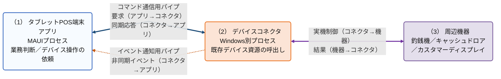
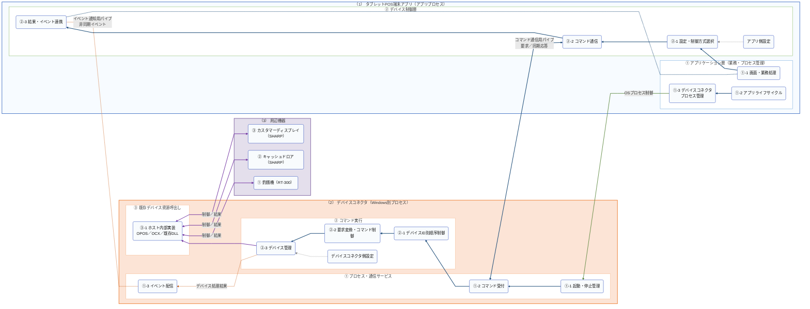

# ARCH-HOST-01 タブレットPOS デバイスコネクタ基本設計書

タブレットPOS
ARCH-HOST-01 デバイスコネクタ基本設計書
文書ID: ARCH-HOST-01
第0.3.3版
2026年7月14日

## 00_表紙

本書の文書情報、目的、およびレビュー対象を示す。

| 項目 | 内容 |
|---|---|
| 文書ID | ARCH-HOST-01 |
| 文書名 | タブレットPOS デバイスコネクタ基本設計書 |
| 対象 | デバイスコネクタ、およびタブレットPOS端末アプリとのプロセス間連携 |
| 版数 | 0.3.3 |
| 作成日 | 2026/07/07 |
| 作成者 | VTI サム |
| レビュー担当 | SMJ 鎌田 |
| 承認者 | - |
| 目的 | タブレットPOS端末アプリから直接利用できない既存のOPOS、OCX、ActiveX、および既存DLLを別プロセスで利用するため、デバイスコネクタの役割、機能、インターフェース、設定、エラー処理、およびログを基本設計として定義する。 |
| 期待成果 | タブレットPOS端末アプリとデバイスコネクタを分ける理由、両プロセスの責務境界、通信契約、および運用時の処理を一貫した設計としてレビューできる状態にする。 |
| 想定形式 | 目次から各設計シートを確認できる構成とする。 |

## 01_改訂履歴

本書の版数と主な変更内容を示す。

| 版数 | 日付 | 変更内容 | 作成者 | 承認者 |
|---|---|---|---|---|
| 0.3.3 | 2026/07/14 | MAUIアプリと既存のOPOS、OCX、ActiveX、および既存DLLの実行環境差異を別プロセス化の理由として明確化。デバイスコネクタの実行形態、将来機器の対応方針、および名称を整理し、旧通信方式に関する記載を削除。 | VTI サム | - |
| 0.3.2 | 2026/07/13 | 補足コメントの色指定と透過率の記載を分離し、淡い黄色の背景、黄土色の枠線、および濃い灰色の文字で表示する規約を明確化。 | VTI サム | - |
| 0.3.1 | 2026/07/13 | 図の関係について、矢印の向きと色・線種の役割を分離し、主処理、コマンド通信、実機制御、非同期イベント、設定参照、および異常経路の表示規約を明確化。 | VTI サム | - |
| 0.3.0 | 2026/07/12 | システム全体、責務グループ、構成要素、機能の順に理解できる構成へ再設計。3つの図と本文の役割を整理し、重複していた処理説明を各設計章へ集約。 | VTI サム | - |
| 0.2.29 | 2026/07/11 | 対象デバイスを対象範囲へ統合し、単独のデバイス別設計を廃止。機能詳細の手順表示と各一覧の番号付けを整理。 | VTI サム | - |
| 0.2.28 | 2026/07/11 | 通常運用フローと重複していたライフサイクル設計を統合し、管理責務および保守・デバッグ時の扱いを通常運用説明へ集約。 | VTI サム | - |
| 0.2.27 | 2026/07/11 | 理解しにくい構成要素だけに表示する補足コメントの表示規約を汎用へ追加。 | VTI サム | - |
| 0.2.26 | 2026/07/11 | デバイス操作要求処理とライフサイクルを通常運用フローへ統合し、起動・操作・終了および主要異常経路を1図で確認できる構成へ変更。 | VTI サム | - |
| 0.2.25 | 2026/07/11 | 通信再試行、再送禁止、イベント再接続、異常種別、および稼働確認の時間条件を各処理図へ反映。 | VTI サム | - |
| 0.2.24 | 2026/07/11 | プロセス起動準備確認、所有プロセスの停止、非同期イベント受信、通信再試行、設定読込、エラー処理、およびログを設計方針として確定。全体構成とライフサイクルを更新。 | VTI サム | - |
| 0.2.23 | 2026/07/11 | 同期応答経路とプロセス終了確認を明確化し、デバイス操作失敗と通信失敗を分離。通常の停止制御と対象外デバイス記載をエラー一覧から整理。 | VTI サム | - |
| 0.2.21 | 2026/07/10 | 全体構成を、3つの責務領域と主経路を示す全体概要図、および詳細構成図の2段構成へ変更。 | VTI サム | - |
| 0.2.16 | 2026/07/10 | 本文と図の論理名称を日本語へ統一し、物理識別子の記載箇所を整理。 | VTI サム | - |
| 0.2.8 | 2026/07/08 | デバイスコネクタの基本設計書として新規作成。 | VTI サム | - |

## 目次

本書の各設計項目と対応するシートを示す。

| No | 資料名称 | 備考 | No | 資料名称 | 備考 |
|---|---|---|---|---|---|
| 1 | 表紙 | 00_表紙 | 8 | 運用シナリオ図 | 06_運用シナリオ_01 |
| 2 | 改訂履歴 | 01_改訂履歴 | 9 | 運用シナリオ説明 | 06_運用シナリオ_02 |
| 3 | 概要 | 02_概要 | 10 | 機能設計 | 07_機能設計 |
| 4 | 対象範囲 | 03_対象範囲 | 11 | 通信・データ設計 | 08_通信・データ設計 |
| 5 | 関連資料 | 04_関連資料 | 12 | 設定・デバイス設計 | 09_設定・デバイス設計 |
| 6 | システム・論理構成図 | 05_全体構成_01 | 13 | 異常・運用設計 | 10_異常・運用設計 |
| 7 | 責務階層・構成要素 | 05_全体構成_02 | 14 | 実装対応 | 11_実装対応 |

## 02_概要

デバイスコネクタを設ける目的、システム内での位置付け、および基本となる設計原則を示す。

### 2.1 設計目的と結論

タブレットPOS端末アプリは.NET MAUIで動作するため、既存デバイスが使用するOPOS、OCX、ActiveX、および既存DLLをアプリプロセス内で直接実行しない。これらの既存デバイス資源を必要なWindows実行環境内で継続利用するため、デバイスコネクタをタブレットPOS端末アプリとは別プロセスとして配置する。

アプリケーション層は業務上必要なデバイス操作をデバイス制御層へ依頼する。デバイス制御層は要求と結果をアプリ内の形式へ変換し、名前付きパイプを介してデバイスコネクタと通信する。デバイスコネクタは要求順序の保証、対象デバイスの選択、既存デバイス資源の呼出し、および非同期イベント配信を担当する。この境界により、アプリケーション層はOPOS、OCX、ActiveX、既存DLL、またはデバイスコネクタ内部実装を直接呼び出さない。

デバイスコネクタは、現行POSで使用している既存デバイスを継続利用するための互換境界とする。今後追加する機器は、既存デバイス資源を必要とする場合を除き、端末アプリから直接制御する。

### 2.2 システム内の位置付け

| 責務領域 | 担当する内容 | 担当しない内容 |
|---|---|---|
| タブレットPOS端末アプリ | 画面・業務判断、デバイス操作の依頼、処理結果の利用、デバイスコネクタプロセスの起動・停止管理。 | OPOS、OCX、ActiveX、既存DLL、およびデバイスコネクタ内部処理の直接呼出し。 |
| デバイスコネクタ | プロセス間通信、要求順序制御、コマンド処理、デバイス管理、既存デバイス資源の呼出し、実機制御、非同期イベント配信。通常時は画面を表示せず、バックグラウンドで動作する。 | 業務画面の表示、業務継続可否、ユーザー向けメッセージの決定。デバッグ用画面は保守・デバッグ時だけ表示する。 |
| 周辺機器 | 釣銭、ドロア開放、カスタマーディスプレイ表示などの実処理。 | アプリケーション層との直接通信。 |

### 2.3 基本設計原則

| No. | 原則 | 設計内容 |
|---|---|---|
| ① | 既存デバイス互換 | MAUIアプリから直接利用しないOPOS、OCX、ActiveX、および既存DLLをデバイスコネクタ内部へ閉じ込める。 |
| ② | 責務分離 | 業務判断、通信制御、実機制御を分離し、各責務を越えた直接呼出しを行わない。 |
| ③ | 通信分離 | コマンド要求と同期応答はコマンド通信用パイプ、デバイス処理結果通知はイベント通知用パイプで扱う。 |
| ④ | 順序保証 | 同一デバイスIDの要求は投入順に処理し、異なるデバイスIDの要求は互いに処理を妨げない。 |
| ⑤ | 二重実行防止 | 通信接続の再試行は要求送信前に限定し、送信後に結果を確定できない場合も同一要求を自動再送しない。 |
| ⑥ | 安全なライフサイクル | アプリケーション層は自ら起動したデバイスコネクタだけを停止対象とし、非所有プロセスを停止しない。 |
| ⑦ | 設定責務の分離 | アプリ側設定は使用する制御方式、デバイスコネクタ側設定は起動するホスト内部実装を決定する。 |

### 2.4 本書の読み方

本書は、対象範囲から実装対応までを次の順序で確認する。各章は、前の章で定義した内容を次の観点へ具体化する。

① 03_対象範囲では、設計対象となる責務、対象デバイス、および対象外を確認する。

② 05_全体構成では、対象範囲を担う責務領域、責務グループ、および論理構成要素の関係を確認する。

③ 06_運用シナリオでは、各構成要素が起動、デバイス操作、非同期イベント、および終了でどのように連携するかを確認する。

④ 07_機能設計では、全体構成の責務と運用シナリオを実現する機能、および各機能の正常時・異常時の扱いを確認する。

⑤ 08_通信・データ設計と09_設定・デバイス設計では、機能を実行するための通信契約、データ項目、設定責務、およびデバイス対応を確認する。

⑥ 10_異常・運用設計では、各処理で発生する異常の分類、復旧方法、およびログ出力を確認する。

⑦ 11_実装対応では、論理構成要素と機能が実装上のクラスおよび関連仕様へどのように対応するかを確認する。

レビューでは、対象範囲、責務、運用シナリオ、機能、通信・設定、異常時の扱い、および実装対応が一つの流れとして矛盾していないことを確認する。

### 2.5 レビュー判断

責務境界、運用シナリオ、通信契約、設定責務、異常時の継続・停止条件、および実装対応が相互に矛盾していないことを確認し、デバイスコネクタ基本設計としての妥当性を判断する。

## 03_対象範囲

設計対象となる責務、対象デバイス、および他資料で扱う範囲を示す。

### 3.1 対象

① タブレットPOS端末アプリとデバイスコネクタの責務境界、および両プロセス間の通信契約。

② デバイスコネクタプロセスの起動、稼働確認、通常停止、終了監視、および所有プロセスの強制終了。

③ デバイス操作要求の受付、デバイスID単位の順序制御、実機制御、同期応答、および非同期イベント通知。

④ アプリ側とデバイスコネクタ側の設定責務、対象デバイスの起動条件、およびデバイスID対応。

⑤ 起動、通信、デバイス操作、イベント通知、および停止で発生する異常の分類、復旧方針、ログ出力。

⑥ 既存デバイス資源を一つのデバイスコネクタプロセスで管理し、通常時はバックグラウンドで動作させる実行形態。

### 3.2 対象デバイス

初期対象は、RT-300釣銭機、SHARPキャッシュドロア、SHARPカスタマーディスプレイの3種類とする。アプリ側設定とデバイスコネクタ側設定は、次のデバイスIDで対応付ける。

#### 3.2.1 デバイスID対応

| アプリ側有効デバイス区分 | アプリ側設定ID | デバイスコネクタ要求のデバイスID（DeviceId） | デバイスコネクタ側設定例 |
|---|---|---|---|
| local_cashchanger | cash_changer_glory_rt300_windows | 釣銭機（CashChanger） | CashChanger / CashChanger1 |
| local_drawer | drawer_external_windows | キャッシュドロア（CashDrawer） | CashDrawer / CashDrawer1 |
| local_display | customer_display_sharp_windows | カスタマーディスプレイ（CustomerDisplay） | CustomerDisplay / LineDisplay1 |

### 3.3 対象外

① 画面項目、画面遷移、ユーザー向け文言、および業務継続可否の判断は、アプリ側設計で扱う。

② デバイス制御内部の直接制御方式は対象外とし、デバイスコネクタ経由で既存デバイス資源を利用する範囲を対象とする。

③ 個別クラスのprivateメソッド、内部変数、および実装上の詳細分岐は、プログラム仕様書で扱う。

④ OPOS設定、ドライバー導入、および店舗での実機設定は、運用手順書または導入手順書で扱う。

⑤ プリンター、スキャナー、決済端末などの将来追加機器は初期対象に含めない。設定ファイルに候補として保持する場合も、Windows向けの有効デバイスには選択しない。

### 3.4 将来機器の対応方針

今後追加する機器は、既存のOPOS、OCX、ActiveX、または既存DLLを利用する必要がある場合を除き、iPadと同様に端末アプリから直接制御する。デバイスコネクタは、現行POSで使用している既存デバイスを継続利用する場合に限定して使用する。

デバイスコネクタ経由で制御する既存デバイスの使用が終了した後は、デバイスコネクタを不要な資材として整理できる構成とする。

## 04_関連資料

本書の前提となる構造設計、設定要領、およびプログラム仕様を示す。

| 文書ID | 文書名 | 本書との関係 |
|---|---|---|
| ARCH-01 | タブレットPOS ソフトウェア構造設計書 | タブレットPOS全体構造の前提資料。 |
| ARCH-02 | タブレットPOS 端末アプリケーション構造設計書 | 端末アプリ側の構造の前提資料。 |
| ARCH-03 | タブレットPOS デバイスコネクタ構造設計書 | デバイスコネクタの構造、責務、主要コンポーネントの前提資料。 |
| CFG-01 | タブレットPOS デバイス制御設定ファイル記載要領 | device_controller_config.jsonとhost_device_config.jsonの記載要領。 |
| PS-HOST-01 | 名前付きパイプコマンドサーバー | コマンド受信部のプログラム仕様。 |
| PS-HOST-02 | 名前付きパイプデバイスホストアダプター | デバイスコネクタ通信アダプターのプログラム仕様。 |
| PS-HOST-03 | デバイスコマンドルーター | デバイスID単位の順序制御のプログラム仕様。 |
| PS-HOST-04 | デバイスコマンドハンドラー | デバイスコネクタ制御要求とデバイス操作要求の振り分け仕様。 |
| PS-HOST-05 | デバイスサーバーホスト | デバイスコネクタ本体の起動、停止、通信管理の仕様。 |
| PS-HOST-06 | デバイスマネージャー | デバイス生成、保持、検索、停止の仕様。 |
| PS-HOST-07 | デバイスベース | デバイス共通基底処理の仕様。 |
| PS-HOST-08 | 釣銭機制御 RT-300 | RT-300釣銭機のプログラム仕様。 |
| PS-HOST-10 | キャッシュドロア制御 SHARP | SHARPキャッシュドロアのプログラム仕様。 |
| PS-HOST-11 | カスタマーディスプレイ制御 SHARP | SHARPカスタマーディスプレイのプログラム仕様。 |

## 05_全体構成_01

システム全体の境界と、各責務領域を構成する論理要素を二段階の図で示す。

### 5.1 全体構成

#### 汎用

本項の表示ルールは、本書に掲載するすべての図へ共通で適用する。

矢印の向きは関係の方向を示し、色と線種は関係の意味を示す。要求と同期応答、または実機制御と結果を1つの通信経路で送受信する関係のみを双方向で示し、その他の処理順、制御、通知、参照、および異常分岐は一方向で示す。

| 表示 | 色 | 意味 |
|---|---|---|
| （1）タブレットPOS端末アプリ | #F7FBFF | アプリケーション層とデバイス制御を含むアプリプロセスの責務境界を示す。 |
| （2）デバイスコネクタ | #FCE4D6 | OPOS、OCX、ActiveX、および既存DLLを利用する既存デバイス制御を担当するWindows別プロセスを示す。 |
| （3）周辺機器 | #E4DFEC | デバイスコネクタから制御される実機を示す。 |
| 責務グループ | #FFFFFF | 同じ目的を持つ論理構成要素のまとまりを示す。 |
| 角丸ブロック | #F8FBFD | 論理構成要素、処理、または対象デバイスを示す。 |
| ◇ | #FFF2CC | 次の処理を決める判定を示す。 |
| 補足コメント（吹き出し・半透明） | #FFF2CC | 70%透過の吹き出しで対象要素を指し示し、図だけでは判断しにくい設計意図、運用条件、または制約を補足する。 |
| 異常処理 | #F4CCCC | 起動中止、通信失敗、または強制終了などの主要な異常結果を示す。 |
| 運用フェーズ | #FFFFFF | 起動、デバイス操作、および終了の区切りを示す。 |
| ━━▶ 主処理 | #1F4E79 | 通常の処理順または一方向の要求を示す。 |
| ◀━━▶ コマンド通信 | #1F4E79 | アプリからの要求とデバイスコネクタからの同期応答を同じ通信経路で送受信する関係を示す。 |
| ━━▶ ライフサイクル | #548235 | プロセスの起動、停止、および終了監視を示す。 |
| ◀━━▶ 実機制御 | #7030A0 | デバイスコネクタと周辺機器間の制御と結果を示す。 |
| ┄┄▶ 非同期イベント | #C65911 | 同期応答とは別に通知されるデバイス処理結果を示す。 |
| ┈┈▶ 設定参照 | #7F7F7F | 設定情報を参照する関係を示す。 |
| ┄┄▶ 異常経路 | #C00000 | 通常経路から異常結果または復旧処理へ分岐する経路を示す。 |

#### 5.1.1 システムコンテキスト図



#### 5.1.2 論理構成図



#### 図の補足

- システムコンテキスト図は、3つの責務領域、プロセス境界、および領域間の通信だけを示す。
- 論理構成図は、各責務領域を責務グループと論理構成要素へ分解する。番号は5.3と対応する。
- タブレットPOS端末アプリはMAUIプロセス、デバイスコネクタは既存デバイス資源を利用するWindows別プロセスとして、同一Windows端末上で動作する。要求、応答、およびイベント通知には名前付きパイプを使用する。
- アプリケーション層はOPOS、OCX、ActiveX、既存DLL、またはデバイスコネクタ内部実装を直接呼び出さない。デバイス操作はデバイス制御層を経由し、プロセスの起動・停止はデバイスコネクタプロセス管理が担当する。
- デバイスコネクタ側のホスト内部実装は、アプリ側のストラテジークラスではなく、既存デバイス資源を呼び出すための内部構成要素である。
- 再試行、タイムアウト、所有プロセス、および異常分岐は静的構成ではなく、06_運用シナリオで示す。

## 05_全体構成_02

全体構成図に示す責務領域、責務グループ、および論理構成要素の関係を説明する。

### 5.2 構成の階層

| 区分 | 表現 | 説明 |
|---|---|---|
| 責務領域 | （1）〜（3） | システムを構成する責務の範囲とプロセス境界。 |
| 責務グループ | ①〜③ | 責務領域の中で同じ目的を持つ機能のまとまり。 |
| 論理構成要素 | ①-1、①-2など | 処理またはデータの受け渡しを担当する構成要素。 |

### 5.3 責務領域と構成要素

（1）タブレットPOS端末アプリは、業務判断とデバイス利用を担当し、デバイスコネクタ内部の実機制御を直接扱わない。

  ① アプリケーション層（業務・プロセス管理）は、業務上のデバイス利用とデバイスコネクタプロセスのライフサイクルを管理する。

    ①-1 画面・業務処理は、必要なデバイス操作を依頼し、同期結果または非同期イベントを業務処理へ反映する。
      関連シート: 06_運用シナリオ_02、07_機能設計
    ①-2 アプリライフサイクルは、アプリの起動、再開、停止、および破棄をプロセス管理へ通知する。
      関連シート: 06_運用シナリオ_02
    ①-3 デバイスコネクタプロセス管理は、存在確認、起動、稼働確認、停止要求、および所有プロセスの終了監視を行う。
      関連シート: 06_運用シナリオ_02、07_機能設計、10_異常・運用設計

  ② デバイス制御層は、アプリ内の要求をプロセス間通信へ変換し、結果をアプリケーション層へ戻す。

    ②-1 設定・制御方式選択は、読み込み済み設定から有効デバイスとデバイスコネクタ経由の制御方式を選択する。
      関連シート: 07_機能設計、09_設定・デバイス設計
    ②-2 コマンド通信は、要求を生成し、コマンド通信用パイプで送信して同期応答を受信する。
      関連シート: 07_機能設計、08_通信・データ設計
    ②-3 結果・イベント連携は、同期応答と非同期イベントをアプリ内の結果形式へ変換して通知する。
      関連シート: 07_機能設計、08_通信・データ設計、10_異常・運用設計

（2）デバイスコネクタは、MAUIアプリから直接利用しない既存デバイス資源をWindows別プロセス内に保持し、要求制御と実機制御を担当する。

  ① プロセス・通信サービスは、デバイスコネクタの稼働状態と二つの名前付きパイプを管理する。

    ①-1 起動・停止管理は、通信サービスとデバイス管理を開始・停止し、稼働状態を管理する。
      関連シート: 06_運用シナリオ_02、07_機能設計、10_異常・運用設計
    ①-2 コマンド受付は、一接続につき一要求を受け付け、同じ接続で同期応答を返す。
      関連シート: 07_機能設計、08_通信・データ設計
    ①-3 イベント配信は、デバイス処理結果をイベント通知用パイプの接続先へ送信する。
      関連シート: 07_機能設計、08_通信・データ設計

  ② コマンド実行は、受信した要求を順序制御し、対象デバイスの実行結果を応答へ変換する。

    ②-1 デバイスID別順序制御は、同一デバイスIDの要求を投入順に処理する。
      関連シート: 06_運用シナリオ_02、07_機能設計
    ②-2 要求変換・コマンド制御は、通信形式を内部要求へ変換し、制御要求またはデバイス操作要求として実行する。
      関連シート: 07_機能設計、08_通信・データ設計、10_異常・運用設計
    ②-3 デバイス管理は、設定に基づくデバイス生成、保持、検索、実行、および停止を管理する。
      関連シート: 07_機能設計、09_設定・デバイス設計、10_異常・運用設計

  ③ 既存デバイス資源呼出しは、既存デバイス資源の差異をデバイスコネクタ内部へ閉じ込める。アプリ側のストラテジークラスではなく、既存デバイスを呼び出すためのホスト内部実装として扱う。

    ③-1 ホスト内部実装は、OPOS、OCX、ActiveX、既存DLL、共有メモリ、要求／応答ファイルなどを利用して実機を制御する。
      関連シート: 09_設定・デバイス設計、11_実装対応

（3）周辺機器は、デバイスコネクタのホスト内部実装から制御される店舗設備である。

  ① 釣銭機（RT-300）は、入金、払出、状態確認、およびエラー確認を行う。
    関連シート: 03_対象範囲、09_設定・デバイス設計
  ② キャッシュドロア（SHARP）は、ドロア開放を行う。
    関連シート: 03_対象範囲、09_設定・デバイス設計
  ③ カスタマーディスプレイ（SHARP）は、表示、消去、スクロール、および位置指定表示を行う。
    関連シート: 03_対象範囲、09_設定・デバイス設計

### 5.4 デバイスコネクタの実行形態

現行版では、釣銭機、キャッシュドロア、およびカスタマーディスプレイの既存デバイス資源を一つのデバイスコネクタプロセスで管理する。

通常運用時は画面を表示せず、バックグラウンドで動作する。デバイスコネクタを直接開始・停止する画面は、デバッグ引数（DEBUG）付きで起動した場合だけ表示する。

## 06_運用シナリオ_01

静的な構成要素が、起動、デバイス操作、非同期イベント、および終了時にどのように連携するかを示す。

### 6.1 運用シナリオ図

```mermaid
%%{init: {"flowchart": {"defaultRenderer": "dagre", "curve": "linear", "nodeSpacing": 30, "rankSpacing": 58}}}%%
flowchart LR
    subgraph START["起動フェーズ"]
        direction TB
        S1("① アプリ起動")
        S2("② 設定を準備<br/>運用設定 → 初期設定")
        S3("③ デバイスコネクタと<br/>通信・デバイスを準備")
        S4{"④ 起動準備が<br/>完了したか"}
        S5("運用開始")
        START_ERROR("起動を中止して<br/>異常を記録")

        S1 --> S2 --> S3 --> S4
        S4 -->|はい| S5
        S4 -.->|いいえ| START_ERROR
    end

    subgraph OPERATION["デバイス操作フェーズ"]
        direction TB
        O1("① デバイス操作を依頼")
        O2("② 接続を確認して<br/>コマンド要求を送信")
        O3("③ 順序制御して<br/>対象デバイスを制御")
        O4{"④ 同期結果を<br/>確定できたか"}
        O5("正常応答または<br/>失敗応答を返却")
        COMM_ERROR("通信失敗を返却<br/>送信後は自動再送なし")
        O6{"運用を継続するか"}
        EVENT("非同期イベントを<br/>アプリへ通知")

        O1 --> O2 --> O3 --> O4
        O4 -->|はい| O5 --> O6
        O4 -.->|いいえ| COMM_ERROR --> O6
        O6 -->|はい| O1
        O3 -.->|デバイス処理結果| EVENT
    end

    subgraph STOP["終了フェーズ"]
        direction TB
        T1("① アプリ停止・破棄")
        T2{"② 所有プロセスか"}
        T3("③ 停止要求を送信して<br/>終了を監視")
        T4{"④ 10秒以内に<br/>終了したか"}
        T5("所有プロセスツリーを<br/>強制終了")
        T6("終了処理完了")

        T1 --> T2
        T2 -->|いいえ| T6
        T2 -->|はい| T3
        T3 --> T4
        T4 -->|はい| T6
        T4 -.->|いいえ| T5 --> T6
    end

    S5 --> O1
    O6 -->|いいえ| T1

    classDef app fill:#DDEBF7,stroke:#5B9BD5,color:#111111
    classDef control fill:#E2F0D9,stroke:#70AD47,color:#111111
    classDef host fill:#FCE4D6,stroke:#ED7D31,color:#111111
    classDef decision fill:#FFF2CC,stroke:#BF9000,color:#111111
    classDef error fill:#F4CCCC,stroke:#C00000,color:#111111
    class S1,S2,S3,S5,T1,T2,T3,T4,T6 app
    class O1,O2,O4,O5,O6 control
    class O3,EVENT host
    class S4,O4,O6,T2,T4 decision
    class START_ERROR,COMM_ERROR,T5 error
    style START fill:#FFFFFF,stroke:#4472C4,stroke-width:2px
    style OPERATION fill:#FFFFFF,stroke:#4472C4,stroke-width:2px
    style STOP fill:#FFFFFF,stroke:#4472C4,stroke-width:2px
    linkStyle default stroke:#1F4E79,stroke-width:2px
    linkStyle 4,10,11,19,20 stroke:#C00000,stroke-width:1.8px
    linkStyle 13 stroke:#C65911,stroke-width:1.8px
    linkStyle 0,1,2,3,5,6,7,8,9,12,14,15,16,17,18,21,22 stroke:#548235,stroke-width:1.8px
```



#### 図の補足

- 起動フェーズは、設定、デバイスコネクタプロセス、通信、およびデバイスを順に準備する。運用設定を使用できない場合だけ初期設定へ切り替え、起動準備が完了しない場合は運用を開始しない。
- デバイス開始は50ミリ秒間隔で最大3回試行する。最終失敗したデバイスだけを起動済み一覧から除外し、他のデバイスで起動処理を継続する。
- 稼働確認は最大10秒、500ミリ秒間隔で行う。実行ファイル、必須設定、プロセス起動、または稼働確認に失敗した場合は運用を開始しない。
- コマンド接続は要求送信前に限り500ミリ秒間隔で最大3回試行する。送信後に同期結果を確定できない場合は、二重実行防止のため同一要求を自動再送しない。
- 失敗応答はデバイスコネクタが異常結果を返せた状態、通信失敗は同期応答を確定できない状態を示す。アプリケーション層は両者を区別する。
- 非同期イベントは同期応答を変更しない。イベント通知用パイプが切断された場合は1秒間隔で再接続する。
- 終了フェーズは所有プロセスだけを対象とする。停止要求に失敗しても最大10秒の終了監視を継続し、終了しない場合は所有プロセスツリーを強制終了する。

## 06_運用シナリオ_02

運用シナリオをフェーズ単位に分け、各フェーズの開始条件、完了条件、および担当機能を説明する。

### 6.2 運用シナリオ

#### 6.2.1 シナリオ構成

| フェーズ | 開始条件 | 完了条件 | 主な責務 |
|---|---|---|---|
| 起動 | アプリを起動または再開する。 | 使用可能な設定、デバイスコネクタプロセス、およびデバイス管理の準備を確認する。 | アプリ設定管理、デバイスコネクタプロセス管理、デバイスコネクタ起動・停止管理。 |
| デバイス操作 | アプリケーション層がデバイス操作を依頼する。 | 同期応答または通信失敗をアプリケーション層へ返す。 | デバイス制御層、コマンド受付、順序制御、コマンド実行、デバイス管理。 |
| 非同期イベント | デバイス処理結果通知が発生する。 | イベントをアプリケーション層の購読処理へ通知する。 | ホスト内部実装、デバイス管理、イベント配信、結果・イベント連携。 |
| 終了 | アプリを停止または破棄する。 | 所有プロセスの終了確認または強制終了を完了する。 | デバイスコネクタプロセス管理、デバイスコネクタ起動・停止管理。 |

#### 6.2.2 起動

① アプリ起動時にdevice_controller_config.jsonの運用設定を読み込む。使用できない場合は警告を記録して初期設定へ切り替え、初期設定も使用できない場合はアプリ起動を中止する。再開時は読み込み済み設定を使用する。

② デバイスコネクタプロセス管理は同名プロセスの存在を確認する。未起動の場合だけデバイスコネクタ起動プログラムをWindows別プロセスとして起動し、所有プロセスとして保持する。通常時は画面を表示せず、バックグラウンドで動作させる。

③ デバイスコネクタはイベント通知、コマンド受付、デバイス管理を開始する。host_device_config.jsonの必須設定を使用できない場合はプロセスを終了する。

④ デバイス管理は対象デバイスを生成し、50ミリ秒間隔で最大3回開始を試行する。最終失敗したデバイスは登録せず、他のデバイスで開始を継続する。

⑤ デバイスコネクタプロセス管理は、500ミリ秒間隔で稼働確認要求を送信し、10秒以内に準備完了を確認する。

⑥ 準備完了を確認できた場合だけデバイス操作を開始する。実行ファイル、プロセス起動、必須設定、または稼働確認の失敗は起動失敗として扱う。

関連機能: F-HOST-001、F-HOST-002、F-HOST-003、F-HOST-004、F-HOST-007、F-HOST-009

#### 6.2.3 デバイス操作

① アプリケーション層はデバイス操作をデバイス制御層へ依頼する。

② 設定・制御方式選択は、読み込み済み設定から有効デバイスとデバイスコネクタ経由の制御方式を選択し、コマンド要求を生成する。

③ コマンド通信は、要求送信前の接続に失敗した場合だけ500ミリ秒間隔で最大3回接続を試行する。接続後はJSON要求を一行で送信する。

④ デバイスコネクタは要求を受け付け、同一デバイスIDの要求を投入順に処理する。要求を内部形式へ変換し、対象デバイスを検索してホスト内部実装へ処理を渡す。

⑤ ホスト内部実装の結果は、要求と同じコマンド通信用パイプ接続で同期応答として返す。入力不備、未登録デバイス、またはデバイス処理失敗を判定できた場合は失敗応答を返す。

⑥ 要求送信後に接続が切れ、同期応答を確定できない場合は通信失敗として返す。同一要求は自動再送せず、業務継続可否はアプリケーション層が判断する。

関連機能: F-HOST-003、F-HOST-005、F-HOST-006、F-HOST-008、F-HOST-009、F-HOST-010

#### 6.2.4 非同期イベント

① ホスト内部実装でデバイス処理結果通知が発生した場合、デバイス管理は通知データをイベント配信へ渡す。

② イベント配信はイベント通知用パイプを通じてデバイス制御層へ通知する。結果・イベント連携はイベントJSONをアプリ内形式へ変換し、アプリケーション層の購読処理へ通知する。

③ イベント通知用パイプが切断された場合は1秒間隔で再接続する。イベント通信異常は同期応答を変更しない。

関連機能: F-HOST-004

#### 6.2.5 終了

① アプリ停止または破棄時に、デバイスコネクタプロセス管理は対象が所有プロセスか確認する。非所有プロセスは停止しない。

② 所有プロセスにはコマンド通信用パイプでデバイスコネクタ停止要求を送信する。接続失敗または応答タイムアウトの場合も終了監視を継続する。

③ デバイスコネクタは受付応答を書き込み、500ミリ秒後にコマンド受付、順序制御、イベント配信、およびデバイス管理を停止する。

④ デバイスコネクタプロセス管理は所有プロセスの終了を最大10秒待つ。

⑤ 10秒以内に終了しない場合だけ所有プロセスツリーを強制終了し、強制終了を記録する。

関連機能: F-HOST-003、F-HOST-004、F-HOST-007、F-HOST-009、F-HOST-011

#### 6.2.6 保守・デバッグ

通常運用時は画面を表示せず、デバイスコネクタをバックグラウンドで動作させる。デバッグ引数（DEBUG）付きで起動した場合だけ、デバイスコネクタを直接開始・停止する画面を表示する。保守用停止要求送信ツールはアプリとは独立してデバイスコネクタ停止要求を送信し、デバイスコネクタ再起動要求は保守操作に限定する。これらの操作は通常の店舗運用シナリオに含めない。

## 07_機能設計

05_全体構成で定義した責務を、06_運用シナリオで実行する機能へ分解する。機能IDは処理順ではなく、変更時にも追跡できる安定した機能単位を示す。

### 7.1 機能構成

| No. | 機能領域 | 対応シナリオ | 主な構成要素 | 機能ID |
|---|---|---|---|---|
| 1 | プロセスライフサイクル | 起動、終了 | （1）①-3 デバイスコネクタプロセス管理、（2）①-1 起動・停止管理 | F-HOST-001、F-HOST-002、F-HOST-011 |
| 2 | コマンド通信 | デバイス操作 | （1）②-2 コマンド通信、（1）②-3 結果・イベント連携、（2）①-2 コマンド受付 | F-HOST-003、F-HOST-005、F-HOST-010 |
| 3 | コマンド・デバイス実行 | 起動、デバイス操作、終了 | （2）② コマンド実行、（2）③ 既存デバイス資源呼出し | F-HOST-006、F-HOST-007、F-HOST-008、F-HOST-009 |
| 4 | 非同期通知 | 非同期イベント | （2）①-3 イベント配信、（1）②-3 結果・イベント連携 | F-HOST-004 |

（1）②-1 設定・制御方式選択は、各機能を実行する前提条件として09_設定・デバイス設計で定義する。独立したF-HOST機能IDは付与しない。

### 7.2 プロセスライフサイクル機能

| 機能ID | 機能名 | 責務 | 入力／出力 | 正常時 | 異常時 | 主な構成要素 |
|---|---|---|---|---|---|---|
| F-HOST-001 | デバイスコネクタ稼働確認 | デバイスコネクタの通信とデバイス管理が使用可能か確認する。 | 入力: アプリライフサイクル、プロセス状態／出力: 稼働確認結果 | 500ミリ秒間隔、最大10秒で準備完了を確認する。 | 10秒以内に確認できない場合は起動失敗とする。 | （1）①-3、（2）①-1、（2）①-2 |
| F-HOST-002 | デバイスコネクタプロセス起動 | 未起動時だけデバイスコネクタを別プロセスとして起動する。 | 入力: 起動要否、実行ファイル／出力: 所有プロセス情報 | 同名プロセスがない場合だけ非表示で起動する。 | 実行ファイル未検出または起動例外時は運用を開始しない。 | （1）①-3 |
| F-HOST-011 | デバイスコネクタプロセス停止 | 所有プロセスだけを安全に停止する。 | 入力: アプリライフサイクル、所有情報／出力: 終了状態 | デバイスコネクタ停止要求後、最大10秒で終了を確認する。 | 非所有プロセスは停止しない。10秒以内に終了しない所有プロセスだけを強制終了する。 | （1）①-3、（2）①-1 |

### 7.3 コマンド通信機能

| 機能ID | 機能名 | 責務 | 入力／出力 | 正常時 | 異常時 | 主な構成要素 |
|---|---|---|---|---|---|---|
| F-HOST-003 | コマンド受付 | 一接続につき一要求を受け付け、同じ接続で同期応答を返す。 | 入力: JSON要求／出力: 内部要求、JSON応答 | 要求を順序制御へ渡し、処理結果を一行で返す。 | 空行、JSON形式不正は失敗応答とする。待受失敗時は200ミリ秒後に待受を再開する。 | （2）①-2 |
| F-HOST-005 | 要求・応答変換 | JSON通信形式と内部コマンド形式を相互変換する。 | 入力: JSON要求、処理結果／出力: 内部要求、JSON応答 | 項目を内部形式へ変換し、結果を応答形式へ変換する。 | 必須情報不足は失敗応答とし、応答書込失敗時は接続を終了する。 | （1）②-2、（1）②-3、（2）②-2 |
| F-HOST-010 | エラー応答 | 失敗応答と通信失敗を呼出元が区別できる形で返す。 | 入力: 入力不備、デバイス異常、通信異常／出力: 失敗応答または通信例外 | デバイスコネクタ内で確定した異常は失敗応答へ変換する。 | 要求送信後の通信失敗では同一要求を自動再送しない。 | （1）②-3、（2）①-2、（2）②-2 |

### 7.4 コマンド・デバイス実行機能

| 機能ID | 機能名 | 責務 | 入力／出力 | 正常時 | 異常時 | 主な構成要素 |
|---|---|---|---|---|---|---|
| F-HOST-006 | デバイスID単位順序制御 | 同一デバイスIDの要求順序を保証する。 | 入力: 解析済み要求、デバイスID／出力: 順序制御後の要求 | デバイスIDごとのSTAワーカーで投入順に処理する。 | 処理例外は失敗応答とする。デバイスIDなしの制御要求は共通キューで扱う。 | （2）②-1 |
| F-HOST-007 | デバイスコネクタ制御 | 稼働確認、デバイスコネクタ停止要求、保守用デバイスコネクタ再起動要求を処理する。 | 入力: デバイスコネクタ制御要求／出力: 稼働状態、受付応答、停止・再起動指示 | デバイス検索を行わず制御要求として処理する。 | 未対応要求は失敗応答とし、停止・再起動は受付応答の書込後に実行する。 | （2）①-1、（2）②-2 |
| F-HOST-008 | デバイス操作 | 対象デバイスへ使用開始、使用終了、またはメソッド実行を依頼する。 | 入力: デバイスID、メソッドID、付加データ／出力: デバイス実行結果 | 起動済みデバイスを検索し、既存デバイス資源を呼び出すホスト内部実装へ処理を渡す。 | 必須項目不足、未登録デバイス、デバイス実行失敗は失敗応答とする。 | （2）②-2、（2）②-3、（2）③-1 |
| F-HOST-009 | デバイス管理 | 設定に基づいて対象デバイスを生成、保持、検索、停止する。 | 入力: host_device_config.json／出力: 起動済みデバイス、準備状態 | デバイス開始を50ミリ秒間隔で最大3回試行する。 | 最終失敗したデバイスは登録しない。必須設定異常時はプロセスを終了する。 | （2）②-3、（2）③-1 |

### 7.5 非同期通知機能

| 機能ID | 機能名 | 責務 | 入力／出力 | 正常時 | 異常時 | 主な構成要素 |
|---|---|---|---|---|---|---|
| F-HOST-004 | イベント送受信 | デバイス処理結果を同期応答とは別にアプリケーション層へ通知する。 | 入力: デバイス処理結果通知／出力: イベントJSON、アプリ内イベント | イベント通知用パイプで送信し、アプリの購読処理へ通知する。 | 送信失敗した接続を除外する。受信側は切断時に1秒間隔で再接続し、同期応答を変更しない。 | （2）①-3、（1）②-3 |

## 08_通信・データ設計

06_運用シナリオと07_機能設計で使用するプロセス間通信について、経路、同期区分、およびデータ契約を定義する。

### 8.1 通信モデル

コマンド通信は一要求一応答の同期処理、イベント通信は同期応答から独立した非同期通知として扱う。

| No. | 区分 | 送信元 | 送信先 | パイプ名 | 要求形式 | 応答形式 | 同期区分 | 備考 |
|---|---|---|---|---|---|---|---|---|
| 1 | コマンド要求 | デバイス制御、デバイスコネクタプロセス管理部、保守用停止要求送信ツール | デバイスコネクタ | コマンド通信用パイプ（TabetPos.Host.Command） | JSON | JSON | 同期 | デバイス操作要求とデバイスコネクタ制御要求を扱う。1接続で1要求を送る。 |
| 2 | コマンド応答 | デバイスコネクタ | 要求元 | コマンド通信用パイプ（TabetPos.Host.Command） | - | JSON | 同期 | 要求と同じ接続で1行の結果を返す。 |
| 3 | イベント通知 | デバイスコネクタ | デバイス制御 / 名前付きパイプ通信 | イベント通知用パイプ（TabetPos.Host.Event） | JSON | アプリ内イベント | 非同期 | デバイス制御は切断時に1秒間隔で再接続し、受信イベントをアプリケーション層へ通知する。 |

### 8.2 コマンド要求

#### 8.2.1 コマンド要求JSON例

```json
{
  "RequestId": "00000001",
  "Message": "DeviceMethod",
  "DeviceId": "CustomerDisplay",
  "MethodId": "DisplayText",
  "Handle": "12345",
  "Payload": {
    "Data": "TOTAL 1,000",
    "Attribute": "0"
  }
}
```

デバイス制御はSystem.Text.Jsonの既定形式でプロパティ名を送信する。デバイスコネクタ側はプロパティ名の大文字・小文字を区別せずに受信する。

#### 8.2.2 コマンド要求項目

| No. | 項目名 | 型 | 必須 | 内容 | 設定例 | 備考 |
|---|---|---|---|---|---|---|
| 1 | 要求ID（RequestId） | string | 必須 | 要求を追跡するID。 | 00000001 | デバイス制御は既定でGUID形式のIDを生成する。 |
| 2 | メッセージ（Message） | string | 任意 | メッセージ種別。 | デバイスメソッド実行（DeviceMethod） | 未指定時は、デバイスメソッド実行として扱う。 |
| 3 | デバイスID（DeviceId） | string | 条件付き必須 | 対象デバイスID。 | カスタマーディスプレイ（CustomerDisplay） | デバイスコネクタ停止要求とデバイスコネクタ再起動要求では未指定可。 |
| 4 | メソッドID（MethodId） | string | 条件付き必須 | 対象メソッドID。 | 文字列表示（DisplayText） | デバイスメソッド実行では必須。 |
| 5 | ハンドル（Handle） | string | 任意 | 呼出元を識別するハンドル。 | 12345 | デバイス制御は未指定時にメインウィンドウハンドルまたはプロセスIDを設定する。デバイスコネクタ単体では未指定を0として扱う。 |
| 6 | 付加データ（Payload） | object | 任意 | 文字列キーと文字列値で構成するデバイス操作引数。 | { "Data": "TOTAL 1,000", "Attribute": "0" } | 内容はデバイスIDとメソッドIDにより変わる。 |

### 8.3 コマンド応答

#### 8.3.1 コマンド応答JSON例

```json
{
  "RequestId": "00000001",
  "Success": true,
  "ResultCode": 0,
  "Message": "",
  "Payload": {
    "ResultCode": "0",
    "ReturnValue": "0"
  }
}
```

#### 8.3.2 コマンド応答項目

| No. | 項目名 | 型 | 必須 | 内容 | 正常時 | 異常時 |
|---|---|---|---|---|---|---|
| 1 | 要求ID（RequestId） | string | 任意 | 要求ID。 | 要求から引き継ぐ。 | 要求を解析できた場合に引き継ぐ。 |
| 2 | 成功フラグ（Success） | boolean | 必須 | 処理成否。 | true | false |
| 3 | 結果コード（ResultCode） | number | 必須 | 結果コード。 | 0 | -1またはデバイス結果コード。 |
| 4 | メッセージ（Message） | string | 任意 | 処理結果または異常内容。 | 空文字または受付結果。 | 例外内容または入力不備の内容。 |
| 5 | 付加データ（Payload） | object | 任意 | 文字列キーと文字列値で構成する追加結果。 | デバイス操作では結果コード（ResultCode）、戻り値（ReturnValue）を含める。 | 入力検証エラーでは結果コード（ResultCode）、戻り値（ReturnValue）を含める。解析前エラーやデバイスコネクタ制御では空またはnullの場合がある。 |

### 8.4 イベント通知

#### 8.4.1 イベント通知JSON例

デバイス処理結果通知は、個別デバイス処理が同期応答とは別に完了結果を返す場合に生成する。イベント種別（EventType）とメッセージ（Message）には、デバイス処理結果通知（ReplyDevice）を設定する。デバイス制御は受信後、デバイスID、メソッドID、ハンドル、および関連要求IDを使ってアプリケーション層の購読処理へ通知する。

```json
{
  "EventId": "a1b2c3",
  "RelatedRequestId": null,
  "EventType": "ReplyDevice",
  "DeviceId": "CustomerDisplay",
  "MethodId": "DisplayText",
  "Handle": "12345",
  "Message": "ReplyDevice",
  "Payload": {
    "ResultCode": "0",
    "ReturnValue": "0"
  }
}
```

#### 8.4.2 イベント通知項目

| No. | 項目名 | 型 | 必須 | 内容 | 備考 |
|---|---|---|---|---|---|
| 1 | イベントID（EventId） | string | 必須 | イベント識別ID。 | デバイスコネクタ側でGUID形式のIDを生成する。 |
| 2 | イベント種別（EventType） | string | 必須 | イベント種別。 | デバイス処理結果通知（ReplyDevice）を設定する。 |
| 3 | デバイスID（DeviceId） | string | 必須 | 対象デバイスID。 | 応答元デバイスを示す。 |
| 4 | メソッドID（MethodId） | string | 任意 | 対象メソッドID。 | デバイス処理結果通知を生成したメソッドIDを設定する。 |
| 5 | ハンドル（Handle） | string | 任意 | 呼出元を識別するハンドル。 | 呼出元のハンドルを引き継ぐ。 |
| 6 | メッセージ（Message） | string | 必須 | 通知メッセージ。 | デバイス処理結果通知（ReplyDevice）を設定する。 |
| 7 | 付加データ（Payload） | object | 任意 | 文字列キーと文字列値で構成する戻りデータ。 | デバイス制御はイベントデータとしてアプリケーション層へ渡す。 |
| 8 | 関連要求ID（RelatedRequestId） | string | 任意 | 関連するコマンド要求ID。 | 要求との対応を特定できる場合は要求IDを設定する。デバイス起点で対応要求を特定できない場合はnullとする。 |

### 8.5 メッセージ定義

メッセージ識別値欄には、処理内容の日本語論理名と通信で使用する識別値を併記する。

| No. | メッセージ識別値 | 分類 | デバイスID（DeviceId） | メソッドID（MethodId） | 主な用途 | 正常時の扱い | 異常時の扱い |
|---|---|---|---|---|---|---|---|
| 1 | デバイス使用開始（DeviceUse） | デバイス操作 | 必須 | 任意 | デバイス使用開始。 | 対象デバイスの使用開始処理を呼ぶ。 | デバイスID未指定または未登録時は失敗応答。 |
| 2 | デバイス使用終了（DeviceUnUse） | デバイス操作 | 必須 | 任意 | デバイス使用終了。 | 対象デバイスの使用終了処理を呼ぶ。 | デバイスID未指定または未登録時は失敗応答。 |
| 3 | デバイス使用終了完了（DeviceUnUseComplete） | デバイス操作 | 必須 | 任意 | 使用完了後のプロセス情報削除。 | プロセス情報を削除し、使用終了処理を行う。 | 対象情報がない場合は結果コードで返す。 |
| 4 | デバイスメソッド実行（DeviceMethod） | デバイス操作 | 必須 | 必須 | デバイス固有メソッド実行。 | 対象デバイスのメソッド実行処理を呼ぶ。 | メソッドID未指定または未登録デバイス時は失敗応答。 |
| 5 | デバイスコネクタ停止要求（Kill） | デバイスコネクタ制御 | 任意 | 任意 | デバイスコネクタ停止要求。 | 停止要求受付メッセージ（Kill accepted）の書込完了後、500ミリ秒待機して停止処理へ進む。 | 停止中例外は受付応答後にデバイスコネクタ側ログへ出力する。 |
| 6 | デバイスコネクタ再起動要求／Host再起動要求（ReStart） | デバイスコネクタ制御 | 任意 | 任意 | デバイスコネクタ再起動要求。 | 再起動要求受付メッセージ（Restart accepted）の書込完了後、500ミリ秒待機して停止・再起動する。 | 再起動中例外は受付応答後にデバイスコネクタ側ログへ出力する。 |
| 7 | デバイスコネクタ稼働確認（HealthCheck） | デバイスコネクタ制御 | 任意 | 任意 | プロセス起動後の通信機能とデバイス管理の準備状態を確認する。 | 準備完了時は稼働中（Ready）を返す。 | 準備未完了時は成功フラグ（Success）=false、結果コード（ResultCode）=-1を返す。 |

## 09_設定・デバイス設計

デバイス制御層とデバイスコネクタが参照する設定の責務、および対象デバイス固有の実行条件を定義する。

### 9.1 設定責務

| 設定領域 | 決定する内容 | 読込主体 | 異常時 |
|---|---|---|---|
| アプリ側設定 | 使用デバイス、制御方式、コマンド・イベント通信用パイプ、および通信条件。 | タブレットPOS端末アプリ / デバイス制御層 | 運用設定を使用できない場合は初期設定へ切り替え、初期設定も使用できない場合はアプリ起動を中止する。 |
| デバイスコネクタ側設定 | 起動するホスト内部実装、その識別情報、および実装パラメータ。 | デバイスコネクタ / デバイス管理 | 必須設定を使用できない場合は通信受付を停止し、デバイスコネクタを異常終了する。 |

### 9.2 設定ファイル一覧

| No. | 設定ファイル | 管轄 | 用途 | 読込タイミング | 備考 |
|---|---|---|---|---|---|
| 1 | device_controller_config.json | タブレットPOS端末アプリ / デバイス制御側 | 端末で使用するデバイス候補、有効デバイス、アプリ側の制御方式、および名前付きパイプ設定を定義する。 | アプリ起動時 | アプリデータ領域の運用設定を優先する。運用設定が存在しない、または読込・解析できない場合はアプリパッケージ内の初期設定を使用する。初期設定も読込・解析できない場合はアプリ起動を中止する。 |
| 2 | host_device_config.json | デバイスコネクタ側 | デバイスコネクタが生成、保持するホスト内部実装を定義する。 | デバイスコネクタ本体開始時 | デバイスコネクタ実行フォルダを基準に読む。必須設定に異常がある場合は通信受付を終了し、プロセスを異常終了する。 |

### 9.3 設定項目

| No. | 設定ファイル | キー | 内容 | 設定例 | 必須 | 備考 |
|---|---|---|---|---|---|---|
| 1 | device_controller_config.json | appSettings.namedPipe.pipeName | デバイスコネクタ経由時のコマンド通信用パイプ名。 | コマンド通信用パイプ（TabetPos.Host.Command） | 必須 | デバイス制御からデバイスコネクタへ要求を送るために使用する。 |
| 2 | device_controller_config.json | activeDevices | OSごとにアプリ側で利用するデバイスを選択する。 | local_cashchanger、local_display、local_drawer | 必須 | デバイスコネクタ側の起動対象とは役割が違う。 |
| 3 | host_device_config.json | devices | デバイスコネクタが起動するホスト内部実装一覧。 | 配列 | 必須 | 初期対象デバイスを定義する。 |
| 4 | host_device_config.json | devices[].id | デバイスコネクタ内のデバイスID。 | カスタマーディスプレイ（CustomerDisplay） | 必須 | 要求のデバイスID（DeviceId）と対応する。 |
| 5 | host_device_config.json | devices[].name | 実行時に使用するデバイス名または論理名。 | 対象デバイス名 | 必須 | 既存実装の識別に使う。 |
| 6 | host_device_config.json | devices[].classId | デバイスコネクタ側で生成する実装識別ID。 | 対象クラス識別ID | 必須 | 実装生成の手がかりになる。 |
| 7 | host_device_config.json | devices[].visible | デバイス用フォームを表示するか。 | false | 任意 | デバッグ時や既存フォーム制約で使用する。 |
| 8 | host_device_config.json | devices[].parameters | デバイスごとの追加パラメータ文字列。 | 空文字 | 任意 | 文字列として指定する。 |
| 9 | device_controller_config.json | appSettings.namedPipe.connectionTimeoutMs | コマンド通信用パイプの接続タイムアウト。 | 5000 | 任意 | 0以下または未指定の場合は5000ミリ秒を使用する。 |
| 10 | device_controller_config.json | appSettings.namedPipe.connectionRetryCount | 要求送信前の接続試行回数。 | 3 | 任意 | 0以下または未指定の場合は3回とする。要求送信後は再送しない。 |
| 11 | device_controller_config.json | appSettings.namedPipe.connectionRetryIntervalMs | 接続再試行間隔。 | 500 | 任意 | 0以下または未指定の場合は500ミリ秒を使用する。 |
| 12 | device_controller_config.json | appSettings.namedPipe.eventPipeName | イベント通知用パイプ名。 | イベント通知用パイプ（TabetPos.Host.Event） | 必須 | デバイス処理結果通知の受信に使用する。 |
| 13 | device_controller_config.json | appSettings.namedPipe.eventReconnectIntervalMs | イベント通知用パイプの再接続間隔。 | 1000 | 任意 | 0以下または未指定の場合は1000ミリ秒を使用する。 |

### 9.4 設定ファイル対応関係

| 観点 | device_controller_config.json | host_device_config.json |
|---|---|---|
| 管轄 | アプリ / デバイス制御側 | デバイスコネクタ側 |
| 主な目的 | 端末で使用するアプリ側の制御方式を選ぶ。 | デバイスコネクタ内部で呼び出すホスト内部実装を選ぶ。 |
| 実装の位置付け | デバイス制御層のストラテジークラスを選択する。 | アプリ側のストラテジークラスではなく、既存デバイス資源を呼び出すホスト内部実装を選択する。 |
| デバイスコネクタ連携 | コマンド通信用／イベント通知用パイプ名、接続タイムアウト、および再接続条件を持つ。 | デバイスコネクタ内のホスト内部実装を持つ。 |
| 参照タイミング | アプリ起動時に読み込み、デバイス操作時は読み込み済み設定を参照する。 | デバイスコネクタ起動時。 |
| 更新方法 | 運用設定をアプリデータ領域へ保存し、デバイス制御を再初期化する。 | 配置ファイルを更新し、デバイスコネクタプロセスを再起動する。 |
| 置換関係 | デバイスコネクタ設定を置き換えない。 | アプリ設定を置き換えない。 |

### 9.5 デバイス別設計

| No. | デバイス名 | 主な担当 | 主な処理 | 起動条件 | 終了条件 | 主な制約 | 備考 |
|---:|---|---|---|---|---|---|---|
| 1 | RT-300釣銭機 | 釣銭機制御部 | 入金、払出、状態確認、エラー確認。 | host_device_config.jsonに釣銭機（CashChanger） / CashChanger1として定義されている。 | デバイスコネクタ停止時またはデバイス停止処理時。 | デバイスコネクタ内OPOS、OCX、UIスレッド、共有メモリ、要求/応答ファイル連携。 | デバイス開始は最大3回試行する。同期応答とデバイス処理結果通知を分けて扱う。 |
| 2 | SHARPキャッシュドロア | キャッシュドロア制御部 | ドロアオープン。 | host_device_config.jsonにキャッシュドロア（CashDrawer） / CashDrawer1として定義されている。 | デバイスコネクタ停止時またはデバイス停止処理時。 | デバイスコネクタ内SHARP既存実装、OCXを保持する非表示フォーム。 | 結果コードと拡張結果コードを返す。 |
| 3 | SHARPカスタマーディスプレイ | カスタマーディスプレイ制御部 | 表示、消去、スクロール、位置指定表示。 | host_device_config.jsonにカスタマーディスプレイ（CustomerDisplay） / LineDisplay1として定義されている。 | デバイスコネクタ停止時またはデバイス停止処理時。 | デバイスコネクタ内SHARP既存実装、OPOS、OCXを保持する非表示フォーム、日本語文字列。 | 名前付きパイプはUTF-8の一行単位で送受信する。 |

## 10_異常・運用設計

通常経路から外れた状態を、検知主体とアプリケーション層へ返せる結果に基づいて分類し、復旧とログの契約を定義する。

### 10.1 異常分類

| No. | 異常分類 | 状態 | アプリケーション層への結果 | 基本対応 |
|---|---|---|---|---|
| 1 | 起動失敗 | アプリ設定、デバイスコネクタ起動、必須設定、または稼働確認を完了できない。 | デバイス操作を開始しない。 | 原因を記録し、設定または実行環境を修正して再起動する。 |
| 2 | 通信失敗 | 接続、送信、または応答待ちに失敗し、同期応答を確定できない。 | 通信例外。 | 送信前だけ接続を再試行し、送信後は同一要求を自動再送しない。 |
| 3 | 失敗応答 | デバイスコネクタが入力不備、未登録デバイス、または実行失敗を判定して応答できる。 | 成功フラグ（Success）=falseの応答。 | アプリケーション層が結果コードから業務継続可否を判断する。 |
| 4 | イベント通信異常 | イベント通知用パイプの送信、接続、受信、または解析に失敗する。 | 同期応答は変更しない。 | 送信失敗接続を除外し、受信側は1秒間隔で再接続する。 |
| 5 | 停止失敗 | デバイスコネクタ停止要求またはプロセス終了確認を完了できない。 | 停止処理を継続する。 | 所有プロセスだけを監視し、10秒経過時に強制終了する。 |

### 10.2 エラー処理方針

① デバイスコネクタ内部で結果を確定できる異常は、可能な範囲で失敗応答へ変換する。

② 既存デバイス資源の結果契約を維持するため、失敗応答にも可能な範囲で結果コード（ResultCode）と戻り値（ReturnValue）を含める。

③ 個別要求の失敗ではデバイスコネクタ全体を停止しない。プロセスを停止するのは、必須設定異常または明示的な停止・再起動要求の場合とする。

④ 通信失敗と失敗応答は異なる結果として扱う。要求送信後に通信失敗となった場合は、二重実行防止のため同一要求を自動再送しない。

⑤ デバイスコネクタは技術的な結果を返し、ユーザー向け表示、再操作可否、および業務継続可否はアプリケーション層が決定する。

### 10.3 エラー処理一覧

| No. | 発生箇所 | 発生条件 | 検知方法 | デバイスコネクタ側処理 | デバイス制御側返却 | ログ出力 | 復旧方法 |
|---|---|---|---|---|---|---|---|
| 1 | デバイス制御からデバイスコネクタへの接続 | デバイスコネクタ未起動、コマンド通信用パイプ未待受、接続タイムアウト。 | デバイス制御側の接続失敗。 | デバイスコネクタ側処理なし。 | 要求送信前に限り500ミリ秒間隔で最大3回接続を試行し、最終失敗時は通信例外として扱う。 | デバイス制御側通信異常ログ。 | デバイスコネクタプロセスとパイプ準備状態を確認する。 |
| 2 | コマンド受付 | 空行または空白のみの要求。 | 入力検証。 | 失敗応答を生成する。 | 成功フラグ（Success）=false、結果コード（ResultCode）=-1 | コマンド受付異常ログ。 | 呼出元の要求生成処理を確認する。 |
| 3 | コマンド受付 | JSON形式が不正。 | JSON解析例外。 | 例外を失敗応答へ変換する。 | 成功フラグ（Success）=false、結果コード（ResultCode）=-1 | コマンド受付異常ログ。 | 要求形式、項目、および文字コードを確認する。 |
| 4 | 要求・応答変換 | 要求オブジェクト未指定。 | 変換時の入力検証。 | 引数エラーとして扱う。 | 成功フラグ（Success）=false、結果コード（ResultCode）=-1 | コマンド処理異常ログ。 | 呼出元の要求生成処理を確認する。 |
| 5 | コマンド処理 | デバイス操作要求でデバイスID未指定。 | 入力検証。 | デバイス検索せず失敗結果を返す。 | 成功フラグ（Success）=false、結果コード（ResultCode）=-1、戻り値（ReturnValue）=-1 | コマンド処理異常ログ。 | デバイス操作要求のデバイスIDを確認する。 |
| 6 | コマンド処理 | 未登録デバイスID指定。 | デバイス検索結果なし。 | 対象デバイスなしとして失敗結果を返す。 | 成功フラグ（Success）=false、結果コード（ResultCode）=-1、戻り値（ReturnValue）=-1 | デバイス未登録ログ。 | host_device_config.jsonとデバイス制御側デバイスIDを確認する。 |
| 7 | コマンド処理 | デバイスメソッド実行でメソッドIDが未指定。 | 入力検証。 | 対象デバイスを呼ばず失敗結果を返す。 | 成功フラグ（Success）=false、結果コード（ResultCode）=-1、戻り値（ReturnValue）=-1 | コマンド処理異常ログ。 | 呼出元のメソッド対応関係を確認する。 |
| 8 | コマンド処理 | 未対応メッセージ。 | メッセージ種別判定。 | 未対応コマンドとして失敗結果を返す。 | 成功フラグ（Success）=false、結果コード（ResultCode）=-1、戻り値（ReturnValue）=-1 | コマンド処理異常ログ。 | メッセージ名と対応一覧を確認する。 |
| 9 | デバイス実行 | デバイスメソッド実行が0以外を返す。 | デバイス戻り値。 | 成功フラグ（Success）=falseとしてデバイス結果コードを返す。 | 通信応答として受信し、デバイス操作失敗として扱う。 | ホスト内部実装のログ。 | 実機状態、OPOS状態、引数を確認する。 |
| 10 | 順序制御 | 処理中に例外が発生する。 | 処理単位内の例外。 | 例外を失敗応答へ変換する。 | 成功フラグ（Success）=false、結果コード（ResultCode）=-1 | コマンド処理異常ログ。 | 要求ID（RequestId）と応答メッセージ（Message）を起点にログを確認する。 |
| 11 | デバイス起動 | デバイス生成または開始失敗。 | 起動時例外。 | 失敗した実装を停止し、50ミリ秒間隔で最大3回試行する。最終失敗時は起動済みリストに追加しない。 | 該当デバイスID要求時に未登録エラー。 | 最終失敗をInfoログへ出力する。 | OPOS設定、OCX登録、デバイス接続を確認する。 |
| 12 | デバイス監視 | 釣銭機（CashChanger）から30秒以上応答がない。 | 60秒ごとの生存監視（KeepAlive）確認。 | 状態監視ログを出力する。 | コマンド応答とは別扱い。 | Debugログ。 | 実機接続、デバイス処理停止状態を確認する。 |
| 13 | イベント通信 | デバイスコネクタの送信失敗、またはデバイス制御の切断・受信失敗。 | 書込、接続、読込、JSON解析の例外。 | 送信失敗した接続を接続一覧から除外する。 | デバイス制御は異常をログへ出力し、1秒間隔で再接続する。コマンド応答は変更しない。 | イベント通信異常ログ。 | デバイスコネクタ稼働状態、パイプ接続、およびイベントJSONを確認する。 |
| 14 | 所有プロセス停止 | デバイスコネクタ停止要求失敗、応答タイムアウト、または所有プロセスが10秒以内に終了しない。 | 通信例外、応答待機、プロセス終了待機。 | デバイスコネクタ停止要求を受信できた場合は通常の停止処理を継続する。 | 通信失敗をログへ出力して終了監視を継続し、10秒経過時は所有プロセスツリーを強制終了する。 | 停止要求失敗または強制終了ログ。 | パイプ状態、停止処理、および残存プロセスを確認する。 |
| 15 | デバイスコネクタ停止 | デバイスコネクタ停止処理中に例外が発生する。 | 停止処理例外。 | 停止異常をログへ出力する。 | デバイスコネクタ停止要求の受付応答は書込済みのため変更しない。 | デバイスコネクタ停止異常ログ。 | 残存プロセス、パイプハンドル、デバイス解放状態を確認する。 |
| 16 | 設定読込 | host_device_config.jsonの読込、JSON解析、id、name、classIdに問題がある。 | 設定読込またはデバイス生成時。 | 通信受付を停止し、起動異常をログへ出力してプロセスを終了する。 | 稼働確認は失敗し、デバイス操作を開始しない。 | デバイスコネクタ起動異常ログ。 | ファイル配置、JSON形式、id、name、classIdを確認して再起動する。 |
| 17 | 稼働確認 | プロセス起動から10秒以内に稼働中応答を受信できない。 | 稼働確認要求の失敗または準備未完了応答。 | 準備未完了時は失敗応答を返す。 | 起動確認失敗としてログへ出力し、以後のデバイス要求は通信失敗としてアプリケーション層へ返す。 | デバイスコネクタ起動確認異常ログ。 | 設定読込、デバイス起動、およびコマンド通信用パイプを確認する。 |
| 18 | コマンド応答 | 応答JSONのシリアライズまたは書込に失敗する。 | シリアライズ例外または書込例外。 | コマンド処理異常をログへ出力し、接続を終了する。 | 通信例外として扱い、同一要求を自動再送しない。 | コマンド処理異常ログ、デバイス制御側通信異常ログ。 | 要求IDを起点にデバイスコネクタ側の実行結果を確認する。 |
| 19 | デバイス制御設定読込 | device_controller_config.jsonの運用設定または初期設定を読込・解析できない。 | アプリ起動時のファイル読込またはJSON解析例外。 | デバイスコネクタ側処理なし。 | 運用設定の異常時は警告ログを出力して初期設定へ切り替える。初期設定も異常の場合はエラーログを出力してアプリ起動を中止する。 | デバイス制御設定異常ログ。 | 運用設定を修正または削除し、アプリパッケージ内の初期設定を確認して再起動する。 |

### 10.4 ログ出力方針

① アプリ側は、設定読込、デバイスコネクタプロセスの起動・稼働確認・停止、および通信結果を記録する。

② デバイスコネクタ側は、本体の開始・停止、コマンド処理、デバイス起動・実行・監視、およびイベント配信を記録する。

③ 正常な要求・応答はDebug、運用継続できる通信異常はWarning、デバイスコネクタ側の起動・停止・デバイス起動異常はInfoを基本とする。

④ 通信ログには要求ID、メッセージ種別、デバイスID、メソッドID、成功フラグ、および結果コードを出力する。付加データ（Payload）、個人情報、決済機微情報、および要求・応答全文は出力しない。

### 10.5 ログ出力一覧

| No. | 出力タイミング | ログレベル | 出力元 | 出力内容 |
|---|---|---|---|---|
| 1 | デバイスコネクタプロセス起動 | Info | アプリケーション層 / デバイスコネクタプロセス管理部 | デバイスコネクタ実行ファイルの起動パス。 |
| 2 | デバイスコネクタ稼働確認完了 | Info | アプリケーション層 / デバイスコネクタプロセス管理部 | 所有区分、稼働確認完了。 |
| 3 | デバイスコネクタ起動異常 | Warning / Info | アプリケーション層、デバイスコネクタ本体 | 実行ファイル未検出、起動例外、設定読込例外、稼働確認タイムアウト。 |
| 4 | デバイスコネクタ停止要求失敗 | Warning | アプリケーション層 / デバイスコネクタプロセス管理部 | 接続失敗、応答タイムアウト、終了待機例外。 |
| 5 | デバイスコネクタ本体停止完了 | Debug | デバイスコネクタ本体 | コマンド通信、イベント通信、およびデバイス管理の停止完了。 |
| 6 | デバイスコネクタ本体停止異常 | Info | デバイスコネクタ本体 | 停止処理例外。 |
| 7 | コマンド送信 | Debug | デバイス制御 / 名前付きパイプ通信 | 要求ID、メッセージ種別、デバイスID、メソッドID。 |
| 8 | コマンド応答受信 | Debug | デバイス制御 / 名前付きパイプ通信 | 要求ID、成功フラグ、結果コード。 |
| 9 | コマンド通信異常 | Warning | デバイス制御 / 名前付きパイプ通信 | パイプ名、処理段階、試行回数、例外種別。 |
| 10 | コマンド処理異常 | Info | デバイスコネクタ / コマンド受付・順序制御・コマンド処理 | 要求ID、メッセージ種別、デバイスID、失敗理由。 |
| 11 | デバイス未登録 | Info | デバイスコネクタ / コマンド処理部 | 要求ID、未登録デバイスID。 |
| 12 | デバイス実行結果 | Debug | ホスト内部実装 | メソッドID、結果コード（ResultCode）、拡張結果コード（ResultCodeExtended）。 |
| 13 | デバイス起動異常 | Info | デバイス管理部 | 最終試行で起動できなかったデバイスIDと例外内容。 |
| 14 | デバイス監視異常 | Debug | デバイス管理部 | 釣銭機（CashChanger）の最終応答日時。 |
| 15 | イベント通信異常 | Warning / Info | デバイス制御 / 名前付きパイプ通信、デバイスコネクタ / イベント配信部 | パイプ名、イベントID、デバイスID、処理段階、例外種別。 |
| 16 | 所有プロセス強制終了 | Warning | アプリケーション層 / デバイスコネクタプロセス管理部 | プロセスID、終了待機時間、プロセスツリー強制終了。 |
| 17 | デバイス制御設定異常 | Warning / Error | アプリケーション層 / デバイス制御設定管理 | 設定ファイル種別、読込元、例外種別、初期設定への切替有無。付加データおよび設定全文は出力しない。 |

## 11_実装対応

論理構成要素と機能IDを、物理クラス、実装識別子、および関連資料へ対応付ける。

| No. | 論理構成要素 | 関連機能ID | 論理名 | 物理クラスまたは実装識別子 | 主な役割 | 関連資料 |
|---|---|---|---|---|---|---|
| 1 | （2）①-2 | F-HOST-003 | コマンド受付 | NamedPipeCommandServer | コマンド通信用パイプの待受、一行要求受信、同期応答返却。 | PS-HOST-01 |
| 2 | （2）①-1、（2）①-3 | F-HOST-004、F-HOST-007 | 通信管理・イベント配信 | DeviceHostTransport、NamedPipeDeviceHostAdapter、NamedPipeEventPublisher | コマンド通信の組立、イベント通知用パイプの待受、デバイス処理結果通知の送信。 | PS-HOST-02 |
| 3 | （2）②-1 | F-HOST-006 | 順序制御部 | DeviceCommandRouter | デバイスID単位の順序制御、処理中例外の応答化。 | PS-HOST-03 |
| 4 | （2）②-2 | F-HOST-007、F-HOST-008、F-HOST-010 | コマンド処理部 | DeviceCommandHandler | デバイスコネクタ制御要求とデバイス操作要求の振り分け。 | PS-HOST-04 |
| 5 | （2）①-1 | F-HOST-002、F-HOST-007、F-HOST-011 | デバイスコネクタ本体 | TabletHost | 起動、停止、通信開始、デバイス管理開始、稼働状態管理。 | PS-HOST-05 |
| 6 | （2）②-3 | F-HOST-009 | デバイス管理部 | TabletDeviceManager | デバイス生成、保持、検索、停止、準備状態管理。 | PS-HOST-06 |
| 7 | （2）③-1 | F-HOST-008 | デバイス共通処理 | IFDevice、DeviceBase | デバイス共通の使用開始、使用終了、メソッド実行。 | PS-HOST-07 |
| 8 | （2）③-1、（3）① | F-HOST-008 | 釣銭機制御部 | CashChangerByRt300、CashChangerByRt300Form | RT-300釣銭機の既存制御処理。 | PS-HOST-08 |
| 9 | （2）③-1、（3）② | F-HOST-008 | キャッシュドロア制御部 | CashDrawerBySharp、CashDrawerBySharpForm | SHARPキャッシュドロアの既存制御処理とOCX保持。 | PS-HOST-10 |
| 10 | （2）③-1、（3）③ | F-HOST-008 | カスタマーディスプレイ制御部 | CustomerDisplayBySharp、CustomerDisplayBySharpForm | SHARPカスタマーディスプレイの既存制御処理とOCX保持。 | PS-HOST-11 |
| 11 | （1）①-3 | F-HOST-001、F-HOST-002、F-HOST-011 | デバイスコネクタプロセス管理 | HostProcessManager | プロセス存在・稼働確認、起動、デバイスコネクタ停止要求、所有プロセス終了監視、強制終了。 | 本書 06_運用シナリオ_02 |
| 12 | （2）②-2 | F-HOST-005 | 要求・応答変換 | NamedPipeCommandMapper | JSON要求の内部コマンド変換、および処理結果のJSON応答変換。 | PS-HOST-02、PS-HOST-04 |
| 13 | （1）②-1 | - | デバイス制御設定管理 | DeviceControllerConfigService、DeviceManager | 運用設定または初期設定の読込、有効デバイスと制御方式の選択。 | CFG-01 |
| 14 | （1）②-2、（1）②-3 | F-HOST-003、F-HOST-004 | 名前付きパイプ通信 | NamedPipeClient、NamedPipeEventReceiver | コマンド要求・同期応答、イベント受信、切断時の再接続。 | 本書 08_通信・データ設計 |
| 15 | （1）②-2、（1）②-3 | F-HOST-005、F-HOST-008、F-HOST-010 | 要求生成・結果変換 | OposCashChangerStrategy、OposDrawerStrategy、OposCustomerDisplayStrategy | 要求生成、同期応答の変換、アプリケーション層への返却。 | 本書 06_運用シナリオ_02 |
| 16 | （2）①-1 | F-HOST-002、F-HOST-007 | デバイスコネクタ起動処理 | デバイスコネクタ起動プログラム（TabletDeviceServer.AppServer.exe）／デバイスコネクタ起動プロセス（AppServer） | 二重起動防止、既存デバイス資源を管理する単一プロセスの生成・開始、通常時のバックグラウンド実行、デバッグ画面。 | 本書 06_運用シナリオ_02 |
| 17 | - | F-HOST-007 | 保守用停止要求送信ツール | 停止要求送信プロセス（AppStopServer） | アプリとは独立した保守操作としてデバイスコネクタ停止要求を送信する。 | 本書 06_運用シナリオ_02 |
