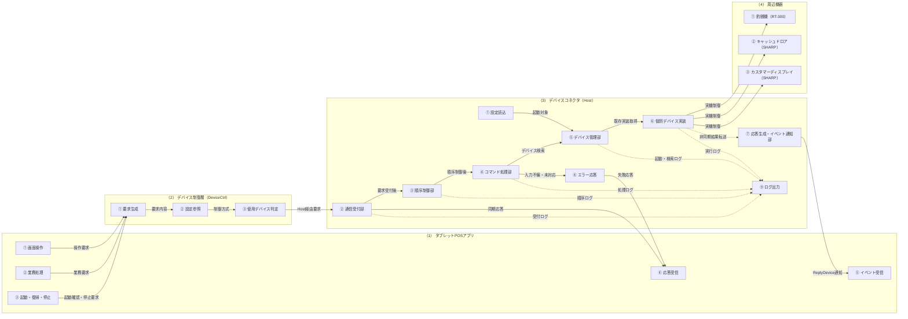
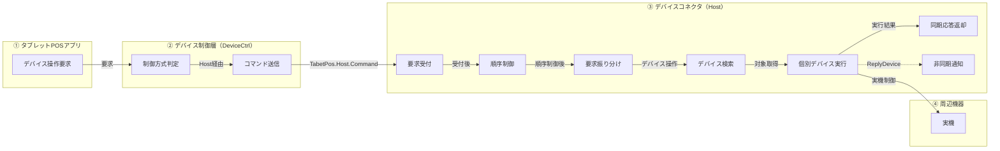
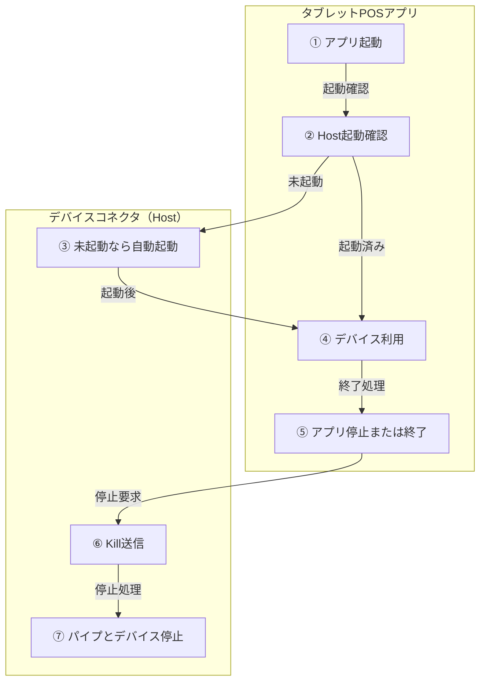

# ARCH-HOST-01 デバイスコネクタ基本設計書

タブレットPOS
ARCH-HOST-01 デバイスコネクタ基本設計書
文書ID: ARCH-HOST-01
第0.2.8版
2026年7月7日

## 00_表紙

| 項目 | 内容 |
|---|---|
| 文書ID | ARCH-HOST-01 |
| 文書名 | タブレットPOS デバイスコネクタ基本設計書 |
| 対象 | デバイスコネクタ（Host） |
| 版数 | 0.2.8 |
| 作成日 | 2026/07/07 |
| 作成者 | VTI サム |
| レビュー担当 | SMJ 鎌田 |
| 承認者 | - |
| 目的 | デバイスコネクタ（Host）の役割、機能、インターフェース、設定、エラー処理、ログ、確認事項を基本設計として整理する。 |
| 期待成果 | デバイスコネクタ（Host）の基本設計としてレビューできる状態にし、未決事項を19_確認事項で判断できるようにする。 |
| 想定形式 | 目次から各設計シートを確認できる構成とする。 |

## 01_改訂履歴

| 版数 | 日付 | 変更内容 | 作成者 | 承認者 |
|---|---|---|---|---|
| 0.2.8 | 2026/07/08 | デバイスコネクタ（Host）の基本設計書として新規作成。 | VTI サム | - |

## 目次

| No | 資料名称 | 備考 | No | 資料名称 | 備考 |
|---|---|---|---|---|---|
| 1 | 表紙 | 00_表紙 | 13 | ライフサイクル説明 | 09_ライフサイクル_02 |
| 2 | 改訂履歴 | 01_改訂履歴 | 14 | インターフェース一覧 | 10_インターフェース一覧 |
| 3 | 概要 | 02_概要 | 15 | 要求項目定義 | 11_要求項目定義 |
| 4 | 対象範囲 | 03_対象範囲 | 16 | 応答項目定義 | 12_応答項目定義 |
| 5 | 関連資料 | 04_関連資料 | 17 | イベント項目定義 | 13_イベント項目定義 |
| 6 | 全体構成図 | 05_全体構成_01 | 18 | メッセージ一覧 | 14_メッセージ一覧 |
| 7 | 全体構成説明 | 05_全体構成_02 | 19 | 設定ファイル設計 | 15_設定ファイル設計 |
| 8 | デバイス操作要求処理フロー図 | 06_デバイス操作要求処理フロー_01 | 20 | デバイス別設計 | 16_デバイス別設計 |
| 9 | デバイス操作要求処理フロー説明 | 06_デバイス操作要求処理フロー_02 | 21 | エラー処理 | 17_エラー処理 |
| 10 | 機能一覧 | 07_機能一覧 | 22 | ログ設計 | 18_ログ設計 |
| 11 | 機能詳細 | 08_機能詳細 | 23 | 確認事項 | 19_確認事項 |
| 12 | ライフサイクル図 | 09_ライフサイクル_01 | 24 | 実装対応表 | 20_実装対応表 |

## 02_概要

### 2.1 結論

本書は、タブレットPOSのデバイスコネクタ（Host）を対象にした基本設計書である。主対象は、タブレットPOSアプリ内のデバイス制御層そのものではなく、Windows端末上で動作する別プロセスのHostになる。

DeviceCtrlは、使用デバイスと制御方式を判断し、Host経由が必要な場合に要求を送る呼び出し側として扱う。Hostは、既存OPOS、OCX、DLL、共有メモリ、要求/応答ファイル連携を利用するデバイス実装を起動、保持、呼び出し、停止する。

### 2.2 設計方針

① アプリ側は、どの機器を使うか、どの要求をHostへ送るかに集中する。

② Host側は、実機をどう制御するか、既存資源をどう呼び出すかに集中する。

③ 通信は名前付きパイプを使用し、コマンド用とイベント用を分ける。

④ 初期対象は、RT-300釣銭機、SHARPキャッシュドロア、SHARPカスタマーディスプレイとする。

⑤ 物理クラス名や詳細メソッドは、本文で繰り返さず、20_実装対応表またはプログラム仕様書で確認する。

### 2.3 レビュー判断

本書の対象範囲、役割分担、通信方式、設定、エラー処理、ログ、確認事項に大きな認識差異がなければ、デバイスコネクタ（Host）の基本設計としてレビュー完了を判断できる。未決事項は、19_確認事項で確認する。

## 03_対象範囲

### 3.1 対象

本書では、Host経由で扱うデバイス制御に必要な範囲を対象にする。

① Windows端末上で動作するデバイスコネクタ（Host）プロセス。

② TabetPos.Host.Commandによる同期要求と同期応答。

③ TabetPos.Host.Eventによる非同期通知。

④ Host内の設定読込、デバイス生成、起動済みデバイス保持、検索、停止。

⑤ RT-300釣銭機、SHARPキャッシュドロア、SHARPカスタマーディスプレイ。

⑥ 入力不備、未登録デバイス、通信失敗、デバイス実行失敗、停止失敗の扱い。

⑦ 起動、停止、通信、コマンド処理、デバイス処理、例外、監視異常のログ設計。

### 3.2 対象外

画面の表示項目、画面遷移、ユーザー向け文言は、アプリ側設計で扱う。

DeviceCtrl内部の直接制御方式は、本書の対象外とする。本書は、Host経由で既存デバイス資源を利用する範囲に絞る。

個別クラスのprivateメソッド、内部変数、詳細な分岐条件は、プログラム仕様書で扱う。

OPOS設定、ドライバー導入、店舗での実機設定は、運用手順書または導入手順書で扱う。

プリンター、スキャナー、決済端末などの将来追加機器は、初期対象ではないため本書では扱わない。

## 04_関連資料

| 文書ID | 文書名 | 本書との関係 |
|---|---|---|
| ARCH-01 | タブレットPOS ソフトウェア構造設計書 | タブレットPOS全体構造の前提資料。 |
| ARCH-02 | タブレットPOS 端末アプリケーション構造設計書 | 端末アプリ側の構造の前提資料。 |
| ARCH-03 | タブレットPOS デバイスコネクタ構造設計書 | Hostの構造、責務、主要コンポーネントの前提資料。 |
| CFG-01 | タブレットPOS デバイス制御層設定ファイル記載要領 | device_controller_config.jsonとhost_device_config.jsonの記載要領。 |
| PS-HOST-01 | 名前付きパイプコマンドサーバー | コマンド受信部のプログラム仕様。 |
| PS-HOST-02 | 名前付きパイプデバイスホストアダプター | Host通信アダプターのプログラム仕様。 |
| PS-HOST-03 | デバイスコマンドルーター | DeviceId単位の順序制御のプログラム仕様。 |
| PS-HOST-04 | デバイスコマンドハンドラー | Host制御要求とデバイス操作要求の振り分け仕様。 |
| PS-HOST-05 | デバイスサーバーホスト | Host本体の起動、停止、通信管理の仕様。 |
| PS-HOST-06 | デバイスマネージャー | デバイス生成、保持、検索、停止の仕様。 |
| PS-HOST-07 | デバイスベース | デバイス共通基底処理の仕様。 |
| PS-HOST-08 | 釣銭機制御 RT-300 | RT-300釣銭機のプログラム仕様。 |
| PS-HOST-10 | キャッシュドロア制御 SHARP | SHARPキャッシュドロアのプログラム仕様。 |
| PS-HOST-11 | カスタマーディスプレイ制御 SHARP | SHARPカスタマーディスプレイのプログラム仕様。 |

## 05_全体構成_01

### 5.1 全体構成図



## 05_全体構成_02

### 5.2 構成要素

タブレットPOSアプリは、画面操作または業務処理をきっかけにデバイス操作を要求する。DeviceCtrlは、設定をもとに直接制御かHost経由かを判断する。Host経由の場合、要求は名前付きパイプでHostへ送られ、Host内で順序制御、要求振り分け、デバイス検索、実機制御が行われる。

（1）タブレットPOSアプリは、画面と業務処理を担当する。実機制御の詳細は持たず、必要な操作要求をDeviceCtrlへ渡す。

  ① 画面操作は、利用者の操作をきっかけにデバイス操作要求を作成する。
    関連シート: 06_デバイス操作要求処理フロー_02、11_要求項目定義
  ② 業務処理は、業務上必要なデバイス操作をDeviceCtrlへ依頼する。
    関連シート: 06_デバイス操作要求処理フロー_02、14_メッセージ一覧
  ③ 起動、復帰、停止は、Hostの起動確認と停止要求のきっかけになる。
    関連シート: 09_ライフサイクル_02

（2）DeviceCtrlは、使用デバイスと制御方式を判断する。Host経由の対象については、名前付きパイプで要求を送信する。

  ① 設定参照は、制御方式と対象デバイスの判断に必要な設定を読む。
    関連シート: 15_設定ファイル設計
  ② 使用デバイス判定は、アプリ内直接制御かHost経由かを決める。
    関連シート: 06_デバイス操作要求処理フロー_02、15_設定ファイル設計
  ③ 要求生成は、Hostへ送るコマンド要求を作成する。
    関連シート: 11_要求項目定義、14_メッセージ一覧
  ④ 応答受信は、Hostからの同期応答を受け取り、呼出元へ返す。
    関連シート: 12_応答項目定義、17_エラー処理
  ⑤ イベント受信は、Hostからの非同期通知を受け取る。
    関連シート: 13_イベント項目定義、09_ライフサイクル_02

（3）デバイスコネクタ（Host）は、DeviceCtrlからの要求を受け付け、順序制御、要求振り分け、デバイス検索、Host内の個別デバイス実装呼び出し、応答返却を行う。

  ① 設定読込は、host_device_config.jsonを読み込み、Host内で起動するデバイスを特定する。
    関連シート: 15_設定ファイル設計、16_デバイス別設計
  ② 通信受付部は、DeviceCtrlからのコマンド要求を受け付け、同じ接続で同期応答を返す。
    関連シート: 06_デバイス操作要求処理フロー_02、10_インターフェース一覧、11_要求項目定義、12_応答項目定義
  ③ 順序制御部は、同一DeviceIdの要求順を守り、順序入れ替わりを避ける。
    関連シート: 06_デバイス操作要求処理フロー_02、07_機能一覧、08_機能詳細、18_ログ設計
  ④ コマンド処理部は、Host制御要求とデバイス操作要求を振り分ける。
    関連シート: 07_機能一覧、08_機能詳細、14_メッセージ一覧、17_エラー処理
  ⑤ デバイス管理部は、起動済みデバイスを生成、保持、検索、停止する。
    関連シート: 15_設定ファイル設計、16_デバイス別設計、17_エラー処理、18_ログ設計
  ⑥ 個別デバイス実装は、Host内でOPOS、OCX、DLL、共有メモリ、要求/応答ファイル連携などの既存資源を使い、実機制御を行う。
    関連シート: 16_デバイス別設計、20_実装対応表
  ⑦ 応答生成・イベント通知部は、同期応答を通信経路へ返し、ReplyDevice系の後続通知をイベント用パイプへ送信する。
    関連シート: 10_インターフェース一覧、12_応答項目定義、13_イベント項目定義、18_ログ設計
  ⑧ エラー応答は、入力不備、未登録デバイス、例外を失敗応答へ変換する。
    関連シート: 12_応答項目定義、17_エラー処理、18_ログ設計
  ⑨ ログ出力は、起動、通信、順序制御、コマンド処理、デバイス処理、異常を追跡できる形で記録する。
    関連シート: 18_ログ設計

（4）周辺機器は、店舗で利用する実機である。初期対象は、釣銭機（RT-300）、キャッシュドロア（SHARP）、カスタマーディスプレイ（SHARP）の3種類とする。

  ① 釣銭機（RT-300）は、Host内の釣銭機制御部から実機制御される。
    関連シート: 16_デバイス別設計、17_エラー処理
  ② キャッシュドロア（SHARP）は、Host内のキャッシュドロア制御部から実機制御される。
    関連シート: 16_デバイス別設計、17_エラー処理
  ③ カスタマーディスプレイ（SHARP）は、Host内のカスタマーディスプレイ制御部から実機制御される。
    関連シート: 16_デバイス別設計、17_エラー処理

## 06_デバイス操作要求処理フロー_01

### 6.1 デバイス操作要求処理フロー図



## 06_デバイス操作要求処理フロー_02

### 6.2 通常処理

通常のデバイス操作は、アプリ側の要求から始まり、Host内の個別デバイス実装へ渡される。同期応答はコマンド用パイプで返し、Host内で生成されたReplyDevice系の後続通知はイベント用パイプで通知する。

① タブレットPOSアプリは、画面操作または業務処理をきっかけにデバイス操作要求を作成する。

② DeviceCtrlは、device_controller_config.jsonを参照し、対象デバイスをアプリ内で直接制御するか、Host経由で制御するかを判断する。

③ Host経由の場合、DeviceCtrlはTabetPos.Host.CommandへJSON要求または既存互換形式の要求を送信する。

④ 通信受付部は要求を受信し、Host内部で扱う要求情報へ変換する。

⑤ 順序制御部は、DeviceId単位で処理順を整理する。同一DeviceIdの要求は投入順に処理する。

⑥ コマンド処理部は、Host制御要求かデバイス操作要求かを判定する。

⑦ デバイス操作要求の場合、デバイス管理部から対象デバイスを検索する。

⑧ 個別デバイス実装は、message、methodId、payloadをもとに実機制御を実行する。

⑨ 通信受付部は、実行結果をコマンド応答JSONとして同期返却する。

⑩ Host内でReplyDevice系の後続通知が生成された場合、イベント通知部はTabetPos.Host.Eventへ非同期通知する。

## 07_機能一覧

| 機能ID | 機能名 | 概要 | 入力 | 出力 | 主な担当 | 備考 |
|---|---|---|---|---|---|---|
| F-HOST-001 | Host起動確認 | アプリ起動、画面作成、復帰時にHost起動状態を確認する。 | アプリライフサイクルイベント | Host起動要否 | アプリ側起動処理 | 通常運用では手動Startを前提にしない。 |
| F-HOST-002 | Host自動起動 | Host未起動の場合、バックグラウンドプロセスとして起動する。 | Host起動要否 | Hostプロセス | Host本体 | 多重起動を避ける。 |
| F-HOST-003 | コマンド受付 | TabetPos.Host.Commandで同期要求を受け付ける。 | 名前付きパイプ要求 | Host内部で扱う要求情報 | 通信受付部 | 1要求ごとに応答を返す。 |
| F-HOST-004 | イベント通知 | Host内で生成されたReplyDevice系の後続通知をイベントとして送信する。 | ReplyDevice通知データ | イベント通知JSON | イベント通知部 | 同期応答とは別経路。 |
| F-HOST-005 | コマンド変換 | 外部要求をHost内部で扱う形式へ変換する。 | JSON要求または既存形式要求 | Host内部で扱う要求情報 | コマンド変換部 | 既存互換項目を維持する。 |
| F-HOST-006 | DeviceId単位順序制御 | 同一DeviceIdの要求を投入順に処理する。 | Host内部で扱う要求情報 | 順序制御後の処理要求 | 順序制御部 | 異なるDeviceIdは分離して扱える。 |
| F-HOST-007 | Host制御 | Kill、ReStartをHost制御要求として扱う。 | Host制御message | Host停止または再起動指示 | コマンド処理部、Host本体 | デバイス検索を行わない。 |
| F-HOST-008 | デバイス操作 | DeviceUse、DeviceUnUse、DeviceMethodなどを対象デバイスへ渡す。 | deviceId、methodId、payload | デバイス実行結果 | コマンド処理部、デバイス管理部 | 個別デバイス実装の詳細は対象外。 |
| F-HOST-009 | デバイス管理 | 設定に基づいてHost側デバイスを生成、保持、検索、停止する。 | host_device_config.json | 起動済みデバイスリスト | デバイス管理部 | 起動失敗時はエラー処理に従う。 |
| F-HOST-010 | エラー応答 | 入力不備、未登録デバイス、例外を失敗応答へ変換する。 | 異常情報 | 失敗応答JSON | 通信受付部、コマンド処理部、順序制御部 | アプリ側表示文言はHostでは決めない。 |

## 08_機能詳細

| 機能ID | 処理順 | 処理内容 | 正常時 | 異常時 | 主な担当 |
|---|---:|---|---|---|---|
| F-HOST-001 | 1 | アプリ側でHost起動状態を確認する。 | 起動済みならそのまま処理を続ける。 | 未起動ならF-HOST-002へ進む。 | アプリ側起動処理 |
| F-HOST-002 | 1 | Hostプロセスをバックグラウンドで起動する。 | Hostがコマンド受付可能になる。 | 起動失敗をアプリ側ログに残し、再試行またはエラー扱いにする。 | Host本体 |
| F-HOST-003 | 1 | コマンド用名前付きパイプを待ち受ける。 | 要求を受信する。 | 受付開始に失敗した場合はHost起動異常として扱う。 | 通信受付部 |
| F-HOST-003 | 2 | 受信した1行要求を解析する。 | Host内部で扱う要求情報へ変換する。 | 空行または形式不正の場合は失敗応答を返す。 | 通信受付部 |
| F-HOST-004 | 1 | ReplyDevice系の後続通知データを受け取る。 | イベント通知データを作成する。 | 送信先がない場合はログを残し、同期応答とは分けて扱う。 | イベント通知部 |
| F-HOST-005 | 1 | JSON要求または既存形式要求をHost内部形式へ変換する。 | message、deviceId、methodId、handle、payloadを設定する。 | 必須情報が不足する場合は後続の入力検証で失敗扱いにする。 | コマンド変換部 |
| F-HOST-006 | 1 | DeviceIdごとの処理単位を決定する。 | 同一DeviceIdの要求を同じ処理単位へ投入する。 | DeviceId未指定の場合はHost共通の処理単位として扱う。 | 順序制御部 |
| F-HOST-006 | 2 | 投入順に処理を実行する。 | 同一DeviceIdで処理順が守られる。 | 処理中例外は失敗応答へ変換する。 | 順序制御部 |
| F-HOST-007 | 1 | messageがHost制御要求か判定する。 | KillまたはReStartをHost制御として処理する。 | 未対応messageの場合は失敗応答を返す。 | コマンド処理部 |
| F-HOST-008 | 1 | デバイス操作要求の必須項目を確認する。 | deviceId、必要に応じてmethodIdを確認する。 | deviceIdまたはmethodId不足時は失敗応答を返す。 | コマンド処理部 |
| F-HOST-008 | 2 | 対象デバイスを検索する。 | 対象デバイスを取得する。 | 未登録DeviceIdの場合は失敗応答を返す。 | デバイス管理部 |
| F-HOST-008 | 3 | Host内の対象デバイス実装へ処理を渡す。 | DeviceUse、DeviceUnUse、DeviceMethodの結果を受け取る。 | 個別デバイス実装の戻り値または例外を失敗応答へ変換する。 | 個別デバイス実装 |
| F-HOST-009 | 1 | Host起動時に設定ファイルを読み込む。 | 起動対象デバイスを特定する。 | 設定不備の場合は対象デバイスを起動しない。 | デバイス管理部 |
| F-HOST-009 | 2 | 対象デバイスを生成して開始する。 | 起動済みリストへ登録する。 | 起動失敗時はログを残す。必要に応じて再試行する。 | デバイス管理部 |
| F-HOST-010 | 1 | 異常内容を応答形式へ変換する。 | success=falseと結果コードを返す。 | 応答生成自体が失敗した場合は通信異常としてログを残す。 | 通信受付部 |

## 09_ライフサイクル_01

### 9.1 通常運用図



## 09_ライフサイクル_02

### 9.2 通常運用

通常運用では、利用者がStart/Stop画面を操作する前提にはしない。アプリの起動、画面作成、復帰のタイミングでHostの起動状態を確認し、未起動であればバックグラウンドで起動する。

① アプリ起動時は、Host起動状態を確認する。未起動の場合は自動起動する。

② 画面作成時は、デバイス利用前にHost起動状態を確認する。起動済みの場合は再起動しない。

③ アプリ復帰時は、復帰後にHost起動状態を再確認する。未起動の場合は再起動する。

④ アプリ停止時または終了時は、Kill要求を送信する。Host側は通信部と起動済みデバイスを停止する。

⑤ Host停止後は、パイプとデバイスが解放され、Hostが常駐し続けない状態を正常終了条件とする。

### 9.3 デバッグ時

Start/Stop画面を残す場合も、通常運用ではなく、デバッグまたは開発者向けの確認用途に限定する。通常の店舗運用フローには含めない。

## 10_インターフェース一覧

| IF-ID | 区分 | 送信元 | 送信先 | パイプ名 | 要求形式 | 応答形式 | 同期区分 | 備考 |
|---|---|---|---|---|---|---|---|---|
| IF-HOST-001 | コマンド要求 | DeviceCtrl | デバイスコネクタ（Host） | TabetPos.Host.Command | JSONまたは既存互換形式 | JSON | 同期 | デバイス操作要求とHost制御要求を扱う。 |
| IF-HOST-002 | コマンド応答 | デバイスコネクタ（Host） | DeviceCtrl | TabetPos.Host.Command | - | JSON | 同期 | 同じ接続で結果を返す。 |
| IF-HOST-003 | イベント通知 | デバイスコネクタ（Host） | DeviceCtrlまたはアプリ側 | TabetPos.Host.Event | JSON | - | 非同期 | Host内で生成されたReplyDevice通知を扱う。 |

## 11_要求項目定義

### 11.1 コマンド要求JSON例

```json
{
  "requestId": "00000001",
  "message": "DeviceMethod",
  "deviceId": "CustomerDisplay",
  "methodId": "DisplayText",
  "handle": "0",
  "payload": {
    "Text": "TOTAL 1,000"
  }
}
```

### 11.2 コマンド要求項目

| 項目ID | 項目名 | 型 | 必須 | 内容 | 設定例 | 備考 |
|---|---|---|---|---|---|---|
| REQ-HOST-001 | requestId | string | 推奨 | 要求を追跡するID。 | 00000001 | 未指定時の補完有無は呼出元仕様に従う。 |
| REQ-HOST-002 | message | string | 任意 | メッセージ種別。 | DeviceMethod | 未指定時はデバイスメソッド扱いとして補完される想定。 |
| REQ-HOST-003 | deviceId | string | 条件付き必須 | 対象デバイスID。 | CustomerDisplay | Host制御要求では未指定可。 |
| REQ-HOST-004 | methodId | string | 条件付き必須 | 対象メソッドID。 | DisplayText | DeviceMethodでは必須。 |
| REQ-HOST-005 | handle | string | 任意 | 既存互換用のハンドル。 | 0 | 未指定時は0として扱う想定。 |
| REQ-HOST-006 | payload | object | 任意 | デバイス操作の引数。 | { "Text": "TOTAL 1,000" } | 内容はデバイスとmethodIdにより変わる。 |

## 12_応答項目定義

### 12.1 コマンド応答JSON例

```json
{
  "requestId": "00000001",
  "success": true,
  "resultCode": 0,
  "message": "",
  "payload": {
    "ResultCode": "0",
    "ReturnValue": "0"
  }
}
```

### 12.2 コマンド応答項目

| 項目ID | 項目名 | 型 | 必須 | 内容 | 正常時 | 異常時 |
|---|---|---|---|---|---|---|
| RES-HOST-001 | requestId | string | 必須 | 要求ID。 | 要求から引き継ぐ。 | 可能な範囲で要求から引き継ぐ。 |
| RES-HOST-002 | success | boolean | 必須 | 処理成否。 | true | false |
| RES-HOST-003 | resultCode | number | 必須 | 結果コード。 | 0 | -1またはデバイス結果コード。 |
| RES-HOST-004 | message | string | 必須 | メッセージ。 | 空文字可。 | 原因または確認観点を返す。 |
| RES-HOST-005 | payload | object | 必須 | 追加結果。 | ResultCode、ReturnValueを含める。 | 可能な範囲でResultCode、ReturnValueを含める。 |

## 13_イベント項目定義

### 13.1 イベント通知JSON例

```json
{
  "eventId": "a1b2c3",
  "eventType": "ReplyDevice",
  "deviceId": "CustomerDisplay",
  "methodId": "DisplayText",
  "handle": "0",
  "message": "ReplyDevice",
  "payload": {
    "ResultCode": "0",
    "ReturnValue": "0"
  }
}
```

### 13.2 イベント通知項目

| 項目ID | 項目名 | 型 | 必須 | 内容 | 備考 |
|---|---|---|---|---|---|
| EVT-HOST-001 | eventId | string | 必須 | イベント識別ID。 | Host側で採番する想定。 |
| EVT-HOST-002 | eventType | string | 必須 | イベント種別。 | 初期想定はReplyDevice。 |
| EVT-HOST-003 | deviceId | string | 必須 | 対象デバイスID。 | 応答元デバイスを示す。 |
| EVT-HOST-004 | methodId | string | 任意 | 対象メソッドID。 | デバイス応答内容により設定する。 |
| EVT-HOST-005 | handle | string | 任意 | 既存互換用のハンドル。 | 必要に応じて設定する。 |
| EVT-HOST-006 | message | string | 任意 | 通知メッセージ。 | 既存互換のため保持する。 |
| EVT-HOST-007 | payload | object | 任意 | HostがReplyDevice通知に格納する戻りデータ。 | 個人情報や決済機微情報はログへそのまま出さない。 |

## 14_メッセージ一覧

| メッセージID | message | 分類 | deviceId | methodId | 主な用途 | 正常時の扱い | 異常時の扱い |
|---|---|---|---|---|---|---|---|
| MSG-HOST-001 | DeviceUse | デバイス操作 | 必須 | 任意 | デバイス使用開始。 | 対象デバイスの使用開始処理を呼ぶ。 | deviceId未指定または未登録時は失敗応答。 |
| MSG-HOST-002 | DeviceUnUse | デバイス操作 | 必須 | 任意 | デバイス使用終了。 | 対象デバイスの使用終了処理を呼ぶ。 | deviceId未指定または未登録時は失敗応答。 |
| MSG-HOST-003 | DeviceUnUseComplete | デバイス操作 | 必須 | 任意 | 使用完了後のプロセス情報削除。 | プロセス情報を削除し、使用終了処理を行う。 | 対象情報がない場合は結果コードで返す。 |
| MSG-HOST-004 | DeviceMethod | デバイス操作 | 必須 | 必須 | デバイス固有メソッド実行。 | 対象デバイスのメソッド実行処理を呼ぶ。 | methodId未指定または未登録デバイス時は失敗応答。 |
| MSG-HOST-005 | Kill | Host制御 | 任意 | 任意 | Host停止。 | 停止処理へ進む。 | 停止中例外はログに残す。 |
| MSG-HOST-006 | ReStart | Host制御 | 任意 | 任意 | Host再起動。 | 再起動処理へ進む。 | 再起動失敗はログに残す。 |

## 15_設定ファイル設計

### 15.1 設定ファイル一覧

| 設定ID | 設定ファイル | 管轄 | 用途 | 読込タイミング | 備考 |
|---|---|---|---|---|---|
| CFG-HOST-001 | device_controller_config.json | アプリ / DeviceCtrl側 | 端末で使用するデバイス候補、有効デバイス、接続方式、名前付きパイプ設定を定義する。 | タブレットPOSアプリ起動時 | Host内で生成するデバイス実装は定義しない。 |
| CFG-HOST-002 | host_device_config.json | デバイスコネクタ（Host）側 | Hostが起動、保持する既存デバイス実装を定義する。 | Host起動時 | アプリ側の有効デバイス選択は定義しない。 |

### 15.2 設定項目

| 設定ID | 設定ファイル | キー | 内容 | 設定例 | 必須 | 備考 |
|---|---|---|---|---|---|---|
| CFG-HOST-003 | device_controller_config.json | appSettings.namedPipe.pipeName | Host経由時のコマンド用パイプ名。 | TabetPos.Host.Command | 必須 | DeviceCtrlからHostへ要求を送るために使用する。 |
| CFG-HOST-004 | device_controller_config.json | 有効デバイス設定 | アプリ側で利用するデバイスを選択する。 | 対象設定に従う | 必須 | Host側の起動対象とは役割が違う。 |
| CFG-HOST-005 | host_device_config.json | devices | Hostが起動するデバイス実装一覧。 | 配列 | 必須 | 初期対象デバイスを定義する。 |
| CFG-HOST-006 | host_device_config.json | devices[].id | Host内のデバイスID。 | CustomerDisplay | 必須 | 要求のdeviceIdと対応する。 |
| CFG-HOST-007 | host_device_config.json | devices[].name | 実行時に使用するデバイス名または論理名。 | 対象デバイス名 | 必須 | 既存実装の識別に使う。 |
| CFG-HOST-008 | host_device_config.json | devices[].classId | Host側で生成する実装識別ID。 | 対象class識別ID | 必須 | 実装生成の手がかりになる。 |
| CFG-HOST-009 | host_device_config.json | devices[].visible | デバイス用フォームを表示するか。 | false | 任意 | デバッグ時や既存フォーム制約で使用する。 |
| CFG-HOST-010 | host_device_config.json | devices[].parameters | デバイスごとの追加パラメータ。 | オブジェクト | 任意 | デバイス固有設定を持つ。 |

### 15.3 設定ファイル対応関係

| 観点 | device_controller_config.json | host_device_config.json |
|---|---|---|
| 管轄 | アプリ / DeviceCtrl側 | デバイスコネクタ（Host）側 |
| 主な目的 | 端末で使用する制御方式を選ぶ。 | Hostで起動する既存デバイス実装を選ぶ。 |
| Host連携 | 名前付きパイプ名を持つ。 | Host内デバイス実装を持つ。 |
| 参照タイミング | アプリ起動時、デバイス制御時。 | Host起動時。 |
| 置換関係 | Host設定を置き換えない。 | アプリ設定を置き換えない。 |

## 16_デバイス別設計

| デバイスID | デバイス名 | 制御方式 | 主な担当 | 主な処理 | 起動条件 | 終了条件 | 主な制約 | 備考 |
|---|---|---|---|---|---|---|---|---|
| DEV-HOST-001 | RT-300釣銭機 | Host経由 | 釣銭機制御部 | 入金、払出、状態確認、エラー確認。 | host_device_config.jsonに定義され、Host起動時に対象となる。 | Host停止時またはデバイス停止処理時。 | Host内OPOS、Host内OCX、UIスレッド、共有メモリ、要求/応答ファイル連携。 | 同期応答と非同期応答を分けて扱う。 |
| DEV-HOST-002 | SHARPキャッシュドロア | Host経由 | キャッシュドロア制御部 | ドロアオープン、状態確認。 | host_device_config.jsonに定義され、Host起動時に対象となる。 | Host停止時またはデバイス停止処理時。 | Host内SHARP既存実装、Host内OPOS、Host内OCX。 | 結果コードを呼出元へ返す。 |
| DEV-HOST-003 | SHARPカスタマーディスプレイ | Host経由 | カスタマーディスプレイ制御部 | 表示、消去、スクロール、位置指定表示。 | host_device_config.jsonに定義され、Host起動時に対象となる。 | Host停止時またはデバイス停止処理時。 | Host内SHARP既存実装、Host内OPOS、Host内OCX、日本語文字列。 | 名前付きパイプではUTF-8を前提に扱う。 |

## 17_エラー処理

### 17.1 エラー処理方針

① Host内部で検知した異常は、可能な範囲でコマンド応答の失敗結果として呼出元へ返す。

② 既存互換を維持するため、異常時も可能な範囲でResultCodeとReturnValueを応答データへ含める。

③ 個別要求の異常ではHost全体を停止しない。停止が必要な場合は、KillまたはReStartを明示的に扱う。

④ 起動、停止、要求処理、デバイス異常、監視異常は、後から調査できる形でログに残す。

⑤ Hostは技術的な結果を返す。ユーザー向け表示文言、再試行可否、業務継続可否はアプリ側で判断する。

### 17.2 エラー処理一覧

| エラーID | 発生箇所 | 発生条件 | 検知方法 | Host側処理 | アプリ側返却 | ログ出力 | 復旧方法 |
|---|---|---|---|---|---|---|---|
| E-HOST-001 | DeviceCtrlからHostへの接続 | Host未起動、コマンド用パイプ未待受、接続タイムアウト。 | アプリ側の接続失敗。 | Host側処理なし。 | アプリ側で接続失敗またはタイムアウト扱い。 | アプリ側接続ログ。 | Host自動起動後に再試行する。 |
| E-HOST-002 | コマンド受信 | 空行または空白のみの要求。 | 入力検証。 | 失敗応答を生成する。 | success=false、resultCode=-1 | 受信異常ログ。 | 呼出元の要求生成処理を確認する。 |
| E-HOST-003 | コマンド受信 | JSON形式不正。 | JSON解析例外。 | 例外を失敗応答へ変換する。 | success=false、resultCode=-1 | 解析異常ログ。 | 要求JSONの項目と文字コードを確認する。 |
| E-HOST-004 | コマンド変換 | 要求オブジェクト未指定。 | 変換時の入力検証。 | 引数エラーとして扱う。 | success=false、resultCode=-1 | 変換異常ログ。 | 呼出元の要求生成処理を確認する。 |
| E-HOST-005 | コマンド処理 | deviceId未指定。 | 入力検証。 | デバイス検索せず失敗結果を返す。 | ResultCode=-1、ReturnValue=-1 | 入力検証ログ。 | Host制御要求かデバイス操作要求かを確認する。 |
| E-HOST-006 | コマンド処理 | 未登録DeviceId指定。 | デバイス検索結果なし。 | 対象デバイスなしとして失敗結果を返す。 | ResultCode=-1、ReturnValue=-1 | デバイス未登録ログ。 | host_device_config.jsonとDeviceCtrl側DeviceIdを確認する。 |
| E-HOST-007 | コマンド処理 | DeviceMethodでmethodId未指定。 | 入力検証。 | 対象デバイスを呼ばず失敗結果を返す。 | ResultCode=-1、ReturnValue=-1 | 入力検証ログ。 | 呼出元のメソッド対応関係を確認する。 |
| E-HOST-008 | コマンド処理 | 未対応message。 | message判定。 | 未対応コマンドとして失敗結果を返す。 | ResultCode=-1、ReturnValue=-1 | 未対応messageログ。 | message名と対応一覧を確認する。 |
| E-HOST-009 | デバイス実行 | DeviceMethodが正常以外を返す。 | デバイス戻り値。 | 成功扱いにせず結果コードを返す。 | success=false、resultCode=<戻り値> | デバイス結果ログ。 | 実機状態、OPOS状態、引数を確認する。 |
| E-HOST-010 | 順序制御 | 処理中に例外が発生する。 | 処理単位内の例外。 | 例外を失敗応答へ変換する。 | success=false、resultCode=-1 | 例外ログ。 | requestIdを起点にHostログを確認する。 |
| E-HOST-011 | デバイス起動 | デバイス生成または開始失敗。 | 起動時例外または戻り値。 | 起動済みリストに追加しない。 | 該当DeviceId要求時に未登録エラー。 | 起動異常ログ。 | OPOS設定、OCX登録、デバイス接続を確認する。 |
| E-HOST-012 | 監視 | 一定時間デバイス応答がない。 | 監視時刻。 | 状態監視ログを出力する。 | 要求中でなければ直接応答なし。 | 監視異常ログ。 | 実機接続、デバイスプロセス状態を確認する。 |
| E-HOST-013 | イベント送信 | イベント送信先が未接続。 | 送信処理の状態確認。 | 送信せずログを残す。 | コマンド応答とは別扱い。 | イベント送信ログ。 | アプリ側イベント受信状態を確認する。 |
| E-HOST-014 | Host停止 | Kill受信中または処理中に停止要求。 | Kill message。 | 停止処理へ進む。 | Kill受付結果。 | 停止ログ。 | 停止後の再起動可否を確認する。 |
| E-HOST-015 | Host停止 | StopHost中の例外。 | 停止処理例外。 | 停止異常ログを出力する。 | 可能な範囲で失敗応答。 | 停止異常ログ。 | 残存プロセス、パイプハンドル、デバイス解放状態を確認する。 |
| E-HOST-016 | 設定読込 | host_device_config.json不備。 | 設定読込またはデバイス生成時。 | 対象デバイスを起動しない。 | 該当DeviceId要求時に未登録エラー。 | 設定/起動異常ログ。 | id、name、classId、parametersを確認する。 |

## 18_ログ設計

### 18.1 ログ出力方針

① 要求を追跡できるように、可能な範囲でrequestId、message、deviceId、methodId、handle、resultCodeを出力する。

② Host起動、停止、再起動、停止異常を追跡できるログを残す。

③ コマンド受信、解析異常、イベント送信異常を追跡できるログを残す。

④ デバイス未登録、デバイス実行失敗、起動失敗、監視異常を追跡できるログを残す。

⑤ 個人情報や決済機微情報を含む応答データは、そのままログへ出力しない。

### 18.2 ログ出力一覧

| ログID | 出力タイミング | ログレベル | 出力元 | 出力内容 | 目的 |
|---|---|---|---|---|---|
| L-HOST-001 | Host起動開始 | Info | Host本体 | Host起動開始、起動モード。 | 起動処理の開始確認。 |
| L-HOST-002 | Host起動完了 | Info | Host本体 | 通信部開始、デバイス管理開始。 | 起動完了確認。 |
| L-HOST-003 | Host起動異常 | Error | Host本体 | 起動例外、設定読込異常。 | 起動失敗原因の確認。 |
| L-HOST-004 | Host停止開始 | Info | Host本体 | 停止開始。 | 停止処理の開始確認。 |
| L-HOST-005 | Host停止完了 | Info | Host本体 | パイプ停止、デバイス停止。 | 停止完了確認。 |
| L-HOST-006 | Host停止異常 | Error | Host本体 | 停止例外。 | 停止失敗原因の確認。 |
| L-HOST-007 | コマンド受信 | Debug/Info | 通信受付部 | requestId、message、deviceId、methodId。 | 要求追跡。 |
| L-HOST-008 | コマンド解析異常 | Error | 通信受付部 | 入力行、解析例外。 | 解析失敗原因の確認。 |
| L-HOST-009 | 順序制御投入 | Debug | 順序制御部 | deviceId、処理単位。 | 順序制御の確認。 |
| L-HOST-010 | コマンド処理異常 | Error | 順序制御部、コマンド処理部 | 例外、失敗理由。 | 処理失敗原因の確認。 |
| L-HOST-011 | デバイス未登録 | Warn | コマンド処理部 | deviceId未登録。 | 設定不備または呼出元不備の確認。 |
| L-HOST-012 | デバイス実行結果 | Info/Debug | コマンド処理部 | methodId、resultCode。 | 実行結果の確認。 |
| L-HOST-013 | デバイス起動異常 | Error | デバイス管理部 | deviceId、classId、試行回数。 | デバイス起動失敗原因の確認。 |
| L-HOST-014 | 監視異常 | Warn | デバイス管理部 | deviceId、最終応答時刻。 | 応答なし状態の確認。 |
| L-HOST-015 | イベント送信 | Debug | イベント通知部 | eventId、deviceId、methodId。 | 非同期通知の追跡。 |

## 19_確認事項

| 確認ID | 確認事項 | 現時点の前提 | 影響範囲 | 確認先 | 確認期限 | ステータス |
|---|---|---|---|---|---|---|
| Q-HOST-001 | DeviceCtrl側のイベント用パイプ受信を初期対応範囲に含めるか。 | Host側はTabetPos.Host.Eventへ送信する。アプリ側の受信、表示、業務処理への反映範囲はレビューで決める。 | 非同期応答、アプリ側表示、確認観点。 | SMJ / アプリ担当 | 基本設計レビュー完了前 | レビュー確認待ち |
| Q-HOST-002 | Host接続タイムアウト値の既定値をどこで管理するか。 | device_controller_config.json側の名前付きパイプ設定に寄せる想定。画面表示文言と再試行条件はアプリ側で判断する。 | 接続失敗時の応答、画面表示、再試行。 | SMJ / アプリ担当 | 基本設計レビュー完了前 | レビュー確認待ち |
| Q-HOST-003 | Start/Stop画面を通常運用で非表示にするか。 | 通常運用では自動起動、自動停止を前提にする。Start/Stop画面はデバッグまたは開発者確認用に限定する想定。 | 運用手順、デバッグ方法。 | SMJ | 基本設計レビュー完了前 | レビュー確認待ち |
| Q-HOST-004 | エラー時のユーザー表示文言をHost応答からどう変換するか。 | Hostは技術的な結果コードとメッセージを返す。ユーザー向け表示文言、再試行可否、業務継続可否はアプリ側で整理する。 | アプリ側エラー表示、業務継続判断。 | SMJ / 業務担当 | 基本設計レビュー完了前 | レビュー確認待ち |
| Q-HOST-005 | プリンターなど将来追加機器をHost経由に含める条件。 | 初期対象はRT-300釣銭機、SHARPキャッシュドロア、SHARPカスタマーディスプレイに限定する。追加機器は対応方針整理後に本書へ反映する。 | 設定、機能一覧、エラー処理、確認観点。 | SMJ / デバイス担当 | 追加機器の対応方針整理時 | 方針整理待ち |

## 20_実装対応表

| 対応ID | 論理名 | 物理クラスまたは実装識別子 | 主な役割 | 関連資料 |
|---|---|---|---|---|
| MAP-HOST-001 | 通信受付部 | NamedPipeCommandServer | コマンド用パイプの待受、要求受信、同期応答返却。 | PS-HOST-01 |
| MAP-HOST-002 | イベント通知部 | NamedPipeConnectionAdapter | イベント用パイプへの非同期通知送信。 | PS-HOST-02 |
| MAP-HOST-003 | 順序制御部 | DeviceCommandRouter | DeviceId単位の順序制御、処理中例外の応答化。 | PS-HOST-03 |
| MAP-HOST-004 | コマンド処理部 | DeviceCommandHandler | Host制御要求とデバイス操作要求の振り分け。 | PS-HOST-04 |
| MAP-HOST-005 | Host本体 | TabletHost | Host起動、停止、通信部開始、デバイス管理部開始。 | PS-HOST-05 |
| MAP-HOST-006 | デバイス管理部 | TabletDeviceManager | デバイス生成、保持、検索、停止。 | PS-HOST-06 |
| MAP-HOST-007 | デバイス共通処理 | IFDevice、DeviceBase | デバイス共通の使用開始、使用終了、メソッド実行。 | PS-HOST-07 |
| MAP-HOST-008 | 釣銭機制御部 | CashChangerByRt300、CashChangerByRt300Form | RT-300釣銭機の既存制御処理。 | PS-HOST-08 |
| MAP-HOST-009 | キャッシュドロア制御部 | CashDrawerBySharp | SHARPキャッシュドロアの既存制御処理。 | PS-HOST-10 |
| MAP-HOST-010 | カスタマーディスプレイ制御部 | CustomerDisplayBySharp | SHARPカスタマーディスプレイの既存制御処理。 | PS-HOST-11 |
