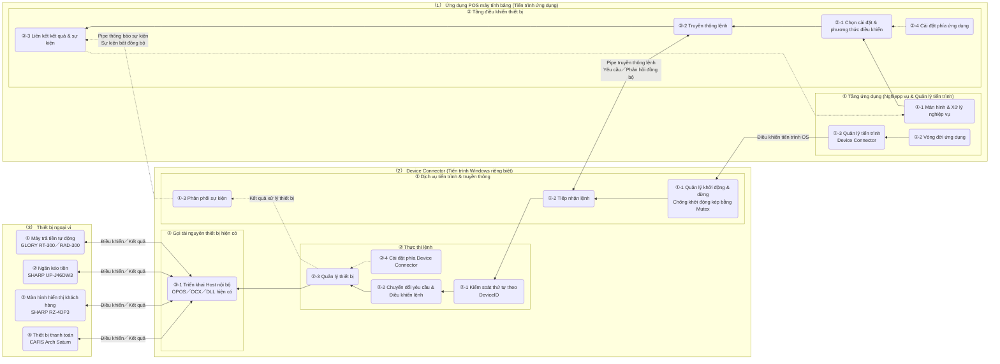

# ARCH-HOST-01 Tài liệu thiết kế cơ bản Device Connector Tablet POS

Tablet POS
ARCH-HOST-01 Tài liệu thiết kế cơ bản Device Connector
Mã tài liệu: ARCH-HOST-01
Phiên bản 0.3.8
Ngày 27 tháng 07 năm 2026

## 00_表紙

Hiển thị thông tin tài liệu, mục đích và đối tượng review của tài liệu này.

| 項目 | 内容 |
|---|---|
| 文書ID | ARCH-HOST-01 |
| 文書名 | タブレットPOS デバイスコネクタ基本設計書 (Tài liệu thiết kế cơ bản Device Connector Tablet POS) |
| 対象 | Device Connector và liên kết giữa các tiến trình (IPC) với ứng dụng POS trên máy tính bảng |
| 版数 | 0.3.8 |
| 作成日 | 2026/07/07 |
| 作成者 | VTI Sam, VTI Yoshida |
| レビュー担当 | SMJ Kamada |
| 承認者 | SMJ Kamada |
| 目的 | Định nghĩa vai trò, chức năng, giao diện, cấu hình, xử lý lỗi và log của Device Connector dưới dạng thiết kế cơ bản, nhằm sử dụng các tài nguyên phần cứng hiện có (OPOS, OCX, ActiveX, DLL hiện có) không thể sử dụng trực tiếp từ ứng dụng POS máy tính bảng bằng cách thực thi trong một tiến trình riêng biệt. |
| 期待成果 | Tạo trạng thái sẵn sàng để review lý do tách ứng dụng POS máy tính bảng và Device Connector, ranh giới trách nhiệm giữa hai tiến trình, hợp đồng truyền thông và xử lý trong quá trình vận hành như một thiết kế đồng nhất. |
| 想定形式 | Cấu trúc cho phép xác nhận từng sheet thiết kế từ mục lục. |

## 01_改訂履歴

Hiển thị phiên bản và nội dung thay đổi chính của tài liệu này.

| 版数 | 日付 | 変更内容 | 作成者 | 承認者 |
|---|---|---|---|---|
| 0.3.8 | 2026/07/27 | Thống nhất model K's sử dụng thành Customer Display RZ-4DP3 và Drawer UP-J46DW3; xóa nội dung coi tên đăng ký OCX là model thiết bị được hỗ trợ. | VTI Sam | |
| 0.3.7 | 2026/07/24 | Đồng nhất số thứ tự giai đoạn và toàn bộ xử lý giữa sơ đồ kịch bản vận hành và phần giải thích, tích hợp sự kiện bất đồng bộ vào giai đoạn thao tác thiết bị. Đồng nhất tên gọi cài đặt điều khiển thiết bị thành Cài đặt Runtime / Cài đặt Mặc định, đồng nhất quy chuẩn hiển thị sơ đồ theo phương thức tham chiếu chú giải (凡例). | VTI Sam | |
| 0.3.6 | 2026/07/21 | Xác định giá trị thiết kế cho phân loại thiết bị khả dụng phía ứng dụng, ID cài đặt phía ứng dụng, ID thiết bị và id/name/classId phía Device Connector của CAFIS Arch Saturn, phản ánh vào phạm vi đối tượng, thiết kế truyền thông/dữ liệu, thiết kế cài đặt/thiết bị và đối ứng cài đặt. Sắp xếp lại biểu hiện chưa chốt và ví dụ cài đặt trừu tượng. | VTI Sam | |
| 0.3.5 | 2026/07/21 | Thêm CAFIS Arch Saturn vào đối tượng ban đầu, phản ánh vào phạm vi đối tượng, cấu trúc tổng thể, thiết kế truyền thông/thiết bị, thiết kế bất thường/vận hành và đối ứng cài đặt. Làm rõ ranh giới trách nhiệm quản lý tiến trình Device Connector, điều khiển máy thực tế và cài đặt/bảo trì trên Windows. | VTI Sam | |
| 0.3.4 | 2026/07/17 | Làm rõ nhà sản xuất/tên dòng máy thiết bị đối tượng và phạm vi sử dụng OPOS/OCX. Phản ánh việc ngăn chặn khởi động kép bằng Mutex khi khởi động Device Connector và xử lý dừng khi kết thúc ứng dụng vào kịch bản vận hành, thiết kế chức năng, sơ đồ và đối ứng cài đặt. | VTI Sam | |
| 0.3.3 | 2026/07/14 | Làm rõ sự khác biệt môi trường thực thi giữa ứng dụng MAUI và OPOS/OCX/ActiveX/DLL hiện có làm lý do tách thành tiến trình riêng. Sắp xếp hình thức thực thi Device Connector, phương châm đối ứng thiết bị tương lai và tên gọi, xóa mô tả về phương thức truyền thông cũ. | VTI Sam | |
| 0.3.2 | 2026/07/13 | Tách riêng quy định màu và độ trong suốt của comment bổ sung, làm rõ quy chuẩn hiển thị nền vàng nhạt, viền màu hoàng thổ và chữ xám đậm. | VTI Sam | |
| 0.3.1 | 2026/07/13 | Đối với quan hệ trên sơ đồ, tách riêng vai trò của hướng mũi tên, màu sắc và kiểu đường nét; làm rõ quy chuẩn hiển thị xử lý chính, truyền thông lệnh, điều khiển máy thực tế, sự kiện bất đồng bộ, tham chiếu cài đặt và luồng bất thường. | VTI Sam | |
| 0.3.0 | 2026/07/12 | Tái thiết kế cấu trúc để có thể hiểu theo thứ tự: toàn bộ hệ thống -> nhóm trách nhiệm -> thành phần cấu tạo -> chức năng. Sắp xếp vai trò của 3 sơ đồ và văn bản, tập trung phần giải thích xử lý trùng lặp vào từng chương thiết kế. | VTI Sam | |
| 0.2.29 | 2026/07/11 | Tích hợp thiết bị đối tượng vào phạm vi đối tượng, bãi bỏ thiết kế theo từng thiết bị đơn lẻ. Sắp xếp hiển thị các bước chi tiết chức năng và đánh số từng danh sách. | VTI Sam | |
| 0.2.28 | 2026/07/11 | Tích hợp thiết kế vòng đời (Lifecycle) trùng lặp với luồng vận hành thông thường, tập trung trách nhiệm quản lý và xử lý khi bảo trì/debug vào phần giải thích vận hành thông thường. | VTI Sam | |
| 0.2.27 | 2026/07/11 | Thêm quy chuẩn hiển thị comment bổ sung (chỉ hiển thị cho thành phần khó hiểu) vào chú giải. | VTI Sam | |
| 0.2.26 | 2026/07/11 | Tích hợp xử lý yêu cầu thao tác thiết bị và vòng đời vào luồng vận hành thông thường, thay đổi sang cấu trúc cho phép xác nhận khởi động, thao tác, kết thúc và các luồng bất thường chính trong 1 sơ đồ. | VTI Sam | |
| 0.2.25 | 2026/07/11 | Phản ánh thử lại truyền thông, cấm gửi lại, kết nối lại sự kiện, phân loại bất異常 và điều kiện thời gian xác nhận hoạt động vào từng sơ đồ xử lý. | VTI Sam | |
| 0.2.24 | 2026/07/11 | Chốt phương châm thiết kế đối với xác nhận chuẩn bị khởi động tiến trình, dừng tiến trình sở hữu, nhận sự kiện bất đồng bộ, thử lại truyền thông, đọc cài đặt, xử lý lỗi và log. Cập nhật cấu trúc tổng thể và vòng đời. | VTI Sam | |
| 0.2.23 | 2026/07/11 | Làm rõ luồng phản hồi đồng bộ và xác nhận kết thúc tiến trình, tách biệt thất bại thao tác thiết bị và thất bại truyền thông. Sắp xếp điều khiển dừng thông thường và mô tả thiết bị ngoài đối tượng từ danh sách lỗi. | VTI Sam | |
| 0.2.21 | 2026/07/10 | Thay đổi cấu trúc tổng thể thành cấu trúc 2 tầng gồm Sơ đồ khái quát tổng thể (hiển thị 3 vùng trách nhiệm và luồng chính) và Sơ đồ cấu trúc chi tiết. | VTI Sam | |
| 0.2.16 | 2026/07/10 | Đồng nhất tên gọi logic trong văn bản và sơ đồ sang tiếng Nhật, sắp xếp lại vị trí ghi mã định danh vật lý. | VTI Sam | |
| 0.2.8 | 2026/07/08 | Tạo mới tài liệu thiết kế cơ bản Device Connector. | VTI Sam | |

## 目次

Hiển thị các mục thiết kế của tài liệu này và sheet tương ứng.

| No | 資料名称 | 備考 | No | 資料名称 | 備考 |
|---|---|---|---|---|---|
| ① | Trang bìa | 00_表紙 | ⑧ | Sơ đồ kịch bản vận hành | 06_運用シナリオ_01 |
| ② | Lịch sử sửa đổi | 01_改訂履歴 | ⑨ | Giải thích kịch bản vận hành | 06_運用シナリオ_02 |
| ③ | Khái quát | 02_概要 | ⑩ | Thiết kế chức năng | 07_機能設計 |
| ④ | Phạm vi đối tượng | 03_対象範囲 | ⑪ | Thiết kế truyền thông & dữ liệu | 08_通信・データ設計 |
| ⑤ | Tài liệu liên quan | 04_関連資料 | ⑫ | Thiết kế cài đặt & thiết bị | 09_設定・デバイス設計 |
| ⑥ | Sơ đồ cấu trúc hệ thống / logic | 05_全体構成_01 | ⑬ | Thiết kế bất thường & vận hành | 10_異常・運用設計 |
| ⑦ | Tầng trách nhiệm & thành phần cấu tạo | 05_全体構成_02 | ⑭ | Đối ứng cài đặt / triển khai | 11_実装対応 |

## 02_概要

Trình bày mục đích đặt Device Connector, vị trí trong hệ thống và các nguyên tắc thiết kế cơ bản.

### 2.1 設計目的と結論

Ứng dụng POS trên máy tính bảng chạy trên môi trường .NET MAUI, do đó không thực thi trực tiếp các tài nguyên OPOS, OCX, ActiveX và DLL hiện có mà thiết bị hiện tại đang sử dụng bên trong tiến trình ứng dụng. Để tiếp tục sử dụng các tài受信 thiết bị hiện có này trong môi trường thực thi Windows cần thiết, Device Connector được bố trí như một tiến trình riêng biệt với ứng dụng POS máy tính bảng.

Tầng ứng dụng yêu cầu tầng điều khiển thiết bị thực hiện các thao tác thiết bị cần thiết cho nghiệp vụ. Tầng điều khiển thiết bị chuyển đổi yêu cầu và kết quả sang định dạng nội bộ ứng dụng, đồng thời truyền thông với Device Connector qua Named Pipe. Device Connector đảm nhận việc đảm bảo thứ tự yêu cầu, lựa chọn thiết bị đối tượng, gọi các tài nguyên thiết bị hiện có và phân phối sự kiện bất đồng bộ. Nhờ ranh giới này, tầng ứng dụng không gọi trực tiếp OPOS, OCX, ActiveX, DLL hiện có hoặc các xử lý nội bộ của Device Connector.

Device Connector đóng vai trò là ranh giới tương thích nhằm tiếp tục sử dụng các thiết bị hiện có đang dùng ở hệ thống POS hiện tại. Các thiết bị thêm mới trong tương lai sẽ được điều khiển trực tiếp từ ứng dụng máy tính bảng, trừ trường hợp bắt buộc phải sử dụng tài nguyên thiết bị hiện có.

### 2.2 システム内の位置付け

| 責務領域 | 担当する内容 | 担当しない内容 |
|---|---|---|
| Ứng dụng POS máy tính bảng | Màn hình/Đánh giá nghiệp vụ, yêu cầu thao tác thiết bị, sử dụng kết quả xử lý; tự động quản lý việc xác nhận tồn tại/khởi động/xác nhận hoạt động/dừng/giám sát kết thúc tiến trình Device Connector. | Gọi trực tiếp OPOS, OCX, ActiveX, DLL hiện có và xử lý nội bộ Device Connector. |
| Device Connector | Truyền thông giữa các tiến trình (IPC), kiểm soát thứ tự yêu cầu, xử lý lệnh, quản lý thiết bị, gọi tài nguyên thiết bị hiện có, điều khiển máy thực tế, phân phối sự kiện bất đồng bộ. Trong vận hành thông thường không hiển thị màn hình, chạy ngầm dưới background. | Hiển thị màn hình nghiệp vụ, đánh giá khả năng tiếp tục nghiệp vụ, quyết định thông điệp cho người dùng. Màn hình debug chỉ hiển thị khi bảo trì/debug. |
| Cài đặt & Bảo trì Windows | Cài đặt Driver, đăng ký COM/OCX, cài đặt OPOS Service Object & tên thiết bị logic, cài đặt kết nối CAFIS Arch và bảo trì log của vendor. | Khởi động/dừng thủ công tiến trình Device Connector trong vận hành thông thường. |
| Thiết bị ngoại vi | Xử lý thực tế như trả tiền thừa, mở ngăn kéo, hiển thị màn hình khách hàng và thanh toán CAFIS Arch. | Truyền thông trực tiếp với tầng ứng dụng. |

### 2.3 基本設計原則

| No. | 原則 | 設計内容 |
|---|---|---|
| ① | Tương thích thiết bị hiện có | Thu gọn OPOS, OCX, ActiveX và DLL hiện có (không sử dụng trực tiếp từ ứng dụng MAUI) vào bên trong Device Connector. |
| ② | Phân tách trách nhiệm | Phân tách đánh giá nghiệp vụ, kiểm soát truyền thông và điều khiển máy thực tế; không gọi trực tiếp vượt ranh giới trách nhiệm. |
| ③ | Phân tách truyền thông | Yêu cầu lệnh và phản hồi đồng bộ xử lý qua Pipe truyền thông lệnh; thông báo kết quả xử lý thiết bị xử lý qua Pipe thông báo sự kiện. |
| ④ | Đảm bảo thứ tự | Yêu cầu có cùng DeviceID được xử lý theo thứ tự vào; yêu cầu có DeviceID khác nhau không cản trở xử lý lẫn nhau. |
| ⑤ | Ngăn chặn thực thi lặp | Thử lại kết nối truyền thông giới hạn trước khi gửi yêu cầu; không tự động gửi lại cùng yêu cầu nếu không thể xác định kết quả sau khi gửi. |
| ⑥ | Ngăn chặn khởi động kép | Device Connector thực hiện độc quyền bằng Mutex, không khởi động nhiều tiến trình đồng thời. |
| ⑦ | Vòng đời an toàn | Tầng ứng dụng chỉ dừng tiến trình Device Connector do chính mình khởi động, không dừng tiến trình không thuộc sở hữu. |
| ⑧ | Phân tách trách nhiệm cài đặt | Cài đặt phía ứng dụng quyết định phương thức điều khiển; cài đặt phía Device Connector quyết định triển khai host nội bộ khởi động. |
| ⑨ | Phân tách trách nhiệm vận hành & bảo trì | Quản lý tiến trình trong vận hành thông thường do ứng dụng POS máy tính bảng tự động thực hiện; cài đặt Driver, đăng ký COM/OCX, cài đặt OPOS/CAFIS Arch trên Windows tách riêng thành công việc cài đặt/bảo trì. |

Quản lý tiến trình Device Connector được thiết kế và phát triển như một chức năng bên trong ứng dụng POS máy tính bảng. Phía Device Connector thực hiện điều khiển độc quyền bằng Mutex, ngăn chặn khởi động kép ngay cả khi nhận nhiều yêu cầu khởi động trùng lặp từ ứng dụng.

### 2.4 本書の読み方

Tài liệu này xác nhận từ phạm vi đối tượng đến đối ứng cài đặt theo thứ tự sau. Mỗi chương cụ thể hóa nội dung đã định nghĩa ở chương trước theo các góc nhìn tương ứng:

① Tại 03_対象範囲, xác nhận trách nhiệm đối tượng thiết kế, thiết bị đối tượng và các phần ngoài đối tượng.

② Tại 05_全体構成, xác nhận quan hệ giữa các vùng trách nhiệm, nhóm trách nhiệm và thành成分 cấu tạo logic đảm nhận phạm vi đối tượng.

③ Tại 06_運用シナリオ, xác nhận các thành phần cấu tạo liên kết như thế nào trong khởi động, thao tác thiết bị, sự kiện bất đồng bộ và kết thúc.

④ Tại 07_機能設計, xác nhận các chức năng thực hiện trách nhiệm cấu trúc tổng thể & kịch bản vận hành, cũng như cách xử lý lúc bình thường / bất thường của từng chức năng.

⑤ Tại 08_通信・データ設計 và 09_設定・デバイス設計, xác nhận hợp đồng truyền thông, mục dữ liệu, phân tách trách nhiệm cài đặt và đối ứng thiết bị để thực thi chức năng.

⑥ Tại 10_異常・運用設計, xác nhận phân loại lỗi phát sinh trong từng xử lý, phương châm khôi phục và xuất log.

⑦ Tại 11_実装対応, xác nhận các thành phần cấu tạo logic và chức năng tương ứng như thế nào với Class vật lý và quy cách liên quan khi triển khai.

Trong quá trình review, xác nhận phạm vi đối tượng, trách nhiệm, kịch bản vận hành, chức năng, truyền thông/cài đặt, xử lý bất thường và đối ứng triển khai không mâu thuẫn lẫn nhau như một luồng thống nhất.

### 2.5 レビュー判断

Xác nhận ranh giới trách nhiệm, kịch bản vận hành, hợp đồng truyền thông, phân tách trách nhiệm cài đặt, điều kiện tiếp tục/dừng lúc bất thường và đối ứng triển khai không mâu thuẫn lẫn nhau, từ đó đánh giá tính hợp lý của thiết kế cơ bản Device Connector.

## 03_対象範囲

Hiển thị trách nhiệm là đối tượng thiết kế, thiết bị đối tượng và phạm vi xử lý trong tài liệu khác.

### 3.1 対象

① Ranh giới trách nhiệm giữa ứng dụng POS máy tính bảng và Device Connector, cùng hợp đồng truyền thông giữa hai tiến trình.

② Khởi động, xác nhận hoạt động, dừng thông thường, giám sát kết thúc và cưỡng chế kết thúc tiến trình sở hữu đối với tiến trình Device Connector.

③ Tiếp nhận yêu cầu thao tác thiết bị, kiểm soát thứ tự theo DeviceID, điều khiển máy thực tế, phản hồi đồng bộ và thông báo sự kiện bất đồng bộ.

④ Phân tách trách nhiệm cài đặt giữa phía ứng dụng và phía Device Connector, điều kiện khởi động thiết bị đối tượng và tương ứng DeviceID.

⑤ Phân loại bất thường, phương châm khôi phục, xuất log phát sinh trong khởi động, truyền thông, thao tác thiết bị, thông báo sự kiện và dừng.

⑥ Hình thức thực thi quản lý các tài nguyên thiết bị hiện có bằng một tiến trình Device Connector duy nhất, chạy ngầm dưới background trong vận hành thông thường.

### 3.2 対象デバイス

Đối tượng ban đầu gồm 4 loại: Máy bán/trả tiền thừa tự động GLORY RT-300/RAD-300, Ngăn kéo đựng tiền SHARP UP-J46DW3, Màn hình hiển thị khách hàng SHARP RZ-4DP3, Thiết bị thanh toán CAFIS Arch Saturn. Tên dòng máy, tài nguyên thiết bị hiện có sử dụng tại Device Connector và tương ứng giữa cài đặt phía ứng dụng với cài đặt phía Device Connector như sau:

#### 3.2.1 デバイスID対応

| 対象デバイス | メーカー／機種名 | 利用する既存デバイス資源 | アプリ側有効デバイス区分 | アプリ側設定ID | デバイスコネクタ要求のデバイスID（DeviceId） | デバイスコネクタ側設定（id / classId） |
|---|---|---|---|---|---|---|
| Máy bán/trả tiền tự động | GLORY RT-300／RAD-300 | OPOS／OCX | local_cashchanger | cash_changer_glory_rt300_windows | Máy trả tiền thừa (CashChanger) | CashChanger / CashChanger1 |
| Ngăn kéo đựng tiền | SHARP UP-J46DW3 | OCX | local_drawer | drawer_external_windows | Ngăn kéo tiền (CashDrawer) | CashDrawer / CashDrawer1 |
| Màn hình hiển thị khách hàng | SHARP RZ-4DP3 | OPOS／OCX | local_display | customer_display_sharp_windows | Màn hình hiển thị (CustomerDisplay) | CustomerDisplay / CustomerDisplay1 |
| Thiết bị thanh toán | CAFIS Arch Saturn | OPOS／OCX（CAT） | local_payment | payment_cafis_arch_saturn_windows | Thiết bị thanh toán (Payment) | Payment / Payment1 |

### 3.3 対象外

① Các mục màn hình, chuyển màn hình, câu từ cho người dùng và đánh giá khả năng tiếp tục nghiệp vụ được xử lý ở thiết kế phía ứng dụng.

② Phương thức điều khiển trực tiếp bên trong phần điều khiển thiết bị nằm ngoài đối tượng; đối tượng là phạm vi sử dụng tài nguyên thiết bị hiện có thông qua Device Connector.

③ Private method, biến nội bộ và nhánh chi tiết triển khai của từng Class riêng biệt được xử lý tại tài liệu quy cách chương trình (Program Specification).

④ Cài đặt OPOS, cài đặt Driver và cài đặt máy thực tế tại cửa hàng được xử lý tại tài liệu hướng dẫn vận hành hoặc hướng dẫn cài đặt.

⑤ Các thiết bị thêm mới trong tương lai không ghi tại 3.2 (như máy in, máy quét mã vạch) không bao gồm trong đối tượng ban đầu.

### 3.4 将来機器の対応方針

Các thiết bị thêm mới trong tương lai sẽ được điều khiển trực tiếp từ ứng dụng máy tính bảng (tương tự như iPad), trừ trường hợp bắt buộc phải sử dụng OPOS, OCX, ActiveX hoặc DLL hiện có. CAFIS Arch Saturn thuộc đối tượng ban đầu do sử dụng OPOS/OCX trên Windows nên được điều khiển qua Device Connector. Device Connector chỉ được sử dụng giới hạn cho trường hợp tiếp tục dùng thiết bị hiện có của hệ thống POS hiện tại.

Sau khi kết thúc việc sử dụng các thiết bị hiện có điều khiển qua Device Connector, cấu trúc cho phép loại bỏ Device Connector như một tài nguyên không còn cần thiết.

## 04_関連資料

Hiển thị các tài liệu thiết kế cấu trúc, hướng dẫn cài đặt và quy cách chương trình làm tiền đề cho tài liệu này.

| 文書ID | 文書名 | 本書との関係 |
|---|---|---|
| ARCH-01 | Tài liệu thiết kế cấu trúc phần mềm Tablet POS | Tài liệu tiền đề cho cấu trúc tổng thể Tablet POS. |
| ARCH-02 | Tài liệu thiết kế cấu trúc ứng dụng thiết bị Tablet POS | Tài liệu tiền đề cho cấu trúc phía ứng dụng trên thiết bị. |
| ARCH-03 | Tài liệu thiết kế cấu trúc Device Connector Tablet POS | Tài liệu tiền đề cho cấu trúc, trách nhiệm và thành phần chính của Device Connector. |
| CFG-01 | Hướng dẫn ghi file cài đặt điều khiển thiết bị Tablet POS | Hướng dẫn ghi file device_controller_config.json và host_device_config.json. |
| PS-HOST-01 | Command Server Named Pipe | Quy cách chương trình cho bộ phận nhận lệnh. |
| PS-HOST-02 | Device Host Adapter Named Pipe | Quy cách chương trình cho Adapter truyền thông Device Connector. |
| PS-HOST-03 | Device Command Router | Quy cách chương trình cho việc kiểm soát thứ tự theo DeviceID. |
| PS-HOST-04 | Device Command Handler | Quy cách phân loại yêu cầu điều khiển Device Connector và yêu cầu thao tác thiết bị. |
| PS-HOST-05 | Device Server Host | Quy cách khởi động, dừng và quản lý truyền thông của bản thân Device Connector. |
| PS-HOST-06 | Device Manager | Quy cách khởi tạo, lưu giữ, tìm kiếm và dừng thiết bị. |
| PS-HOST-07 | Device Base | Quy cách xử lý cơ sở chung cho các thiết bị. |
| PS-HOST-08 | Điều khiển máy trả tiền tự động GLORY RT-300／RAD-300 | Quy cách chương trình cho máy trả tiền tự động GLORY RT-300/RAD-300. |
| PS-HOST-10 | Điều khiển ngăn kéo đựng tiền SHARP UP-J46DW3 | Quy cách chương trình cho ngăn kéo tiền SHARP UP-J46DW3. |
| PS-HOST-11 | Điều khiển màn hình hiển thị SHARP RZ-4DP3 | Quy cách chương trình cho màn hình hiển thị khách hàng SHARP RZ-4DP3. |
| DC-PAY-WIN-001 | Strategy thanh toán OPOS CAFIS Arch | Thiết kế kết nối, ngắt kết nối, xác nhận thông suốt, thực thi thanh toán và in lại cho CAFIS Arch Saturn. |

## 05_全体構成_01

Hiển thị ranh giới toàn bộ hệ thống và các phần tử logic cấu thành từng vùng trách nhiệm qua sơ đồ 2 giai đoạn.

### 5.1 全体構成

#### 凡例

Quy tắc hiển thị của mục này áp dụng chung cho tất cả các sơ đồ trong tài liệu này.

Hướng mũi tên thể hiện hướng của mối quan hệ; màu sắc và kiểu đường thể hiện ý nghĩa của mối quan hệ. Chỉ các quan hệ gửi/nhận Yêu cầu và Phản hồi đồng bộ, hoặc Điều khiển máy thực tế và Kết quả trên 1 đường truyền thông mới hiển thị hai chiều; các thứ tự xử lý, điều khiển, thông báo, tham chiếu và nhánh bất thường khác hiển thị một chiều.

| 表示 | 色 | 意味 |
|---|---|---|
| (1) Ứng dụng POS máy tính bảng | 背景:#F7FBFF / 枠線:#4472C4 / 文字:#111111 / 太さ:2 | Thể hiện ranh giới trách nhiệm của tiến trình ứng dụng gồm tầng ứng dụng và tầng điều khiển thiết bị. |
| (2) Device Connector | 背景:#FCE4D6 / 枠線:#ED7D31 / 文字:#111111 / 太さ:2 | Thể hiện tiến trình Windows riêng biệt đảm nhận điều khiển thiết bị hiện có dùng OPOS, OCX, ActiveX, DLL. |
| (3) Thiết bị ngoại vi | 背景:#E4DFEC / 枠線:#8064A2 / 文字:#111111 / 太さ:2 | Thể hiện máy thực tế được điều khiển từ Device Connector. |
| Nhóm trách nhiệm (khung trong vùng trách nhiệm) | 背景:透明 / 枠線:#ED7D31 / 文字:#111111 / 太さ:2 | Thể hiện tập hợp các phần tử cấu tạo logic có cùng mục đích. |
| Khối bo góc | 背景:#F8FBFD / 枠線:#0D32B2 / 文字:#111111 / 太さ:2 | Thể hiện phần tử cấu tạo logic, xử lý hoặc thiết bị đối tượng. |
| Tầng ứng dụng | 背景:#DDEBF7 / 枠線:#5B9BD5 / 文字:#111111 / 太さ:2 | Thể hiện xử lý đảm nhận khởi động ứng dụng, đánh giá tiếp tục nghiệp vụ và quản lý kết thúc. |
| Tầng điều khiển thiết bị | 背景:#E2F0D9 / 枠線:#70AD47 / 文字:#111111 / 太さ:2 | Thể hiện xử lý đảm nhận yêu cầu thao tác thiết bị, truyền thông và liên kết kết quả. |
| Xử lý trong Device Connector | 背景:#FCE4D6 / 枠線:#ED7D31 / 文字:#111111 / 太さ:2 | Thể hiện khởi động, truyền thông, quản lý thiết bị và gọi máy thực tế bên trong Device Connector. |
| ◇ | 背景:#FFF2CC / 枠線:#BF9000 / 文字:#111111 / 太さ:2 | Thể hiện phán đoán quyết định xử lý tiếp theo. |
| Xử lý bất thường | 背景:#F4CCCC / 枠線:#C00000 / 文字:#111111 / 太さ:2 | Thể hiện kết quả bất thường chính như hủy khởi động, thất bại truyền thông hoặc cưỡng chế kết thúc. |
| Giai đoạn vận hành | 背景:#FFFFFF / 枠線:#4472C4 / 文字:#111111 / 太さ:2 | Thể hiện sự phân chia giữa khởi động, thao tác thiết bị và kết thúc. |
| Tên logic thiết bị đối tượng ban đầu | 背景:#FFFFFF / 枠線:#7F7F7F / 文字:#111111 / 太さ:1 | Trong sơ đồ biểu thị là Máy trả tiền (RT-300), Ngăn kéo tiền (SHARP), Màn hình hiển thị (SHARP), Thiết bị thanh toán (CAFIS Arch Saturn). |
| Nhãn Connector | 背景:#FFFFFF / 枠線:透明 / 文字:#111111 / 太さ:0 | Nhãn đè lên giữa connector, che đường phía sau để dễ đọc mối quan hệ. |
| ━━▶ Xử lý chính | 線:#1F4E79 / 線種:実線 / 太さ:2 | Thể hiện thứ tự xử lý thông thường hoặc yêu cầu một chiều. |
| ◀━━▶ Truyền thông lệnh | 線:#1F4E79 / 線種:実線 / 太さ:3 | Thể hiện quan hệ gửi/nhận yêu cầu từ ứng dụng và phản hồi đồng bộ từ Device Connector trên cùng đường truyền thông. |
| ━━▶ Vòng đời (Lifecycle) | 線:#548235 / 線種:実線 / 太さ:2 | Thể hiện khởi động, dừng và giám sát kết thúc của tiến trình. |
| ◀━━▶ Điều khiển máy thực tế | 線:#7030A0 / 線種:実線 / 太さ:2 | Thể hiện điều khiển và kết quả giữa Device Connector và thiết bị ngoại vi. |
| ┄┄▶ Sự kiện bất đồng bộ | 線:#C65911 / 線種:破線 / 太さ:2 | Thể hiện thông báo kết quả xử lý thiết bị được gửi riêng biệt với phản hồi đồng bộ. |
| ┈┈▶ Tham chiếu cài đặt | 線:#7F7F7F / 線種:破線 / 太さ:2 | Thể hiện quan hệ tham chiếu thông tin cài đặt. |
| ┄┄▶ Luồng bất thường | 線:#C00000 / 線種:破線 / 太さ:2 | Thể hiện luồng rẽ nhánh từ luồng thông thường sang kết quả bất thường hoặc xử lý khôi phục. |

#### 5.1.1 システムコンテキスト図

```mermaid
%%{init: {"flowchart": {"defaultRenderer": "dagre", "curve": "linear", "nodeSpacing": 54, "rankSpacing": 92}}}%%
flowchart LR
    %% legend-bind class.app=（1）タブレットPOS端末アプリ
    %% legend-bind class.host=（2）デバイスコネクタ
    %% legend-bind class.device=（3）周辺機器
    %% legend-bind edge.default=◀━━▶ コマンド通信
    %% legend-bind edge.1=┄┄▶ 非同期イベント
    %% legend-bind edge.2=◀━━▶ 実機制御
    %% legend-bind label=コネクターラベル
    APP("（1） Ứng dụng POS máy tính bảng<br/>Tiến trình MAUI<br/>Đánh giá nghiệp vụ／Yêu cầu thao tác thiết bị")
    HOST("（2） Device Connector<br/>Tiến trình Windows riêng biệt<br/>Gọi tài nguyên thiết bị hiện có")
    DEVICE("（3） Thiết bị ngoại vi<br/>Máy trả tiền tự động: GLORY RT-300／RAD-300<br/>Ngăn kéo tiền: SHARP UP-J46DW3<br/>Màn hình hiển thị: SHARP RZ-4DP3<br/>Thiết bị thanh toán: CAFIS Arch Saturn")

    APP <-->|Pipe truyền thông lệnh<br/>Yêu cầu (Ứng dụng → Connector)<br/>Phản hồi đồng bộ (Connector → Ứng dụng)| HOST
    HOST -.->|Pipe thông báo sự kiện<br/>Sự kiện bất đồng bộ (Connector → Ứng dụng)| APP
    HOST <-->|Điều khiển máy thực tế (Connector → Thiết bị)<br/>Kết quả (Thiết bị → Connector)| DEVICE

    class APP app
    class HOST host
    class DEVICE device
```

#### 5.1.2 論理構成図



#### 図の補足

- Sơ đồ ngữ cảnh hệ thống (5.1.1) chỉ hiển thị 3 vùng trách nhiệm, ranh giới tiến trình và truyền thông giữa các vùng.
- Sơ đồ cấu trúc logic (5.1.2) chia nhỏ từng vùng trách nhiệm thành nhóm trách nhiệm và phần tử cấu tạo logic. Nhóm trách nhiệm được thể hiện bằng khung trong màu cam có số ở đầu như "① Tầng ứng dụng". Số này tương ứng với mục 5.3.
- Ứng dụng POS máy tính bảng là tiến trình MAUI, Device Connector là tiến trình Windows riêng biệt sử dụng tài nguyên thiết bị hiện có, cả hai cùng chạy trên một máy tính bảng Windows. Việc gửi/nhận yêu cầu, phản hồi và thông báo sự kiện sử dụng Named Pipe.
- Tầng ứng dụng không gọi trực tiếp OPOS, OCX, ActiveX, DLL hiện có hoặc xử lý nội bộ Device Connector. Thao tác thiết bị được thực hiện qua tầng điều khiển thiết bị, việc khởi động/dừng tiến trình do Quản lý tiến trình Device Connector đảm nhận.
- Triển khai Host nội bộ phía Device Connector là phần tử cấu tạo nội bộ để gọi tài nguyên thiết bị hiện có, không phải Class Strategy phía ứng dụng.
- Thử lại, Timeout, Tiến trình sở hữu và các nhánh bất thường không thuộc cấu trúc tĩnh mà được thể hiện tại 06_運用シナリオ.

## 05_全体構成_02

Giải thích quan hệ giữa các vùng trách nhiệm, nhóm trách nhiệm và phần tử cấu tạo logic hiển thị ở Sơ đồ cấu trúc tổng thể.

### 5.2 構成の階層

| 区分 | 表現 | 説明 |
|---|---|---|
| Vùng trách nhiệm | (1) ~ (3) | Phạm vi trách nhiệm và ranh giới tiến trình cấu thành hệ thống. |
| Nhóm trách nhiệm | Khung trong của (1) & (2), Nhóm trách nhiệm ①~③ | Tập hợp các chức năng có cùng mục đích trong một vùng trách nhiệm. (3) Thiết bị ngoại vi không đặt nhóm trách nhiệm. |
| Thành phần cấu tạo logic | ①-1, ①-2,... (3) là ①~④ | Thành phần cấu tạo đảm nhận việc xử lý hoặc truyền nhận dữ liệu. |

### 5.3 責務領域と構成要素

(1) Ứng dụng POS máy tính bảng đảm nhận đánh giá nghiệp vụ và sử dụng thiết bị, không trực tiếp xử lý điều khiển máy thực tế bên trong Device Connector.

  ① Tầng ứng dụng (Nghệ nghiệp & Quản lý tiến trình) quản lý việc sử dụng thiết bị về mặt nghiệp vụ và vòng đời của tiến trình Device Connector.

    ①-1 Màn hình & Xử lý nghiệp vụ yêu cầu các thao tác thiết bị cần thiết, phản ánh kết quả đồng bộ hoặc sự kiện bất đồng bộ vào xử lý nghiệp vụ.
      Sheet liên quan: 06_運用シナリオ_02, 07_機能設計
    ①-2 Vòng đời ứng dụng thông báo việc khởi động, khôi phục, tạm dừng và cưỡng chế kết thúc ứng dụng cho Quản lý tiến trình.
      Sheet liên quan: 06_運用シナリオ_02
    ①-3 Quản lý tiến trình Device Connector kiểm tra sự tồn tại/hoạt động của tiến trình hiện có, khởi động khi chưa chạy, yêu cầu dừng và giám sát kết thúc tiến trình sở hữu.
      Sheet liên quan: 06_運用シナリオ_02, 07_機能設計, 10_異常・運用設計

  ② Tầng điều khiển thiết bị chuyển đổi yêu cầu trong ứng dụng sang truyền thông IPC, và trả kết quả về tầng ứng dụng.

    ②-1 Chọn cài đặt & phương thức điều khiển lựa chọn thiết bị khả dụng và phương thức điều khiển qua Device Connector từ cài đặt đã đọc.
      Sheet liên quan: 07_機能設計, 09_設定・デバイス設計
    ②-2 Truyền thông lệnh tạo yêu cầu, gửi qua Pipe truyền thông lệnh và nhận phản hồi đồng bộ.
      Sheet liên quan: 07_機能設計, 08_通信・データ設計
    ②-3 Liên kết kết quả & sự kiện chuyển đổi phản hồi đồng bộ và sự kiện bất đồng bộ sang định dạng kết quả trong ứng dụng để thông báo.
      Sheet liên quan: 07_機能設計, 08_通信・データ設計, 10_異常・運用設計

(2) Device Connector lưu giữ các tài nguyên thiết bị hiện có (không sử dụng trực tiếp từ ứng dụng MAUI) bên trong một tiến trình Windows riêng biệt, đảm nhận kiểm soát yêu cầu và điều khiển máy thực tế.

  ① Dịch vụ tiến trình & truyền thông quản lý trạng thái hoạt động của Device Connector và 2 Named Pipe.

    ①-1 Quản lý khởi động & dừng ngăn chặn khởi động kép bằng điều khiển độc quyền Mutex, bắt đầu/dừng dịch vụ truyền thông và quản lý thiết bị để quản lý trạng thái hoạt động.
      Sheet liên quan: 06_運用シナリオ_02, 07_機能設計, 10_異常・運用設計
    ①-2 Tiếp nhận lệnh tiếp nhận 1 yêu cầu trên mỗi kết nối, và trả về phản hồi đồng bộ trên cùng kết nối đó.
      Sheet liên quan: 07_機能設計, 08_通信・データ設計
    ①-3 Phân phối sự kiện gửi kết quả xử lý thiết bị đến đích kết nối của Pipe thông báo sự kiện.
      Sheet liên quan: 07_機能設計, 08_通信・データ設計

  ② Thực thi lệnh kiểm soát thứ tự yêu cầu đã nhận, chuyển đổi kết quả thực thi của thiết bị đối tượng thành phản hồi.

    ②-1 Kiểm soát thứ tự theo DeviceID xử lý các yêu cầu có cùng DeviceID theo thứ tự vào.
      Sheet liên quan: 06_運用シナリオ_02, 07_機能設計
    ②-2 Chuyển đổi yêu cầu & Điều khiển lệnh chuyển đổi định dạng truyền thông sang yêu cầu nội bộ, thực thi như một yêu cầu điều khiển hoặc yêu cầu thao tác thiết bị.
      Sheet liên quan: 07_機能設計, 08_通信・データ設計, 10_異常・運用設計
    ②-3 Quản lý thiết bị quản lý việc tạo, lưu giữ, tìm kiếm, thực thi và dừng thiết bị dựa trên cài đặt.
      Sheet liên quan: 07_機能設計, 09_設定・デバイス設計, 10_異常・運用設計

  ③ Gọi tài nguyên thiết bị hiện có thu gọn sự khác biệt của tài nguyên thiết bị hiện có vào bên trong Device Connector. Xử lý như một triển khai Host nội bộ để gọi thiết bị hiện có, không phải Class Strategy phía ứng dụng.

    ③-1 Triển khai Host nội bộ điều khiển máy thực tế bằng cách sử dụng OPOS, OCX, ActiveX, DLL hiện có, bộ nhớ chia sẻ, file yêu cầu/phản hồi,...
      Sheet liên quan: 09_設定・デバイス設計, 11_実装対応

(3) Thiết bị ngoại vi là thiết bị cửa hàng được điều khiển từ triển khai Host nội bộ của Device Connector.

  ① Máy trả tiền tự động (GLORY RT-300／RAD-300) thực hiện nạp tiền, rút tiền, kiểm tra trạng thái và kiểm tra lỗi.
    Sheet liên quan: 03_対象範囲, 09_設定・デバイス設計
  ② Ngăn kéo tiền (SHARP UP-J46DW3) thực hiện mở ngăn kéo.
    Sheet liên quan: 03_対象範囲, 09_設定・デバイス設計
  ③ Màn hình hiển thị khách hàng (SHARP RZ-4DP3) thực hiện hiển thị, xóa, cuộn và hiển thị chỉ định vị trí.
    Sheet liên quan: 03_対象範囲, 09_設定・デバイス設計
  ④ Thiết bị thanh toán (CAFIS Arch Saturn) thực hiện kết nối thiết bị, ngắt kết nối, kiểm tra thông suốt, thực thi thanh toán và in lại.
    Sheet liên quan: 03_対象範囲, 08_通信・データ設計, 09_設定・デバイス設計

### 5.4 デバイスコネクタの実行形態

Trong thiết kế này, các tài nguyên thiết bị hiện có của máy trả tiền tự động GLORY RT-300/RAD-300, ngăn kéo tiền SHARP UP-J46DW3, màn hình hiển thị SHARP RZ-4DP3 và thiết bị thanh toán CAFIS Arch Saturn được quản lý bởi một tiến trình Device Connector duy nhất. Device Connector thực hiện điều khiển độc quyền bằng Mutex để ngăn chặn khởi động kép.

Trong vận hành thông thường không hiển thị màn hình, chạy ngầm dưới background. Màn hình điều khiển khởi động/dừng trực tiếp Device Connector chỉ hiển thị khi khởi động kèm tham số debug (DEBUG).

## 06_運用シナリオ_01

Hiển thị các thành phần cấu tạo tĩnh liên kết với nhau như thế nào trong từng giai đoạn: Khởi động, Thao tác thiết bị và Kết thúc. Sự kiện bất đồng bộ được xử lý như một đường thông báo độc lập trong giai đoạn thao tác thiết bị.

### 6.1 運用シナリオ図

```mermaid
%%{init: {"flowchart": {"defaultRenderer": "dagre", "curve": "linear", "nodeSpacing": 30, "rankSpacing": 58}}}%%
flowchart LR
    %% legend-bind container=運用フェーズ
    %% legend-bind class.app=アプリケーション層
    %% legend-bind class.control=デバイス制御層
    %% legend-bind class.host=デバイスコネクタ内処理
    %% legend-bind class.decision=◇
    %% legend-bind class.error=異常処理
    %% legend-bind edge.default=━━▶ 主処理
    %% legend-bind edge.dashed=┄┄▶ 異常経路
    %% legend-bind edge.0=━━▶ ライフサイクル
    %% legend-bind edge.1=━━▶ ライフサイクル
    %% legend-bind edge.2=━━▶ ライフサイクル
    %% legend-bind edge.3=━━▶ ライフサイクル
    %% legend-bind edge.4=━━▶ ライフサイクル
    %% legend-bind edge.5=━━▶ ライフサイクル
    %% legend-bind edge.15=┄┄▶ 非同期イベント
    %% legend-bind edge.16=━━▶ ライフサイクル
    %% legend-bind edge.17=━━▶ ライフサイクル
    %% legend-bind edge.18=━━▶ ライフサイクル
    %% legend-bind edge.19=━━▶ ライフサイクル
    %% legend-bind edge.20=━━▶ ライフサイクル
    %% legend-bind edge.21=━━▶ ライフサイクル
    %% legend-bind edge.23=━━▶ ライフサイクル
    %% legend-bind edge.24=━━▶ ライフサイクル
    %% legend-bind edge.25=━━▶ ライフサイクル
    %% legend-bind label=コネクターラベル
    subgraph START["（1） Giai đoạn khởi động"]
        direction TB
        S1("① Khởi động ứng dụng")
        S2("② Chuẩn bị cài đặt<br/>Cài đặt Runtime → Cài đặt Mặc định")
        S3("③ Kiểm tra tiến trình hiện có<br/>chỉ khởi động khi chưa chạy")
        S4("④ Device Connector<br/>chống khởi động kép bằng Mutex")
        S5("⑤ Chuẩn bị truyền thông & thiết bị đối tượng")
        S6{"⑥ Chuẩn bị khởi động<br/>đã hoàn tất chưa?"}
        S7("⑦ Bắt đầu vận hành")
        START_ERROR("⑧ Hủy khởi động &<br/>Ghi nhận bất thường")

        S1 --> S2 --> S3 --> S4 --> S5 --> S6
        S6 -->|Có| S7
        S6 -.->|Không| START_ERROR
    end

    subgraph OPERATION["（2） Giai đoạn thao tác thiết bị"]
        direction TB
        O1("① Yêu cầu thao tác thiết bị")
        O2("② Xác nhận kết nối &<br/>gửi yêu cầu lệnh")
        O3("③ Kiểm soát thứ tự &<br/>điều khiển thiết bị đối tượng<br/>Thiết bị thanh toán dùng OPOS CAT／OCX")
        O4{"④ Đã xác định<br/>kết quả đồng bộ chưa?"}
        O5("⑤ Trả về phản hồi bình thường<br/>hoặc phản hồi thất bại")
        COMM_ERROR("⑥ Trả về thất bại truyền thông<br/>không tự động gửi lại sau khi gửi")
        O6{"⑦ Tiếp tục vận hành?"}
        EVENT("⑧ Thông báo sự kiện bất đồng bộ<br/>về ứng dụng")

        O1 --> O2 --> O3 --> O4
        O4 -->|Có| O5 --> O6
        O4 -.->|Không| COMM_ERROR --> O6
        O6 -->|Có| O1
        O3 -.->|Kết quả xử lý thiết bị| EVENT
    end

    subgraph STOP["（3） Giai đoạn kết thúc"]
        direction TB
        T1("① Dừng ứng dụng / Cưỡng chế kết thúc")
        T2{"② Có phải tiến trình sở hữu?"}
        T3("③ Gửi yêu cầu dừng")
        T4("④ Device Connector<br/>dừng kết nối và thiết bị")
        T5{"⑤ Đã kết thúc<br/>trong vòng 10 giây chưa?"}
        T6("⑥ Cưỡng chế kết thúc<br/>cây tiến trình sở hữu")
        T7("⑦ Hoàn tất xử lý kết thúc")

        T1 --> T2
        T2 -->|Không| T7
        T2 -->|Có| T3
        T3 --> T4 --> T5
        T5 -->|Có| T7
        T5 -.->|Không| T6 --> T7
    end

    S7 --> O1
    O6 -->|Không| T1

    class S1,S2,S3,S7,T1,T2,T3,T5,T7 app
    class O1,O2,O4,O5,O6 control
    class S4,S5,O3,EVENT,T4 host
    class S6,O4,O6,T2,T5 decision
    class START_ERROR,COMM_ERROR,T6 error
```



#### 図の補足

- Giai đoạn khởi động chuẩn bị lần lượt: Cài đặt, Xác nhận tiến trình hiện có, Ngăn chặn khởi động kép bằng Mutex, Truyền thông và Thiết bị đối tượng. Chỉ chuyển sang cài đặt mặc định khi không thể sử dụng cài đặt Runtime; nếu chưa hoàn tất chuẩn bị khởi động thì không bắt đầu vận hành.
- Bắt đầu thiết bị thử lại tối đa 3 lần với khoảng thời gian 50ms. Chỉ loại bỏ thiết bị thất bại cuối cùng khỏi danh sách đã khởi động, và tiếp tục xử lý khởi động với các thiết bị khác.
- Xác nhận hoạt động được thực hiện trong tối đa 10 giây với khoảng thời gian 500ms. Nếu file thực thi, cài đặt bắt buộc, khởi động tiến trình hoặc xác nhận hoạt động thất bại thì không bắt đầu vận hành.
- Kết nối lệnh chỉ thử lại tối đa 3 lần với khoảng thời gian 500ms trước khi gửi yêu cầu. Nếu không thể xác định kết quả đồng bộ sau khi gửi, không tự động gửi lại cùng yêu cầu để tránh thực thi lặp.
- Phản hồi thất bại là trạng thái Device Connector trả về kết quả bất thường; Thất bại truyền thông là trạng thái không thể xác định phản hồi đồng bộ. Tầng ứng dụng phân biệt rõ hai trạng thái này.
- Sự kiện bất đồng bộ không làm thay đổi phản hồi đồng bộ. Nếu Pipe thông báo sự kiện bị ngắt, thực hiện kết nối lại sau mỗi 1 giây.
- Giai đoạn kết thúc chỉ áp dụng đối với tiến trình sở hữu. Khi nhận được yêu cầu dừng, Device Connector dừng kết nối và các thiết bị đang quản lý rồi kết thúc tiến trình. Ngay cả khi yêu cầu dừng thất bại, việc giám sát kết thúc vẫn tiếp tục trong tối đa 10 giây; nếu không kết thúc sẽ cưỡng chế dừng cây tiến trình sở hữu.

## 06_運用シナリオ_02

Chia kịch bản vận hành theo từng giai đoạn, giải thích điều kiện bắt đầu, điều kiện hoàn thành và chức năng đảm nhận của từng giai đoạn.

### 6.2 運用シナリオ

#### 6.2.1 シナリオ構成

| フェーズ | 開始条件 | 完了条件 | 主な責務 |
|---|---|---|---|
| (1) Giai đoạn khởi động | Khởi động hoặc khôi phục ứng dụng. | Xác nhận việc chuẩn bị cài đặt sử dụng được, tiến trình Device Connector và quản lý thiết bị. | Quản lý cài đặt điều khiển thiết bị, Quản lý tiến trình Device Connector, Quản lý khởi động/dừng Device Connector. |
| (2) Giai đoạn thao tác thiết bị | Tầng ứng dụng yêu cầu thao tác thiết bị. | Trả về phản hồi đồng bộ hoặc thất bại truyền thông, thông báo sự kiện phát sinh cho tầng ứng dụng. | Tầng điều khiển thiết bị, Tiếp nhận lệnh, Kiểm soát thứ tự, Thực thi lệnh, Quản lý thiết bị, Phân phối sự kiện. |
| (3) Giai đoạn kết thúc | Dừng hoặc cưỡng chế kết thúc ứng dụng. | Hoàn tất xác nhận kết thúc hoặc cưỡng chế kết thúc tiến trình sở hữu. | Quản lý tiến trình Device Connector, Quản lý khởi động/dừng Device Connector. |

#### 6.2.2 （1）起動フェーズ

① Lấy việc khởi động ứng dụng làm kích hoạt, bắt đầu khởi tạo tầng điều khiển thiết bị và Device Connector. Khi khôi phục sẽ sử dụng cài đặt điều khiển thiết bị đã đọc.

② Tầng điều khiển thiết bị ưu tiên đọc cài đặt Runtime của device_controller_config.json. Nếu không thể sử dụng, ghi log cảnh báo và chuyển sang cài đặt mặc định đi kèm tầng điều khiển thiết bị; nếu cài đặt mặc định cũng không dùng được thì trả về Exception và hủy khởi động ứng dụng.

③ Quản lý tiến trình Device Connector kiểm tra sự tồn tại và trạng thái hoạt động của tiến trình cùng tên. Nếu tiến trình hiện có đang hoạt động thì sử dụng tiến trình đó; nếu chưa khởi động thì mới khởi động chương trình Device Connector dưới dạng tiến trình Windows riêng biệt và lưu giữ như tiến trình sở hữu. Trong vận hành thông thường không hiển thị màn hình, chạy ngầm dưới background.

④ Chương trình khởi động Device Connector thực hiện điều khiển độc quyền bằng Mutex. Ngay cả khi nhận nhiều yêu cầu khởi động trùng lặp đồng thời, chỉ một tiến trình lấy được Mutex mới tiếp tục xử lý.

⑤ Device Connector đọc host_device_config.json, bắt đầu thông báo sự kiện, tiếp nhận lệnh và quản lý thiết bị. Nếu không thể sử dụng cài đặt bắt buộc thì kết thúc tiến trình. Quản lý thiết bị tạo các thiết bị đối tượng, thử khởi động tối đa 3 lần với khoảng thời gian 50ms. Thiết bị thất bại cuối cùng sẽ không đăng ký, tiếp tục khởi động các thiết bị khác.

⑥ Quản lý tiến trình Device Connector gửi yêu cầu xác nhận hoạt động sau mỗi 500ms, đánh giá xem chuẩn bị khởi động đã hoàn tất trong vòng 10 giây hay chưa.

⑦ Chỉ khi xác nhận được việc hoàn tất chuẩn bị khởi động mới bắt đầu các thao tác thiết bị.

⑧ Nếu file thực thi, cài đặt mặc định tầng điều khiển thiết bị, khởi động tiến trình, cài đặt bắt buộc Device Connector hoặc xác nhận hoạt động thất bại thì hủy khởi động và ghi nhận bất thường.

Chức năng liên quan: F-HOST-001, F-HOST-002, F-HOST-003, F-HOST-004, F-HOST-007, F-HOST-009

#### 6.2.3 （2）デバイス操作フェーズ

① Tầng ứng dụng yêu cầu thao tác thiết bị tới tầng điều khiển thiết bị.

② Chọn cài đặt & phương thức điều khiển lựa chọn thiết bị khả dụng và phương thức điều khiển qua Device Connector từ cài đặt đã đọc. Truyền thông lệnh chỉ thử kết nối tối đa 3 lần với khoảng thời gian 500ms khi kết nối thất bại trước khi gửi yêu cầu; sau khi kết nối sẽ gửi yêu cầu JSON trên 1 dòng.

③ Device Connector tiếp nhận yêu cầu, xử lý các yêu cầu có cùng DeviceID theo thứ tự vào. Chuyển đổi yêu cầu sang dạng nội bộ, tìm kiếm thiết bị đối tượng và chuyển xử lý cho triển khai Host nội bộ. CAFIS Arch Saturn được điều khiển bằng OPOS CAT/OCX nội bộ host.

④ Device Connector phán đoán xem có thể xác định kết quả đồng bộ từ kết quả xử lý của triển khai Host nội bộ hay không.

⑤ Trường hợp xác định được kết quả đồng bộ, trả về phản hồi bình thường hoặc phản hồi thất bại trên cùng kết nối Pipe truyền thông lệnh. Các trường hợp nhập sai, thiết bị chưa đăng ký hoặc xử lý thiết bị thất bại được đánh giá là phản hồi thất bại.

⑥ Trường hợp mất kết nối sau khi gửi yêu cầu và không thể xác định phản hồi đồng bộ thì trả về thất bại truyền thông. Không tự động gửi lại cùng yêu cầu, việc đánh giá khả năng tiếp tục nghiệp vụ do tầng ứng dụng quyết định.

⑦ Tầng ứng dụng phán đoán khả năng tiếp tục vận hành dựa trên phản hồi đồng bộ hoặc thất bại truyền thông. Nếu tiếp tục sẽ tiếp nhận thao tác thiết bị tiếp theo, nếu không tiếp tục sẽ chuyển sang giai đoạn kết thúc.

⑧ Trường hợp phát sinh thông báo kết quả xử lý thiết bị tại triển khai Host nội bộ, Quản lý thiết bị chuyển dữ liệu thông báo cho Phân phối sự kiện. Phân phối sự kiện thông báo tới tầng điều khiển thiết bị qua Pipe thông báo sự kiện, Liên kết kết quả & sự kiện chuyển đổi JSON sự kiện sang dạng nội bộ ứng dụng để thông báo cho xử lý đăng ký nhận của tầng ứng dụng. Nếu Pipe thông báo sự kiện bị ngắt, kết nối lại sau mỗi 1 giây; bất thường truyền thông sự kiện không làm thay đổi phản hồi đồng bộ.

Chức năng liên quan: F-HOST-003, F-HOST-004, F-HOST-005, F-HOST-006, F-HOST-008, F-HOST-009, F-HOST-010

#### 6.2.4 （3）終了フェーズ

① Lấy việc dừng hoặc cưỡng chế kết thúc ứng dụng làm kích hoạt, bắt đầu xử lý kết thúc Device Connector.

② Quản lý tiến trình Device Connector xác nhận đối tượng có phải tiến trình sở hữu hay không. Tiến trình không sở hữu sẽ không dừng, hoàn tất xử lý kết thúc.

③ Tiến trình sở hữu sẽ được gửi yêu cầu dừng Device Connector qua Pipe truyền thông lệnh. Ngay cả khi kết nối thất bại hoặc Timeout phản hồi vẫn tiếp tục giám sát kết thúc.

④ Device Connector ghi phản hồi tiếp nhận, sau 500ms dừng tiếp nhận lệnh, kiểm soát thứ tự, phân phối sự kiện và quản lý thiết bị, đồng thời thiết lập chỉ thị kết thúc. Tiến trình khởi động Device Connector sau khi xác nhận chỉ thị kết thúc sẽ hoàn tất xử lý dừng và kết thúc tiến trình.

⑤ Quản lý tiến trình Device Connector chờ tiến trình sở hữu kết thúc trong tối đa 10 giây, đánh giá xem có kết thúc trong thời gian đó không.

⑥ Chỉ trường hợp không kết thúc trong vòng 10 giây mới cưỡng chế kết thúc cây tiến trình sở hữu và ghi nhận việc cưỡng chế kết thúc.

⑦ Hoàn tất xử lý kết thúc sau khi xác nhận một trong các trường hợp: Đánh giá ngoài đối tượng dừng của tiến trình không sở hữu, Tiến trình sở hữu kết thúc bình thường, hoặc Cưỡng chế kết thúc.

Chức năng liên quan: F-HOST-003, F-HOST-004, F-HOST-007, F-HOST-009, F-HOST-011

#### 6.2.5 保守・デバッグ

Trong vận hành thông thường không hiển thị màn形, Device Connector chạy ngầm dưới background. Chỉ khi khởi động kèm tham số debug (DEBUG) mới hiển thị màn hình điều khiển khởi động/dừng trực tiếp Device Connector. Tool gửi yêu cầu dừng bảo trì gửi yêu cầu dừng độc lập với ứng dụng; yêu cầu khởi động lại Device Connector chỉ giới hạn trong thao tác bảo trì. Các thao tác này không bao gồm trong kịch bản vận hành cửa hàng thông thường.

## 07_機能設計

Phân chia các trách nhiệm đã định nghĩa ở 05_全体構成 thành các chức năng thực thi ở 06_運用シナリオ. Function ID không phải là thứ tự xử lý mà thể hiện đơn vị chức năng ổn định có thể truy vết ngay cả khi thay đổi.

### 7.1 機能構成

| No. | 機能領域 | 対応シナリオ | 主な構成要素 | 機能ID |
|---|---|---|---|---|
| ① | Vòng đời tiến trình | Khởi động, Kết thúc | (1) ①-3 Quản lý tiến trình Device Connector, (2) ①-1 Quản lý khởi động & dừng | F-HOST-001, F-HOST-002, F-HOST-011 |
| ② | Truyền thông lệnh | Thao tác thiết bị | (1) ②-2 Truyền thông lệnh, (1) ②-3 Liên kết kết quả & sự kiện, (2) ①-2 Tiếp nhận lệnh | F-HOST-003, F-HOST-005, F-HOST-010 |
| ③ | Thực thi lệnh & thiết bị | Khởi động, Thao tác thiết bị, Kết thúc | (2) ② Thực thi lệnh, (2) ③ Gọi tài nguyên thiết bị hiện có | F-HOST-006, F-HOST-007, F-HOST-008, F-HOST-009 |
| ④ | Thông báo bất đồng bộ | Sự kiện bất đồng bộ | (2) ①-3 Phân phối sự kiện, (1) ②-3 Liên kết kết quả & sự kiện | F-HOST-004 |

(1) ②-1 Chọn cài đặt & phương thức điều khiển được định nghĩa tại 09_設定・デバイス設計 làm điều kiện tiền đề để thực thi từng chức năng. Không gán Function ID F-HOST độc lập.

### 7.2 プロセスライフサイクル機能

| 機能ID | 機能名 | 責務 | 入力／出力 | 正常時 | 異常時 | 主な構成要素 |
|---|---|---|---|---|---|---|
| F-HOST-001 | Xác nhận hoạt động Device Connector | Xác nhận truyền thông và quản lý thiết bị của Device Connector có sử dụng được không. | Đầu vào: Vòng đời ứng dụng, Trạng thái tiến trình / Đầu ra: Kết quả xác nhận hoạt động | Xác nhận sẵn sàng với khoảng thời gian 500ms, tối đa 10s. | Coi là khởi động thất bại nếu không xác nhận được trong 10s. | (1) ①-3, (2) ①-1, (2) ①-2 |
| F-HOST-002 | Khởi động tiến trình Device Connector | Kiểmトラ tiến trình hiện có, chỉ khởi động Device Connector thành tiến trình riêng khi chưa chạy. Chương trình khởi động chống khởi động kép bằng Mutex. | Đầu vào: Cần khởi động hay không, File thực thi / Đầu ra: Thông tin tiến trình sở hữu | Nếu tiến trình hiện có đang chạy thì sử dụng. Khi chưa chạy sẽ khởi động ẩn màn hình, chỉ tiến trình lấy được Mutex mới tiếp tục. | Không bắt đầu vận hành khi không tìm thấy file thực thi, Exception khởi động hoặc xác nhận hoạt động tiến trình hiện có thất bại. | (1) ①-3, (2) ①-1 |
| F-HOST-011 | Dừng tiến trình Device Connector | Dừng an toàn chỉ tiến trình sở hữu. | Đầu vào: Vòng đời ứng dụng, Thông tin sở hữu / Đầu ra: Trạng thái kết thúc | Sau khi yêu cầu dừng Device Connector, xác nhận kết thúc trong tối đa 10s. | Không dừng tiến trình không sở hữu. Cưỡng chế kết thúc chỉ tiến trình sở hữu không kết thúc trong 10s. | (1) ①-3, (2) ①-1 |

### 7.3 コマンド通信機能

| 機能ID | 機能名 | 責務 | 入力／出力 | 正常時 | 異常時 | 主な構成要素 |
|---|---|---|---|---|---|---|
| F-HOST-003 | Tiếp nhận lệnh | Tiếp nhận 1 yêu cầu trên mỗi kết nối, trả về phản向 đồng bộ trên cùng kết nối. | Đầu vào: Yêu cầu JSON / Đầu ra: Yêu cầu nội bộ, Phản hồi JSON | Chuyển yêu cầu cho kiểm soát thứ tự, trả về kết quả xử lý trên 1 dòng. | Phản hồi thất bại khi dòng trống hoặc sai định dạng JSON. Chờ nhận lại sau 200ms khi chờ nhận thất bại. | (2) ①-2 |
| F-HOST-005 | Chuyển đổi yêu cầu & phản hồi | Chuyển đổi qua lại giữa định dạng truyền thông JSON và định dạng lệnh nội bộ. | Đầu vào: Yêu cầu JSON, Kết quả xử lý / Đầu ra: Yêu cầu nội bộ, Phản hồi JSON | Chuyển mục sang dạng nội bộ, chuyển kết quả sang dạng phản hồi. | Phản hồi thất bại khi thiếu thông tin bắt buộc, đóng kết nối khi ghi phản hồi thất bại. | (1) ②-2, (1) ②-3, (2) ②-2 |
| F-HOST-010 | Phản hồi lỗi | Trả về kết quả sao cho phía gọi phân biệt được phản hồi thất bại và thất bại truyền thông. | Đầu vào: Nhập sai, Thất bại thiết bị, Thất bại truyền thông / Đầu ra: Phản hồi thất bại hoặc Exception truyền thông | Chuyển đổi bất thường đã xác định trong Device Connector thành phản hồi thất bại. | Không tự động gửi lại cùng yêu cầu khi thất bại truyền thông sau khi đã gửi yêu cầu. | (1) ②-3, (2) ①-2, (2) ②-2 |

### 7.4 コマンド・デバイス実行機能

| 機能ID | 機能名 | 責務 | 入力／出力 | 正常時 | 異常時 | 主な構成要素 |
|---|---|---|---|---|---|---|
| F-HOST-006 | Kiểm soát thứ tự theo DeviceID | Đảm bảo thứ tự yêu cầu có cùng DeviceID. | Đầu vào: Yêu cầu đã phân tích, DeviceID / Đầu ra: Yêu cầu sau khi kiểm soát thứ tự | Xử lý theo thứ tự vào bằng STA Worker cho từng DeviceID. | Phản hồi thất bại khi phát sinh Exception xử lý. Yêu cầu điều khiển không có DeviceID xử lý bằng Queue chung. | (2) ②-1 |
| F-HOST-007 | Điều khiển Device Connector | Xử lý xác nhận hoạt động, yêu cầu dừng Device Connector, yêu cầu khởi động lại Device Connector bảo trì. | Đầu vào: Yêu cầu điều khiển Device Connector / Đầu ra: Trạng thái hoạt động, Phản hồi tiếp nhận, Chỉ thị dừng/khởi động lại | Xử lý như yêu cầu điều khiển mà không tìm kiếm thiết bị. | Phản hồi thất bại khi yêu cầu không hỗ trợ, thực thi dừng/khởi động lại sau khi ghi phản hồi tiếp nhận. | (2) ①-1, (2) ②-2 |
| F-HOST-008 | Thao tác thiết bị | Yêu cầu thiết bị đối tượng bắt đầu sử dụng, kết thúc sử dụng hoặc thực thi method. Với CAFIS Arch Saturn xử lý kết nối, ngắt kết nối, xác nhận thông suốt, thanh toán, in lại. | Đầu vào: DeviceID, MethodID, Dữ liệu bổ sung / Đầu ra: Kết quả thực thi thiết bị | Tìm kiếm thiết bị đã khởi động, chuyển xử lý cho triển khai Host nội bộ gọi tài nguyên thiết bị hiện có. | Phản hồi thất bại khi thiếu mục bắt buộc, thiết bị chưa đăng ký hoặc thực thi thiết bị thất bại. | (2) ②-2, (2) ②-3, (2) ③-1 |
| F-HOST-009 | Quản lý thiết bị | Tạo, lưu giữ, tìm kiếm, dừng thiết bị đối tượng dựa trên cài đặt. | Đầu vào: host_device_config.json / Đầu ra: Thiết bị đã khởi động, Trạng thái chuẩn bị | Thử bắt đầu thiết bị tối đa 3 lần với khoảng thời gian 50ms. | Không đăng ký thiết bị thất bại cuối cùng. Kết thúc tiến trình khi cài đặt bắt buộc bất thường. | (2) ②-3, (2) ③-1 |

### 7.5 非同期通知機能

| 機能ID | 機能名 | 責務 | 入力／出力 | 正常時 | 異常時 | 主な構成要素 |
|---|---|---|---|---|---|---|
| F-HOST-004 | Gửi/Nhận sự kiện | Thông báo kết quả xử lý thiết bị cho tầng ứng dụng riêng biệt với phản hồi đồng bộ. | Đầu vào: Thông báo kết quả xử lý thiết bị / Đầu ra: JSON sự kiện, Sự kiện nội bộ ứng dụng | Gửi qua Pipe thông báo sự kiện, thông báo cho xử lý đăng ký nhận của ứng dụng. | Loại bỏ kết nối gửi thất bại. Phía nhận kết nối lại sau mỗi 1s khi bị ngắt, không làm thay đổi phản hồi đồng bộ. | (2) ①-3, (1) ②-3 |

## 08_通信・データ設計

Định nghĩa tuyến đường, phân loại đồng bộ và hợp đồng dữ liệu cho truyền thông giữa các tiến trình sử dụng ở 06_運用シナリオ và 07_機能設計.

### 8.1 通信モデル

Truyền thông lệnh là xử lý đồng bộ 1 yêu cầu 1 phản hồi; Truyền thông sự kiện là thông báo bất đồng bộ độc lập với phản hồi đồng bộ.

| No. | 区分 | 送信元 | 送信先 | パイプ名 | 要求形式 | 応答形式 | 同期区分 | 備考 |
|---|---|---|---|---|---|---|---|---|
| ① | Yêu cầu lệnh | Điều khiển thiết bị, Bộ quản lý tiến trình Device Connector, Tool gửi yêu cầu dừng bảo trì | Device Connector | Pipe truyền thông lệnh (TabetPos.Host.Command) | JSON | JSON | Đồng bộ | Xử lý yêu cầu thao tác thiết bị và yêu cầu điều khiển Device Connector. Gửi 1 yêu cầu trên 1 kết nối. |
| ② | Phản hồi lệnh | Device Connector | Nguồn gửi yêu cầu | Pipe truyền thông lệnh (TabetPos.Host.Command) | - | JSON | Đồng bộ | Trả về kết quả 1 dòng trên cùng kết nối với yêu cầu. |
| ③ | Thông báo sự kiện | Device Connector | Điều khiển thiết bị / Truyền thông Named Pipe | Pipe thông báo sự kiện (TabetPos.Host.Event) | JSON | Sự kiện nội bộ ứng dụng | Bất đồng bộ | Phía điều khiển thiết bị kết nối lại sau mỗi 1s khi bị ngắt, thông báo sự kiện nhận được cho tầng ứng dụng. |

### 8.2 コマンド要求

#### 8.2.1 コマンド要求JSON例

```json
{
  "RequestId": "00000001",
  "Message": "DeviceMethod",
  "DeviceId": "CustomerDisplay",
  "MethodId": "DisplayText",
  "Handle": "12345",
  "Payload": {
    "Data": "TOTAL 1,000",
    "Attribute": "0"
  }
}
```

Phía điều khiển thiết bị gửi tên thuộc tính ở dạng mặc định của System.Text.Json. Phía Device Connector nhận mà không phân biệt chữ hoa/chữ thường của tên thuộc tính.

#### 8.2.2 コマンド要求項目

| No. | 項目名 | 型 | 必須 | 内容 | 設定例 | 備考 |
|---|---|---|---|---|---|---|
| ① | Mã yêu cầu (RequestId) | string | Bắt buộc | ID dùng để truy vết yêu cầu. | 00000001 | Điều khiển thiết bị mặc định tạo ID dạng GUID. |
| ② | Thông điệp (Message) | string | Tùy chọn | Phân loại thông điệp. | Thực thi method thiết bị (DeviceMethod) | Khi không chỉ định, xử lý như Thực thi method thiết bị. |
| ③ | ID thiết bị (DeviceId) | string | Bắt buộc có điều kiện | ID thiết bị đối tượng. | Màn hình hiển thị (CustomerDisplay) | Có thể bỏ qua đối với Yêu cầu dừng Device Connector và Yêu cầu khởi động lại Device Connector. |
| ④ | Mã Method (MethodId) | string | Bắt buộc có điều kiện | ID method đối tượng. | Hiển thị chuỗi chữ (DisplayText) | Bắt buộc đối với Thực thi method thiết bị. |
| ⑤ | Handle (Handle) | string | Tùy chọn | Handle định danh nguồn gọi. | 12345 | Điều khiển thiết bị đặt Window Handle chính hoặc Process ID khi không chỉ định. Device Connector đơn lẻ coi giá trị không chỉ định là 0. |
| ⑥ | Dữ liệu bổ sung (Payload) | object | Tùy chọn | Đối số thao tác thiết bị gồm Key chuỗi và Value chuỗi. | { "Data": "TOTAL 1,000", "Attribute": "0" } | Nội dung thay đổi tùy theo DeviceID và MethodID. |

### 8.3 コマンド応答

#### 8.3.1 コマンド応答JSON例

```json
{
  "RequestId": "00000001",
  "Success": true,
  "ResultCode": 0,
  "Message": "",
  "Payload": {
    "ResultCode": "0",
    "ReturnValue": "0"
  }
}
```

#### 8.3.2 コマンド応答項目

| No. | 項目名 | 型 | 必須 | 内容 | 正常時 | 異常時 |
|---|---|---|---|---|---|---|
| ① | Mã yêu cầu (RequestId) | string | Tùy chọn | ID yêu cầu. | Kế thừa từ yêu cầu. | Kế thừa khi phân tích được yêu cầu. |
| ② | Cờ thành công (Success) | boolean | Bắt buộc | Thành bại của xử lý. | true | false |
| ③ | Mã kết quả (ResultCode) | number | Bắt buộc | Mã kết quả. | 0 | -1 hoặc Mã kết quả thiết bị. |
| ④ | Thông điệp (Message) | string | Tùy chọn | Kết quả xử lý hoặc nội dung bất thường. | Chuỗi rỗng hoặc Kết quả tiếp nhận. | Nội dung Exception hoặc nội dung nhập sai. |
| ⑤ | Dữ liệu bổ sung (Payload) | object | Tùy chọn | Kết quả bổ sung gồm Key chuỗi và Value chuỗi. | Thao tác thiết bị bao gồm Mã kết quả (ResultCode), Giá trị trả về (ReturnValue). | Lỗi kiểm tra đầu vào bao gồm Mã kết quả (ResultCode), Giá trị trả về (ReturnValue). Lỗi trước phân tích hoặc điều khiển Device Connector có thể là rỗng hoặc null. |

### 8.4 イベント通知

#### 8.4.1 イベント通知JSON例

Thông báo kết quả xử lý thiết bị được tạo khi xử lý thiết bị riêng lẻ trả về kết quả hoàn tất riêng biệt với phản hồi đồng bộ. Loại sự kiện (EventType) và Thông điệp (Message) đặt là Thông báo kết quả xử lý thiết bị (ReplyDevice). Điều khiển thiết bị sau khi nhận sẽ thông báo cho xử lý đăng ký nhận của tầng ứng dụng bằng DeviceID, MethodID, Handle và RequestID liên quan.

```json
{
  "EventId": "a1b2c3",
  "RelatedRequestId": null,
  "EventType": "ReplyDevice",
  "DeviceId": "CustomerDisplay",
  "MethodId": "DisplayText",
  "Handle": "12345",
  "Message": "ReplyDevice",
  "Payload": {
    "ResultCode": "0",
    "ReturnValue": "0"
  }
}
```

#### 8.4.2 イベント通知項目

| No. | 項目名 | 型 | 必須 | 内容 | 備考 |
|---|---|---|---|---|---|
| ① | Mã sự kiện (EventId) | string | Bắt buộc | ID định danh sự kiện. | Phía Device Connector tạo ID dạng GUID. |
| ② | Loại sự kiện (EventType) | string | Bắt buộc | Phân loại sự kiện. | Đặt là Thông báo kết quả xử lý thiết bị (ReplyDevice). |
| ③ | ID thiết bị (DeviceId) | string | Bắt buộc | ID thiết bị đối tượng. | Thể hiện thiết bị nguồn phản hồi. |
| ④ | Mã Method (MethodId) | string | Tùy chọn | ID method đối tượng. | Đặt MethodID tạo ra thông báo kết quả xử lý thiết bị. |
| ⑤ | Handle (Handle) | string | Tùy chọn | Handle định danh nguồn gọi. | Kế thừa Handle của nguồn gọi. |
| ⑥ | Thông điệp (Message) | string | Bắt buộc | Thông điệp thông báo. | Đặt là Thông báo kết quả xử lý thiết bị (ReplyDevice). |
| ⑦ | Dữ liệu bổ sung (Payload) | object | Tùy chọn | Dữ liệu trả về gồm Key chuỗi và Value chuỗi. | Điều khiển thiết bị truyền cho tầng ứng dụng dưới dạng dữ liệu sự kiện. |
| ⑧ | Mã yêu cầu liên quan (RelatedRequestId) | string | Tùy chọn | ID yêu cầu lệnh liên quan. | Đặt RequestID khi xác định được tương ứng với yêu cầu. Đặt null khi không xác định được yêu cầu tương ứng từ phía thiết bị. |

### 8.5 メッセージ定義

Cột giá trị định danh thông điệp ghi kèm tên logic tiếng Nhật của nội dung xử lý và giá trị định danh sử dụng trong truyền thông.

| No. | メッセージ識別値 | 分類 | デバイスID（DeviceId） | メソッドID（MethodId） | 主な用途 | 正常時の扱い | 異常時の扱い |
|---|---|---|---|---|---|---|---|
| ① | Bắt đầu sử dụng thiết bị (DeviceUse) | Thao tác thiết bị | Bắt buộc | Tùy chọn | Bắt đầu sử dụng thiết bị. | Gọi xử lý bắt đầu sử dụng của thiết bị đối tượng. | Phản hồi thất bại khi chưa chỉ định DeviceID hoặc thiết bị chưa đăng ký. |
| ② | Kết thúc sử dụng thiết bị (DeviceUnUse) | Thao tác thiết bị | Bắt buộc | Tùy chọn | Kết thúc sử dụng thiết bị. | Gọi xử lý kết thúc sử dụng của thiết bị đối tượng. | Phản hồi thất bại khi chưa chỉ định DeviceID hoặc thiết bị chưa đăng ký. |
| ③ | Hoàn tất kết thúc sử dụng thiết bị (DeviceUnUseComplete) | Thao tác thiết bị | Bắt buộc | Tùy chọn | Xóa thông tin tiến trình sau khi hoàn tất sử dụng. | Xóa thông tin tiến trình và thực hiện xử lý kết thúc sử dụng. | Trả về bằng Mã kết quả khi không có thông tin đối tượng. |
| ④ | Thực thi method thiết bị (DeviceMethod) | Thao tác thiết bị | Bắt buộc | Bắt buộc | Thực thi method đặc thù của thiết bị. | Gọi xử lý thực thi method của thiết bị đối tượng. | Phản hồi thất bại khi chưa chỉ định MethodID hoặc thiết bị chưa đăng ký. |
| ⑤ | Yêu cầu dừng Device Connector (Kill) | Điều khiển Device Connector | Tùy chọn | Tùy chọn | Yêu cầu dừng Device Connector. | Sau khi hoàn tất ghi thông điệp chấp nhận yêu cầu dừng (Kill accepted), chờ 500ms rồi chuyển sang xử lý dừng. | Exception trong lúc dừng xuất ra log phía Device Connector sau khi đã phản hồi tiếp nhận. |
| ⑥ | Yêu cầu khởi động lại Device Connector / Host (ReStart) | Điều khiển Device Connector | Tùy chọn | Tùy chọn | Yêu cầu khởi động lại Device Connector. | Sau khi hoàn tất ghi thông điệp chấp nhận yêu cầu khởi động lại (Restart accepted), chờ 500ms rồi dừng và khởi động lại. | Exception trong lúc khởi động lại xuất ra log phía Device Connector sau khi đã phản hồi tiếp nhận. |
| ⑦ | Xác nhận hoạt động Device Connector (HealthCheck) | Điều khiển Device Connector | Tùy chọn | Tùy chọn | Xác nhận trạng thái sẵn sàng của chức năng truyền thông và quản lý thiết bị sau khi khởi động tiến trình. | Trả về Đang sẵn sàng (Ready) khi hoàn tất chuẩn bị. | Trả về Success=false, ResultCode=-1 khi chưa hoàn tất chuẩn bị. |

### 8.6 CAFIS Arch決済端末コマンド

Điều khiển thiết bị CAFIS Arch Saturn sử dụng ID cài đặt phía ứng dụng (payment_cafis_arch_saturn_windows) đã chọn tại phân loại thiết bị khả dụng phía ứng dụng (local_payment), gửi yêu cầu có thiết lập DeviceID (Payment) tới Device Connector qua Named Pipe. Device Connector tạo triển khai thanh toán từ id (Payment), name (CAFIS Arch), classId (Payment1) của cài đặt phía Device Connector, chuyển xử lý cho OPOS CAT/OCX trên Windows và trả về kết quả thực thi bằng phản hồi đồng bộ.

| No. | 操作 | メソッド識別値 | OPOS CAT／OCX処理 | 入力 | 出力 |
|---|---|---|---|---|---|
| ① | Kết nối thiết bị | CAFIS_Start | Open -> Claim -> Enable | Thông tin kết nối | Kết quả kết nối thiết bị |
| ② | Ngắt kết nối thiết bị | CAFIS_End | Disable -> Release -> Close | - | Kết quả ngắt kết nối thiết bị |
| ③ | Xác nhận thông suốt | CAFIS_HealthCheck | DirectIO (1) | - | Kết quả xác nhận thông suốt |
| ④ | Thực thi thanh toán | CAFIS_GenericPayment | Chuyển JSON thanh toán sang ASI, sau đó DirectIO (1001) | JSON thông tin thanh toán | Kết quả thanh toán |
| ⑤ | In lại | CAFIS_RePrint | DirectIO (2) | - | Kết quả in lại |

Thông tin thanh toán, thông tin thẻ và toàn văn phản hồi của thiết bị thanh toán không xuất ra log.

## 09_設定・デバイス設計

Định nghĩa trách nhiệm cài đặt mà tầng điều khiển thiết bị và Device Connector tham chiếu, cùng các điều kiện thực thi đặc thù của thiết bị đối tượng.

### 9.1 設定責務分離

| 設定領域 | 決定する内容 | 読込主体 | 異常時 |
|---|---|---|---|
| Cài đặt phía ứng dụng | Thiết bị sử dụng, phương thức điều khiển, Pipe truyền thông lệnh/sự kiện và điều kiện truyền thông. | Tầng điều khiển thiết bị | Chuyển sang cài đặt mặc định khi không dùng được cài đặt Runtime; hủy khởi động ứng dụng khi cài đặt mặc định cũng không dùng được. |
| Cài đặt phía Device Connector | Triển khai Host nội bộ khởi động, thông tin định danh và tham số triển khai. | Device Connector / Quản lý thiết bị | Dừng tiếp nhận truyền thông và kết thúc bất thường Device Connector khi không dùng được cài đặt bắt buộc. |
| Cài đặt cài đặt OPOS/OCX trên Windows | Driver, đăng ký COM/OCX, OPOS Service Object, tên thiết bị logic, Cổng truyền thông, thư mục cấu hình CAFIS Arch và log của vendor. | Công việc cài đặt & bảo trì Windows | Không sử dụng thiết bị tương ứng khi thiếu đăng ký/cài đặt cần thiết; khởi động lại Device Connector sau khi sửa trạng thái cài đặt. |

### 9.2 設定ファイル一覧

| No. | 設定ファイル | 管轄 | 用途 | 読込タイミング | 備考 |
|---|---|---|---|---|---|
| ① | device_controller_config.json | Phía tầng điều khiển thiết bị | Định nghĩa ứng viên thiết bị sử dụng tại máy bán hàng, thiết bị khả dụng, phương thức điều khiển phía ứng dụng và cài đặt Named Pipe. | Khi khởi động ứng dụng | Ưu tiên cài đặt Runtime tại vùng dữ liệu ứng dụng. Khi cài đặt Runtime không tồn tại hoặc đọc/phân tích thất bại, sử dụng cài đặt mặc định đi kèm tầng điều khiển thiết bị. Nếu cài đặt mặc định cũng đọc/phân tích thất bại thì hủy khởi động ứng dụng. |
| ② | host_device_config.json | Phía Device Connector | Định nghĩa các triển khai Host nội bộ mà Device Connector tạo và lưu giữ. | Khi bắt đầu bản thân Device Connector | Đọc dựa trên thư mục thực thi của Device Connector. Kết thúc tiếp nhận truyền thông và kết thúc bất thường tiến trình khi cài đặt bắt buộc bị lỗi. |

### 9.3 設定項目

| No. | 設定ファイル | キー | 内容 | 設定例 | 必須 | 備考 |
|---|---|---|---|---|---|---|
| ① | device_controller_config.json | appSettings.namedPipe.pipeName | Tên Pipe truyền thông lệnh qua Device Connector. | Pipe truyền thông lệnh (TabetPos.Host.Command) | Bắt buộc | Dùng để gửi yêu cầu từ điều khiển thiết bị tới Device Connector. |
| ② | device_controller_config.json | activeDevices | Chọn thiết bị sử dụng phía ứng dụng cho từng OS. | local_cashchanger, local_display, local_drawer, local_payment | Bắt buộc | Vai trò khác với đối tượng khởi động phía Device Connector. |
| ③ | host_device_config.json | devices | Danh sách triển khai Host nội bộ do Device Connector khởi động. | Mảng (Array) | Bắt buộc | Định nghĩa các thiết bị đối tượng ban đầu. |
| ④ | host_device_config.json | devices[].id | ID thiết bị bên trong Device Connector. | Thiết bị thanh toán (Payment) | Bắt buộc | Tương ứng với DeviceID của yêu cầu. |
| ⑤ | host_device_config.json | devices[].name | Tên thiết bị hoặc tên logic sử dụng khi thực thi. | CAFIS Arch | Bắt buộc | Dùng để nhận biết triển khai hiện có. |
| ⑥ | host_device_config.json | devices[].classId | ID định danh triển khai tạo phía Device Connector. | Payment1 | Bắt buộc | Manh mối để tạo triển khai. |
| ⑦ | host_device_config.json | devices[].visible | Có hiển thị Form cho thiết bị hay không. | false | Tùy chọn | Dùng khi debug hoặc có rào cản Form hiện có. |
| ⑧ | host_device_config.json | devices[].parameters | Chuỗi tham số bổ sung cho từng thiết bị. | Chuỗi rỗng | Tùy chọn | Chỉ định dưới dạng chuỗi chữ. |
| ⑨ | device_controller_config.json | appSettings.namedPipe.connectionTimeoutMs | Timeout kết nối Pipe truyền thông lệnh. | 5000 | Tùy chọn | Sử dụng 5000ms khi nhỏ hơn hoặc bằng 0 hoặc chưa chỉ định. |
| ⑩ | device_controller_config.json | appSettings.namedPipe.connectionRetryCount | Số lần thử kết nối trước khi gửi yêu cầu. | 3 | Tùy chọn | Coi là 3 lần khi nhỏ hơn hoặc bằng 0 hoặc chưa chỉ định. Không gửi lại sau khi đã gửi. |
| ⑪ | device_controller_config.json | appSettings.namedPipe.connectionRetryIntervalMs | Khoảng thời gian thử lại kết nối. | 500 | Tùy chọn | Sử dụng 500ms khi nhỏ hơn hoặc bằng 0 hoặc chưa chỉ định. |
| ⑫ | device_controller_config.json | appSettings.namedPipe.eventPipeName | Tên Pipe thông báo sự kiện. | Pipe thông báo sự kiện (TabetPos.Host.Event) | Bắt buộc | Dùng để nhận thông báo kết quả xử lý thiết bị. |
| ⑬ | device_controller_config.json | appSettings.namedPipe.eventReconnectIntervalMs | Khoảng thời gian kết nối lại Pipe thông báo sự kiện. | 1000 | Tùy chọn | Sử dụng 1000ms khi nhỏ hơn hoặc bằng 0 hoặc chưa chỉ định. |

### 9.4 設定ファイル対応関係

| 観点 | device_controller_config.json | host_device_config.json |
|---|---|---|
| Quyền quản lý | Phía Ứng dụng / Điều khiển thiết bị | Phía Device Connector |
| Mục đích chính | Chọn phương thức điều khiển phía ứng dụng sử dụng tại máy bán hàng. | Chọn triển khai Host nội bộ gọi bên trong Device Connector. |
| Vị trí triển khai | Chọn Class Strategy của tầng điều khiển thiết bị. | Chọn triển khai Host nội bộ để gọi tài nguyên thiết bị hiện có, không phải Class Strategy phía ứng dụng. |
| Liên kết Device Connector | Có tên Pipe truyền thông lệnh/sự kiện, Timeout kết nối và điều kiện kết nối lại. | Có triển khai Host nội bộ bên trong Device Connector. |
| Thời điểm tham chiếu | Đọc khi khởi động ứng dụng, tham chiếu cài đặt đã đọc khi thao tác thiết bị. | Khi khởi動 bản thân Device Connector. |
| Phương thức cập nhật | Lưu cài đặt Runtime vào vùng dữ liệu ứng dụng, khởi tạo lại điều khiển thiết bị. | Cập nhật file cấu hình đã bố trí, khởi động lại tiến trình Device Connector. |
| Quan hệ thay thế | Không thay thế cài đặt Device Connector. | Không thay thế cài đặt ứng dụng. |

### 9.5 デバイス別設計

Thông tin định danh phía Device Connector trong điều kiện khởi động gồm ID thiết bị và ID định danh triển khai; Tên khi thực thi chỉ được ghi khi cần thiết cho kết nối.

| No. | デバイス名 | 主な担当 | 主な処理 | 起動条件 | 終了条件 | 主な制約 | 備考 |
|---:|---|---|---|---|---|---|---|
| ① | Máy trả tiền tự động GLORY RT-300／RAD-300 | Bộ điều khiển máy trả tiền tự động | Nạp tiền, rút tiền, kiểm tra trạng thái, kiểm tra lỗi. | Được định nghĩa trong host_device_config.json là Máy trả tiền (CashChanger) / Tên khi thực thi (CASHCHANGER) / ID định danh triển khai (CashChanger1). | Khi dừng Device Connector hoặc khi xử lý dừng thiết bị. | Sử dụng OPOS/OCX, UI Thread, bộ nhớ chia sẻ, file yêu cầu/phản hồi bên trong Device Connector. | Thử bắt đầu thiết bị tối đa 3 lần. Xử lý riêng biệt phản hồi đồng bộ và thông báo kết quả xử lý thiết bị. |
| ② | Ngăn kéo tiền SHARP UP-J46DW3 | Bộ điều khiển ngăn kéo tiền | Mở ngăn kéo tiền. | Được định nghĩa trong host_device_config.json là Ngăn kéo tiền (CashDrawer) / ID định danh triển khai (CashDrawer1). | Khi dừng Device Connector hoặc khi xử lý dừng thiết bị. | Sử dụng triển khai hiện có của SHARP bên trong Device Connector và Form ẩn chứa OCX. | Trả về Mã kết quả và Mã kết quả mở rộng. |
| ③ | Màn hình hiển thị khách hàng SHARP RZ-4DP3 | Bộ điều khiển màn hình hiển thị | Hiển thị, xóa, cuộn, hiển thị chỉ định vị trí. | Được định nghĩa trong host_device_config.json là Màn hình hiển thị (CustomerDisplay) / ID định danh triển khai (CustomerDisplay1). Bên trong Device Connector chuyển đổi sang ClassID hiện có LineDisplay1 để tạo triển khai hiện có. | Khi dừng Device Connector hoặc khi xử lý dừng thiết bị. | Sử dụng triển khai hiện có của SHARP bên trong Device Connector, Form ẩn chứa OPOS/OCX và chuỗi chữ tiếng Nhật. | Named Pipe gửi/nhận theo đơn vị 1 dòng UTF-8. |
| ④ | Thiết bị thanh toán CAFIS Arch Saturn | Bộ điều khiển thiết bị thanh toán | Kết nối thiết bị, ngắt kết nối, kiểm tra thông suốt, thực thi thanh toán, in lại. | Định nghĩa trong device_controller_config.json là Phân loại thiết bị khả dụng (local_payment) / ID cài đặt phía ứng dụng (payment_cafis_arch_saturn_windows), và định nghĩa trong host_device_config.json là Thiết bị thanh toán (Payment) / Tên khi thực thi (CAFIS Arch) / ID định danh triển khai (Payment1). Phía Windows cài đặt OPOS CAT/OCX, Tên logic OPOS (CAFIS Arch), cài đặt kết nối. | Khi dừng Device Connector hoặc khi xử lý ngắt kết nối thiết bị. | Cần đăng ký COM/OCX trên Windows, OPOS Service Object, Tên thiết bị logic, Cổng truyền thông, và Thư mục cài đặt CAFIS Arch. | Thông tin thanh toán và toàn văn phản hồi thiết bị không xuất ra log. |

## 10_異常・運用設計

Phân loại các trạng thái lệch khỏi luồng thông thường dựa trên chủ thể phát hiện và kết quả có thể trả về cho tầng ứng dụng, định nghĩa hợp đồng khôi phục và log.

### 10.1 異常分類

| No. | 異常分類 | 状態 | アプリケーション層への結果 | 基本対応 |
|---|---|---|---|---|
| ① | Thất bại khởi động | Không thể hoàn tất cài đặt ứng dụng, khởi động Device Connector, cài đặt bắt buộc hoặc xác nhận hoạt động. | Không bắt đầu thao tác thiết bị. | Ghi lại nguyên nhân, sửa cài đặt hoặc môi trường thực thi rồi khởi động lại. |
| ② | Thất bại truyền thông | Thất bại kết nối, gửi hoặc chờ phản hồi, không thể xác định phản hồi đồng bộ. | Exception truyền thông. | Chỉ thử lại kết nối trước khi gửi, không tự động gửi lại cùng yêu cầu sau khi đã gửi. |
| ③ | Phản hồi thất bại | Device Connector đánh giá được nhập sai, thiết bị chưa đăng ký hoặc thực thi thất bại và có thể phản hồi. | Phản hồi có Cờ thành công (Success)=false. | Tầng ứng dụng phán đoán khả năng tiếp tục nghiệp vụ từ mã kết quả. |
| ④ | Bất thường truyền thông sự kiện | Thất bại khi gửi, kết nối, nhận hoặc phân tích Pipe thông báo sự kiện. | Không làm thay đổi phản hồi đồng bộ. | Loại bỏ kết nối gửi thất bại, phía nhận kết nối lại sau mỗi 1s. |
| ⑤ | Thất bại dừng | Không thể hoàn tất yêu cầu dừng Device Connector hoặc xác nhận kết thúc tiến trình. | Tiếp tục xử lý dừng. | Chỉ giám sát tiến trình sở hữu, cưỡng chế kết thúc khi quá 10s. |

### 10.2 エラー処理方針

① Bất thường có thể xác định kết quả bên trong Device Connector được chuyển đổi thành phản hồi thất bại trong phạm vi có thể.

② Để duy trì hợp đồng kết quả của tài nguyên thiết bị hiện có, phản hồi thất bại cũng bao gồm Mã kết quả (ResultCode) và Giá trị trả về (ReturnValue) trong phạm vi có thể.

③ Thất bại của yêu cầu riêng lẻ không làm dừng toàn bộ Device Connector. Tiến trình chỉ dừng khi cài đặt bắt buộc bị lỗi hoặc có yêu cầu dừng/khởi động lại rõ ràng.

④ Thất bại truyền thông và phản hồi thất bại được xử lý như hai kết quả khác nhau. Trường hợp bị thất bại truyền thông sau khi gửi yêu cầu, không tự động gửi lại cùng yêu cầu để tránh thực thi lặp.

⑤ Device Connector trả về kết quả kỹ thuật; việc hiển thị cho người dùng, khả năng thao tác lại và khả năng tiếp tục nghiệp vụ do tầng ứng dụng quyết định.

### 10.3 エラー処理一覧

| No. | 発生箇所 | 発生条件 | 検知方法 | デバイスコネクタ側処理 | デバイス制御側返却 | ログ出力 | 復旧方法 |
|---|---|---|---|---|---|---|---|
| ① | Kết nối từ điều khiển thiết bị tới Device Connector | Device Connector chưa khởi động, Pipe truyền thông lệnh chưa chờ nhận, Timeout kết nối. | Thất bại kết nối phía điều khiển thiết bị. | Không có xử lý phía Device Connector. | Chỉ thử kết nối tối đa 3 lần với khoảng thời gian 500ms trước khi gửi yêu cầu, xử lý như Exception truyền thông khi thất bại cuối cùng. | Log bất thường truyền thông phía điều khiển thiết bị. | Xác nhận tiến trình Device Connector và trạng thái sẵn sàng của Pipe. |
| ② | Tiếp nhận lệnh | Yêu cầu dòng trống hoặc chỉ có khoảng trắng. | Kiểm tra đầu vào. | Tạo phản hồi thất bại. | Cờ thành công (Success)=false, Mã kết quả (ResultCode)=-1 | Log bất thường tiếp nhận lệnh. | Kiểm tra xử lý tạo yêu cầu của nguồn gọi. |
| ③ | Tiếp nhận lệnh | Định dạng JSON sai. | Exception phân tích JSON. | Chuyển đổi Exception thành phản hồi thất bại. | Cờ thành công (Success)=false, Mã kết quả (ResultCode)=-1 | Log bất thường tiếp nhận lệnh. | Kiểm tra định dạng yêu cầu, các mục và mã ký tự. |
| ④ | Chuyển đổi yêu cầu & phản hồi | Chưa chỉ định đối tượng yêu cầu. | Kiểm tra đầu vào khi chuyển đổi. | Xử lý như lỗi đối số. | Cờ thành công (Success)=false, Mã kết quả (ResultCode)=-1 | Log bất thường xử lý lệnh. | Kiểm tra xử lý tạo yêu cầu của nguồn gọi. |
| ⑤ | Xử lý lệnh | Chưa chỉ định DeviceID trong yêu cầu thao tác thiết bị. | Kiểm tra đầu vào. | Trả về kết quả thất bại mà không tìm kiếm thiết bị. | Cờ thành công (Success)=false, Mã kết quả (ResultCode)=-1, Giá trị trả về (ReturnValue)=-1 | Log bất thường xử lý lệnh. | Kiểm tra DeviceID của yêu cầu thao tác thiết bị. |
| ⑥ | Xử lý lệnh | Chỉ định DeviceID chưa đăng ký. | Không có kết quả tìm kiếm thiết bị. | Trả về kết quả thất bại vì không có thiết bị đối tượng. | Cờ thành công (Success)=false, Mã kết quả (ResultCode)=-1, Giá trị trả về (ReturnValue)=-1 | Log thiết bị chưa đăng ký. | Kiểm tra host_device_config.json và DeviceID phía điều khiển thiết bị. |
| ⑦ | Xử lý lệnh | Chưa chỉ định MethodID trong thực thi method thiết bị. | Kiểm tra đầu vào. | Trả về kết quả thất bại mà không gọi thiết bị đối tượng. | Cờ thành công (Success)=false, Mã kết quả (ResultCode)=-1, Giá trị trả về (ReturnValue)=-1 | Log bất異常 xử lý lệnh. | Kiểm tra tương ứng method của nguồn gọi. |
| ⑧ | Xử lý lệnh | Thông điệp không hỗ trợ. | Đánh giá phân loại thông điệp. | Trả về kết quả thất bại vì lệnh không hỗ trợ. | Cờ thành công (Success)=false, Mã kết quả (ResultCode)=-1, Giá trị trả về (ReturnValue)=-1 | Log bất thường xử lý lệnh. | Kiểm tra tên thông điệp và danh sách tương ứng. |
| ⑨ | Thực thi thiết bị | Thực thi method thiết bị trả về khác 0. | Giá trị trả về của thiết bị. | Trả về mã kết quả thiết bị với Cờ thành công (Success)=false. | Nhận dưới dạng phản hồi truyền thông, xử lý như thao tác thiết bị thất bại. | Log triển khai Host nội bộ. | Kiểm tra trạng thái máy thực tế, trạng thái OPOS, đối số. |
| ⑩ | Kiểm soát thứ tự | Phát sinh Exception trong quá trình xử lý. | Exception trong đơn vị xử lý. | Chuyển đổi Exception thành phản hồi thất bại. | Cờ thành công (Success)=false, Mã kết quả (ResultCode)=-1 | Log bất thường xử lý lệnh. | Kiểm tra log lấy mốc từ RequestID và thông điệp phản hồi (Message). |
| ⑪ | Khởi động thiết bị | Tạo hoặc bắt đầu thiết bị thất bại. | Exception khi khởi động. | Dừng triển khai thất bại, thử lại tối đa 3 lần với khoảng thời gian 50ms. Không thêm vào danh sách đã khởi động khi thất bại cuối cùng. | Lỗi chưa đăng ký khi có yêu cầu tới DeviceID tương ứng. | Xuất thất bại cuối cùng ra Log Info. | Kiểm tra cài đặt OPOS, đăng ký OCX, kết nối thiết bị. |
| ⑫ | Giám sát thiết bị | Máy trả tiền (CashChanger) không phản hồi từ 30s trở lên. | Xác nhận sống chết (KeepAlive) mỗi 60s. | Xuất log giám sát trạng thái. | Xử lý riêng biệt với phản hồi lệnh. | Log Debug. | Kiểm tra kết nối máy thực tế, trạng thái dừng xử lý thiết bị. |
| ⑬ | Truyền thông sự kiện | Device Connector gửi thất bại, hoặc Điều khiển thiết bị ngắt/nhận thất bại. | Exception khi ghi, kết nối, đọc, phân tích JSON. | Loại bỏ kết nối gửi thất bại khỏi danh sách kết nối. | Điều khiển thiết bị xuất bất thường ra log, kết nối lại sau mỗi 1s. Không làm thay đổi phản hồi lệnh. | Log bất thường truyền thông sự kiện. | Kiểm tra trạng thái hoạt động Device Connector, kết nối Pipe và JSON sự kiện. |
| ⑭ | Dừng tiến trình sở hữu | Yêu cầu dừng Device Connector thất bại, Timeout phản hồi, hoặc tiến trình sở hữu không kết thúc trong 10s. | Exception truyền thông, Chờ phản hồi, Chờ kết thúc tiến trình. | Tiếp tục xử lý dừng thông thường khi nhận được yêu cầu dừng Device Connector. | Xuất thất bại truyền thông ra log và tiếp tục giám sát kết thúc, cưỡng chế kết thúc cây tiến trình sở hữu khi quá 10s. | Log thất bại yêu cầu dừng hoặc cưỡng chế kết thúc. | Kiểm tra trạng thái Pipe, xử lý dừng và tiến trình còn lại. |
| ⑮ | Dừng Device Connector | Phát sinh Exception trong quá trình xử lý dừng Device Connector. | Exception xử lý dừng. | Xuất bất thường khi dừng ra log. | Phản hồi tiếp nhận yêu cầu dừng Device Connector đã ghi nên không thay đổi. | Log bất thường dừng Device Connector. | Kiểm tra tiến trình còn lại, Handle của Pipe, trạng thái giải phóng thiết bị. |
| ⑯ | Đọc cài đặt | Có vấn đề về đọc file host_device_config.json, phân tích JSON, id, name, classId. | Khi đọc cài đặt hoặc tạo thiết bị. | Dừng tiếp nhận truyền thông, xuất bất thường khởi động ra log rồi kết thúc tiến trình. | Xác nhận hoạt động thất bại, không bắt đầu thao tác thiết bị. | Log bất thường khởi động Device Connector. | Kiểm tra vị trí file, định dạng JSON, id, name, classId rồi khởi động lại. |
| ⑰ | Xác nhận hoạt động | Không nhận được phản hồi đang hoạt động trong vòng 10s từ khi khởi động tiến trình. | Yêu cầu xác nhận hoạt động thất bại hoặc phản hồi chưa sẵn sàng. | Trả về phản hồi thất bại khi chưa sẵn sàng. | Xuất ra log là thất bại xác nhận khởi động, các yêu cầu thiết bị sau đó trả về tầng ứng dụng dưới dạng thất bại truyền thông. | Log bất thường xác nhận khởi động Device Connector. | Kiểm tra đọc cài đặt, khởi động thiết bị và Pipe truyền thông lệnh. |
| ⑱ | Phản hồi lệnh | Thất bại Serialize hoặc ghi JSON phản hồi. | Exception Serialize hoặc Exception ghi. | Xuất bất thường xử lý lệnh ra log và đóng kết nối. | Xử lý như Exception truyền thông, không tự động gửi lại cùng yêu cầu. | Log bất thường xử lý lệnh, Log bất thường truyền thông phía điều khiển thiết bị. | Kiểm tra kết quả thực thi phía Device Connector lấy mốc từ RequestID. |
| ⑲ | Đọc cài đặt điều khiển thiết bị | Không thể đọc/phân tích cài đặt Runtime hoặc cài đặt mặc định của device_controller_config.json. | Exception đọc file hoặc phân tích JSON khi khởi động ứng dụng. | Không có xử lý phía Device Connector. | Xuất log cảnh báo và chuyển sang cài đặt mặc định khi cài đặt Runtime bất thường. Xuất log lỗi và hủy khởi động ứng dụng khi cài đặt mặc định cũng bất thường. | Log bất thường cài đặt điều khiển thiết bị. | Sửa hoặc xóa cài đặt Runtime, kiểm tra cài đặt mặc định đi kèm tầng điều khiển thiết bị rồi khởi động lại. |
| ⑳ | Khởi động & Thực thi thiết bị thanh toán CAFIS Arch | Không thể bắt đầu OPOS CAT/OCX, hoặc thao tác CAFIS Arch thất bại. | Open, Claim, Enable, DirectIO, hoặc Mã kết quả OPOS. | Chuyển đổi kết quả thất bại và mã kỹ thuật thành phản hồi. Thất bại của yêu cầu riêng lẻ không làm dừng toàn bộ Device Connector. | Phản hồi thất bại với Cờ thành công (Success)=false. | Kết quả thực thi thiết bị, Log vendor CAFIS Arch. Không xuất thông tin nhạy cảm thanh toán. | Kiểm tra đăng ký COM/OCX, OPOS Service Object, Tên thiết bị logic, Đích kết nối, Cổng truyền thông, ConfigDir, Kết nối máy thực tế. |

### 10.4 ログ出力方針

① Phía ứng dụng ghi lại việc đọc cài đặt, khởi động/xác nhận hoạt động/dừng tiến trình Device Connector, và kết quả truyền thông.

② Phía Device Connector ghi lại việc bắt đầu/dừng bản thân ứng dụng, xử lý lệnh, khởi động/thực thi/giám sát thiết bị, và phân phối sự kiện.

③ Mặc định Yêu cầu/Phản hồi bình thường là Debug, Bất thường truyền thông có thể tiếp tục vận hành là Warning, Bất thường khởi động/dừng/bắt đầu thiết bị phía Device Connector là Info.

④ Log truyền thông xuất Mã yêu cầu (RequestId), Phân loại thông điệp (Message), ID thiết bị (DeviceId), Mã Method (MethodId), Cờ thành công (Success) và Mã kết quả (ResultCode). Không xuất dữ liệu bổ sung (Payload), thông tin cá nhân, thông tin nhạy cảm thanh toán và toàn văn yêu cầu/phản hồi.

### 10.5 ログ出力一覧

| No. | 出力タイミング | ログレベル | 出力元 | 出力内容 |
|---|---|---|---|---|
| ① | Khởi động tiến trình Device Connector | Info | Tầng ứng dụng / Bộ quản lý tiến trình Device Connector | Đường dẫn khởi động file thực thi Device Connector. |
| ② | Hoàn tất xác nhận hoạt động Device Connector | Info | Tầng ứng dụng / Bộ quản lý tiến trình Device Connector | Phân loại sở hữu, Hoàn tất xác nhận hoạt động. |
| ③ | Bất thường khởi động Device Connector | Warning / Info | Tầng ứng dụng, Bản thân Device Connector | Không tìm thấy file thực thi, Exception khởi động, Exception đọc cài đặt, Timeout xác nhận hoạt động. |
| ④ | Thất bại yêu cầu dừng Device Connector | Warning | Tầng ứng dụng / Bộ quản lý tiến trình Device Connector | Thất bại kết nối, Timeout phản hồi, Exception chờ kết thúc. |
| ⑤ | Hoàn tất dừng bản thân Device Connector | Debug | Bản thân Device Connector | Hoàn tất dừng truyền thông lệnh, truyền thông sự kiện và quản lý thiết bị. |
| ⑥ | Bất thường dừng bản thân Device Connector | Info | Bản thân Device Connector | Exception xử lý dừng. |
| ⑦ | Gửi lệnh | Debug | Điều khiển thiết bị / Truyền thông Named Pipe | RequestID, Phân loại thông điệp, DeviceID, MethodID. |
| ⑧ | Nhận phản hồi lệnh | Debug | Điều khiển thiết bị / Truyền thông Named Pipe | RequestID, Cờ thành công, Mã kết quả. |
| ⑨ | Bất thường truyền thông lệnh | Warning | Điều khiển thiết bị / Truyền thông Named Pipe | Tên Pipe, Giai đoạn xử lý, Số lần thử, Phân loại Exception. |
| ⑩ | Bất thường xử lý lệnh | Info | Device Connector / Tiếp nhận lệnh, Kiểm soát thứ tự, Xử lý lệnh | RequestID, Phân loại thông điệp, DeviceID, Lý do thất bại. |
| ⑪ | Thiết bị chưa đăng ký | Info | Device Connector / Bộ xử lý lệnh | RequestID, DeviceID chưa đăng ký. |
| ⑫ | Kết quả thực thi thiết bị | Debug | Triển khai Host nội bộ | MethodID, Mã kết quả (ResultCode), Mã kết quả mở rộng (ResultCodeExtended). |
| ⑬ | Bất thường khởi động thiết bị | Info | Bộ quản lý thiết bị | DeviceID không thể khởi động ở lần thử cuối cùng và nội dung Exception. |
| ⑭ | Bất thường giám sát thiết bị | Debug | Bộ quản lý thiết bị | Ngày giờ phản hồi cuối cùng của máy trả tiền (CashChanger). |
| ⑮ | Bất thường truyền thông sự kiện | Warning / Info | Điều khiển thiết bị / Truyền thông Named Pipe, Device Connector / Bộ phân phối sự kiện | Tên Pipe, EventID, DeviceID, Giai đoạn xử lý, Phân loại Exception. |
| ⑯ | Cưỡng chế kết thúc tiến trình sở hữu | Warning | Tầng ứng dụng / Bộ quản lý tiến trình Device Connector | Process ID, Thời gian chờ kết thúc, Cưỡng chế kết thúc cây tiến trình. |
| ⑰ | Bất thường cài đặt điều khiển thiết bị | Warning / Error | Tầng điều khiển thiết bị / Quản lý cài đặt điều khiển thiết bị | Phân loại file cài đặt, Nguồn đọc, Phân loại Exception, Có chuyển sang cài đặt mặc định hay không. Không xuất dữ liệu bổ sung và toàn văn cài đặt. |
| ⑱ | Bất thường thực thi thiết bị thanh toán CAFIS Arch | Info / Warning | Device Connector / Bộ điều khiển thiết bị thanh toán | RequestID, Phân loại thao tác, Mã kết quả OPOS, Giai đoạn xử lý. Không xuất thông tin thanh toán, thông tin thẻ và toàn văn phản hồi thiết bị. |

### 10.6 運用・保守責任分界

Trong vận hành thông thường, người vận hành không thực hiện việc khởi động/dừng riêng lẻ tiến trình Device Connector. Vòng đời của tiến trình do Quản lý tiến trình Device Connector bên trong ứng dụng POS máy tính bảng tự động quản lý.

| 管理区分 | 主な管理対象 | 責任範囲 |
|---|---|---|
| Quản lý tiến trình trong vận hành thông thường | Xác nhận tồn tại, Khởi động, Xác nhận hoạt động, Yêu cầu dừng, Giám sát kết thúc & cưỡng chế kết thúc tiến trình sở hữu | Phạm vi thiết kế & phát triển ứng dụng POS máy tính bảng. |
| Xử lý sự cố phía ứng dụng | Vòng đời ứng dụng, Quản lý tiến trình, Cài đặt ứng dụng, Client Named Pipe | Phạm vi bảo trì ứng dụng POS máy tính bảng. |
| Xử lý sự cố phía Device Connector | Mutex, Server truyền thông, Kiểm soát thứ tự, Quản lý thiết bị, Gọi OPOS/OCX | Phạm vi thiết kế & phát triển & bảo trì Device Connector. |
| Xử lý thiếu sót cài đặt Windows | Cài đặt Driver, Đăng ký COM/OCX, OPOS Service Object, Tên thiết bị logic, Cài đặt kết nối CAFIS Arch, Log vendor | Phạm vi cài đặt & bảo trì máy tính bảng Windows. Bao gồm công việc đăng ký cần quyền Administrator. |
| Xử lý sự cố đặc thù máy thực tế / vendor | Sự cố máy thực tế, Firmware, Đường truyền, Cài đặt vendor CAFIS Arch | Người phụ trách cài đặt/bảo trì phân lập sự cố, liên hệ với vendor thiết bị/thanh toán khi cần thiết. |

## 11_実装対応

Tương ứng giữa phần tử cấu tạo logic và Function ID với Class vật lý, mã định danh triển khai và tài liệu liên quan.

| No. | 論理構成要素 | 関連機能ID | 論理名 | 物理クラスまたは実装識別子 | 主な役割 | 関連資料 |
|---|---|---|---|---|---|---|
| ① | (2) ①-2 | F-HOST-003 | Bộ tiếp nhận lệnh | NamedPipeCommandServer | Chờ nhận Pipe truyền thông lệnh, nhận yêu cầu 1 dòng, trả về phản hồi đồng bộ. | PS-HOST-01 |
| ② | (2) ①-1, (2) ①-3 | F-HOST-004, F-HOST-007 | Quản lý truyền thông & Phân phối sự kiện | DeviceHostTransport, NamedPipeDeviceHostAdapter, NamedPipeEventPublisher | Lắp ráp truyền thông lệnh, chờ nhận Pipe thông báo sự kiện, gửi thông báo kết quả xử lý thiết bị. | PS-HOST-02 |
| ③ | (2) ②-1 | F-HOST-006 | Bộ kiểm soát thứ tự | DeviceCommandRouter | Kiểm soát thứ tự theo DeviceID, chuyển Exception trong quá trình xử lý thành phản hồi. | PS-HOST-03 |
| ④ | (2) ②-2 | F-HOST-007, F-HOST-008, F-HOST-010 | Bộ xử lý lệnh | DeviceCommandHandler | Phân loại yêu cầu điều khiển Device Connector và yêu cầu thao tác thiết bị. | PS-HOST-04 |
| ⑤ | (2) ①-1 | F-HOST-002, F-HOST-007, F-HOST-011 | Bản thân Device Connector | TabletHost | Khởi động, dừng, bắt đầu truyền thông, bắt đầu quản lý thiết bị, quản lý trạng thái hoạt động. | PS-HOST-05 |
| ⑥ | (2) ②-3 | F-HOST-009 | Bộ quản lý thiết bị | TabletDeviceManager | Tạo, lưu giữ, tìm kiếm, dừng thiết bị, quản lý trạng thái chuẩn bị. | PS-HOST-06 |
| ⑦ | (2) ③-1 | F-HOST-008 | Xử lý chung thiết bị | IFDevice, DeviceBase | Bắt đầu sử dụng, kết thúc sử dụng, thực thi method chung của các thiết bị. | PS-HOST-07 |
| ⑧ | (2) ③-1, (3) ① | F-HOST-008 | Bộ điều khiển máy trả tiền tự động | CashChangerByRt300, CashChangerByRt300Form | Xử lý điều khiển hiện có sử dụng OPOS/OCX của máy trả tiền tự động GLORY RT-300/RAD-300. | PS-HOST-08 |
| ⑨ | (2) ③-1, (3) ② | F-HOST-008 | Bộ điều khiển ngăn kéo tiền | CashDrawerBySharp, CashDrawerBySharpForm | Xử lý điều khiển hiện có và lưu giữ OCX của ngăn kéo tiền SHARP UP-J46DW3. | PS-HOST-10 |
| ⑩ | (2) ③-1, (3) ③ | F-HOST-008 | Bộ điều khiển màn hình hiển thị | CustomerDisplayBySharp, CustomerDisplayBySharpForm | Xử lý điều khiển hiện có và lưu giữ OPOS/OCX của màn hình hiển thị SHARP RZ-4DP3. | PS-HOST-11 |
| ⑪ | (1) ①-3 | F-HOST-001, F-HOST-002, F-HOST-011 | Quản lý tiến trình Device Connector | HostProcessManager | Xác nhận tồn tại/hoạt động tiến trình, khởi động, yêu cầu dừng Device Connector, giám sát kết thúc tiến trình sở hữu, cưỡng chế kết thúc. | Tài liệu này 06_運用シナリオ_02 |
| ⑫ | (2) ②-2 | F-HOST-005 | Chuyển đổi yêu cầu & phản hồi | NamedPipeCommandMapper | Chuyển đổi yêu cầu JSON sang lệnh nội bộ, chuyển đổi kết quả xử lý sang phản hồi JSON. | PS-HOST-02, PS-HOST-04 |
| ⑬ | (1) ②-1 | - | Quản lý cài đặt điều khiển thiết bị | DeviceControllerConfigService, DeviceManager | Đọc cài đặt Runtime hoặc cài đặt mặc định, lựa chọn thiết bị khả dụng và phương thức điều khiển. | CFG-01 |
| ⑭ | (1) ②-2, (1) ②-3 | F-HOST-003, F-HOST-004 | Truyền thông Named Pipe | NamedPipeClient, NamedPipeEventReceiver | Yêu cầu lệnh & phản hồi đồng bộ, nhận sự kiện, kết nối lại khi bị ngắt. | Tài liệu này 08_通信・データ設計 |
| ⑮ | (1) ②-2, (1) ②-3 | F-HOST-005, F-HOST-008, F-HOST-010 | Tạo yêu cầu & chuyển đổi kết quả | OposCashChangerStrategy, OposDrawerStrategy, OposCustomerDisplayStrategy, OposCafisArchPaymentStrategy | Tạo yêu cầu, chuyển đổi phản hồi đồng bộ, trả về tầng ứng dụng. | Tài liệu này 06_運用シナリオ_02, DC-PAY-WIN-001 |
| ⑯ | (2) ①-1 | F-HOST-002, F-HOST-007 | Khởi động Device Connector & chống khởi động kép | Chương trình khởi động Device Connector (TabletDeviceServer.AppServer.exe) / Entry khởi động (Program) | Điều khiển độc quyền bằng Mutex, tạo/bắt đầu tiến trình đơn lẻ quản lý tài器 thiết bị hiện có, thực thi ngầm background lúc bình thường, màn hình debug. | Tài liệu này 06_運用シナリオ_02 |
| ⑰ | - | F-HOST-007 | Tool gửi yêu cầu dừng bảo trì | Tiến trình gửi yêu cầu dừng (AppStopServer) | Gửi yêu cầu dừng Device Connector dưới dạng thao tác bảo trì độc lập với ứng dụng. | Tài liệu này 06_運用シナリオ_02 |
| ⑱ | (2) ③-1, (3) ④ | F-HOST-008 | Bộ điều khiển thiết bị thanh toán | Triển khai thiết bị thanh toán (Payment1) / CAFIS Arch OPOS CAT/OCX (OPOS.CAT.CAFIS_Arch_OCX.SO.1) | Thực thi Open, Claim, Enable, DirectIO, Disable, Release, Close của CAFIS Arch Saturn bên trong Device Connector. | DC-PAY-WIN-001, Tài liệu này 08_通信・データ設計 |
