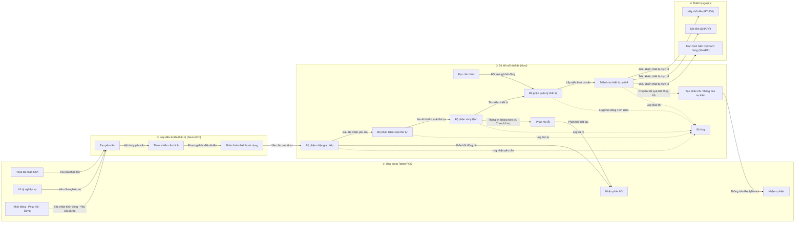
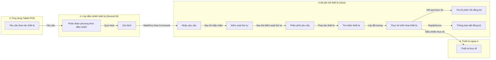
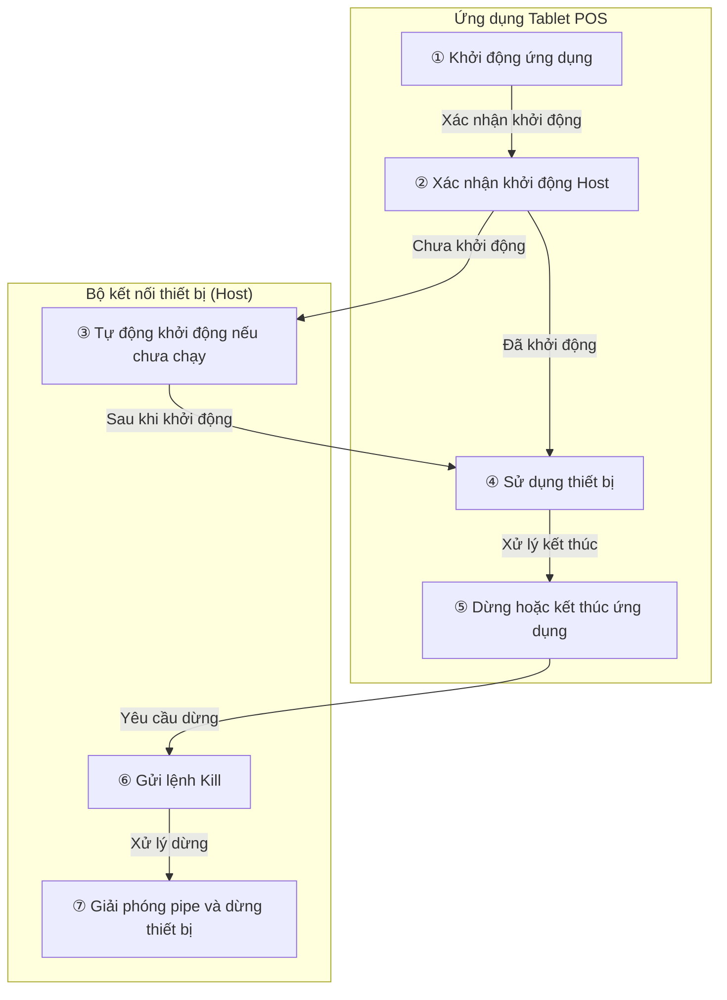

# ARCH-HOST-01 Tài liệu thiết kế cơ bản cho Bộ kết nối thiết bị

Tablet POS  
ARCH-HOST-01 Tài liệu thiết kế cơ bản cho Bộ kết nối thiết bị  
Mã tài liệu: ARCH-HOST-01  
Phiên bản: 0.2.8  
Ngày 7 tháng 7 năm 2026  

## 00_Trang bìa

| Mục | Nội dung |
|---|---|
| Mã tài liệu | ARCH-HOST-01 |
| Tên tài liệu | Tài liệu thiết kế cơ bản cho Bộ kết nối thiết bị Tablet POS |
| Đối tượng | Bộ kết nối thiết bị (Host) |
| Phiên bản | 0.2.8 |
| Ngày tạo | 07/07/2026 |
| Người tạo | VTI Sam |
| Người review | SMJ Kamata |
| Người phê duyệt | - |
| Mục đích | Hệ thống hóa vai trò, chức năng, giao diện, cấu hình, xử lý lỗi, log, và các điểm cần xác nhận của Bộ kết nối thiết bị (Host) dưới dạng thiết kế cơ bản. |
| Kết quả mong đợi | Đưa tài liệu thiết kế cơ bản của Bộ kết nối thiết bị (Host) vào trạng thái sẵn sàng để review, và các vấn đề chưa quyết định có thể được đánh giá và quyết định tại phần "19_Các điểm cần xác nhận". |
| Định dạng dự kiến | Cấu trúc cho phép kiểm tra các bảng thiết kế từ mục lục. |

## 01_Lịch sử sửa đổi

| Phiên bản | Ngày | Nội dung thay đổi | Người tạo | Người phê duyệt |
|---|---|---|---|---|
| 0.2.8 | 08/07/2026 | Tạo mới làm tài liệu thiết kế cơ bản cho Bộ kết nối thiết bị (Host). | VTI Sam | - |

## Mục lục

| No | Tên tài liệu | Ghi chú | No | Tên tài liệu | Ghi chú |
|---|---|---|---|---|---|
| 1 | Trang bìa | 00_Trang bìa | 13 | Giải thích vòng đời | 09_Vòng đời_02 |
| 2 | Lịch sử sửa đổi | 01_Lịch sử sửa đổi | 14 | Danh sách giao diện (Interface) | 10_Danh sách giao diện |
| 3 | Tổng quan | 02_Tổng quan | 15 | Định nghĩa hạng mục yêu cầu | 11_Định nghĩa hạng mục yêu cầu |
| 4 | Phạm vi đối tượng | 03_Phạm vi đối tượng | 16 | Định nghĩa hạng mục phản hồi | 12_Định nghĩa hạng mục phản hồi |
| 5 | Tài liệu liên quan | 04_Tài liệu liên quan | 17 | Định nghĩa hạng mục sự kiện | 13_Định nghĩa hạng mục sự kiện |
| 6 | Sơ đồ cấu trúc tổng thể | 05_Cấu trúc tổng thể_01 | 18 | Danh sách thông điệp (Message) | 14_Danh sách thông điệp |
| 7 | Giải thích cấu trúc tổng thể | 05_Cấu trúc tổng thể_02 | 19 | Thiết kế file cấu hình | 15_Thiết kế file cấu hình |
| 8 | Sơ đồ luồng xử lý yêu cầu thao tác thiết bị | 06_Luồng xử lý yêu cầu thao tác thiết bị_01 | 20 | Thiết kế theo từng thiết bị | 16_Thiết kế theo từng thiết bị |
| 9 | Giải thích luồng xử lý yêu cầu thao tác thiết bị | 06_Luồng xử lý yêu cầu thao tác thiết bị_02 | 21 | Xử lý lỗi | 17_Xử lý lỗi |
| 10 | Danh sách chức năng | 07_Danh sách chức năng | 22 | Thiết kế Log | 18_Thiết kế Log |
| 11 | Chi tiết chức năng | 08_Chi tiết chức năng | 23 | Các điểm cần xác nhận | 19_Các điểm cần xác nhận |
| 12 | Sơ đồ vòng đời | 09_Vòng đời_01 | 24 | Bảng đối chiếu triển khai thực tế | 20_Bảng đối chiếu triển khai thực tế |

## 02_Tổng quan

### 2.1 Kết luận

Tài liệu này là thiết kế cơ bản dành cho Bộ kết nối thiết bị (Host) của Tablet POS. Đối tượng chính không phải là lớp điều khiển thiết bị (Device Control Layer) nằm trong ứng dụng Tablet POS, mà là tiến trình Host chạy độc lập trên thiết bị Windows.

`DeviceCtrl` được xem là phía gọi (caller) có nhiệm vụ phán đoán thiết bị sử dụng và phương thức điều khiển, sau đó gửi yêu cầu khi cần qua Host. Host sẽ chịu trách nhiệm khởi động, duy trì, gọi và dừng các triển khai thiết bị (device implementation) sử dụng OPOS có sẵn, OCX, DLL, bộ nhớ chia sẻ (shared memory), hoặc liên kết file yêu cầu/phản hồi.

### 2.2 Phương châm thiết kế

① Phía ứng dụng tập trung vào việc quyết định sử dụng thiết bị nào và gửi yêu cầu nào tới Host.

② Phía Host tập trung vào cách điều khiển thiết bị vật lý và cách gọi các tài nguyên hiện có.

③ Giao tiếp sử dụng Named Pipe, tách biệt đường ống cho lệnh (command) và đường ống cho sự kiện (event).

④ Các thiết bị đối tượng ban đầu bao gồm: Máy thối tiền tự động RT-300, Két tiền SHARP, Màn hình hiển thị khách hàng SHARP.

⑤ Tên class vật lý và các method chi tiết sẽ không được lặp lại trong nội dung tài liệu này mà có thể tra cứu tại phần "20_Bảng đối chiếu triển khai thực tế" hoặc tài liệu đặc tả chương trình.

### 2.3 Tiêu chí đánh giá Review

Nếu không có sự khác biệt lớn về nhận thức đối với phạm vi đối tượng, phân chia vai trò, phương thức giao tiếp, cấu hình, xử lý lỗi, log, và các điểm cần xác nhận trong tài liệu này, thì tài liệu này có thể được đánh giá là đã hoàn thành review thiết kế cơ bản cho Bộ kết nối thiết bị (Host). Các vấn đề chưa được quyết định sẽ được xác nhận tại mục "19_Các điểm cần xác nhận".

## 03_Phạm vi đối tượng

### 3.1 Phạm vi đối tượng

Tài liệu này bao gồm phạm vi cần thiết để điều khiển thiết bị thông qua Host.

① Windows terminal trên tiến trình Bộ kết nối thiết bị (Host) hoạt động.

② Yêu cầu đồng bộ và phản hồi đồng bộ thông qua `TabetPos.Host.Command`.

③ Thông báo bất đồng bộ thông qua `TabetPos.Host.Event`.

④ Đọc cấu hình, tạo thiết bị, duy trì thiết bị đã khởi động, tìm kiếm và dừng thiết bị trong Host.

⑤ Máy thối tiền tự động RT-300, Két tiền SHARP, Màn hình hiển thị khách hàng SHARP.

⑥ Xử lý các trường hợp: thông tin đầu vào không hợp lệ, thiết bị chưa đăng ký, lỗi giao tiếp, lỗi thực thi thiết bị, lỗi khi dừng thiết bị.

⑦ Thiết kế log cho các giai đoạn: khởi động, dừng, giao tiếp, xử lý lệnh, xử lý thiết bị, ngoại lệ (exception), và phát hiện bất thường khi giám sát.

### 3.2 Ngoài phạm vi đối tượng (Out of Scope)

Các hạng mục hiển thị trên màn hình, chuyển màn hình, văn bản hiển thị cho người dùng sẽ được xử lý trong thiết kế phía ứng dụng.

Phương thức điều khiển trực tiếp bên trong `DeviceCtrl` nằm ngoài phạm vi tài liệu này. Tài liệu này chỉ tập trung vào phạm vi sử dụng tài nguyên thiết bị hiện có thông qua Host.

Các method private của từng class cụ thể, biến nội bộ, và điều kiện rẽ nhánh chi tiết sẽ được xử lý trong tài liệu đặc tả chương trình.

Cấu hình OPOS, cài đặt driver, cấu hình thiết bị thực tế tại cửa hàng sẽ được xử lý trong tài liệu hướng dẫn vận hành hoặc tài liệu hướng dẫn cài đặt.

Các thiết bị bổ sung trong tương lai như máy in, máy quét (scanner), terminal thanh toán không thuộc đối tượng ban đầu, vì vậy sẽ không được đề cập trong tài liệu này.

## 04_Tài liệu liên quan

| Mã tài liệu | Tên tài liệu | Mối quan hệ với tài liệu này |
|---|---|---|
| ARCH-01 | Tài liệu thiết kế cấu trúc phần mềm Tablet POS | Tài liệu tiền đề về cấu trúc tổng thể của Tablet POS. |
| ARCH-02 | Tài liệu thiết kế cấu trúc ứng dụng terminal Tablet POS | Tài liệu tiền đề về cấu trúc phía ứng dụng terminal. |
| ARCH-03 | Tài liệu thiết kế cấu trúc Bộ kết nối thiết bị Tablet POS | Tài liệu tiền đề về cấu trúc, trách nhiệm và các component chính của Host. |
| CFG-01 | Tài liệu hướng dẫn ghi file cấu hình lớp điều khiển thiết bị Tablet POS | Tài liệu hướng dẫn ghi file `device_controller_config.json` and `host_device_config.json`. |
| PS-HOST-01 | Named Pipe Command Server | Đặc tả chương trình cho bộ phận nhận lệnh (Command Receiver). |
| PS-HOST-02 | Named Pipe Device Host Adapter | Đặc tả chương trình cho adapter giao tiếp Host (Host Communication Adapter). |
| PS-HOST-03 | Device Command Router | Đặc tả chương trình kiểm soát thứ tự xử lý theo từng `DeviceId`. |
| PS-HOST-04 | Device Command Handler | Đặc tả phân phối yêu cầu kiểm soát Host và yêu cầu thao tác thiết bị. |
| PS-HOST-05 | Device Server Host | Đặc tả khởi động, dừng và quản lý giao tiếp của chính bộ Host. |
| PS-HOST-06 | Device Manager | Đặc tả tạo, duy trì, tìm kiếm và dừng thiết bị. |
| PS-HOST-07 | Device Base | Đặc tả xử lý cơ sở chung của các thiết bị (Device Common Base Process). |
| PS-HOST-08 | Điều khiển máy thối tiền tự động RT-300 | Đặc tả chương trình điều khiển máy thối tiền tự động RT-300. |
| PS-HOST-10 | Điều khiển két tiền SHARP | Đặc tả chương trình điều khiển két tiền SHARP. |
| PS-HOST-11 | Điều khiển màn hình hiển thị khách hàng SHARP | Đặc tả chương trình điều khiển màn hình hiển thị khách hàng SHARP. |

## 05_Cấu trúc tổng thể_01

### 5.1 Sơ đồ cấu trúc tổng thể



## 05_Cấu trúc tổng thể_02

### 5.2 Các thành phần cấu trúc

Ứng dụng Tablet POS yêu cầu thao tác thiết bị dựa trên thao tác màn hình hoặc xử lý nghiệp vụ. `DeviceCtrl` dựa trên cấu hình để phán đoán xem sẽ điều khiển trực tiếp hay thông qua Host. Trong trường hợp thông qua Host, yêu cầu sẽ được gửi tới Host bằng Named Pipe, và trong Host sẽ thực hiện kiểm soát thứ tự, phân phối yêu cầu, tìm kiếm thiết bị và điều khiển thiết bị thực tế.

① **Ứng dụng Tablet POS** chịu trách nhiệm về màn hình và xử lý nghiệp vụ. Ứng dụng không nắm giữ chi tiết điều khiển thiết bị thực tế mà chỉ chuyển yêu cầu thao tác cần thiết tới `DeviceCtrl`.  
*Bảng liên quan:* 02_Tổng quan, 06_Luồng xử lý yêu cầu thao tác thiết bị_02, 09_Vòng đời_02

  - **Thao tác màn hình:** Tạo yêu cầu thao tác thiết bị dựa trên các thao tác của người dùng.  
    *Bảng liên quan:* 06_Luồng xử lý yêu cầu thao tác thiết bị_02, 11_Định nghĩa hạng mục yêu cầu
  - **Xử lý nghiệp vụ:** Yêu cầu `DeviceCtrl` thực hiện thao tác thiết bị cần thiết cho nghiệp vụ.  
    *Bảng liên quan:* 06_Luồng xử lý yêu cầu thao tác thiết bị_02, 14_Danh sách thông điệp
  - **Khởi động, Phục hồi, Dừng:** Kích hoạt việc xác nhận khởi động Host và yêu cầu dừng Host.  
    *Bảng liên quan:* 09_Vòng đời_02

② **DeviceCtrl** thực hiện phán đoán thiết bị sử dụng và phương thức điều khiển. Đối với các đối tượng xử lý qua Host, nó gửi yêu cầu thông qua Named Pipe.  
*Bảng liên quan:* 03_Phạm vi đối tượng, 10_Danh sách giao diện, 15_Thiết kế file cấu hình

  - **Tham chiếu cấu hình:** Đọc các thiết lập cần thiết để phán đoán phương thức điều khiển và thiết bị đối tượng.  
    *Bảng liên quan:* 15_Thiết kế file cấu hình
  - **Phán đoán thiết bị sử dụng:** Quyết định điều khiển trực tiếp trong ứng dụng hay thông qua Host.  
    *Bảng liên quan:* 06_Luồng xử lý yêu cầu thao tác thiết bị_02, 15_Thiết kế file cấu hình
  - **Tạo yêu cầu:** Tạo yêu cầu lệnh để gửi tới Host.  
    *Bảng liên quan:* 11_Định nghĩa hạng mục yêu cầu, 14_Danh sách thông điệp
  - **Nhận phản hồi:** Nhận phản hồi đồng bộ từ Host và trả về cho bên gọi.  
    *Bảng liên quan:* 12_Định nghĩa hạng mục phản hồi, 17_Xử lý lỗi
  - **Nhận sự kiện:** Nhận thông báo bất đồng bộ từ Host.  
    *Bảng liên quan:* 13_Định nghĩa hạng mục sự kiện, 09_Vòng đời_02

③ **Bộ kết nối thiết bị (Host)** tiếp nhận yêu cầu từ `DeviceCtrl`, tiến hành kiểm soát thứ tự, phân phối yêu cầu, tìm kiếm thiết bị, gọi điều khiển thiết bị thực tế, và trả về phản hồi.  
*Bảng liên quan:* 06_Luồng xử lý yêu cầu thao tác thiết bị_02, 07_Danh sách chức năng, 08_Chi tiết chức năng, 20_Bảng đối chiếu triển khai thực tế

  - **Đọc cấu hình:** Đọc file `host_device_config.json` để xác định các thiết bị cần khởi động trong Host.  
    *Bảng liên quan:* 15_Thiết kế file cấu hình, 16_Thiết kế theo từng thiết bị
  - **Bộ phận nhận giao tiếp:** Tiếp nhận yêu cầu lệnh từ `DeviceCtrl` và trả về phản hồi đồng bộ trên cùng một kết nối.  
    *Bảng liên quan:* 06_Luồng xử lý yêu cầu thao tác thiết bị_02, 10_Danh sách giao diện, 11_Định nghĩa hạng mục yêu cầu, 12_Định nghĩa hạng mục phản hồi
  - **Bộ phận kiểm soát thứ tự:** Đảm bảo thứ tự xử lý của các yêu cầu có cùng `DeviceId`, tránh việc đảo lộn thứ tự.  
    *Bảng liên quan:* 06_Luồng xử lý yêu cầu thao tác thiết bị_02, 07_Danh sách chức năng, 08_Chi tiết chức năng, 18_Thiết kế Log
  - **Bộ phận xử lý lệnh:** Phân phối yêu cầu thành yêu cầu kiểm soát Host hoặc yêu cầu thao tác thiết bị.  
    *Bảng liên quan:* 07_Danh sách chức năng, 08_Chi tiết chức năng, 14_Danh sách thông điệp, 17_Xử lý lỗi
  - **Bộ phận quản lý thiết bị:** Tạo, duy trì, tìm kiếm và dừng các thiết bị chạy trong Host.  
    *Bảng liên quan:* 15_Thiết kế file cấu hình, 16_Thiết kế theo từng thiết bị, 17_Xử lý lỗi, 18_Thiết kế Log
  - **Triển khai thiết bị cụ thể:** Nằm trong Host, sử dụng các tài nguyên có sẵn như OPOS, OCX, DLL, bộ nhớ chia sẻ, hoặc liên kết file yêu cầu/phản hồi để điều khiển thiết bị thực tế.  
    *Bảng liên quan:* 16_Thiết kế theo từng thiết bị, 20_Bảng đối chiếu triển khai thực tế
  - **Tạo phản hồi / thông báo sự kiện:** Trả phản hồi đồng bộ qua đường giao tiếp command và gửi thông báo ReplyDevice qua event pipe khi có thông báo tiếp theo trong Host.  
    *Bảng liên quan:* 10_Danh sách giao diện, 12_Định nghĩa hạng mục phản hồi, 13_Định nghĩa hạng mục sự kiện, 18_Thiết kế Log
  - **Phản hồi lỗi:** Chuyển đổi thông tin nhập không hợp lệ, thiết bị chưa đăng ký, hoặc ngoại lệ thành phản hồi thất bại.  
    *Bảng liên quan:* 12_Định nghĩa hạng mục phản hồi, 17_Xử lý lỗi, 18_Thiết kế Log
  - **Ghi log:** Ghi lại để theo dõi các hoạt động: khởi động, giao tiếp, kiểm soát thứ tự, xử lý lệnh, xử lý thiết bị, và các bất thường.  
    *Bảng liên quan:* 18_Thiết kế Log

④ **Thiết bị ngoại vi** là các thiết bị thực tế sử dụng tại cửa hàng. Đối tượng ban đầu gồm 3 loại: Máy thối tiền tự động (RT-300), Két tiền (SHARP) và Màn hình hiển thị khách hàng (SHARP).  
*Bảng liên quan:* 03_Phạm vi đối tượng, 16_Thiết kế theo từng thiết bị, 17_Xử lý lỗi

  - **Máy thối tiền (RT-300):** Được điều khiển từ bộ phận điều khiển máy thối tiền trong Host.  
    *Bảng liên quan:* 16_Thiết kế theo từng thiết bị, 17_Xử lý lỗi
  - **Két tiền (SHARP):** Được điều khiển từ bộ phận điều khiển két tiền trong Host.  
    *Bảng liên quan:* 16_Thiết kế theo từng thiết bị, 17_Xử lý lỗi
  - **Màn hình hiển thị khách hàng (SHARP):** Được điều khiển từ bộ phận điều khiển màn hình hiển thị khách hàng trong Host.  
    *Bảng liên quan:* 16_Thiết kế theo từng thiết bị, 17_Xử lý lỗi

## 06_デバイス操作要求処理フロー_01

### 6.1 Sơ đồ luồng xử lý yêu cầu thao tác thiết bị



## 06_デバイス操作要求処理フロー_02

### 6.2 Xử lý thông thường

Một thao tác thiết bị thông thường bắt đầu từ yêu cầu phía ứng dụng và được chuyển đến triển khai thiết bị cụ thể trong Host. Phản hồi đồng bộ được trả về qua đường ống lệnh (command pipe), và các thông báo ReplyDevice phát sinh trong Host sẽ được thông báo qua đường ống sự kiện (event pipe).

① Ứng dụng Tablet POS tạo yêu cầu thao tác thiết bị từ các thao tác màn hình hoặc xử lý nghiệp vụ.

② `DeviceCtrl` tham chiếu file `device_controller_config.json` để phán đoán xem thiết bị đối tượng sẽ được điều khiển trực tiếp trong ứng dụng hay thông qua Host.

③ Trong trường hợp thông qua Host, `DeviceCtrl` sẽ gửi yêu cầu dạng JSON hoặc yêu cầu định dạng tương thích cũ tới `TabetPos.Host.Command`.

④ Bộ phận nhận giao tiếp tiếp nhận yêu cầu và chuyển đổi nó thành cấu trúc thông tin yêu cầu được xử lý nội bộ trong Host.

⑤ Bộ phận kiểm soát thứ tự sắp xếp thứ tự xử lý theo từng `DeviceId`. Các yêu cầu có cùng `DeviceId` sẽ được xử lý theo thứ tự gửi đến.

⑥ Bộ phận xử lý lệnh xác định yêu cầu là yêu cầu kiểm soát Host hay yêu cầu thao tác thiết bị.

⑦ Trong trường hợp là yêu cầu thao tác thiết bị, hệ thống sẽ tìm kiếm thiết bị tương ứng từ Bộ phận quản lý thiết bị.

⑧ Triển khai thiết bị cụ thể trong Host thực hiện điều khiển thiết bị thực tế dựa trên `message`, `methodId` và `payload`.

⑨ Bộ phận nhận giao tiếp trả về kết quả thực thi đồng bộ dưới dạng JSON phản hồi lệnh.

⑩ Khi có thông báo ReplyDevice phát sinh trong Host, Bộ phận thông báo sự kiện sẽ thông báo bất đồng bộ tới `TabetPos.Host.Event`.

## 07_機能一覧

### 7.1 Danh sách chức năng

| Mã chức năng | Tên chức năng | Tổng quan | Đầu vào | Đầu ra | Vai trò chính | Ghi chú |
|---|---|---|---|---|---|---|
| F-HOST-001 | Xác nhận khởi động Host | Xác nhận trạng thái khởi động của Host khi khởi chạy ứng dụng, tạo màn hình, hoặc khi phục hồi ứng dụng. | Sự kiện vòng đời ứng dụng | Có cần khởi động Host không | Xử lý khởi động phía ứng dụng | Vận hành thông thường không giả định việc khởi động thủ công. |
| F-HOST-002 | Khởi động Host tự động | Nếu Host chưa khởi động, tiến hành khởi động nó dưới dạng tiến trình chạy ẩn (background process). | Có cần khởi động Host không | Tiến trình Host | Chính bộ Host | Tránh khởi động trùng lặp nhiều tiến trình. |
| F-HOST-003 | Tiếp nhận lệnh | Tiếp nhận yêu cầu đồng bộ qua đường ống `TabetPos.Host.Command`. | Yêu cầu qua Named Pipe | Thông tin yêu cầu xử lý nội bộ Host | Bộ phận nhận giao tiếp | Trả về phản hồi cho từng yêu cầu. |
| F-HOST-004 | Thông báo sự kiện | Gửi thông báo ReplyDevice phát sinh trong Host dưới dạng sự kiện. | Dữ liệu thông báo ReplyDevice | JSON thông báo sự kiện | Bộ phận thông báo sự kiện | Đường truyền độc lập với phản hồi đồng bộ. |
| F-HOST-005 | Chuyển đổi lệnh | Chuyển đổi yêu cầu bên ngoài thành định dạng xử lý nội bộ của Host. | Yêu cầu JSON hoặc yêu cầu định dạng tương thích cũ | Thông tin yêu cầu xử lý nội bộ Host | Bộ phận chuyển đổi lệnh | Duy trì các hạng mục tương thích cũ. |
| F-HOST-006 | Kiểm soát thứ tự theo DeviceId | Xử lý các yêu cầu có cùng `DeviceId` theo thứ tự gửi đến. | Thông tin yêu cầu xử lý nội bộ Host | Yêu cầu xử lý sau khi kiểm soát thứ tự | Bộ phận kiểm soát thứ tự | Các `DeviceId` khác nhau có thể được xử lý độc lập. |
| F-HOST-007 | Kiểm soát Host | Xử lý các yêu cầu `Kill`, `ReStart` như là các yêu cầu kiểm soát Host. | Thông điệp (message) kiểm soát Host | Chỉ thị dừng hoặc khởi động lại Host | Bộ phận xử lý lệnh, chính bộ Host | Không thực hiện tìm kiếm thiết bị. |
| F-HOST-008 | Thao tác thiết bị | Chuyển các lệnh `DeviceUse`, `DeviceUnUse`, `DeviceMethod` v.v. tới thiết bị đối tượng. | `deviceId`, `methodId`, `payload` | Kết quả thực thi thiết bị | Bộ phận xử lý lệnh, Bộ phận quản lý thiết bị | Chi tiết triển khai của từng thiết bị cụ thể nằm ngoài phạm vi này. |
| F-HOST-009 | Quản lý thiết bị | Tạo, duy trì, tìm kiếm và dừng các thiết bị phía Host dựa trên cấu hình. | `host_device_config.json` | Danh sách thiết bị đã khởi động | Bộ phận quản lý thiết bị | Trường hợp khởi động thất bại sẽ tuân theo quy trình xử lý lỗi. |
| F-HOST-010 | Phản hồi lỗi | Chuyển đổi thông tin nhập không hợp lệ, thiết bị chưa đăng ký, ngoại lệ thành phản hồi thất bại. | Thông tin bất thường | JSON phản hồi thất bại | Bộ phận nhận giao tiếp, Bộ phận xử lý lệnh, Bộ phận kiểm soát thứ tự | Văn bản hiển thị phía ứng dụng không được quyết định tại Host. |

## 08_機能詳細

### 8.1 Chi tiết chức năng

| Mã chức năng | Thứ tự | Nội dung xử lý | Khi bình thường | Khi bất thường | Vai trò chính |
|---|---:|---|---|---|---|
| F-HOST-001 | 1 | Xác nhận trạng thái khởi động Host phía ứng dụng. | Tiếp tục xử lý nếu đã khởi động. | Chuyển sang F-HOST-002 nếu chưa khởi động. | Xử lý khởi động phía ứng dụng |
| F-HOST-002 | 1 | Khởi động tiến trình Host dưới dạng chạy ẩn. | Host sẵn sàng tiếp nhận lệnh. | Ghi lại lỗi khởi động vào log phía ứng dụng, thực hiện thử lại hoặc xử lý dưới dạng lỗi. | Chính bộ Host |
| F-HOST-003 | 1 | Chờ nhận kết nối trên Named Pipe của lệnh. | Tiếp nhận yêu cầu. | Nếu không bắt đầu tiếp nhận được thì xử lý như lỗi khởi động Host. | Bộ phận nhận giao tiếp |
| F-HOST-003 | 2 | Phân tích yêu cầu 1 dòng nhận được. | Chuyển đổi thành cấu trúc thông tin yêu cầu xử lý nội bộ Host. | Trả về phản hồi thất bại nếu dòng trống hoặc định dạng không hợp lệ. | Bộ phận nhận giao tiếp |
| F-HOST-004 | 1 | Nhận dữ liệu thông báo ReplyDevice. | Tạo dữ liệu thông báo sự kiện. | Nếu không có nơi nhận thì ghi log và xử lý độc lập với phản hồi đồng bộ. | Bộ phận thông báo sự kiện |
| F-HOST-005 | 1 | Chuyển đổi yêu cầu JSON hoặc yêu cầu định dạng tương thích cũ thành định dạng nội bộ Host. | Thiết lập các trường `message`, `deviceId`, `methodId`, `handle`, `payload`. | Trường hợp thiếu thông tin bắt buộc sẽ xử lý thất bại ở bước kiểm tra thông tin đầu vào sau đó. | Bộ phận chuyển đổi lệnh |
| F-HOST-006 | 1 | Quyết định đơn vị xử lý cho từng `DeviceId`. | Đưa các yêu cầu có cùng `DeviceId` vào cùng một đơn vị xử lý (queue). | Trường hợp không chỉ định `DeviceId` sẽ xử lý như đơn vị dùng chung của Host. | Bộ phận kiểm soát thứ tự |
| F-HOST-006 | 2 | Thực hiện xử lý theo thứ tự đưa vào. | Thứ tự xử lý được đảm bảo cho cùng một `DeviceId`. | Chuyển đổi ngoại lệ phát sinh trong quá trình xử lý thành phản hồi thất bại. | Bộ phận kiểm soát thứ tự |
| F-HOST-007 | 1 | Phán đoán xem `message` có phải là yêu cầu kiểm soát Host không. | Xử lý `Kill` hoặc `ReStart` dưới dạng kiểm soát Host. | Trả về phản hồi thất bại nếu gặp `message` chưa được hỗ trợ. | Bộ phận xử lý lệnh |
| F-HOST-008 | 1 | Kiểm tra các mục bắt buộc của yêu cầu thao tác thiết bị. | Xác nhận `deviceId`, và `methodId` nếu cần thiết. | Trả về phản hồi thất bại nếu thiếu `deviceId` hoặc `methodId`. | Bộ phận xử lý lệnh |
| F-HOST-008 | 2 | Tìm kiếm thiết bị đối tượng. | Lấy được thiết bị đối tượng. | Trả về phản hồi thất bại nếu `DeviceId` chưa được đăng ký. | Bộ phận quản lý thiết bị |
| F-HOST-008 | 3 | Chuyển xử lý tới thiết bị đối tượng. | Nhận kết quả từ `DeviceUse`, `DeviceUnUse`, `DeviceMethod`. | Chuyển đổi giá trị trả về của thiết bị hoặc ngoại lệ thành phản hồi thất bại. | Triển khai thiết bị cụ thể |
| F-HOST-009 | 1 | Đọc file cấu hình khi Host khởi động. | Xác định các thiết bị cần khởi động. | Không khởi động thiết bị đối tượng nếu cấu hình không hợp lệ. | Bộ phận quản lý thiết bị |
| F-HOST-009 | 2 | Tạo và bắt đầu thiết bị đối tượng. | Đăng ký vào danh sách thiết bị đã khởi động. | Ghi lại log nếu khởi động thất bại. Thử lại nếu cần thiết. | Bộ phận quản lý thiết bị |
| F-HOST-010 | 1 | Chuyển đổi nội dung bất thường thành định dạng phản hồi. | Trả về `success=false` và mã kết quả. | Nếu việc tạo phản hồi thất bại, ghi log dưới dạng lỗi giao tiếp. | Bộ phận nhận giao tiếp |

## 09_ライフサイクル_01

### 9.1 Sơ đồ vòng đời vận hành thông thường



## 09_ライフサイクル_02

### 9.2 Vận hành thông thường

Trong vận hành thông thường, hệ thống không giả định người dùng phải thao tác trên màn hình Start/Stop. Trạng thái khởi động của Host sẽ được kiểm tra tại các thời điểm khởi chạy ứng dụng, tạo màn hình, hoặc khi phục hồi ứng dụng; nếu Host chưa chạy, nó sẽ tự động được khởi chạy dưới nền (background).

① Khi ứng dụng khởi động, xác nhận trạng thái khởi động của Host. Tự động khởi động nếu chưa chạy.

② Khi tạo màn hình, xác nhận trạng thái của Host trước khi sử dụng thiết bị. Không khởi động lại nếu Host đã chạy.

③ Khi phục hồi ứng dụng (resume), xác nhận lại trạng thái của Host. Khởi động lại nếu Host chưa chạy.

④ Khi ứng dụng dừng hoặc kết thúc, ứng dụng gửi yêu cầu `Kill`. Phía Host tiến hành dừng bộ phận giao tiếp và các thiết bị đã khởi động.

⑤ Sau khi Host dừng, đường ống dẫn (pipe) và thiết bị được giải phóng, và trạng thái Host không còn thường trú trong hệ thống được coi là điều kiện kết thúc bình thường.

### 9.3 Khi debug

Việc giữ lại màn hình Start/Stop (nếu có) chỉ nhằm mục đích kiểm tra khi debug hoặc cho nhà phát triển, không đưa vào luồng vận hành thông thường tại cửa hàng.

## 10_インターフェース一覧

### 10.1 Danh sách giao diện (Interface)

| ID Giao diện | Phân loại | Nguồn gửi | Nơi nhận | Tên Pipe | Định dạng yêu cầu | Định dạng phản hồi | Phân loại đồng bộ | Ghi chú |
|---|---|---|---|---|---|---|---|---|
| IF-HOST-001 | Yêu cầu lệnh | DeviceCtrl | Bộ kết nối thiết bị (Host) | `TabetPos.Host.Command` | JSON hoặc tương thích cũ | JSON | Đồng bộ | Xử lý yêu cầu thao tác thiết bị và yêu cầu kiểm soát Host. |
| IF-HOST-002 | Phản hồi lệnh | Bộ kết nối thiết bị (Host) | DeviceCtrl | `TabetPos.Host.Command` | - | JSON | Đồng bộ | Trả kết quả về trên cùng một kết nối. |
| IF-HOST-003 | Thông báo sự kiện | Bộ kết nối thiết bị (Host) | DeviceCtrl hoặc ứng dụng | `TabetPos.Host.Event` | JSON | - | Bất đồng bộ | Xử lý thông báo ReplyDevice phát sinh trong Host. |

## 11_要求項目定義

### 11.1 Ví dụ JSON yêu cầu lệnh

```json
{
  "requestId": "00000001",
  "message": "DeviceMethod",
  "deviceId": "CustomerDisplay",
  "methodId": "DisplayText",
  "handle": "0",
  "payload": {
    "Text": "TOTAL 1,000"
  }
}
```

### 11.2 Các hạng mục yêu cầu lệnh

| ID Hạng mục | Tên hạng mục | Kiểu | Bắt buộc | Nội dung | Ví dụ thiết lập | Ghi chú |
|---|---|---|---|---|---|---|
| REQ-HOST-001 | requestId | string | Khuyến nghị | ID dùng để theo dõi yêu cầu. | `00000001` | Việc bổ sung thông tin khi thiếu phụ thuộc vào đặc tả của bên gọi. |
| REQ-HOST-002 | message | string | Tùy chọn | Loại thông điệp. | `DeviceMethod` | Nếu không chỉ định, mặc định xử lý như một phương thức thiết bị (device method). |
| REQ-HOST-003 | deviceId | string | Bắt buộc có điều kiện | ID thiết bị đối tượng. | `CustomerDisplay` | Có thể bỏ qua đối với yêu cầu kiểm soát Host. |
| REQ-HOST-004 | methodId | string | Bắt buộc có điều kiện | ID phương thức (method) đối tượng. | `DisplayText` | Bắt buộc đối với `DeviceMethod`. |
| REQ-HOST-005 | handle | string | Tùy chọn | Handle dùng cho tương thích cũ. | `0` | Nếu không chỉ định, mặc định xử lý với giá trị `0`. |
| REQ-HOST-006 | payload | object | Tùy chọn | Các đối số để thao tác thiết bị. | `{ "Text": "TOTAL 1,000" }` | Nội dung thay đổi tùy thuộc vào thiết bị và `methodId`. |

## 12_応答項目定義

### 12.1 Ví dụ JSON phản hồi lệnh

```json
{
  "requestId": "00000001",
  "success": true,
  "resultCode": 0,
  "message": "",
  "payload": {
    "ResultCode": "0",
    "ReturnValue": "0"
  }
}
```

### 12.2 Các hạng mục phản hồi lệnh

| ID Hạng mục | Tên hạng mục | Kiểu | Bắt buộc | Nội dung | Khi bình thường | Khi bất thường |
|---|---|---|---|---|---|---|
| RES-HOST-001 | requestId | string | Bắt buộc | ID yêu cầu. | Kế thừa từ yêu cầu. | Kế thừa từ yêu cầu trong phạm vi có thể. |
| RES-HOST-002 | success | boolean | Bắt buộc | Kết quả xử lý. | `true` | `false` |
| RES-HOST-003 | resultCode | number | Bắt buộc | Mã kết quả. | `0` | `-1` hoặc mã kết quả từ thiết bị. |
| RES-HOST-004 | message | string | Bắt buộc | Thông điệp. | Có thể để trống. | Trả về nguyên nhân hoặc góc độ kiểm tra. |
| RES-HOST-005 | payload | object | Bắt buộc | Kết quả bổ sung. | Chứa `ResultCode`, `ReturnValue`. | Chứa `ResultCode`, `ReturnValue` trong phạm vi có thể. |

## 13_イベント項目定義

### 13.1 Ví dụ JSON thông báo sự kiện

```json
{
  "eventId": "a1b2c3",
  "eventType": "ReplyDevice",
  "deviceId": "CustomerDisplay",
  "methodId": "DisplayText",
  "handle": "0",
  "message": "ReplyDevice",
  "payload": {
    "ResultCode": "0",
    "ReturnValue": "0"
  }
}
```

### 13.2 Các hạng mục thông báo sự kiện

| ID Hạng mục | Tên hạng mục | Kiểu | Bắt buộc | Nội dung | Ghi chú |
|---|---|---|---|---|---|
| EVT-HOST-001 | eventId | string | Bắt buộc | ID nhận diện sự kiện. | Được cấp phát bởi phía Host. |
| EVT-HOST-002 | eventType | string | Bắt buộc | Loại sự kiện. | Dự kiến ban đầu là `ReplyDevice`. |
| EVT-HOST-003 | deviceId | string | Bắt buộc | ID thiết bị đối tượng. | Cho biết thiết bị phản hồi. |
| EVT-HOST-004 | methodId | string | Tùy chọn | ID phương thức đối tượng. | Thiết lập dựa trên nội dung phản hồi của thiết bị. |
| EVT-HOST-005 | handle | string | Tùy chọn | Handle dùng cho tương thích cũ. | Thiết lập khi cần thiết. |
| EVT-HOST-006 | message | string | Tùy chọn | Thông điệp thông báo. | Giữ lại nhằm mục đích tương thích cũ. |
| EVT-HOST-007 | payload | object | Tùy chọn | Dữ liệu trả về được Host đóng gói vào thông báo ReplyDevice. | Thông tin cá nhân hoặc thông tin thanh toán nhạy cảm sẽ không được ghi trực tiếp vào log. |

## 14_メッセージ一覧

### 14.1 Danh sách thông điệp (Message)

| Mã thông điệp | message | Phân loại | deviceId | methodId | Công dụng chính | Xử lý khi bình thường | Xử lý khi bất thường |
|---|---|---|---|---|---|---|---|
| MSG-HOST-001 | DeviceUse | Thao tác thiết bị | Bắt buộc | Tùy chọn | Bắt đầu sử dụng thiết bị. | Gọi xử lý bắt đầu sử dụng của thiết bị đối tượng. | Phản hồi thất bại nếu không chỉ định `deviceId` hoặc thiết bị chưa đăng ký. |
| MSG-HOST-002 | DeviceUnUse | Thao tác thiết bị | Bắt buộc | Tùy chọn | Kết thúc sử dụng thiết bị. | Gọi xử lý kết thúc sử dụng của thiết bị đối tượng. | Phản hồi thất bại nếu không chỉ định `deviceId` hoặc thiết bị chưa đăng ký. |
| MSG-HOST-003 | DeviceUnUseComplete | Thao tác thiết bị | Bắt buộc | Tùy chọn | Xóa thông tin tiến trình sau khi hoàn tất sử dụng. | Xóa thông tin tiến trình và thực hiện xử lý kết thúc sử dụng. | Trả về mã kết quả nếu không có thông tin đối tượng. |
| MSG-HOST-004 | DeviceMethod | Thao tác thiết bị | Bắt buộc | Bắt buộc | Thực thi phương thức đặc thù của thiết bị. | Gọi xử lý thực thi phương thức của thiết bị đối tượng. | Phản hồi thất bại nếu không chỉ định `methodId` hoặc thiết bị chưa đăng ký. |
| MSG-HOST-005 | Kill | Kiểm soát Host | Tùy chọn | Tùy chọn | Dừng Host. | Chuyển sang xử lý dừng Host. | Ghi log nếu có ngoại lệ trong quá trình dừng. |
| MSG-HOST-006 | ReStart | Kiểm soát Host | Tùy chọn | Tùy chọn | Khởi động lại Host. | Chuyển sang xử lý khởi động lại. | Ghi log nếu khởi động lại thất bại. |

## 15_設定ファイル設計

### 15.1 Danh sách file cấu hình

| ID Cấu hình | File cấu hình | Quản lý bởi | Công dụng | Thời điểm đọc | Ghi chú |
|---|---|---|---|---|---|
| CFG-HOST-001 | `device_controller_config.json` | Ứng dụng / Phía `DeviceCtrl` | Định nghĩa các thiết bị ứng viên sử dụng trên terminal, thiết bị đang kích hoạt, phương thức kết nối, và cấu hình Named Pipe. | Khi khởi động ứng dụng Tablet POS | Không định nghĩa triển khai thiết bị được tạo bên trong Host. |
| CFG-HOST-002 | `host_device_config.json` | Phía Bộ kết nối thiết bị (Host) | Định nghĩa các triển khai thiết bị hiện có mà Host sẽ khởi động và duy trì. | Khi khởi động Host | Không định nghĩa lựa chọn thiết bị kích hoạt của phía ứng dụng. |

### 15.2 Các hạng mục cấu hình

| ID Cấu hình | File cấu hình | Khóa (Key) | Nội dung | Ví dụ thiết lập | Bắt buộc | Ghi chú |
|---|---|---|---|---|---|---|
| CFG-HOST-003 | `device_controller_config.json` | `appSettings.namedPipe.pipeName` | Tên đường ống cho lệnh khi qua Host. | `TabetPos.Host.Command` | Bắt buộc | Sử dụng để `DeviceCtrl` gửi yêu cầu tới Host. |
| CFG-HOST-004 | `device_controller_config.json` | Cấu hình thiết bị kích hoạt | Lựa chọn thiết bị sử dụng phía ứng dụng. | Theo cấu hình đối tượng | Bắt buộc | Vai trò khác với đối tượng khởi động phía Host. |
| CFG-HOST-005 | `host_device_config.json` | `devices` | Danh sách triển khai thiết bị được khởi động bởi Host. | Mảng (Array) | Bắt buộc | Định nghĩa các thiết bị đối tượng ban đầu. |
| CFG-HOST-006 | `host_device_config.json` | `devices[].id` | ID thiết bị trong Host. | `CustomerDisplay` | Bắt buộc | Tương ứng với `deviceId` trong yêu cầu. |
| CFG-HOST-007 | `host_device_config.json` | `devices[].name` | Tên thiết bị hoặc tên logic sử dụng khi thực thi. | Tên thiết bị đối tượng | Bắt buộc | Dùng để nhận diện triển khai hiện có. |
| CFG-HOST-008 | `host_device_config.json` | `devices[].classId` | ID nhận diện triển khai được tạo phía Host. | Class ID đối tượng | Bắt buộc | Gợi ý để tạo triển khai thiết bị. |
| CFG-HOST-009 | `host_device_config.json` | `devices[].visible` | Có hiển thị Form dành cho thiết bị hay không. | `false` | Tùy chọn | Dùng khi debug hoặc do ràng buộc của Form hiện có. |
| CFG-HOST-010 | `host_device_config.json` | `devices[].parameters` | Các tham số bổ sung theo từng thiết bị. | Đối tượng (Object) | Tùy chọn | Chứa cấu hình đặc thù của thiết bị. |

### 15.3 Quan hệ đối chiếu file cấu hình

| Điểm so sánh | `device_controller_config.json` | `host_device_config.json` |
|---|---|---|
| Quản lý bởi | Phía Ứng dụng / `DeviceCtrl` | Phía Bộ kết nối thiết bị (Host) |
| Mục đích chính | Chọn phương thức điều khiển sử dụng trên terminal. | Chọn triển khai thiết bị hiện có cần khởi động trên Host. |
| Liên kết Host | Chứa tên Named Pipe. | Chứa triển khai thiết bị trong Host. |
| Thời điểm tham chiếu | Khi ứng dụng khởi động, khi điều khiển thiết bị. | Khi Host khởi động. |
| Quan hệ thay thế | Không thay thế cấu hình của Host. | Không thay thế cấu hình của ứng dụng. |

## 16_デバイス別設計

### 16.1 Thiết kế theo từng thiết bị

| ID Thiết bị | Tên thiết bị | Phương thức điều khiển | Vai trò chính | Xử lý chính | Điều kiện khởi động | Điều kiện kết thúc | Ràng buộc chính | Ghi chú |
|---|---|---|---|---|---|---|---|---|
| DEV-HOST-001 | Máy thối tiền RT-300 | Qua Host | Bộ phận điều khiển máy thối tiền | Nhận tiền, thối tiền, xác nhận trạng thái, xác nhận lỗi. | Được định nghĩa trong `host_device_config.json` và trở thành đối tượng khi Host khởi động. | Khi Host dừng hoặc khi có xử lý dừng thiết bị. | OPOS trong Host, OCX trong Host, UI thread, bộ nhớ chia sẻ, liên kết file yêu cầu/phản hồi. | Xử lý tách biệt phản hồi đồng bộ và phản hồi bất đồng bộ. |
| DEV-HOST-002 | Két tiền SHARP | Qua Host | Bộ phận điều khiển két tiền | Mở két tiền, xác nhận trạng thái. | Được định nghĩa trong `host_device_config.json` và trở thành đối tượng khi Host khởi động. | Khi Host dừng hoặc khi có xử lý dừng thiết bị. | Triển khai SHARP trong Host, OPOS trong Host, OCX trong Host. | Trả mã kết quả về cho bên gọi. |
| DEV-HOST-003 | Màn hình hiển thị khách hàng SHARP | Qua Host | Bộ phận điều khiển màn hình hiển thị | Hiển thị, xóa hiển thị, cuộn, hiển thị tại vị trí chỉ định. | Được định nghĩa trong `host_device_config.json` và trở thành đối tượng khi Host khởi động. | Khi Host dừng hoặc khi có xử lý dừng thiết bị. | Triển khai SHARP trong Host, OPOS trong Host, OCX trong Host, chuỗi ký tự tiếng Nhật. | Named pipe giả định xử lý với UTF-8. |

## 17_エラー処理

### 17.1 Phương châm xử lý lỗi

① Các bất thường phát hiện nội bộ Host sẽ được trả về phía người gọi dưới dạng kết quả thất bại của phản hồi lệnh trong phạm vi có thể.

② Để duy trì tính tương thích cũ, ngay cả khi có bất thường, hệ thống vẫn cố gắng đưa các trường `ResultCode` và `ReturnValue` vào dữ liệu phản hồi trong phạm vi có thể.

③ Bất thường của một yêu cầu riêng lẻ sẽ không làm dừng toàn bộ Host. Nếu cần dừng, yêu cầu `Kill` hoặc `ReStart` phải được xử lý một cách rõ ràng.

④ Việc khởi động, dừng, xử lý yêu cầu, bất thường thiết bị, bất thường giám sát sẽ được ghi lại trong log dưới dạng có thể điều tra sau đó.

⑤ Host trả về kết quả kỹ thuật. Việc quyết định văn bản hiển thị cho người dùng, khả năng thử lại, và khả năng tiếp tục nghiệp vụ sẽ do phía ứng dụng phán đoán.

### 17.2 Danh sách xử lý lỗi

| Mã lỗi | Nơi phát sinh | Điều kiện phát sinh | Phương pháp phát hiện | Xử lý phía Host | Trả về phía ứng dụng | Ghi log | Phương pháp phục hồi |
|---|---|---|---|---|---|---|---|
| E-HOST-001 | Kết nối từ `DeviceCtrl` tới Host | Host chưa khởi động, pipe lệnh chưa chờ kết nối, kết nối bị timeout. | Lỗi kết nối phía ứng dụng. | Không có xử lý phía Host. | Xử lý như lỗi kết nối hoặc timeout phía ứng dụng. | Log kết nối phía ứng dụng. | Thử lại sau khi tự động khởi động Host. |
| E-HOST-002 | Nhận lệnh | Yêu cầu là dòng trống hoặc chỉ có khoảng trắng. | Kiểm tra đầu vào. | Tạo phản hồi thất bại. | `success=false`, `resultCode=-1` | Log nhận bất thường. | Kiểm tra xử lý tạo yêu cầu của bên gọi. |
| E-HOST-003 | Nhận lệnh | Sai định dạng JSON. | Ngoại lệ phân tích JSON. | Chuyển đổi ngoại lệ thành phản hồi thất bại. | `success=false`, `resultCode=-1` | Log phân tích bất thường. | Kiểm tra các hạng mục và bảng mã ký tự của JSON yêu cầu. |
| E-HOST-004 | Chuyển đổi lệnh | Đối tượng yêu cầu chưa được chỉ định. | Kiểm tra đầu vào khi chuyển đổi. | Xử lý dưới dạng lỗi đối số (argument error). | `success=false`, `resultCode=-1` | Log chuyển đổi bất thường. | Kiểm tra xử lý tạo yêu cầu của bên gọi. |
| E-HOST-005 | Xử lý lệnh | Chưa chỉ định `deviceId`. | Kiểm tra đầu vào. | Trả về kết quả thất bại mà không tìm kiếm thiết bị. | `ResultCode=-1`, `ReturnValue=-1` | Log kiểm tra đầu vào. | Kiểm tra xem yêu cầu là kiểm soát Host hay thao tác thiết bị. |
| E-HOST-006 | Xử lý lệnh | Chỉ định `deviceId` chưa đăng ký. | Kết quả tìm kiếm thiết bị trống. | Trả về kết quả thất bại với lý do không có thiết bị đối tượng. | `ResultCode=-1`, `ReturnValue=-1` | Log thiết bị chưa đăng ký. | Kiểm tra `host_device_config.json` và `DeviceId` phía `DeviceCtrl`. |
| E-HOST-007 | Xử lý lệnh | Chưa chỉ định `methodId` trong `DeviceMethod`. | Kiểm tra đầu vào. | Trả về kết quả thất bại mà không gọi thiết bị đối tượng. | `ResultCode=-1`, `ReturnValue=-1` | Log kiểm tra đầu vào. | Kiểm tra quan hệ tương ứng của method phía gọi. |
| E-HOST-008 | Xử lý lệnh | `message` không được hỗ trợ. | Phán đoán `message`. | Trả về kết quả thất bại dưới dạng lệnh chưa được hỗ trợ. | `ResultCode=-1`, `ReturnValue=-1` | Log `message` chưa hỗ trợ. | Kiểm tra tên `message` và danh sách tương ứng. |
| E-HOST-009 | Thực thi thiết bị | `DeviceMethod` trả về kết quả không bình thường. | Giá trị trả về từ thiết bị. | Không xử lý thành công mà trả về mã kết quả. | `success=false`, `resultCode=<giá trị trả về>` | Log kết quả thiết bị. | Kiểm tra trạng thái thiết bị thực tế, trạng thái OPOS, và các đối số. |
| E-HOST-010 | Kiểm soát thứ tự | Phát sinh ngoại lệ trong quá trình xử lý. | Ngoại lệ bên trong đơn vị xử lý. | Chuyển đổi ngoại lệ thành phản hồi thất bại. | `success=false`, `resultCode=-1` | Log ngoại lệ. | Kiểm tra log của Host bắt đầu từ `requestId`. |
| E-HOST-011 | Khởi động thiết bị | Thất bại khi tạo hoặc bắt đầu thiết bị. | Ngoại lệ hoặc giá trị trả về khi khởi động. | Không thêm vào danh sách thiết bị đã khởi động. | Trả lỗi chưa đăng ký khi yêu cầu `DeviceId` đó. | Log khởi động bất thường. | Kiểm tra cấu hình OPOS, đăng ký OCX, và kết nối thiết bị. |
| E-HOST-012 | Giám sát | Không có phản hồi từ thiết bị trong một khoảng thời gian nhất định. | Thời gian giám sát. | Xuất log giám sát trạng thái bất thường. | Không có phản hồi trực tiếp nếu không trong quá trình yêu cầu. | Log giám sát bất thường. | Kiểm tra kết nối thiết bị thực tế và trạng thái tiến trình thiết bị. |
| E-HOST-013 | Gửi sự kiện | Nơi nhận sự kiện chưa kết nối. | Kiểm tra trạng thái của xử lý gửi. | Không gửi mà ghi lại log. | Xử lý độc lập với phản hồi lệnh. | Log gửi sự kiện. | Kiểm tra trạng thái nhận sự kiện phía ứng dụng. |
| E-HOST-014 | Dừng Host | Yêu cầu dừng khi đang nhận hoặc đang xử lý `Kill`. | Thông điệp `Kill`. | Chuyển sang xử lý dừng. | Kết quả tiếp nhận `Kill`. | Log dừng. | Kiểm tra khả năng khởi động lại sau khi dừng. |
| E-HOST-015 | Dừng Host | Ngoại lệ xảy ra trong quá trình `StopHost`. | Ngoại lệ xử lý dừng. | Xuất log lỗi dừng. | Trả về phản hồi thất bại trong phạm vi có thể. | Log lỗi dừng. | Kiểm tra tiến trình còn sót lại, pipe handle, và trạng thái giải phóng thiết bị. |
| E-HOST-016 | Đọc cấu hình | File `host_device_config.json` bị lỗi. | Khi đọc cấu hình hoặc tạo thiết bị. | Không khởi động thiết bị đối tượng. | Trả lỗi chưa đăng ký khi yêu cầu `DeviceId` đó. | Log cấu hình/khởi động bất thường. | Kiểm tra các trường `id`, `name`, `classId`, `parameters`. |

## 18_ログ設計

### 18.1 Phương châm xuất log

① Để có thể theo dõi yêu cầu, hệ thống sẽ xuất các trường `requestId`, `message`, `deviceId`, `methodId`, `handle`, `resultCode` trong phạm vi có thể.

② Lưu lại log có thể theo dõi các hoạt động: khởi động Host, dừng, khởi động lại, và lỗi khi dừng.

③ Lưu lại log có thể theo dõi các lỗi: nhận lệnh, phân tích lỗi, và lỗi gửi sự kiện.

④ Lưu lại log có thể theo dõi các lỗi: thiết bị chưa đăng ký, thực thi thiết bị thất bại, khởi động thất bại, và giám sát bất thường.

⑤ Dữ liệu phản hồi chứa thông tin cá nhân hoặc thông tin nhạy cảm thanh toán sẽ không được ghi trực tiếp vào log.

### 18.2 Danh sách xuất log

| Mã log | Thời điểm xuất | Cấp độ log | Nguồn xuất | Nội dung xuất | Mục đích |
|---|---|---|---|---|---|
| L-HOST-001 | Bắt đầu khởi động Host | Info | Chính bộ Host | Bắt đầu khởi động Host, chế độ khởi động. | Xác nhận bắt đầu xử lý khởi động. |
| L-HOST-002 | Hoàn tất khởi động Host | Info | Chính bộ Host | Bắt đầu bộ phận giao tiếp, bắt đầu quản lý thiết bị. | Xác nhận hoàn tất khởi động. |
| L-HOST-003 | Khởi động Host bất thường | Error | Chính bộ Host | Ngoại lệ khởi động, lỗi đọc cấu hình. | Xác nhận nguyên nhân khởi động thất bại. |
| L-HOST-004 | Bắt đầu dừng Host | Info | Chính bộ Host | Bắt đầu dừng. | Xác nhận bắt đầu xử lý dừng. |
| L-HOST-005 | Hoàn tất dừng Host | Info | Chính bộ Host | Dừng pipe, dừng thiết bị. | Xác nhận hoàn tất dừng. |
| L-HOST-006 | Dừng Host bất thường | Error | Chính bộ Host | Ngoại lệ khi dừng. | Xác nhận nguyên nhân dừng thất bại. |
| L-HOST-007 | Nhận lệnh | Debug/Info | Bộ phận nhận giao tiếp | `requestId`, `message`, `deviceId`, `methodId`. | Theo dõi yêu cầu. |
| L-HOST-008 | Lỗi phân tích lệnh | Error | Bộ phận nhận giao tiếp | Dòng đầu vào, ngoại lệ phân tích. | Xác nhận nguyên nhân phân tích thất bại. |
| L-HOST-009 | Đưa vào kiểm soát thứ tự | Debug | Bộ phận kiểm soát thứ tự | `deviceId`, đơn vị xử lý. | Xác nhận kiểm soát thứ tự. |
| L-HOST-010 | Lỗi xử lý lệnh | Error | Bộ phận kiểm soát thứ tự, Bộ phận xử lý lệnh | Ngoại lệ, lý do thất bại. | Xác nhận nguyên nhân xử lý thất bại. |
| L-HOST-011 | Thiết bị chưa đăng ký | Warn | Bộ phận xử lý lệnh | `deviceId` chưa được đăng ký. | Xác nhận lỗi cấu hình hoặc lỗi bên gọi. |
| L-HOST-012 | Kết quả thực thi thiết bị | Info/Debug | Bộ phận xử lý lệnh | `methodId`, `resultCode`. | Xác nhận kết quả thực thi. |
| L-HOST-013 | Thiết bị khởi động bất thường | Error | Bộ phận quản lý thiết bị | `deviceId`, `classId`, số lần thử. | Xác nhận nguyên nhân khởi động thiết bị thất bại. |
| L-HOST-014 | Giám sát bất thường | Warn | Bộ phận quản lý thiết bị | `deviceId`, thời gian phản hồi cuối cùng. | Xác nhận trạng thái không phản hồi. |
| L-HOST-015 | Gửi sự kiện | Debug | Bộ phận thông báo sự kiện | `eventId`, `deviceId`, `methodId`. | Theo dõi thông báo bất đồng bộ. |

## 19_確認事項

### 19.1 Các điểm cần xác nhận

| Mã xác nhận | Các điểm cần xác nhận | Tiền đề hiện tại | Phạm vi ảnh hưởng | Nơi xác nhận | Hạn xác nhận | Trạng thái |
|---|---|---|---|---|---|---|
| Q-HOST-001 | Có đưa phần nhận pipe sự kiện phía `DeviceCtrl` vào phạm vi đối tượng ban đầu không? | Phía Host sẽ gửi tới `TabetPos.Host.Event`. Phạm vi nhận phía ứng dụng, hiển thị, phản ánh vào xử lý nghiệp vụ sẽ được quyết định tại buổi review. | Phản hồi bất đồng bộ, hiển thị phía ứng dụng, quan điểm xác nhận. | SMJ / Phụ trách ứng dụng | Trước khi hoàn tất review thiết kế cơ bản | Chờ xác nhận review |
| Q-HOST-002 | Giá trị mặc định của timeout kết nối Host được quản lý ở đâu? | Dự kiến sẽ đưa vào cấu hình Named Pipe phía `device_controller_config.json`. Văn bản hiển thị màn hình và điều kiện thử lại sẽ do phía ứng dụng phán đoán. | Phản hồi khi kết nối thất bại, hiển thị màn hình, thử lại. | SMJ / Phụ trách ứng dụng | Trước khi hoàn tất review thiết kế cơ bản | Chờ xác nhận review |
| Q-HOST-003 | Có ẩn màn hình Start/Stop trong vận hành thông thường không? | Trong vận hành thông thường, giả định sẽ tự động khởi động và tự động dừng. Màn hình Start/Stop dự kiến chỉ giới hạn cho mục đích debug hoặc xác nhận của nhà phát triển. | Quy trình vận hành, phương pháp debug. | SMJ | Trước khi hoàn tất review thiết kế cơ bản | Chờ xác nhận review |
| Q-HOST-004 | Chuyển đổi văn bản hiển thị lỗi cho người dùng từ phản hồi của Host như thế nào? | Host trả về mã kết quả kỹ thuật và thông điệp. Việc chuẩn bị văn bản hiển thị cho người dùng, khả năng thử lại, khả năng tiếp tục nghiệp vụ sẽ được tổng hợp phía ứng dụng. | Hiển thị lỗi phía ứng dụng, phán đoán tiếp tục nghiệp vụ. | SMJ / Phụ trách nghiệp vụ | Trước khi hoàn tất review thiết kế cơ bản | Chờ xác nhận review |
| Q-HOST-005 | Điều kiện để đưa các thiết bị bổ sung trong tương lai như máy in vào phạm vi qua Host. | Đối tượng ban đầu được giới hạn trong: Máy thối tiền RT-300, Két tiền SHARP, Màn hình hiển thị khách hàng SHARP. Các thiết bị bổ sung sẽ được phản ánh vào tài liệu này sau khi tổng hợp xong phương châm đối ứng. | Cấu hình, danh sách chức năng, xử lý lỗi, quan điểm xác nhận. | SMJ / Phụ trách thiết bị | Khi tổng hợp phương châm đối ứng thiết bị bổ sung | Chờ tổng hợp phương châm |

## 20_実装対応表

### 20.1 Bảng đối chiếu triển khai thực tế

| Mã đối chiếu | Tên logic | Class vật lý hoặc Định danh triển khai | Vai trò chính | Tài liệu liên quan |
|---|---|---|---|---|
| MAP-HOST-001 | Bộ phận nhận giao tiếp | `NamedPipeCommandServer` | Chờ kết nối pipe lệnh, nhận yêu cầu, trả về phản hồi đồng bộ. | PS-HOST-01 |
| MAP-HOST-002 | Bộ phận thông báo sự kiện | `NamedPipeConnectionAdapter` | Gửi thông báo bất đồng bộ tới pipe sự kiện. | PS-HOST-02 |
| MAP-HOST-003 | Bộ phận kiểm soát thứ tự | `DeviceCommandRouter` | Kiểm soát thứ tự theo từng `DeviceId`, chuyển đổi ngoại lệ trong quá trình xử lý thành phản hồi. | PS-HOST-03 |
| MAP-HOST-004 | Bộ phận xử lý lệnh | `DeviceCommandHandler` | Phân phối yêu cầu kiểm soát Host và yêu cầu thao tác thiết bị. | PS-HOST-04 |
| MAP-HOST-005 | Host chính | `TabletHost` | Khởi động, dừng Host, bắt đầu bộ phận giao tiếp, bắt đầu bộ phận quản lý thiết bị. | PS-HOST-05 |
| MAP-HOST-006 | Bộ phận quản lý thiết bị | `TabletDeviceManager` | Tạo, duy trì, tìm kiếm, dừng thiết bị. | PS-HOST-06 |
| MAP-HOST-007 | Xử lý chung thiết bị | `IFDevice`, `DeviceBase` | Các xử lý chung của thiết bị như bắt đầu sử dụng, kết thúc sử dụng, thực thi phương thức. | PS-HOST-07 |
| MAP-HOST-008 | Bộ phận điều khiển máy thối tiền | `CashChangerByRt300`, `CashChangerByRt300Form` | Xử lý điều khiển hiện có của máy thối tiền RT-300. | PS-HOST-08 |
| MAP-HOST-009 | Bộ phận điều khiển két tiền | `CashDrawerBySharp` | Xử lý điều khiển hiện có của két tiền SHARP. | PS-HOST-10 |
| MAP-HOST-010 | Bộ phận điều khiển màn hình hiển thị | `CustomerDisplayBySharp` | Xử lý điều khiển hiện có của màn hình hiển thị khách hàng SHARP. | PS-HOST-11 |
