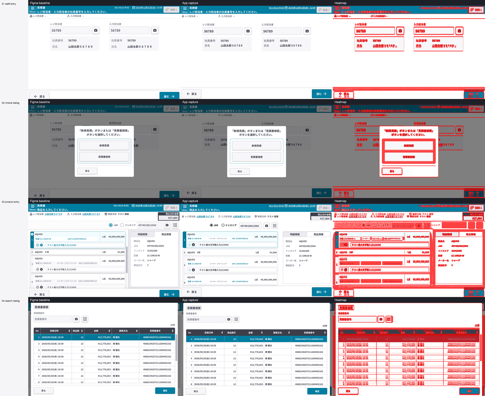

タブレットPOS
ARCH-UI-01 Figma UI実装検証 構造検証報告書
文書ID: ARCH-UI-01
第0.4.1版
2026年6月30日

## 改訂履歴

| 改訂日 | 版数 | 内容 | 改訂者 | 承認者 |
| :----- | :--- | :--- | :----- | :----- |
| 2026/06/30 | 0.4.1 | Figma から .NET MAUI XAML へ UI 実装するワークフローの検証方針を日本語化し、最小検証オプションを整理 | VTI-SAM | - |

## 目次

- [1. エグゼクティブサマリ](#1-エグゼクティブサマリ)
- [2. 背景とPOC範囲](#2-背景とpoc範囲)
- [3. セキュリティとデータ範囲](#3-セキュリティとデータ範囲)
- [4. UI実装ワークフロー](#4-ui実装ワークフロー)
- [5. 検証方法](#5-検証方法)
- [6. サンプル結果](#6-サンプル結果)
- [7. 現時点の制約](#7-現時点の制約)
- [8. 検証提案](#8-検証提案)
- [9. 成果物](#9-成果物)
- [10. まとめ](#10-まとめ)

## 1. エグゼクティブサマリ

### 1.1 結論

今回のPOCでは、Figmaの情報を取得し、Tablet POS向けの .NET MAUI XAML UI を構築するワークフローが実現可能であることを確認した。今回確認した流れは以下の通りである。

① Figmaの画面情報を取得

② XAMLを作成

③ アプリへ組み込み

④ シミュレータで起動

⑤ 各状態の画面をキャプチャ

⑥ Figmaと比較

⑦ UIを調整

本資料は、UI開発全体の委託を前提にしたものではなく、効果を実測するための検証提案である。まず小規模チームで代表的な1ルートを対象に検証し、速度、精度、自動化できる範囲、手作業が残る範囲を確認する。

Tablet POSでは画面数が多く、Figmaとの差分確認、手作業でのUI実装、コンポーネント統一、複数ベンダーでの実装ばらつきが課題になりやすい。POC上はUI初期実装工数を大きく削減できる可能性がある。削減率は小規模チーム検証で実測する。

### 1.2 注目ポイント

今回のPOCで重要な点は、事前にワークフローを準備した後、実行中は各画面を手作業で直さず、自動で処理を回した点である。人が行った作業は、各ループの後に比較シート、ヒートマップ、キャプチャ画像を目視確認し、次のループに向けてワークフローを改善することである。

| 項目 | 確認結果 |
|---|---|
| 1回目のループ | 約2時間の自動実行。初回のため、アプリ側の文脈情報はまだ不足していた |
| 1回目後のレビュー | 比較シート、ヒートマップ、各状態のキャプチャ画像を目視確認 |
| ワークフローの改善 | 画面名、レイアウト、フォント、アイコン、システムバー、ダイアログ、リスト/テーブルの不足ルールを追加 |
| 2回目のループ | ワークフロー更新後、約30分で自動実行 |
| 見た目の一致度 | 単純な画面はほぼ100%に近く、複雑なリスト項目画面でも90%以上の水準を確認 |
| 次回以降の方向性 | 画面文脈を段階的に追加し、バッチ実行に近い形で自動化を進める |

初回はアプリ側の前提情報が不足していたが、単純な画面ではFigmaにかなり近い結果になった。複雑なリスト項目画面でも高い水準まで到達しており、今後は画面文脈、コンポーネントルール、レイアウト判断の材料を少しずつ増やすことで、手作業への依存を下げながら完成度を上げていく方針である。

### 1.3 最小検証オプション

承認しやすい最小単位として、以下の検証オプションを提案する。

① 期間 2週間

② 対象 代表的な1ルート

③ 画面数 5〜10画面

④ 主な作業 Figma取得、XAML初期実装、アプリ組み込み、キャプチャ、比較、調整

⑤ 成果物 UI実装サンプル、比較画像、課題一覧、実測ベースの見積り報告書

⑥ 判断材料 速度、精度、自動化率、手作業が残る箇所、今後の拡張可否

この検証では、VTIにUI開発全体を依頼する前提ではなく、まず小さく効果を測る。結果を見た上で、対象画面を広げるか、コンポーネント共通化を進めるか、通常の実装体制へ渡すかを判断する形になる。

## 2. 背景とPOC範囲

### 2.1 背景

Tablet POSには多くの画面と操作フローが存在する。画面を1つずつ手作業で実装する場合、レイアウト、ヘッダー、フッター、ダイアログ、テーブル、アイコン、フォント、画面遷移状態の調整に多くの時間がかかる。

また、画面数が多いほど、Figmaとの差分レビュー、コンポーネントの統一、ベンダー間の実装差分の管理が難しくなる。特に複数ベンダーで機能実装を進める場合、UIの初期構造と画面遷移の土台を先にそろえておくことが重要になる。

Figmaには、画面サイズ、色、フォント、アイコン、コンポーネント位置、基準画像など、UI実装に使える情報が含まれている。これをワークフロー化できれば、小規模チームで初期レイアウトを早く作成し、画像比較で確認しながら品質を上げることができる。

### 2.2 POCで確認した範囲

今回のPOCでは、4つの状態を持つデモフローを確認した。画面名と状態名は、Figma上の表示内容を見て分かる名前にしている。

| 画面 / 状態 | 確認内容 |
|---|---|
| `C000001_担当者入力` | 担当者入力画面、フォームレイアウト、ヘッダー、フッターの確認 |
| `見積操作選択ダイアログ` | 見積操作を選択するポップアップの確認 |
| `商品入力画面` | 商品入力、商品リスト、検索エリア、合計金額の確認 |
| `見積書検索ダイアログ` | 見積書検索ダイアログ、検索結果テーブル、操作ボタン位置の確認 |

## 3. セキュリティとデータ範囲

今回のPOCでは、画面表示に使うデータはモックデータのみであり、本番データやSMJ様の実データは使用していない。

ソースコード、キャプチャ画像、比較画像、指標、報告書は、プロジェクトの内部ワークスペースに保存している。Figmaは権限付与済みアカウントでのみ参照する。証明書、プロビジョニング設定、シークレットはプロジェクトファイルへ書き込まない。

拡張時も、以下の管理を前提とする。

| 項目 | 管理方法 |
|---|---|
| 業務データ | 許可されたモックデータまたはテストデータのみを使用 |
| Figma | 権限付与済みアカウントで参照 |
| ソースコード | 差分レビューで変更内容を確認 |
| UIリソース | アイコン/フォントはアプリ内にローカル保存し、一時URLへ依存しない |
| ビルド/署名 | 証明書やプロビジョニング設定をソースへハードコードしない |

## 4. UI実装ワークフロー

提案するワークフローは4つのレイヤーで構成する。

| レイヤー | 役割 |
|---|---|
| Figma根拠情報 | Figmaから基準画像、レイアウト情報、スタイル、テキスト、アイコンを取得 |
| UI生成 | XAMLの骨組み、初期スタイル、ViewModelの状態、基本コマンドを作成 |
| アプリ組み込み | ページ、ルート、DI、ViewModel、画面遷移をTablet POSアプリへ組み込み |
| ビジュアル確認 | シミュレータで起動し、キャプチャ、Figma比較、UI調整を行う |

このワークフローは、既存アプリのアーキテクチャを置き換えるものではない。Tablet POSアプリのパターンに合わせ、以下を組み込む。

① ページXAML

② ViewModel

③ ルート

④ DI

⑤ リソース

## 5. 検証方法

検証手順は以下の通りである。

① Figmaから画面情報を取得

② XAMLとモックデータを作成

③ ルート、DI、ViewModelでアプリへ組み込み

④ シミュレータで起動し、フローを自動操作

⑤ 各状態の画面をキャプチャ

⑥ スクリーンショット差分、ピクセル差分、ヒートマップでFigmaと比較

⑦ UIを修正し、レビュー可能な水準まで繰り返す

比較結果は比較シート形式で整理する。Figma基準画像、アプリ画面キャプチャ、ヒートマップを横並びにすることで、SMJ様/JNET様側でもどこが合っていて、どこに差分が残っているかを確認しやすくなる。

## 6. サンプル結果

### 6.1 比較画像

以下は、今回のPOCで作成した比較結果である。各行が1つの画面状態を表し、Figma基準画像、アプリ画面キャプチャ、ヒートマップ差分を並べている。

### 6.2 フロー確認結果

`C000001_担当者入力`: 担当者入力画面を作成し、システムバーを保持した状態で確認した。

`見積操作選択ダイアログ`: 見積操作選択ポップアップを表示し、オーバーレイ状態を画像で確認した。

`商品入力画面`: 商品入力、リスト、検索、合計金額の表示を確認した。

`見積書検索ダイアログ`: 見積書検索ダイアログ、検索結果テーブル、操作ボタン群を確認した。

### 6.3 指標例

| 画面 / 状態 | 平均差分 | 備考 |
|---|---:|---|
| `C000001_担当者入力` | 6.3289 | アプリ領域のみ。システムバーは対象外 |
| `見積操作選択ダイアログ` | 5.6102 | アプリ領域のみ。システムバーは対象外 |
| `商品入力画面` | 15.4283 | テーブル/リストの追加調整が必要 |
| `見積書検索ダイアログ` | 23.6509 | ダイアログ/テーブルの追加調整が必要 |

上記の数値は、ループごとの改善傾向を見るための指標である。最終判断は、比較シートを使った目視レビューと合わせて行う。

今回のPOCでは、1回目のループは事前にワークフローを準備した上で約2時間自動実行した。実行中は各画面を手で修正していない。その後、目視レビューとワークフロー改善を行い、2回目のループは約30分で実行できた。単純な画面ではFigmaとほぼ一致する水準に近く、複雑なリスト項目画面でも90%以上の水準を確認できた。今後、画面文脈、レイアウトルール、コンポーネントパターンを段階的に追加することで、次回以降のループはさらに安定する見込みである。

## 7. 現時点の制約

現在のFigmaアカウントは無料/Starter相当であり、Figmaから取得できる情報量や実行回数に制限がある。多数の画面へ拡張する場合は、適切なプランを使うことで待ち時間を減らし、検証回数を増やせる可能性がある。

また、以下の点は引き続き技術者による確認が必要である。

| 制約 | 対応方針 |
|---|---|
| Figma、iOS、Windowsでフォント/描画差が出る | 各環境のキャプチャ画像で確認する |
| 少数画面だけでは共通コンポーネントが判断しにくい | 複数画面を作成した後に共通化する |
| 業務ロジックはUIだけでは判断できない | 仕様、API、業務プロセスを別途確認する |

今回のPOCは1つのデモフローでの確認である。方向性を判断する材料としては十分だが、全体見積りには代表的な追加フローでの実測が必要になる。

## 8. 検証提案

### 8.1 最小検証オプション

効果を測るための検証提案として、まず以下の最小単位で進めることを提案する。

① 期間 2週間

② 対象 代表的な1ルート

③ 画面数 5〜10画面

④ 実施内容 Figma情報取得、XAML初期実装、アプリ組み込み、キャプチャ、比較、調整

⑤ 成果物 報告書、比較画像、課題一覧、実測ベースの見積り

⑥ 判断観点 速度、精度、自動化率、手作業が残る範囲、横展開可否

この単位であれば、範囲が小さく、承認しやすい。検証結果として、UI初期実装にどの程度使えるか、どこから人のレビューが必要か、どのコンポーネントを共通化すべきかを具体的に判断できる。

### 8.2 検証で解決したい課題

この検証は、以下の課題を減らすことを目的とする。

| 課題 | 検証で確認すること |
|---|---|
| 画面数が多い | 5〜10画面を短期間で初期実装できるか |
| Figmaとの差分レビューが難しい | 比較シートとヒートマップで差分を見える化できるか |
| 手作業のUI実装に工数がかかる | 初期XAML作成をどこまで自動化できるか |
| コンポーネントがばらつきやすい | 複数画面から共通パターンを抽出できるか |
| 複数ベンダーで統一しにくい | 先にUI土台と画面遷移マップを作れるか |

### 8.3 検証後の広げ方

小規模チーム検証の結果が良ければ、次の順番で拡張する。

① Figma上の画面を初期XAMLとして先に作成

② Figmaの画面名とフローに合わせて画面遷移マップを作成

③ バッチでキャプチャと画面比較を実行

④ 十分な画面数を見た後でコンポーネントを共通化

⑤ UI土台ができた後、業務機能実装へ引き継ぐ

## 9. 成果物

小規模チーム検証では、以下を成果物とする。

| 成果物 | 内容 |
|---|---|
| UIソース | XAMLページ、ViewModel、リソース、SVGアイコン、フォント登録 |
| 画面遷移 | ルートマップ、クリック操作フロー、Figma名に沿った状態遷移 |
| 根拠資料 | Figma基準画像、アプリ画面キャプチャ、ヒートマップ、比較シート、指標 |
| ワークフロー | 検証チェックリスト、キャプチャ/比較スクリプト、対応付けガイドライン |
| 報告書 | 達成結果、残課題、実測工数、今後の見積り根拠 |

## 10. まとめ

今回のPOCにより、Figma情報を使って .NET MAUI XAML のUI初期実装を行い、シミュレータ上でキャプチャ、比較、調整まで回すワークフローは実現可能であることを確認した。

本提案は、効果を測るための検証提案である。まず2週間、1ルート、5〜10画面の最小範囲で実測し、その結果をもとにUI初期実装工数の削減可能性、コンポーネント共通化方針、今後の見積りを判断する。
