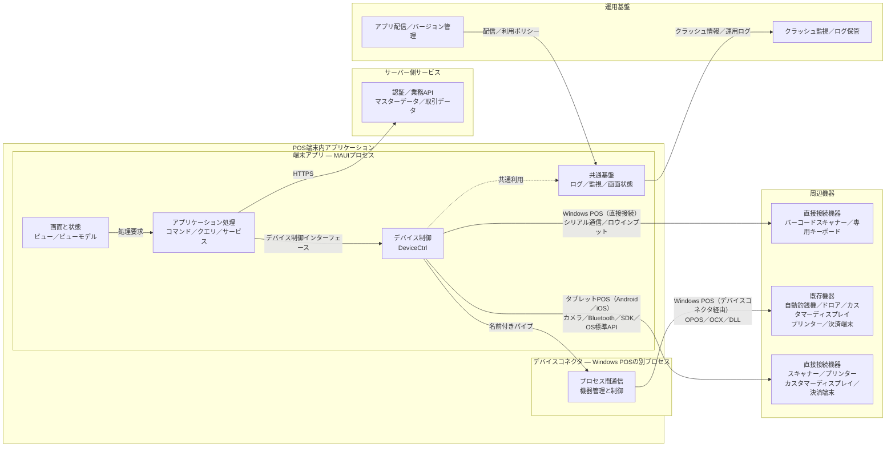
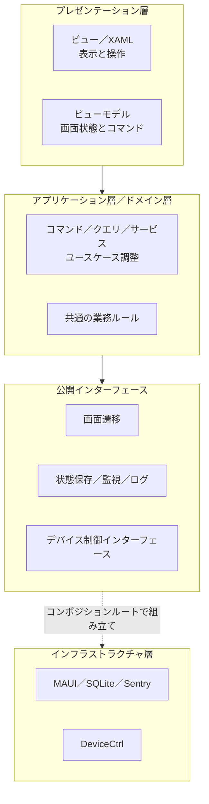
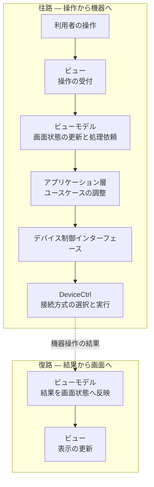
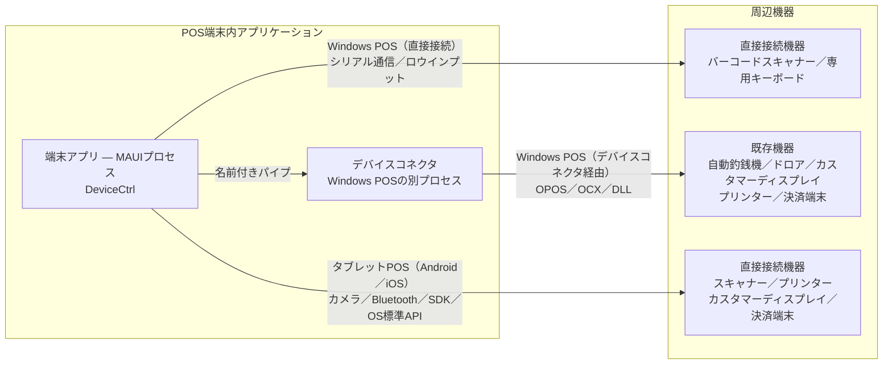
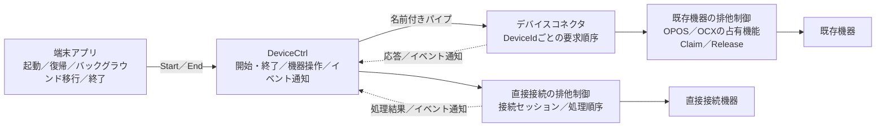
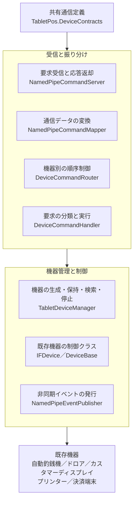
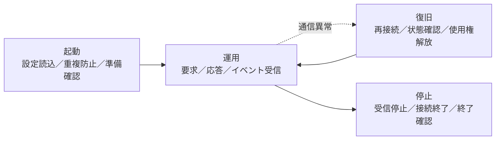

# 次世代POS アーキテクチャ提案書 v2.1 — スライドソース

> 本ファイルは配布資料の唯一のソースです。文章、図、イラストの配置をすべて含みます。
>
> ビルド: `python build_deck.py --md this.md --template template.pptx --out deck.pptx --diagrams diagrams.py --start-marker "## スライド構成" --art-root .`
>
> 設計参照日: 2026/08/27。対象: ケーズホールディングス様。

## 用語

| 用語 | 本資料での意味 |
|---|---|
| 直接接続 | DeviceCtrlが端末アプリのプロセス内で、シリアル通信（SerialPort）、ロウインプット（Raw Input）、SDKまたはOS標準APIを介して機器を制御する方式 |
| デバイスコネクタ経由 | DeviceCtrlが名前付きパイプでWindows POSの別プロセスへ要求を送り、そのプロセスが機器を制御する方式 |
| 既存の機器制御資産 | OPOS、OCX、ActiveXまたは機器ベンダー提供DLLを必要とする既存の制御ライブラリと設定 |
| 共通基盤 | TabletPos.Coreが提供するログ、監視、画面状態保存などの共通機能 |
| コンポジションルート | 依存性注入の登録、実装の組み立ておよびアプリライフサイクルの初期化を行う、端末アプリの構成起点 |
| 接続方式別実装 | DeviceManagerが設定に基づいて選択し、StrategyFactoryが生成する機器接続方式別の実装（ストラテジー） |
| タブレットPOS（Android／iOS） | AndroidまたはiOSを搭載し、共通の端末アプリと周辺機器接続方針を利用するPOS端末 |
| カスタマーディスプレイ | 商品情報や合計金額などをお客様へ提示するための表示装置 |
| 排他制御 | 同じ機器を複数のアプリまたはプロセスから同時に操作しないよう、使用権を管理する仕組み |
| 端末内データ保護 | 端末内のデータベース、業務ファイルおよびログを暗号化し、鍵をOSの安全な保管領域で管理する仕組み |

## 図とイラストの記法

- ```mermaid``` ブロックは図の内容そのものです。レビューと差分確認に使います。ビルド時は読み飛ばされます。
- ```diagram``` ブロックはその内容を PowerPoint のシェイプとして描く関数を指定します。関数は `diagrams.py` の `REGISTRY` にあります。`layout: full` は全面、`layout: right` は本文左・図右の二段組みです。
- 図の中身を変えるときは mermaid と `diagrams.py` の両方を直してください。mermaid が仕様、`diagrams.py` が描画です。
- ```art``` ブロックはイラストを配置します。座標はインチ、原点は左上。`h` または `w` のどちらか一方だけ指定すれば縦横比は保たれます。`file` のない行は文字ラベルになります。

## スライド構成

### Slide 1 — 表紙

**タイトル**

次世代POS アーキテクチャ提案書 v2.1

**補足**

- ケーズホールディングス様向け
- 2026/08/27

### Slide 2 — 目次

1. 全体構成
2. 端末アプリケーション
3. デバイス制御
4. デバイスコネクタ
5. 運用・保守

### Slide 3 — 第1 全体構成

システムの構成要素とプロセス境界を説明します。

- スライド4 — 設計範囲と前提
- スライド5 — システム全体構成
- スライド6 — プロセス構成と責務範囲

### Slide 4 — 設計範囲と前提

**主メッセージ**

Windows POSとタブレットPOS（Android／iOS）を対象とし、端末アプリ、サーバー側サービス、運用基盤および周辺機器の責務範囲を定めます。

**責務分担**

- 端末アプリは画面表示と業務処理を担当します。
- DeviceCtrlは接続方式の選択と機器制御を担当します。
- デバイスコネクタはWindows POSの別プロセスで既存の機器制御資産を扱います。
- サーバー側サービスは認証と業務APIを提供し、運用基盤はアプリ配信と監視を担当します。

**設計前提**

- 端末アプリは.NET MAUIの一つのプロセスとして動作します。
- DeviceCtrlは端末アプリのプロセス内で動作するライブラリです。
- Windows POSでは直接接続とデバイスコネクタ経由を使い分けます。
- タブレットPOS（Android／iOS）ではカメラ、Bluetooth、SDKまたはOS標準APIを介して周辺機器へ直接接続します。

```art
file: art/pos.png | x: 12.9 | y: 6.9 | h: 2.6
file: art/person_explain.png | x: 15.9 | y: 5.9 | h: 3.6
```

**出典**

ARCH-01 1.2、2.2、ARCH-DEVICE-01 2.1、ARCH-HOST-01 2.1

### Slide 5 — システム全体構成

**主メッセージ**

端末アプリ、サーバー側サービス、運用基盤および周辺機器の境界を明確にし、各領域を独立して変更できる構成とします。

**要点**

- 端末アプリは認証と業務処理をサーバー側サービスへ要求し、通信断に備えて必要な状態を端末内へ保持します。
- 画面およびアプリケーション処理は周辺機器を直接呼び出しません。
- DeviceCtrlがOSと設定に応じて接続経路を選択します。
- Windows POSでは既存機器への要求だけを、別プロセスのデバイスコネクタへ転送します。
- タブレットPOS（Android／iOS）では、共通の接続方針と対象機器を採用し、各OSに対応した接続方式別実装から周辺機器へ直接接続します。
- 運用基盤はアプリ配信、利用可能なバージョンの管理およびクラッシュ監視を担当します。

**図**

サーバー側サービス、運用基盤、POS端末内の二つのプロセスおよび周辺機器の全体関係を示します。



```diagram
name: system_overview | layout: full
```

**出典**

ARCH-01 2.1–2.5、4.5.5、6.1、7.2–7.4、9.4、ARCH-DEVICE-01 7.1–7.4、ARCH-HOST-01 5.1、KSNEWSYS-309、KSNEWSYS-396、KSNEWSYS-426

### Slide 6 — プロセス構成と責務範囲

**主メッセージ**

端末アプリは一つのMAUIプロセスで動作し、Windows POS向けの既存機器制御だけをデバイスコネクタへ分離します。

| 範囲 | 主な責務 | 設計目的 |
|---|---|---|
| 画面・アプリケーション | ビュー、ビューモデル、ユースケース、画面遷移 | 表示と処理を分ける |
| デバイス制御 | 設定、機器選択、デバイス制御インターフェース、接続方式別実装 | 機器や接続方式の差分を吸収する |
| 共通基盤・構成 | ログ、監視、画面状態、依存性注入、ライフサイクル | 共通機能と初期化を一か所で管理する |
| デバイスコネクタ | 要求受付、機器管理、OPOS／OCX／DLL呼出し | 既存の機器制御資産をWindows POSの別プロセスへ分離する |
| サーバー側サービス | 認証、業務API、マスターデータ、取引データ | 業務ルールと正となるデータを端末から分離する |
| 運用基盤 | アプリ配信、バージョン管理、クラッシュ監視、ログ保管 | 端末の運用状態と更新を一元管理する |

**出典**

ARCH-01 2.5、7.1、8.2、9.4、ARCH-02 2.2、ARCH-HOST-01 2.2、KSNEWSYS-309、KSNEWSYS-396、KSNEWSYS-426

### Slide 7 — 第2 端末アプリケーション

端末アプリの構造、表示、共通基盤およびデータ保護の方針を説明します。

- スライド8 — 端末アプリの責務分担
- スライド9 — 責務と変更影響範囲
- スライド10 — 画面のMVVM・レイヤ構成
- スライド11 — 対応端末とレスポンシブ表示方針
- スライド12 — 端末アプリの依存方向
- スライド13 — 画面操作から機器制御までの処理フロー
- スライド14 — アプリ起動・認証・状態復元
- スライド15 — 共通基盤とアプリライフサイクル
- スライド16 — 端末内データの暗号化と鍵管理
- スライド17 — ログ収集・監視・機微情報保護

### Slide 8 — 端末アプリの責務分担

**主メッセージ**

端末アプリの内部を画面・アプリケーション、デバイス制御および共通基盤・構成の三つの責務領域に分けます。

**責務領域**

- 画面・アプリケーション：ビュー、ビューモデル、アプリケーション処理、画面遷移
- デバイス制御：DeviceManager、設定、デバイス制御インターフェース、StrategyFactory、OS別の接続方式別実装
- 共通基盤・構成：TabletPos.Core、依存性注入、アプリライフサイクル、デバイスコネクタのプロセス管理

**効果**

- 画面変更による機器選択への影響を抑えます。
- 機器変更時も、ビューモデルは個別の実装クラスを意識しません。
- ログと画面状態保存の共通実装をTabletPos.Coreへ集約します。

**出典**

ARCH-01 2.5、3.1、7.1、ARCH-02 2.1–2.3

### Slide 9 — 責務と変更影響範囲

**主メッセージ**

変更内容から、担当領域と確認範囲を特定できます。

| 変更内容 | 担当領域 | 主な確認範囲 |
|---|---|---|
| 画面の追加・変更 | 画面・アプリケーション | ビュー、ビューモデル、画面遷移、アプリケーション処理 |
| 利用機器の変更 | デバイス制御 | DeviceCtrl設定、デバイス制御インターフェース、接続方式別実装、実機 |
| Windows POS向け既存機器の変更 | デバイスコネクタ | コネクタ設定、要求変換、デバイス制御インターフェース（IFDevice）、OPOS／OCX、実機 |
| 状態保存・ログの変更 | 共通基盤 | TabletPos.Core、ローカルデータ、監視 |
| コネクタのライフサイクル変更 | 端末アプリ／デバイスコネクタ | 起動、準備完了確認、停止、復旧 |

**出典**

ARCH-01 8.3、ARCH-02 6、ARCH-HOST-01 10.6

### Slide 10 — 画面のMVVM・レイヤ構成

**主メッセージ**

画面を責務ごとに分離し、表示変更による業務処理への影響を抑えます。

| 構成要素 | 責務 | 直接扱わない内容 |
|---|---|---|
| ビュー | 表示、入力、画面サイズに応じた配置 | 業務フロー、機器接続、保存 |
| ビューモデル | 画面状態、入力検証、コマンド、画面遷移要求 | OPOS、名前付きパイプ、SDK、SQLite、Sentry |
| アプリケーション層 | ユースケースの調整と外部境界の呼出し | 表示詳細、機器の具象実装 |
| ドメイン層 | 共通の業務ルールと状態 | 画面、OS、接続方式 |
| ポート／基盤層 | 画面遷移、保存、外部機能との接続口と実装 | 業務判断 |

**出典**

ARCH-01 3.1–3.6、ARCH-02 2.2–2.4、3–5

### Slide 11 — 対応端末とレスポンシブ表示方針

**主メッセージ**

共通の画面構造を保ちながら、端末の大きさ、解像度、DPIおよび向きに応じて見やすく操作しやすい表示へ調整します。

**対応方針**

- ビューは共通スタイルと相対配置を利用し、画面サイズに応じて余白、文字および操作領域を調整します。
- ビューモデルとアプリケーション層はレイアウトへ依存せず、Windows POSとタブレットPOS（Android／iOS）で共通利用します。
- Windows POSでは全画面表示とし、業務に不要なタイトルバーやタスクバーを表示しません。
- タブレットPOS（Android／iOS）ではセーフエリア、画面の向きおよびシステムバーを考慮します。
- 代表的な画面と画面遷移はPoCで動作を確認済みです。

| 確認軸 | 主な確認内容 |
|---|---|
| 端末 | Windows POS、タブレットPOS（Android／iOS） |
| 表示 | XGA、HD、FHD、4K、OSの拡大率、縦横比 |
| 操作 | 文字の可読性、タッチ領域、項目の見切れ、全画面表示 |
| 検証 | 代表端末と代表解像度を組み合わせた実機確認 |

```art
file: art/pos.png | x: 15.9 | y: 6.4 | h: 2.8 | caption: 端末に応じた表示
```

**出典**

KSNEWSYS-17、KSNEWSYS-18、KSNEWSYS-28、KSNEWSYS-137、KSNEWSYS-353、KSNEWSYS-399、KSNEWSYS-416、PoC実装確認

### Slide 12 — 端末アプリの依存方向

**主メッセージ**

依存先を公開インターフェースに限定し、基盤技術の変更がユースケースへ直接波及しない構成とします。

**要点**

- ビューモデルはアプリケーション層のユースケースを呼び出します。
- アプリケーション層は公開インターフェースを通じて外部機能を利用します。
- コンポジションルートがMAUI、SQLite、Sentry、DeviceCtrlをアプリ起動時に組み立てます。

**設計原則**

- ビューモデルは具象の機器実装を生成しません。
- アプリケーション層はMAUI、名前付きパイプ、SQLiteおよびSentryの実装詳細へ依存しません。
- コンポジションルートを依存性注入と実装組み立ての一つの起点とします。



```diagram
name: dependency | layout: right
```

**出典**

ARCH-01 3.2、3.6、7.1、ARCH-02 2.3、5、6.1

### Slide 13 — 画面操作から機器制御までの処理フロー

**主メッセージ**

ビューを機器実装から切り離し、機器変更時の画面修正を最小限に抑えます。

**処理順序**

1. ビューが操作をビューモデルのコマンドへ渡します。
2. ビューモデルが画面状態を更新し、アプリケーション層へ処理を依頼します。
3. アプリケーション層がデバイス制御インターフェースを呼び出します。
4. DeviceCtrlが設定とプラットフォームに応じて接続方式別実装を選択します。
5. ビューモデルが結果を画面状態へ反映し、ビューが表示を更新します。



```diagram
name: process_flow | layout: right
```

**出典**

ARCH-01 3.3–3.4、6.7、ARCH-DEVICE-01 2.1、5.1–5.4

### Slide 14 — アプリ起動・認証・状態復元

**主メッセージ**

起動時の確認処理を共通化し、必要な情報と機器状態を確認してから安全に業務を開始します。

**起動順序**

1. アプリのバージョンと利用可否を確認します。
2. 端末設定とデバイス設定を取得し、取得できない場合は直近の有効な設定を使用します。
3. オフライン業務に必要な情報と案内情報を更新します。
4. 認証状態を確認し、必要に応じて再ログインを求めます。
5. 決済端末の接続状態を確認し、利用可否を画面へ通知します。
6. デバイス制御を初期化し、保存済みの画面状態と入力内容を復元します。

**認証と復元の原則**

- 一定時間操作がない場合は、サーバー側の認証期限に従って再ログインを求めます。
- アプリの異常終了またはタスク終了後は、再ログインを行ってから保存済みの状態を復元します。
- 復元対象を画面入力、業務状態および一時的な表示状態に分け、必要な情報だけを保存します。
- 認証情報はOSの安全な保管領域へ保存します。

**出典**

KSNEWSYS-309、KSNEWSYS-390、KSNEWSYS-394、KSNEWSYS-427

### Slide 15 — 共通基盤とアプリライフサイクル

**主メッセージ**

共通機能をTabletPos.Coreとコンポジションルートへ集約し、方式変更を一か所で管理します。

| 機能 | 責務 |
|---|---|
| ログ | 端末アプリとDeviceCtrlへ共通のログ出力インターフェースを提供する |
| 監視 | 障害前の操作履歴とクラッシュ情報を記録する |
| 画面状態 | 対象となるビューモデルの状態をSQLiteへ保存し、再ログイン後またはアプリ復帰時に復元する |
| 依存性注入 | ビュー、ビューモデル、アプリケーション層、TabletPos.Core、DeviceCtrlを登録する |
| ライフサイクル | DeviceManagerを初期化し、Windows POSではコネクタとイベント受信を起動・停止する |

**出典**

ARCH-01 3.6、3.8、7、ARCH-02 2.1、4.1、5.4

### Slide 16 — 端末内データの暗号化と鍵管理

**主メッセージ**

端末内の業務データとログを暗号化し、端末の紛失や不正アクセスが発生しても保存内容を容易に読み取れない構成とします。

| 保護対象 | 暗号化方針 | 鍵の保管先 |
|---|---|---|
| SQLite | データベース全体をAES-256相当の方式で暗号化する | OSの安全な保管領域 |
| 業務ファイル | 保存前に暗号化し、利用時だけメモリ上で復号する | OSの安全な保管領域 |
| ログファイル | 端末保存時に暗号化し、送信時はHTTPSで保護する | 業務データとは異なる鍵 |

**鍵管理の原則**

- Windows POSでは資格情報マネージャー（Credential Manager）とDPAPI、タブレットPOS（Android／iOS）ではAndroid KeystoreまたはiOS Keychainを利用します。
- 端末、環境および用途ごとに鍵を分け、クラウド側の鍵を端末へ保存しません。
- 端末IDや営業日だけから推測できる鍵は使用しません。
- 鍵をソースコード、設定ファイルまたはログへ出力しません。
- アプリ更新、端末交換および初期化に備えて鍵の更新と失効を管理します。
- 端末紛失時は端末管理基盤からロック、利用停止または遠隔消去を行います。

**出典**

KSNEWSYS-156、KSNEWSYS-195、KSNEWSYS-482

### Slide 17 — ログ収集・監視・機微情報保護

**主メッセージ**

運用ログとクラッシュ監視を分け、調査に必要な情報を確保しながら通信量、運用費用および情報漏えいのリスクを抑えます。

| 種別 | 主な内容 | 保存・送信先 |
|---|---|---|
| 運用ログ | 画面遷移、API通信、業務処理、機器操作 | 暗号化したローカルログ |
| クラッシュ情報 | 未処理例外、スタックトレース、直前の操作履歴 | Sentry |
| 長期保管ログ | 障害調査または監査に必要なログ | サーバーまたはオブジェクトストレージ |

**運用と保護**

- 日付とファイルサイズでログをローテーションし、保存期間と上限容量を設定します。
- ネットワーク切断中は端末内に保持し、回復後に暗号化した通信で再送します。
- Sentryへ送信する対象はクラッシュと未処理例外を中心とし、通常の操作ログは一律送信しません。
- カード情報、暗証番号、認証トークン、個人情報およびAPIの本文を記録しません。
- 調査に識別子が必要な場合は、マスキングまたはハッシュ化した値を使用します。
- 端末アプリ、DeviceCtrlおよびデバイスコネクタのログを区分し、障害箇所を特定できるようにします。

**出典**

KSNEWSYS-155、KSNEWSYS-209、KSNEWSYS-377、KSNEWSYS-426

### Slide 18 — 第3 デバイス制御

DeviceCtrlが機器と接続方式を選択し、安全に使用権と取引状態を管理する仕組みを説明します。

- スライド19 — デバイス制御方式の選択
- スライド20 — デバイス制御の内部構造
- スライド21 — 端末種別ごとの機器接続経路
- スライド22 — 接続方式別の排他制御
- スライド23 — 決済端末の制御と取引状態管理

### Slide 19 — デバイス制御方式の選択

**主メッセージ**

機器差分をデバイス制御インターフェースの内側で吸収し、アプリケーション層に機器別の分岐を持たせません。

**要点**

- DeviceManagerとStrategyFactoryがアプリケーション層に代わって接続方式別実装を選択します。
- 選択条件は設定、OSおよび機器種別です。

| 構成要素 | 役割 |
|---|---|
| DeviceManager | 現在の設定を保持し、有効な機器を選択する |
| DeviceControllerConfigService | DeviceCtrl設定を読み込み、保存し、必要に応じて既定値へ切り替える |
| StrategyFactory | 選択された機器仕様（DeviceSpec）に対応する接続方式別実装を生成する |
| デバイス制御インターフェース | 開始（Start）、機器操作、終了（End）を機器種別ごとに定義する |
| OS別の接続方式別実装 | 名前付きパイプ、シリアル通信、ロウインプット、SDKまたはOS標準APIを使い分ける |

**出典**

ARCH-DEVICE-01 2.1–2.3、5.1–5.4

### Slide 20 — デバイス制御の内部構造

**主メッセージ**

設定ファイルから有効な機器と接続方式別実装を決定し、デバイス制御インターフェースとしてアプリケーション層へ提供します。

**初期化と選択の順序**

1. DeviceManagerがDeviceControllerConfigServiceへ設定の読み込みを要求します。
2. アプリデータフォルダの設定を優先します。
3. 利用できない場合は同梱された既定設定へ切り替えます。
4. 機器種別、OS、有効な識別子から有効デバイス設定（ActiveDevice）と機器仕様（DeviceSpec）を選択します。
5. StrategyFactoryが接続方式別実装を生成し、デバイス制御インターフェースとして返します。
6. アプリケーション層は返されたインターフェースを利用し、個別実装を選択しません。

**管理対象**

- `device_controller_config.json`
- アプリデータフォルダの有効設定
- 同梱された既定設定

**出典**

ARCH-01 4.6、ARCH-DEVICE-01 6.1–6.4、ARCH-02 4.3、5.4

### Slide 21 — 端末種別ごとの機器接続経路

**主メッセージ**

Windows POSでは既存の機器制御資産を必要とする周辺機器だけをデバイスコネクタ経由とし、タブレットPOS（Android／iOS）は共通の直接接続方針で制御します。

| 経路 | 方式 | 対象機器 |
|---|---|---|
| Windows POS（直接接続） | シリアル通信（SerialPort）、ロウインプット（Raw Input） | バーコードスキャナー、専用キーボード |
| Windows POS（デバイスコネクタ経由） | 名前付きパイプ、OPOS／OCX／DLL | 既存機器：自動釣銭機、ドロア、カスタマーディスプレイ、プリンター、決済端末 |
| タブレットPOS（Android／iOS） | カメラ、Bluetooth、SDKまたはOS標準APIによる直接接続 | スキャナー、プリンター、カスタマーディスプレイ、決済端末 |

**設計原則**

- DeviceCtrlはWindows POSとタブレットPOS（Android／iOS）の端末アプリ内で動作します。
- Windows POSのスキャナーと専用キーボードはコネクタを経由しません。
- デバイスコネクタは周辺機器ではなく、端末アプリとは別に動作するWindows POSのプロセスです。
- タブレットPOS（Android／iOS）にはデバイスコネクタに相当する中間プロセスを設けず、DeviceCtrl内の接続方式別実装から制御します。



```diagram
name: three_routes | layout: right
```

```art
label: Windows POS（直接接続） | x: 0.4 | y: 7.6 | w: 2.2 | size: 11
label: Windows POS（デバイスコネクタ経由） | x: 2.8 | y: 7.6 | w: 5.3 | size: 11
file: art/scanner.png | x: 0.85 | y: 8.0 | h: 1.3 | caption: バーコードスキャナー | size: 10
file: art/printer.png | x: 2.60 | y: 8.0 | h: 1.3 | caption: レシートプリンター | size: 10
file: art/changer.png | x: 4.35 | y: 8.0 | h: 1.3 | caption: 自動釣銭機 | size: 10
file: art/drawer.png | x: 6.10 | y: 8.0 | h: 1.3 | caption: キャッシュドロア | size: 10
```

**出典**

ARCH-01 1.2、4.5.5、6.1、ARCH-DEVICE-01 7.1–7.4

### Slide 22 — 接続方式別の排他制御

**主メッセージ**

排他制御は接続方式に応じた実装層で行い、端末アプリはアプリライフサイクルに合わせて機器の使用開始と終了を指示します。

| 接続経路 | 排他制御の実装箇所 | 制御方法 |
|---|---|---|
| Windows POS（デバイスコネクタ経由） | デバイスコネクタと既存機器制御 | DeviceId単位で要求を順序制御し、OPOS／OCXの占有機能（Claim／Release）を利用する |
| Windows POS（直接接続） | DeviceCtrlの接続方式別実装 | DeviceId単位で接続状態と処理順序を管理する |
| タブレットPOS（Android／iOS） | DeviceCtrlの接続方式別実装 | DeviceId単位で接続セッションと処理順序を管理し、OS／SDKの接続機能を利用する |

**端末アプリとの連携**

- 端末アプリは起動・復帰時にDeviceCtrlの開始処理（Start）を呼び出します。
- 端末アプリはバックグラウンド移行・終了時に終了処理（End）を呼び出し、機器の使用権を安全に解放します。
- DeviceCtrlは開始・終了および機器操作の共通インターフェースを提供し、処理結果、切断および機器イベントを応答またはイベント通知で端末アプリへ返します。
- デバイスコネクタまたは直接接続の実装が排他制御を行い、端末アプリは個別のOPOS／OCX、OSまたはSDKを直接操作しません。



**出典**

ARCH-01 3.8、5.6、7.2.4、ARCH-DEVICE-01 5–7、ARCH-HOST-01 5.6、6–8、KSNEWSYS-14、KSNEWSYS-41、KSNEWSYS-344

### Slide 23 — 決済端末の制御と取引状態管理

**主メッセージ**

決済処理を専用の通信モジュールへ集約し、タイムアウトや通信断が発生しても二重決済を防止します。

**処理の流れ**

1. アプリ起動時と取引開始前に決済端末の接続状態を確認します。
2. 業務アプリはDeviceCtrlの決済インターフェースへ処理を依頼します。
3. 決済通信モジュールが決済種別に応じて要求を変換し、決済端末へ送信します。
4. 取引識別子と処理状態を保持し、応答、取消および端末イベントを同じ取引へ関連付けます。
5. 結果が不明な場合は自動再送せず、状態照会または取消処理で確定します。

| 状態 | 主な処理 |
|---|---|
| 接続確認 | 端末の利用可否を確認する |
| 取引開始 | 取引識別子を発行し、決済要求を一度だけ送信する |
| 処理中 | 応答、端末イベントおよび利用者による取消を監視する |
| 完了 | 結果を業務アプリへ返し、取引状態を確定する |
| 結果不明 | 状態照会または取消を行い、同じ決済要求を再送しない |

**出典**

KSNEWSYS-42、KSNEWSYS-269、KSNEWSYS-270、KSNEWSYS-390

### Slide 24 — 第4 デバイスコネクタ

デバイスコネクタを別プロセスとする理由、内部処理およびライフサイクルを説明します。

- スライド25 — デバイスコネクタを別プロセスに分離する理由
- スライド26 — デバイスコネクタ内部構造
- スライド27 — プロセス間通信の境界
- スライド28 — デバイスコネクタの起動・停止・復旧

### Slide 25 — デバイスコネクタを別プロセスに分離する理由

**主メッセージ**

既存ライブラリの実行条件に対応するため、デバイスコネクタをWindows POSの別プロセスとします。

| 理由 | 適用する設計 |
|---|---|
| 実行環境の相違 | OPOS、OCX、ActiveX、ベンダーDLLをWindows POSの別プロセスで実行する |
| OCX／COMの要件 | WinFormsでメッセージループ、画面スレッド、シングルスレッドアパートメント（STA）の制約を維持する |
| 機器管理の集約 | 設定に従って機器を初期化、保持、検索、実行、停止する |
| 障害の分離 | 端末アプリ、プロセス間通信、機器のログと障害を分けて調査する |
| 適用範囲 | 既存の機器制御資産を必要とする機器だけをコネクタ経由とする |

```art
file: art/person_trouble.png | x: 16.3 | y: 6.0 | h: 3.5
```

**出典**

ARCH-HOST-01 2.1–2.3、3.4、ARCH-01 5.1、5.7

### Slide 26 — デバイスコネクタ内部構造

**主メッセージ**

デバイス識別子（DeviceId）ごとに要求順序を管理し、異なる機器を並行して処理します。

**処理順序**

1. コマンド用パイプから要求を受信します。
2. 通信データを内部コマンドへ変換します。
3. デバイス識別子（DeviceId）ごとのキューへ登録します。
4. 対象機器のデバイス制御インターフェース（IFDevice）を呼び出します。
5. 機器イベントをイベント用パイプへ発行します。



```diagram
name: component_internal | layout: right
```

**出典**

ARCH-03 3–4、ARCH-HOST-01 5.3、7、ARCH-01 5.5–5.7

### Slide 27 — プロセス間通信の境界

**主メッセージ**

コマンドとイベントを別経路に分け、非同期イベントがコマンド応答を待たせない構成とします。

| 境界 | 処理 | 目的 |
|---|---|---|
| コマンド用パイプ | 1件の要求に対し、同じ接続で1件の応答を返す | 機器操作ごとの結果を明確にする |
| イベント用パイプ | コネクタがイベントを発行し、DeviceCtrlが独立して受信する | イベントをコマンド応答待ちから分離する |
| 共有通信定義（TabletPos.DeviceContracts） | データ転送オブジェクト（DTO）、識別子、既定値を二つのプロセスで共有する | 通信定義の重複を防ぐ |
| 機器別キュー | 同一機器の順序を保ち、異なる機器は個別に処理する | 一つの機器が別の機器を待たせない |

**設計原則**

- 要求送信前だけ再接続を試行します。
- 送信後に結果が不明な要求は自動再送しません。
- イベント用パイプをコマンドの同期応答の代わりに使用しません。

**出典**

ARCH-HOST-01 2.3、6.2.3、7.3、7.5、8.1、ARCH-03 3.1–3.4

### Slide 28 — デバイスコネクタの起動・停止・復旧

**主メッセージ**

端末アプリが起動したデバイスコネクタだけを管理し、正常終了と異常復旧のどちらでも不要な接続と使用権を残しません。

**起動**

- DeviceCtrl設定を読み込み、デバイスコネクタが未起動の場合だけ起動します。
- ミューテックス（Mutex）で同じデバイスコネクタの重複起動を防止します。
- 準備完了を確認してから、イベント受信と機器操作を開始します。

**運用と復旧**

- イベント用パイプが切断された場合は、一定時間待機してから再接続します。
- 要求送信後に結果が不明な場合は自動再送せず、機器または取引の状態を確認します。
- 端末アプリまたは通信が異常終了した場合は、一定時間の無通信を検知して機器の使用権を解放します。

**停止**

- イベント受信を停止してから、デバイスコネクタへ停止を要求します。
- デバイスコネクタは通信経路と機器接続を順に終了します。
- 端末アプリが起動していないデバイスコネクタは停止しません。



**出典**

ARCH-HOST-01 6.1–6.2、7.2、10.3、ARCH-01 3.8、7.2.4、KSNEWSYS-14

### Slide 29 — 第5 運用・保守

オフライン時の業務継続とアプリの配信・更新方針を説明します。

- スライド30 — オフライン継続と再同期
- スライド31 — アプリ配信とバージョンアップ
- スライド32 — まとめ

### Slide 30 — オフライン継続と再同期

**主メッセージ**

通信断の影響範囲を限定し、許可された業務を継続しながら通信回復後に安全にデータを同期します。

| 状況 | 端末側の動作 |
|---|---|
| オンライン | APIから最新情報を取得し、サーバー側のデータを正として処理する |
| 一時的な通信断 | 直近の有効な設定と業務継続用データを利用する |
| オフライン処理 | 許可された業務だけを実行し、送信待ちデータへ記録する |
| 通信回復 | 送信待ちデータを順序どおりに送信し、結果を照合する |

**データ整合性の原則**

- 送信待ちデータには一意な処理識別子を付与し、同じ処理の重複登録を防止します。
- タイムアウト後に結果が不明な更新処理は自動再送せず、サーバー側の処理結果を確認します。
- 商品、価格、在庫など有効期限が業務へ影響する情報には利用期限を設定します。
- 同期前にアプリ更新が必要な場合は、送信待ちデータを保護してから更新します。
- 同期失敗をログへ記録して監視対象とし、未送信データを端末から削除しません。

**出典**

KSNEWSYS-183、KSNEWSYS-407、KSNEWSYS-497、KSNEWSYS-653

### Slide 31 — アプリ配信とバージョンアップ

**主メッセージ**

Windows POSとタブレットPOS（Android／iOS）の配信経路を分けながら、利用可能なバージョンを共通ポリシーで統制します。

| 対象 | 配信方針 |
|---|---|
| Windows POS | 管理された配信領域から更新プログラムを取得し、更新結果を記録する |
| タブレットPOS（Android／iOS） | 端末管理基盤を介して管理対象アプリを配信する |

**更新の原則**

- 起動時に現在のバージョンと利用可能なバージョンを確認します。
- サーバー側のポリシーで必須更新と任意更新を判定します。
- API、端末内データおよびデバイス設定との互換性を確認してから更新します。
- 未送信データがある場合は同期または保護を完了してから更新します。
- 更新後に設定と端末内データを移行し、起動確認と更新結果を記録します。
- 更新に失敗した場合は業務開始を抑止し、安全な復旧手順へ移行します。

**出典**

KSNEWSYS-143、KSNEWSYS-390、KSNEWSYS-396

### Slide 32 — まとめ

**主メッセージ**

共通の業務構造と端末種別に応じた機器接続方式を組み合わせ、安全性、運用性および拡張性を備えた端末基盤を実現します。

**まとめ**

- Windows POSとタブレットPOS（Android／iOS）で画面構造と業務処理を共通化します。
- 画面サイズ、解像度、DPIおよび端末の向きの違いを表示層で吸収します。
- DeviceCtrlが設定、OSおよび機器種別から接続方式別実装を選択します。
- Windows POSでは既存の機器制御資産をデバイスコネクタへ分離します。
- 機器ごとの排他制御と決済状態管理により、競合操作と二重決済を防止します。
- 端末内データとログを暗号化し、OSの安全な保管領域で鍵を管理します。
- オフライン継続、状態復元、ログ監視およびバージョンアップを共通基盤として管理します。

```art
file: art/person_explain.png | x: 16.0 | y: 5.9 | h: 3.6
```

**出典**

ARCH-01、ARCH-02、ARCH-03、ARCH-DEVICE-01、ARCH-HOST-01、関連Backlog課題

## 出典一覧

1. ARCH-01 — タブレットPOS ソフトウェア構造設計書 v1.0.2（2026/08/24）
2. ARCH-02 — タブレットPOS 端末アプリケーション構造設計書 v1.0.1（2026/08/24）
3. ARCH-03 — タブレットPOS デバイスコネクタ構造設計書（2026/08/24）
4. ARCH-DEVICE-01 — 次世代POS デバイス制御クラス構成図 v0.1.1（2026/08/24）
5. ARCH-HOST-01 — タブレットPOS デバイスコネクタ基本設計書 v0.3.10（2026/08/24）
6. 端末別表示 — KSNEWSYS-17、18、28、137、353、399、416
7. 端末内データ保護 — KSNEWSYS-156、195、482
8. ログ・監視 — KSNEWSYS-155、209、377、426
9. 起動・認証・状態復元 — KSNEWSYS-309、390、394、427
10. 排他制御・決済端末 — KSNEWSYS-14、41、42、269、270
11. オフライン・配信・更新 — KSNEWSYS-143、183、396、407、497、653
