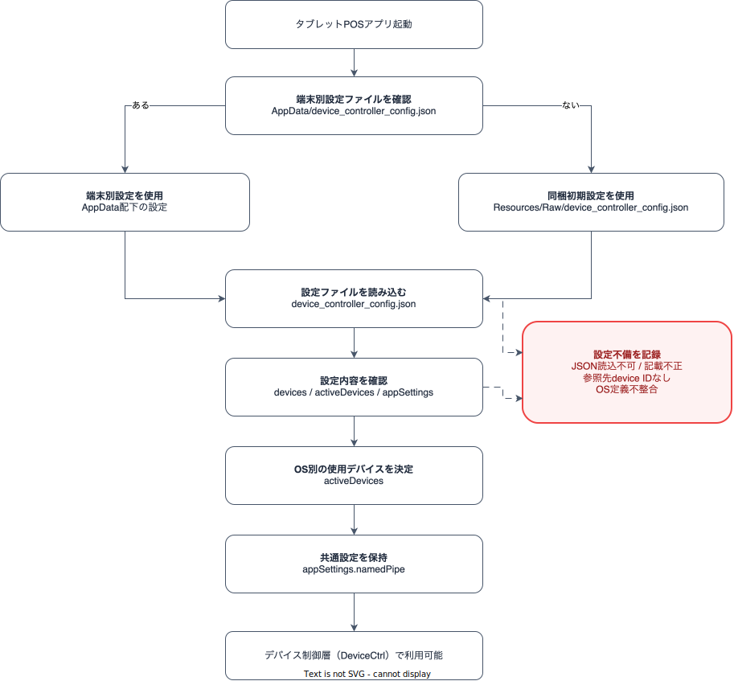
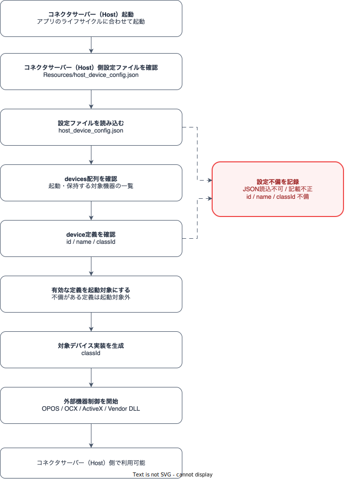

# デバイス制御層設定ファイル記載要領

文書ID: CFG-01

## 改訂履歴

| 改訂日 | 版数 | 内容 | 改訂者 | 承認者 |
|---|---|---|---|---|
| 2026/06/11 | 0.1.0 | `device_controller_config.json` および `host_device_config.json` の記載要領を新規作成 | VTI-サム | - |
| 2026/06/12 | 0.1.1 | デバイス種類ごとの `device_controller_config.json` 記載例を追加 | VTI-サム | - |
| 2026/06/15 | 0.1.2 | `device_controller_config.json` の全体記載例を追加 | VTI-サム | - |
| 2026/06/25 | 0.1.3 | 設定ファイル名、配置先、Named Pipe 名を現行構成に合わせて更新 | VTI-サム | - |

## 目次

- [1. はじめに](#1-はじめに)
  - [1.1 本書の位置づけ](#11-本書の位置づけ)
  - [1.2 対象ファイル](#12-対象ファイル)
  - [1.3 前提事項](#13-前提事項)
  - [1.4 関連ドキュメント](#14-関連ドキュメント)
- [2. 設定ファイルの全体像](#2-設定ファイルの全体像)
  - [2.1 デバイス設定を含む全体構成](#21-デバイス設定を含む全体構成)
  - [2.2 設定ファイルの役割サマリ](#22-設定ファイルの役割サマリ)
  - [2.3 本書の読み進め方](#23-本書の読み進め方)
- [3. device_controller_config.json 詳細](#3-device_controller_configjson-詳細)
  - [3.1 役割](#31-役割)
  - [3.2 起動時設定読込フロー](#32-起動時設定読込フロー)
  - [3.3 起動時処理概要](#33-起動時処理概要)
  - [3.4 ルート項目](#34-ルート項目)
  - [3.5 devices 配列](#35-devices-配列)
  - [3.6 devices[].config](#36-devicesconfig)
  - [3.7 activeDevices](#37-activedevices)
  - [3.8 appSettings.namedPipe](#38-appsettingsnamedpipe)
  - [3.9 記載値一覧](#39-記載値一覧)
- [4. host_device_config.json 詳細](#4-host_device_configjson-詳細)
  - [4.1 役割](#41-役割)
  - [4.2 起動時設定読込フロー](#42-起動時設定読込フロー)
  - [4.3 起動時処理概要](#43-起動時処理概要)
  - [4.4 ルート項目](#44-ルート項目)
  - [4.5 devices 配列](#45-devices-配列)
  - [4.6 現行定義一覧](#46-現行定義一覧)
  - [4.7 端末側設定との対応関係](#47-端末側設定との対応関係)
- [5. デバイス取得・制御処理概要](#5-デバイス取得制御処理概要)
  - [5.1 使用デバイス選択処理](#51-使用デバイス選択処理)
  - [5.2 Windows 端末の外部機器制御](#52-windows-端末の外部機器制御)
  - [5.3 iOS / Android 端末の外部機器制御](#53-ios--android-端末の外部機器制御)
- [6. 記載時チェックリスト](#6-記載時チェックリスト)
- [7. デバイス種類ごとの記載例](#7-デバイス種類ごとの記載例)
  - [7.1 記載例の前提](#71-記載例の前提)
  - [7.2 プリンター](#72-プリンター)
  - [7.3 スキャナー](#73-スキャナー)
  - [7.4 カスタマーディスプレイ](#74-カスタマーディスプレイ)
  - [7.5 キーボード](#75-キーボード)
  - [7.6 キャッシュドロワー](#76-キャッシュドロワー)
  - [7.7 自動釣銭機](#77-自動釣銭機)
  - [7.8 device_controller_config.json 全体記載例](#78-device_controller_configjson-全体記載例)

## 1. はじめに

### 1.1 本書の位置づけ

本書は、タブレットPOSのデバイス制御層で使用する設定ファイルの記載要領を定義する文書である。

対象読者は、端末ごとの周辺機器設定を作成・確認する開発者、テスト担当者、導入担当者である。

本書では、端末アプリケーション側の設定である `device_controller_config.json` と、コネクタサーバー（Host）側の設定である `host_device_config.json` を分けて説明する。

### 1.2 対象ファイル

| ファイル | 所在 | 用途 |
|---|---|---|
| `device_controller_config.json` | `TabetPos.Applications/Resources/Raw/device_controller_config.json` | アプリに同梱する初期設定 |
| `device_controller_config.json` | `FileSystem.AppDataDirectory/device_controller_config.json` | 起動後に編集・保存する端末別設定 |
| `host_device_config.json` | `TabetPos.Host/src/AppServer/Resources/host_device_config.json` | コネクタサーバー（Host）側に同梱するデバイス実装設定 |
| `host_device_config.json` | `コネクタサーバー実行フォルダ\Resources\host_device_config.json` | ビルド後にコネクタサーバー（Host）が実際に読み込む設定 |

### 1.3 前提事項

- `device_controller_config.json` は、端末アプリケーション側で使用するデバイス設定である。
- `host_device_config.json` は、コネクタサーバー（Host）側で使用するデバイス設定である。
- `device_controller_config.json` は、コネクタサーバー（Host）側のデバイス読込設定を置き換えない。
- Windows の OPOS / OCX / ActiveX lifecycle はコネクタサーバー（Host）側に閉じ込める。
- 端末アプリケーションは OPOS / OCX / ActiveX を直接呼び出さない。

### 1.4 関連ドキュメント

| ファイル名 |
|---|
| ARCH-01_タブレットPOS_ソフトウェア構造設計書.docx |
| ARCH-02_タブレットPOS_端末アプリケーション構造設計書.docx |
| コネクタサーバー構造設計書 |
| PS-HOST-01_タブレットPOS_ホスト_名前付きパイプコマンドサーバー_プログラム仕様書.xlsx |
| PS-HOST-02_タブレットPOS_ホスト_名前付きパイプデバイスホストアダプター_プログラム仕様書.xlsx |
| PS-HOST-03_タブレットPOS_ホスト_デバイスコマンドルーター_プログラム仕様書.xlsx |
| PS-HOST-04_タブレットPOS_ホスト_デバイスコマンドハンドラー_プログラム仕様書.xlsx |
| PS-HOST-05_タブレットPOS_ホスト_デバイスサーバーホスト_プログラム仕様書.xlsx |
| PS-HOST-06_タブレットPOS_ホスト_デバイスマネージャー_プログラム仕様書.xlsx |
| PS-HOST-07_タブレットPOS_ホスト_デバイスベース_プログラム仕様書.xlsx |
| PS-HOST-08_タブレットPOS_ホスト_釣銭機制御_RT-300_プログラム仕様書.xlsx |
| PS-HOST-09_タブレットPOS_ホスト_自動釣銭機UIスレッドフォーム_RT-300_プログラム仕様書.xlsx |
| PS-HOST-10_タブレットPOS_ホスト_キャッシュドロア制御_SHARP_プログラム仕様書.xlsx |
| PS-HOST-11_タブレットPOS_ホスト_カスタマーディスプレイ制御_SHARP_プログラム仕様書.xlsx |

## 2. 設定ファイルの全体像

本章では、2 つの設定ファイルがシステム全体のどこで使用されるかを示す。詳細なキー定義は 3 章および 4 章で説明する。

### 2.1 デバイス設定を含む全体構成

| 構成要素 | 役割 | 関連する設定 |
|---|---|---|
| POS 利用者 | タブレットPOSアプリを操作する | - |
| タブレットPOSアプリ | 売上、会計、周辺機器操作を行う端末アプリケーション | `device_controller_config.json` |
| 端末側デバイス設定 | 端末で使用するデバイス候補、有効デバイス、接続情報を定義する | `device_controller_config.json` |
| コネクタサーバー（Host） | Windows 端末で OPOS / OCX / ActiveX 機器を制御する外部プロセス | `host_device_config.json` |
| コネクタサーバー（Host）側デバイス設定 | コネクタサーバー（Host）が起動・保持する既存デバイス資源を定義する | `host_device_config.json` |
| Windows 端末の外部機器 | カスタマーディスプレイ、キャッシュドロワー、自動釣銭機など | 端末側設定 + コネクタサーバー（Host）側設定 |
| iOS / Android 端末の外部機器 | カメラ、Bluetooth、SDK 経由のプリンターなど | 主に端末側設定 |

### 2.2 設定ファイルの役割サマリ

| 設定ファイル | 管轄 | 目的 | 主な構成 | 読込タイミング |
|---|---|---|---|---|
| `device_controller_config.json` | 端末アプリケーション側 | 端末で使用するデバイス候補と有効デバイスを定義する | `devices`, `activeDevices`, `appSettings` | タブレットPOSアプリ起動時 |
| `host_device_config.json` | コネクタサーバー（Host）側 | コネクタサーバー（Host）がロードする既存デバイス資源を定義する | `devices` | コネクタサーバー（Host）起動時 |

補足:

- Windows 端末で OPOS / OCX / ActiveX を利用する機器は、端末側設定とコネクタサーバー（Host）側設定の両方を確認する。
- iOS / Android 端末で端末内のカメラ、Bluetooth、SDK を利用する機器は、主に `device_controller_config.json` を確認する。
- 2 つの設定ファイルは役割が異なるため、一方のファイルでもう一方を置き換えない。

### 2.3 本書の読み進め方

| 順序 | 章 | 確認する内容 |
|---|---|---|
| 1 | 2 章 | 2 つの設定ファイルの位置づけと役割を確認する |
| 2 | 3 章 | `device_controller_config.json` の読込フローと構造を、ルート項目から子項目へ順に確認する |
| 3 | 4 章 | `host_device_config.json` の読込フローと構造を、ルート項目から子項目へ順に確認する |
| 4 | 5 章 | 読み込んだ設定がデバイス制御時にどのように使用されるかを確認する |
| 5 | 6 章 | 記載漏れ、ID 不整合、OS 不整合がないかを確認する |

## 3. device_controller_config.json 詳細

本章では、`device_controller_config.json` の構造を、ルート項目から子項目へ順に説明する。

### 3.1 役割

| 観点 | 内容 |
|---|---|
| 目的 | 端末アプリケーションから見たデバイス候補と、OS ごとの有効デバイスを定義する |
| 対象 | Windows / iOS / Android の各端末で使用する周辺機器 |
| 使用者 | タブレットPOSアプリ、デバイス制御層 |
| 主な判断 | どの OS で、どの device ID を使用し、どの接続方式で制御するか |

### 3.2 起動時設定読込フロー



### 3.3 起動時処理概要

| 処理順 | 処理 | 内容 | 備考 |
|---|---|---|---|
| 1 | タブレットPOSアプリ起動 | タブレットPOSアプリの起動時に設定読込処理を開始する | - |
| 2 | 端末別設定ファイル確認 | AppData 配下に端末別の `device_controller_config.json` が存在するか確認する | 存在する場合は端末別設定を優先する |
| 3 | 初期設定使用 | 端末別設定がない場合、アプリに同梱された初期設定を使用する | 初期導入時の標準設定として使用する |
| 4 | 設定ファイル読込 | 選択した `device_controller_config.json` を読み込む | JSON が読めない場合は設定不備として扱う |
| 5 | 設定内容確認 | `devices`, `activeDevices`, `appSettings` の内容を確認する | 参照先 device ID が存在しない場合は設定不備として扱う |
| 6 | 使用デバイス決定 | 現在の OS に応じて使用するデバイスを `activeDevices` から判定する | 対象 OS の定義が不整合な場合は設定不備として扱う |
| 7 | 共通設定保持 | `appSettings.namedPipe` などの共通設定を保持する | コネクタサーバー（Host）経由デバイスで使用する |
| 8 | 利用準備完了 | デバイス制御層（DeviceCtrl）で利用できる状態にする | - |

### 3.4 ルート項目

| 分類 | キー | 型 | 必須 | 内容 | 備考 |
|---|---|---|---|---|---|
| ルート項目 | `devices` | array | 必須 | 利用可能なデバイス候補一覧 | 各要素は `devices 配列` の定義に従う |
| ルート項目 | `activeDevices` | object | 必須 | device type と OS ごとの有効デバイス指定 | `devices[].id` を参照する |
| ルート項目 | `appSettings` | object | 任意 | アプリケーション共通設定 | 現状は `namedPipe` を保持 |

### 3.5 devices 配列

`devices` は、端末で利用可能なデバイス候補を定義する配列である。実際に使用するデバイスは、後述の `activeDevices` で選択する。

| 分類 | キー | 型 | 必須 | 内容 | 備考 |
|---|---|---|---|---|---|
| devices 配列 | `id` | string | 必須 | 設定内で一意な device ID | `activeDevices` から参照するため重複不可 |
| devices 配列 | `name` | string | 必須 | デバイス名または論理名 | コネクタサーバー（Host）経由デバイスでは OPOS 論理名と対応させる |
| devices 配列 | `type` | string | 必須 | デバイス種別 | `activeDevices` のキーと一致させる |
| devices 配列 | `vendor` | string | 任意 | ベンダー名 | 例: `sharp`, `epson` |
| devices 配列 | `series` | string | 任意 | 機種・シリーズ識別 | 導入・保守時に識別しやすい値にする |
| devices 配列 | `lang` | string | 任意 | 言語・地域識別 | 例: `jp` |
| devices 配列 | `os` | string | 必須 | 対象 OS | `windows`, `ios`, `android` |
| devices 配列 | `strategyclass` | string | 必須 | 使用する制御方式の識別名 | アプリ内で使用可能な名称を指定する |
| devices 配列 | `config` | object | 任意 | 接続方式・通信パラメータ | device type / 制御方式により参照項目が異なる |

記載ルール:

- `id` はファイル内で重複させない。
- `type` は `activeDevices` のキーと一致させる。
- `os` は実行環境の OS と一致させる。
- `strategyclass` は、アプリ内で使用可能な制御方式の識別名を指定する。

### 3.6 devices[].config

`devices[].config` は、各デバイスの接続方式および通信パラメータを定義する。使用するキーは device type と制御方式により異なる。

| 分類 | キー | 型 | 必須 | 内容 | 備考 |
|---|---|---|---|---|---|
| devices[].config | `connectiontype` | string | 任意 | 接続方式 | `COM`, `USB`, `wifi`, `bluetooth`, `NamedPipe`, `camera` |
| devices[].config | `ipaddress` | string | 任意 | IP アドレス | Network device で使用 |
| devices[].config | `port` | string | 任意 | ポート番号 | TCP 接続時に使用 |
| devices[].config | `comport` | string | 任意 | COM ポート名 | Serial device で使用 |
| devices[].config | `macaddress` | string | 任意 | MAC アドレス | Bluetooth / device discovery で使用 |
| devices[].config | `bluetoothaddress` | string | 任意 | Bluetooth アドレス | iOS / Android Bluetooth device で使用 |
| devices[].config | `baudrate` | string | 任意 | シリアル通信ボーレート | Serial device で使用 |
| devices[].config | `parity` | string | 任意 | シリアル通信パリティ | Serial device で使用 |
| devices[].config | `databits` | string | 任意 | シリアル通信データビット | Serial device で使用 |
| devices[].config | `stopbits` | string | 任意 | シリアル通信ストップビット | Serial device で使用 |
| devices[].config | `handshake` | string | 任意 | シリアル通信ハンドシェイク | Serial device で使用 |
| devices[].config | `prioritize` | boolean | 任意 | 優先デバイス指定 | 決済端末などで使用 |

注意事項:

- 未使用項目は空文字で保持してよい。
- Serial device の場合は `comport`, `baudrate`, `parity`, `databits`, `stopbits`, `handshake` を確認する。
- Network device の場合は `ipaddress` と `port` を確認する。
- Bluetooth device の場合は `bluetoothaddress` または制御方式が参照する address 項目を確認する。

### 3.7 activeDevices

`activeDevices` は、実行 OS ごとに実際に使用する `devices[].id` を選択する設定である。

| 分類 | キー | 型 | 必須 | 内容 | 備考 |
|---|---|---|---|---|---|
| activeDevices | `local_printer` | array | 任意 | プリンターの有効デバイス | 要素は `os` と `id` を持つ |
| activeDevices | `local_scanner` | array | 任意 | スキャナーの有効デバイス | 要素は `os` と `id` を持つ |
| activeDevices | `local_cashchanger` | array | 任意 | 自動釣銭機の有効デバイス | 要素は `os` と `id` を持つ |
| activeDevices | `local_display` | array | 任意 | カスタマーディスプレイの有効デバイス | 要素は `os` と `id` を持つ |
| activeDevices | `local_drawer` | array | 任意 | キャッシュドロワーの有効デバイス | 要素は `os` と `id` を持つ |
| activeDevices | `local_keyboard` | array | 任意 | POS キーボードの有効デバイス | 要素は `os` と `id` を持つ |
| activeDevices 配列 | `os` | string | 必須 | 対象 OS | `devices[].os` と一致させる |
| activeDevices 配列 | `id` | string | 必須 | 使用する `devices[].id` | 必ず `devices[]` に存在する ID を指定 |

記載ルール:

- `activeDevices.*[].id` は、必ず `devices[].id` に存在する値を指定する。
- 同じ `type` と `os` に複数件を指定する場合、通常は 1 件を有効デバイスとして扱う。
- 対象 OS の行がない場合、該当 device type は使用対象にならない。

### 3.8 appSettings.namedPipe

`appSettings.namedPipe` は、Windows 端末からコネクタサーバー（Host）へ機器制御を依頼する際の共通設定である。

| 分類 | キー | 型 | 必須 | 内容 | 備考 |
|---|---|---|---|---|---|
| appSettings | `namedPipe` | object | 任意 | コネクタサーバー（Host）経由デバイス用の Named Pipe 設定 | iOS / Android では通常使用しない |
| appSettings.namedPipe | `pipeName` | string | 任意 | コネクタサーバー（Host）へ接続するための pipe 名 | 例: `TabetPos.Host.Command` |
| appSettings.namedPipe | `connectionTimeoutMs` | number | 任意 | Named Pipe 接続タイムアウト(ms) | 例: `5000` |

### 3.9 記載値一覧

#### type

| 値 | 対象 |
|---|---|
| `local_printer` | レシートプリンター |
| `local_scanner` | バーコードスキャナー |
| `local_cashchanger` | 自動釣銭機 |
| `local_display` | カスタマーディスプレイ |
| `local_drawer` | キャッシュドロワー |
| `local_keyboard` | POS キーボード |

#### os

| 値 | 対象 |
|---|---|
| `windows` | Windows POS 端末 |
| `ios` | iPad / iOS 端末 |
| `android` | Android 端末 |

#### strategyclass

| OS | strategyclass | 用途 |
|---|---|---|
| windows | `OposPrinterStrategy` | コネクタサーバー（Host）経由プリンター |
| windows | `OposScannerStrategy` | コネクタサーバー（Host）経由スキャナー |
| windows | `SerialHandyScannerStrategy` | Windows serial scanner |
| windows | `OposCashChangerStrategy` | コネクタサーバー（Host）経由自動釣銭機 |
| windows | `SerialCashChangerStrategy` | Windows serial cash changer |
| windows | `OposCustomerDisplayStrategy` | コネクタサーバー（Host）経由カスタマーディスプレイ |
| windows | `OposDrawerStrategy` | コネクタサーバー（Host）経由キャッシュドロワー |
| windows | `OposKeyboardStrategy` | OPOS keyboard |
| windows | `WindowsRawKeyboardStrategy` | Windows raw keyboard listener |
| ios | `IosEpsonPrinterStrategy` | iOS Epson printer |
| ios | `IosCameraBarcodeScannerStrategy` | iOS camera scanner |
| ios | `IosBleBarcodeScannerStrategy` | iOS BLE scanner |
| ios | `IosCustomerDisplayStrategy` | iOS customer display |
| android | `AndroidBluetoothPrinterStrategy` | Android Bluetooth printer |
| android | `AndroidCameraBarcodeScannerStrategy` | Android camera scanner |
| android | `AndroidEpsonDM70DCustomerDisplayStrategy` | Android Epson customer display |

## 4. host_device_config.json 詳細

本章では、`host_device_config.json` の構造を、ルート項目から子項目へ順に説明する。

### 4.1 役割

| 観点 | 内容 |
|---|---|
| 目的 | コネクタサーバー（Host）がロードする既存デバイス資源を定義する |
| 対象 | OPOS / OCX / ActiveX / ベンダー提供 DLL で制御する周辺機器 |
| 使用者 | コネクタサーバー（Host） |
| 主な判断 | コネクタサーバー（Host）内でどの device ID をどの class ID で生成するか |
| 配置元 | `TabetPos.Host/src/AppServer/Resources/host_device_config.json` |
| ビルド後配置先 | `コネクタサーバー実行フォルダ\Resources\host_device_config.json` |
| 実行時参照先 | `AppContext.BaseDirectory\Resources\host_device_config.json` |

### 4.2 起動時設定読込フロー



### 4.3 起動時処理概要

| 処理順 | 処理 | 内容 | 備考 |
|---|---|---|---|
| 1 | コネクタサーバー（Host）起動 | 通常運用時はタブレットPOSアプリのライフサイクルに合わせて起動する | ユーザーによる手動の開始操作は前提としない |
| 2 | コネクタサーバー（Host）側設定ファイル確認 | コネクタサーバー実行フォルダ配下の `Resources\host_device_config.json` を確認する | ビルド時に `src\AppServer\Resources` から出力先へコピーされる |
| 3 | 設定ファイル読込 | `host_device_config.json` を読み込む | JSON が読めない場合は設定不備として扱う |
| 4 | devices 配列確認 | `devices` 配列を確認する | コネクタサーバー（Host）が起動・保持する対象機器の一覧として使用する |
| 5 | device 定義確認 | `id`, `name`, `classId` を確認する | `id` が未定義、`name` が空、`classId` が不正な場合は設定不備として扱う |
| 6 | 起動対象決定 | 有効な定義だけを起動対象にする | 不備がある定義は起動対象から外す |
| 7 | 対象デバイス実装生成 | `classId` をもとにコネクタサーバー（Host）側の実装を生成する | - |
| 8 | 外部機器制御開始 | OPOS / OCX / ActiveX / Vendor DLL をコネクタサーバー（Host）側から呼び出す | 端末アプリケーション側からは直接呼び出さない |
| 9 | 利用準備完了 | コネクタサーバー（Host）側で利用できる状態にする | - |

### 4.4 ルート項目

| 分類 | キー | 型 | 必須 | 内容 | 備考 |
|---|---|---|---|---|---|
| ルート項目 | `devices` | array | 必須 | コネクタサーバー（Host）がロードするデバイス実装一覧 | 各要素は `devices 配列` の定義に従う |

### 4.5 devices 配列

| 分類 | キー | 型 | 必須 | 内容 | 備考 |
|---|---|---|---|---|---|
| devices 配列 | `id` | string | 必須 | コネクタサーバー（Host）内の device ID | コネクタサーバー（Host）内で制御対象の機器を識別するために使用 |
| devices 配列 | `name` | string | 必須 | コネクタサーバー（Host）内で使用する表示名または論理名 | OPOS 論理名または表示名 |
| devices 配列 | `classId` | string | 必須 | コネクタサーバー（Host）側の実装識別 ID | コネクタサーバー（Host）側で生成可能な値を指定 |
| devices 配列 | `visible` | boolean | 任意 | device form の表示有無 | 通常は `false` |
| devices 配列 | `productName` | string | 任意 | 製品名・機種識別 | 保守時に device を識別するために使用 |
| devices 配列 | `parameters` | string / object | 任意 | device-specific parameter | device 実装により参照内容が異なる |

記載ルール:

- `classId` はコネクタサーバー（Host）側で生成可能な値を指定する。
- `id` はコネクタサーバー（Host）内で制御対象の機器を識別するため、重複させない。
- `device_controller_config.json` 側の `devices[].name` / `devices[].id` と完全一致が必要な項目ではないが、運用上は対応関係が追跡できる命名にする。

### 4.6 現行定義一覧

本節では、コネクタサーバー（Host）側でロード対象となる主要 device 定義を示す。

| device ID | name | classId | visible | productName | 用途 |
|---|---|---|---|---|---|
| `CustomerDisplay` | `SHARPRZ4DP1B` | `LineDisplay1` | `false` | `SHARPRZ4DP1B` | カスタマーディスプレイ |
| `CashDrawer` | `SHARPUPJ36DW3` | `CashDrawer1` | `false` | `SHARPUPJ36DW3` | キャッシュドロワー |
| `CashChanger` | `CASHCHANGER` | `CashChanger1` | `false` | - | 自動釣銭機 |

### 4.7 端末側設定との対応関係

`host_device_config.json` はコネクタサーバー（Host）がロードするデバイス実装を定義する。一方、`device_controller_config.json` は端末アプリケーション側で有効にする制御方式と接続設定を定義する。

| 観点 | `device_controller_config.json` | `host_device_config.json` |
|---|---|---|
| 管轄 | 端末アプリケーション側 | コネクタサーバー（Host）側 |
| 主キー | `devices[].id` | `devices[].id` |
| 実装選択 | `strategyclass` | `classId` |
| 接続設定 | `devices[].config` | `parameters` / コネクタサーバー（Host）内デバイス実装設定 |
| 参照タイミング | タブレットPOSアプリ起動時、デバイス制御時 | コネクタサーバー（Host）起動時 |

両ファイルの ID は必ずしも同一である必要はない。ただし、導入・保守時に追跡しやすいよう、device type、製品名、論理名の対応関係が分かる命名にする。

## 5. デバイス取得・制御処理概要

本章では、読み込んだ設定がデバイス制御時にどのように使用されるかを示す。

### 5.1 使用デバイス選択処理

| 処理順 | 処理 | 内容 | 参照設定 |
|---|---|---|---|
| 1 | デバイス種別を指定する | プリンター、スキャナー、ドロワーなど、使用したい device type を指定する | `activeDevices` |
| 2 | 実行 OS を確認する | 現在の端末が Windows / iOS / Android のどれかを確認する | `os` |
| 3 | 有効 device ID を取得する | device type と OS が一致する `activeDevices.*[].id` を取得する | `activeDevices.*[].id` |
| 4 | デバイス候補を取得する | `devices[]` から該当 ID の設定を取得する | `devices[].id` |
| 5 | 制御方式を決定する | `strategyclass` をもとに、対象デバイスの制御方式を決定する | `devices[].strategyclass` |
| 6 | 接続情報を渡す | `config` の接続情報を制御処理に渡す | `devices[].config` |

### 5.2 Windows 端末の外部機器制御

| 処理 | 内容 | 関連設定 |
|---|---|---|
| 使用デバイス選択 | 端末側設定から使用する device ID と制御方式を決定する | `device_controller_config.json` |
| コネクタサーバー連携 | コネクタサーバー（Host）へ機器制御を依頼する | `appSettings.namedPipe` |
| コネクタサーバー（Host）側デバイス判定 | コネクタサーバー（Host）側設定から対象デバイス実装を取得する | `host_device_config.json` |
| 外部機器制御 | コネクタサーバー（Host）側から OPOS / OCX / ActiveX / Vendor DLL を呼び出す | `classId`, `name`, `parameters` |
| 結果返却 | コネクタサーバー（Host）から端末アプリケーションへ制御結果を返却する | コネクタサーバー（Host）からの処理結果 |

### 5.3 iOS / Android 端末の外部機器制御

| 処理 | 内容 | 関連設定 |
|---|---|---|
| 使用デバイス選択 | 端末側設定から使用する device ID と制御方式を決定する | `device_controller_config.json` |
| 端末内制御 | カメラ、Bluetooth、SDK など端末内の機能を使用して機器を制御する | `devices[].config` |
| 結果整理 | 外部機器からの結果をアプリケーション側で扱う形式に整理する | 制御方式ごとの処理 |
| 結果返却 | 端末アプリケーションへ制御結果またはイベントを返却する | 制御方式ごとの処理 |

## 6. 記載時チェックリスト

| No. | 確認項目 | 確認内容 |
|---|---|---|
| 1 | JSON syntax | JSON として parse できること |
| 2 | device ID | `devices[].id` が重複していないこと |
| 3 | activeDevices reference | `activeDevices.*[].id` が `devices[].id` に存在すること |
| 4 | OS | `os` が `windows`, `ios`, `android` のいずれかであること |
| 5 | device type | `type` が `activeDevices` のキーと一致すること |
| 6 | strategyclass | アプリ内で使用可能な制御方式の識別名であること |
| 7 | コネクタサーバー（Host）経由設定 | `appSettings.namedPipe.pipeName` がコネクタサーバー（Host）側の pipe 設定と一致すること |
| 8 | Serial device | `comport`, `baudrate`, `parity`, `databits`, `stopbits` が端末環境と一致すること |
| 9 | Network device | `ipaddress`, `port` が実機環境と一致すること |
| 10 | サーバー設定 | コネクタサーバー（Host）経由デバイスの場合、コネクタサーバー（Host）側 `host_device_config.json` に対応 device が定義されていること |
| 11 | Runtime override | AppData 側に古い `device_controller_config.json` が残っていないこと |
| 12 | Encoding | UTF-8 で保存されていること |

## 7. デバイス種類ごとの記載例

本章では、`device_controller_config.json` における device type ごとの記載例を示す。

### 7.1 記載例の前提

- 本章の例は、`devices` 配列に追加する 1 要素の例である。
- 実際に使用する device は、`activeDevices` 側で `os` と `id` を指定して有効化する。
- コネクタサーバー（Host）経由デバイスの場合、`device_controller_config.json` では端末アプリケーション側の device type、strategy、接続方式を定義する。コネクタサーバー（Host）側でロードするデバイス実装は `host_device_config.json` に定義する。
- `id`, `name`, `ipaddress`, `comport`, `macaddress` などは、導入先端末および実機環境に合わせて変更する。

### 7.2 プリンター

#### Windows OPOS プリンター

```json
{
  "id": "printer_sharp_windows",
  "name": "SHARPRECPRT80",
  "type": "local_printer",
  "vendor": "sharp",
  "series": "SHARP.window",
  "lang": "jp",
  "os": "windows",
  "strategyclass": "OposPrinterStrategy",
  "config": {
    "connectiontype": "serial",
    "ipaddress": "127.0.0.1",
    "port": "",
    "comport": "",
    "macaddress": "",
    "baudrate": "",
    "parity": "",
    "databits": "",
    "stopbits": "",
    "handshake": ""
  }
}
```

#### iOS Wi-Fi プリンター

```json
{
  "id": "printer_epson_mp80_ios",
  "name": "receipt_printer",
  "type": "local_printer",
  "vendor": "epson",
  "series": "MP80.ios.wifi",
  "lang": "jp",
  "os": "ios",
  "strategyclass": "IosEpsonPrinterStrategy",
  "config": {
    "connectiontype": "wifi",
    "ipaddress": "10.1.38.29",
    "port": "",
    "comport": "",
    "macaddress": "",
    "baudrate": "",
    "parity": "",
    "databits": "",
    "stopbits": "",
    "handshake": ""
  }
}
```

#### Android Bluetooth プリンター

```json
{
  "id": "printer_epson_mp80_android",
  "name": "receipt_printer",
  "type": "local_printer",
  "vendor": "epson",
  "series": "MP80.android",
  "lang": "jp",
  "os": "android",
  "strategyclass": "AndroidBluetoothPrinterStrategy",
  "config": {
    "connectiontype": "bluetooth",
    "ipaddress": "",
    "port": "",
    "comport": "",
    "macaddress": "",
    "baudrate": "",
    "parity": "",
    "databits": "",
    "stopbits": "",
    "handshake": ""
  }
}
```

### 7.3 スキャナー

#### Windows シリアルスキャナー

```json
{
  "id": "scanner_opos_serial_windows",
  "name": "opos_denso_scanner",
  "type": "local_scanner",
  "vendor": "denso",
  "series": "denso.windows",
  "lang": "jp",
  "os": "windows",
  "strategyclass": "SerialHandyScannerStrategy",
  "config": {
    "connectiontype": "COM",
    "ipaddress": "",
    "port": "",
    "comport": "COM7",
    "macaddress": "",
    "baudrate": "38400",
    "parity": "None",
    "databits": "8",
    "stopbits": "One",
    "handshake": ""
  }
}
```

#### Windows OPOS / Named Pipe スキャナー

```json
{
  "id": "scanner_opos_namedpipe_windows",
  "name": "opos_namedpipe_scanner",
  "type": "local_scanner",
  "vendor": "opos",
  "series": "namedpipe",
  "lang": "jp",
  "os": "windows",
  "strategyclass": "OposScannerStrategy",
  "config": {
    "connectiontype": "NamedPipe",
    "ipaddress": "",
    "port": "",
    "comport": "",
    "macaddress": "",
    "baudrate": "",
    "parity": "",
    "databits": "",
    "stopbits": "",
    "handshake": ""
  }
}
```

#### iOS / Android カメラスキャナー

```json
{
  "id": "scanner_ipad_camera_ios",
  "name": "local_scanner",
  "type": "local_scanner",
  "vendor": "apple",
  "series": "iPad_Camera.ios",
  "lang": "jp",
  "os": "ios",
  "strategyclass": "IosCameraBarcodeScannerStrategy",
  "config": {
    "connectiontype": "camera",
    "ipaddress": "",
    "port": "",
    "comport": "",
    "macaddress": "",
    "baudrate": "",
    "parity": "",
    "databits": "",
    "stopbits": "",
    "handshake": ""
  }
}
```

Android 端末でカメラスキャナーを使用する場合は、`os` を `android`、`strategyclass` を `AndroidCameraBarcodeScannerStrategy` に変更する。

### 7.4 カスタマーディスプレイ

#### Windows OPOS カスタマーディスプレイ

```json
{
  "id": "customer_display_sharp_windows",
  "name": "SHARPRZ4DP1B",
  "type": "local_display",
  "vendor": "sharp",
  "series": "",
  "lang": "jp",
  "os": "windows",
  "strategyclass": "OposCustomerDisplayStrategy",
  "config": {
    "connectiontype": "USB",
    "ipaddress": "",
    "port": "",
    "comport": "",
    "macaddress": "",
    "baudrate": "",
    "parity": "",
    "databits": "",
    "stopbits": "",
    "handshake": ""
  }
}
```

#### Android カスタマーディスプレイ

```json
{
  "id": "customer_display_epson_dm70d_android",
  "name": "customer_display",
  "type": "local_display",
  "vendor": "epson",
  "series": "DM-D70.android",
  "lang": "jp",
  "os": "android",
  "strategyclass": "AndroidEpsonDM70DCustomerDisplayStrategy",
  "config": {
    "connectiontype": "USB",
    "ipaddress": "",
    "port": "",
    "comport": "",
    "macaddress": "",
    "baudrate": "",
    "parity": "",
    "databits": "",
    "stopbits": "",
    "handshake": ""
  }
}
```

### 7.5 キーボード

#### Windows OPOS キーボード

```json
{
  "id": "keyboard_sharp_pos_windows",
  "name": "pos_keyboard",
  "type": "local_keyboard",
  "vendor": "sharp",
  "series": "RZ-A476.windows",
  "lang": "jp",
  "os": "windows",
  "strategyclass": "OposKeyboardStrategy",
  "config": {
    "connectiontype": "NamedPipe",
    "ipaddress": "",
    "port": "",
    "comport": "",
    "macaddress": "",
    "baudrate": "",
    "parity": "",
    "databits": "",
    "stopbits": "",
    "handshake": ""
  }
}
```

Windows の Raw Keyboard listener を使用する場合は、`strategyclass` を `WindowsRawKeyboardStrategy` に変更し、実装が参照する接続情報に合わせて `config` を調整する。

### 7.6 キャッシュドロワー

#### Windows OPOS ドロワー

```json
{
  "id": "drawer_external_windows",
  "name": "UPJ36DW3",
  "type": "local_drawer",
  "vendor": "external",
  "series": "External.windows",
  "lang": "jp",
  "os": "windows",
  "strategyclass": "OposDrawerStrategy",
  "config": {
    "connectiontype": "USB",
    "ipaddress": "",
    "port": "",
    "comport": "",
    "macaddress": "",
    "baudrate": "",
    "parity": "",
    "databits": "",
    "stopbits": "",
    "handshake": ""
  }
}
```

### 7.7 自動釣銭機

#### Windows OPOS 自動釣銭機

```json
{
  "id": "cash_changer_glory_rt300_windows",
  "name": "local_cashchanger",
  "type": "local_cashchanger",
  "vendor": "glory",
  "series": "RT-300.windows",
  "lang": "jp",
  "os": "windows",
  "strategyclass": "OposCashChangerStrategy",
  "config": {
    "connectiontype": "COM",
    "ipaddress": "",
    "port": "",
    "comport": "COM1",
    "macaddress": "",
    "baudrate": "9600",
    "parity": "Even",
    "databits": "7",
    "stopbits": "One",
    "handshake": ""
  }
}
```

#### Windows シリアル自動釣銭機

```json
{
  "id": "cash_changer_glory_rt300_serial",
  "name": "local_cashchanger",
  "type": "local_cashchanger",
  "vendor": "glory",
  "series": "RT-300.serial",
  "lang": "jp",
  "os": "windows",
  "strategyclass": "SerialCashChangerStrategy",
  "config": {
    "connectiontype": "COM",
    "ipaddress": "",
    "port": "",
    "comport": "COM1",
    "macaddress": "",
    "baudrate": "9600",
    "parity": "Even",
    "databits": "7",
    "stopbits": "One",
    "handshake": ""
  }
}
```

### 7.8 device_controller_config.json 全体記載例

本節では、プリンター、スキャナー、カスタマーディスプレイ、キーボードを含む `device_controller_config.json` の全体記載例を示す。

```json
{
  "devices": [
    {
      "id": "printer_sharp_windows",
      "name": "SHARPRECPRT80",
      "type": "local_printer",
      "vendor": "sharp",
      "series": "SHARP.window",
      "lang": "jp",
      "os": "windows",
      "strategyclass": "OposPrinterStrategy",
      "config": {
        "connectiontype": "NamedPipe",
        "ipaddress": "",
        "port": "",
        "comport": "",
        "macaddress": "",
        "baudrate": "",
        "parity": "",
        "databits": "",
        "stopbits": "",
        "handshake": ""
      }
    },
    {
      "id": "scanner_opos_namedpipe_windows",
      "name": "opos_namedpipe_scanner",
      "type": "local_scanner",
      "vendor": "opos",
      "series": "namedpipe",
      "lang": "jp",
      "os": "windows",
      "strategyclass": "OposScannerStrategy",
      "config": {
        "connectiontype": "NamedPipe",
        "ipaddress": "",
        "port": "",
        "comport": "",
        "macaddress": "",
        "baudrate": "",
        "parity": "",
        "databits": "",
        "stopbits": "",
        "handshake": ""
      }
    },
    {
      "id": "customer_display_sharp_windows",
      "name": "SHARPRZ4DP1B",
      "type": "local_display",
      "vendor": "sharp",
      "series": "SHARPRZ4DP1B.windows",
      "lang": "jp",
      "os": "windows",
      "strategyclass": "OposCustomerDisplayStrategy",
      "config": {
        "connectiontype": "NamedPipe",
        "ipaddress": "",
        "port": "",
        "comport": "",
        "macaddress": "",
        "baudrate": "",
        "parity": "",
        "databits": "",
        "stopbits": "",
        "handshake": ""
      }
    },
    {
      "id": "keyboard_sharp_pos_windows",
      "name": "pos_keyboard",
      "type": "local_keyboard",
      "vendor": "sharp",
      "series": "RZ-A476.windows",
      "lang": "jp",
      "os": "windows",
      "strategyclass": "OposKeyboardStrategy",
      "config": {
        "connectiontype": "NamedPipe",
        "ipaddress": "",
        "port": "",
        "comport": "",
        "macaddress": "",
        "baudrate": "",
        "parity": "",
        "databits": "",
        "stopbits": "",
        "handshake": ""
      }
    }
  ],
  "activeDevices": {
    "local_printer": [
      {
        "os": "windows",
        "id": "printer_sharp_windows"
      }
    ],
    "local_scanner": [
      {
        "os": "windows",
        "id": "scanner_opos_namedpipe_windows"
      }
    ],
    "local_display": [
      {
        "os": "windows",
        "id": "customer_display_sharp_windows"
      }
    ],
    "local_keyboard": [
      {
        "os": "windows",
        "id": "keyboard_sharp_pos_windows"
      }
    ]
  },
  "appSettings": {
    "namedPipe": {
      "pipeName": "TabetPos.Host.Command",
      "connectionTimeoutMs": 5000
    }
  }
}
```

上記はコネクタサーバー（Host）経由デバイスを使用する端末の記載例である。導入先で使用する機器に合わせて、`devices[].id`、`devices[].name`、`devices[].strategyclass`、`devices[].config`、および `activeDevices` の参照 ID を変更する。
