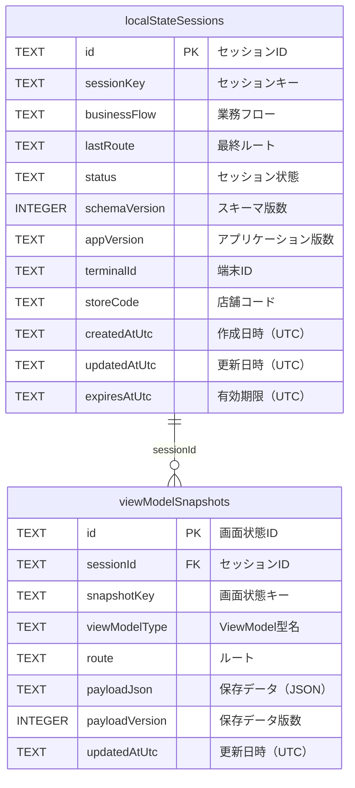

# ローカル状態管理 SQLiteテーブル定義書（現行実装）

## 1. 表紙

| 項目 | 内容 |
| --- | --- |
| PJ名 | 次世代POS |
| システム名 | タブレットPOS |
| サブシステム名 | ローカル状態管理 |
| 文書ID | DB-LOCAL-01 |
| 成果物名 | ローカル状態管理 SQLiteテーブル定義書（現行実装） |
| 版数 | 1.0.0 |
| 作成者 | VTI サム |
| 作成日 | 2026/08/28 |
| 目的 | 画面入力途中の状態を保存し、画面再表示またはアプリケーション復帰時に復元するための現行SQLiteテーブルを定義する。 |
| 対象範囲 | TabletPos.Core.Stateが管理するセッション情報および画面状態を対象とする。 |
| 対象外 | 業務データ、認証情報、デバイス接続状態およびOSから停止通知を受け取れなかった時点以降の未保存入力は対象外とする。 |
| DBファイル | FileSystem.AppDataDirectory/tabletpos_local_state.db |
| 前提 | [PersistSnapshot]を付与したViewModelプロパティのみをJSON形式で保存する。現行アプリケーションではMainPageViewModel.MaskInputが保存対象である。SQLiteは既定で外部キー制約が無効のため、接続確立時にPRAGMA foreign_keys = ONを実行する。 |
| 関連資料 | ARCH-01 タブレットPOS ソフトウェア構造設計書、PS-STATE-13 セッションテーブル定義、PS-STATE-14 スナップショットテーブル定義 |

## 2. 変更履歴

文書の改訂履歴を以下に示す。

| No. | 版数 | 変更日 | 区分 | 変更箇所（項番等） | 変更内容 | 担当者 |
| --- | --- | --- | --- | --- | --- | --- |
| 1 | 0.1.0 | 2026/08/28 | 新規 | 全体 | 現行実装に基づき、画面状態復元で使用するSQLiteテーブル定義を新規作成。 | VTI サム |
| 2 | 1.0.0 | 2026/08/28 | 修正 | 全体 | 章番号を目次と統一し、外部キー情報に削除時動作および更新時動作を追加。前提に外部キー制約の有効化を明記。ERDを図形で再作成。 | VTI サム |

## 3. 目次

- 1． 表紙
- 2． 変更履歴
- 3． 目次
- 4． 概要
- 5． テーブル一覧
- 6． ERD
- 7． localStateSessions（セッション情報）
- 8． viewModelSnapshots（画面状態）

## 4. 概要

本書は、現行のEF CoreマッピングおよびInitialLocalStateマイグレーションに基づき、ローカル状態管理で使用する2テーブルを示す。
セッション情報が復元単位を管理し、画面状態がViewModelごとの保存対象プロパティをJSON形式で保持する。

## 5. テーブル一覧

| No | 物理テーブル名 | 備考 | 登録方法 | 移行方法 |
| --- | --- | --- | --- | --- |
| 1 | localStateSessions | 復元単位となるセッション、最終ルート、状態および有効期限を保持する。 | EF Coreにより追加または更新する。 | InitialLocalStateマイグレーションで作成する。 |
| 2 | viewModelSnapshots | ViewModelごとの保存対象プロパティをJSON形式で保持する。 | セッションIDと画面状態キーを条件に追加または更新する。 | InitialLocalStateマイグレーションで作成する。 |

## 6. ERD

セッション情報（localStateSessions）1件に対し、画面状態（viewModelSnapshots）は0件以上となる。親セッションを削除した場合、関連する画面状態も連動して削除する。
画面非表示、Windowの非アクティブ化または停止時に保存し、画面表示、Windowのアクティブ化または復帰時に復元する。
プロセスクラッシュ、強制終了または電源断では、最後に保存が完了した画面状態までを復元対象とする。

## 7. localStateSessions

### テーブル情報

| 項目 | 内容 |
| --- | --- |
| システム名 | タブレットPOS |
| スキーマ名 | main |
| 論理テーブル名 | セッション情報 |
| RDBMS | SQLite |
| 物理テーブル名 | localStateSessions |
| 備考 | ローカル状態の復元単位、最終ルート、状態および有効期限を管理する。DBの照合順序はBINARYとする。 |

### カラム情報

| No | 論理名 | 物理名 | データ型 | Not Null | デフォルト | 備考 |
| --- | --- | --- | --- | --- | --- | --- |
| 1 | セッションID | id | TEXT | Yes |  | GUIDをTEXTとして保持する。 |
| 2 | セッションキー | sessionKey | TEXT | Yes |  | 最大128文字。同一キーを重複登録しない。 |
| 3 | 業務フロー | businessFlow | TEXT | No |  | 最大128文字。復元対象を業務フロー単位で識別する場合に使用する。 |
| 4 | 最終ルート | lastRoute | TEXT | No |  | 最大512文字。画面状態保存時のShellルートを保持する。 |
| 5 | セッション状態 | status | TEXT | Yes |  | 最大32文字。アプリケーションが「active」「completed」「abandoned」のいずれかを設定する。 |
| 6 | スキーマ版数 | schemaVersion | INTEGER | Yes |  | 登録時の初期値は1とする。 |
| 7 | アプリケーション版数 | appVersion | TEXT | No |  | 最大64文字。 |
| 8 | 端末ID | terminalId | TEXT | No |  | 最大128文字。 |
| 9 | 店舗コード | storeCode | TEXT | No |  | 最大128文字。 |
| 10 | 作成日時（UTC） | createdAtUtc | TEXT | Yes |  | UTC日時をSQLiteのTEXTとして保持する。 |
| 11 | 更新日時（UTC） | updatedAtUtc | TEXT | Yes |  | UTC日時をSQLiteのTEXTとして保持する。 |
| 12 | 有効期限（UTC） | expiresAtUtc | TEXT | No |  | UTC日時をSQLiteのTEXTとして保持する。新規セッションの有効期限は作成時刻から24時間後とする。 |

### インデックス情報

| No | インデックス名 | カラムリスト | 主キー | ユニーク | 備考 |
| --- | --- | --- | --- | --- | --- |
| 1 | pkLocalStateSessions | id | Yes | Yes | セッションIDを主キーとする。 |
| 2 | ixLocalStateSessionsSessionKey | sessionKey | No | Yes | セッションキーを一意とする。 |
| 3 | ixLocalStateSessionsStatus | status | No | No | 有効なセッションの検索に使用する。 |

## 8. viewModelSnapshots

### テーブル情報

| 項目 | 内容 |
| --- | --- |
| システム名 | タブレットPOS |
| スキーマ名 | main |
| 論理テーブル名 | 画面状態 |
| RDBMS | SQLite |
| 物理テーブル名 | viewModelSnapshots |
| 備考 | ViewModelごとの保存対象プロパティをJSON形式で保持する。同一セッション内では画面状態キーを一意とする。 |

### カラム情報

| No | 論理名 | 物理名 | データ型 | Not Null | デフォルト | 備考 |
| --- | --- | --- | --- | --- | --- | --- |
| 1 | 画面状態ID | id | TEXT | Yes |  | GUIDをTEXTとして保持する。 |
| 2 | セッションID | sessionId | TEXT | Yes |  | localStateSessions.idを参照する。 |
| 3 | 画面状態キー | snapshotKey | TEXT | Yes |  | 最大256文字。現行実装ではViewModelの完全修飾型名を使用する。 |
| 4 | ViewModel型名 | viewModelType | TEXT | Yes |  | 最大512文字。ViewModelの完全修飾型名を保持する。 |
| 5 | ルート | route | TEXT | No |  | 最大512文字。保存時のShellルートを保持する。 |
| 6 | 保存データ（JSON） | payloadJson | TEXT | Yes |  | [PersistSnapshot]対象プロパティ名と値をJSONオブジェクトとして保持する。 |
| 7 | 保存データ版数 | payloadVersion | INTEGER | Yes |  | 保存時の設定値は1とする。 |
| 8 | 更新日時（UTC） | updatedAtUtc | TEXT | Yes |  | UTC日時をSQLiteのTEXTとして保持する。 |

### インデックス情報

| No | インデックス名 | カラムリスト | 主キー | ユニーク | 備考 |
| --- | --- | --- | --- | --- | --- |
| 1 | pkViewModelSnapshots | id | Yes | Yes | 画面状態IDを主キーとする。 |
| 2 | ixViewModelSnapshotsSessionIdSnapshotKey | sessionId, snapshotKey | No | Yes | 同一セッション内の画面状態キーを一意とする。 |

### 外部キー情報

| No | 外部キー名 | カラムリスト | 参照先テーブル名 | 参照先カラムリスト | 削除時動作 | 更新時動作 |
| --- | --- | --- | --- | --- | --- | --- |
| 1 | fkViewModelSnapshotsLocalStateSessionsSessionId | sessionId | localStateSessions | id | CASCADE | NO ACTION |
