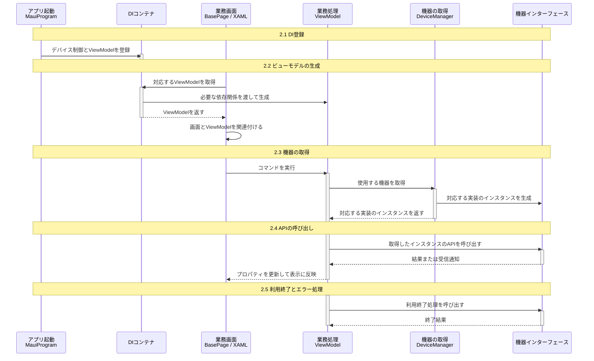

## 表紙

| 項目 | 内容 |
| --- | --- |
| PJ名 | 次世代POS |
| システム名 | タブレットPOS |
| サブシステム名 | デバイス制御基盤 |
| 成果物名 | デバイス制御インターフェース基本設計書 |
| 版数 | 1.0.0 |
| 作成日 | 2026-09-08 |
| 作成者 | SMJサム |

本書は、機器の利用と業務データの連携について、操作の目的、入力情報および処理結果を定義します。

## 変更履歴

| No. | 版数 | 変更日 | 区分 | 変更箇所（項番等） | 変更内容 | 担当者 |
| --- | --- | --- | --- | --- | --- | --- |
| 1 | 1.0.0 | 2026-09-08 | 新規 | 全体 | デバイス制御インターフェースを定義しました。 | SMJサム |

## 目次

```text
1. 組込みシーケンス
2. 組込み手順

区分_デバイスインターフェース
  3. キーボード
  4. スキャナ
  5. ドロア
  6. カスタマディスプレイ
  7. レシートプリンタ
  8. ハンディターミナル
  9. 自動釣銭機
  10. 決済端末

区分_業務連携インターフェース
  11. A4帳票印刷
  12. POSAカード取引
```

## 1. 組込みシーケンス

業務画面のViewModelから機器を利用する流れを示します。図の各段階に対応する実装方法を2.1～2.5に記載します。



A4帳票印刷とPOSAカード取引は、機器取得の代わりに対応するインターフェースをDIから受け取ります。取得方法は2.3に記載します。

## 2. 組込み手順

### 2.1. DI登録

#### 2.1.1. 登録内容

`MauiProgram.cs`でデバイス制御とViewModelを登録します。機器の登録はアプリ起動時に行い、画面ごとには行いません。`DeviceManager`と`DeviceRuntime`はアプリ内で共用し、ViewModelはDIから取得する際に生成します。

#### 2.1.2. 登録箇所

```csharp
// Pos.Applications/MauiProgram.cs
builder.Services.AddPosDeviceCtrl();
builder.Services.AddViewModels();
```

共通通信の開始と停止は`DeviceControlWindow`が行います。接続設定は「CFG-01_タブレットPOS_デバイス制御層設定ファイル記載要領.md」の3章、記載例は7章を参照します。

### 2.2. ビューモデルの生成

#### 2.2.1. 生成方法

`BasePage.OnLoaded`が対応するViewModelをDIから取得し、画面と関連付けます。ViewModelのコンストラクタには、必要な依存関係を追加します。

`AddViewModels()`の自動登録対象は、`BaseViewModel`と同じアセンブリにある非抽象の派生クラスです。画面の型名の`.Views.`を`.ViewModels.`へ置き換え、末尾に`ViewModel`を付けた型を取得します。既に画面にデータが関連付けられている場合は、ViewModelを自動取得しません。手動生成している箇所では、DIからの取得に変更します。

#### 2.2.2. 例：既存ビューモデルへの引数追加

以下は`MainPageViewModel`への追加例です。既存の引数と処理を保持し、`DeviceManager`と`DeviceRuntime`を受け取ります。

```csharp
private readonly DeviceManager _devices;
private readonly DeviceRuntime _deviceRuntime;

public MainPageViewModel(
    INavigationService navigationService,
    DeviceManager devices,
    DeviceRuntime deviceRuntime)
{
    _navigationService = navigationService;
    _devices = devices;
    _deviceRuntime = deviceRuntime;
}
```

### 2.3. 機器の取得

#### 2.3.1. 取得方法

ViewModelから`DeviceManager`を呼び出し、必要な機器を取得します。デバイス制御層が実装を選択してインスタンスを生成します。利用中は同じインスタンスを保持し、操作のたびに取得し直しません。

| 対象 | インターフェース | 取得方法 |
| --- | --- | --- |
| スキャナ | IBarcodeScannerStrategy | DeviceManager.GetScannerStrategyAsync() |
| レシートプリンタ | IPrinterStrategy | DeviceManager.GetPrinterStrategyAsync() |
| 決済端末 | IPaymentStrategy | DeviceManager.GetPaymentStrategyAsync() |
| 自動釣銭機 | ICashChangerStrategy | DeviceManager.GetCashChangerStrategyAsync() |
| カスタマディスプレイ | ICustomerDisplayStrategy | DeviceManager.GetCustomerDisplayStrategyAsync() |
| ドロア | IDrawerStrategy | DeviceManager.GetDrawerStrategyAsync() |
| キーボード | IKeyboardStrategy | DeviceManager.GetKeyboardStrategyAsync() |
| ハンディターミナル | IHandyTerminal | DeviceManager.GetHandyTerminalAsync() |

A4帳票印刷は`IA4ReportService`、POSAカード取引は`IPosaService`を、実装が登録されたDIから受け取ります。これらは`DeviceManager`による取得と`Start`／`End`を使用しません。

#### 2.3.2. 例：スキャナの取得

```csharp
// ViewModelのフィールド
private IBarcodeScannerStrategy? _scanner;

// 利用開始時に取得
_scanner = await _devices.GetScannerStrategyAsync();
```

取得結果が`null`の場合は利用を開始しません。複数OSで共用する画面では、未登録のインターフェースを必須引数にせず、DIから任意取得して利用可否を確認します。

### 2.4. APIの呼び出し

#### 2.4.1. 呼び出し方法

画面にバインドしたコマンドから、取得したインスタンスのAPIを呼び出します。結果または受信通知をViewModelのプロパティへ反映します。入力情報と結果の定義は各インターフェースシートを参照します。

#### 2.4.2. 例：スキャナの呼び出しと表示

次はコマンド内の処理例です。`_scanner`の取得後、共通通信が利用可能な場合に実行します。例外は2.5の方針で処理します。

```csharp
if (!_deviceRuntime.IsRunning || _scanner is null) return;

await _scanner.Start();
await _scanner.Scan(code =>
{
    MainThread.BeginInvokeOnMainThread(() => Result1 = code);
});
```

画面では、コマンドと結果をバインドします。以下は読取り開始のコマンド名を`BeginScanCommand`とした例です。

```xml
<Button Text="読取り開始" Command="{Binding BeginScanCommand}" />
<Label Text="{Binding Result1}" />
```

`MainThread`は`Microsoft.Maui.ApplicationModel`を使用します。各例は同じViewModelへ組み込む処理の抜粋です。

### 2.5. 利用終了とエラー処理

#### 2.5.1. 終了時とエラー時の処理

利用が終わる処理から対象APIの終了処理を呼び出し、完了を待ちます。画面の破棄だけで接続が解放されるとは扱いません。操作中と終了処理が同時に実行されないようにします。

| 状況 | 呼び出し側の処理 |
| --- | --- |
| インスタンスを取得できない | 対象機能を無効にし、設定とOS別の実装を確認します。 |
| 操作が非対応 | 対応情報が提供される場合は事前確認します。`NotSupportedException`を受けた場合も、その操作を繰り返しません。 |
| 対応情報が不明または処理が実行されない | APIの完了だけで成功と判断せず、対象実装の対応範囲と結果を確認します。 |
| 実行結果が不明 | 処理状況を確認せず同じ要求を自動再送しません。 |
| 終了処理に失敗 | 終了済みと扱わず、利用できない状態を画面へ通知します。 |

#### 2.5.2. 例：スキャナの利用終了

```csharp
if (_scanner is not null)
{
    await _scanner.End();
    _scanner = null;
}
```

共通通信の停止はアプリ側が行います。ViewModelから`DeviceRuntime`を停止する処理は追加しません。

## 区分_デバイスインターフェース

| 項目 | 内容 |
| --- | --- |
| 区分名 | デバイスインターフェース |

## 3. キーボード

### 3.1. 概要

対象機器：キーボード。
キー入力を受信し、入力内容を通知します。

### 3.2. 機能一覧

<!-- excel-render table-grid=wide -->

| No. | API | 機能 | 説明 | 入力情報 | 結果 |
| --- | --- | --- | --- | --- | --- |
| 1 | Start（config） | 利用開始 | 選択した機器を接続および初期化し、操作を受け付ける準備をします。 | - `config`：機器設定です。設定項目はCFG-01（2.1.2に記載）を参照します。保存済み設定は更新しません。 | 操作の完了。個別の結果情報は返しません。 |
| 2 | End（引数なし） | 利用終了 | 機器の利用を終了し、接続と利用権を解放します。 | なし | 操作の完了。個別の結果情報は返しません。 |
| 3 | Listen（onKeyReceived） | キー入力の受信 | 画面が利用できる状態になってからキー入力を受け付けます。受信したキーを業務操作へ対応付け、同じ入力を二重に処理しないようにします。 | - `onKeyReceived`：キー入力を受け取る処理を指定します。キー値と入力元などが通知されます。 | キー値、仮想キー、スキャンコード、入力元、専用機器かどうか |


## 4. スキャナ

### 4.1. 概要

対象機器：スキャナ（AT30Q）、iOS端末の内蔵カメラ。
読み取ったコードを通知します。内蔵カメラを使う場合は、カメラの利用を許可します。

### 4.2. 機能一覧

<!-- excel-render table-grid=wide -->

| No. | API | 機能 | 説明 | 入力情報 | 結果 |
| --- | --- | --- | --- | --- | --- |
| 1 | Start（config） | 利用開始 | 選択した機器を接続および初期化し、操作を受け付ける準備をします。 | - `config`：機器設定です。設定項目はCFG-01（2.1.2に記載）を参照します。保存済み設定は更新しません。 | 操作の完了。個別の結果情報は返しません。 |
| 2 | End（引数なし） | 利用終了 | 機器の利用を終了し、接続と利用権を解放します。 | なし | 操作の完了。個別の結果情報は返しません。 |
| 3 | Scan（onDataReceived） | コードの読み取り | 1回の呼び出しでコードを1件読み取り、接続またはカメラを解放してから結果を通知します。次の読み取りではStartから実行します。 | - `onDataReceived`：読み取ったコードを受け取る処理を指定します。コードは文字列で1回通知されます。読み取りを中止した場合はnullです。 | 読み取ったコード。中止時はnull。解放が完了するまでTaskは完了しません。 |


## 5. ドロア

### 5.1. 概要

対象機器：ドロア（UP-J36DW3）。
ドロアの開放と開閉状態の確認を行います。

### 5.2. 機能一覧

<!-- excel-render table-grid=wide -->

| No. | API | 機能 | 説明 | 入力情報 | 結果 |
| --- | --- | --- | --- | --- | --- |
| 1 | Start（config） | 利用開始 | 選択した機器を接続および初期化し、操作を受け付ける準備をします。 | - `config`：機器設定です。設定項目はCFG-01（2.1.2に記載）を参照します。保存済み設定は更新しません。 | 操作の完了。個別の結果情報は返しません。 |
| 2 | End（引数なし） | 利用終了 | 機器の利用を終了し、接続と利用権を解放します。 | なし | 操作の完了。個別の結果情報は返しません。 |
| 3 | CheckStatus（引数なし） | 開閉状態の確認 | ドロアが開いているかを確認します。 | なし | Windows OPOSでは、真は「開いている」、偽は「開いていない」を表します。 |
| 4 | OpenDrawer（引数なし） | ドロア開放 | 現金を出し入れできるよう、ドロアを開きます。 | なし | 成功または失敗（真は成功） |
| 5 | WaitForDrawerClose（beepTimeout、beepFrequency、beepDuration、beepDelay） | ドロアが閉じるまでの待機 | ドロアが閉じるまで待ちます。指定した時間を過ぎても閉じない場合は警告音を鳴らします。 | - `beepTimeout`：ドロアが閉じない場合に警告音を開始するまでの待ち時間です。単位は対応ドライバーの仕様に従います。<br>- `beepFrequency`：警告音の周波数です。単位と指定範囲は対応ドライバーの仕様に従います。<br>- `beepDuration`：警告音を鳴らす長さです。時間単位は対応ドライバーの仕様に従います。<br>- `beepDelay`：警告音を繰り返す間隔です。時間単位は対応ドライバーの仕様に従います。 | 機器操作の結果 |


## 6. カスタマディスプレイ

### 6.1. 概要

対象機器：カスタマディスプレイ（RZ-4DP1）。
指定した文字列を表示します。

### 6.2. 機能一覧

<!-- excel-render table-grid=wide -->

| No. | API | 機能 | 説明 | 入力情報 | 結果 |
| --- | --- | --- | --- | --- | --- |
| 1 | Start（config） | 利用開始 | 選択した機器を接続および初期化し、操作を受け付ける準備をします。 | - `config`：機器設定です。設定項目はCFG-01（2.1.2に記載）を参照します。保存済み設定は更新しません。 | 操作の完了。個別の結果情報は返しません。 |
| 2 | End（引数なし） | 利用終了 | 機器の利用を終了し、接続と利用権を解放します。 | なし | 操作の完了。個別の結果情報は返しません。 |
| 3 | DisplayText（data、attribute） | 文字列の表示 | 指定した文字列を表示します。 | - `data`：表示する文字列です。<br>- `attribute`：文字の表示方法を指定します。対応する表示方法と指定値は対象機種の仕様に従います。 | 操作の完了。個別の結果情報は返しません。 |
| 4 | DisplayTextAt（data、row、column、attribute） | 位置を指定した表示 | 指定した行と列から文字列を表示します。 | - `data`：表示する文字列です。<br>- `row`：表示を開始する行位置です。行番号の基準と指定範囲は対象機種の仕様に従います。<br>- `column`：表示を開始する列位置です。列番号の基準と指定範囲は対象機種の仕様に従います。<br>- `attribute`：文字の表示方法を指定します。対応する表示方法と指定値は対象機種の仕様に従います。 | 操作の完了。個別の結果情報は返しません。 |
| 5 | ClearText（引数なし） | 表示の消去 | 現在表示している文字を消します。 | なし | 操作の完了。個別の結果情報は返しません。 |
| 6 | ScrollText（direction、units） | スクロール表示 | 表示内容を指定した方向へ移動します。 | - `direction`：表示内容を移動する方向を指定します。方向と指定値の対応は対象機種の仕様に従います。<br>- `units`：表示内容を移動する量です。移動量の単位は対象機種の仕様に従います。 | 操作の完了。個別の結果情報は返しません。 |
| 7 | LinDsp（command、text） | 機種固有の表示 | 指定した表示区分に従って、お客様向けの文字列を表示します。 | - `command`：文字の表示方法を選ぶ区分です。対象機器の表示区分を指定します。<br>- `text`：お客様に表示する文字列です。 | 操作の完了。個別の結果情報は返しません。 |
| 8 | LinDspTelop（command、text、speed） | 機種固有のテロップ表示 | お客様向けの案内文を、指定した速さで流して表示します。 | - `command`：文字の表示方法を選ぶ区分です。対象機器の表示区分を指定します。<br>- `text`：お客様に表示する文字列です。<br>- `speed`：テロップを流す速度です。単位と指定可能な値は対象機種の仕様に従います。 | 操作の完了。個別の結果情報は返しません。 |
| 9 | Capabilities | 対応機能の確認 | スクロールなどの表示方法を使う前に、対象機器で利用できるかを確認します。 | なし | 対応機能の一覧 |


## 7. レシートプリンタ

### 7.1. 概要

対象機器：レシートプリンタ（POS内蔵、TM-m30Ⅲ-H）。
指定した内容をレシートに印刷します。状態確認、文字列の印刷、改行、用紙のカットを行います。

### 7.2. 機能一覧

<!-- excel-render table-grid=wide -->

| No. | API | 機能 | 説明 | 入力情報 | 結果 |
| --- | --- | --- | --- | --- | --- |
| 1 | Start（config） | 利用開始 | 選択した機器を接続および初期化し、操作を受け付ける準備をします。 | - `config`：機器設定です。設定項目はCFG-01（2.1.2に記載）を参照します。保存済み設定は更新しません。 | 成功または失敗、結果コード、詳細コード、印刷済み行数、エラー内容、応答データ |
| 2 | End（引数なし） | 利用終了 | 機器の利用を終了し、接続と利用権を解放します。 | なし | 成功または失敗、結果コード、詳細コード、印刷済み行数、エラー内容、応答データ |
| 3 | PrintReceipt（receipt） | レシートの印刷 | 指定したレシートデータを印刷します。途中で失敗した場合は印刷済み行数を確認し、未印刷の場合と区別します。 | - `receipt`：レシートの明細、印刷内容、書式をまとめたデータです。金額は計算済みの値を指定します。 | 成功または失敗、結果コード、詳細コード、印刷済み行数、エラー内容、応答データ |
| 4 | OpenDrawer（drawer、time） | ドロア開放 | Windows OPOSのプリンタ経由では非対応です。ドロアのインターフェースを使用します。 | - `drawer`：開放するドロアの番号です。番号と接続先の対応はプリンタの仕様に従います。<br>- `time`：ドロアを開くための信号を送る時間です。単位と指定範囲はプリンタの仕様に従います。 | 成功または失敗、結果コード、詳細コード、印刷済み行数、エラー内容、応答データ |
| 5 | PrintNormal（station、data） | 文字列の印刷 | 指定した文字列を印刷します。改行は印刷する文字列に含めます。 | - `station`：印刷する用紙または印刷領域を指定します。指定値はプリンタのOPOS仕様に従います。<br>- `data`：印刷する文字列です。 | 成功または失敗、結果コード、詳細コード、印刷済み行数、エラー内容、応答データ |
| 6 | CutPaper（percentage） | 用紙のカット | 印刷したレシートを切り離しやすくするため、指定した切り方で用紙をカットします。 | - `percentage`：用紙のカット方法を指定する値です。使用する機種で定められた値を指定します。 | 成功または失敗、結果コード、詳細コード、印刷済み行数、エラー内容、応答データ |
| 7 | PrintBitmap（station、fileName、width、alignment） | 画像の印刷 | 指定した画像を、用紙上の指定位置と幅で印刷します。 | - `station`：印刷する用紙または印刷領域を指定します。指定値はプリンタのOPOS仕様に従います。<br>- `fileName`：印刷する画像のファイル名です。<br>- `width`：画像を印刷する幅です。単位はプリンタの設定に従います。<br>- `alignment`：用紙上の左右の配置を指定します。指定値はプリンタの仕様に従います。 | 成功または失敗、結果コード、詳細コード、印刷済み行数、エラー内容、応答データ |
| 8 | PrintBarCode（station、data、symbology、height、width、alignment、textPosition） | バーコードの印刷 | 指定したデータをバーコードにして印刷します。コードの種類、大きさおよび文字の表示位置を指定します。 | - `station`：印刷する用紙または印刷領域を指定します。指定値はプリンタのOPOS仕様に従います。<br>- `data`：バーコードに変換する文字列です。<br>- `symbology`：印刷するバーコードの種類を指定します。対応する種類と指定値はプリンタの仕様に従います。<br>- `height`：バーコードの印刷高さです。単位はプリンタの設定に従います。<br>- `width`：バーコードの印刷幅です。単位はプリンタの設定に従います。<br>- `alignment`：用紙上の左右の配置を指定します。指定値はプリンタの仕様に従います。<br>- `textPosition`：バーコードに添える文字の表示位置を指定します。指定値はプリンタの仕様に従います。 | 成功または失敗、結果コード、詳細コード、印刷済み行数、エラー内容、応答データ |


## 8. ハンディターミナル

### 8.1. 概要

対象機器：ハンディターミナル（機種未決定）。

ハンディターミナルと接続し、業務データを受信または送信します。Windowsではシリアル接続を使用します。受信データの確認と保存は`acceptRecord`に指定した処理で行います。

### 8.2. 機能一覧

<!-- excel-render table-grid=wide -->

| No. | API | 機能 | 説明 | 入力情報 | 結果 |
| --- | --- | --- | --- | --- | --- |
| 1 | Start（config） | 利用開始 | 接続先を開き、送受信を開始できる状態にします。保存済みの設定は更新しません。 | - `config`：接続先のCOMポート名、通信速度、応答待ち時間です。通信速度の初期値は9600、応答待ち時間の初期値は5000ミリ秒です。通信条件はパリティなし、データ長8ビット、ストップビット1です。 | 接続完了。接続できない場合はエラーを返します。 |
| 2 | Receive（businessCode、acceptRecord） | 業務データの受信 | 業務コードを確認してデータを受信します。受け付けた件数と端末から通知された件数が一致し、終了通知を受け取ると完了します。異常終了しても保存済みデータは取り消しません。再受信時は重複を確認します。 | - `businessCode`：受信する業務を表す半角数字3桁のコードです。端末側の業務コードと一致させます。<br>- `acceptRecord`：受信した1件のデータを確認して保存する処理です。1件は128バイトです。受け付ける場合は真、再送を求める場合は偽を返します。真を返した後に端末へ受領を通知します。 | 受け付けた件数。通信異常または件数不一致の場合は正常完了を返しません。 |
| 3 | Send（businessCode、records） | 業務データの送信 | 端末からの送信要求と業務コードを確認し、データを1件ずつ送ります。件数の受領確認後、終了を通知します。端末から再送要求がある場合は最大3回再送します。応答がない場合は自動再送しません。 | - `businessCode`：送信する業務を表す半角数字3桁のコードです。<br>- `records`：送信するデータの一覧です。1件は128バイト、1回の送信は9999件までです。文字を含む項目はShift-JIS形式で指定します。 | 送信処理の完了。端末の受領確認が得られない場合はエラーを返します。 |
| 4 | End（） | 利用終了 | 進行中の送受信が完了するか通信異常になるまで待ち、接続先を閉じます。通信異常後に再開する場合は、利用開始から行います。 | なし。 | 接続の終了。 |


## 9. 自動釣銭機

### 9.1. 概要

対象機器：自動釣銭機（RT-300、RAD-300、WD-300）。

現金の投入を受け付け、入金額を確認して確定します。釣銭の出金、金種別在高の確認、精査および現金回収を行います。利用できる操作は機種と接続方式により異なります。

### 9.2. 機能一覧

<!-- excel-render table-grid=wide -->

| No. | API | 機能 | 説明 | 入力情報 | 結果 |
| --- | --- | --- | --- | --- | --- |
| 1 | Start（config） | 利用開始 | 選択した機器を接続および初期化し、操作を受け付ける準備をします。 | - `config`：機器設定です。設定項目はCFG-01（2.1.2に記載）を参照します。保存済み設定は更新しません。 | 操作の完了。個別の結果情報は返しません。 |
| 2 | End（引数なし） | 利用終了 | 機器の利用を終了し、接続と利用権を解放します。 | なし | 操作の完了。個別の結果情報は返しません。 |
| 3 | BeginTransaction（引数なし） | 取引開始 | 現金の投入を受け付ける状態にします。売上登録は行いません。 | なし | 操作の完了。個別の結果情報は返しません。 |
| 4 | GetDepositAmount（引数なし） | 入金額の確認 | 投入された現金の合計額を確認します。 | なし | 文字列の結果（値がない場合があります） |
| 5 | GetDepositCount（引数なし） | 入金枚数の取得要求 | 入金枚数の確認を機器に要求します。この操作では枚数を返しません。金種ごとの枚数はGetDepositDetailsで受け取ります。 | なし | 操作の完了。個別の結果情報は返しません。 |
| 6 | CancelTransaction（引数なし） | 取引の取消 | 取引取消のための復旧要求を送ります。返金完了を保証する操作とは扱いません。 | なし | 操作の完了。個別の結果情報は返しません。 |
| 7 | BeginDeposit（引数なし） | 入金開始 | お客様からの現金を受け付ける状態にします。 | なし | 操作の完了。個別の結果情報は返しません。 |
| 8 | FixDeposit（引数なし） | 入金の確定 | 受け付けた入金を確定します。売上登録は行いません。 | なし | 操作の完了。個別の結果情報は返しません。 |
| 9 | EndDeposit（引数なし） | 入金終了 | 入金の受け付けを終了します。 | なし | 操作の完了。個別の結果情報は返しません。 |
| 10 | PauseDeposit（引数なし） | 入金の一時停止 | 入金の受け付けを一時的に止めます。 | なし | 操作の完了。個別の結果情報は返しません。 |
| 11 | DepositData（引数なし） | 入金データの取得 | 機器が受け付けた入金の情報を受け取ります。 | なし | 文字列の結果（値がない場合があります） |
| 12 | ReadCashCounts（引数なし） | 金種別在高の取得要求 | 在高の取得要求を送ります。値を受け取る場合は在高取得の操作を使用します。 | なし | 操作の完了。個別の結果情報は返しません。 |
| 13 | Collect（引数なし） | 現金回収 | 機器内の現金を回収する操作を実行します。回収範囲は機種の指定に従います。 | なし | 操作の完了。個別の結果情報は返しません。 |
| 14 | OpenDrawer（引数なし） | ドロア開放 | 現金を出し入れできるよう、ドロアを開きます。 | なし | 操作の完了。個別の結果情報は返しません。 |
| 15 | DispenseChange（amount） | 金額指定の払い出し | 指定した金額を機器から払い出します。 | - `amount`：払い出す金額です。通貨単位と文字列の形式は対象機種の仕様に従います。 | 操作の完了。個別の結果情報は返しません。 |
| 16 | Seisa（引数なし） | 精査 | 機器内の現金を数え直し、在高を確認するための精査を行います。 | なし | 操作の完了。個別の結果情報は返しません。 |
| 17 | GetDepositDetails（引数なし） | 入金額、内訳の取得 | 投入された合計額と金種ごとの枚数を受け取ります。 | なし | 入金額と金種別内訳 |
| 18 | FixDepositDetails（引数なし） | 入金確定、内訳の取得 | 入金を確定し、確定した合計額と金種ごとの枚数を受け取ります。 | なし | 入金額と金種別内訳 |
| 19 | EndDeposit（success） | 入金終了 | 入金の受け付けを終了します。 | - `success`：入金終了時の処理を指定する設定値です。成功を表す真偽値ではありません。指定値の意味は対象機種の仕様に従います。 | 操作の完了。個別の結果情報は返しません。 |
| 20 | PauseDeposit（control） | 入金の一時停止 | 入金の受け付けを一時的に止めます。 | - `control`：入金を一時停止する際の動作を指定する設定値です。指定値の意味は対象機種の仕様に従います。 | 操作の完了。個別の結果情報は返しません。 |
| 21 | GetCashCounts（引数なし） | 金種別在高の取得 | 機器に保管されている現金の枚数を金種ごとに確認します。 | なし | 金種別在高と不一致の有無 |
| 22 | Collect（command） | 現金回収 | 機器内の現金を回収する操作を実行します。回収範囲は機種の指定に従います。 | - `command`：機種固有の処理を指定します。命令の意味と指定値は対象機種の仕様に従います。 | 操作の完了。個別の結果情報は返しません。 |
| 23 | DispenseChange（currentExit、amount） | 金額指定の払い出し | 指定した金額を機器から払い出します。 | - `currentExit`：現金を払い出す出金口を指定します。番号と出金口の対応は対象機種の仕様に従います。<br>- `amount`：払い出す金額です。通貨単位と文字列の形式は対象機種の仕様に従います。 | 操作の完了。個別の結果情報は返しません。 |
| 24 | DispenseCash（currentExit、cashCounts） | 金種別枚数指定の払い出し | 金種ごとに指定した枚数の現金を払い出します。 | - `currentExit`：現金を払い出す出金口を指定します。番号と出金口の対応は対象機種の仕様に従います。<br>- `cashCounts`：金種ごとの枚数を指定する文字列です。金種の並びと区切り方は対象機種の仕様に従います。 | 操作の完了。個別の結果情報は返しません。 |
| 25 | GetCoinStatusData（引数なし） | 硬貨状態の取得 | 硬貨側の状態を受け取り、現金の取り扱いを継続できるか確認するために使用します。 | なし | 文字列の結果（値がない場合があります） |
| 26 | GetBillStatus（引数なし） | 紙幣状態の取得 | 紙幣側の状態を受け取り、現金の取り扱いを継続できるか確認するために使用します。 | なし | 文字列の結果（値がない場合があります） |
| 27 | GetSeisaData（引数なし） | 精査結果の取得 | 精査後に機器から結果を受け取ります。結果の項目は機種ごとに異なります。 | なし | 文字列の結果（値がない場合があります） |
| 28 | GetFullStatus（writeLog） | 機器全体の状態確認 | 入出金を始める前や異常発生時に、機器全体の状態を確認します。 | - `writeLog`：状態確認時にログを記録するかを指定します。省略時は記録します。 | 状態値 |
| 29 | AdjustCashCounts（cashCounts） | 金種別在高の補正 | 確認した金種ごとの枚数を機器に設定し、管理している在高を補正します。現金の入出金は行いません。 | - `cashCounts`：金種ごとの枚数を指定する文字列です。金種の並びと区切り方は対象機種の仕様に従います。 | 機器操作の結果 |


## 10. 決済端末

### 10.1. 概要

対象機器：決済端末（CAFIS Arch Saturn）。
決済要求を端末へ渡し、処理結果を返します。

### 10.2. 機能一覧

利用するインターフェースは`IPaymentStrategy`です。

<!-- excel-render table-grid=wide -->

| No. | API | 機能 | 説明 | 入力情報 | 結果 |
| --- | --- | --- | --- | --- | --- |
| 1 | Start（config） | 利用開始 | 決済端末を利用できる状態にします。 | - `config`：機器設定です。設定項目はCFG-01（2.1.2に記載）を参照します。 | 接続処理の完了。 |
| 2 | Sale（request、timeoutMilliseconds） | 売上 | 指定した支払方法で売上を要求します。 | - `request`：10.3「引数の詳細」のrequest（PaymentBusinessRequest）を参照します。<br>- `timeoutMilliseconds`：応答待ち時間（※1）です。 | 10.4「戻り値の詳細」を参照します。 |
| 3 | CompleteSale（request、timeoutMilliseconds） | 承認後売上 | 取得済みの承認番号を指定してクレジットの売上を要求します。 | - `request`：10.3「引数の詳細」のrequest（PaymentBusinessRequest）を参照します。<br>- `timeoutMilliseconds`：応答待ち時間（※1）です。 | 10.4「戻り値の詳細」を参照します。 |
| 4 | VoidSale（request、timeoutMilliseconds） | 取消返品 | 対象の取引を特定し、取消または返品を要求します。 | - `request`：10.3「引数の詳細」のrequest（PaymentBusinessRequest）を参照します。<br>- `timeoutMilliseconds`：応答待ち時間（※1）です。 | 10.4「戻り値の詳細」を参照します。 |
| 5 | CheckCard（request、timeoutMilliseconds） | 無効カードチェック | クレジットカードの確認を要求します。売上は登録しません。 | - `request`：10.3「引数の詳細」のrequest（PaymentBusinessRequest）を参照します。<br>- `timeoutMilliseconds`：応答待ち時間（※1）です。 | 10.4「戻り値の詳細」を参照します。 |
| 6 | BalanceInquiry（request、timeoutMilliseconds） | 残高照会 | 電子マネーの残高照会を要求します。 | - `request`：10.3「引数の詳細」のrequest（PaymentBusinessRequest）を参照します。<br>- `timeoutMilliseconds`：応答待ち時間（※1）です。 | 10.4「戻り値の詳細」を参照します。 |
| 7 | RePrint（request、timeoutMilliseconds） | 再印字 | 支払方法と再印字の区分を指定して、端末へ再印字を要求します。 | - `request`：10.3「引数の詳細」のrequest（PaymentBusinessRequest）を参照します。<br>- `timeoutMilliseconds`：応答待ち時間（※1）です。 | 10.4「戻り値の詳細」を参照します。 |
| 8 | DailyLog（request、timeoutMilliseconds） | 日計 | 支払方法と日計の種類を指定して日計処理を要求します。 | - `request`：10.3「引数の詳細」のrequest（PaymentBusinessRequest）を参照します。<br>- `timeoutMilliseconds`：応答待ち時間（※1）です。 | 10.4「戻り値の詳細」を参照します。 |
| 9 | DailyLogAll（request、timeoutMilliseconds） | 全日計 | 端末へ全日計を要求します。 | - `request`：10.3「引数の詳細」のrequest（PaymentBusinessRequest）を参照します。<br>- `timeoutMilliseconds`：応答待ち時間（※1）です。 | 10.4「戻り値の詳細」を参照します。 |
| 10 | HealthCheck（） | 接続確認 | 端末との通信を確認します。 | なし。 | 接続確認の処理結果。 |
| 11 | End（） | 利用終了 | 端末の接続と利用権を解放します。成立済み取引の取消には使用しません。 | なし。 | 終了処理の完了。 |

※1：`timeoutMilliseconds`はミリ秒単位の正の整数です。省略時は300000ミリ秒（5分）です。

### 10.3. 引数の詳細

**request（PaymentBusinessRequest）**

**API別の設定内容**

| API | 設定内容 |
| --- | --- |
| Sale | 支払方法、取引番号、金額、印字方法と支払条件です。 |
| CompleteSale | 売上の情報と承認番号です。 |
| VoidSale | 支払方法、取消対象の金額と元取引情報です。 |
| CheckCard | クレジット、取引番号と印字方法です。 |
| BalanceInquiry | 支払方法、取引番号と印字方法です。 |
| RePrint | 支払方法、再印字区分と印字方法です。 |
| DailyLog | 支払方法、取引番号、日計区分と印字方法です。 |
| DailyLogAll | 印字方法です。 |

**項目定義**

文字列項目の指定条件は※2、区分値の指定条件は※3を参照します。

| 項目 | 説明 |
| --- | --- |
| Medium | 支払方法を指定します。 |
| SequenceNumber | 端末への要求を識別する番号です。要求ごとに0以上の整数を指定します。 |
| Amount | 対象取引の金額を円単位で指定します。0以上の値を指定します。 |
| TaxOther | 税その他の金額を円単位で指定します。クレジット、NFC、iDで使用します。その他の支払方法では端末へ0を渡します。 |
| Training | 練習の場合は真、本番の場合は偽です。日計と全日計は本番として実行します。 |
| PrintMode | 決済端末での印字方法です。必ず指定します。（※3） |
| Goods | 商品区分です。クレジット、NFC、デビット、iD、PiTaPaで使用します。（※3） |
| ApprovalNumber | 承認番号です。承認後売上では必須です。銀聯とNFCの取消返品でも使用します。 |
| SlipNumber | 元取引の伝票番号です。クレジット、NFC、銀聯、iD、WAON、QUICPayの取消に使用します。 |
| OriginalTradeBusiness | 元取引の業務区分です。クレジット、NFC、銀聯の取消返品に使用します。（※3） |
| PayMethod | 元取引の支払方法です。クレジットとNFCの取消返品に使用します。（※3） |
| CancelDivision | 取消区分です。クレジット、NFC、銀聯、iDの取消に使用します。（※3） |
| InstallmentTimes | 元取引の分割回数です。クレジットとNFCの取消返品に使用します。0または00は空欄として送信します。 |
| UnionPayNumber | 元取引の銀聯番号です。銀聯とNFCの取消返品に使用します。 |
| UnionPaySendTime | 元取引の銀聯送信日時です。銀聯とNFCの取消返品に使用します。 |
| IcSerialNumber | 元取引のIC通番です。QUICPayの取消に使用します。 |
| NoPointTargetAmount | ポイントの対象にしない金額を円単位で指定します。WAONの売上に使用します。 |
| OutputId | 出力を識別する番号です。クレジットとNFCの売上に使用します。 |
| LogOutputMode | 端末のログ出力区分です。クレジットとNFCの売上に使用します。（※3） |
| RequestMessageDivision | 要求電文の種類です。クレジットとNFCの売上に使用します。（※3） |
| Incentive | 提携判定の要否を示す区分です。クレジットとNFCの売上に使用します。（※3） |
| PayDivision | 支払区分です。クレジットとNFCの売上に使用します。（※3） |
| PayMethodDetail | 支払方法の詳細です。クレジットとNFCの売上に使用します。（※3） |
| DailyLogType | 日計の種類です。DailyLogで使用します。（※3） |
| RePrintBusiness | 再印字の区分です。0または9を指定します。 |

※2：文字列項目にはカンマと改行を含めません。

※3：指定値は採用するCAFIS Archの接続仕様に従います。

### 10.4. 戻り値の詳細

| 項目 | 説明 |
| --- | --- |
| Success | 端末への処理が正常終了したかを示します。売上の承認とは区別します。 |
| ResultCode | 端末処理の結果コードです。 |
| ResultCodeExtended | 端末処理の詳細コードです。 |
| ResponseData | 端末から受け取った応答データです。要求によってJSON、文字列または日計データとなります。 |

通信異常や端末処理の失敗は例外として通知されます。例外を処理し、応答を受け取った場合は決済結果を確認します。残高、承認番号と伝票番号を個別に返す項目はありません。応答データの項目対応は、支払方法ごとの端末応答仕様を使用します。時間切れや通信異常の後は自動で再要求せず、取引状況を確認します。

## 区分_業務連携インターフェース

| 項目 | 内容 |
| --- | --- |
| 区分名 | 業務連携インターフェース |

## 11. A4帳票印刷

### 11.1. 概要

対象機器：A4プリンタ（機種未決定）。

サーバーで作成されたPDFデータを受け取り、A4プリンタへ印刷を要求します。帳票の作成とレイアウトの編集は本インターフェースの対象外です。

印刷方式は【別紙】決定事項一覧_20260616.xlsxのNo.43および要件定義書（システム全体）_７．５．９．印刷・帳票・EJD.xlsxのA4帳票出力に基づきます。

### 11.2. 機能一覧

<!-- excel-render table-grid=wide -->

| No. | API | 機能 | 説明 | 入力情報 | 結果 |
| --- | --- | --- | --- | --- | --- |
| 1 | Print（request、printerName） | PDF印刷 | 受け取ったPDFデータを指定プリンタへ送信し、印刷を要求します。 | - `request`：11.3「引数の詳細」のrequest（A4ReportRequest）を参照します。<br>- `printerName`：出力先のプリンタ名です。 | 11.4「戻り値の詳細」を参照します。 |

### 11.3. 引数の詳細

**request（A4ReportRequest）**

| 項目 | 説明 |
| --- | --- |
| PdfData | APIから受け取ったPDFのバイナリデータです。byte[]で指定します。ファイルパスやBase64文字列ではありません。 |
| DocumentName | 印刷する帳票名です。 |

### 11.4. 戻り値の詳細

| 項目 | 説明 |
| --- | --- |
| Success | 印刷要求を正常に受け付けた場合は真です。用紙が実際に排出されたことを保証する値として使用しません。 |
| Error | 印刷を要求できなかった理由です。 |

### 11.5. 組み込み方法

PDFをプリンタへ送る処理を`IA4ReportService`の実装としてDIへ登録します。画面のViewModelは、業務APIから取得したPDFデータを次のように渡します。

```csharp
var result = await _a4ReportService.Print(new A4ReportRequest
{
    PdfData = pdfData,
    DocumentName = documentName
}, printerName);
```

実装側はPDFデータと出力先を確認し、対象OSの印刷機能を呼び出します。PDFデータが空の場合や印刷に対応していない場合は、印刷を要求せず失敗を返します。既定の印刷実装は登録されないため、利用前に登録が必要です。

## 12. POSAカード取引

### 12.1. 概要

対象業務：POSAカードの販売と利用に伴う取引。

POSAカードの有効化、無効化、残高照会などの要求を送信し、応答を返します。デバイスコネクタが専用の通信処理を実行します。
### 12.2. 機能一覧

利用するインターフェースは`IPosaService`です。各APIは対象のPOSA取引を1回要求します。処理種別を選ぶ`Execute`も使用できますが、通常は以下の業務名のAPIを使用します。

<!-- excel-render table-grid=wide -->

| No. | API | 機能 | 説明 | 入力情報 | 結果 |
| --- | --- | --- | --- | --- | --- |
| 1 | PreAuth（transaction、timeoutMilliseconds） | 事前承認 | 事前承認を要求します。 | - `transaction`：12.3「引数の詳細」を参照します。<br>- `timeoutMilliseconds`：応答待ち時間（※1）です。 | 12.4「戻り値の詳細」を参照します。 |
| 2 | Activate（transaction、timeoutMilliseconds） | 有効化 | 販売するPOSAカードを有効にします。 | - `transaction`：12.3「引数の詳細」を参照します。<br>- `timeoutMilliseconds`：応答待ち時間（※1）です。 | 12.4「戻り値の詳細」を参照します。 |
| 3 | Deactivate（transaction、timeoutMilliseconds） | 無効化 | POSAカードの無効化を要求します。 | - `transaction`：12.3「引数の詳細」を参照します。<br>- `timeoutMilliseconds`：応答待ち時間（※1）です。 | 12.4「戻り値の詳細」を参照します。 |
| 4 | BalanceInquiry（transaction、timeoutMilliseconds） | 残高照会 | カード残高の照会を要求します。 | - `transaction`：12.3「引数の詳細」を参照します。<br>- `timeoutMilliseconds`：応答待ち時間（※1）です。 | 12.4「戻り値の詳細」を参照します。 |
| 5 | Recharge（transaction、timeoutMilliseconds） | チャージ | カードへの入金を要求します。 | - `transaction`：12.3「引数の詳細」を参照します。<br>- `timeoutMilliseconds`：応答待ち時間（※1）です。 | 12.4「戻り値の詳細」を参照します。 |
| 6 | CardRedemption（transaction、timeoutMilliseconds） | カード使用 | カードを使用する取引を要求します。 | - `transaction`：12.3「引数の詳細」を参照します。<br>- `timeoutMilliseconds`：応答待ち時間（※1）です。 | 12.4「戻り値の詳細」を参照します。 |
| 7 | Cancel（transaction、timeoutMilliseconds） | 取消 | 元取引を指定して取消を要求します。 | - `transaction`：12.3「引数の詳細」を参照します。<br>- `timeoutMilliseconds`：応答待ち時間（※1）です。 | 12.4「戻り値の詳細」を参照します。 |
| 8 | Check（transaction、timeoutMilliseconds） | 通信確認 | 取引先との通信を確認します。 | - `transaction`：12.3「引数の詳細」を参照します。<br>- `timeoutMilliseconds`：応答待ち時間（※1）です。 | 12.4「戻り値の詳細」を参照します。 |
| 9 | FastPinSale（transaction、timeoutMilliseconds） | FastPIN販売 | FastPINの販売を要求します。 | - `transaction`：12.3「引数の詳細」を参照します。<br>- `timeoutMilliseconds`：応答待ち時間（※1）です。 | 12.4「戻り値の詳細」を参照します。 |
| 10 | FastPinReturn（transaction、timeoutMilliseconds） | FastPIN返品 | FastPINの返品を要求します。 | - `transaction`：12.3「引数の詳細」を参照します。<br>- `timeoutMilliseconds`：応答待ち時間（※1）です。 | 12.4「戻り値の詳細」を参照します。 |

※1：`timeoutMilliseconds`はミリ秒単位の正の整数です。

他のPOSA取引が処理中の場合は受け付けません。時間切れは取引の不成立を意味しません。応答が得られない場合は自動で再送せず、取引状況を確認します。

### 12.3. 引数の詳細

12.2の入力情報にある`transaction`（`PosaTransaction`）の設定項目を示します。金額や日時の表記は通信先の電文仕様に合わせます。

| 項目 | 説明 |
| --- | --- |
| Pan | カードを識別する番号です。CheckとFastPinSaleでは使用しません。 |
| Amount | 対象取引の金額です。Checkでは使用しません。 |
| TransmissionDateTime | 電文を送る日時です。 |
| Stan | 取引を追跡するためのシステムトレース監査番号です。 |
| LocalTime | 取引が発生した時刻です。Checkでは使用しません。 |
| LocalDate | 取引が発生した日付です。Checkでは使用しません。 |
| TerminalId | 取引を行う端末の識別子です。Checkでは使用しません。 |
| RetailerId | カード取扱者の識別子です。Checkでは使用しません。 |
| ProcessingCode | 元の取引の処理コードです。CancelとCheckでは、先頭6文字までを返却する処理コードとして使用します。その他の処理では通信先の応答から取得します。 |
| JanCode | 対象商品のJANコードです。Checkでは使用しません。 |

### 12.4. 戻り値の詳細

| 項目 | 説明 |
| --- | --- |
| ResponseReceived | 通信先から応答コードを受け取ったかを示します。取引の承認とは異なります。 |
| ResponseCode | 通信先が返した結果コードです。00の場合に承認と判定します。 |
| Approved | 応答を受け取り、結果コードが00の場合に真を返します。 |
| AuthorizationId | 通信先の承認番号です。1桁から20桁の数字を返します。Checkでは返しません。 |
| ProcessingCode | 対象取引の処理コードです。 |
| Error | 処理を完了できなかった理由を識別する値です。 |

残高照会やFastPIN販売についても、返却項目は上表のとおりです。残高金額や発行したPINを返す専用項目はありません。

