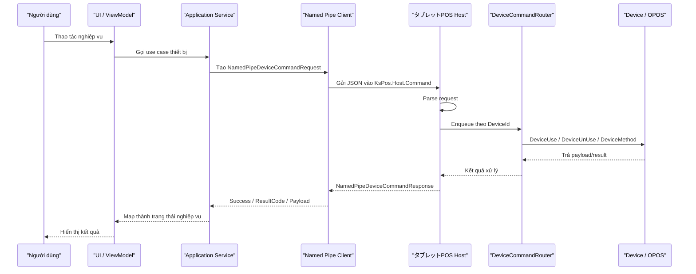
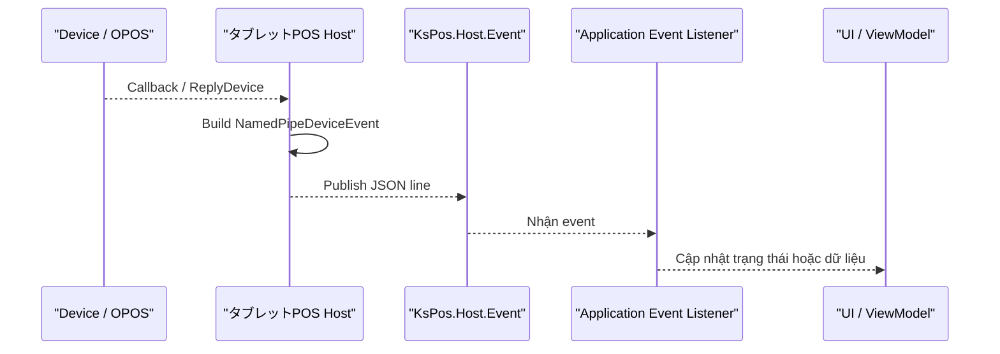
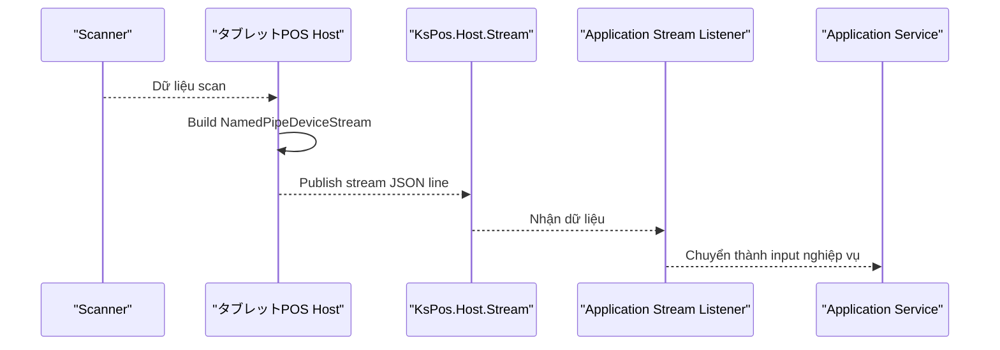

# Basic Design: Application liên kết Host qua Named Pipe

## Mục tiêu

Tài liệu này mô tả luồng xử lý cơ bản để tầng Application của
`sources/KsPosBoilerplate` liên kết với tầng Host bằng Named Pipe.

Mục tiêu thiết kế:

- Application không gọi trực tiếp OPOS, driver hoặc lớp device cụ thể.
- Host là tiến trình chịu trách nhiệm điều khiển thiết bị.
- Application gửi yêu cầu thiết bị qua Named Pipe và nhận kết quả trả về.
- Các sự kiện phát sinh từ thiết bị được Host đẩy ngược về Application qua pipe sự kiện/stream.
- Luồng xử lý giữ cùng tinh thần với `MauiPOSX` + `MauiPOSHost`: app gửi command qua pipe, host dispatch command tới manager/device, rồi trả response.

## Phạm vi

Áp dụng cho basic design của tầng Application trong `KsPosBoilerplate`.

Không thuộc phạm vi tài liệu này:

- Chi tiết xử lý từng thiết bị OPOS.
- Program spec/detail design của từng màn hình.
- Refactor nội bộ Host hoặc thay đổi contract device hiện có.

## Hiện trạng tham chiếu từ source

### MauiPOSX và MauiPOSHost

Luồng hiện tại giữa `MauiPOSX` và `MauiPOSHost` là mô hình command/response đơn giản:

1. `MauiPOSX.DeviceCtrl` gọi `NamedPipeClient.SendMessage(...)`.
2. Client kết nối pipe `KsPOSPipeMessage`.
3. Client gửi một dòng command text, ví dụ `OPOS_PrinterStart;SHARPRECPRT80`.
4. `MauiPOSHost` nhận command bằng `PipeCommandDispatcher`.
5. Host route theo prefix command như `OPOSCash_`, `OPOS_Printer`, `OPOS_Scanner`.
6. Manager thiết bị xử lý OPOS.
7. Host trả một dòng response về Application.

Ý nghĩa nghiệp vụ: Application chỉ biết "gửi yêu cầu thiết bị"; phần mở/kết nối/điều khiển thiết bị nằm ở Host.

### KsPosBoilerplate

`KsPosBoilerplate` đã có thiết kế Host mới rõ hơn, dùng 3 Named Pipe:

- `KsPos.Host.Command`: Application gửi command và nhận response đồng bộ.
- `KsPos.Host.Event`: Host publish event thiết bị bất đồng bộ về Application.
- `KsPos.Host.Stream`: Host publish dữ liệu stream, ví dụ scanner.

Các contract hiện có:

- `NamedPipeDeviceCommandRequest`
- `NamedPipeDeviceCommandResponse`
- `NamedPipeDeviceEvent`
- `NamedPipeDeviceStream`

Host xử lý command qua:

- `NamedPipeCommandServer`
- `DeviceCommandRouter`
- `KsHost.ProcessNamedPipeCommand(...)`

## Tổng quan kiến trúc

```text
Application UI/ViewModel
        |
        v
Application Service / Use Case
        |
        v
Device Host Gateway / Named Pipe Client
        |
        |  KsPos.Host.Command
        v
タブレットPOS Host
        |
        v
DeviceCommandRouter
        |
        v
Device / OPOS / Driver
```

Nguyên tắc phân tầng:

- UI/ViewModel chỉ xử lý thao tác người dùng và trạng thái hiển thị.
- Application Service quyết định nghiệp vụ cần gọi thiết bị nào, method nào.
- Named Pipe Client chỉ chịu trách nhiệm giao tiếp IPC với Host.
- Host quyết định cách gọi device thật và quản lý vòng đời thiết bị.
- Device/OPOS nằm ngoài Application layer.

## Flow 1: Command đồng bộ

Command đồng bộ dùng khi Application cần gửi yêu cầu và chờ kết quả ngay, ví dụ:

- Start/connect thiết bị.
- In hóa đơn.
- Mở ngăn kéo.
- Hiển thị text lên customer display.
- Gọi một device method cần biết `ResultCode`.



### Bước xử lý

1. Người dùng thao tác trên màn hình.
2. ViewModel gọi Application Service tương ứng.
3. Application Service tạo command request gồm:
   - `requestId`: mã request để trace.
   - `message`: loại lệnh, ví dụ `DeviceMethod`.
   - `deviceId`: thiết bị đích, ví dụ `LineDisplay`, `Printer`, `Scanner`.
   - `methodId`: method thiết bị.
   - `handle`: handle nếu cần tương thích cơ chế cũ.
   - `payload`: tham số nghiệp vụ.
4. Named Pipe Client serialize request thành JSON UTF-8 một dòng.
5. Client gửi vào `KsPos.Host.Command`.
6. Host parse request, convert sang dictionary key/value cũ nếu cần.
7. `DeviceCommandRouter` xếp hàng theo `DeviceId`.
8. Host tìm device trong `KsDeviceManager`.
9. Host gọi `DeviceUse`, `DeviceUnUse`, `DeviceUnUseComplete` hoặc `DeviceMethod`.
10. Host build `NamedPipeDeviceCommandResponse`.
11. Application nhận response và cập nhật trạng thái màn hình.

## Flow 2: Event bất đồng bộ

Event bất đồng bộ dùng khi thiết bị phát sinh kết quả sau command ban đầu, ví dụ:

- Thiết bị gửi callback.
- Kết quả xử lý đến muộn.
- Trạng thái thiết bị thay đổi.
- Một device reply được Host publish qua `ReplyDevice`.



Luồng này giúp Application không cần polling liên tục. Application chỉ mở listener tới pipe event, sau đó nhận dữ liệu do Host publish.

## Flow 3: Stream dữ liệu thiết bị

Stream dùng cho dữ liệu có tần suất cao hoặc có tính liên tục, ví dụ scanner.



Host hiện phân loại stream bằng `IsStreamDevice(...)`; thiết bị có tên bắt đầu bằng `Scanner` được đưa sang stream pipe.

## Contract command đề xuất cho Application

Ví dụ request:

```json
{
  "requestId": "202605290001",
  "message": "DeviceMethod",
  "deviceId": "LineDisplay",
  "methodId": "DisplayText",
  "handle": "0",
  "payload": {
    "Text": "TOTAL 1,000"
  }
}
```

Ví dụ response:

```json
{
  "requestId": "202605290001",
  "success": true,
  "resultCode": 0,
  "message": "",
  "payload": {
    "ResultCode": "0",
    "ReturnValue": "0"
  }
}
```

## Trách nhiệm từng thành phần

| Thành phần | Trách nhiệm |
|---|---|
| UI/ViewModel | Nhận thao tác người dùng, hiển thị kết quả, không biết chi tiết Named Pipe hoặc OPOS. |
| Application Service | Quyết định nghiệp vụ cần gọi thiết bị nào/method nào, map response thành kết quả nghiệp vụ. |
| Device Host Gateway | Interface/port để Application gọi thiết bị mà không phụ thuộc implementation IPC. |
| Named Pipe Client | Connect pipe, serialize/deserialize JSON, timeout, retry/reconnect nếu cần. |
| タブレットPOS Host | Nhận command, quản lý device, gọi device method, publish event/stream. |
| DeviceCommandRouter | Bảo toàn thứ tự xử lý theo từng `DeviceId`, tránh command cùng thiết bị chạy chồng nhau. |
| Device/OPOS | Xử lý thiết bị thật. |

## Error handling cơ bản

| Tình huống | Xử lý đề xuất ở Application |
|---|---|
| Không kết nối được `KsPos.Host.Command` | Báo Host chưa khởi động hoặc không thể kết nối dịch vụ thiết bị. |
| Host trả `success=false` | Dùng `resultCode`, `message`, `payload` để hiển thị lỗi nghiệp vụ phù hợp. |
| Timeout khi chờ response | Hủy request phía Application, ghi log với `requestId`, cho phép retry nếu nghiệp vụ phù hợp. |
| Event/Stream pipe bị ngắt | Listener tự reconnect; nếu reconnect thất bại thì cập nhật trạng thái thiết bị offline/unknown. |
| Payload thiếu key cần thiết | Application coi là lỗi contract, ghi log đủ request/response để điều tra. |

## Điểm cần bổ sung ở Application layer

Hiện `KsPos.Applications` chưa có Named Pipe Client hoặc device gateway tương ứng. Cần bổ sung ở mức Application/Infrastructure:

- Port interface, ví dụ `IDeviceHostGateway`.
- DTO/Application model tương ứng request/response/event/stream.
- Infrastructure implementation dùng Named Pipe.
- Background listener cho `KsPos.Host.Event`.
- Background listener cho `KsPos.Host.Stream`.
- DI registration trong `KsPos.Applications/Composition/DependencyInjection.cs`.

ViewModel không gọi trực tiếp implementation Named Pipe; ViewModel chỉ gọi Application Service hoặc port nghiệp vụ.

## Ghi chú thiết kế

- Với command cần kết quả ngay, dùng `KsPos.Host.Command`.
- Với callback thiết bị thông thường, dùng `KsPos.Host.Event`.
- Với dữ liệu liên tục hoặc tần suất cao, dùng `KsPos.Host.Stream`.
- Không đưa logic recovery UI vào Host; Host chỉ trả trạng thái/kết quả thiết bị.
- Không đưa logic OPOS/driver vào Application; Application chỉ gọi qua gateway.
- Cần giữ `requestId` xuyên suốt log Application và Host để truy vết lỗi.

## Source tham chiếu

- `sources/MauiPOSX/MauiPOSX.DeviceCtrl/Platforms/Windows/Modules/NamedPipeClient.cs`
- `sources/MauiPOSX/MauiPOSX.DeviceCtrl/Platforms/Windows/Strategies/*`
- `sources/MauiPOSHost/DeviceManager/Services/PipeCommandDispatcher.cs`
- `sources/KsPosBoilerplate/KsPos.Host/src/KsHost/DeviceHost/NamedPipeContracts.cs`
- `sources/KsPosBoilerplate/KsPos.Host/src/KsHost/DeviceHost/NamedPipeCommandServer.cs`
- `sources/KsPosBoilerplate/KsPos.Host/src/KsHost/DeviceHost/DeviceCommandRouter.cs`
- `sources/KsPosBoilerplate/KsPos.Host/src/KsHost/DeviceHost/KsHost.NamedPipe.cs`
- `sources/KsPosBoilerplate/KsPos.Host/src/KsHost/DeviceHost/KsHost.cs`
