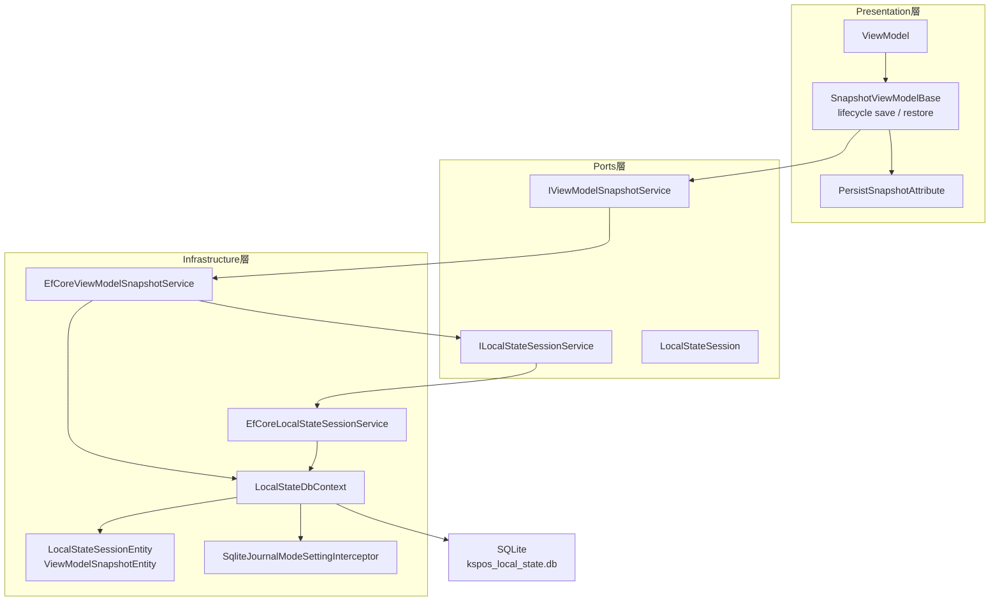
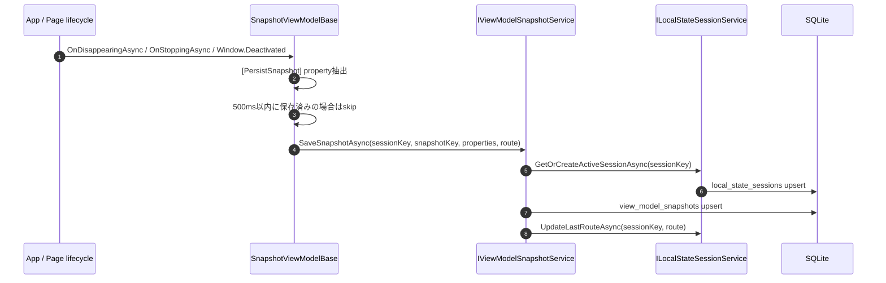
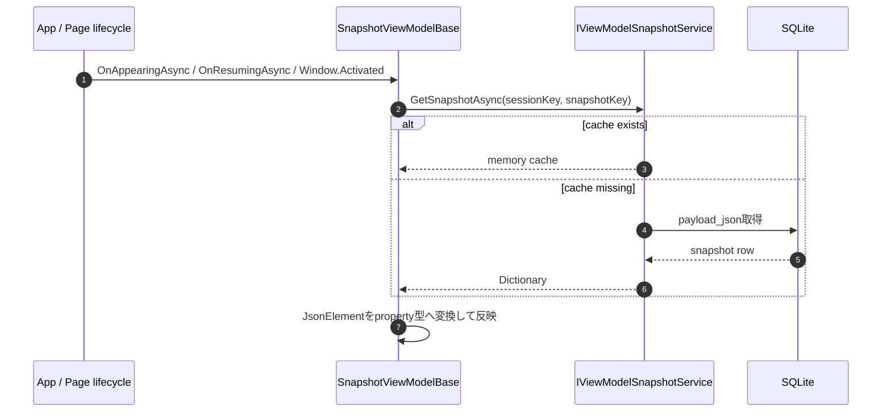

# プログラム仕様書_ローカルストレージ保持基盤

## 1. 変更履歴

| バージョン | 依頼者 | 更新者 | 更新日 | 変更理由 | シート名 | 更新内容 |
|---|---|---|---|---|---|---|
| 0.0.1 | Sharp | VTI | 2026年05月27日 | 初版作成 | 全体 | 端末アプリローカルストレージ保持基盤のプログラム仕様を作成 |
| 0.0.2 | Sharp | VTI | 2026年05月27日 | lifecycle保存強化 | 6. 処理フロー | Window Deactivated / Activated対応とsnapshot save throttleを追記 |

## 2. 表紙

| 項目 | 内容 |
|---|---|
| プロジェクト名 | タブレットPOS |
| 機能名 | 端末アプリローカルストレージ保持基盤 |
| 名前空間 | `KsPos.Applications` |
| クラス名（論理） | ローカルストレージ保持基盤 |
| クラス名（物理） | `SnapshotViewModelBase` / `IViewModelSnapshotService` / `ILocalStateSessionService` |
| 役割 / 概要 | 画面遷移、アプリ停止、OS kill、電源断後もViewModelの入力途中状態を端末内SQLiteへ保持し、再表示時に復元する |
| 備考 | 本仕様はViewModel snapshotのみ対象とする。端末設定値を保持する`local_settings`は対象外 |

## 3. クラス定義

### 3.1 全体方針

ViewModelの全プロパティを自動保存せず、`[PersistSnapshot]`が付与されたプロパティだけを保存対象とする。
Presentation層はDBへ直接アクセスせず、`IViewModelSnapshotService`を経由して保存・復元する。

SQLiteへの永続化はInfrastructure層に閉じ込める。
ViewModel側は`SnapshotViewModelBase`を継承することで、画面表示・非表示およびアプリ停止・復帰時の保存復元処理を共通化する。

### 3.2 クラス構成

### 3.3 クラス一覧

| No | 区分 | クラス / Interface | 主な責務 |
|---:|---|---|---|
| 1 | Attribute | `PersistSnapshotAttribute` | 保存対象プロパティまたはfieldを明示する |
| 2 | ViewModel基底 | `SnapshotViewModelBase` | lifecycleに連動してsnapshot保存・復元を行う |
| 3 | Snapshot Interface | `IViewModelSnapshotService` | ViewModel snapshotの保存、取得、削除を抽象化する |
| 4 | Session Interface | `ILocalStateSessionService` | session_key単位でlocal state sessionを管理する |
| 5 | Snapshot実装 | `EfCoreViewModelSnapshotService` | snapshotをJSON化しSQLiteへ保存する |
| 6 | Session実装 | `EfCoreLocalStateSessionService` | active/completed/abandoned状態を管理する |
| 7 | DB Context | `LocalStateDbContext` | EF CoreによりSQLite tableを管理する |
| 8 | Entity | `LocalStateSessionEntity` / `ViewModelSnapshotEntity` | SQLite tableに対応する永続化モデル |
| 9 | SQLite設定 | `SqliteJournalModeSettingInterceptor` | 接続開始時にWAL modeを設定する |

## 4. DB定義

### 4.1 `local_state_sessions`

| カラム | 型 | NULL | 概要 |
|---|---|---|---|
| `id` | TEXT | no | session UUID |
| `session_key` | TEXT | no | flow識別子。既定値は`default` |
| `business_flow` | TEXT | yes | 業務フロー名 |
| `last_route` | TEXT | yes | 最終表示route |
| `status` | TEXT | no | `active` / `completed` / `abandoned` |
| `schema_version` | INTEGER | no | session schema version |
| `app_version` | TEXT | yes | アプリversion |
| `terminal_id` | TEXT | yes | 端末ID |
| `store_code` | TEXT | yes | 店舗コード |
| `created_at_utc` | TEXT | no | 作成日時UTC |
| `updated_at_utc` | TEXT | no | 更新日時UTC |
| `expires_at_utc` | TEXT | yes | 有効期限UTC |

制約:

| 制約 | 内容 |
|---|---|
| Primary Key | `id` |
| Unique Index | `session_key` |
| Index | `status` |

### 4.2 `view_model_snapshots`

| カラム | 型 | NULL | 概要 |
|---|---|---|---|
| `id` | TEXT | no | snapshot UUID |
| `session_id` | TEXT | no | `local_state_sessions.id`へのFK |
| `snapshot_key` | TEXT | no | ViewModel単位のsnapshot識別子 |
| `view_model_type` | TEXT | no | ViewModel型名 |
| `route` | TEXT | yes | 保存時のroute |
| `payload_json` | TEXT | no | `[PersistSnapshot]`対象プロパティのJSON |
| `payload_version` | INTEGER | no | payload version |
| `updated_at_utc` | TEXT | no | 更新日時UTC |

制約:

| 制約 | 内容 |
|---|---|
| Primary Key | `id` |
| Foreign Key | `session_id` -> `local_state_sessions.id`、CASCADE DELETE |
| Unique Index | `session_id`, `snapshot_key` |

## 5. メソッド一覧

### 5.1 `IViewModelSnapshotService`

| No | 修飾子 | static | 戻り値 | メソッド名 | 概要 |
|---:|---|---|---|---|---|
| 1 | public | no | `Task` | `SaveSnapshotAsync` | 指定session、snapshot keyのViewModel stateを保存する |
| 2 | public | no | `Task<Dictionary<string, object?>?>` | `GetSnapshotAsync` | 指定session、snapshot keyのViewModel stateを取得する |
| 3 | public | no | `Task` | `ClearSnapshotAsync` | 指定snapshotを削除する |
| 4 | public | no | `Task` | `ClearSessionSnapshotsAsync` | 指定session配下のsnapshotを削除する |

### 5.2 `ILocalStateSessionService`

| No | 修飾子 | static | 戻り値 | メソッド名 | 概要 |
|---:|---|---|---|---|---|
| 1 | public | no | `Task<LocalStateSession>` | `GetOrCreateActiveSessionAsync` | active sessionを取得し、存在しない場合は作成する |
| 2 | public | no | `Task<IReadOnlyList<LocalStateSession>>` | `GetActiveSessionsAsync` | 有効期限内のactive session一覧を取得する |
| 3 | public | no | `Task` | `MarkCompletedAsync` | sessionをcompletedへ更新する |
| 4 | public | no | `Task` | `MarkAbandonedAsync` | sessionをabandonedへ更新する |
| 5 | public | no | `Task` | `UpdateLastRouteAsync` | sessionの最終routeを更新する |

## 6. 処理フロー

### 6.1 保存フロー

### 6.2 復元フロー

## 7. 注意事項

- パスワード、token、PIN、secure credential、hardware handleは保存しない。
- master dataやAPIから再取得可能な大容量データは保存しない。
- 本仕様はViewModelの入力途中状態を復元するための基盤であり、売上・決済などの業務データ永続化DBではない。
- `local_settings` tableおよびPreferences連携は本scope外。
- `session_key`を業務flowごとに分けることで、複数flowの並行保持に対応する。
- `PageDisappearing`、`Window.Deactivated`、`Window.Stopped`が短時間に連続発火する可能性があるため、snapshot保存は`SemaphoreSlim`で並列実行を防止し、500ms以内の重複保存をskipする。
