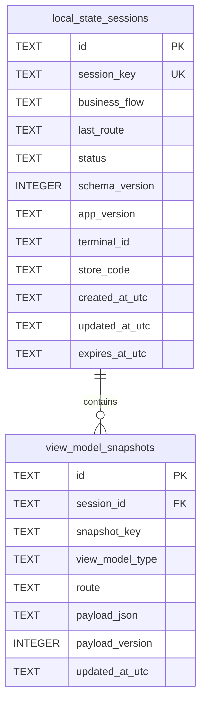

# プログラム仕様書_ローカルストレージ保持基盤_DBインターフェース定義

## 1. 変更履歴

| バージョン | 作成者 | 更新者 | 更新日 | 変更理由 | 更新内容 |
|---|---|---|---|---|---|
| 0.0.1 | VTI | VTI | 2026年05月27日 | 初版作成 | ローカルストレージ保持基盤のDBインターフェース定義を記載 |
| 0.0.2 | VTI | VTI | 2026年05月27日 | lifecycle保存強化 | DB保存呼び出し元にWindow.Deactivatedを追記 |

## 2. 表紙

| 項目 | 内容 |
|---|---|
| プロジェクト名 | タブレットPOS |
| 機能名 | 端末アプリローカルストレージ保持基盤 |
| 対象DB | SQLite |
| DBファイル | `FileSystem.AppDataDirectory/kspos_local_state.db` |
| 対象テーブル | `local_state_sessions` / `view_model_snapshots` |
| 役割 / 概要 | ViewModel snapshotを端末内SQLiteに保存し、画面再表示またはapp restart時に復元するためのDB定義 |
| 備考 | 設定値保存用の`local_settings` tableは本scope外 |

## 3. DB構成



## 4. テーブル一覧

| No | テーブル名 | 論理名 | 概要 |
|---:|---|---|---|
| 1 | `local_state_sessions` | ローカル状態セッション | `session_key`単位でsnapshot groupを管理する |
| 2 | `view_model_snapshots` | ViewModel snapshot | ViewModelごとの保存対象propertyをJSONとして保持する |

## 5. テーブル定義

### 5.1 `local_state_sessions`

| No | カラム名 | 型 | PK | UK | NN | 初期値 / 設定 | 概要 |
|---:|---|---|---|---|---|---|---|
| 1 | `id` | TEXT | yes | no | yes | UUID | session識別子 |
| 2 | `session_key` | TEXT(128) | no | yes | yes | 既定値は`default` | flow識別子 |
| 3 | `business_flow` | TEXT(128) | no | no | no | null | 業務フロー名 |
| 4 | `last_route` | TEXT(512) | no | no | no | null | 最終表示route |
| 5 | `status` | TEXT(32) | no | no | yes | `active` | session状態 |
| 6 | `schema_version` | INTEGER | no | no | yes | `1` | session schema version |
| 7 | `app_version` | TEXT(64) | no | no | no | null | アプリversion |
| 8 | `terminal_id` | TEXT(128) | no | no | no | null | 端末ID |
| 9 | `store_code` | TEXT(128) | no | no | no | null | 店舗コード |
| 10 | `created_at_utc` | TEXT | no | no | yes | 現在UTC | 作成日時 |
| 11 | `updated_at_utc` | TEXT | no | no | yes | 現在UTC | 更新日時 |
| 12 | `expires_at_utc` | TEXT | no | no | no | 現在UTC + 24h | 有効期限 |

#### 5.1.1 Index / Constraint

| No | 種別 | 名称 | 対象カラム | 内容 |
|---:|---|---|---|---|
| 1 | Primary Key | `PK_local_state_sessions` | `id` | sessionの一意識別 |
| 2 | Unique Index | `IX_local_state_sessions_session_key` | `session_key` | flow単位のsession重複を防止 |
| 3 | Index | `IX_local_state_sessions_status` | `status` | active session検索用 |

#### 5.1.2 Status値

| 値 | 概要 |
|---|---|
| `active` | 復元対象の有効session |
| `completed` | 業務flow完了済みsession |
| `abandoned` | 中断扱いsession |

### 5.2 `view_model_snapshots`

| No | カラム名 | 型 | PK | UK | NN | 初期値 / 設定 | 概要 |
|---:|---|---|---|---|---|---|---|
| 1 | `id` | TEXT | yes | no | yes | UUID | snapshot識別子 |
| 2 | `session_id` | TEXT | no | no | yes | `local_state_sessions.id` | 親session ID |
| 3 | `snapshot_key` | TEXT(256) | no | yes | yes | ViewModel FullName | ViewModel snapshot識別子 |
| 4 | `view_model_type` | TEXT(512) | no | no | yes | ViewModel FullName | ViewModel型名 |
| 5 | `route` | TEXT(512) | no | no | no | null | 保存時のroute |
| 6 | `payload_json` | TEXT | no | no | yes | `{}` | `[PersistSnapshot]`対象propertyのJSON |
| 7 | `payload_version` | INTEGER | no | no | yes | `1` | payload version |
| 8 | `updated_at_utc` | TEXT | no | no | yes | 現在UTC | 更新日時 |

#### 5.2.1 Index / Constraint

| No | 種別 | 名称 | 対象カラム | 内容 |
|---:|---|---|---|---|
| 1 | Primary Key | `PK_view_model_snapshots` | `id` | snapshotの一意識別 |
| 2 | Foreign Key | `FK_view_model_snapshots_local_state_sessions_session_id` | `session_id` | `local_state_sessions.id`を参照 |
| 3 | Unique Index | `IX_view_model_snapshots_session_id_snapshot_key` | `session_id`, `snapshot_key` | 同一session内でViewModel snapshotを一意にする |

#### 5.2.2 Cascade

| 親テーブル | 子テーブル | 条件 | 動作 |
|---|---|---|---|
| `local_state_sessions` | `view_model_snapshots` | session削除時 | 子snapshotをcascade delete |

## 6. DBアクセス仕様

### 6.1 Save snapshot

| 項目 | 内容 |
|---|---|
| 呼び出し元 | `SnapshotViewModelBase.OnDisappearingAsync` / `OnStoppingAsync` / `Window.Deactivated`経由 |
| Service | `IViewModelSnapshotService.SaveSnapshotAsync` |
| 実装 | `EfCoreViewModelSnapshotService.SaveSnapshotAsync` |
| 対象table | `local_state_sessions`, `view_model_snapshots` |
| 処理内容 | active sessionを取得または作成し、`session_id + snapshot_key`単位でsnapshotをupsertする |
| 重複抑止 | `SnapshotViewModelBase`側で`SemaphoreSlim`と500ms throttleにより短時間の重複saveを抑止する |

### 6.2 Restore snapshot

| 項目 | 内容 |
|---|---|
| 呼び出し元 | `SnapshotViewModelBase.OnAppearingAsync` / `OnResumingAsync` / `Window.Activated`経由 |
| Service | `IViewModelSnapshotService.GetSnapshotAsync` |
| 実装 | `EfCoreViewModelSnapshotService.GetSnapshotAsync` |
| 対象table | `view_model_snapshots` |
| 処理内容 | memory cacheを優先し、未存在の場合はSQLiteから`payload_json`を取得する |

### 6.3 Clear snapshot

| 項目 | 内容 |
|---|---|
| Service | `IViewModelSnapshotService.ClearSnapshotAsync` |
| 実装 | `EfCoreViewModelSnapshotService.ClearSnapshotAsync` |
| 対象table | `view_model_snapshots` |
| 処理内容 | 指定`session_key + snapshot_key`のsnapshotを削除する |

### 6.4 Clear session snapshots

| 項目 | 内容 |
|---|---|
| Service | `IViewModelSnapshotService.ClearSessionSnapshotsAsync` |
| 実装 | `EfCoreViewModelSnapshotService.ClearSessionSnapshotsAsync` |
| 対象table | `view_model_snapshots` |
| 処理内容 | 指定`session_key`配下のsnapshotを一括削除する |

## 7. Payload JSON仕様

| 項目 | 内容 |
|---|---|
| 保存対象 | `[PersistSnapshot]`が付与されたproperty |
| JSON key | property名 |
| JSON value | property値 |
| Serializer | `System.Text.Json.JsonSerializer` |
| Options | `JsonSerializerDefaults.Web` |
| Version | `payload_version = 1` |

例:

```json
{
  "CustomerCode": "123456",
  "InputLines": [
    {
      "ItemCode": "A001",
      "Quantity": 2
    }
  ]
}
```

## 8. 非対象データ

| 種別 | 理由 |
|---|---|
| password / PIN / token | 機微情報でありsnapshot保存対象外 |
| loading state | UI一時状態でありrestore不要 |
| command / runtime object | JSON復元に適さずruntime依存が強い |
| hardware handle | 端末接続状態に依存するため保存不可 |
| master data | APIまたは別DBから再取得する想定 |
| local settings | 本scope外 |

## 9. 備考

- 本資料はDB table定義とアプリからDBへのアクセス境界を示すため、名称は`DBインターフェース定義`とする。
- テーブル定義そのものを指す場合は、`DB設計書`または`テーブル定義書`という呼称でも問題ない。
- 本DBはViewModel snapshot保持用であり、売上・決済・在庫などの業務DBではない。
