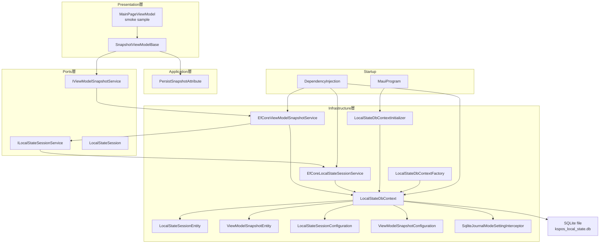
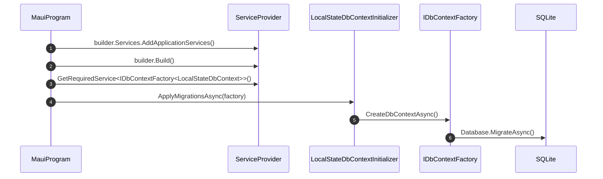
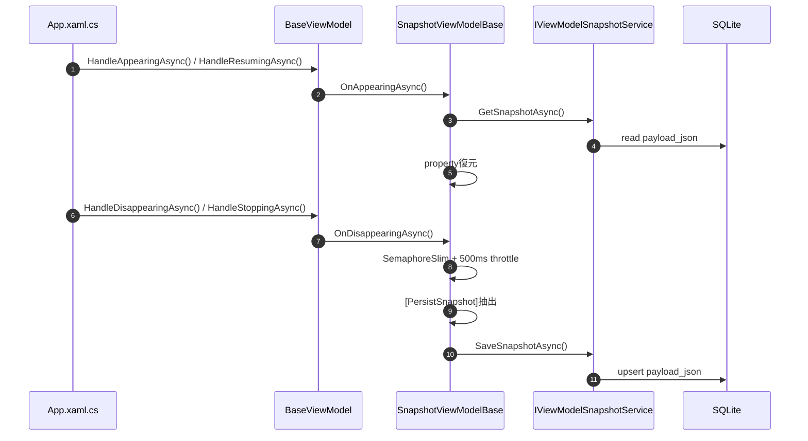

# プログラム仕様書_ローカルストレージ保持基盤_クラス構成

## 1. 変更履歴

| バージョン | 作成者 | 更新者 | 更新日 | 変更理由 | 更新内容 |
|---|---|---|---|---|---|
| 0.0.1 | VTI | VTI | 2026年05月27日 | 初版作成 | ローカルストレージ保持基盤のクラス構成、責務、処理フローを記載 |
| 0.0.2 | VTI | VTI | 2026年05月27日 | lifecycle保存強化 | Window Deactivated / Activated対応と重複保存抑止を追記 |

## 2. 表紙

| 項目 | 内容 |
|---|---|
| プロジェクト名 | タブレットPOS |
| 機能名 | 端末アプリローカルストレージ保持基盤 |
| 対象アプリ | KsPos.Applications |
| 対象範囲 | ViewModel snapshot、local state session、SQLite永続化、lifecycle保存復元 |
| 備考 | 設定値保存、業務DB、master data cacheは対象外 |

## 3. 全体方針

ViewModelの状態保持は`[PersistSnapshot]`による明示指定とする。
保存対象は画面入力中の一時stateに限定し、機微情報や業務確定データは別基盤で扱う。

Presentation層は`SnapshotViewModelBase`とPorts層のinterfaceを利用し、SQLiteやEF Coreの詳細を参照しない。
Infrastructure層はEF Core SQLiteを使用し、DB connection開始時にWAL modeを設定する。

## 4. クラス構成

## 5. 起動時DB初期化フロー

## 6. 画面ライフサイクル保存復元フロー

## 7. クラス一覧

| No | クラス / Enum / Interface | 層 | 主な責務 |
|---:|---|---|---|
| 1 | `PersistSnapshotAttribute` | Application | 保存対象指定 |
| 2 | `SnapshotViewModelBase` | Presentation | lifecycle連動保存復元 |
| 3 | `IViewModelSnapshotService` | Ports | snapshot保存取得削除の抽象化 |
| 4 | `ILocalStateSessionService` | Ports | session管理の抽象化 |
| 5 | `LocalStateSession` | Ports | session情報DTO |
| 6 | `EfCoreViewModelSnapshotService` | Infrastructure | snapshot永続化実装 |
| 7 | `EfCoreLocalStateSessionService` | Infrastructure | session永続化実装 |
| 8 | `LocalStateDbContext` | Infrastructure | EF Core DbContext |
| 9 | `LocalStateSessionEntity` | Infrastructure | session table entity |
| 10 | `ViewModelSnapshotEntity` | Infrastructure | snapshot table entity |
| 11 | `SqliteJournalModeSettingInterceptor` | Infrastructure | WAL mode設定 |
| 12 | `LocalStateDbContextInitializer` | Infrastructure | migration適用 |
| 13 | `LocalStateDbContextFactory` | Infrastructure | design-time DbContext生成 |

## 8. 補足

- Mermaid記法はMermaid 11系互換の`flowchart`および`sequenceDiagram`を使用する。
- `MainPageViewModel`の`MaskInput`はsmoke sampleであり、業務画面実装時は対象ViewModel側で必要なpropertyへ`[PersistSnapshot]`を付与する。
- 複数flow対応は`session_key`を分ける方式とし、固定slot 1-3方式は採用しない。
- lifecycle eventが短時間に複数発火しても、snapshot保存は`SemaphoreSlim`と500ms throttleにより重複実行を抑止する。
