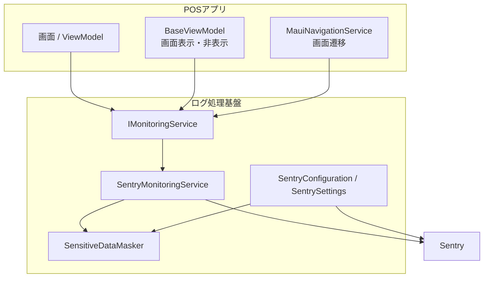
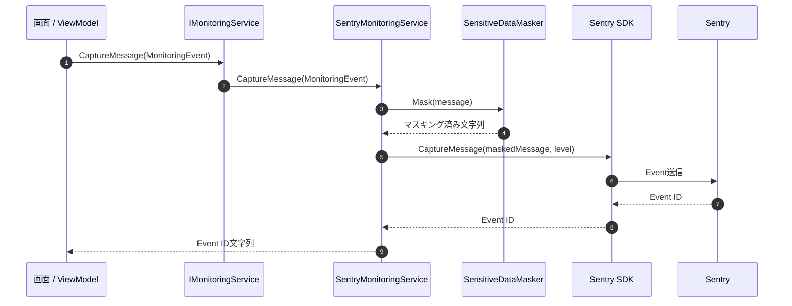

# プログラム仕様書_ログ処理_Sentry監視基盤

## 1. 変更履歴

| バージョン | 依頼者 | 更新者 | 更新日 | 変更理由 | シート名 | 更新内容 |
|---|---|---|---|---|---|---|
| 0.0.1 | Sharp | VTI | 2026年05月23日 | 初版作成 | 全体 | Sentry監視基盤のプログラム仕様を作成 |

## 2. 表紙

| 項目 | 内容 |
|---|---|
| プロジェクト名 | タブレットPOS |
| 機能名 | ログ処理 / Sentry監視基盤 |
| 名前空間 | `KsPos.Applications` |
| クラス名（論理） | Sentry監視基盤 |
| クラス名（物理） | `IMonitoringService` / `SentryMonitoringService` |
| 役割 / 概要 | POSアプリ内の画面操作、画面遷移、エラー、クラッシュ情報をSentryへ連携し、調査に必要なBreadcrumbとEventを記録する |
| 備考 | API通信ログ、デバイス制御ログの自動連携は、実際の通信基盤・デバイスAdapter確定後に追加する |

## 3. クラス定義

### 3.1 全体方針

Sentry SDKへの直接依存はInfrastructure層に閉じ込める。
画面、ViewModel、Navigation処理は`IMonitoringService`を経由してログを記録する。

ログ送信前には、カード番号、会員番号、電話番号、メールアドレスなどの機微情報をマスキングする。
通常の操作履歴はBreadcrumbとして記録し、業務エラーや例外はSentry Eventとして送信する。

### 3.2 クラス構成

### 3.3 クラス一覧

| No | 区分 | クラス / Interface | 主な責務 |
|---:|---|---|---|
| 1 | 監視Interface | `IMonitoringService` | アプリ側から利用するログ処理の窓口。Sentry SDKを直接参照させない |
| 2 | Sentry実装 | `SentryMonitoringService` | Event送信、Breadcrumb追加、Context設定、FlushをSentry SDKへ連携する |
| 3 | Sentry設定 | `SentryConfiguration` / `SentrySettings` | DSN、Environment、PII送信無効、Breadcrumb上限、送信前マスキングhookを設定する |
| 4 | マスキング | `SensitiveDataMasker` | Sentry送信前に機微情報の可能性がある文字列をマスキングする |
| 5 | 画面共通hook | `BaseViewModel` | 画面表示・非表示時にscreen contextとlifecycle breadcrumbを記録する |
| 6 | 画面遷移hook | `MauiNavigationService` | 画面遷移開始、成功、失敗をbreadcrumb/eventとして記録する |

### 3.4 関連データ定義

| No | データ | 内容 |
|---:|---|---|
| 1 | `MonitoringEvent` | ログカテゴリ、メッセージ、レベル、補足情報を保持する |
| 2 | `MonitoringContext` | 画面名、業務フロー、店舗コード、端末ID、デバイス種別、API endpointなどの調査用contextを保持する |
| 3 | `MonitoringLevel` | `Debug`、`Info`、`Warning`、`Error`、`Fatal`を定義する |

### 3.5 ログレベルとSentry連携

| レベル | 使用目的 | Sentry連携 |
|---|---|---|
| Debug | 開発時または詳細調査時の内部情報 | Debug breadcrumb / Debug event |
| Info | 画面表示、画面遷移、正常な業務イベント | Info breadcrumb |
| Warning | 継続可能だが注意が必要な状態 | Warning breadcrumb |
| Error | 業務処理が失敗し、調査・対応が必要な状態 | Error event |
| Fatal | クラッシュまたは致命的障害 | Fatal event |

## 4. メソッド一覧

### 4.1 `IMonitoringService`

| No | 修飾子 | static | 戻り値 | メソッド名 | 概要 | 備考 |
|---:|---|---|---|---|---|---|
| 1 | public | no | `void` | `SetContext` | Sentry Scopeに画面・業務・端末などのcontextを設定する | 空値は設定しない |
| 2 | public | no | `void` | `AddBreadcrumb` | エラー発生前の操作履歴をBreadcrumbとして追加する | Info/Warning中心 |
| 3 | public | no | `string` | `CaptureMessage` | メッセージをSentry Eventとして送信する | Event IDを返却 |
| 4 | public | no | `string` | `CaptureException` | 例外をSentry Eventとして送信する | Event IDを返却 |
| 5 | public | no | `Task` | `FlushAsync` | SDK送信キューを指定時間内でflushする | 結合テスト時に使用 |

### 4.2 `SentryMonitoringService`

| No | 修飾子 | static | 戻り値 | メソッド名 | 概要 | 備考 |
|---:|---|---|---|---|---|---|
| 1 | public | no | `void` | `SetContext` | `MonitoringContext`をSentry tagへ変換して設定する | 値はマスキング後に設定 |
| 2 | public | no | `void` | `AddBreadcrumb` | `MonitoringEvent`をSentry Breadcrumbへ変換する | message/dataをマスキング |
| 3 | public | no | `string` | `CaptureMessage` | `MonitoringEvent`をSentry Eventへ変換して送信する | messageをマスキング |
| 4 | public | no | `string` | `CaptureException` | 例外をSentryへ送信する | 補足eventがある場合はBreadcrumb化 |
| 5 | public | no | `Task` | `FlushAsync` | Sentry SDKのflushを実行する | timeout指定 |

### 4.3 `SensitiveDataMasker`

| No | 修飾子 | static | 戻り値 | メソッド名 | 概要 | 備考 |
|---:|---|---|---|---|---|---|
| 1 | public | yes | `string?` | `Mask` | 対象文字列の機微情報をマスキングする | null/空文字はそのまま返却 |

### 4.4 共通hook

| No | 対象 | メソッド / 処理 | 概要 |
|---:|---|---|---|
| 1 | `BaseViewModel` | `HandleAppearingAsync` | 画面表示時に`screen_name` contextと`lifecycle / appearing` breadcrumbを記録する |
| 2 | `BaseViewModel` | `HandleDisappearingAsync` | 画面非表示時に`lifecycle / disappearing` breadcrumbを記録する |
| 3 | `MauiNavigationService` | `NavigateToAsync` | 画面遷移開始・成功をbreadcrumbとして記録し、失敗時は例外eventを送信する |
| 4 | `MauiNavigationService` | `GoBackAsync` | 戻る操作をbreadcrumbとして記録する |

## 5. メソッド定義

### 5.1 Event送信処理

| 項目ID | No | メソッド名 | 引数 | 戻り値 | 処理内容 | 発生例外 | 備考 |
|---|---:|---|---|---|---|---|---|
| M-001 | 1 | `CaptureMessage` | `MonitoringEvent monitoringEvent` | `string` | メッセージをマスキングし、ログレベルをSentryレベルへ変換してSentry Eventを送信する。送信結果のEvent IDを文字列で返却する | Sentry SDK側の例外 | Event IDが空の場合は空文字を返却 |
| M-002 | 2 | `CaptureException` | `Exception exception`, `MonitoringEvent? monitoringEvent` | `string` | 補足イベントがある場合はError breadcrumbとして追加し、その後例外をSentry Eventとして送信する | Sentry SDK側の例外 | 画面遷移失敗、未処理例外などで使用 |

### 5.2 Breadcrumb記録処理

| 項目ID | No | メソッド名 | 引数 | 戻り値 | 処理内容 | 発生例外 | 備考 |
|---|---:|---|---|---|---|---|---|
| M-003 | 3 | `AddBreadcrumb` | `MonitoringEvent monitoringEvent` | なし | category、message、data、levelをSentry Breadcrumbとして記録する。message/dataは送信前にマスキングする | Sentry SDK側の例外 | 画面表示、画面遷移、業務操作履歴に使用 |

### 5.3 Context設定処理

| 項目ID | No | メソッド名 | 引数 | 戻り値 | 処理内容 | 発生例外 | 備考 |
|---|---:|---|---|---|---|---|---|
| M-004 | 4 | `SetContext` | `MonitoringContext context` | なし | `screen_name`、`business_flow`、`store_code`、`terminal_id`、`device_type`、`api_endpoint`などをSentry tagへ設定する | Sentry SDK側の例外 | 空値は設定対象外 |

### 5.4 マスキング処理

| 項目ID | No | メソッド名 | 引数 | 戻り値 | 処理内容 | 発生例外 | 備考 |
|---|---:|---|---|---|---|---|---|
| M-005 | 5 | `Mask` | `string? value` | `string?` | カード番号候補、会員番号候補、電話番号候補、メールアドレス候補を正規表現で検出しマスキングする | なし | 正規表現ベースのため、実ログ形式確定後にkey単位マスキングを追加する |

### 5.5 送信シーケンス

### 5.6 マスキング仕様

| 種別 | 検出対象 | 変換例 |
|---|---|---|
| クレジットカード番号候補 | 13〜16桁、空白またはハイフン区切りを許容 | `4111-1111-1111-1111` → `************1111` |
| 会員番号候補 | 先頭4桁 + 中間4〜8桁 + 末尾4桁 | `123456789012` → `1234****9012` |
| 電話番号候補 | `0`開始、区切り文字あり/なしを許容 | `090-1234-5678` → `090****5678` |
| メールアドレス | 一般的なメール形式 | `test.user@example.com` → `***@domain.com` |

### 5.7 補足

- 現在のDSN直書きは結合テスト用の一時対応であり、本番リリース前に環境変数または実行時設定へ移行する。
- request body、response body、カード情報のraw値はSentryへ送信しない。
- API通信ログ、デバイス制御ログは、実際の通信基盤とデバイスAdapterが確定後に共通処理へ組み込む。
