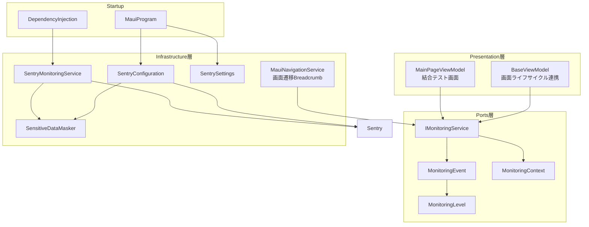
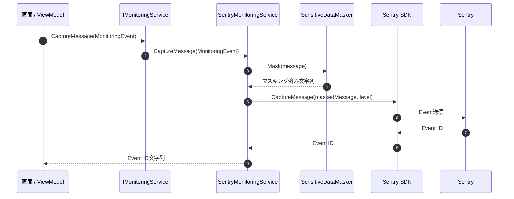
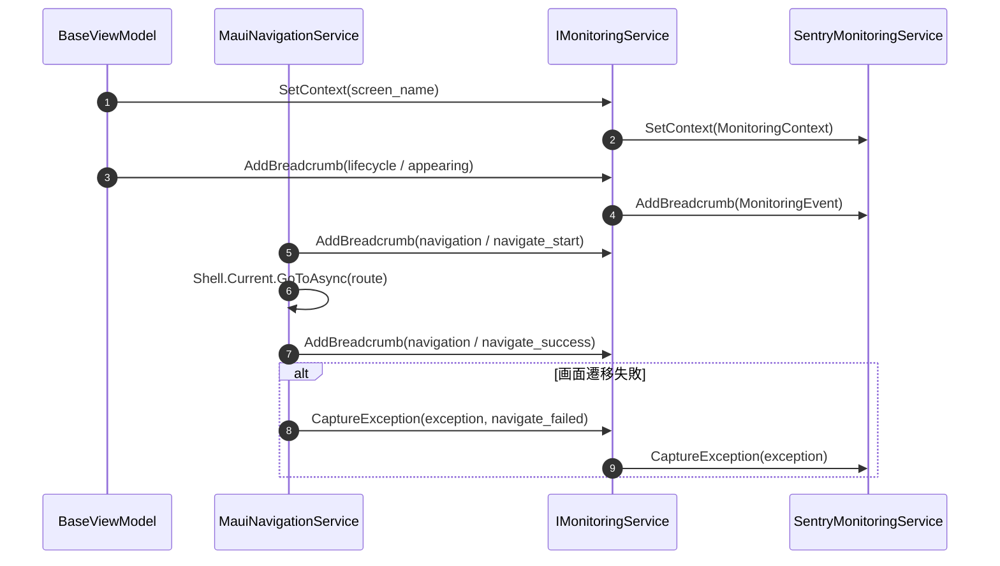

# プログラム仕様書_ログ処理_Sentry監視基盤_クラス構成

## 1. 変更履歴

| バージョン | 作成者 | 更新者 | 更新日 | 変更理由 | 更新内容 |
|---|---|---|---|---|---|
| 0.0.1 | VTI | VTI | 2026年05月22日 | 初版作成 | Sentry監視基盤のクラス構成、責務、処理フローを記載 |

## 2. 表紙

| 項目 | 内容 |
|---|---|
| プロジェクト名 | タブレットPOS |
| 機能名 | ログ処理 / Sentry監視基盤 |
| 対象アプリ | KsPos.Applications |
| 対象範囲 | アプリログ、画面ライフサイクル、画面遷移、例外送信、マスキング |
| 備考 | API通信、デバイス制御ログの自動連携は今後の実装対象 |

## 3. 全体方針

Sentry SDKへの直接依存はInfrastructure層に閉じ込める。
Presentation層および今後追加されるApplication層は、`IMonitoringService`のみを利用する。

`Info` / `Warning` はエラー調査用のBreadcrumbとして記録し、`Error` / `Fatal` はSentry Eventとして送信する。
個人情報または機微情報の可能性がある文字列は、Sentry送信前に`SensitiveDataMasker`でマスキングする。

## 4. クラス構成

## 5. イベント送信シーケンス

## 6. 画面ライフサイクル / 画面遷移フロー

## 7. クラス一覧

| No | クラス / Enum / Interface | 層 | 主な責務 |
|---:|---|---|---|
| 1 | `IMonitoringService` | Ports | 監視処理の抽象化 |
| 2 | `MonitoringEvent` | Ports | ログイベント情報の保持 |
| 3 | `MonitoringContext` | Ports | 画面、業務、端末などのコンテキスト保持 |
| 4 | `MonitoringLevel` | Ports | ログレベル定義 |
| 5 | `SentryMonitoringService` | Infrastructure | `IMonitoringService`のSentry実装 |
| 6 | `SentryConfiguration` | Infrastructure | Sentry SDK初期化オプション設定 |
| 7 | `SensitiveDataMasker` | Infrastructure | 機微情報の文字列マスキング |
| 8 | `SentrySettings` | Infrastructure | Sentry設定値の読み込み |

## 8. 補足

- 現在のDSN直書きは結合テスト用の一時対応であり、本番リリース前に環境変数または実行時設定へ移行する。
- API通信ログ、デバイス制御ログは、実際の通信基盤とデバイスAdapterが確定後に共通処理へ組み込む。
- Mermaid記法はMermaid 11系互換の`flowchart`および`sequenceDiagram`を使用する。
