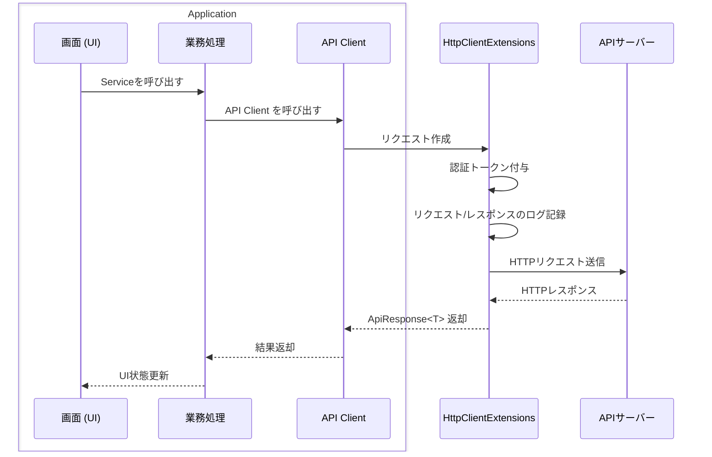
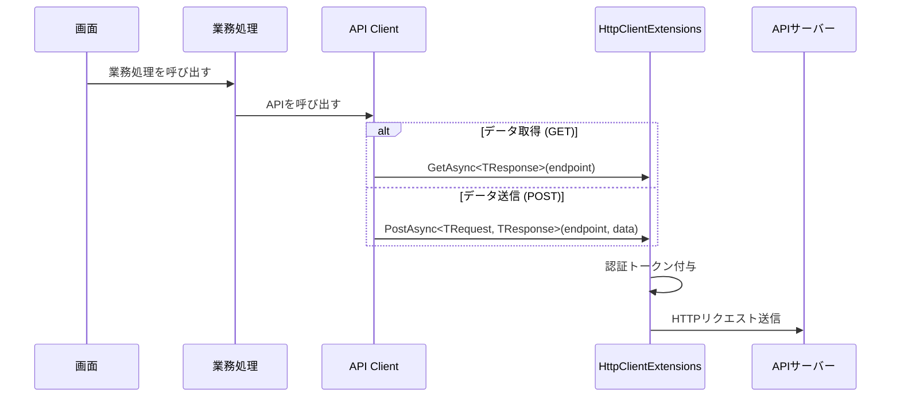
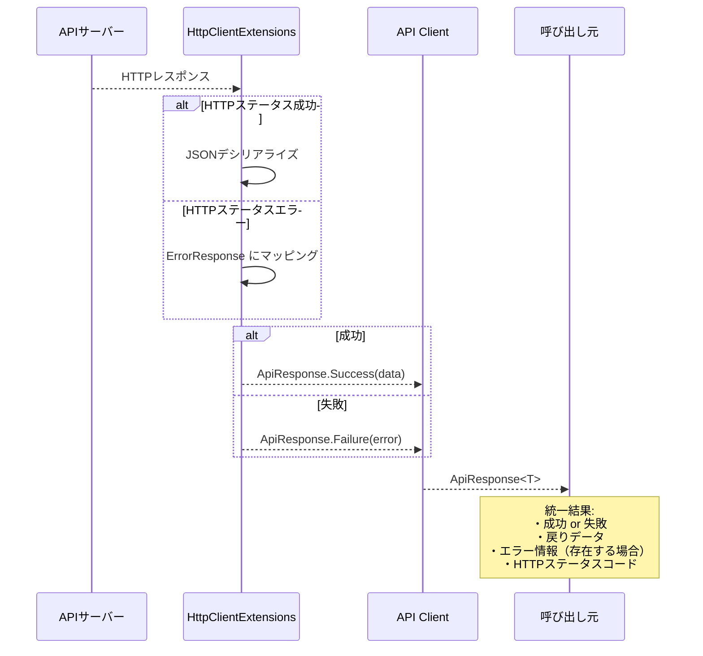
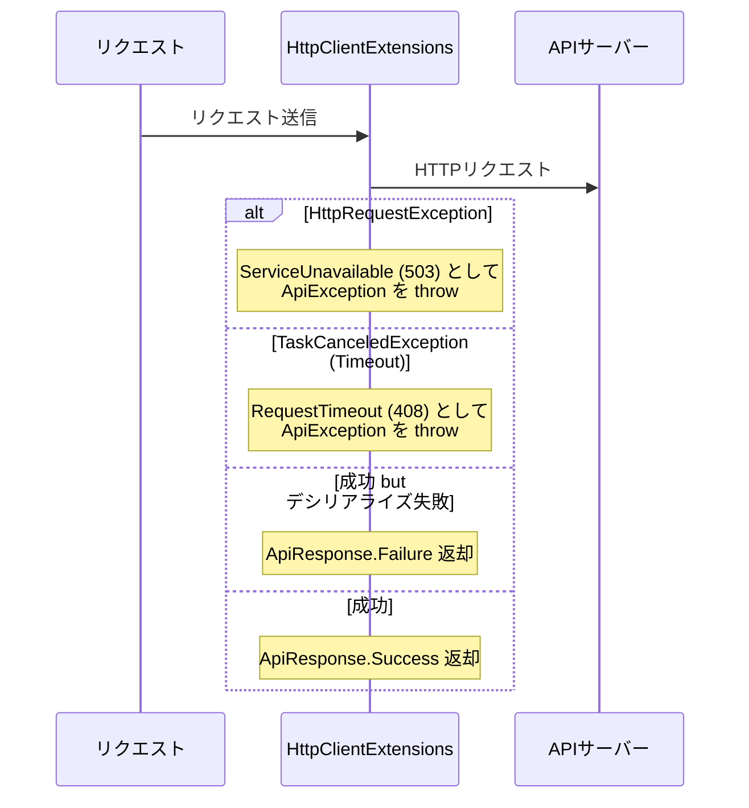
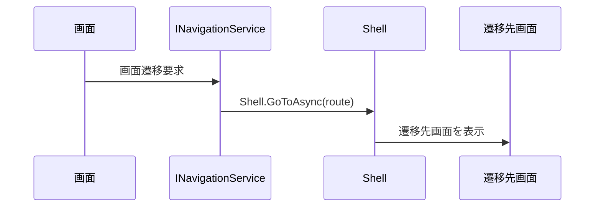
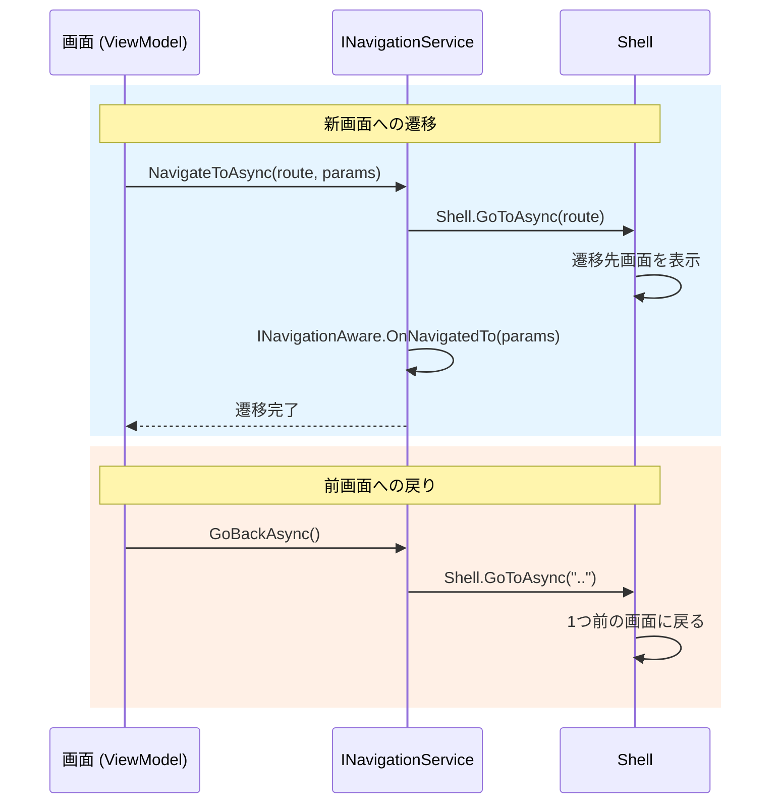
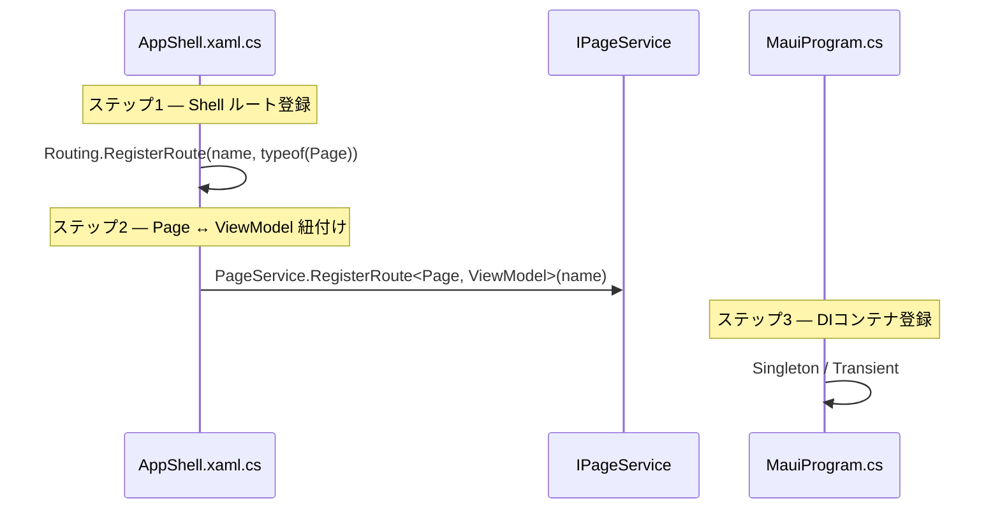
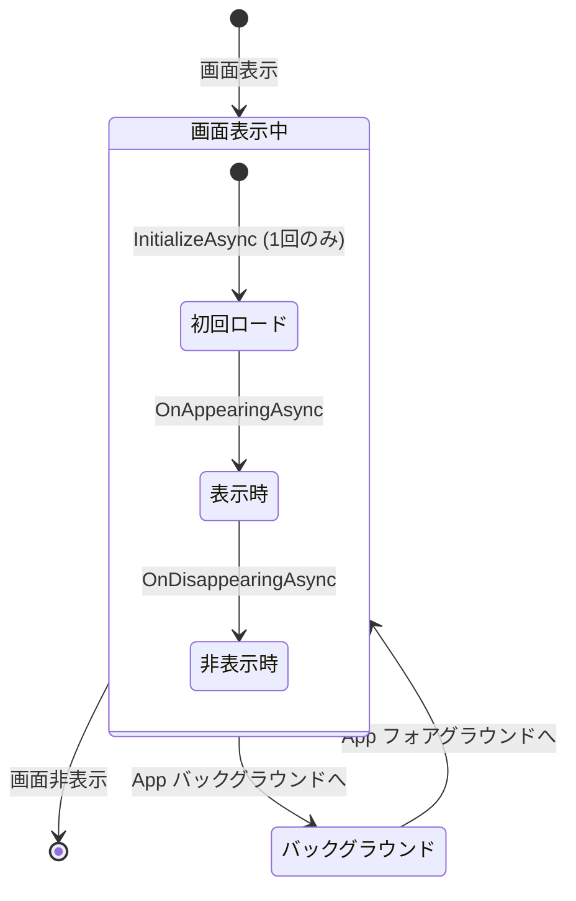

# API呼び出し・画面遷移 アーキテクチャ基本設計書 — MauiPOSX

| 項目           | 内容                                          |
| -------------- | --------------------------------------------- |
| 文書番号       | タブレットPOS-API-NAV-BD-001                          |
| 作成日         | 2026年03月26日                                |
| プロジェクト名 | MauiPOSX - API呼び出し・画面遷移アーキテクチャ |

---

## 1. API アーキテクチャ（端末からAPIを呼び出し）

### 1.1. アーキテクチャ概要と Request Pipeline

Typed HttpClient と Dependency Injection を組み合わせたモデルを採用している。各リクエストは以下のレイヤーを順に通過する。

各レイヤーの役割:

| 説明 | 技術用語 | 役割 | 特徴 |
| --- | --- | --- | --- |
| 画面 (UI) | ViewModel | Serviceを呼び出し、UI状態を処理 | HTTPを意識しない |
| 業務処理 | Service | ビジネスロジックの統括 | 1つまたは複数のAPI Clientを呼び出す |
| API Client | API Client | 1ドメインのEndpointをカプセル化 | Typed HttpClient, DI注入 |
| リクエスト作成 + トークン付与 | HttpClientExtensions | リクエスト構築、レスポンス解析 | GET (query string) / POST (JSON body) |

各ApiClientは1つの業務ドメインを担当し、`CoreServiceCollectionExtensions.AddCoreLayer` でDIコンテナに登録される。

#### デフォルト設定

| 設定 | 値 |
| --- | --- |
| Default Timeout | 30 秒 |
| Connection Timeout | 5 秒 |
| Max Retry Attempts | 3 |

---

### 1.2. Request Flow — GET と POST

- データ取得 (GET): エンドポイントURLに直接リクエストを送信する。
- データ送信 (POST): データはJSON形式に自動変換される。null値は自動的にスキップされる。
- 認証: `IAuthenticationService` 経由でトークンを取得し、`Authorization: Bearer` ヘッダーに自動付与する。
- Endpoint: `ApiConfiguration.Endpoints` で集中定義する。

---

### 1.3. Response Flow

全ての戻り値は `ApiResponse<T>` で統一的にラップされる:

> エラーは `HttpClientExtensions` 内部で処理され、`ApiException` として throw される。呼び出し元は常に `ApiResponse<T>` を受け取り、成功/失敗のみ確認すればよい。

---

### 1.4. エラーハンドリング

`HttpClientExtensions` 内で以下のエラーを一元処理する:

アーキテクチャの結果: 各APIメソッドにはエラーハンドリングがない。コア・ロジックのみで構成される（リクエスト作成 → 送信 → 結果解析）。

#### エラーハンドリング対応

| 種類 | 処理 | 目的 |
| --- | --- | --- |
| HTTP通信エラー | `ApiException(503)` をthrow | ネットワーク障害時 |
| タイムアウト | `ApiException(408)` をthrow | リクエストタイムアウト |
| デシリアライズ失敗 | `ApiResponse.Failure` を返却 | JSONパースエラー |

---

### 1.5. 環境切替 (Mock / Production)

APIサーバーのアドレスは `ApiConfiguration.cs` のコメントで切り替える:

| 環境 | ベースURL |
| --- | --- |
| VTI (Mock) | `https://mock-api-combined-542799931692.asia-northeast1.run.app` |
| Sharp (本番) | `https://api.ks-internal.local` |

> 現在はソースコード内のコメントで切り替えており、ビルド構成による自動切替は未実装。`MockDataLoader` は `#if DEBUG` で登録される。

---

## 2. Navigation アーキテクチャ（画面遷移）

### 2.1. 処理フロー概要

.NET MAUI Shell Navigation と INavigationService パターンを採用している:

---

### 2.2. Navigation Flow

- パラメータなし: ルート名またはViewModel型で遷移先を指定する
- パラメータあり: Dictionary形式で渡し、遷移先は `OnNavigatedToAsync(parameter)` で受け取る（`BaseViewModel` を継承）

---

### 2.3. Route 登録

新規画面の登録は2箇所で行う:

- Singleton: 頻繁にアクセスする画面 — 状態を保持する（例: `HomeMenuPage`）
- Transient: 毎回新しい状態が必要な画面
- メイン画面は `HomeMenuPage`。ナビゲーションバーは非表示（カスタムヘッダーを使用）、スライドメニューは無効。

---

### 2.4. ライフサイクルイベント

全ViewModel は `BaseViewModel` を継承し、`App.xaml.cs` のグローバルイベント経由でライフサイクルイベントを自動受信する:

| イベント | Handler | 説明 |
| --- | --- | --- |
| 初回ロード | `InitializeAsync()` | 初回表示時に1度だけ実行。重い初期化処理に使用 |
| 画面表示 | `HandleAppearingAsync()` → `OnAppearingAsync()` | `viewDidAppear` (iOS) 相当 |
| 画面非表示 | `HandleDisappearingAsync()` → `OnDisappearingAsync()` | 画面が非表示になった時 |
| App バックグラウンド | `HandleStoppingAsync()` → `OnStoppingAsync()` | App がバックグラウンドに移行 |
| App フォアグラウンド | `HandleResumingAsync()` → `OnResumingAsync()` | App がフォアグラウンドに復帰 |
| 画面遷移受信 | `OnNavigatedToAsync(parameter)` | 前画面からのパラメータ受信 |
