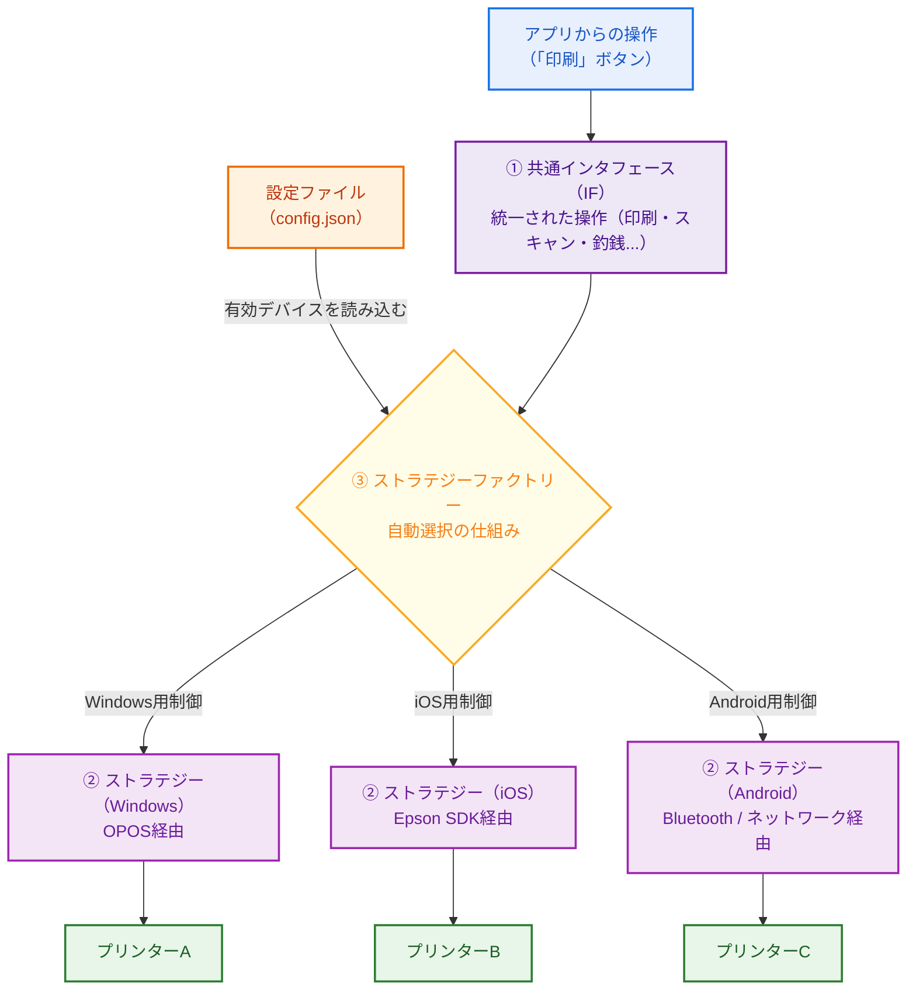
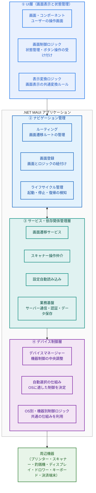
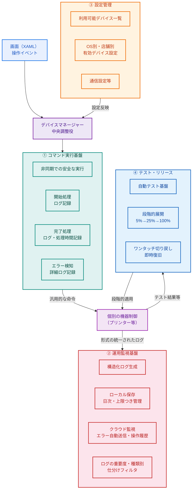
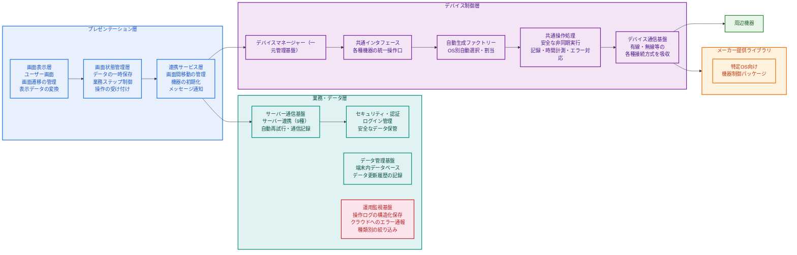
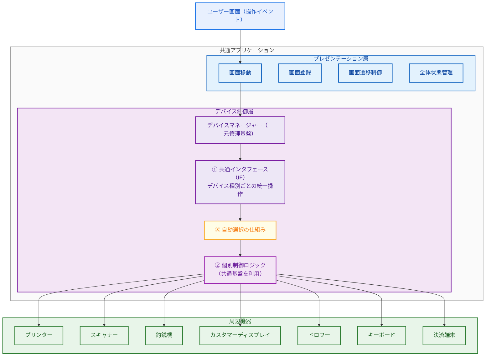
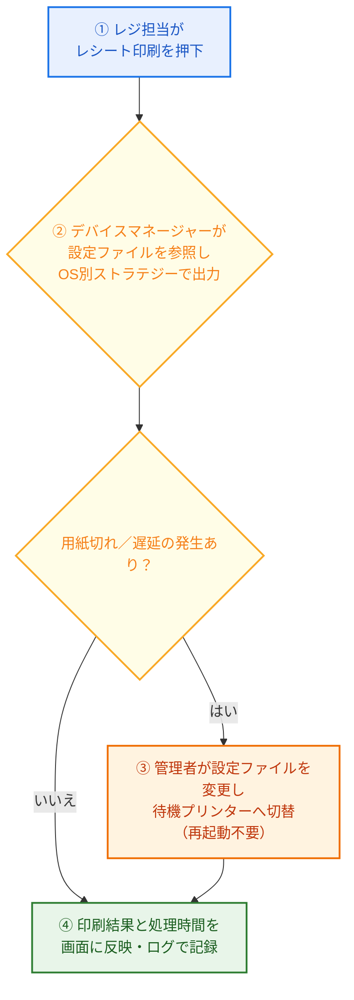
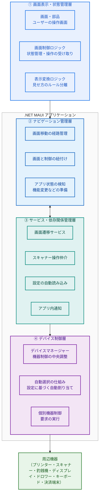
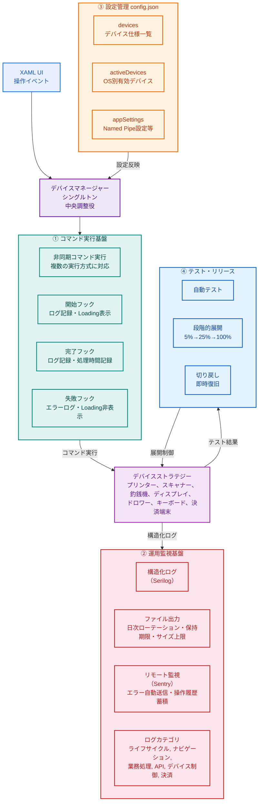

# アーキテクチャ提案書

**ケーズホールディングス様向け**

## 次世代POSプロジェクト

2025/11/05

---

## 目次

- 第1 背景と現状課題
- 第2 解決策提案（概要）
- 第3 解決策提案（詳細）
- 第4 まとめ
- 第5 付録（Appendix）

---

## 第1 背景と現状課題

次世代POSシステムへの移行には、3つの主要な課題が存在する。

### ① デバイスへの依存課題

機器変更のたびにアプリ改修が必要となり、**改修コストの増大と開発期間の長期化**を招いている。

### ② 利用プラットフォームの制限課題

Windows OSに限定されており、iPadなど**他プラットフォームへの拡張が困難**である。

### ③ 保守性（メンテナンス性）の課題

アプリケーション全体が**一体化**し、**障害特定が困難**なため、**変更時のリスク増大**が問題となっている。

---

### 第1 背景と現状課題：詳細①

#### ① デバイスへの依存課題

**困っている点（As-Is）**

- メーカー独自のSDKやドライバに依存しており、デバイスの標準化が不足している。
- プリンター等の機器を変更するたびに、アプリケーション側の改修が必要になる。
- 古い機器のサポート終了や新機能の追加が、多大な改修コストと開発期間につながる。

**あるべき姿（To-Be）**

- アプリケーションからデバイス制御ロジックを分離する。
- アプリは「共通インターフェース」のみを呼び出す。
- 機器やOSの違いは、新設する「デバイス制御層」が吸収する。
- 将来の機器入替は、この「デバイス制御層」の一部差替えのみで対応可能にし、アプリ本体の変更を不要にする。

---

### 第1 背景と現状課題：詳細②

#### ② 利用プラットフォームの制限課題

**困っている点（As-Is）**

- 古いWindowsおよび.NET Frameworkに制約されている。
- クロスプラットフォーム互換性が無いため、iPadやモバイル端末での利用ができない。
- 最新機能の導入が遅れ、セキュリティリスクや運用コストの増大につながっている。

**あるべき姿（To-Be）**

- 「.NET MAUI ネイティブ構成」を基本方針として採用する。
- MAUI採用理由：.NET MAUIは、既存のWindows（.NET）資産と親和性が高く、効率的に他OS（iOS/Android）へ展開可能なため。
- 期待効果
  - マルチOS対応：Windows / iOS / Android を単一コードで展開できる。
  - UI開発の効率化：XAMLによるネイティブUIを全プラットフォームで共有し、OS固有のレンダリングエンジンで最適な表示を実現する。

---

### 第1 背景と現状課題：詳細③

#### ③ 保守性（メンテナンス性）の課題

**困っている点（As-Is）**

- アプリケーション全体が一体化しているため、小さな修正が予期せぬ不具合（デグレード）を招きやすい。
- 上記理由により、変更時のテスト範囲が広がり、リスクが増大する。
- 障害発生時に、問題箇所（UI、業務ロジック等）の特定に時間がかかる。
- 手動での展開プロセスに依存しており、リリースが遅い。
- 既存の監視はローカルに限定され、全店舗の状況を横断的に分析・予測することが困難。

**あるべき姿（To-Be）**

- ロジックを機能ごと（UI、業務、デバイス）に分離・独立させる。
  → これにより、変更時の影響範囲を限定し、テストを容易にする。
- 処理時間や結果を構造化ログとして記録し、集中ログ管理・取得・同期、外部監視システム（Sentry）との良好な統合が可能な運用保守基盤を整備する。
  → これにより、迅速な障害復旧と、安全なリリースを実現する。

---

## 第2 解決策提案（概要）

### アーキテクチャの基本方針

上記の3つの課題より、新しいアーキテクチャの核心となる方針ですべてのソリューション展開の基盤が形成される。

**【分離】**

- システムの各部分は、それぞれ特定の責任（タスク）のみを担当する。
  → システム全体に影響を与えずに、変更や修正が可能。

**【再利用】**

- 一度作ったものを複数の場所やプラットフォームで使用できる。
  → 開発コストを削減し、安定性を向上できる。

**【拡張性】**

- 新しい機能やプラットフォームを簡単に追加でき、再実装の必要がない。
  → 将来の技術変化にも柔軟に対応できる。

**【保守性】**

- 明確な構造により、バグの特定・修正・テストが容易になる。
  → 長期的な運用コストを削減できる。

---

### アーキテクチャの基本方針（続き）

上記の4つの基本方針（分離・再利用・拡張性・保守性）に基づき、以下の3つの解決策を提案する。

| 現状課題 | 基本方針 | 解決案提案 | 期待効果 |
|---|---|---|---|
| ① デバイスへの依存 | **依存低減** デバイス/OS差分は下層で吸収し、アプリ層は共通IFのみに依存 | **① ストラテジーパターン**（デバイス共通IF＋ストラテジー＋OS別ファクトリー）で吸収 ※詳細は「11ページ目」を参照 | ・再試験範囲30–50%削減 ・入替時間短縮 |
| ② 利用プラットフォームの制限 | **マルチOS対応** Windows/iOS/Android を単一コードで展開 | **② .NET MAUIネイティブ構成**（XAML共通UI + MVVM） ※詳細は「12ページ目」を参照 | ・UI/ロジック再利用率が60–70%達成 ・複数OSへ段階的展開 |
| ③ 保守性（メンテナンス性） | **運用コスト低減** 配備の迅速化・障害切り分け容易化・テスト標準化 | **③ 運用保守基盤**（コマンド実行基盤・ログ監視・設定管理・段階リリース・自動テストによる高信頼運用）を構築 ※詳細は「13ページ目」を参照 | ・MTTR（平均修復時間）20–40%短縮 ・リリースリスク低減 |

---

### ① ストラテジーパターンについて

**目的**

機器や接続方式をアプリケーションの変更なしで自由に入替え可能にすること。

**構成要素**

- **① 共通インタフェース（IF）**：アプリ側が呼び出す共通操作を、デバイス種別ごとに定義。「印刷する」「スキャンする」「釣銭を出す」「画面に表示する」「ドロワーを開く」「キー入力を受け取る」「決済処理を行う」といった操作を、メーカーや機種に関係なく統一された呼び出し方で使えるようにする。
- **② ストラテジー**：機器ごとの個別制御方法。共通の基盤クラスを継承し、コマンド実行・エラー処理・ログ記録を自動化。メーカーやOSの違いはこの層で吸収する。
- **③ ストラテジーファクトリー**：設定ファイル（config.json）に基づき、実行環境のOS（Windows/iOS/Android）と設定に応じて、使用するストラテジーを自動で選択・生成する仕組み。

※詳細は「15〜18ページ目」を参照

---

### ② .NET MAUI ネイティブ構成（共通UI一式）について

**目的**

「ネイティブXAML UI」と「MVVMパターン」により、「複数のプラットフォーム」（Windows/iOS/Android）へ展開可能にする。
これにより、UI開発の効率化と、OSごとに操作感が変わる問題を解決する。

**構成要素**

本構成は「UI層」と「制御層」を明確に分離する。

- **① UI層 (XAML + MVVM)**：画面、ボタン、入力など、ユーザーが触れる部分は全てXAMLで構築する。ビジネスロジックと画面表示を分離し、画面の状態管理・ライフサイクル管理を統一的に行う。
- **② Shell Host**：MAUI Shellがルーティングとナビゲーションを一元管理し、全ページの登録と画面遷移を制御する。
- **③ DI / Service層**：依存性注入によるサービス管理。アプリケーションサービス（画面遷移、スキャナー操作、デバイス設定等）と業務サービス（API通信、認証、データアクセス等）を統一管理する。
- **④ デバイス制御層**：上記ストラテジーパターンを実行する。デバイスマネージャーが設定ファイルに基づいてストラテジーを選択・生成する。

※詳細は「19〜22ページ目」を参照

---

### ③ 運用保守基盤について

**目的**

障害発生時の影響を最小化し、迅速な復旧と継続稼働を実現する。

**構成要素**

- **① コマンド実行基盤**：すべての機器操作を安全に非同期実行する仕組み。開始・完了・エラーといった一連のプロセスと時間を自動で記録します。
- **② 運用監視基盤**：操作ログやエラーログを構造化してファイルに保存し、重大なエラーが発生した場合は即座にクラウド上の監視ダッシュボードへ送信します。利用者の直前の操作履歴も併せて送信し、原因特定を迅速化します。
- **③ 設定管理機能**：利用する機器の構成（IPアドレス、COMポート等）を設定ファイル（config.json）で一元管理。設定を変えるだけで、プログラムを再編纂（ビルド）することなく接続先の機器を切り替えられます。
- **④ テスト・リリース**：変更を少数の店舗から段階的に展開し、問題があれば即座に元の状態に戻す（切り戻し）安全な運用基盤を整備。自動テストとの組み合わせで品質を担保します。

※詳細は「23〜26ページ目」を参照

---

### アーキテクチャ全体図

**全体図**

| プレゼンテーション層 | 業務・データ層 | デバイス制御層 |
|---|---|---|
| **画面表示層**：ユーザーUI、ナビゲーション、表示変換・動作の統一 | **サーバー通信基盤**：各種API連携（9種類）、通信エラー時の自動再試行、通信ログ記録 | **デバイスマネージャー**：一元管理による競合防止、設定ファイルに基づく機器調停 |
| **画面状態管理層**：画面のライフサイクル管理、業務処理のステップ制御、ボタン等の操作受け付け | **認証・セキュリティ基盤**：安全なログイン管理、資格情報のセキュアな保管 | **共通インタフェース**：デバイス種別ごとの統一された操作口（7種） |
| **連携サービス層**：画面遷移ロジックの切り出し、ページ管理、機器の初期設定、アプリ内メッセージ管理 | **データ管理基盤**：端末内でのデータ保存、データ更新時の変更証跡記録 | **自動選択の仕組み**：設定ファイルを利用して、その場のOSや接続状況に応じた最適な制御方法を割り当て |
| | **運用監視基盤**：操作ログの構造化保存、クラウドへのエラー自動通報、カテゴリ別抽出 | **デバイス通信基盤**：有線、無線、シリアル通信など接続方式の違いを吸収 |

---

## 第3 解決策提案（詳細①）

**【課題】デバイスへの依存**
**【対策】ストラテジーパターン**

---

### 第3 解決策提案詳細①：実装方法

機器や接続方式をアプリケーションの変更なしで自由に入替え可能にする実装方法を示す。

**目的**

#### ① 共通インタフェース（IF）

**実装方法**：印刷・スキャン・釣銭制御・ディスプレイ表示・ドロワー開閉・キーボード受信・決済処理など、すべてのデバイス操作をデバイス種別ごとの共通インタフェースとして定義。アプリケーション側はこの共通インタフェースのみを使用し、どのメーカーの機器か、どの通信方式かを気にする必要がない。

**動作**：画面で「印刷」ボタンを押すと、常に共通インタフェースの「印刷」操作が呼び出される。この命令がデバイスマネージャーを通じて自動的に適切なプリンター制御方法（Windows用、iOS用、Android用等）に変換される。

#### ② ストラテジー

**実装方法**：各メーカー・各OSごとに、デバイス専用の制御方法を実装。すべてのストラテジーは共通基盤クラスを継承し、コマンド実行・エラー処理・ログ記録・処理時間計測を共通化。メーカー独自のSDKや通信方式の違いをここで吸収。共通インタフェースに従うことで、どの機器でも同じように動作。

**動作**：Windows環境ではOPOS経由、iOS環境ではEpson SDK（ネットワーク接続）経由、Android環境ではBluetooth/ネットワーク経由で制御される。アプリから見れば、すべて同じ「印刷」命令で制御できる。

---

### 第3 解決策提案詳細①：実装方法（続き）

#### ③ 自動選択の仕組み（ファクトリー）

**実装方法**：デバイスの管理・調停クラスに、あらかじめOS環境別の制御ロジックを登録しておきます。設定ファイル（config.json）で有効化されている機器に応じて、必要な制御部品が自動的に選出・準備される機構を備えています。

**動作**：Windows環境ではOPOS経由の専用ロジックが選ばれ、iOS環境ではネットワーク連携を前提とした専用ロジックが、Android環境ではBluetoothやネットワーク経由の制御ロジックがそれぞれ自動で立ち上がります。設定ファイルを書き換えるだけで、プログラムを再編纂（ビルド）することなく機器の設定や通信手段を変更できます。

**期待効果**

- **アプリ非依存化**：機器を交換してもアプリコードは変更不要。
- **テスト範囲削減**：変更箇所がストラテジー単位に限定。
- **柔軟な拡張性**：新機器の追加が最短で1日以内に可能。

---

### 第3 解決策提案詳細①：実運用例（印刷の時）

**例）ピーク時のレシート印刷時**

- ①レジ担当がレシート印刷を押下
- ②デバイスマネージャーが設定ファイルの有効デバイス設定からOS別プリンターストラテジーを特定し、非同期実行
- ③用紙切れ／遅延の兆候があれば、管理者は設定ファイルの有効デバイス設定で待機プリンターに切替（アプリ再起動なし）
- ④印刷結果は画面に即時反映。処理時間も構造化ログで自動記録し、品質を可視化

**ビジネス価値**

- **待ち時間短縮**：印刷の詰まりを抑制し、行列を短く、ピーク処理件数を向上。
- **ミスと印刷やり直しの削減**：テンプレート統一制御で紙・インクを節約。
- **入替時の中断最小化**：config.jsonで別機器へ切替可能→レジ停止時間を短縮。
- **サポート工数の低減**：処理時間の見える化で原因切り分けが容易。

---

## 第3 解決策提案（詳細②）

**【課題】利用プラットフォームの制限**
**【対策】.NET MAUI ネイティブ構成（XAML共通UI + MVVM）**

---

### 第3 解決策提案詳細②：実装方法

一つのXAML UIを複数のOSで共通利用し、保守と展開を容易にする。

**目的**

#### ① 画面表示・状態管理層

**実装方法**：画面やボタンなどユーザーが触れる「見た目」の部分と、裏側で動く「業務制御」を完全に分離して構築します。画面の表示・一時停止といった状態の変化や、金額や日時の「表示上の自動変換」を、専用の管理単位で統一して制御します。

**動作**：各要素が独立して動くため、見た目を変更する際は画面側の修正のみで完了し、Windows/iOS/Androidの全OSに一括で反映されます。商品登録、決済などの画面間の移動も、安全なナビゲーションの仕組みにゆだねられます。

#### ② ナビゲーション管理層

**実装方法**：アプリケーション全体の「地図（画面階層構造）」を定義し、個々の画面と裏側の制御ロジックをペアにして紐付け、間違いのない画面移動を保証します。アプリの一時停止や復帰といった全体イベントも検出し、自動で各画面の進行状態と同期します。

**動作**：アプリ起動時にすべてのルートが準備され、利用者の要求に応じて適切な画面がパズルのように組み合わさって表示されます。Windows環境では、自動的に全画面表示に切り替え、専用キーボードからの信号を監視するモードが起動します。

---

### 第3 解決策提案詳細②：実装方法（続き）

#### ③ サービス・依存関係管理層

**実装方法**：アプリケーション立ち上げ時に、必要な機能群（OS固有の機能、業務API連携機能、画面やデバイスを制御する機能）を一覧として登録し、各機能が互いに連携しやすい状態を構築します。これにより、画面ごとに必要な機能を都度作成する手間を省き、メモリの効率的な割り当て（使い捨て・常駐の区別）を行います。

**動作**：画面側が必要な処理（画面遷移、設定読み込み、スキャナー利用など）を要求するだけで、裏側で自動的に最適な機能が用意され、確実に引き渡されます。設定ファイルの読み込みやデバイスの初期化も、この層が自動で管理・実行します。

#### ④ デバイス制御層

**実装方法**：デバイスマネージャー（一元管理基盤）が設定ファイルからデバイス設定を読み込み、OS・機器ごとの制御ロジックを登録します。要求があった際に初めて機器との接続を確立し、複数端末や複数処理から同時に呼ばれても競合しない安全な仕組み（排他制御）を備えています。

**動作**：UIからの要求はアプリケーションサービスを経由し、デバイスマネージャーが自動的に最適なデバイス制御方法で処理される。新しいデバイスを追加する場合も、この層のみを拡張すれば対応可能。

**期待効果**

- **共通UI基盤の実現**：1つのXAMLコードで3OS対応。
- **開発効率向上**：UI変更が全OSに同時反映。
- **展開コスト削減**：店舗ごとの環境差をMAUI + 設定ファイルが吸収。

---

### 第3 解決策提案詳細②：実運用例（UI一括反映）

**例）UI変更を全拠点へ一括反映時**

- 会社がレシート画面に「クイック精算」ボタンを追加（操作1手削減）
- XAMLページを修正し、1回ビルドで全OS向けパッケージを生成
- 更新後、WindowsレジもiPadも同じ画面、同じ操作に統一
- 動作確認はUI差分のみで完了。業務ロジック（ViewModel）は不変のため、再試験範囲を縮小

**ビジネス価値**

- **体験の統一**：OSが異なっても操作感が統一され、習得が容易になる。
- **ピーク時の増員が容易**：iPadで臨時レジを増設でき、行列を短縮。
- **一括更新**：画面変更を1回作って全店に適用→展開工数を削減。
- **再試験範囲を縮小**：業務ロジックは不変で、UI差分の確認に集中できる。

---

## 第3 解決策提案（詳細③）

**【課題】保守性（メンテナンス性）**
**【対策】運用保守基盤**

---

### 第3 解決策提案詳細③：実装方法

運用時の安定性を高め、障害発生時の影響を最小化する。

**目的**

これは運用保守基盤の各コンポーネントであり、その中でデバイスマネージャーが中央調整役を担う：

#### ① コマンド実行基盤

**実装方法**：共通基盤クラスが提供する非同期コマンド実行機能で、すべてのデバイス操作を非同期で安全に実行。開始・完了・失敗の各フックでログと処理時間を自動記録。呼び出し元のメソッド名も自動取得し、「クラス名.メソッド名」形式でログに記録。

**動作**：ストラテジー内で非同期コマンド実行を呼ぶだけで、開始ログ、完了ログ（処理時間付き）、エラーログが自動出力される。Loadingインジケータの表示・非表示も自動制御される。

#### ② 運用監視基盤（Serilog + Sentry）

**実装方法**：構造化ログフレームワーク（Serilog）を使用。ファイル出力（日次ローテーション、ファイルサイズ上限、保持期限）とリモート監視（Sentry、エラー以上を自動送信、操作履歴を蓄積）を登録。ログカテゴリ（ライフサイクル、ナビゲーション、業務処理、API通信、デバイス制御、決済）を定義し、カテゴリ別のログレベル制御を実現。

**動作**：すべてのデバイス操作・API通信・画面遷移のログが構造化形式で記録される。障害発生時はSentryダッシュボードで即座に通知され、操作履歴で原因を確認できる。通常より時間がかかっている場合はログから予兆を把握できる。

---

### 第3 解決策提案詳細③：実装方法（続き）

#### ③ 設定管理 config.json

**実装方法**：ルート設定クラスが全デバイス仕様一覧、OS別・デバイス種別ごとの有効デバイス設定、アプリケーション設定（Named Pipe設定等）を保持。デバイス設定サービスが設定ファイルの読み込みとデバイスマネージャーへの反映を管理。デバイス仕様にはID、種別、OS、ストラテジークラス名、接続情報（IP、ポート、COMポート等）が含まれる。

**動作**：店舗ごとに異なるプリンターを使う場合でも、設定ファイルの有効デバイス設定を変更するだけで対応可能。Windows環境ではNamed Pipe設定（パイプ名、接続タイムアウト）もアプリケーション設定から読み込まれる。アプリの再ビルドは不要。

#### ④ テスト・リリース

**実装方法**：単体テストプロジェクトで自動テスト基盤を整備。新機能は最初に一部の端末でのみ試し、問題がなければ段階的に全端末へ展開。問題が発生した場合は即座に元のバージョンに戻せる。

**動作**：新しい機能を5%の端末で試し、問題なければ25%、そして100%へと段階的に展開。途中で問題が発生した場合も、すぐに前のバージョンに戻せるため、業務への影響を最小限に抑制。

**期待効果**

- **MTTR（平均修復時間）短縮**：平均復旧時間を20〜40%削減。
- **障害影響の局所化**：該当ストラテジー単位で迅速に対応。
- **安定稼働**：すべての操作を可視化し、予防保全が可能。

---

### 第3 解決策提案詳細③：実運用例

**例）ピーク時に複数の端末から同時に印刷ボタンが押された場合**

- レジAとレジBがほぼ同時にレシート印刷を押下
- デバイスマネージャーの命令記憶（排他制御保護）と非同期コマンド実行により、各端末のコマンドが独立して安全に処理される
- 処理時間を構造化ログ + リモート監視が自動記録し、異常があれば管理者に通知
- 重複印刷やハングを防止し、安定した動作を実現

**ビジネス価値**

- **重複票の削減**：紙の節約、レジ担当の時間短縮を実現。
- **ピーク時のトラブル回避**：提供スピードの維持により、顧客満足度を向上。
- **予防保全の実現**：速度監視により、一部店舗で印刷時間が平均時間超を検知→ドライバ／接続の点検をピーク前に実施可能。
- **安全な段階的展開**：先行店だけ自動釣銭機を有効化して実証。問題があれば即座に切り戻し可能。小規模で安全に試せる、全店への波及リスクを低減、安定状態への復帰が速い。

---

## 第4 まとめ

### 新アーキテクチャ導入後のメリット

既存POSシステムのコンポーネントおよび業務分析、ならびにシステムに対する新しいアーキテクチャ提案に基づき、以下の点が総括される。

| 解決策提案 | 技術的メリット | 実現するビジネス価値 |
|---|---|---|
| ストラテジーパターン（デバイス依存の分離） | デバイス種別ごとの統一IF群、3OS対応の制御群 試験範囲の大幅な削減 入替リードタイム短縮 | ビジネスの俊敏性向上 → ハードウェアが障壁ではなくなる。自由に交渉し、ベンダーを選択し、デバイスコストを削減。 |
| .NET MAUI ネイティブ構成（XAML共通UI） | UI／ロジック推定再利用60–70% 全画面での共通基盤・変換ロジック共有 複数OSへ段階的展開 | 顧客体験の統一と機会創出 → iPadによる臨時レジ展開、モバイル販売。すべてのデバイスでUXを統一。 |
| 運用保守基盤（ログ収集・監視・非同期実行） | MTTRの短縮 リリースリスク低減 構造化ログ・リモート監視・カテゴリ別フィルタ | システムの高信頼性とリスク管理 → ダウンタイムの削減、予防保全、安全な展開。 |

---

### 新アーキテクチャ導入前後の改修時の影響範囲分析表（ご参考）

この表は、**従来手法（As-Is）**と**新アーキテクチャ（To-Be）**を比較し、各変更がシステムに与える影響範囲を示すものである。

| 実施項目 | 従来手法（As-Is）の影響 | 新アーキテクチャ（To-Be）の影響 |
|---|---|---|
| プリンターメーカー変更 | 画面・業務ロジック層の改修 コスト：高 ／ リスク：高 | 個別の機器制御部品を追加するのみ（共通基盤を利用） コスト：低 ／ リスク：低 |
| 新規機器（SB-H50等）の統合 | 影響調査・大規模改修 コスト：高 ／ リスク：高 | ネットワーク接続用の制御部品を新規作成するのみ コスト：中 ／ リスク：低 |
| iOS/iPadサポート | 実現不可（または全面再構築） | iOS専用の制御部品を追加（仕組み上で吸収可能） コスト：中 ／ リスク：低 |
| ソフトウェア更新 | 広範囲のシステム全体再試験 コスト：中 ／ リスク：中 | ドライバ更新 ／ 変更した機器の制御部品のみ試験 コスト：低 ／ リスク：非常に低 |

.NET MAUI +ストラテジーパターンは、従来手法と比較し、安全でコスト効率が高く、保守しやすいソリューションである。

---

### 注意点とリスク（トレードオフ）

| 項目 | リスク |
|---|---|
| サードパーティのライセンス／SDK（Epson ePOS SDK・OPOS・CAFIS決済SDK） | 料金・サポート期限・仕様変更に伴う突発停止や開発遅延。 |
| OS固有の表示エンジンの差異（Windows / iOS / Android） | OS標準の描画機能やフォントの違いによる画面表示の不整合や崩れ。 |
| 通信方式の多様性（Named Pipe / TCP Socket / Serial COM / Bluetooth） | 各通信方式固有のタイムアウト・再接続ロジックの実装コスト。 |

上記の3つのトレードオフに対して、次のスライドで具体的な対策を説明する。

---

### 注意点とリスクへの対策

#### ① サードパーティのライセンス／SDK（Epson ePOS SDK・OPOS・CAFIS決済SDK）

- **台帳整備**（製品・バージョン・契約期限・サポート窓口）／年次予算化。
- **互換性管理の徹底**：デバイス×OS×メーカーソフトの互換性を管理し、代替候補を常に備える。専用の連携ライブラリを使用してiOS/Android向けの各メーカー制御を集中的に管理。
- **保守の明文化**：重要機器は保守体制（SLA）をメーカー契約などで明確化。

成果指標（例）：期限切れによる停止0件/年、更新遅延0件、代替切替≤2週間。

#### ② OS固有の表示エンジンの差異（Windows / iOS / Android）

- **OS間の表示差異を吸収**：各OS固有の表示形式（入力枠の下線など）の違いを、アプリ内で共通の表示ルールで上書きして一律に統一。
- **環境チェックリストを標準化**：店舗ごとの設定（ドライバ、ケーブル、ネットワーク環境）をマニュアル化。
- **共通デザインシステム**：統一フォントの採用や、色・サイズ・スタイルを共通設定ファイルで一元管理することでOS間の見た目を統一。

成果指標（例）：セットアップ時間≤15分/台、印刷体感≤想定時間、非対応端末0件。

#### ③ 通信方式の多様性（有線 / ネットワーク / シリアル / Bluetooth）

- **共通基盤による統一的な安全処理**：専用の共有処理メカニズムを利用して、すべての通信方式を包み込み、通信タイムアウト・異常時の対応・ログの保管を共通のルールで実行。
- **テスト自動化の仕組み**：機器制御部品ごとの自動検証プログラムとシミュレーターを活用し、実機がなくても問題を再現・確認できる環境を構築。
- **段階的展開手順を明記**：段階的展開（5%→25%→100%）と切り戻し手順を運用手順書に明記。

成果指標（例）：PoC実施、E2E基準達成率≥95%、パイロット障害率<2%。

---

## 第5 付録（Appendix）

- 新アーキテクチャの詳細設計書の添付（必要の場合のみ）
