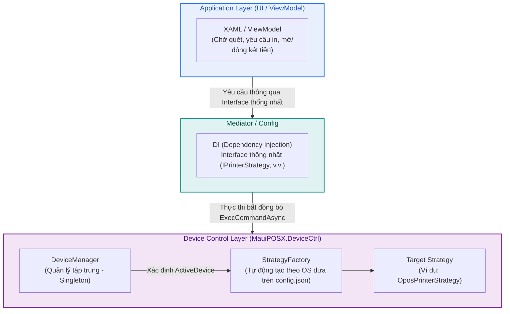

# Hệ thống POS thế hệ mới: Thiết kế kiến trúc cơ bản
**Phạm vi đối tượng:** Lớp điều khiển thiết bị (Device Control Layer) và Kiến trúc kết nối phần cứng liên quan

> **Mục đích của tài liệu**
> Tài liệu thiết kế này chi tiết hóa "Đề xuất kiến trúc" đã trình bày cho khách hàng, thể hiện **thiết kế kiến trúc toàn diện và mang tính khái quát** phù hợp với cấu trúc của mã nguồn hiện tại (nền tảng C# / .NET MAUI).
> Dựa trên các yêu cầu đã chỉ định, tài liệu này lược bớt phần mô tả logic nghiệp vụ của Presentation Layer để tập trung vào vai trò và chức năng của **"toàn bộ cấu trúc các class thiết bị được định nghĩa trong mã nguồn"** cũng như **"cơ chế giám sát vận hành và quản lý dữ liệu"** để mô tả bức tranh tổng thể.

---

## Mục lục

- [Hệ thống POS thế hệ mới: Thiết kế kiến trúc cơ bản](#hệ-thống-pos-thế-hệ-mới-thiết-kế-kiến-trúc-cơ-bản)
  - [Mục lục](#mục-luc)
  - [1. Định hướng kiến trúc cơ bản (Cấu trúc Native .NET MAUI)](#1-định-hướng-kiến-trúc-cơ-bản-cấu-trúc-native-net-maui)
  - [2. Kiến trúc chi tiết và toàn diện của Lớp điều khiển thiết bị (Device Control Layer)](#2-kiến-trúc-chi-tiết-và-toàn-diện-của-lớp-điều-khiển-thiết-bị-device-control-layer)
    - [2.1 Toàn bộ 7 loại interface thiết bị được triển khai trong mã nguồn](#21-toàn-bộ-7-loại-interface-thiết-bị-được-triển-khai-trong-mã-nguồn)
    - [2.2 Danh sách tất cả Strategy platform đã triển khai (Bao phủ nền tảng code)](#22-danh-sách-tất-cả-strategy-platform-đã-triển-khai-bao-phủ-nền-tảng-code)
  - [3. Giao tiếp giữa các Layer và Routing động của file cấu hình (config.json)](#3-giao-tiếp-giữa-các-layer-và-routing-động-của-file-cấu-hình-configjson)
  - [4. Cơ chế quản lý và khởi tạo thiết bị (Manager / Factory Pattern)](#4-cơ-chế-quản-lý-và-khởi-tạo-thiết-bị-manager--factory-pattern)
    - [4.1 Trình quản lý thiết bị (DeviceManager)](#41-trình-quản-lý-thiết-bị-devicemanager)
    - [4.2 Factory khởi tạo Strategy (StrategyFactory)](#42-factory-khởi-tạo-strategy-strategyfactory)
  - [5. Mô hình thiết lập môi trường tích hợp (Kiến trúc cấu hình 3 lớp)](#5-mô-hình-thiết-lập-môi-trường-tích-hợp-kiến-trúc-cấu-hình-3-lớp)
  - [6. Luồng điều khiển thiết bị tiêu chuẩn của phần cứng chính](#6-luồng-điều-khiển-thiết-bị-tiêu-chuẩn-của-phần-cứng-chính)

---

## 1. Định hướng kiến trúc cơ bản (Cấu trúc Native .NET MAUI)

Hệ thống này áp dụng **kiến trúc Native .NET MAUI** để hỗ trợ Windows / iOS / Android trên một cơ sở mã nguồn duy nhất (C#). Nó đã được cải tiến tinh gọn hơn so với cấu trúc cũ vào tháng 12, giúp tăng tính lỏng lẻo (loose coupling) và khả năng mở rộng của mã nguồn.

- **Tách biệt rõ ràng giữa Giao diện và Logic**: 
  UI được xây dựng bằng XAML, còn logic nghiệp vụ được quản lý bằng ViewModel (mô hình MVVM).
- **UI Layer độc lập thiết bị**:
  Application Layer không chứa bất kỳ tham chiếu cụ thể nào đến các thiết bị đặc thù (ví dụ: Epson SDK, Windows OPOS), giúp giảm thiểu tối đa phạm vi ảnh hưởng khi có thay đổi.
- **Áp dụng toàn diện DI (Dependency Injection)**:
  Được thiết kế để đăng ký và giải quyết (resolve) các interface trong `MauiProgram.cs`.

---

## 2. Kiến trúc chi tiết và toàn diện của Lớp điều khiển thiết bị (Device Control Layer)

Bằng cách tải toàn bộ mã nguồn hiện tại của layer `MauiPOSX.DeviceCtrl`, cơ chế liên kết phần cứng đã được ánh xạ đầy đủ. Dưới đây là sơ đồ kiến trúc thể hiện toàn bộ luồng từ yêu cầu của Application Layer đến việc điều khiển thiết bị thực tế.

```mermaid
flowchart LR
    subgraph DeviceControl["Device Control Layer (Lớp điều khiển thiết bị)"]
        direction TB
        DM["DeviceManager<br>(Quản lý thiết bị tập trung)"]
        
        subgraph IFs["Nhóm các Interface trừu tượng"]
            direction TB
            PR[IPrinterStrategy]
            SC[IBarcodeScannerStrategy]
            CH[ICashChangerStrategy]
            DP[ICustomerDisplayStrategy]
            DR[IDrawerStrategy]
            KB[IKeyboardStrategy]
            PY[IPaymentStrategy]
        end
        
        DM -->|Phân phối yêu cầu điều khiển nghiệp vụ| IFs
        
        subgraph Platforms["Hạ tầng giao tiếp & thực thi đặc thù của OS"]
            direction TB
            Win[Windows<br>OPOS / Serial]
            iOS[iOS<br>TCP Hub / SDK]
            And[Android<br>TCP Hub / BT / SDK]
        end
        
        IFs -.->|Chuyển đổi xử lý động<br>dựa trên file cấu hình| Platforms
    end
    
    Platforms ==>|Gửi lệnh điều khiển thiết bị thực tế<br>dựa trên từng giao thức| HW["Phần cứng thiết bị ngoại vi"]

    style DM fill:#ede7f6,stroke:#7b1fa2,stroke-width:2px,color:#4a148c
    style IFs fill:#e0f2f1,stroke:#00897b,stroke-width:2px,color:#004d40
    style Platforms fill:#fffde7,stroke:#f9a825,stroke-width:2px,color:#f57f17
    style HW fill:#e8f5e9,stroke:#2e7d32,stroke-width:2px,color:#1b5e20
```

### 2.1 Toàn bộ 7 loại interface thiết bị được triển khai trong mã nguồn

Để bao phủ hoàn toàn các thiết bị ngoại vi cần thiết trong nghiệp vụ POS thực tế, **7 interface chiến lược cốt lõi (Interfaces)** đã được định nghĩa. Application Layer chỉ thao tác với các thiết bị thông qua các interface này.

| Tên Interface | Đối tượng điều khiển | Vai trò & Chức năng chính (Mức thiết kế cơ bản) |
| -------------------------- | ---------------------------- | ------------------------------------------------------------------ |
| `IPrinterStrategy` | Máy in hóa đơn & nhật ký (journal) | In dữ liệu hóa đơn, điều khiển in văn bản và hình ảnh |
| `IBarcodeScannerStrategy` | Máy quét mã vạch & QR | Đọc mã vạch/mã QR, chờ và thông báo khi nhận dữ liệu |
| `ICashChangerStrategy` | Máy thối tiền tự động (Glory RT-300, v.v.) | Khởi động thiết bị, bắt đầu nhận tiền, xác nhận giao dịch, thối tiền, điều khiển thu hồi tiền doanh thu |
| `ICustomerDisplayStrategy` | Màn hình phụ phía khách hàng | Hiển thị văn bản thông tin mua hàng, xóa màn hình, điều khiển bảng chữ chạy (chữ cuộn), v.v. |
| `IDrawerStrategy` | Két tiền (Cash Drawer) | Điều khiển mở két tiền (két sắt) |
| `IKeyboardStrategy` | Bàn phím vật lý chuyên dụng POS | Phát hiện và bắt sự kiện (hook) phím nhập đặc thù của POS |
| `IPaymentStrategy` | Thiết bị thanh toán ngoài (CAFIS Arch, v.v.) | Yêu cầu thanh toán thẻ/ví điện tử, nhận kết quả hoàn thành thanh toán, điều khiển hủy giao dịch |

### 2.2 Danh sách tất cả Strategy platform đã triển khai (Bao phủ nền tảng code)

Thông qua mô hình `DeviceManager` và `StrategyFactory`, các class điều khiển đặc thù cho từng OS dưới đây sẽ được khởi tạo dynamic tùy theo cấu hình. Đây là danh sách đầy đủ tất cả các class Strategy đã được triển khai trong mã nguồn.

| Đối tượng điều khiển | Windows (OPOS / Serial) | iOS (TCP Hub / SDK) | Android (TCP Hub / SDK / BT) |
| ------------------- | -------------------------------------------------------- | --------------------------------------------------------- | ------------------------------------------------------------------------------ |
| **Printer** | `OposPrinterStrategy` | `IosPrinterStrategy` `IosEpsonPrinterStrategy` | `AndroidPrinterStrategy` `AndroidBluetoothPrinterStrategy` |
| **Scanner** | `OposScannerStrategy` | `IOSCameraBarcodeScannerStrategy` | `AndroidCameraBarcodeScannerStrategy` |
| **CashChanger** | `OposCashChangerStrategy` `SerialCashChangerStrategy` | `IosCashChangerStrategy` | `AndroidCashChangerStrategy` |
| **CustomerDisplay** | `OposCustomerDisplayStrategy` | `IOSCustomerDisplayStrategy` `IOSEpsonCustomerDisplay` | `AndroidCustomerDisplayStrategy` `AndroidEpsonDM70DCustomerDisplayStrategy` |
| **Drawer** | `OposDrawerStrategy` `OposSharpDrawerStrategy` | `IOSEpsonDrawerStrategy` | `AndroidEpsonDrawerStrategy` |
| **Keyboard** | `OposKeyboardStrategy` | - | - |
| **Payment** | `OposCafisArchPaymentStrategy` | - | - |

---

## 3. Giao tiếp giữa các Layer và Routing động của file cấu hình (config.json)

Sơ đồ dưới đây minh họa luồng kết nối từ Application Layer đến Device Layer, và cách các Strategy trên được quyết định:

Trong file `config.json`, phần `activeDevices` sẽ xác định ID thiết bị phù hợp với **môi trường OS hiện tại** (ví dụ: `printer_sharp_opos_windows`). Từ đó, hệ thống xác định `strategyClass` tương ứng và chuyển cho `StrategyFactory`. Cơ chế này giúp hiện thực hóa hoạt động dynamic mà không cần biên dịch lại mã nguồn.

---

## 4. Cơ chế quản lý và khởi tạo thiết bị (Manager / Factory Pattern)

Bên trong lớp điều khiển thiết bị, vòng đời và trách nhiệm khởi tạo class được phân tách độc lập nhằm cung cấp một hạ tầng vận hành nhất quán.

### 4.1 Trình quản lý thiết bị (DeviceManager)
Tồn tại duy nhất trong hệ thống (Singleton), chịu trách nhiệm điều phối việc đọc dữ liệu cấu hình của toàn bộ thiết bị và quản lý trạng thái nội bộ (caching, v.v.) của các cụ thể Strategy đã được tạo (các class điều khiển theo từng platform). Đây là cổng giao tiếp cung cấp một cách minh bạch trạng thái của thiết bị cho UI architecture như "máy quét nào đang hoạt động", "máy in có đang kết nối không".

### 4.2 Factory khởi tạo Strategy (StrategyFactory)
Đối chiếu nội dung của file cấu hình với OS thực thi hiện tại (Windows / iOS / Android) để khởi tạo (tạo instance) dynamic class điều khiển phần cứng phù hợp. Ví dụ: nếu nhận diện môi trường Windows, hệ thống sẽ tự động gán và giải quyết class giao tiếp dựa trên `OPOS`; nếu là iOS, hệ thống sẽ gán class chuyên dụng cho iOS thông qua `TCP Hub / SDK`.

---

## 5. Mô hình thiết lập môi trường tích hợp (Kiến trúc cấu hình 3 lớp)

Để tránh việc phải build lại ứng dụng khi thay đổi cấu hình phần cứng hoặc thay thế thiết bị ngoại vi, hệ thống áp dụng mô hình quản lý tập trung bằng file cấu hình.

Các thiết bị riêng lẻ được mô hình hóa rõ ràng theo **cấu trúc 3 lớp (Identity / Connection / Config)** dưới đây:
1. **Identity (Lớp định danh)**: Định nghĩa ID duy nhất để xác định thiết bị trong ứng dụng và quy trình xử lý cụ thể đi kèm.
2. **Connection (Lớp kết nối)**: Chỉ định nghĩa các thiết lập đường truyền/kết nối vật lý như địa chỉ IP, số cổng COM, địa chỉ Bluetooth MAC, v.v.
3. **Config (Lớp cấu hình đặc thù)**: Định nghĩa các tham số đặc trưng của thiết bị như ngôn ngữ hiển thị áp dụng, thiết lập độ rộng đặc thù của máy in, v.v.

Với cách tiếp cận thiết kế này, đối với các yêu cầu thực tế tại cửa hàng như "thay thế máy thối tiền giao tiếp Serial bằng máy thối tiền thế hệ mới kết nối mạng", chúng ta chỉ cần thay đổi giá trị trong lớp Connection của file cấu hình là hệ thống có thể hoạt động ngay lập tức.

---

## 6. Luồng điều khiển thiết bị tiêu chuẩn của phần cứng chính

Quy trình điều khiển đối với các phần cứng chủ chốt được triển khai sao cho không bị phụ thuộc vào một nhà sản xuất hay giao thức vật lý cụ thể nào. Chúng được chuẩn hóa và tái định nghĩa trong mỗi interface dưới dạng một vòng đời trừu tượng như sau:

**① Máy thối tiền tự động (Cash Changer)**
Điều khiển an toàn các luồng nghiệp vụ quan trọng liên quan đến việc nạp/rút tiền mặt vật lý và tính toán số dư chính xác.
1. **Khởi tạo và reset trạng thái**: Xóa các trạng thái chưa hoàn thành của giao dịch trước đó hoặc lỗi phần cứng, reset cơ chế nạp/rút về trạng thái chờ.
2. **Cho phép nạp tiền (giám sát bất đồng bộ)**: Mở khóa vật lý khay nạp tiền, liên tục thu thập và tổng hợp tổng số tiền gồm tiền giấy/tiền xu đã được nạp một cách bất đồng bộ, sau đó thông báo theo thời gian thực (real-time) cho giao diện UI.
3. **Xác nhận nạp tiền và tính toán**: Đối chiếu số tiền thực nạp với số tiền giao dịch yêu cầu từ ứng dụng (business logic) để tính toán số tiền cần thối.
4. **Thực thi thối tiền và đóng giao dịch**: Gửi lệnh thối tiền (payout) vật lý đến phần cứng. Sau khi nhận được phản hồi hoàn thành thối tiền, khay nạp sẽ bị khóa lại để kết thúc giao dịch một cách an toàn.

**② Máy in hóa đơn (Printer)**
Áp dụng luồng lưu đệm một lần (buffering) và giải phóng tài nguyên lập tức để đối phó với các sự cố mất mạng hoặc hết giấy.
1. **Xây dựng dữ liệu ảo**: Tạo layout in hóa đơn bao gồm chuỗi ký tự, các định dạng trang trí như chữ đậm/cỡ chữ lớn, các hình ảnh (logo), barcode, QR code trên một bộ đệm ảo (virtual buffer) trong bộ nhớ.
2. **Thiết lập kết nối**: Chỉ thiết lập kết nối (Claim/Enable) với thiết bị qua cổng Serial, TCP/IP hoặc Bluetooth ngay trước thời điểm thực hiện in.
3. **Gửi hàng loạt và điều khiển dao cắt**: Gom các lệnh đã được đệm thành một hàng đợi (queue) để thực hiện gửi dữ liệu in một lần duy nhất. Ngay sau đó, gửi lệnh cắt giấy tự động.
4. **Giải phóng tài nguyên chắc chắn**: Ngay khi in xong, giải phóng an toàn tài nguyên mạng và trạng thái kết nối để tránh việc chiếm dụng thiết bị.

**③ Máy quét mã vạch (Barcode Scanner)**
Áp dụng kiến trúc hướng sự kiện (Event-Driven) để thực hiện đọc bất đồng bộ mà không gây nghẽn luồng xử lý UI (UI thread).
1. **Đăng ký sự kiện và điều khiển độc quyền**: Kích hoạt cơ chế bắt sự kiện đọc của thiết bị (Enable) tại màn hình chờ quét sản phẩm, đồng thời lấy quyền độc quyền nhập liệu (Claim) cho ứng dụng.
2. **Callback bất đồng bộ**: Ngay khi sự kiện quét mã vạch vật lý xảy ra và dữ liệu được giải mã (decode), dữ liệu sẽ được nhanh chóng truyền đến hàng đợi của hệ thống thông qua cơ chế event hook.
3. **Xóa bộ đệm dữ liệu**: Ngay sau khi truyền dữ liệu thực tế lên Application Layer, bộ đệm dữ liệu đọc nội bộ sẽ tự động được xóa sạch để chuẩn bị cho lần quét liên tục tiếp theo.

**④ Bàn phím vật lý POS (Keyboard)**
Mô phỏng và quản lý môi trường nhập liệu đặc thù của POS ở tầng phần mềm, khác với bàn phím PC thông thường.
1. **Kích hoạt hook phím**: Chuyển sang trạng thái giám sát các sự kiện ngắt phần cứng của các phím nghiệp vụ đặc thù của POS (phím Tiểu kế, phím Hiện kế, phím Clear, v.v.).
2. **Đánh chặn nhập liệu (Intercept)**: Khi có phím đặc biệt được nhấn, hệ thống sẽ đánh chặn (vô hiệu hóa) để ngăn nó được xử lý như một phím nhập văn bản tiêu chuẩn của OS.
3. **Dịch sang lệnh tương ứng**: Dịch phím vật lý đã đánh chặn trực tiếp thành các lệnh cụ thể của ứng dụng POS (chẳng hạn như kích hoạt xử lý thanh toán) thông qua sự kiện chuyên dụng và gửi đi.

**⑤ Màn hình phụ phía khách hàng (Customer Display)**
Truyền tải dữ liệu văn bản gọn nhẹ và tốc độ cao để hiển thị thông tin thời gian thực cho khách hàng.
1. **Xóa màn hình và khởi hoạt**: Xóa an toàn dữ liệu giao dịch cũ, đưa màn hình về trạng thái ban đầu và di chuyển con trỏ ảo của bảng hiển thị về vị trí Home (góc trên cùng bên trái).
2. **Vẽ layout động và truyền tải**: Truyền dữ liệu chuỗi ký tự (như tên sản phẩm, trạng thái số tiền, v.v.) sau khi đã định vị con trỏ trên màn hình vật lý 2 dòng hoặc 4 dòng. Khi số tiền thay đổi, hệ thống chỉ ghi đè lên dòng tương ứng để cập nhật hiển thị tốc độ cao.

**⑥ Thiết bị thanh toán ngoài (Payment Terminal / CAFIS Arch)**
Thực hiện trao đổi thông tin thanh toán có tính bảo mật cao dưới sự quản lý nghiêm ngặt về trạng thái (state).
1. **Kết nối trước và kiểm tra thông suốt**: Mở kết nối giao tiếp với thiết bị thanh toán trước khi bắt đầu thanh toán, thực hiện kiểm tra kết nối (lệnh heartbeat/疎通確認) để xác nhận thiết bị phản hồi bình thường.
2. **Yêu cầu thanh toán mã hóa**: Gửi dữ liệu cấu trúc chứa thông tin thanh toán (số tiền giao dịch, phương thức thanh toán chỉ định) từ ứng dụng, đồng thời bắt sự kiện chờ khách hàng thao tác thẻ hoặc nhập mã PIN trên thiết bị.
3. **Nhận kết quả và xác nhận giao dịch**: Nhận phản hồi bất đồng bộ về kết quả giao dịch từ thiết bị (thành công, thất bại hoặc hủy bỏ).
4. **In lại hóa đơn và đóng kết nối**: Phát lệnh in lại hóa đơn biên lai của thiết bị thanh toán nếu cần, sau đó đóng kết nối cổng giao tiếp một cách an toàn để kết thúc luồng thanh toán.

---

> **Tóm tắt:**
> Hệ thống loại bỏ hoàn toàn sự phụ thuộc trực tiếp từ Presentation Layer vào phần cứng, ủy thác xử lý cho lớp điều khiển thiết bị (Device Control Layer) thông qua các interface trừu tượng. Hơn nữa, tính linh hoạt và khả năng mở rộng tối đa của hạ tầng phần cứng được hiện thực hóa nhờ cơ chế routing động sử dụng mô hình thiết lập môi trường tích hợp (cấu trúc 3 lớp) kết hợp với Manager / Factory Pattern. Đây chính là điểm mạnh lớn nhất của kiến trúc điều khiển thiết bị vững chắc trong hệ thống POS này.
