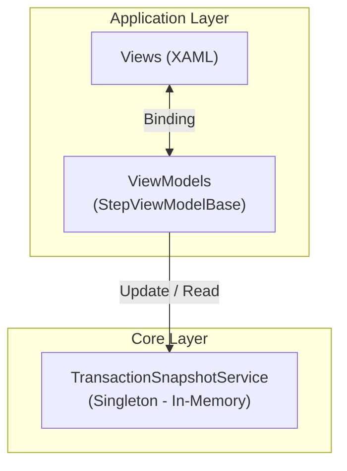

# State Management — POS MAUI Mobile App (In-Memory)

---

## 1. Vấn đề

Chuyển màn hình (Màn hình 1 → 2 → 3) → dữ liệu đã nhập bị mất vì dữ liệu gắn với lifecycle của View/Page.

---

## 2. Giải pháp

Dùng **Singleton service** (`TransactionSnapshotService`) giữ `TransactionSnapshotData` trong RAM. ViewModel đọc/ghi qua service này thay vì giữ data trong chính nó.

```
MH1 (nhập) → Lưu vào Singleton → Chuyển MH2
MH2 (nhập) → Cập nhật Singleton → Dữ liệu MH1 vẫn giữ → Chuyển MH3
Quay lại MH1 hoặc MH2 → Đọc từ Singleton → Dữ liệu còn đầy đủ
```

---

## 3. Kiến trúc



- ViewModel **không giữ master data**, chỉ giữ bản sao cục bộ để bind UI
- Khi rời màn hình → ghi property vào Singleton
- Khi vào màn hình → đọc property từ Singleton

---

## 4. Cơ chế [PersistSnapshot] — Opt-in

### Nguyên tắc

- Mặc định **KHÔNG lưu** bất kỳ property nào
- Chỉ property có `[PersistSnapshot]` mới được lưu vào snapshot

### Ví dụ ViewModel

```csharp
[ObservableProperty]
[PersistSnapshot]  // ← Lưu vào snapshot
private string _customerSearchValue = string.Empty;

[ObservableProperty]
[PersistSnapshot]  // ← Lưu vào snapshot
private decimal _totalAmount;

[ObservableProperty]  // ← KHÔNG lưu
private string _password = string.Empty;

[ObservableProperty]  // ← KHÔNG lưu
private bool _isLoading;
```

### Lifecycle

| Thời điểm | Hành động | Method |
|---|---|---|
| Rời màn hình (`OnNavigatedFrom`) | Ghi property có `[PersistSnapshot]` vào ViewModelSnapshots | `SavePropertiesToSnapshot()` |
| Vào màn hình (`OnStepNavigatedTo`) | Đọc property từ ViewModelSnapshots | `RestorePropertiesFromSnapshot()` |

---

## 5. Các bước triển khai

### Bước 1: Tạo Attribute

```csharp
[AttributeUsage(AttributeTargets.Property)]
public sealed class PersistSnapshotAttribute : Attribute { }
```

### Bước 2: Thêm ViewModelSnapshots vào TransactionSnapshotData

```csharp
public Dictionary<string, Dictionary<string, object>> ViewModelSnapshots { get; set; } = new();
```

### Bước 3: Triển khai trong StepViewModelBase

- `OnNavigatedFrom` → gọi `SavePropertiesToSnapshot()`
  - Reflection lọc property có `PersistSnapshotAttribute`
  - Ghi vào `ViewModelSnapshots[ViewModelTypeName]`
- `OnStepNavigatedTo` → gọi `RestorePropertiesFromSnapshot()`
  - Đọc từ `ViewModelSnapshots[ViewModelTypeName]`
  - Xử lý `JsonElement` bằng `is JsonElement`

### Bước 4: Đánh [PersistSnapshot] trong các ViewModel con

Mỗi ViewModel kế thừa `StepViewModelBase` chỉ cần đánh `[PersistSnapshot]` lên property cần giữ. Không cần override gì thêm.

---

## 6. Lưu ý

| Vấn đề | Giải pháp |
|---|---|
| Reflection mỗi lần chuyển màn hình | Cache `PropertyInfo[]` per ViewModel type (static dictionary) |
| App crash / OS kill → mất hết | Chấp nhận ở phase này. Phase sau thêm SQLite persistence |
| Thread safety (Singleton từ nhiều ViewModel) | `lock` hoặc `ConcurrentDictionary` cho ViewModelSnapshots |

---

## 7. Mở rộng sau (Phase 2)

Khi cần chịu crash/mất điện, thêm `TransactionSnapshotPersistenceService` để serialize `TransactionSnapshotData` → JSON → SQLite. Kiến trúc Singleton hiện tại không cần thay đổi, chỉ thêm layer persistence phía dưới.