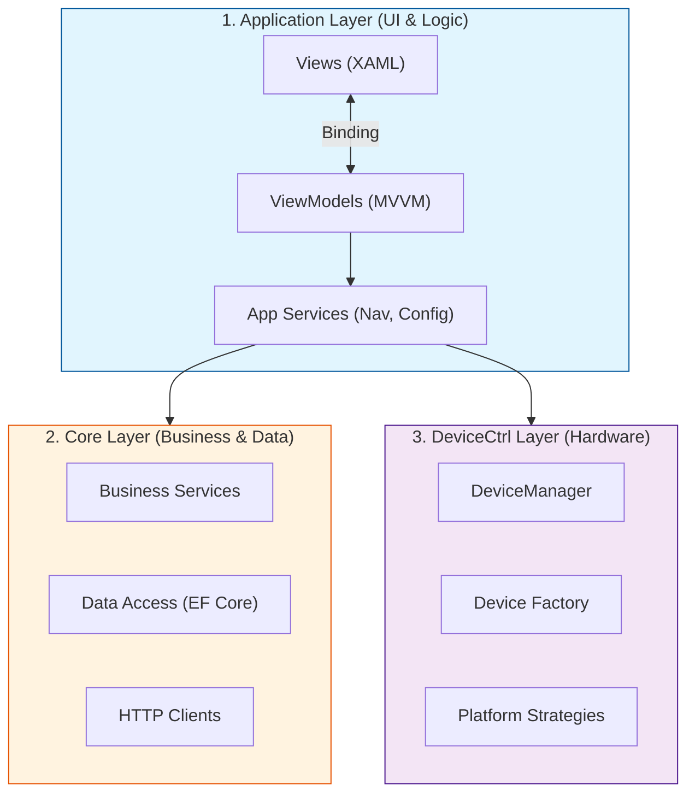
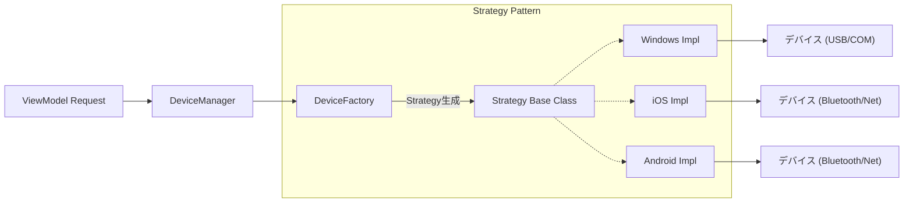

# MauiPOSX システムアーキテクチャ資料

## 1. 概要

**MauiPOSX**は、**.NET MAUI**をベースに構築されたクロスプラットフォームPOSアプリケーションで、周辺機器（プリンター、スキャナー、キャッシュドロワー、カスタマーディスプレイ、MSR）の制御に特化している。

システムは**3層アーキテクチャ（3-Layer Architecture）**に準拠し、以下のコア原則に従う：

* **Separation of Concerns:** 責務の明確な分離
* **MVVM Pattern:** UI層とロジック層の分離
* **Strategy & Factory Pattern:** 各OS（Windows、iOS、Android）における機器制御の多態化

---

## 2. システム概要

システムは縦方向に連携する3つの主要層で構成される：

| 層（Layer） | 主な責務 | 代表的なコンポーネント |
| --- | --- | --- |
| **1. Application** | UI、ナビゲーション、デバイス設定 | Views、ViewModels、NavigationService |
| **2. Core** | ビジネスロジック、データアクセス、API連携 | Repositories、DbContext、API Clients |
| **3. DeviceCtrl** | ハードウェア制御のクロスプラットフォーム抽象化 | DeviceManager、Strategy Pattern、XML Commands |

---

## 3. Application Layer（UI・アプリケーションロジック）

この層は**MVVM（Model-View-ViewModel）**を徹底的に適用し、テスタビリティを確保する。

### MVVM構造

* **Views (XAML):**
  * メインページ（`MainPage`）および各デバイステストページ（Printer、Scanner、CashChanger Test Pages等）
  * UIのみを含み、ビジネスロジックは含まない

* **ViewModels:**
  * `ObservableObject`（CommunityToolkit.Mvvm）を継承
  * Property（`[ObservableProperty]`）とCommand（`[RelayCommand]`）を自動生成
  * 表示ロジックを処理し、Serviceを呼び出す

* **Services:**
  * **NavigationService:** ページ遷移管理
  * **DeviceConfigService:** デバイス設定の読み書き（JSON）
  * **InAppNotificationService:** 通知表示

---

## 4. Core Layer（ビジネス・データ）

この層はUIから独立し、再利用可能なコアロジックを含む。

* **Business Services:** メインビジネスロジック処理（例：`TodoService`）
* **Data Access (EF Core):**
  * **Repository Pattern**でクエリを抽象化
  * **ApplicationDbContext:** SQLite接続管理、Entity設定、Migrations

* **HTTP Clients:**
  * **Resilience Handler**（Polly）を統合し、ネットワーク不安定時のリトライやサーキットブレーカーを自動実行

---

## 5. DeviceCtrl Layer（デバイス制御）

クロスプラットフォーム処理における最重要層。**Strategy Pattern**により、アプリケーションはWindows、iOS、Androidのどれで動作しているか意識する必要がない。

### 制御アーキテクチャ（Strategy & Factory Flow）

### コアコンポーネント

1. **DeviceManager (Singleton):**
   * Configから読み込んだデバイス一覧を管理
   * Application層の唯一のアクセスポイント

2. **Strategy Pattern（多態性）:**
   * **Base Classes:** `PrinterStrategyBase`、`ScannerStrategyBase`等（`Print`、`Scan`等の共通関数を定義）
   * **Platform Implementation:** `WindowsOposPrinterStrategy`、`IOSBluetoothPrinterStrategy`等（各OS固有の実装）

3. **DeviceFactory:**
   * 設定（config.json）と現在のOSに基づき、適切なStrategy classを自動選択・生成

4. **XML Commands:**
   * Socket/TCP経由で送信するデバイス制御コマンドをXML形式で構築し、プロトコルの標準化を実現

---

## 6. データフロー

例：ユーザーが**「レシート印刷」**ボタンを押下した場合：

1. **User Action:** ユーザーが`PrinterTestPage`でボタン押下
2. **Command:** `PrinterTestViewModel`がコマンド受信
3. **Config:** ViewModelが`DeviceConfigService`からデバイス情報を取得
4. **Manager:** `DeviceManager.CreateStrategy(device)`を呼び出し
5. **Factory:** `DeviceFactory`がOS（例：Windows）に基づき`WindowsOposPrinterStrategy`を生成
6. **Execution:** ViewModelが`.Print()`関数を呼び出し、Strategyがハードウェアにコマンド送信
7. **Feedback:** 結果がViewModelに返却 → UIに通知を更新

---

## 7. 主要なデザインパターン

「クリーン」で保守しやすいコードを実現するために使用される技術の概要：

| Pattern | 適用箇所 | 目的 |
| --- | --- | --- |
| **MVVM** | Application | UIと処理コードの分離 |
| **Dependency Injection (DI)** | システム全体 | 強い依存関係の削減、置換・テストの容易化 |
| **Singleton** | DeviceManager | 唯一のデバイス管理インスタンスを保証 |
| **Strategy** | DeviceCtrl | OSに応じたデバイス制御ロジックの柔軟な切り替え |
| **Factory** | DeviceCtrl | 複雑なStrategyオブジェクトの自動生成 |
| **Repository** | Core | データベースクエリの複雑性を隠蔽 |

---

### 依存関係のルール

1. **Application**は**Core**および**DeviceCtrl**に依存
2. **Core**は独立し、UIやDeviceCtrlに依存しない（基本Modelを除く）
3. **DeviceCtrl**は独立し、ハードウェアロジックを個別に保持
