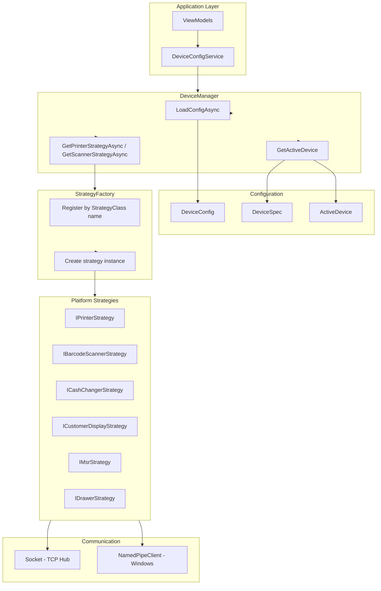
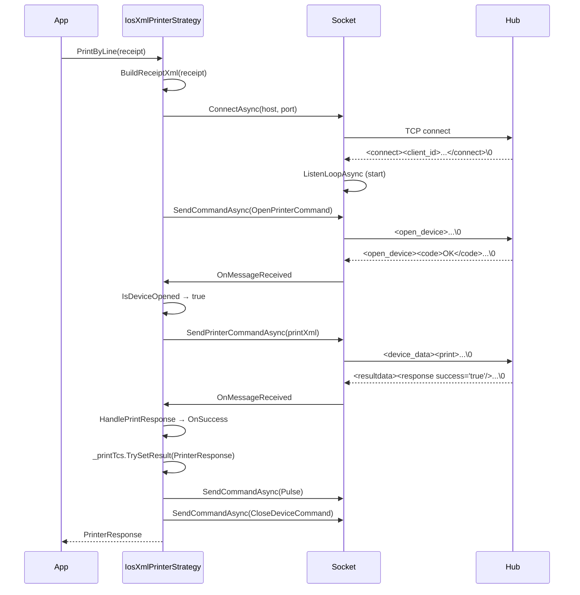
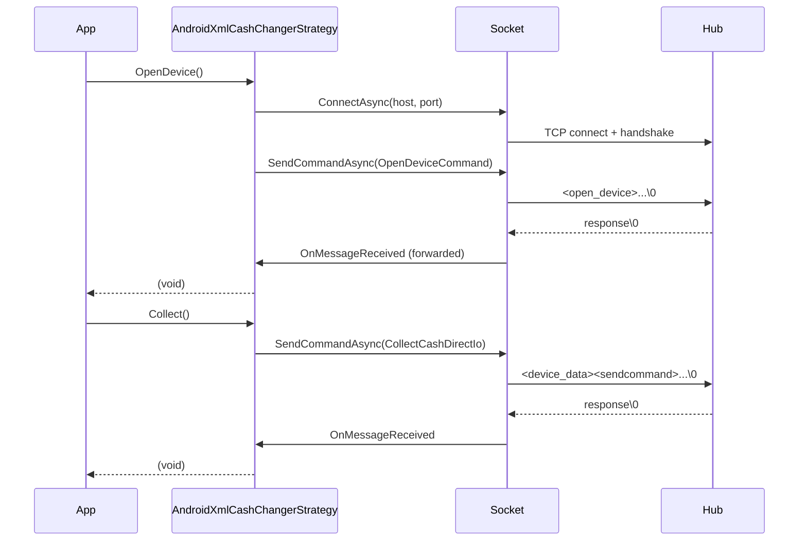

# MauiPOSX.DeviceCtrl - Detailed Design Document

## Table of Contents

1. [Overview](#1-overview)
2. [Architecture](#2-architecture)
3. [Core Components](#3-core-components)
4. [Models](#4-models)
5. [Interfaces](#5-interfaces)
6. [Strategy Base Classes](#6-strategy-base-classes)
7. [Platform Strategies](#7-platform-strategies)
8. [Communication](#8-communication)
9. [Configuration](#9-configuration)
10. [Strategy Registration](#10-strategy-registration-devicemanager)
11. [Data Flow Examples](#11-data-flow-examples)
12. [Enums Reference](#12-enums-reference)
13. [Sequence Diagrams](#13-sequence-diagrams)
14. [File Inventory](#14-file-inventory-complete)
15. [Error Handling and Lifecycle](#15-error-handling-and-lifecycle)
16. [Extension Guide](#16-extension-guide)

---

## 1. Overview

**MauiPOSX.DeviceCtrl** is the hardware control layer of the MauiPOSX POS application. It provides a cross-platform abstraction for controlling peripheral devices (printer, scanner, cash changer, customer display, MSR, drawer) across **Windows**, **iOS**, and **Android**.

### 1.1 Design Principles

| Principle | Description |
|-----------|-------------|
| **Strategy Pattern** | Each device type has an interface; platform-specific implementations are swappable |
| **Factory Pattern** | `StrategyFactory` and `DeviceFactory` create strategies by name from config |
| **Configuration-Driven** | Device selection and strategy mapping come from `config.json` |
| **Single Responsibility** | Each strategy handles one device type on one platform |

### 1.2 Supported Device Types

| Type | Description | Connection Types |
|------|-------------|------------------|
| **printer** | Receipt printer (Epson, Sharp) | Bluetooth, Serial, TCP/XML Hub |
| **scanner** | Barcode scanner | Camera, USB (Denso Handy) |
| **cash_changer** | Cash recycler (Glory RT-300) | COM, TCP/XML Hub |
| **customer_display** | Customer-facing display | USB/OPOS, Bluetooth, TCP/XML Hub |
| **msr** | Magnetic stripe reader (CAFIS/NTT) | TCP/LAN |
| **drawer** | Cash drawer | Pulse via printer |

### 1.3 Dependencies

| Package | Purpose |
|---------|---------|
| Newtonsoft.Json | Config deserialization |
| Microsoft.Maui.* | FileSystem, platform detection |
| Epos2iOS / Epos2Android | Native Epson SDK bindings (platform-specific) |

---

## 2. Architecture

### 2.1 High-Level Structure

```
MauiPOSX.DeviceCtrl/
├── DeviceManager.cs          # Singleton: config load, active device resolution, strategy access
├── Configuration/             # Device list parsing
├── Communication/             # TCP Socket for XML Hub
├── Factory/                   # StrategyFactory, DeviceFactoryBase
├── Interfaces/                # IPrinterStrategy, ICashChangerStrategy, etc.
├── Models/                    # DeviceSpec, DeviceConfig, Receipt, etc.
├── StrategyBase/              # DeviceStrategyBase, *StrategyBase
├── XmlCommand/                # XML command templates (EPOS, cash changer)
├── Platforms/
│   ├── Windows/               # OPOS, NamedPipe, Serial strategies
│   ├── iOS/                   # Epson SDK, XML Hub, Camera strategies
│   └── Android/               # Epson SDK, XML Hub, Camera strategies
└── Enums/                     # Device enums
```

### 2.2 Component Diagram



---

## 3. Core Components

### 3.1 DeviceManager

**Location:** `DeviceManager.cs`

**Responsibility:** Central entry point for device control. Loads config, resolves active device by OS, and provides strategy instances.

| Method | Description |
|--------|-------------|
| `LoadConfigAsync()` | Loads `config.json` from app package |
| `InitializeFromConfig(DeviceConfig)` | Initializes device list from config |
| `GetActiveDevice(devices, activeDevices, type, os)` | Resolves which device is active for given type and OS |
| `GetPrinterStrategyAsync()` | Returns `IPrinterStrategy` for active printer |
| `GetScannerStrategyAsync()` | Returns `IBarcodeScannerStrategy` for active scanner |
| `RegisterDeviceStrategy()` | Registers all strategies with `StrategyFactory` (per platform) |

**Active Device Resolution Logic:**
1. Get `activeDevices.{type}` (e.g. `printer`, `scanner`)
2. Filter entries by current OS (`ios`, `android`, `windows`)
3. Extract active device IDs from filtered entries
4. Find first device in `devices` where: `Type == type`, `Id` in activeIds, `OS == os`

### 3.2 StrategyFactory

**Location:** `Factory/StrategyFactory.cs`

**Responsibility:** Creates strategy instances by class name. Used by `DeviceManager` when returning strategies.

```csharp
StrategyFactory<IPrinterStrategy>.Register<IosBluetoothPrinterStrategy>("IosBluetoothPrinterStrategy");
var strategy = StrategyFactory<IPrinterStrategy>.Create(device.StrategyClass, device);
```

- **Register&lt;T&gt;(name):** Maps `name` to strategy type `T`
  - If `T` has static `InitInstance(DeviceSpec)` returning `T`: use that (singleton/cached per device via `DeviceManager.GetOrCreateStrategy`)
  - Else: `Activator.CreateInstance(type)` + `InitInstance(device)` on instance
- **Create(name, device):** Looks up creator; throws if `name` not registered

**Note:** When strategy has static `InitInstance(DeviceSpec)`, StrategyFactory invokes it; that typically calls `DeviceManager.GetOrCreateStrategy<T>(device)`, which caches by `typeof(T)` (one instance per strategy type per app).

### 3.3 DeviceFactoryBase / DeviceFactory

**Location:** `Factory/DeviceFactoryBase.cs`, `Platforms/{OS}/DeviceFactory.cs`

**Responsibility:** Platform-specific factory that creates strategies by `StrategyClass`. Used when `StrategyFactory` is not used (e.g. direct device creation).

Each platform implements:
- `CreatePrinterStrategy(device)`
- `CreateScannerStrategy(device)`
- `CreateCashChangerStrategy(device)`
- `CreateCustomerDisplayStrategy(device)`
- `CreateMsrStrategy(device)`
- `CreateKeyboardStrategy(device)` (not implemented)

---

## 4. Models

### 4.1 DeviceSpec

**Location:** `Models/DeviceSpec.cs`

Describes a single device configuration.

| Property | Type | JSON Key | Description |
|----------|------|----------|-------------|
| `Id` | string | id | Unique identifier (snake_case, e.g. `printer_epson_mp80_ios`) |
| `Name` | string | name | Display name |
| `Type` | string | type | printer, scanner, cash_changer, customer_display, msr |
| `Vendor` | string | vendor | epson, sharp, glory, cafis, denso, apple, google |
| `Series` | string | series | Model (e.g. MP80.ios, RT-300.windows) |
| `OS` | string | os | ios, android, windows |
| `ConnectionType` | string | connectionType | bluetooth, serial, LAN, camera, COM, HUB, USB |
| `StrategyClass` | string | strategyClass | Strategy class name for factory |
| `StrategyType` | string | strategyType | Optional |
| `IpAddress` | string | ipAddress | For LAN/TCP/HUB |
| `Port` | string | port | Port (e.g. 8009 for Hub, 9005 for MSR) |
| `BtMacAddress` | string | btMac | Bluetooth MAC |
| `MacAddress` | string | mac | MAC address |
| `ComPort` | string | comPort | Serial port (e.g. COM1, COM9) |
| `BaudRate` | int | baudRate | Default 9600 |
| `Parity` | string | parity | None, Odd, Even, Mark, Space |
| `DataBits` | int | dataBits | Default 8 |
| `StopBits` | string | stopBits | None, One, Two, OnePointFive |
| `Handshake` | string | handshake | None, XOnXOff, RequestToSend, RequestToSendXOnXOff |
| `Lang` | string | lang | Language (e.g. jp) |

**Helper Methods:**
- `GetId()` → `{Type}-{Vendor}-{Series}-{ConnectionType}`
- `GetActiveId()` → `{Vendor}_{Series}` (legacy)
- `GetConnectTarget()` → BtMacAddress (bluetooth), IpAddress (lan/tcp), or BtMacAddress ?? IpAddress ?? MacAddress
- `GetPortAsInt()` → Port as int, 0 if invalid
- `GetBaudRate()` → BaudRate > 0 ? BaudRate : 9600
- `GetDataBits()` → DataBits > 0 ? DataBits : 8
- `IsType(type)` → Type match (case-insensitive)

### 4.2 DeviceConfig

**Location:** `Models/DeviceConfig.cs`

Root config model loaded from `config.json`.

| Property | Type | Description |
|----------|------|-------------|
| `Devices` | List&lt;DeviceSpec&gt; | All device definitions |
| `ActiveDevices` | ActiveDevice | Mapping of type → active devices per OS |
| `AppSettings` | AppSettings | Named pipe, etc. |

### 4.3 ActiveDevice / ActiveDeviceEntry

**Location:** `Models/ActiveDevice.cs`, `Models/ActiveDeviceEntry.cs`

Maps device type and OS to device ID.

```json
"activeDevices": {
  "printer": [
    {"os": "ios", "id": "printer_epson_mp80_ios"},
    {"os": "android", "id": "printer_epson_mp80_android"},
    {"os": "windows", "id": "printer_sharp_windows"}
  ],
  "scanner": [...],
  "cash_changer": [...],
  "customer_display": [...],
  "msr": [...]
}
```

### 4.4 Receipt / ReceiptLine / Content / Style

**Location:** `Models/PrinterLayout/Receipt.cs`

| Class | Properties | Description |
|-------|-------------|-------------|
| `Receipt` | `Lines` (List&lt;ReceiptLine&gt;) | Receipt layout |
| `ReceiptLine` | `Type`, `FeedLine`, `Content`, `Style`, `Mode`, `Header` | Single line |
| `Content` | `Text`, `Data`, `Type`, `Level`, `Symbolmodel`, `Path` | Line content |
| `Style` | `Alignment`, `FontStyle`, `FontSize` | Line style |
| `FontStyle` | `Bold`, `Underline`, `Italic`, `Reverse` | Font options |
| `FontSize` | `Width`, `Height` | Font dimensions |

**ReceiptLine.Type values:** `text`, `logo`, `stamp`, `barcode1d`, `qr_code`, `image`, `cut`

### 4.5 XmlReceipt

**Location:** `Models/PrinterLayout/XmlReceipt.cs`

Builds ePOS XML for printing. Uses namespace `http://www.epson-pos.com/schemas/2011/03/epos-print`.

| Method | Description |
|--------|-------------|
| `Load(string xml)` | Load from XML string |
| `LoadFromFile(string path)` | Load from file |
| `LoadFromTemplate()` | Load from `XmlDataCommand.PrintXmlTemplate` |
| `SelectSingle(xpath)`, `SelectNodes(xpath)` | XPath with namespace |
| `AppendNode(parent, child)`, `AppendNode(node)` | Append XML nodes |
| `CreateEposElement(name)` | Create element in ePOS namespace |
| `AppendText(text, lang, parentXPath)` | Append text element |
| `AppendText(line, lang, parentXPath)` | Append text from ReceiptLine (style, alignment, font) |
| `AppendLineFeed(line, parentXPath)` | Append `<feed line="N"/>` |
| `AppendDefaultFeed(line, parentXPath)` | Append feed (default line=1) |
| `AppendSymbol(data, type, level, width, height)` | Append QR/PDF417/Datamatrix |
| `AppendBarcode(data, type, hri, font, width, height, align)` | Append barcode |
| `AppendLogo(parentXPath)` | Append logo image (MockData.png_logo_raster) |
| `AppendStamp(parentXPath)` | Append stamp image (MockData.png_stamp_raster) |
| `AppendImage(width, height, color, mode, align, data)` | Append custom image |
| `AppendCut(type, parentXPath)` | Append `<cut type="feed"/>` |
| `AppendPulse(drawer, time, parentXPath)` | Append drawer pulse |
| `Save(path)` | Save XML to file |
| `ToString()` | Return `Xml.OuterXml` |

### 4.6 PrinterResponse / PrinterStatusInfo

**Location:** `Models/PrinterResponse.cs`, `Models/PrinterStatusInfo.cs`

| Class | Properties |
|-------|-------------|
| `PrinterResponse` | `Success` (bool), `Response` (PrinterStatusInfo?) |
| `PrinterStatusInfo` | Primary constructor: connection, online, coverOpen, paper, paperFeed, panelSwitch, drawer, errorStatus, autoRecoverError, buzzer, adapter, batteryLevel, removalWaiting, paperTakenSensor, unRecoverError → mapped to enums |

---

## 5. Interfaces

### 5.1 IPrinterStrategy

| Method | Return | Description |
|--------|--------|-------------|
| `PrintByLine(Receipt?)` | Task&lt;PrinterResponse&gt; | Print receipt by line |

### 5.2 IBarcodeScannerStrategy

| Method | Return | Description |
|--------|--------|-------------|
| `Scan(Action<string?> onDataReceived)` | void | Start scan; callback on barcode read |

### 5.3 ICashChangerStrategy

All methods return `void`. Includes: `OpenDevice`, `CloseDevice`, `BeginTransaction`, `GetDepositAmount`, `GetDepositCount`, `CancelTransaction`, `BeginDeposit`, `FixDeposit`, `EndDeposit`, `PauseDeposit`, `DepositData`, `DepositMode`, `ReadCashCounts`, `Collect`, `Enq`, `GetCoinStatus`, `OpenDrawer`, `SubTotal`, `DispenseChange`, `GuidanceError`, `Seisa`.

### 5.4 ICustomerDisplayStrategy

| Method | Description |
|--------|-------------|
| `OpenDevice`, `CloseDevice` | Connection |
| `DisplayText`, `DisplayTextAt` | Show text |
| `ClearText`, `ClearDescriptors` | Clear |
| `ScrollText`, `SetDescriptor` | Effects |
| `CreateWindow`, `DestroyWindow`, `RefreshWindow` | Window management |
| `DirectIo(int cmd)` | Direct IO command |

### 5.5 IMsrStrategy

| Method | Description |
|--------|-------------|
| `SendMessage(string?)` | Send message to MSR |

### 5.6 IDrawerStrategy

| Method | Description |
|--------|-------------|
| `OpenDrawer()` | Open cash drawer (returns Task&lt;bool&gt;) |

---

## 6. Strategy Base Classes

### 6.1 DeviceStrategyBase

**Location:** `StrategyBase/DeviceStrategyBase.cs`

Base for all device strategies. Provides:
- `Device` (DeviceSpec) after `InitInstance(d)`
- `ExecuteCommand(Action)`, `ExecuteCommand<T>(Func<T>)` – sync
- `ExecuteCommandAsync(Func<Task>)`, `ExecuteCommandAsync<T>(Func<Task<T>>)` – async
- `OnCommandStarted`, `OnCommandCompleted`, `OnCommandFailed` – hooks for logging/metrics

`DeviceStrategyBase<T>` adds `InitInstance(DeviceSpec)` static method for CRTP.

**ExecuteCommand flow:**
1. `commandName` = `{TypeName}.{memberName}` (via CallerMemberName)
2. `OnCommandStarted(commandName, start)`
3. Execute action; on success: `OnCommandCompleted`; on exception: `OnCommandFailed` then rethrow

**Strategy caching:** `DeviceManager.GetOrCreateStrategy<T>(device)` caches by `typeof(T)`; one strategy instance per type per device.

### 6.2 PrinterStrategyBase&lt;T&gt;

- `PrintByLine(Receipt?)` – abstract
- `AddPulse(drawer, time)` – abstract
- `ScanBluetoothDevices()`, `SelectPrinter()` – virtual, optional

### 6.3 CashChangerStrategyBase&lt;T&gt;

All `ICashChangerStrategy` methods with default `throw new NotImplementedException()`.

### 6.4 CustomerDisplayStrategyBase&lt;T&gt;

All `ICustomerDisplayStrategy` methods with default `throw new NotImplementedException()`.

### 6.5 BarcodeScannerStrategyBase&lt;T&gt;

- `Scan(Action<string?> onDataReceived)` – abstract

### 6.6 MsrStrategyBase&lt;T&gt;

- `SendMessage(string?)` – virtual default empty
- `ConnectAsync()` – virtual default completed
- `DataReceivedCallback` – protected

### 6.7 DrawerStrategyBase&lt;T&gt;

- `OpenDrawer()` – abstract

---

## 7. Platform Strategies

### 7.1 Windows

| Device Type | Strategy | Connection |
|-------------|----------|------------|
| Printer | OposPrinterStrategy | NamedPipe → OPOS |
| Scanner | HandyBarcodeScannerStrategy | USB/Serial (Denso) |
| Cash Changer | OposCashChangerStrategy, SerialCashChangerStrategy, XmlCashChangerStrategy | OPOS, Serial, TCP Hub |
| Customer Display | OposCustomerDisplayStrategy, EposDMD70UCustomerDisplay | NamedPipe |
| MSR | TcpMsrStrategy | TCP |

**Windows-specific:** `NamedPipeClient` for OPOS bridge communication.

### 7.2 iOS

| Device Type | Strategy | Connection |
|-------------|----------|------------|
| Printer | IosBluetoothPrinterStrategy, IosXmlPrinterStrategy | Bluetooth (Epson SDK), TCP Hub |
| Scanner | IosCameraBarcodeScannerStrategy | Camera |
| Cash Changer | IosXmlCashChangerStrategy | TCP Hub |
| Customer Display | IosCustomerDisplayStrategy, IosXmlCustomerDisplayStrategy | Bluetooth (Epson), TCP Hub |
| MSR | IosTcpMsrStrategy | TCP |
| Drawer | IosEpsonDrawerStrategy | Via Epson printer |

### 7.3 Android

| Device Type | Strategy | Connection |
|-------------|----------|------------|
| Printer | AndroidBluetoothPrinterStrategy, AndroidXmlPrinterStrategy | Bluetooth, TCP Hub |
| Scanner | AndroidCameraBarcodeScannerStrategy | Camera |
| Cash Changer | AndroidXmlCashChangerStrategy | TCP Hub |
| Customer Display | AndroidEpsonDm70DCustomerDisplayStrategy, AndroidXmlCustomerDisplay | Epson SDK, TCP Hub |
| MSR | AndroidTcpMsrStrategy | TCP |
| Drawer | AndroidEpsonDrawerStrategy, AndroidXmlEpsonDrawerStrategy | Epson SDK, TCP Hub |

### 7.4 Per-Strategy Implementation Details

#### 7.4.1 IosXmlPrinterStrategy – Print Flow

**Class:** `IosXmlPrinterStrategy` (inherits `PrinterStrategyBase<IosXmlPrinterStrategy>`)

**Fields:**
- `_socket`: `Socket` instance
- `_host`, `_port`: Hub address (default port 8009)
- `_receipt`: Current receipt to print
- `_printTcs`: `TaskCompletionSource<PrinterResponse>` for async completion

**PrintByLine Flow:**
1. Build receipt XML via `BuildReceiptXml(receipt)` → `XmlReceipt.LoadFromTemplate()` + `AppendLineToReceipt` per line
2. Create `_printTcs`
3. `EposOpenDevice()` → `ConnectAsync` + send `OpenPrinterCommand` with device_id
4. Hub responds with `<open_device><code>OK</code>...</open_device>` → `OnSocketMessageReceived` → `IsDeviceOpened` true → `SendPrintData()`
5. `SendPrintData()` sends print XML via `SendPrinterCommandAsync`
6. Hub responds with `<resultdata><epos:response success="true|false"/>` → `HandlePrintResponse` → `OnSuccess` / `OnFailed` → `_printTcs.TrySetResult`
7. Finally: `OpenDrawer()` (Pulse), `EposCloseDevice()`

**ReceiptLine Type Mapping:**
- `logo` → `AppendLogo()`
- `stamp` → `AppendStamp()`
- `text` → `AppendText(line)`
- `barcode1d` → `AppendBarcode(line.Content.Data)`
- `qr_code` → TODO
- `image` → TODO
- `cut` → `AppendDefaultFeed(3)` + `AppendCut()`

#### 7.4.2 IosXmlCashChangerStrategy vs AndroidXmlCashChangerStrategy

| Aspect | IosXmlCashChangerStrategy | AndroidXmlCashChangerStrategy |
|--------|---------------------------|------------------------------|
| **OnMessageReceived** | Does NOT subscribe to `_socket.OnMessageReceived` | Subscribes; forwards to `OnMessageReceived` event |
| **Collect** | `CollectCash` (standard) | `CollectCashDirectIo` (DirectIo command 9) |
| **ReadCashCounts** | `ReadCashCounts` (standard) | `ReadCashCountsDirectIo` (DirectIo command 12) |
| **OpenDrawer** | `OpenDrawer` (standard) | `OpenDrawerDirectIo` (command 21) |
| **CancelTransaction** | Not implemented (empty) | `EposCancelTransaction` → EndDeposit with cmd=DEPOSIT_REPAY |
| **BeginTransaction, GetDepositAmount, GetDepositCount, FixDeposit, SubTotal** | Not implemented | Not implemented (both) |

#### 7.4.3 OposCashChangerStrategy (Windows)

All methods delegate to `NamedPipeClient.SendMessage("OPOSCash_<MethodName>")`. Example: `DispenseChange(amount)` → `OPOSCash_DispenseChange;{amount}`. Synchronous; no async responses.

---

## 8. Communication

### 8.1 Socket (TCP Hub)

**Location:** `Communication/Socket.cs`

Used by XML-based strategies (printer, cash changer, customer display) to talk to a central Hub.

#### 8.1.1 Connection Flow

1. **ConnectAsync(host, port):**
   - Create `TcpClient` with `ReceiveTimeout` / `SendTimeout` = 5000 ms
   - Connect to `IPEndPoint(host, port)` with `ConnectionTimeout` = 5000 ms
   - Get `NetworkStream`, create `StreamReader` (UTF-8) and `StreamWriter` (Default encoding, AutoFlush)
   - **Handshake:** Read first message via `ReadNextMessageAsync()` → expect `<connect>` XML
   - Parse `client_id` from `connect/data/client_id`; throw if missing
   - Start background `ListenLoopAsync` task

2. **ReadNextMessageAsync():**
   - Read chars one-by-one until `\0` (null terminator)
   - Return accumulated string (XML without `\0`)

3. **ListenLoopAsync:**
   - Loop: `ReadNextMessageAsync()` → invoke `OnMessageReceived?.Invoke(message)`
   - On exception: call `SendCloseDeviceAsync(deviceName)` for error recovery, then stop

#### 8.1.2 Message Format

| Aspect | Detail |
|--------|--------|
| **Delimiter** | `\0` (null character) terminates each message |
| **Encoding** | UTF-8 (reader) / Default (writer) |
| **Direction** | Bidirectional: client sends XML commands; hub sends XML responses |

#### 8.1.3 Handshake Response (Expected)

```xml
<connect>
  <data>
    <client_id>...</client_id>
  </data>
</connect>
```

#### 8.1.4 Error Recovery

- On send failure or listen exception: `SendCloseDeviceAsync(deviceName)` sends `<close_device><device_id>deviceName</device_id></close_device>\0`
- `CloseSocket()` cancels listen loop, disposes reader/writer/stream/client

### 8.2 NamedPipeClient (Windows OPOS Bridge)

**Location:** `Platforms/Windows/Modules/NamedPipeClient.cs`

Used by Windows OPOS strategies (OposPrinterStrategy, OposCashChangerStrategy, OposCustomerDisplayStrategy) to communicate with PrinterHost32 service.

| Method | Description |
|--------|-------------|
| `Configure(NamedPipeSettings?)` | Set pipe name and timeout from config |
| `SendMessage(string message)` | Send message, read response (uses configured settings) |
| `SendMessage(message, pipeName, connectionTimeout)` | Overload with explicit params |

**Defaults:**
- `pipeName`: `KsPOSPipeMessage`
- `connectionTimeout`: 5000 ms

**Protocol:**
- Connect to `NamedPipeClientStream(".", pipeName, PipeDirection.InOut)`
- `StreamWriter.WriteLine(message)` → `StreamReader.ReadLine()` for response
- On timeout: returns `"ERROR: Could not connect to PrinterHost32..."`

### 8.3 XmlDataCommand – Full Reference

**Location:** `XmlCommand/XMLDataCommand.cs`

All templates end with `\0`. Placeholders: `<device_id></device_id>`, `<cmd></cmd>`, `<cash></cash>`, `<command></command>`.

#### 8.3.1 Cash Changer Commands

| Constant | Purpose | XPath Placeholders |
|----------|---------|--------------------|
| `OpenDeviceCommand` | Open cash changer | `/open_device/device_id` |
| `CloseDeviceCommand` | Close device | `/close_device/device_id` |
| `BeginDeposit` | Start deposit mode | `/device_data/device_id` |
| `EndDeposit` | End deposit (cmd: DEPOSIT_CHANGE / DEPOSIT_REPAY) | `/device_data/device_id`, `device_data/data/cmd` |
| `DispenseChange` | Dispense change | `/device_data/device_id`, `device_data/data/cash` |
| `DispenseCash` | Dispense cash | Same as DispenseChange |
| `CollectCash` | Collect all cash (iOS) | `/device_data/device_id` |
| `CollectCashDirectIo` | Collect via DirectIo (Android) | `/device_data/device_id` |
| `OpenDrawer` | Open drawer (standard) | `/device_data/device_id` |
| `OpenDrawerDirectIo` | Open drawer via DirectIo | `/device_data/device_id`, `/device_data/data/command` (21) |
| `ReadCashCounts` | Read cash counts (iOS) | Uses `local_cashchanger` |
| `ReadCashCountsDirectIo` | Read via DirectIo (Android) | `/device_data/device_id` |
| `PauseDeposit` | Pause deposit | `local_cashchanger` |
| `RestartDeposit` | Restart deposit | `local_cashchanger` |
| `CashEnqDirectIo` | ENQ command (command: 7) | `/device_data/device_id`, `/device_data/data/command` |
| `DepositModeIo` | Deposit mode (command: 18) | `/device_data/device_id` |
| `DepositDataReadIo` | Deposit data read (command: 13) | `/device_data/device_id` |
| `StatusReadIo` | Status read (command: 10) | `/device_data/device_id` |
| `GuidanceErrorIo` | Error guidance (command: 101) | `/device_data/device_id` |
| `GetCoinStatusIo` | Coin status (command: 10) | `/device_data/device_id` |
| `CashSeisaIo` | Seisa (command: 12) | `/device_data/device_id` |

#### 8.3.2 Printer Commands

| Constant | Purpose |
|----------|---------|
| `OpenPrinterCommand` | Open printer device |
| `Pulse` | Drawer pulse (drawer_1, pulse_100) |
| `Print` | Sample print (hardcoded receipt) |
| `PrintXmlTemplate` | Empty epos-print template for dynamic content |

#### 8.3.3 Customer Display Commands

| Constant | Purpose |
|----------|---------|
| `OpenCustomerDisplayCommand` | Open display |
| `AddText` | Display "Test from HUB" |
| `AddTextAt` | Display at position (empty template) |
| `ClearText` | `<clear />` |
| `MarqueeText` | Marquee (format=walk, repeat=10) |
| `Blink` | Blink text |
| `BackgroundColor` | Text color #32A83C |
| `ClearBackgroundColor` | Text color #FFFFFF |
| `Symbol` | QR code (https://www.epson.com) |
| `ClearSymbol` | `<clearsymbol />` |
| `AddRegisterDownloadImage` | Register image (empty) |
| `AddDownloadImage` | Download image (key1=83, key2=65) |
| `AddClearDownloadImage` | `<clearimage />` |
| `AddTextArea` | Text area (number=1, scrollmode=v_scroll) |
| `AddDestroyTextArea` | Destroy text area |
| `DisplayReset` | `<reset />` |
| `Cursor` | Cursor (moveto=bottom_left, type=underline) |
| `ClearCmd` | Command 0C |

#### 8.3.4 XML Namespaces

- `PrinterNamespace`: `http://www.epson-pos.com/schemas/2012/09/epos-print`
- `DisplayNamespace`: `http://www.epson-pos.com/schemas/2012/09/epos-display`

---

## 9. Configuration

### 9.1 config.json Structure

**Location:** `MauiPOSX.Application/Resources/Raw/config.json` (loaded via `FileSystem.OpenAppPackageFileAsync`)

```json
{
  "devices": [
    {
      "id": "printer_epson_mp80_ios",
      "name": "receipt_printer",
      "type": "printer",
      "vendor": "epson",
      "series": "MP80.ios",
      "connectionType": "bluetooth",
      "lang": "jp",
      "os": "ios",
      "strategyClass": "IosBluetoothPrinterStrategy",
      "ipAddress": "",
      "port": 0,
      "comPort": ""
    },
    {
      "id": "cash_changer_glory_rt300_ios",
      "name": "local_cashchanger",
      "type": "cash_changer",
      "vendor": "glory",
      "series": "RT-300.ios",
      "connectionType": "HUB",
      "os": "ios",
      "strategyClass": "IosXmlCashChangerStrategy",
      "ipAddress": "192.168.8.145",
      "port": 8009,
      "comPort": "COM1"
    }
  ],
  "activeDevices": {
    "printer": [
      {"os": "ios", "id": "printer_epson_mp80_ios"},
      {"os": "android", "id": "printer_epson_mp80_android"},
      {"os": "windows", "id": "printer_sharp_windows"}
    ],
    "scanner": [
      {"os": "ios", "id": "scanner_ipad_camera_ios"},
      {"os": "android", "id": "scanner_tablet_camera_android"},
      {"os": "windows", "id": "scanner_denso_handy_windows"}
    ],
    "cash_changer": [
      {"os": "windows", "id": "cash_changer_glory_rt300_windows"},
      {"os": "ios", "id": "cash_changer_glory_rt300_ios"},
      {"os": "android", "id": "cash_changer_glory_rt300_android"}
    ],
    "customer_display": [...],
    "msr": [...],
    "drawer": [...]
  },
  "appSettings": {
    "namedPipe": {
      "pipeName": "KsPOSPipeMessage",
      "connectionTimeoutMs": 5000
    }
  }
}
```

### 9.2 DeviceConfiguration

**Location:** `Configuration/DeviceConfiguration.cs`

- `CreateDeviceList(string json)`:
  - Parses JSON as `JArray` (expects root to be devices array or config with devices)
  - For each item: deserialize to `DeviceSpec`
  - Key: `device.Id` if not empty, else `device.GetId()`
  - Returns `Dictionary<string, DeviceSpec>`
  - On exception: returns empty dictionary (silent fail)

**Note:** `InitializeFromConfig` passes `JsonConvert.SerializeObject(config.Devices)` so the JSON is a devices array.

### 9.3 GetActiveDevice Algorithm

1. Get `activeDevices.{type}` (e.g. `activeDevices.Printer`)
2. Filter entries where `entry.OS == os` (current runtime: ios/android/windows)
3. Collect `entry.Id` into `activeIds`
4. Find first device in `devices` where:
   - `d.Type == type`
   - `d.Id != null` and `d.Id` in `activeIds`
   - `d.OS == os`
5. Return found device or `new DeviceSpec()` (empty)

---

## 10. Strategy Registration (DeviceManager)

Strategies are registered per platform via `#if WINDOWS` / `#elif IOS` / `#elif ANDROID`:

```csharp
#if IOS
StrategyFactory<ICashChangerStrategy>.Register<IosXmlCashChangerStrategy>("IosXmlCashChangerStrategy");
StrategyFactory<IPrinterStrategy>.Register<IosBluetoothPrinterStrategy>("IosBluetoothPrinterStrategy");
StrategyFactory<IPrinterStrategy>.Register<IosXmlPrinterStrategy>("IosXmlPrinterStrategy");
// ...
#elif ANDROID
StrategyFactory<ICashChangerStrategy>.Register<AndroidXmlCashChangerStrategy>("AndroidXmlCashChangerStrategy");
// ...
#endif
```

`StrategyClass` in each device must match a registered name.

---

## 11. Data Flow Examples

### 11.1 Print Receipt (iOS, Bluetooth)

1. App calls `DeviceManager.Instance.GetPrinterStrategyAsync()`
2. DeviceManager loads config, resolves active printer for `ios` → `printer_epson_mp80_ios`
3. Device has `StrategyClass: "IosBluetoothPrinterStrategy"`
4. `StrategyFactory<IPrinterStrategy>.Create("IosBluetoothPrinterStrategy", device)` → `IosBluetoothPrinterStrategy`
5. App calls `strategy.PrintByLine(receipt)`
6. Strategy uses Epson SDK to send receipt to Bluetooth printer

### 11.2 Print via XML Hub (iOS)

1. Active printer: `printer_sharp_windows` or XML-based printer
2. Strategy: `IosXmlPrinterStrategy`
3. Strategy uses `Socket` to connect to Hub, sends XML print command with device_id
4. Hub forwards to actual printer; response via `OnMessageReceived`

### 11.3 Cash Changer (Android, Hub)

1. Active cash changer: `cash_changer_glory_rt300_android`
2. Strategy: `AndroidXmlCashChangerStrategy`
3. Strategy uses `Socket` to send XML commands (OpenDevice, BeginDeposit, etc.) to Hub
4. Hub talks to Glory RT-300; responses via `OnMessageReceived`

---

## 12. Enums Reference

### 12.1 DeviceEnums

| Enum | Values |
|------|--------|
| `CommonDeviceType` | Printer, Scanner, Changer, CustomerDisplay, Camera, Unknown |
| `DeviceVendor` | All, Epson, Canon, Hitachi |
| `DeviceConnectionStatus` | Success, ErrParam, ErrUnsupported, ErrCancel, ErrAlreadyConnect, ErrIllegalDevice, ErrFailure |
| `DeviceConnectionType` | All, Tcp, Bluetooth, Usb, BluetoothLe |
| `RuntimeOs` | Windows, Ios, Android |

### 12.2 PrinterEnums

| Enum | Notable Values |
|------|----------------|
| `CommonValue` | False, True, Unspecified, Default, Unknown, UnUse |
| `ErrorStatus` | Success, ErrParam, ErrConnect, ErrTimeout, ErrMemory, ErrIllegal, ErrProcessing, ErrNotFound, ErrInUse, ErrTypeInvalid, ErrDisconnect, ErrAlreadyOpened, ErrAlreadyUsed, ErrBoxCountOver, ErrBoxClientOver, ErrUnsupported, ErrDeviceBusy, ErrRecoveryFailure, ErrFailure, Unknown |
| `CallbackCode` | Success, ErrTimeout, ErrNotFound, ErrAutoRecover, ErrCoverOpen, ErrCutter, ErrMechanical, ErrEmpty, ErrUnrecoverable, ErrSystem, ErrPort, ErrInvalidWindow, ErrJobNotFound, Printing, ErrSpooler, ErrBatteryLow, ErrTooManyRequests, ErrRequestEntityTooLarge, Canceled, ErrNoMicrData, ErrIllegalLength, ErrNoMagneticData, ErrRecognition, ErrRead, ErrNoiseDetected, ErrPaperJam, ErrPaperPulledOut, ErrCancelFailed, ErrPaperType, ErrWaitInsertion, ErrIllegal, ErrInserted, ErrWaitRemoval, ErrDeviceBusy, ErrGetJsonSize, ErrInUse, ErrConnect, ErrDisconnect, ErrDifferentModel, ErrDifferentVersion, ErrMemory, ErrProcessing, ErrDataCorrupted, ErrParam, Retry, ErrRecoveryFailure, ErrJsonFormat, NoPassword, ErrInvalidPassword, ErrInvalidFirmVersion, ErrSslCertification, ErrFailure, Unknown |
| `StatusPaper` | Ok, NearEnd, Empty, Unknown |
| `PanelSwitch` | Off, On, Unknown |
| `StatusDrawer` | High, Low, Unknown |
| `PrinterError` | NoErr, MechanicalErr, AutoCutterErr, UnRecoverErr, AutoRecoverErr, Unknown |
| `AutoRecoverError` | HeadOverheat, MotorOverheat, BatteryOverheat, WrongPaper, CoverOpen, Unknown |
| `BatteryLevel` | BatteryLevel0..6, Unknown |
| `UnRecoverError` | HighVoltageErr, LowVoltageErr, Unknown |
| `RemovalWaiting` | Paper, None, Unknown |
| `PaperTakenSensor` | DetectPaper, DetectPaperNone, DetectUnknown, Unknown |
| `StatusEvent` | Online, Offline, PowerOff, CoverClose, CoverOpen, PaperOk, PaperNearEnd, PaperEmpty, DrawerHigh, DrawerLow, BatteryEnough, BatteryEmpty, InsertionWaitSlip, InsertionWaitValidation, InsertionWaitMicr, InsertionWaitNone, RemovalWaitPaper, RemovalWaitNone, SlipPaperOk, SlipPaperEmpty, AutoRecoverError, AutoRecoverOk, UnrecoverableError, RemovalDetectPaper, RemovalDetectPaperNone, RemovalDetectUnkown |
| `ConnectionEvent` | Reconnecting, Reconnect, Disconnect |
| `DeviceType` | All, Printer, HybridPrinter, Display, Keyboard, Scanner, Serial, Changer, PosKeyboard, Cat, Msr, OtherPeripheral, Gfe |
| `Align` | Left, Center, Right |
| `Lang` | En, Ja, ZhCn, ZhTw, Ko, Th, Vi, Multi |
| `Font` | A, B, C, D, E |
| `Barcode` | UpcA, UpcE, Ean13, Jan13, Ean8, Jan8, Code39, Itf, Codabar, Code93, Code128, Gs1128, Gs1DatabarOmnidirectional, Gs1DatabarTruncated, Gs1DatabarLimited, Gs1DatabarExpanded, Code128Auto |
| `Hri` | None, Above, Below, Both |
| `Symbol` | Pdf417Standard, QrcodeModel1, QrcodeModel2, DatamatrixSquare, etc. |
| `Level` | Level0..8, LevelL, LevelM, LevelQ, LevelH |
| `Cut` | CutFeed, CutNoFeed, CutReserve, FullCutFeed, FullCutNoFeed, FullCutReserve |
| `SoundPattern` | None, A..E, Error, PaperEmpty, Pattern1..10 |
| `Layout` | Receipt, ReceiptBm, Label, LabelBm |
| `BtConnectionErrorStatus` | Success, ErrParam, ErrUnsupported, ErrCancel, ErrAlreadyConnect, ErrIllegalDevice, ErrFailure |

### 12.3 CashChangerEnums

| Enum | Values |
|------|--------|
| `CashChangerSeries` | Unknown |

### 12.4 CustomerDisplayEnums

| Enum | Values |
|------|--------|
| `CustomerDisplaySeries` | Unknown |
| `Epos2DisplayModel` | Epos2DmD30, Epos2DmD110, Epos2DmD210, Epos2DmD70 |

---

## 13. Sequence Diagrams

### 13.1 Print via XML Hub (IosXmlPrinterStrategy)



### 13.2 Cash Changer via Hub (AndroidXmlCashChangerStrategy)



### 13.3 Windows OPOS via NamedPipe (OposCashChangerStrategy)

```mermaid
sequenceDiagram
    participant App
    participant Strategy as OposCashChangerStrategy
    participant NamedPipe
    participant PrinterHost32

    App->>Strategy: DispenseChange(amount)
    Strategy->>Strategy: ExecuteCommand(...)
    Strategy->>NamedPipe: SendMessage("OPOSCash_DispenseChange;{amount}")
    NamedPipe->>PrinterHost32: Connect(pipeName, timeout)
    NamedPipe->>PrinterHost32: WriteLine(message)
    PrinterHost32-->>NamedPipe: ReadLine() response
    NamedPipe-->>Strategy: response string
    Strategy-->>App: (void)
```

---

## 14. File Inventory (Complete)

| Path | Purpose |
|------|---------|
| **Core** | |
| `DeviceManager.cs` | Singleton; config load, active device resolution, strategy creation, caching |
| `Factory/StrategyFactory.cs` | Register/Create strategy by class name |
| `Factory/DeviceFactoryBase.cs` | Abstract factory for all device types |
| `Platforms/Windows/DeviceFactory.cs` | Windows strategy creation |
| `Platforms/iOS/DeviceFactory.cs` | iOS strategy creation |
| `Platforms/Android/DeviceFactory.cs` | Android strategy creation |
| **Strategy Base** | |
| `StrategyBase/DeviceStrategyBase.cs` | Base + ExecuteCommand/ExecuteCommandAsync + hooks |
| `StrategyBase/PrinterStrategyBase.cs` | PrintByLine, AddPulse |
| `StrategyBase/CashChangerStrategyBase.cs` | All ICashChangerStrategy stubs |
| `StrategyBase/CustomerDisplayStrategyBase.cs` | All ICustomerDisplayStrategy stubs |
| `StrategyBase/BarcodeScannerStrategyBase.cs` | Scan abstract |
| `StrategyBase/MsrStrategyBase.cs` | SendMessage, ConnectAsync |
| `StrategyBase/DrawerStrategyBase.cs` | OpenDrawer abstract |
| `StrategyBase/KeyboardStrategyBase.cs` | Keyboard base |
| **Interfaces** | |
| `Interfaces/IPrinterStrategy.cs` | PrintByLine |
| `Interfaces/ICashChangerStrategy.cs` | OpenDevice, CloseDevice, BeginDeposit, etc. |
| `Interfaces/ICustomerDisplayStrategy.cs` | OpenDevice, DisplayText, ClearText, etc. |
| `Interfaces/IBarcodeScannerStrategy.cs` | Scan |
| `Interfaces/IMsrStrategy.cs` | SendMessage |
| `Interfaces/IDrawerStrategy.cs` | OpenDrawer |
| `Interfaces/ILineDisplayStrategy.cs` | Line display |
| `Interfaces/IKeyboardStrategy.cs` | Keyboard |
| **Models** | |
| `Models/DeviceSpec.cs` | Device config (Id, Type, Vendor, StrategyClass, etc.) |
| `Models/DeviceConfig.cs` | Root config (Devices, ActiveDevices, AppSettings) |
| `Models/ActiveDevice.cs` | ActiveDevice mapping |
| `Models/ActiveDeviceEntry.cs` | os, id per entry |
| `Models/AppSettings.cs` | App settings |
| `Models/NamedPipeSettings.cs` | PipeName, ConnectionTimeoutMs |
| `Models/PrinterResponse.cs` | Success, PrinterStatusInfo |
| `Models/PrinterStatusInfo.cs` | Printer status (primary constructor) |
| `Models/PrinterDelegate.cs` | Printer delegate |
| `Models/DisplayResultCallback.cs` | Display callback |
| `Models/Command.cs` | Command model |
| `Models/DiscoveredDeviceInfo.cs` | Discovered device |
| `Models/FilterOption.cs` | Filter options |
| `Models/PrinterLayout/Receipt.cs` | Receipt, ReceiptLine, Content, Style |
| `Models/PrinterLayout/XmlReceipt.cs` | XmlReceipt builder |
| `Models/PrinterLayout/LayoutProperty.cs` | Layout properties |
| `Models/LineDisplayData/LineDisplayData.cs` | Line display data |
| `Models/Msr/MsrRequest.cs` | MSR request |
| `Models/Msr/MsrResponse.cs` | MSR response |
| **Configuration** | |
| `Configuration/DeviceConfiguration.cs` | CreateDeviceList from JSON |
| **Communication** | |
| `Communication/Socket.cs` | TCP Hub client (handshake, listen, SendCommandAsync) |
| `Platforms/Windows/Modules/NamedPipeClient.cs` | OPOS NamedPipe client |
| **XmlCommand** | |
| `XmlCommand/XMLDataCommand.cs` | All XML command templates |
| **Enums** | |
| `Enums/DeviceEnums.cs` | CommonDeviceType, DeviceVendor, DeviceConnectionStatus, RuntimeOs |
| `Enums/PrinterEnums.cs` | ErrorStatus, StatusPaper, StatusDrawer, Barcode, Cut, etc. |
| `Enums/CashChangerEnums.cs` | CashChangerSeries |
| `Enums/CustomerDisplayEnums.cs` | CustomerDisplaySeries, Epos2DisplayModel |
| `Enums/TypeEnums.cs` | Type enums |
| `Enums/ScannerEnums.cs` | Scanner enums |
| `Enums/MsrEnums.cs` | MSR enums |
| `Enums/EposDrawerEnums.cs` | Drawer enums |
| **Strategies – Printer** | |
| `Platforms/Windows/Strategies/Printer/OposPrinterStrategy.cs` | OPOS printer |
| `Platforms/iOS/Strategies/Printer/IosBluetoothPrinterStrategy.cs` | Epson Bluetooth |
| `Platforms/iOS/Strategies/Printer/IosXmlPrinterStrategy.cs` | XML Hub printer |
| `Platforms/Android/Strategies/Printer/AndroidBluetoothPrinterStrategy.cs` | Epson Bluetooth |
| `Platforms/Android/Strategies/Printer/AndroidXmlPrinterStrategy.cs` | XML Hub printer |
| **Strategies – Scanner** | |
| `Platforms/Windows/Strategies/Scanner/HandyBarcodeScannerStrategy.cs` | Denso Handy |
| `Platforms/iOS/Strategies/Scanner/IosCameraBarcodeScannerStrategy.cs` | Camera |
| `Platforms/Android/Strategies/Scanner/AndroidCameraBarcodeScannerStrategy.cs` | Camera |
| **Strategies – Cash Changer** | |
| `Platforms/Windows/Strategies/CashChanger/OposCashChangerStrategy.cs` | OPOS via NamedPipe |
| `Platforms/Windows/Strategies/CashChanger/SerialCashChangerStrategy.cs` | Serial |
| `Platforms/Windows/Strategies/CashChanger/XmlCashChangerStrategy.cs` | XML Hub |
| `Platforms/iOS/Strategies/CashChanger/IosXmlCashChangerStrategy.cs` | XML Hub (CollectCash, ReadCashCounts) |
| `Platforms/Android/Strategies/CashChanger/AndroidXmlCashChangerStrategy.cs` | XML Hub (DirectIo variants) |
| **Strategies – Customer Display** | |
| `Platforms/Windows/Strategies/CustomerDisplay/OposCustomerDisplayStrategy.cs` | OPOS |
| `Platforms/Windows/Strategies/CustomerDisplay/EposDMD70UCustomerDisplay.cs` | Epson DMD70U |
| `Platforms/iOS/Strategies/CustomerDisplay/IosCustomerDisplayStrategy.cs` | Epson Bluetooth |
| `Platforms/iOS/Strategies/CustomerDisplay/IosXmlCustomerDisplayStrategy.cs` | XML Hub |
| `Platforms/Android/Strategies/CustomerDisplay/AndroidEpsonDM70DCustomerDisplayStrategy.cs` | Epson DM70 |
| `Platforms/Android/Strategies/CustomerDisplay/AndroidXmlCustomerDisplay.cs` | XML Hub |
| **Strategies – MSR** | |
| `Platforms/Windows/Strategies/Msr/TcpMsrStrategy.cs` | TCP MSR |
| `Platforms/iOS/Strategies/Msr/IosTcpMsrStrategy.cs` | TCP MSR |
| `Platforms/Android/Strategies/Msr/AndroidTcpMsrStrategy.cs` | TCP MSR |
| **Strategies – Drawer** | |
| `Platforms/iOS/Strategies/Drawer/IosEpsonDrawerStrategy.cs` | Via Epson printer |
| `Platforms/Android/Strategies/Drawer/AndroidEpsonDrawerStrategy.cs` | Via Epson printer |
| `Platforms/Android/Strategies/Drawer/AndroidXmlEpsonDrawerStrategy.cs` | Via XML Hub |
| **Modules** | |
| `Platforms/Windows/Strategies/CashChanger/Modules/Client.cs` | Cash changer client |
| `Platforms/Windows/Strategies/CashChanger/Modules/GlorySerialController.cs` | Glory serial |
| `Platforms/Windows/Strategies/CashChanger/Modules/Socket.cs` | Cash changer socket |
| `Platforms/Windows/Strategies/Printer/Modules/InternalSharpPrinter.cs` | Sharp printer |
| `Platforms/Windows/Strategies/Scanner/Modules/DensoHandyScanner.cs` | Denso scanner |
| `Platforms/iOS/Strategies/Printer/Modules/IosEpsonPrinter.cs` | Epson printer |
| `Platforms/iOS/Strategies/Printer/Modules/IosEpsonSDK.cs` | Epson SDK |
| `Platforms/iOS/Strategies/CustomerDisplay/Modules/IosEpsonCustomerDisplay.cs` | Epson display |
| `Platforms/Android/Strategies/Printer/Modules/AndroidEpsonPrinter.cs` | Epson printer |
| `Platforms/Android/Strategies/Printer/Modules/AndroidEpsonSDK.cs` | Epson SDK |
| `Platforms/Android/Strategies/CustomerDisplay/Modules/AndroidEpsonCustomerDisplay.cs` | Epson display |
| **Utils** | |
| `Utils/Utility.cs` | Utility helpers |
| **Data** | |
| `Data/MockData.cs` | Mock logo/stamp raster data |

---

## 15. Error Handling and Lifecycle

### 15.1 ExecuteCommand Hooks

- `OnCommandStarted(commandName, start)`: Override for logging/metrics
- `OnCommandCompleted(commandName, start[, result])`: Override for success tracking
- `OnCommandFailed(commandName, start, ex)`: Override for error logging; exception is rethrown

### 15.2 Socket Error Recovery

- On send failure or listen exception: `SendCloseDeviceAsync(deviceName)` notifies hub to close device
- `CloseSocket()` cancels `ListenLoopAsync`, disposes resources

### 15.3 Strategy Dispose

- `IosXmlPrinterStrategy`, `IosXmlCashChangerStrategy`, `AndroidXmlCashChangerStrategy` implement `IDisposable`
- Unsubscribe from `OnMessageReceived` before disposing `Socket`
- Caller responsible for disposing strategy when done

### 15.4 PrinterResponse on Failure

When `IosXmlPrinterStrategy` catches exception or receives `success="false"`:
- Returns `PrinterResponse { Success = false, Response = PrinterStatusInfo(..., ErrorStatus.ErrConnect, ...) }`

### 15.5 NamedPipe Timeout

- On `TimeoutException`: returns `"ERROR: Could not connect to PrinterHost32. Please ensure the service is running."`
- OPOS strategies do not parse this; caller must check response string

### 15.6 Threading and Concurrency

- `DeviceManager.EnsureInitializedAsync()` uses `SemaphoreSlim` for one-time init
- `GetOrCreateStrategy` uses lock for cache access
- Socket `ListenLoopAsync` runs on background task; `OnMessageReceived` may fire on that thread
- XML strategies use `TaskCompletionSource` for async completion (e.g. `IosXmlPrinterStrategy._printTcs`)

### 15.7 Key Constants

| Constant | Value | Location |
|----------|-------|----------|
| Socket ConnectionTimeout | 5000 ms | Socket.cs |
| Socket ReceiveTimeout / SendTimeout | 5000 ms | Socket.cs |
| Default Hub port | 8009 | IosXmlPrinterStrategy, IosXmlCashChangerStrategy |
| Default MSR port | 9005 | config.json |
| NamedPipe default name | KsPOSPipeMessage | NamedPipeClient.cs |
| NamedPipe default timeout | 5000 ms | NamedPipeClient.cs |

---

## 16. Extension Guide

### Adding a New Strategy

1. Create class inheriting from `*StrategyBase<T>` and implementing the interface
2. Register in `DeviceManager.RegisterDeviceStrategy()` under the correct `#if` block
3. Add device entry in `config.json` with matching `strategyClass`
4. Add `activeDevices` entry for the target OS

### Adding a New Device Type

1. Define `IXxxStrategy` interface
2. Create `XxxStrategyBase<T>`
3. Add to `DeviceFactoryBase` and each `DeviceFactory`
4. Add to `ActiveDevice` and `GetActiveDevice` switch
5. Register strategies in `DeviceManager`

### Device ID Convention

- Use snake_case: `printer_epson_mp80_ios`, `cash_changer_glory_rt300_windows`
- Format: `{type}_{vendor}_{series}_{os}` or similar
